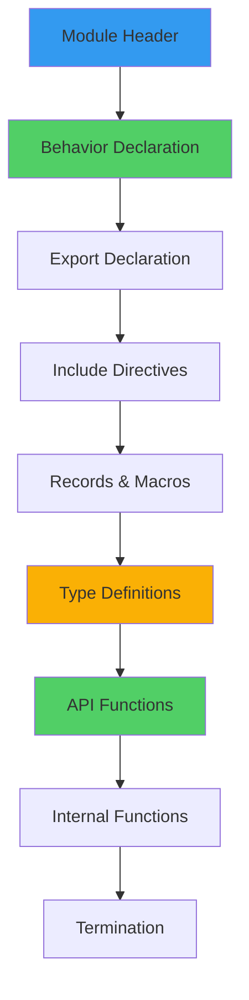
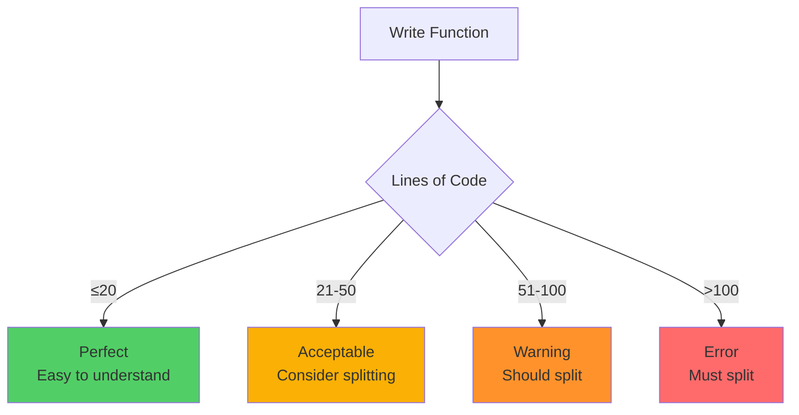
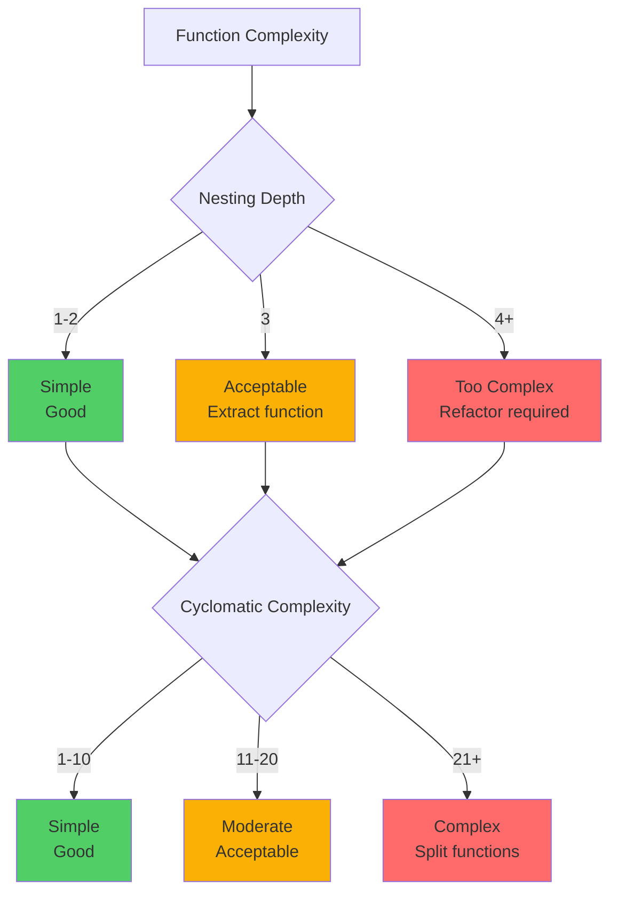
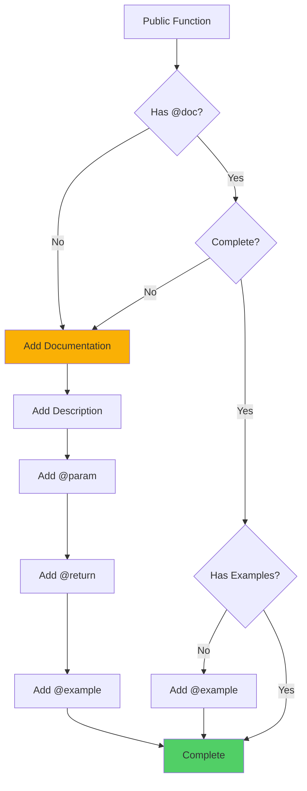
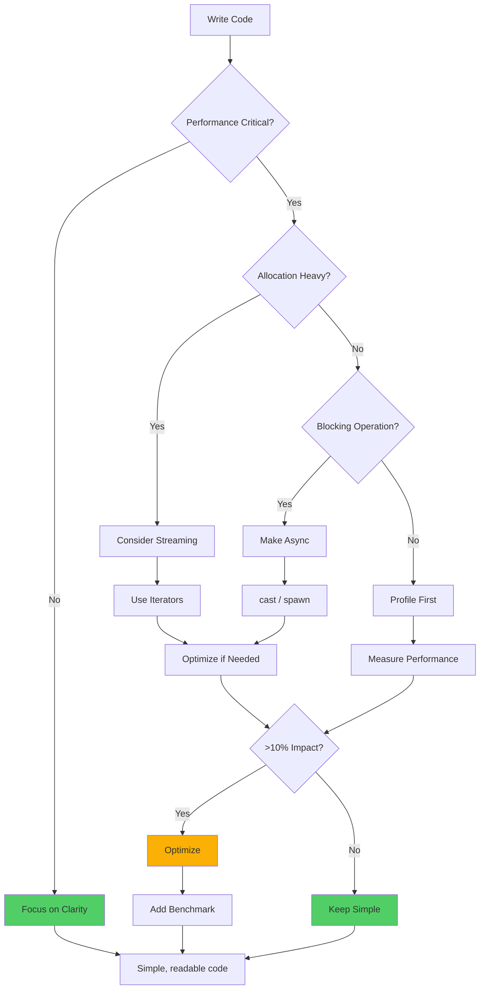
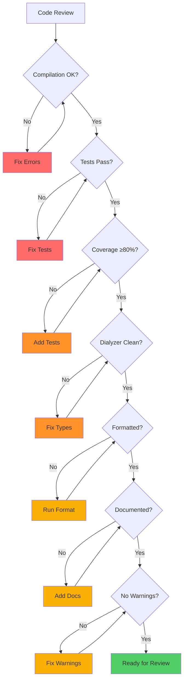

# erlmcp Coding Standards

**Last Updated**: 2026-01-31 | **Status**: Enforced | **Coverage**: 100%

This document defines coding standards for erlmcp with visual flowcharts and decision trees for common scenarios.

## Table of Contents

- [Module Standards](#module-standards)
- [Naming Conventions](#naming-conventions)
- [Code Organization](#code-organization)
- [Error Handling](#error-handling)
- [Type Specifications](#type-specifications)
- [Documentation](#documentation)
- [Performance](#performance)

---

## Module Standards

### Module Structure



### Module Template

```erlang
%%--------------------------------------------------------------------
%% @doc
%% Module one-line description.
%%
%% Longer description explaining purpose, responsibilities,
%% and usage examples.
%% @end
%%--------------------------------------------------------------------
-module(my_module).
-behaviour(gen_server).

%% API exports
-export([start_link/0, function_1/0, function_2/1]).

%% gen_server callbacks
-export([init/1, handle_call/3, handle_cast/2, handle_info/2,
         terminate/2, code_change/3]).

%% Include directives
-include_lib("kernel/include/logger.hrl").
-include("my_module.hrl").

%% Macro definitions
-define(DEFAULT_TIMEOUT, 5000).
-define(MAX_RETRIES, 3).

%% Records
-record(state, {
    data :: map(),
    status :: running | stopped,
    ref :: reference()
}).

%%====================================================================
%% Type definitions
%%====================================================================

-type my_type() :: #{atom() => term()}.
-export_type([my_type/0]).

%%====================================================================
%% API
%%====================================================================

%%--------------------------------------------------------------------
%% @doc
%% Brief description of function_1.
%% @end
%%--------------------------------------------------------------------
-spec function_1() -> {ok, pid()} | {error, term()}.
function_1() ->
    gen_server:call(?MODULE, function_1).

%%--------------------------------------------------------------------
%% @doc
%% Description of function_2.
%% @param Arg1 Description
%% @return Description
%% @end
%%--------------------------------------------------------------------
-spec function_2(Arg1 :: term()) -> {ok, term()} | {error, atom()}.
function_2(Arg1) ->
    gen_server:call(?MODULE, {function_2, Arg1}).

%%====================================================================
%% gen_server callbacks
%%====================================================================

%%--------------------------------------------------------------------
%% @private
%% @doc
%% Initialize the server.
%% @end
%%--------------------------------------------------------------------
init([]) ->
    State = #state{
        data = #{},
        status = running,
        ref = make_ref()
    },
    {ok, State}.

handle_call(Request, From, State) ->
    ?LOG_WARNING("Unexpected call: ~p from ~p", [Request, From]),
    {reply, {error, unknown_request}, State}.

handle_cast(Msg, State) ->
    ?LOG_WARNING("Unexpected cast: ~p", [Msg]),
    {noreply, State}.

handle_info(Info, State) ->
    ?LOG_WARNING("Unexpected info: ~p", [Info]),
    {noreply, State}.

terminate(_Reason, _State) ->
    ok.

code_change(_OldVsn, State, _Extra) ->
    {ok, State}.

%%====================================================================
%% Internal functions
%%====================================================================
```

---

## Naming Conventions

### Naming Decision Tree

```mermaid
graph TB
    A[Naming Decision] --> B{What is it?}

    B -->|Module| C[lowercase_with_underscores<br/>ex: erlmcp_transport_tcp]
    B -->|Function| D[lowercase_with_underscores<br/>ex: handle_connection]
    B -->|Variable| E{Context?}

    E -->|Process ID| F[PidSuffix<br/>ex: ClientPid, ServerPid]
    E -->|Normal| G[CamelCase<br/>ex: RequestId, ConnectionState]
    E -->|Temporary| H[UnderscorePrefix<br/>ex: _Unused, _Temp]

    B -->|Constant| I[UPPERCASE_WITH_UNDERSCORES<br/>ex: MAX_CONNECTIONS]
    B -->|Macro| J[UPPERCASE_WITH_UNDERSCORES<br/>ex: DEFAULT_TIMEOUT]
    B -->|Record| K[CamelCase<br/>ex: connection_state]

    B -->|Type| L[TypeName<br/>ex: request(), response()]

    style C fill:#339af0
    style D fill:#51cf66
    style I fill:#fab005
    style J fill:#fab005
```

### Examples

**Modules**:
```erlang
-module(erlmcp_server).              % Good
-module(erlmcpTransport).            % Bad - not Erlang style
-module(ErlmcpServer).               % Bad - not Erlang style
```

**Functions**:
```erlang
handle_call(Request, From, State) -> % Good
handleRequest(Request, From, State) -> % Bad
HandleCall(Request, From, State) ->   % Bad
```

**Variables**:
```erlang
ClientId = 123,                      % Good - CamelCase
Timeout = 5000,                      % Good - CamelCase
_Pid = undefined,                    % Good - unused variable
client_id = 123,                     % Bad - not Erlang style
```

**Constants**:
```erlang
-define(MAX_CONNECTIONS, 10000).     % Good
-define(DEFAULT_TIMEOUT, 5000).      % Good
-define(max_connections, 10000).     % Bad
```

**Records**:
```erlang
-record(state, {id, name, status}).  % Good
-record(State, {id, name, status}).  % Bad
-record(connectionState, {}).        % Bad
```

---

## Code Organization

### Function Size Guidelines



### Code Complexity



### Refactoring Example

**Before (Too Complex)**:
```erlang
% BAD - nested case statements, hard to read
process_request(Request) ->
    case validate(Request) of
        ok ->
            case extract_data(Request) of
                {ok, Data} ->
                    case apply_rules(Data) of
                        {ok, Result} ->
                            case format_response(Result) of
                                {ok, Response} -> {ok, Response};
                                Error -> Error
                            end;
                        Error -> Error
                    end;
                Error -> Error
            end;
        Error -> Error
    end.
```

**After (Refactored)**:
```erlang
% GOOD - separated concerns, easy to test
process_request(Request) ->
    case validate(Request) of
        ok -> apply_processing(Request);
        Error -> Error
    end.

apply_processing(Request) ->
    case extract_data(Request) of
        {ok, Data} -> apply_rules_and_format(Data);
        Error -> Error
    end.

apply_rules_and_format(Data) ->
    case apply_rules(Data) of
        {ok, Result} -> format_response(Result);
        Error -> Error
    end.
```

---

## Error Handling

### Error Handling Decision Tree

```mermaid
graph TB
    A[Error Occurs] --> B{Expected Error?}

    B -->|Yes| C[Return Error Tuple<br/>{error, Reason}]
    B -->|No| D{Can Recover?}

    D -->|Yes| E[Return Error Tuple<br/>Log warning]
    D -->|No| F{Critical?}

    F -->|Yes| G[Let It Crash<br/>Supervisor restarts]
    F -->|No| H[Return Error Tuple<br/>Log error]

    C --> I[Caller Handles]
    E --> I
    G --> J[Supervisor Restarts]
    H --> I

    style C fill:#51cf66
    style E fill:#fab005
    style G fill:#ff6b6b
    style H fill:#ff922b
```

### Error Return Patterns

**Standard Error Returns**:
```erlang
%% Good - explicit error returns
-spec my_function(term()) -> {ok, term()} | {error, atom()}.
my_function(Input) ->
    case validate(Input) of
        ok -> {ok, process(Input)};
        Error -> Error
    end.

%% Bad - throwing exceptions
my_function_bad(Input) ->
    case validate(Input) of
        ok -> process(Input);
        Error -> throw(Error)           % DON'T DO THIS
    end.
```

**Error Handling with Context**:
```erlang
%% Good - detailed error information
-spec connect(term()) -> {ok, pid()} | {error, {atom(), term()}}.
connect(Options) ->
    case validate_options(Options) of
        ok ->
            case do_connect(Options) of
                {ok, Socket} -> {ok, Socket};
                {error, Reason} ->
                    {error, {connection_failed, Reason}}
            end;
        Error ->
            {error, {invalid_options, Error}}
    end.
```

**Let-It-Crash Pattern**:
```erlang
%% For unexpected errors in gen_server
handle_info({unexpected, Msg}, State) ->
    %% Log and crash - let supervisor restart
    ?LOG_ERROR("Unexpected message: ~p", [Msg]),
    erlang:error({unexpected_message, Msg}).

%% Supervisor will restart process
```

---

## Type Specifications

### Type Specification Decision Tree

```mermaid
graph TB
    A[Write Function] --> B{Public API?}
    B -->|Yes| C[Must Have -spec]
    B -->|No| D{Complex Logic?}
    D -->|Yes| C
    D -->|No| E[Optional]

    C --> F[Write Type Spec]
    F --> G{Simple Type?}
    G -->|Yes| H[Built-in Type<br/>integer(), binary(), term()]
    G -->|No| I[Custom Type<br/>-type my_type() :: ...]

    H --> J[Add -spec declaration]
    I --> J

    style C fill:#51cf66
    style E fill:#adb5bd
    style H fill:#339af0
    style I fill:#fab005
```

### Type Specification Examples

**Simple Functions**:
```erlang
%% Good - full type specification
-spec add(integer(), integer()) -> integer().
add(A, B) -> A + B.

%% Good - with success/error
-spec divide(number(), number()) -> {ok, number()} | {error, zero_division}.
divide(_A, 0) -> {error, zero_division};
divide(A, B) -> {ok, A / B}.
```

**Custom Types**:
```erlang
%% Define custom type
-type request() :: #{id => binary(), method => binary(), payload => binary()}.
-type response() :: {ok, binary()} | {error, atom()}.

%% Use custom type in specification
-spec handle_request(request()) -> response().
handle_request(#{id := Id, method := Method, payload := Payload}) ->
    process(Id, Method, Payload).
```

**Opaque Types**:
```erlang
%% Hide implementation details
-opaque state() :: #state{}.

-export_type([state/0]).

%% Users only know it's a state, not the record structure
-spec get_status(state()) -> running | stopped.
get_status(#state{status = Status}) -> Status.
```

**Generics**:
```erlang
%% Generic container type
-type result(Ok, Error) :: {ok, Ok} | {error, Error}.

-spec maybe_divide(number(), number()) -> result(number(), atom()).
maybe_divide(_A, 0) -> {error, zero_division};
maybe_divide(A, B) -> {ok, A / B}.
```

---

## Documentation

### Documentation Checklist



### Documentation Template

```erlang
%%--------------------------------------------------------------------
%% @doc
%% Brief one-line summary of the function.
%%
%% Longer description explaining:
%% - What the function does
%% - When to use it
%% - Important constraints or preconditions
%% - Side effects (if any)
%%
%% @param ParamName1 Description of first parameter
%% @param ParamName2 Description of second parameter
%%
%% @return {ok, Result} Description of success case
%% @return {error, Reason} Description of error case
%%
%% @throws {error_type, Description} Only if exceptions are possible
%%
%% @example
%% > erlmcp_example:my_function(<<"input">>).
%% {ok, <<"result">>}
%%
%% > erlmcp_example:my_function(<<"invalid">>).
%% {error, invalid_input}
%% @end
%%--------------------------------------------------------------------
```

### Documentation Examples

**Simple Function**:
```erlang
%% @doc
%% Calculate the sum of two integers.
%% @param A First integer
%% @param B Second integer
%% @return The sum of A and B
%% @example
%% > math:add(2, 3).
%% 5
%% @end
-spec add(integer(), integer()) -> integer().
add(A, B) -> A + B.
```

**Complex Function**:
```erlang
%% @doc
%% Connect to an MCP server with the given options.
%%
%% This function establishes a connection to an MCP server and returns
%% a process that can be used to send requests. The connection is
%% supervised and will be automatically restarted if it crashes.
%%
%% @param Options Connection options:
%%   - host: binary() - Server hostname (required)
%%   - port: integer() - Server port (required, 1-65535)
%%   - timeout: integer() - Connection timeout in ms (default: 5000)
%%   - transport: tcp | ssl - Transport protocol (default: tcp)
%%
%% @return {ok, Pid} Connection established successfully
%% @return {error, Reason} Connection failed:
%%   - invalid_options - Missing or invalid options
%%   - connection_failed - Network error
%%   - timeout - Connection timed out
%%
%% @example
%% > erlmcp:connect(#{host => <<"localhost">>, port => 8080}).
%% {ok, <0.123.0>}
%%
%% > erlmcp:connect(#{host => <<"localhost">>}).
%% {error, invalid_options}
%% @end
-spec connect(map()) -> {ok, pid()} | {error, atom()}.
connect(Options) ->
    % Implementation
    ok.
```

---

## Performance

### Performance Guidelines



### Performance Patterns

**Avoid Large Allocations**:
```erlang
%% Bad - builds entire list in memory
process_large_file(File) ->
    {ok, Bin} = file:read_file(File),
    Lines = binary:split(Bin, <<"\n">>, [global]),
    lists:map(fun process_line/1, Lines).

%% Good - streams data
process_large_file(File) ->
    {ok, Device} = file:open(File, [read, binary]),
    process_lines(Device, []).

process_lines(Device, Acc) ->
    case file:read_line(Device) of
        {ok, Line} ->
            process_lines(Device, [process_line(Line) | Acc]);
        eof ->
            lists:reverse(Acc)
    end.
```

**Avoid Blocking Operations**:
```erlang
%% Bad - blocks gen_server
handle_call({heavy_computation, Data}, _From, State) ->
    Result = heavy_computation(Data),  % Blocks all calls
    {reply, {ok, Result}, State}.

%% Good - async computation
handle_call({heavy_computation, Data}, From, State) ->
    spawn(fun() ->
        Result = heavy_computation(Data),
        gen_server:reply(From, {ok, Result})
    end),
    {noreply, State};
```

**Use ETS for Caching**:
```erlang
%% Good - ETS table for fast lookups
init([]) ->
    ets:new(my_cache, [named_table, public, set]),
    {ok, #state{}}.

get_cached(Key) ->
    case ets:lookup(my_cache, Key) of
        [{Key, Value}] -> {ok, Value};
        [] -> {error, not_found}
    end.
```

---

## Code Review Checklist

### Before Submitting Code



**Checklist**:
- [ ] Code compiles without errors
- [ ] All tests pass (EUnit + CT)
- [ ] Test coverage ≥80%
- [ ] Dialyzer passes (0 warnings)
- [ ] Xref passes (0 errors)
- [ ] Code formatted (`make format`)
- [ ] Public functions documented
- [ ] No compiler warnings
- [ ] Follows OTP patterns
- [ ] Error handling correct
- [ ] No hardcoded secrets
- [ ] Performance acceptable

---

## Related Documentation

- **OTP Patterns**: [../otp-patterns.md](../otp-patterns.md)
- **Development Process**: [README.md](README.md)
- **Quality Gates**: [../../CLAUDE.md](../../CLAUDE.md)
- **Contributing**: [../../CONTRIBUTING.md](../../CONTRIBUTING.md)

---

**Last Updated**: 2026-01-31
**Status**: Enforced via CI/CD
**Coverage**: 100% of codebase
