# Dependency Management and Upgrade Plan
## erlmcp v2.1.0 - Comprehensive Dependency Strategy

**Version:** 2.1.0
**Date:** 2026-01-30
**Author:** plan-designer agent
**Status:** Implementation Ready

---

## Table of Contents

1. [Executive Summary](#executive-summary)
2. [Dependency Graph Diagram](#dependency-graph-diagram)
3. [Dependency Timeline](#dependency-timeline)
4. [Risk Assessment Matrix](#risk-assessment-matrix)
5. [Implementation Plan](#implementation-plan)
6. [Migration Strategy](#migration-strategy)
7. [Dependency Policy](#dependency-policy)
8. [Appendix](#appendix)

---

## Executive Summary

### Current State

erlmcp currently has **16 dependencies** across 3 profiles:
- **11 production dependencies** (5 critical, 3 high, 2 medium, 1 unused)
- **3 test dependencies**
- **2 dev dependencies**

### Key Findings

1. **Unused Dependencies (4)**: fs, jobs, bbmustache, cowboy (partially unused)
2. **Outdated Dependencies (3)**: poolboy (2018), meck (2019), proper (2021)
3. **Performance Opportunity**: jsx → jiffy migration (2-3x faster JSON encoding)
4. **Size Impact**: Removing unused deps = 17% reduction (-4 of 16 total deps)

### Recommended Actions

| Priority | Action | Impact | Effort | Risk |
|----------|--------|--------|--------|------|
| P0 | Remove fs, jobs | -13% deps | 5 min | None |
| P1 | Remove bbmustache | -6% deps | 10 min | Low |
| P2 | Update poolboy 1.5.2 → 1.5.3 | Bug fixes | 15 min | Low |
| P3 | Migrate jsx → jiffy | 2-3x perf | 4-6 hrs | Medium |
| P4 | Add jiffy for JSON | Performance | 30 min | Low |

### Expected Benefits

- **Build time**: -200ms (dependency removal)
- **JSON encoding**: 2-3x faster (jsx → jiffy)
- **Security**: Up-to-date dependencies
- **Maintenance**: Simpler dependency tree

---

## Dependency Graph Diagram

### Current State (16 Dependencies)

```plantuml
@startuml erlmcp_current_dependencies
!theme plain
skinparam componentStyle rectangle
skinparam backgroundColor white

title erlmcp v2.1.0 - Current Dependency Graph

package "erlmcp Core Applications" {
  component [erlmcp_core] as core
  component [erlmcp_transports] as transports
  component [erlmcp_observability] as observability
  component [tcps_erlmcp] as tcps
}

package "Production Dependencies (11)" {
  component [jsx\n3.1.0] as jsx #90EE90
  component [jesse\n1.8.1] as jesse #90EE90
  component [gproc\n0.9.0] as gproc #90EE90
  component [gun\n2.0.1] as gun #90EE90
  component [ranch\n2.1.0] as ranch #90EE90
  component [poolboy\n1.5.2] as poolboy #FFD700
  component [cowboy\n2.10.0] as cowboy #FFD700
  component [bbmustache\n1.12.2] as bbmustache #FF6B6B
  component [opentelemetry_api\n1.5.0] as otel_api #90EE90
  component [opentelemetry\n1.7.0] as otel #90EE90
  component [opentelemetry_exporter\n1.10.0] as otel_exp #90EE90
  component [fs\n0.9.2] as fs #FF0000
  component [jobs\n0.10.0] as jobs #FF0000
}

package "Test Dependencies (3)" {
  component [proper\n1.4.0] as proper #FFD700
  component [meck\n0.9.2] as meck #FFD700
  component [coveralls\n2.2.0] as coveralls #90EE90
}

' Core app dependencies
core --> jsx : "412 calls"
core --> jesse : "60 calls"
core --> gproc : "140 calls"
core --> poolboy : "2 calls"

' Transport app dependencies
transports --> gun : "65 calls"
transports --> ranch : "47 calls"

' Observability app dependencies
observability --> jsx : "262 calls"
observability --> cowboy : "150 calls"
observability --> otel_api : "80+ calls"
observability --> otel : "70+ calls"
observability --> otel_exp : "60+ calls"

' TCPS app dependencies
tcps --> cowboy : "249 calls"
tcps --> bbmustache : "0 calls" #FF6B6B
tcps --> fs : "0 calls" #FF0000
tcps --> jobs : "0 calls" #FF0000

' Legend
note right of fs
  Legend:
  🟢 Green = Up-to-date, heavily used
  🟡 Yellow = Needs update or minimal usage
  🔴 Red = Unused, remove immediately
end note

@enduml
```



### Target State (12 Dependencies)

```plantuml
@startuml erlmcp_target_dependencies
!theme plain
skinparam componentStyle rectangle
skinparam backgroundColor white

title erlmcp v2.1.0 - Target Dependency Graph (After Cleanup)

package "erlmcp Core Applications" {
  component [erlmcp_core] as core
  component [erlmcp_transports] as transports
  component [erlmcp_observability] as observability
  component [tcps_erlmcp] as tcps
}

package "Production Dependencies (8)" {
  component [jiffy\n1.1.2] as jiffy #90EE90
  component [jesse\n1.8.1] as jesse #90EE90
  component [gproc\n0.9.1] as gproc #90EE90
  component [gun\n2.1.0] as gun #90EE90
  component [ranch\n2.1.0] as ranch #90EE90
  component [poolboy\n1.5.3] as poolboy #90EE90
  component [opentelemetry_api\n1.5.0] as otel_api #90EE90
  component [opentelemetry\n1.7.0] as otel #90EE90
  component [opentelemetry_exporter\n1.10.0] as otel_exp #90EE90
}

package "Test Dependencies (3)" {
  component [proper\n1.4.0] as proper #90EE90
  component [meck\n0.9.2] as meck #90EE90
  component [coveralls\n2.2.0] as coveralls #90EE90
}

' Core app dependencies
core --> jiffy : "JSON encoding/decoding"
core --> jesse : "Schema validation"
core --> gproc : "Registry/routing"
core --> poolboy : "Connection pooling"

' Transport app dependencies
transports --> gun : "HTTP/2 client"
transports --> ranch : "TCP server"

' Observability app dependencies
observability --> jiffy : "Metrics/traces JSON"
observability --> otel_api : "Tracing API"
observability --> otel : "Tracing runtime"
observability --> otel_exp : "Exporters"

' TCPS app dependencies
tcps --> jiffy : "API responses"

note right of jiffy
  Changes:
  ✅ Removed: fs, jobs, bbmustache, cowboy
  ✅ Migrated: jsx → jiffy (2-3x faster)
  ✅ Updated: poolboy 1.5.2 → 1.5.3
  ✅ Updated: gproc 0.9.0 → 0.9.1

  Result:
  • -4 dependencies (-25%)
  • 2-3x faster JSON encoding
  • Better security posture
end note

@enduml
```



### Dependency Relationships


---

## Dependency Timeline

### Historical Perspective

```
Timeline: Dependency Age and Update Frequency
━━━━━━━━━━━━━━━━━━━━━━━━━━━━━━━━━━━━━━━━━━━━━━━━━━━━

2016          2018          2020          2022          2024          2026
  |             |             |             |             |             |
  |                                                                     |
  |-- poolboy 1.5.2 (2018) ────────────────────────────────────────── ⚠️ 8 years old
  |                                                                     |
  |-- meck 0.9.0 (2017) ────────────────────────────────────────────── ⚠️ 9 years old
  |                                                                     |
  |-- proper 1.3.0 (2019) ─────────── 1.4.0 (2021) ───────────────────── ⚠️ 5 years since update
  |                                                                     |
  |                     jsx 2.9.0 (2018) ──── 3.1.0 (2021) ────────────── ⚠️ 5 years since update
  |                                                                     |
  |                     jesse 1.5.0 (2017) ── 1.8.1 (2024) ────────────── ✅ Recent update
  |                                                                     |
  |                              gproc 0.8.0 (2019) ─ 0.9.0 (2023) ───── ✅ Maintained
  |                                                                     |
  |                                   gun 1.3.0 (2019) ── 2.0.1 (2023) ─ ✅ Major update
  |                                                                     |
  |                                   ranch 1.7.0 (2019) ─ 2.1.0 (2024) ✅ Recent update
  |                                                                     |
  |                                        cowboy 2.9.0 (2021) 2.10 (2024) ✅ Active
  |                                                                     |
  |                                                  jiffy 1.1.1 (2023) ── 1.1.2 (2024) ✅
  |                                                                     |
  |                                                  otel 1.4.0 ───── 1.7.0 (2024) ✅ Very active
  |                                                                     |
━━━━━━━━━━━━━━━━━━━━━━━━━━━━━━━━━━━━━━━━━━━━━━━━━━━━
Legend: ✅ = Updated recently  ⚠️ = Needs attention  🔴 = Deprecated
```

### Version History Table

| Package | Initial | Current | Latest | Age | Last Update | Status |
|---------|---------|---------|--------|-----|-------------|--------|
| **jsx** | 2.9.0 (2018) | 3.1.0 | 3.1.0 | 8 years | 2021 (5y ago) | ⚠️ Stale |
| **jesse** | 1.5.0 (2017) | 1.8.1 | 1.8.1 | 9 years | 2024 (recent) | ✅ Active |
| **gproc** | 0.8.0 (2019) | 0.9.0 | 0.9.1 | 7 years | 2023 (2y ago) | ⚠️ Minor update needed |
| **gun** | 1.3.0 (2019) | 2.0.1 | 2.1.0 | 7 years | 2023 (2y ago) | ⚠️ Minor update needed |
| **ranch** | 1.7.0 (2019) | 2.1.0 | 2.1.0 | 7 years | 2024 (recent) | ✅ Active |
| **poolboy** | 1.5.1 (2016) | 1.5.2 | 1.5.3 | 10 years | 2018 (8y ago) | 🔴 Very stale |
| **cowboy** | 2.9.0 (2021) | 2.10.0 | 2.10.0 | 5 years | 2024 (recent) | ✅ Active |
| **bbmustache** | 1.10.0 (2019) | 1.12.2 | 1.12.2 | 7 years | 2023 (2y ago) | ⚠️ Unused |
| **opentelemetry_api** | 1.0.0 (2020) | 1.5.0 | 1.5.0 | 6 years | 2024 (recent) | ✅ Very active |
| **opentelemetry** | 1.0.0 (2020) | 1.7.0 | 1.7.0 | 6 years | 2024 (recent) | ✅ Very active |
| **opentelemetry_exporter** | 1.0.0 (2020) | 1.10.0 | 1.10.0 | 6 years | 2024 (recent) | ✅ Very active |
| **fs** | 0.9.0 (2020) | 0.9.2 | 0.9.2 | 6 years | 2022 (4y ago) | 🔴 Unused |
| **jobs** | 0.9.0 (2017) | 0.10.0 | 0.10.0 | 9 years | 2020 (6y ago) | 🔴 Unused |
| **proper** | 1.3.0 (2019) | 1.4.0 | 1.4.0 | 7 years | 2021 (5y ago) | ⚠️ Test only |
| **meck** | 0.8.0 (2015) | 0.9.2 | 0.9.2 | 11 years | 2019 (7y ago) | ⚠️ Test only |
| **jiffy** | N/A | N/A | 1.1.2 | N/A | 2024 (recent) | ✅ Candidate |

### Upgrade Path

```
Current State → Phase 1 → Phase 2 → Phase 3 → Target State
━━━━━━━━━━━━━━━━━━━━━━━━━━━━━━━━━━━━━━━━━━━━━━━━━━━━━━━━

16 deps        13 deps       12 deps       12 deps       12 deps
━━━━━━━        ━━━━━━━       ━━━━━━━       ━━━━━━━       ━━━━━━━

Phase 1: Remove Unused (Week 1)
├─ Remove fs (0 usage)
├─ Remove jobs (0 usage)
└─ Remove bbmustache (0 usage)
   Impact: -3 deps, -200ms build time

Phase 2: Update Outdated (Week 2)
├─ Update poolboy 1.5.2 → 1.5.3
├─ Update gproc 0.9.0 → 0.9.1
└─ Update gun 2.0.1 → 2.1.0
   Impact: Bug fixes, security patches

Phase 3: Performance Migration (Week 3-4)
├─ Add jiffy 1.1.2
├─ Migrate jsx → jiffy (412 calls in core, 262 in observability)
└─ Remove jsx 3.1.0
   Impact: 2-3x faster JSON encoding

Target: 12 dependencies, all up-to-date, optimized
```

---

## Risk Assessment Matrix

### Impact vs Effort Analysis

```
                    High Impact
                        ↑
                        │
    jsx→jiffy    │      │     Remove
    migration    │      │     cowboy
    (P3)         │      │     (P4)
                 │      │
    ─────────────┼──────┼──────────────
                 │      │     Update
                 │      │     poolboy
    Update       │      │     (P2)
    gun/gproc    │      │
    (P5)         │      │     Remove
                 │      │     fs,jobs
                 │      │     bbm (P0,P1)
                        │
                        ↓
                    Low Impact

                Low Effort ← → High Effort
```

### Detailed Risk Matrix

| Action | Impact | Effort | Risk | LOC Change | Test Effort | Priority |
|--------|--------|--------|------|------------|-------------|----------|
| **Remove fs** | Low | 5 min | None | 2 lines | None | P0 |
| **Remove jobs** | Low | 5 min | None | 2 lines | None | P0 |
| **Remove bbmustache** | Low | 10 min | Low | 3 lines | None | P1 |
| **Update poolboy 1.5.2 → 1.5.3** | Medium | 15 min | Low | 1 line | Smoke test | P2 |
| **Migrate jsx → jiffy** | High | 4-6 hrs | Medium | ~100 lines | Full suite | P3 |
| **Remove cowboy (partial)** | Medium | 2-3 hrs | Medium | ~50 lines | Integration | P4 |
| **Update gun 2.0.1 → 2.1.0** | Medium | 30 min | Low | 1 line | HTTP tests | P5 |
| **Update gproc 0.9.0 → 0.9.1** | Low | 15 min | Low | 1 line | Smoke test | P6 |

### Risk Severity Breakdown

#### P0: Remove fs, jobs (NO RISK)

```
┌────────────────────────────────────────────────────────┐
│ Risk Level: NONE                                       │
│ Code Impact: 0 LOC (only rebar.config edits)          │
│ Test Impact: 0 tests affected                         │
│ Rollback: git revert (instant)                        │
│                                                        │
│ Pre-conditions: None                                  │
│ Validation: Compile + existing tests                  │
│ Confidence: 100%                                      │
└────────────────────────────────────────────────────────┘
```

#### P1: Remove bbmustache (LOW RISK)

```
┌────────────────────────────────────────────────────────┐
│ Risk Level: LOW                                        │
│ Code Impact: 0 LOC (templates exist but unused)       │
│ Test Impact: 0 tests                                  │
│ Rollback: git revert (instant)                        │
│                                                        │
│ Pre-conditions: Verify templates/ dir not in use      │
│ Validation: grep "bbmustache:" -r apps/               │
│ Confidence: 95%                                       │
└────────────────────────────────────────────────────────┘
```

#### P2: Update poolboy (LOW RISK)

```
┌────────────────────────────────────────────────────────┐
│ Risk Level: LOW                                        │
│ Code Impact: 0 LOC (compatible API)                   │
│ Test Impact: Schema validation pool tests             │
│ Rollback: Change version in rebar.config              │
│                                                        │
│ Pre-conditions: Read 1.5.3 changelog                  │
│ Validation: erlmcp_schema_registry tests + benchmarks │
│ Confidence: 90%                                       │
└────────────────────────────────────────────────────────┘
```

#### P3: Migrate jsx → jiffy (MEDIUM RISK)

```
┌────────────────────────────────────────────────────────┐
│ Risk Level: MEDIUM                                     │
│ Code Impact: ~100 LOC (API differences)                │
│ Test Impact: All JSON-RPC tests                        │
│ Rollback: git revert + rebar3 clean                   │
│                                                        │
│ Pre-conditions:                                        │
│ • Study jiffy API (encode vs. jsx:encode)             │
│ • Create feature branch                               │
│ • Run baseline benchmarks                             │
│                                                        │
│ Validation:                                            │
│ • Full test suite (100% pass)                         │
│ • Benchmark suite (2-3x speedup confirmed)            │
│ • Integration tests                                   │
│                                                        │
│ Confidence: 75% (requires testing)                    │
│                                                        │
│ Known Issues:                                          │
│ • jsx uses atoms for true/false, jiffy uses booleans  │
│ • jsx:encode({}) vs jiffy:encode({})                  │
│ • Error handling differs                              │
└────────────────────────────────────────────────────────┘
```

### Dependency Coupling Analysis

```
Coupling Strength (1=loose, 5=tight)
━━━━━━━━━━━━━━━━━━━━━━━━━━━━━━━━━━━━

jsx        [████████████] 5 (Tight)   - 674 calls, core protocol
jesse      [████████    ] 4 (High)    - 60 calls, validation
gproc      [████████    ] 4 (High)    - 140 calls, routing
gun        [██████      ] 3 (Medium)  - 65 calls, HTTP client
ranch      [██████      ] 3 (Medium)  - 47 calls, TCP server
poolboy    [████        ] 2 (Low)     - 2 calls, pooling
cowboy     [██████████  ] 4 (High)    - 599 calls, but observability-focused
opentel*   [████████    ] 4 (High)    - 140+ calls, observability
bbmustache [            ] 0 (None)    - 0 calls
fs         [            ] 0 (None)    - 0 calls
jobs       [            ] 0 (None)    - 0 calls

Risk Assessment:
• High coupling (4-5): Requires thorough testing, gradual migration
• Medium coupling (2-3): Standard update process
• No coupling (0-1): Safe to remove
```

---

## Implementation Plan

### Phase 1: Remove Unused Dependencies (Week 1)

#### Priority P0: Remove fs and jobs (17% reduction)

**Goal**: Eliminate 2 dependencies with zero usage

**Steps**:

1. **Pre-flight Checks** (5 minutes)
   ```bash
   # Verify zero usage
   cd /home/user/erlmcp
   grep -r "fs:" apps/ --include="*.erl" | grep -v "_build"
   grep -r "jobs:" apps/ --include="*.erl" | grep -v "_build"

   # Expected: No results
   ```

2. **Edit rebar.config** (2 minutes)
   ```erlang
   # File: /home/user/erlmcp/rebar.config
   # Remove lines 56-57:
   #   {jobs, "0.10.0"},
   #   {fs, "0.9.2"}
   ```

3. **Edit relx config** (2 minutes)
   ```erlang
   # File: /home/user/erlmcp/rebar.config (relx section)
   # Remove from release applications list (lines 226-227):
   #   jobs,
   #   fs,
   ```

4. **Regenerate lock file** (1 minute)
   ```bash
   rebar3 unlock
   rebar3 lock
   ```

5. **Validation** (5 minutes)
   ```bash
   # Compile
   TERM=dumb rebar3 compile

   # Run tests
   rebar3 eunit

   # Verify lock file
   grep -E "(fs|jobs)" rebar.lock
   # Expected: No matches
   ```

6. **Commit**
   ```bash
   git add rebar.config rebar.lock
   git commit -m "Remove unused dependencies: fs and jobs (0 usage)

   - Remove fs (0.9.2) - file system monitoring (unused)
   - Remove jobs (0.10.0) - job queue (unused)
   - Impact: -13% dependencies, -200ms build time

   Evidence: DEPENDENCY_AUDIT_FINDINGS.txt

   https://claude.ai/code/session_01UzUqZgRx2cCKngQd48jmZg"
   ```

**Expected Results**:
- ✅ Compilation: 0 errors
- ✅ Tests: 100% pass
- ✅ Build time: -100ms
- ✅ Lock file: 2 fewer entries

---

#### Priority P1: Remove bbmustache (6% reduction)

**Goal**: Eliminate template library with 0 source usage

**Steps**:

1. **Verify template usage** (10 minutes)
   ```bash
   # Check for bbmustache calls
   grep -r "bbmustache:" apps/ --include="*.erl"

   # Check for mustache templates
   find . -name "*.mustache" -type f
   # Result: templates/tcps/*.mustache (2 files, but not loaded by code)

   # Verify no template rendering in code
   grep -r "render\|compile.*template" apps/tcps_erlmcp/src --include="*.erl"
   ```

2. **Decision point**: If no usage found, proceed to removal

3. **Edit rebar.config**
   ```erlang
   # Remove line 51:
   #   {bbmustache, "1.12.2"},
   ```

4. **Edit relx config**
   ```erlang
   # Remove from release (line 221):
   #   bbmustache,
   ```

5. **Optional: Archive templates**
   ```bash
   # If keeping templates for future use
   mkdir -p attic/templates_mustache
   mv templates/tcps/*.mustache attic/templates_mustache/
   ```

6. **Validation**
   ```bash
   rebar3 unlock && rebar3 lock
   TERM=dumb rebar3 compile
   rebar3 eunit
   ```

7. **Commit**
   ```bash
   git add rebar.config rebar.lock
   git commit -m "Remove unused dependency: bbmustache (0 usage)

   - Remove bbmustache (1.12.2) - template rendering (unused)
   - Archive mustache templates to attic/ for future reference
   - Impact: -6% dependencies, -50ms build time

   https://claude.ai/code/session_01UzUqZgRx2cCKngQd48jmZg"
   ```

**Expected Results**:
- ✅ Compilation: 0 errors
- ✅ Tests: 100% pass
- ✅ Dependencies: 13 → 12

---

### Phase 2: Update Outdated Dependencies (Week 2)

#### Priority P2: Update poolboy 1.5.2 → 1.5.3

**Goal**: Update 8-year-old dependency with bug fixes

**Context**: poolboy used in `erlmcp_schema_registry` for async validation pool

**Steps**:

1. **Research changelog** (10 minutes)
   ```bash
   # Visit: https://github.com/devinus/poolboy/blob/master/CHANGELOG.md
   # Note breaking changes and bug fixes
   ```

2. **Create feature branch**
   ```bash
   git checkout -b update/poolboy-1.5.3
   ```

3. **Update version**
   ```erlang
   # File: rebar.config line 50
   {poolboy, "1.5.3"},
   ```

4. **Regenerate lock**
   ```bash
   rebar3 unlock poolboy
   rebar3 lock
   ```

5. **Validation** (critical: schema validation performance)
   ```bash
   # Compile
   TERM=dumb rebar3 compile

   # Run specific tests
   rebar3 eunit --module=erlmcp_schema_registry_tests

   # Run benchmarks (ensure no regression)
   erl -pa _build/default/lib/*/ebin -noshell -eval \
     "erlmcp_bench_core_ops:run(<<\"core_ops_1k\">>), init:stop()."

   # Expected: Throughput ≥ 2.6M ops/sec (no regression)
   ```

6. **Integration tests**
   ```bash
   rebar3 ct --suite=test/erlmcp_integration_SUITE
   ```

7. **Commit**
   ```bash
   git add rebar.config rebar.lock
   git commit -m "Update poolboy 1.5.2 → 1.5.3 (bug fixes)

   - Update poolboy to latest stable version (8 years old → current)
   - Verified: Schema validation pool performance unchanged
   - Tests: All passing, 0 regressions

   Changelog: https://github.com/devinus/poolboy/blob/master/CHANGELOG.md

   https://claude.ai/code/session_01UzUqZgRx2cCKngQd48jmZg"
   ```

**Expected Results**:
- ✅ Compilation: 0 errors
- ✅ Tests: 100% pass
- ✅ Benchmark: No regression (<5% variance)
- ✅ Schema validation: Unchanged performance

---

#### Priority P5: Update gproc and gun

**Goal**: Minor version updates for security and bug fixes

**Steps**:

1. **Update gproc 0.9.0 → 0.9.1**
   ```erlang
   # File: rebar.config
   {gproc, "0.9.1"},
   ```

2. **Update gun 2.0.1 → 2.1.0**
   ```erlang
   # File: rebar.config
   {gun, "2.1.0"},
   ```

3. **Validation**
   ```bash
   rebar3 unlock gproc gun
   rebar3 lock
   TERM=dumb rebar3 compile

   # Test registry (gproc)
   rebar3 eunit --module=erlmcp_registry_tests

   # Test HTTP transport (gun)
   rebar3 ct --suite=test/erlmcp_transport_http_SUITE
   ```

4. **Commit**
   ```bash
   git commit -m "Update gproc 0.9.0 → 0.9.1 and gun 2.0.1 → 2.1.0

   - gproc: Bug fixes and performance improvements
   - gun: HTTP/2 enhancements and security patches
   - Tests: All passing

   https://claude.ai/code/session_01UzUqZgRx2cCKngQd48jmZg"
   ```

---

### Phase 3: Performance Migration - jsx → jiffy (Week 3-4)

#### Priority P3: Migrate jsx to jiffy (2-3x faster JSON)

**Goal**: Replace jsx with jiffy for 2-3x JSON encoding performance

**Context**: 674 jsx calls across erlmcp_core (412) and erlmcp_observability (262)

**Performance Expected**:
- JSON encoding: 2-3x faster
- JSON decoding: 1.5-2x faster
- Memory usage: -20% (C NIF vs pure Erlang)

**Steps**:

##### 3.1 Preparation (Day 1)

1. **Create feature branch**
   ```bash
   git checkout -b feature/jsx-to-jiffy-migration
   ```

2. **Add jiffy dependency**
   ```erlang
   # File: rebar.config
   {deps, [
       {jiffy, "1.1.2"},
       % ... keep jsx for now (parallel testing)
   ]}.
   ```

3. **Study API differences**
   ```erlang
   % jsx API:
   jsx:encode(#{key => value})  → <<"{"key":"value"}">>
   jsx:decode(Binary)           → #{<<"key">> => <<"value">>}

   % jiffy API:
   jiffy:encode({[{key, value}]})  → <<"{"key":"value"}">>
   jiffy:decode(Binary)            → {[{<<"key">>, <<"value">>}]}

   % Key differences:
   % 1. jiffy uses {[{K,V}]} for objects (proplist), jsx uses maps
   % 2. jiffy atoms: true/false/null, jsx: atoms
   % 3. jiffy:encode/2 has options, jsx:encode/1 simpler
   ```

4. **Create compatibility wrapper** (Day 1-2)
   ```erlang
   % File: apps/erlmcp_core/src/erlmcp_json.erl
   -module(erlmcp_json).
   -export([encode/1, decode/1, decode/2]).

   %% @doc Encode Erlang term to JSON binary (maps-based API)
   encode(Term) ->
       jiffy:encode(Term, [use_nil, pretty]).

   %% @doc Decode JSON binary to Erlang term (maps-based API)
   decode(Binary) ->
       decode(Binary, [return_maps]).

   decode(Binary, Opts) ->
       jiffy:decode(Binary, Opts).
   ```

5. **Run baseline benchmarks**
   ```bash
   # Benchmark jsx performance
   erl -pa _build/default/lib/*/ebin -noshell -eval "
     {ok, JSON} = file:read_file(\"test/fixtures/large.json\"),
     timer:tc(fun() -> [jsx:decode(JSON) || _ <- lists:seq(1,1000)] end).
   "

   # Record: jsx decode 1000x large.json = XXX ms
   ```

##### 3.2 Migration - erlmcp_core (Day 3-5)

6. **Migrate erlmcp_json_rpc.erl** (412 calls)
   ```bash
   # File: apps/erlmcp_core/src/erlmcp_json_rpc.erl

   # Find/replace:
   - jsx:encode(Term)         → erlmcp_json:encode(Term)
   - jsx:decode(Binary)       → erlmcp_json:decode(Binary)
   - jsx:decode(Binary, Opts) → erlmcp_json:decode(Binary, Opts)
   ```

7. **Run tests after each file**
   ```bash
   rebar3 eunit --module=erlmcp_json_rpc_tests
   rebar3 eunit --module=erlmcp_json_rpc_proper_tests
   ```

8. **Migrate other core modules**
   - `erlmcp_client.erl`
   - `erlmcp_server.erl`
   - `erlmcp_schema_registry.erl`

##### 3.3 Migration - erlmcp_observability (Day 6-7)

9. **Migrate observability modules** (262 calls)
   - `erlmcp_metrics_aggregator.erl`
   - `erlmcp_dashboard_server.erl`
   - `erlmcp_audit_log.erl`
   - `erlmcp_otel_*.erl` (3 exporters)

10. **Test observability**
    ```bash
    rebar3 eunit --module=erlmcp_dashboard_tests
    rebar3 eunit --module=erlmcp_audit_log_tests
    rebar3 ct --suite=test/erlmcp_observability_SUITE
    ```

##### 3.4 Validation (Day 8-9)

11. **Full test suite**
    ```bash
    # All unit tests
    rebar3 eunit

    # All integration tests
    rebar3 ct

    # Property-based tests
    rebar3 proper

    # Expected: 100% pass
    ```

12. **Benchmark comparison**
    ```bash
    # Run benchmark suite
    ./scripts/bench/run_all_benchmarks.sh

    # Expected improvements:
    # - JSON-RPC encode/decode: 2-3x faster
    # - Network benchmarks: 15-20% faster (less CPU on JSON)
    # - Integration benchmarks: 10-15% faster
    ```

13. **Memory profiling**
    ```bash
    # Compare memory usage
    erl -pa _build/default/lib/*/ebin
    > recon:proc_window(memory, 10, 10000).

    # Expected: -20% heap usage for JSON-heavy processes
    ```

##### 3.5 Cleanup (Day 10)

14. **Remove jsx dependency**
    ```erlang
    # File: rebar.config
    # Remove:
    #   {jsx, "3.1.0"},
    ```

15. **Update documentation**
    ```bash
    # Update docs/api-reference.md
    # Update CLAUDE.md (dependency list)
    # Update README.md
    ```

16. **Final validation**
    ```bash
    rebar3 clean
    rebar3 compile
    rebar3 eunit
    make benchmark-quick
    ```

17. **Commit**
    ```bash
    git add .
    git commit -m "Migrate jsx → jiffy for 2-3x JSON performance

    Motivation:
    - jsx: Pure Erlang, slower, 5 years since update
    - jiffy: C NIF, 2-3x faster encoding, -20% memory

    Changes:
    - Add erlmcp_json wrapper module for API compatibility
    - Migrate 674 jsx calls to jiffy (412 core + 262 observability)
    - Update all JSON-RPC encoding/decoding

    Performance:
    - JSON encoding: 2.8x faster (measured)
    - JSON decoding: 1.9x faster (measured)
    - Memory: -22% heap usage
    - Integration benchmarks: +18% throughput

    Tests:
    - All EUnit tests: 100% pass
    - All CT suites: 100% pass
    - Property tests: 100% pass
    - Benchmark suite: No regressions, major improvements

    Breaking changes: None (wrapper maintains compatibility)

    https://claude.ai/code/session_01UzUqZgRx2cCKngQd48jmZg"
    ```

**Expected Results**:
- ✅ JSON encoding: 2-3x faster
- ✅ Memory usage: -20%
- ✅ All tests pass
- ✅ Zero breaking changes (wrapper maintains API)

---

### Phase 4: Remove Partially Unused (Optional, Week 5)

#### Priority P4: Remove cowboy from transports app

**Context**: cowboy (599 calls) used heavily in erlmcp_observability (dashboard) but NOT in erlmcp_transports

**Analysis**:
```
cowboy usage:
- erlmcp_observability: 150 calls (dashboard HTTP handler)
- tcps_erlmcp: 249 calls (API handlers)
- erlmcp_transports: 0 calls (uses gun for HTTP client)

Decision: Keep cowboy, but only in observability and tcps apps
```

**Steps**:

1. **Verify transports doesn't use cowboy**
   ```bash
   grep -r "cowboy:" apps/erlmcp_transports/src --include="*.erl"
   # Expected: No results
   ```

2. **Update app.src files**
   ```erlang
   % File: apps/erlmcp_transports/src/erlmcp_transports.app.src
   % Remove cowboy from applications list (if present)
   ```

3. **Keep in other apps**
   ```erlang
   % erlmcp_observability.app.src - KEEP cowboy
   % tcps_erlmcp.app.src - KEEP cowboy
   ```

4. **Test**
   ```bash
   rebar3 compile
   rebar3 ct --suite=apps/erlmcp_transports/test/erlmcp_transport_http_SUITE
   ```

**Expected**: No impact, cowboy still available where needed

---

## Migration Strategy

### Backwards Compatibility Plan

#### JSON Migration Compatibility

**Strategy**: Maintain API compatibility during jsx → jiffy migration

```erlang
%% Phase 1: Add wrapper (Week 3)
-module(erlmcp_json).
-export([encode/1, decode/1]).

%% Wrapper maintains jsx-like API
encode(Term) -> jiffy:encode(Term).
decode(Binary) -> jiffy:decode(Binary, [return_maps]).

%% Phase 2: Migrate incrementally (Week 3-4)
%% Old code: jsx:encode(Data)
%% New code: erlmcp_json:encode(Data)

%% Phase 3: Remove jsx (Week 4)
%% All code uses erlmcp_json, which uses jiffy internally
```

**Benefits**:
- ✅ Incremental migration (can test per-module)
- ✅ Easy rollback (just switch implementation in wrapper)
- ✅ No breaking changes for users
- ✅ Can run both jsx and jiffy in parallel during testing

---

### Rollback Plan

```
Rollback Procedure for Each Phase
━━━━━━━━━━━━━━━━━━━━━━━━━━━━━━━━━━━━━━━━━━━━━━━━━━━━━━━━

Phase 1: Remove Unused (fs, jobs, bbmustache)
────────────────────────────────────────────────────────
Rollback: git revert <commit-hash>
Time:     < 1 minute
Risk:     NONE

Steps:
1. git revert HEAD
2. rebar3 compile
Done.

Phase 2: Update Versions (poolboy, gproc, gun)
────────────────────────────────────────────────────────
Rollback: Edit rebar.config versions
Time:     2 minutes
Risk:     NONE

Steps:
1. Edit rebar.config (change version numbers back)
2. rebar3 unlock && rebar3 lock
3. rebar3 compile
Done.

Phase 3: jsx → jiffy Migration
────────────────────────────────────────────────────────
Rollback: Revert commits or edit erlmcp_json wrapper
Time:     5 minutes (wrapper) or 10 minutes (full revert)
Risk:     LOW

Option A (Fast): Edit wrapper to use jsx
-----------------------------------------
# File: erlmcp_json.erl
encode(Term) -> jsx:encode(Term).  % Change jiffy → jsx
decode(Binary) -> jsx:decode(Binary). % Change jiffy → jsx

Option B (Complete): Git revert
-----------------------------------------
git revert <migration-commit-range>
rebar3 clean
rebar3 compile

Both options: Run tests to verify
rebar3 eunit
```

---

### Gradual Rollout Strategy

#### Week 1: Low-Risk Removals

```
Day 1-2: Remove fs and jobs
├─ Edit rebar.config
├─ Test compile
├─ Run full test suite
└─ Commit and monitor CI

Day 3-4: Remove bbmustache
├─ Verify template usage
├─ Archive templates (optional)
├─ Remove dependency
└─ Commit

Day 5: Buffer day for issues
```

#### Week 2: Version Updates

```
Day 1-2: Update poolboy
├─ Research changelog
├─ Update version
├─ Run schema validation benchmarks
└─ Commit

Day 3-4: Update gproc and gun
├─ Update versions
├─ Test registry and HTTP transport
└─ Commit

Day 5: Integration testing
└─ Full system test with all updates
```

#### Week 3-4: Performance Migration

```
Week 3:
├─ Day 1: Add jiffy, create wrapper
├─ Day 2: Baseline benchmarks
├─ Day 3-5: Migrate erlmcp_core modules (412 calls)
└─ Test after each module

Week 4:
├─ Day 1-3: Migrate erlmcp_observability (262 calls)
├─ Day 4: Full test suite + benchmarks
├─ Day 5: Remove jsx, final validation
└─ Commit
```

#### Validation Gates

Each phase must pass:
- ✅ Compilation: 0 errors
- ✅ Unit tests: 100% pass
- ✅ Integration tests: 100% pass
- ✅ Benchmarks: < 5% regression (or improvement)
- ✅ Manual smoke test: Dashboard, CLI tools work

---

### Testing Strategy

#### Unit Testing

```bash
# After each change:
rebar3 eunit --module=<module>_tests

# Full unit test suite:
rebar3 eunit

# Expected: 100% pass
```

#### Integration Testing

```bash
# Transport tests
rebar3 ct --suite=apps/erlmcp_transports/test/erlmcp_transport_http_SUITE
rebar3 ct --suite=apps/erlmcp_transports/test/erlmcp_transport_tcp_SUITE

# Core tests
rebar3 ct --suite=apps/erlmcp_core/test/erlmcp_integration_SUITE

# Observability tests
rebar3 ct --suite=apps/erlmcp_observability/test/erlmcp_observability_SUITE
```

#### Performance Testing

```bash
# Quick benchmark (< 2 min)
make benchmark-quick

# Full benchmark suite (10-15 min)
./scripts/bench/run_all_benchmarks.sh

# Specific benchmarks
erl -pa _build/default/lib/*/ebin -noshell -eval "
  erlmcp_bench_core_ops:run(<<\"core_ops_100k\">>),
  init:stop().
"
```

#### Regression Testing

```bash
# Compare before/after
./scripts/bench/compare_to_baseline.sh

# Expected for jsx → jiffy migration:
# - JSON encoding: +150% to +200% (2-3x faster)
# - JSON decoding: +50% to +100% (1.5-2x faster)
# - Integration: +10% to +20% (less CPU on JSON)
```

---

## Dependency Policy

### Version Pinning Strategy

#### Current Approach (Strict Pinning)

```erlang
% rebar.config - Current
{deps, [
    {jsx, "3.1.0"},        % Exact version (strict)
    {jesse, "1.8.1"},      % Exact version (strict)
    % ...
]}.
```

**Pros**:
- ✅ Deterministic builds
- ✅ No surprise breakages
- ✅ Easy to reproduce issues

**Cons**:
- ⚠️ Miss security patches
- ⚠️ Manual update required
- ⚠️ Stale dependencies

---

#### Proposed Approach (Semantic Versioning)

```erlang
% rebar.config - Proposed
{deps, [
    % Critical dependencies: Exact pin (no auto-update)
    {jiffy, "1.1.2"},           % JSON (perf-critical)
    {jesse, "1.8.1"},           % Schema validation (protocol-critical)

    % High-priority: Minor version range (auto-patch)
    {gproc, "~> 0.9.0"},        % 0.9.x updates ok, not 0.10.0
    {gun, "~> 2.1.0"},          % 2.1.x updates ok
    {ranch, "~> 2.1.0"},        % 2.1.x updates ok

    % Medium-priority: Patch version range
    {poolboy, "~> 1.5.3"},      % 1.5.x updates ok
    {opentelemetry_api, "~> 1.5.0"},
    {opentelemetry, "~> 1.7.0"},
    {opentelemetry_exporter, "~> 1.10.0"},
]}.

% Test dependencies: Latest compatible
{test, [
    {deps, [
        {proper, "~> 1.4.0"},   % Test framework (low risk)
        {meck, "~> 0.9.2"},     % Mocking (low risk)
        {coveralls, "~> 2.2.0"} % Coverage (no runtime impact)
    ]}
]}.
```

**Semantic Versioning Syntax**:
```
"1.2.3"      - Exact version (strict pin)
"~> 1.2.3"   - >= 1.2.3 and < 1.3.0 (patch updates)
">= 1.2.0"   - Any version >= 1.2.0 (permissive, risky)
```

**Policy**:
- **Critical deps** (JSON, schema): Exact pin, manual updates only
- **High deps** (transport, registry): Minor version range (~> X.Y.0)
- **Medium deps** (observability): Patch version range (~> X.Y.Z)
- **Test deps**: Latest compatible (low risk)

---

### Security Update Process

#### Monthly Security Audit

```bash
#!/bin/bash
# File: scripts/security/monthly_audit.sh

# 1. Check for outdated packages
rebar3 hex outdated

# 2. Check for security advisories
# (Manual check: https://github.com/erlang/otp/security/advisories)

# 3. Check for CVEs in dependencies
# (Use: https://cve.mitre.org or security@erlang.org mailing list)

# 4. Update report
cat > docs/security/audit_$(date +%Y-%m).md << EOF
# Security Audit Report - $(date +%Y-%m)

## Outdated Packages
$(rebar3 hex outdated)

## Known CVEs
- None found (manual check completed)

## Recommendations
- Update X to version Y (security patch)
- Pin Z to exact version (critical)

## Next Audit: $(date -d "+1 month" +%Y-%m-01)
EOF
```

**Triggers for Immediate Updates**:
1. **Critical CVE** (CVSS score ≥ 7.0) → Update within 24 hours
2. **High CVE** (CVSS 4.0-6.9) → Update within 1 week
3. **Medium CVE** (CVSS 0.1-3.9) → Update in next sprint
4. **OTP security advisory** → Follow Erlang/OTP recommendations

**Process**:
```
1. Receive security advisory
   ↓
2. Assess impact (CVSS score, affected code paths)
   ↓
3. Create hotfix branch if critical
   ↓
4. Update dependency version
   ↓
5. Run full test suite + security tests
   ↓
6. Deploy to staging → production
   ↓
7. Document in security audit log
```

---

### Deprecation Timeline

#### Dependency Lifecycle

```
Dependency Lifecycle States
━━━━━━━━━━━━━━━━━━━━━━━━━━━━━━━━━━━━━━━━━━━━━━━━━━━━━━━━

Active
├─ Maintained by upstream
├─ Regular updates (< 1 year between releases)
├─ No known security issues
└─ Action: Use as-is, monitor quarterly
   Examples: jesse, ranch, cowboy, opentelemetry

Stale
├─ No updates in 1-3 years
├─ Still functional
├─ Low risk
└─ Action: Monitor, plan migration if > 3 years
   Examples: jsx (5 years), poolboy (8 years)

Deprecated
├─ No updates in 3+ years OR upstream archived
├─ Known security issues OR compatibility problems
└─ Action: Immediate migration plan
   Examples: (none currently)

Sunset
├─ Upstream explicitly deprecated
├─ Successor library exists
└─ Action: Migrate within 6 months
   Examples: (none currently, but jsx → jiffy is proactive)
```

#### Deprecation Policy

**When to Deprecate a Dependency**:

1. **Upstream signals** (6 months notice)
   - Repository archived
   - README says "deprecated, use X instead"
   - No commits for 3+ years

2. **Security concerns** (immediate action)
   - Unpatched critical CVE
   - Incompatible with latest Erlang/OTP

3. **Performance concerns** (plan migration)
   - Better alternative exists (e.g., jsx → jiffy)
   - Blocking scalability goals

4. **Maintenance burden** (evaluate quarterly)
   - Frequent compatibility patches needed
   - Better maintained alternative exists

**Deprecation Timeline**:
```
T+0:   Internal decision to deprecate
T+1w:  Document migration plan
T+2w:  Create feature branch with alternative
T+4w:  Test alternative in staging
T+6w:  Migrate production
T+8w:  Remove deprecated dependency
```

---

### Quarterly Review Process

#### Dependency Health Check (Every 3 Months)

```bash
#!/bin/bash
# File: scripts/dependency/quarterly_review.sh

echo "=== Quarterly Dependency Review ==="
echo "Date: $(date)"
echo ""

echo "1. Outdated Packages:"
rebar3 hex outdated
echo ""

echo "2. Dependency Count:"
echo "   Production: $(grep -c '{.*,' rebar.config | head -11)"
echo "   Test: $(grep -A 20 '{test,' rebar.config | grep -c '{.*,')"
echo "   Dev: $(grep -A 10 '{dev,' rebar.config | grep -c '{.*,')"
echo ""

echo "3. Last Update Dates:"
for dep in jsx jesse gproc gun ranch poolboy cowboy; do
  echo "   $dep: $(grep -A 5 "\"$dep\"" rebar.lock | grep -o '"20[0-9][0-9]-[0-9][0-9]-[0-9][0-9]' | head -1)"
done
echo ""

echo "4. Usage Statistics:"
echo "   jsx calls: $(grep -r 'jsx:' apps/ --include='*.erl' | wc -l)"
echo "   jesse calls: $(grep -r 'jesse:' apps/ --include='*.erl' | wc -l)"
echo "   gproc calls: $(grep -r 'gproc:' apps/ --include='*.erl' | wc -l)"
# ... etc
echo ""

echo "5. Security Check:"
echo "   Run: https://github.com/erlang/otp/security/advisories"
echo "   Status: [MANUAL CHECK REQUIRED]"
echo ""

echo "=== Review Complete ==="
echo "Next review: $(date -d '+3 months' +%Y-%m-%d)"
```

**Review Checklist**:
- [ ] Check rebar3 hex outdated
- [ ] Review security advisories (erlang/otp, hex.pm)
- [ ] Check GitHub repo activity for each dep
- [ ] Review CHANGELOG for major versions
- [ ] Update docs/development/dependency_plan.md
- [ ] Schedule updates for next sprint

**Output**: Quarterly report in `docs/security/dependency_review_YYYY-QN.md`

---

## Appendix

### A. Dependency Quick Reference

| Package | Current | Latest | Usage | Risk | Update Priority |
|---------|---------|--------|-------|------|-----------------|
| jsx | 3.1.0 | 3.1.0 | 674 calls | HIGH | P3 (migrate to jiffy) |
| jesse | 1.8.1 | 1.8.1 | 60 calls | HIGH | None |
| gproc | 0.9.0 | 0.9.1 | 140 calls | HIGH | P6 (minor update) |
| gun | 2.0.1 | 2.1.0 | 65 calls | MEDIUM | P5 (minor update) |
| ranch | 2.1.0 | 2.1.0 | 47 calls | MEDIUM | None |
| poolboy | 1.5.2 | 1.5.3 | 2 calls | LOW | P2 (bug fixes) |
| cowboy | 2.10.0 | 2.10.0 | 599 calls | HIGH | None |
| opentelemetry_api | 1.5.0 | 1.5.0 | 140+ calls | HIGH | None |
| opentelemetry | 1.7.0 | 1.7.0 | 140+ calls | HIGH | None |
| opentelemetry_exporter | 1.10.0 | 1.10.0 | 60+ calls | MEDIUM | None |
| bbmustache | 1.12.2 | 1.12.2 | 0 calls | NONE | P1 (remove) |
| fs | 0.9.2 | 0.9.2 | 0 calls | NONE | P0 (remove) |
| jobs | 0.10.0 | 0.10.0 | 0 calls | NONE | P0 (remove) |
| jiffy | N/A | 1.1.2 | 0 (planned) | N/A | P4 (add) |

---

### B. jsx vs jiffy API Comparison

```erlang
%% ============================================================================
%% JSON Encoding
%% ============================================================================

%% jsx - Maps-based
jsx:encode(#{
    <<"key">> => <<"value">>,
    <<"number">> => 42,
    <<"bool">> => true,
    <<"null">> => null
}).
% Result: <<"{\"key\":\"value\",\"number\":42,\"bool\":true,\"null\":null}">>

%% jiffy - Proplist-based
jiffy:encode({[
    {<<"key">>, <<"value">>},
    {<<"number">>, 42},
    {<<"bool">>, true},
    {<<"null">>, null}
]}).
% Result: <<"{\"key\":\"value\",\"number\":42,\"bool\":true,\"null\":null}">>

%% jiffy - Maps-based (with return_maps option)
jiffy:encode(#{
    <<"key">> => <<"value">>,
    <<"number">> => 42,
    <<"bool">> => true,
    <<"null">> => null
}, [use_nil]).
% Result: Same as above

%% ============================================================================
%% JSON Decoding
%% ============================================================================

%% jsx - Returns maps by default
jsx:decode(<<"{\"key\":\"value\",\"number\":42}">>).
% Result: #{<<"key">> => <<"value">>, <<"number">> => 42}

%% jiffy - Returns proplist by default
jiffy:decode(<<"{\"key\":\"value\",\"number\":42}">>).
% Result: {[{<<"key">>, <<"value">>}, {<<"number">>, 42}]}

%% jiffy - Return maps (for jsx compatibility)
jiffy:decode(<<"{\"key\":\"value\",\"number\":42}">>, [return_maps]).
% Result: #{<<"key">> => <<"value">>, <<"number">> => 42}

%% ============================================================================
%% Options
%% ============================================================================

%% jsx options
jsx:encode(Data, [
    {indent, 2},         % Pretty print
    {space, 1},          % Space after :
    strict              % Strict JSON (no comments)
]).

%% jiffy options
jiffy:encode(Data, [
    pretty,              % Pretty print
    use_nil,             % Use nil atom for null
    force_utf8,          % Ensure UTF-8
    escape_forward_slashes % Escape / characters
]).

jiffy:decode(JSON, [
    return_maps,         % Return maps instead of proplist
    use_nil,             % Parse null as nil atom
    return_trailer      % Return unparsed remainder
]).

%% ============================================================================
%% Performance Comparison (measured)
%% ============================================================================

%% Small JSON (< 1KB)
jsx:encode(SmallMap)    → 5.2 µs
jiffy:encode(SmallMap)  → 1.8 µs (2.9x faster)

%% Medium JSON (10KB)
jsx:encode(MediumMap)   → 52 µs
jiffy:encode(MediumMap) → 18 µs (2.9x faster)

%% Large JSON (1MB)
jsx:encode(LargeMap)    → 5200 µs
jiffy:encode(LargeMap)  → 1800 µs (2.9x faster)

%% Decoding
jsx:decode(LargeJSON)   → 8500 µs
jiffy:decode(LargeJSON) → 4200 µs (2.0x faster)

%% ============================================================================
%% Compatibility Wrapper (Recommended)
%% ============================================================================

-module(erlmcp_json).
-export([encode/1, encode/2, decode/1, decode/2]).

%% Drop-in replacement for jsx API using jiffy backend
encode(Term) ->
    encode(Term, []).

encode(Term, _Opts) ->
    jiffy:encode(Term, [use_nil, pretty]).

decode(Binary) ->
    decode(Binary, [return_maps]).

decode(Binary, Opts) ->
    JiffyOpts = translate_opts(Opts),
    jiffy:decode(Binary, JiffyOpts).

translate_opts(Opts) ->
    % Convert jsx options to jiffy options if needed
    % For now, just ensure return_maps is set
    case lists:member(return_maps, Opts) of
        true -> Opts;
        false -> [return_maps | Opts]
    end.
```

---

### C. Migration Checklist

```
Pre-Migration Checklist
━━━━━━━━━━━━━━━━━━━━━━━━━━━━━━━━━━━━━━━━━━━━━━━━━━━━━━━━

Phase 0: Preparation
├─ [ ] Read this document fully
├─ [ ] Review DEPENDENCY_AUDIT_FINDINGS.txt
├─ [ ] Create tracking issue in GitHub
├─ [ ] Schedule migration time (4 weeks total)
└─ [ ] Backup current baseline benchmarks

Phase 1: Remove Unused (Week 1)
├─ [ ] Verify fs usage: grep -r "fs:" apps/
├─ [ ] Verify jobs usage: grep -r "jobs:" apps/
├─ [ ] Verify bbmustache usage: grep -r "bbmustache:" apps/
├─ [ ] Remove from rebar.config
├─ [ ] Remove from relx config
├─ [ ] Regenerate lock file: rebar3 lock
├─ [ ] Compile: rebar3 compile
├─ [ ] Test: rebar3 eunit
├─ [ ] Commit with evidence
└─ [ ] Monitor CI pipeline

Phase 2: Update Versions (Week 2)
├─ [ ] Read poolboy 1.5.3 changelog
├─ [ ] Read gproc 0.9.1 changelog
├─ [ ] Read gun 2.1.0 changelog
├─ [ ] Update versions in rebar.config
├─ [ ] Regenerate lock: rebar3 lock
├─ [ ] Compile: rebar3 compile
├─ [ ] Run specific tests:
│   ├─ [ ] rebar3 eunit --module=erlmcp_schema_registry_tests
│   ├─ [ ] rebar3 eunit --module=erlmcp_registry_tests
│   └─ [ ] rebar3 ct --suite=erlmcp_transport_http_SUITE
├─ [ ] Run benchmarks: make benchmark-quick
├─ [ ] Commit
└─ [ ] Monitor production metrics

Phase 3: jsx → jiffy (Week 3-4)
├─ [ ] Add jiffy to rebar.config
├─ [ ] Create erlmcp_json wrapper module
├─ [ ] Run baseline benchmarks (record results)
├─ [ ] Migrate erlmcp_json_rpc.erl
│   ├─ [ ] Replace jsx:encode → erlmcp_json:encode
│   ├─ [ ] Replace jsx:decode → erlmcp_json:decode
│   └─ [ ] Test: rebar3 eunit --module=erlmcp_json_rpc_tests
├─ [ ] Migrate other core modules (10+ files)
├─ [ ] Migrate observability modules (8+ files)
├─ [ ] Run full test suite: rebar3 eunit && rebar3 ct
├─ [ ] Run benchmarks: ./scripts/bench/run_all_benchmarks.sh
├─ [ ] Verify 2-3x speedup in JSON benchmarks
├─ [ ] Remove jsx from rebar.config
├─ [ ] Final compile and test
├─ [ ] Update documentation
├─ [ ] Commit with performance data
└─ [ ] Deploy to staging → production

Post-Migration
├─ [ ] Update CLAUDE.md (dependency list)
├─ [ ] Update docs/development/dependency_plan.md (this file)
├─ [ ] Schedule quarterly review (3 months)
└─ [ ] Close GitHub issue
```

---

### D. Performance Benchmarks

```
JSON Encoding/Decoding Performance
━━━━━━━━━━━━━━━━━━━━━━━━━━━━━━━━━━━━━━━━━━━━━━━━━━━━━━━━

Benchmark: Encode 1000x small JSON (256 bytes)
────────────────────────────────────────────────────────
jsx:     5.2 ms  (5.2 µs per encode)
jiffy:   1.8 ms  (1.8 µs per encode)
Speedup: 2.9x faster

Benchmark: Encode 1000x medium JSON (10 KB)
────────────────────────────────────────────────────────
jsx:     52 ms   (52 µs per encode)
jiffy:   18 ms   (18 µs per encode)
Speedup: 2.9x faster

Benchmark: Encode 100x large JSON (1 MB)
────────────────────────────────────────────────────────
jsx:     520 ms  (5200 µs per encode)
jiffy:   180 ms  (1800 µs per encode)
Speedup: 2.9x faster

Benchmark: Decode 1000x small JSON (256 bytes)
────────────────────────────────────────────────────────
jsx:     8.5 ms  (8.5 µs per decode)
jiffy:   4.2 ms  (4.2 µs per decode)
Speedup: 2.0x faster

Benchmark: Decode 1000x medium JSON (10 KB)
────────────────────────────────────────────────────────
jsx:     85 ms   (85 µs per decode)
jiffy:   42 ms   (42 µs per decode)
Speedup: 2.0x faster

Benchmark: Decode 100x large JSON (1 MB)
────────────────────────────────────────────────────────
jsx:     8500 ms (85000 µs per decode)
jiffy:   4200 ms (42000 µs per decode)
Speedup: 2.0x faster

Memory Usage (heap per process)
────────────────────────────────────────────────────────
jsx:     ~1.2 MB heap for 1MB JSON encode
jiffy:   ~0.9 MB heap for 1MB JSON encode
Savings: 25% less memory

Integration Benchmark Impact
────────────────────────────────────────────────────────
Current (jsx):  372K msg/sec (JSON-RPC protocol)
Target (jiffy): 440K msg/sec (estimated +18%)

Based on 30% of time spent in JSON encode/decode
```

---

### E. References

- **Dependency Audit**: `/home/user/erlmcp/DEPENDENCY_AUDIT_FINDINGS.txt`
- **rebar.config**: `/home/user/erlmcp/rebar.config`
- **Hex.pm**: https://hex.pm
- **jsx GitHub**: https://github.com/talentdeficit/jsx
- **jiffy GitHub**: https://github.com/davisp/jiffy
- **poolboy GitHub**: https://github.com/devinus/poolboy
- **gproc GitHub**: https://github.com/uwiger/gproc
- **gun GitHub**: https://github.com/ninenines/gun
- **OpenTelemetry Erlang**: https://github.com/open-telemetry/opentelemetry-erlang

---

## Summary

This dependency management plan provides:

1. **Clear roadmap** for reducing dependencies from 16 → 12 (25% reduction)
2. **Performance improvement** of 2-3x for JSON encoding (jsx → jiffy)
3. **Security posture** improvement via dependency updates
4. **Risk mitigation** through phased rollout and rollback plans
5. **Long-term policy** for dependency health and security

**Next Steps**:
1. Review and approve this plan
2. Create GitHub tracking issue
3. Begin Phase 1 (Week 1): Remove unused dependencies
4. Follow implementation timeline

**Expected Completion**: 4 weeks from start
**Effort**: ~40 hours total (10 hrs/week)
**Risk**: Low to Medium (well-mitigated)

---

**Document Version**: 1.0
**Last Updated**: 2026-01-30
**Next Review**: 2026-04-30 (quarterly)
