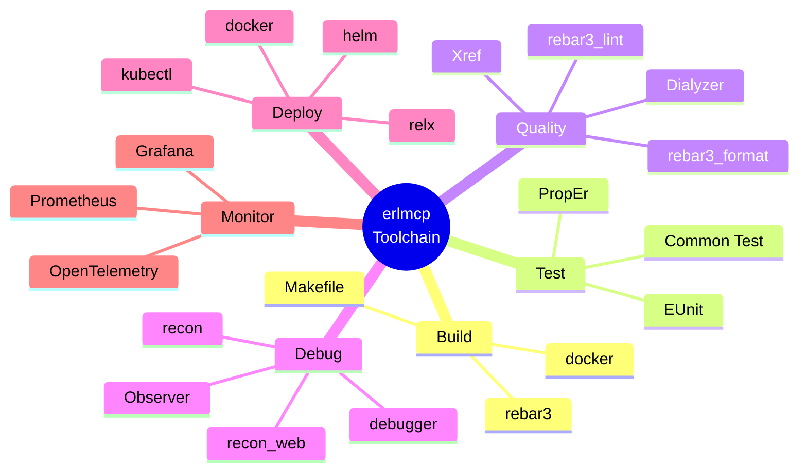
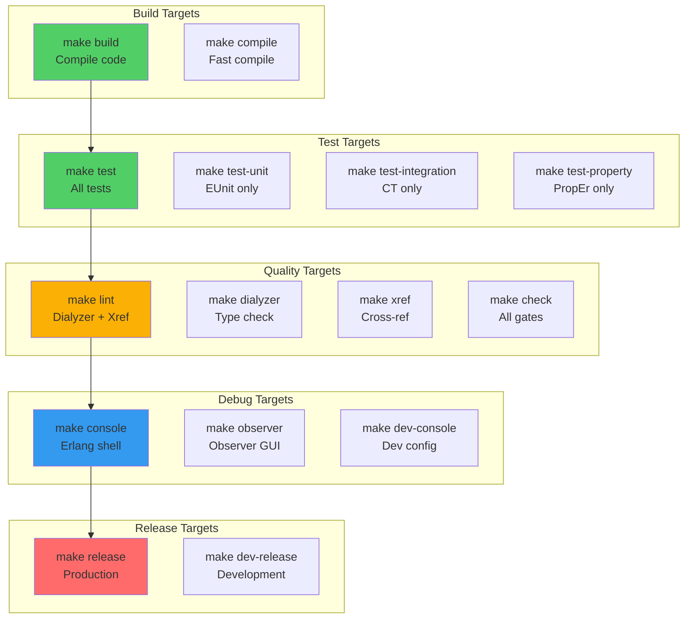
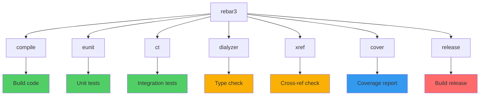
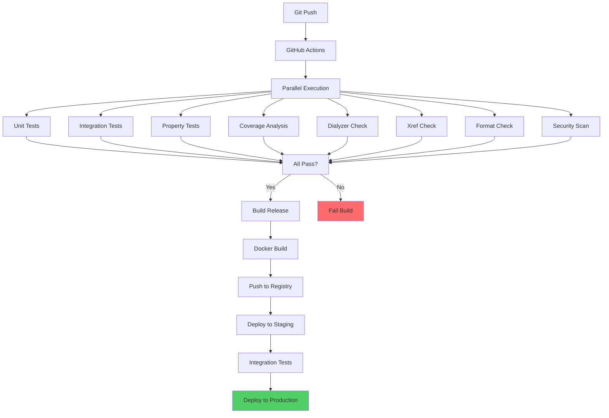
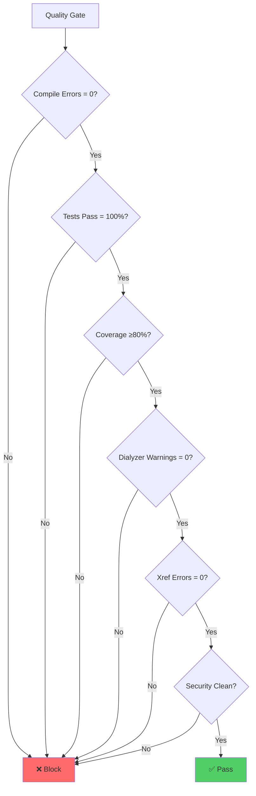
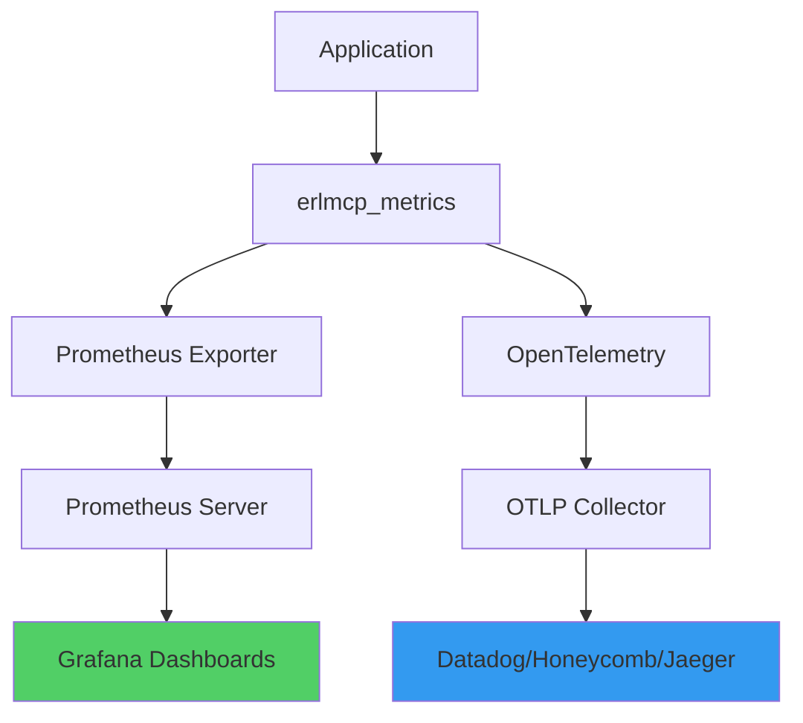

# Tooling and Automation Guide

**Last Updated**: 2026-01-31 | **Status**: Active

This guide covers the complete toolchain for erlmcp development, from local development to CI/CD automation.

## Table of Contents

- [Development Tools](#development-tools)
- [Makefile Reference](#makefile-reference)
- [rebar3 Commands](#rebar3-commands)
- [CI/CD Pipeline](#cicd-pipeline)
- [Local Automation](#local-automation)
- [Debugging Tools](#debugging-tools)

---

## Development Tools

### Toolchain Overview



### Tool Versions

```bash
# Required versions
Erlang/OTP: 28.3.1+
rebar3: 3.22+
git: 2.30+
docker: 20.10+
kubectl: 1.25+ (for K8s deployment)

# Optional but recommended
direnv: 2.0+
asdf: 0.10+ (version manager)
```

### Tool Installation

**Erlang/OTP**:
```bash
# macOS
brew install erlang

# Ubuntu
sudo apt-get install erlang

# Using asdf (recommended)
asdf plugin add erlang
asdf install erlang 28.3.1
asdf local erlang 28.3.1
```

**rebar3**:
```bash
# macOS
brew install rebar3

# Ubuntu
sudo apt-get install rebar3

# Using asdf
asdf plugin add rebar3
asdf install rebar3 3.24.0
asdf local rebar3 3.24.0
```

---

## Makefile Reference

### Primary Development Targets



### Build Targets

```bash
# Standard build
make build                      # Compile all apps

# Fast incremental compile
make compile                    # Only changed files

# Clean build
make clean                      # Remove _build
make distclean                  # Remove everything

# Workspace build
make workspace-build            # Build erlmcp + taiea

# Profile-specific builds
make profile-build              # With profiling
make debug-build                # With debug info
```

### Test Targets

```bash
# Run all tests
make test                       # EUnit + CT + PropEr (~30s)

# Individual test suites
make test-unit                  # EUnit only (~5s)
make test-integration           # Common Test only (~15s)
make test-property              # PropEr only (~10s)

# Specific modules
rebar3 eunit --module=my_module_tests
rebar3 ct --suite=my_SUITE

# With coverage
make test-coverage              # Run + generate report
make coverage-report            # Generate HTML report

# Workspace tests
make workspace-test             # Test all projects

# Verbose output
make test-verbose               # Show all test output
```

### Quality Targets

```bash
# Run all quality checks
make check                      # compile + lint + test

# Individual checks
make lint                       # dialyzer + xref
make dialyzer                   # Type analysis
make xref                       # Cross-reference analysis

# Code formatting
make format                     # Format all code
make format-check               # Check formatting

# Documentation
make docs                       # Generate EDoc
make open-docs                  # Open docs in browser

# Workspace checks
make workspace-lint             # Lint all projects
```

### Debug Targets

```bash
# Erlang shell
make console                    # Basic shell
make dev-console                # Dev config loaded
make test-console               # Test config loaded

# Observer GUI
make observer                   # Launch observer
make dev-observer               # Observer with dev config

# Debugging
make debugger                   # Start debugger
make trace                      # Enable tracing

# Profiling
make profile                    # Start profiling
make fprof                      # Function profiling
make eprof                      # Execution profiling
```

### Release Targets

```bash
# Build releases
make release                    # Production release
make dev-release                # Development release

# Workspace releases
make workspace-release          # Release all projects

# Release tarball
make tar                        # Create tarball

# Docker builds
make docker-build               # Build Docker image
make docker-push                # Push to registry

# Quick verification
make release-test               # Test release bundle
```

---

## rebar3 Commands

### Essential Commands



### Compilation

```bash
# Standard compile
rebar3 compile                  # Compile all deps + apps

# Compile specific app
rebar3 compile --apps=my_app    # Only my_app

# Rebuild everything
rebar3 compile --rebuild        # Clean compile

### Profiles
rebar3 as prod compile          # Production profile
rebar3 as test compile          # Test profile
rebar3 as dev compile           # Development profile
```

### Testing

```bash
# EUnit (unit tests)
rebar3 eunit                    # Run all EUnit tests
rebar3 eunit --module=my_mod    # Specific module
rebar3 eunit --verbose          # Verbose output

# Common Test (integration)
rebar3 ct                       # Run all CT suites
rebar3 ct --suite=my_SUITE     # Specific suite
rebar3 ct -v                    # Verbose

# PropEr (property-based)
rebar3 proper                   # Run PropEr tests
rebar3 proper -m my_mod         # Specific module

# Cover (coverage)
rebar3 cover                    # Generate coverage
rebar3 cover --verbose          # Detailed report
rebar3 cover reset             # Reset coverage data
```

### Analysis

```bash
# Dialyzer (type checking)
rebar3 dialyzer                 # Build PLT + analyze
rebar3 dialyzer --succ          # Show successes too
rebar3 dialyzer -W error_handling  # Extra warnings

# Xref (cross-reference)
rebar3 xref                     # Find undefined calls
rebar3 xref --verbose           # Show details

# Linting (rebar3_lint)
rebar3 lint                     # Run linter
rebar3 lint -i                 # Ignore config
```

### Release

```bash
# Build release
rebar3 release                  # Default profile
rebar3 as prod release          # Production profile
rebar3 as dev release -n dev    # Development

# Release management
rebar3 release tar              # Create tarball
rebar3 release upgrade         # Generate upgrade pack

# Relup (release upgrade)
rebar3 relup                   # Generate upgrade instructions
```

---

## CI/CD Pipeline

### Pipeline Architecture



### GitHub Actions Workflows

**Workflow Files** (`.github/workflows/`):

```yaml
# .github/workflows/ci.yml
name: CI Pipeline

on: [push, pull_request]

jobs:
  test:
    runs-on: ubuntu-latest
    strategy:
      matrix:
        otp: [25, 26, 27]

    steps:
      - uses: actions/checkout@v3
      - uses: erlang-solutions/setup-beam@v1
        with:
          otp-version: ${{ matrix.otp }}

      - name: Compile
        run: rebar3 compile

      - name: Unit Tests
        run: rebar3 eunit

      - name: Integration Tests
        run: rebar3 ct

      - name: Coverage
        run: rebar3 cover

      - name: Dialyzer
        run: rebar3 dialyzer

      - name: Xref
        run: rebar3 xref

  security:
    runs-on: ubuntu-latest
    steps:
      - uses: actions/checkout@v3
      - name: Security Scan
        run: rebar3 security audit

  build:
    needs: [test, security]
    runs-on: ubuntu-latest
    steps:
      - uses: actions/checkout@v3
      - name: Build Release
        run: rebar3 as prod release

      - name: Build Docker
        run: docker build -t erlmcp:${{ github.sha }} .
```

### Quality Gates



---

## Local Automation

### Git Hooks

**Pre-commit Hook** (`.git/hooks/pre-commit`):

```bash
#!/bin/bash
# Pre-commit quality gate

echo "Running pre-commit checks..."

# Fast checks first
TERM=dumb rebar3 compile || exit 1
rebar3 format --verify || exit 1

# Run tests
make test-unit || exit 1

# Check coverage (quick)
rebar3 cover --verbose | grep -q "80..%" || exit 1

echo "Pre-commit checks passed!"
```

**Pre-push Hook** (`.git/hooks/pre-push`):

```bash
#!/bin/bash
# Pre-push full validation

echo "Running pre-push validation..."

# Full test suite
make test || exit 1

# Quality checks
make lint || exit 1

# Coverage
make coverage-report || exit 1

echo "Pre-push validation passed!"
```

### direnv Configuration

**`.envrc`**:

```bash
# Auto-load environment
export ERLMCP_HOME=$(pwd)

# Add build libraries to path
export ERL_LIBS="$PWD/_build/default/lib:$PWD/taiea/_build/default/lib"

# Set rebar3 config
export REBAR_CONFIG="$PWD/rebar.config"

# Set OTP root
export OTP_ROOT=$(erl -noshell -eval 'io:format(code:root_dir())' -s init stop)

# Add bins to PATH
export PATH="$PWD/_build/default/bin:$PATH"

# Load shell helpers
watch_file rebar.config
watch_file .envrc
```

### VS Code Configuration

**`.vscode/settings.json`**:

```json
{
  "erlang.rebarPath": "rebar3",
  "erlang.erlangPath": "erl",
  "erlang.linting": true,
  "files.trimTrailingWhitespace": true,
  "files.insertFinalNewline": true,
  "editor.formatOnSave": true,
  "editor.tabSize": 4,
  "editor.rulers": [100],
  "files.exclude": {
    "_build": true,
    "*.beam": true,
    "erl_crash.dump": true
  }
}
```

---

## Debugging Tools

### Observer

```bash
# Start with app
make observer

# Or manually
erl -sname observer -setcookie secret
% Then in shell:
observer:start().
```

**Observer Features**:
- Process monitoring
- ETS table inspection
- Application overview
- Module loading
- Tracing

### Recon

```bash
# Start shell with recon
make console

# In shell:
re:load(Module).           % Reload module
recon:proc_count(10).      % Top processes by memory
recon:proc_window(10).     % Top processes by reductions
recon:bin_leak(1000).      % Find binary leaks
```

### Debugger

```bash
# Start debugger
make debugger

# Or attach to running node
erl -sname debugger -setcookie secret -remsh erlmcp@hostname

# In shell:
debugger:start().
int:auto_attach([break]).
```

### Tracing

```bash
# Trace function calls
erlang:trace_module(Module, true, [call]).
erlang:trace_pattern({Module, Function, '_'}, [{'_', [], [{return_trace}]}], []).

# Trace messages
erlang:trace(Pid, true, [receive, send]).

# View trace
recon_trace:calls({Module, Function, '_'}, 10).
```

### Profiling

```bash
# fprof (detailed)
make fprof
# In shell:
fprof:apply(Module, Function, Args).
fprof:profile().
fprof:analyse([{dest, "fprof.analysis"}]).

# eprof (execution)
make eprof
# In shell:
eprof:start().
eprof:start_profiling([Pid]).
% ... run code ...
eprof:stop_profiling().
eprof:analyze().
```

---

## Monitoring & Observability

### Metrics



### Metrics Endpoint

```bash
# Start metrics server
make metrics

# View metrics
curl http://localhost:9091/metrics
```

### Health Checks

```bash
# Health endpoint
curl http://localhost:8080/health

# Detailed health
curl http://localhost:8080/health/detailed

# Metrics endpoint
curl http://localhost:8080/metrics
```

---

## Quick Reference

### Common Commands

```bash
# Development cycle
make build && make test && make lint

# Full check
make check

# Quick test
make test-unit

# Debug
make console

# Release
make release

# Coverage
make coverage-report && open _build/test/cover/index.html

# Format
make format
```

### Troubleshooting

```bash
# Clean rebuild
make distclean && make setup

# Check dependencies
rebar3 deps

# Update deps
rebar3 upgrade

# Check configuration
rebar3 check

# Debug OTP errors
erl -boot start_clean -eval "erlang:halt()."

# Check ports
netstat -an | grep LISTEN | grep 8080
```

---

## Related Documentation

- **Development Process**: [README.md](README.md)
- **Coding Standards**: [coding-standards.md](coding-standards.md)
- **Quality Gates**: [../../CLAUDE.md](../../CLAUDE.md)
- **Architecture**: [../../docs/architecture.md](../../docs/architecture.md)

---

**Last Updated**: 2026-01-31
**Status**: Active
**Maintainers**: erlmcp DevOps team
