# Mermaid Syntax Glossary

## Table of Contents

- [Basic Syntax](#basic-syntax)
- [Graph Types](#graph-types)
- [Flowchart Syntax](#flowchart-syntax)
- [Sequence Diagram Syntax](#sequence-diagram-syntax)
- [Styling and Themes](#styling-and-themes)
- [Advanced Features](#advanced-features)
- [erlmcp Patterns](#erlmcp-patterns)
- [Best Practices](#best-practices)

## Basic Syntax

### Diagram Declaration

```mermaid
%% Mermaid diagram declaration
diagramType
    diagram content
```

**Example:**
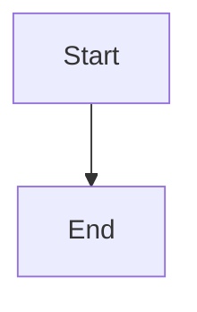

### Comments

```mermaid
%% Single-line comment
graph TB
    A[Start] --> B[End] %% Inline comment
```

### Text Formatting

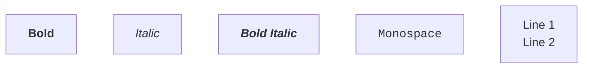

### Special Characters

Escape special characters with HTML entities:

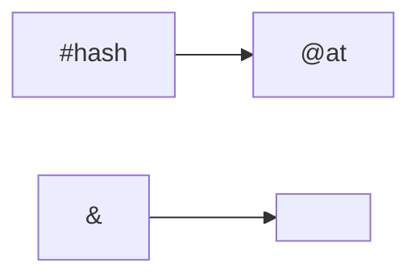

## Graph Types

### Flowchart (Graph)

**Direction:**
- `TB` - Top to Bottom
- `TD` - Top to Down (same as TB)
- `BT` - Bottom to Top
- `LR` - Left to Right
- `RL` - Right to Left

**Syntax:**
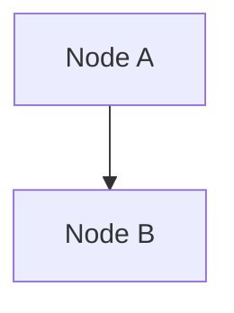

### Sequence Diagram

**Syntax:**
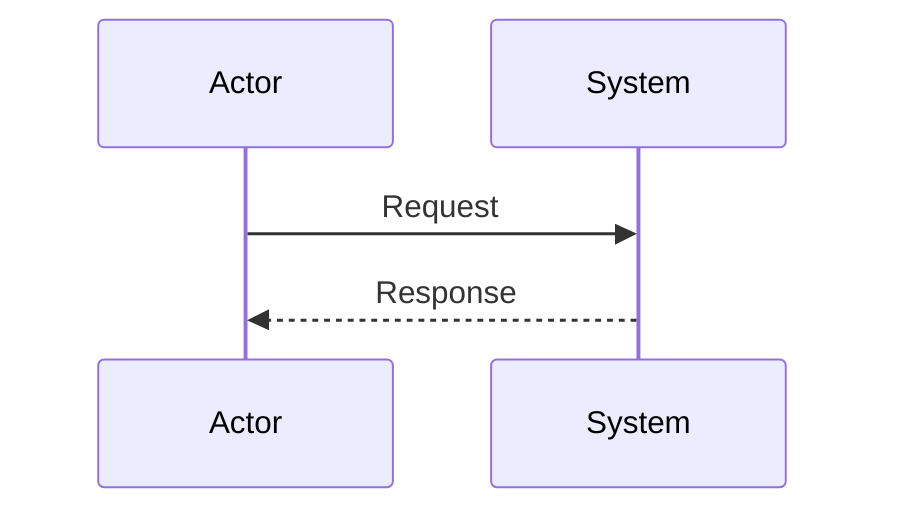

### Other Types (Not Used in erlmcp)

- `stateDiagram` - State machine
- `erDiagram` - Entity relationship
- `classDiagram` - UML class diagram
- `gantt` - Gantt chart
- `pie` - Pie chart
- `gitGraph` - Git graph

## Flowchart Syntax

### Node Shapes

```mermaid
graph TB
    A[Rectangle]          % Standard rectangle
    B([Rounded])          % Rounded rectangle
    C[(Database)]         % Cylinder (database)
    D{{Hexagon}}          % Hexagon
    E[/Parallelogram/]    % Parallelogram
    F[\Parallelogram Alt\]
    G[((Circle))]         % Double circle
    H[()]                % No shape (text only)
```

### Node Definitions

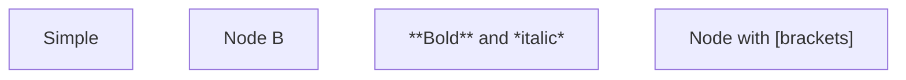

### Edges (Connections)

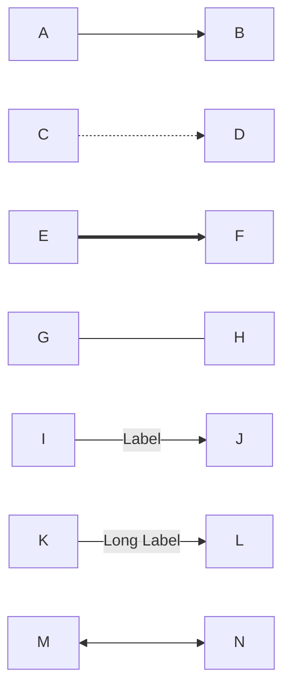

### Subgraphs

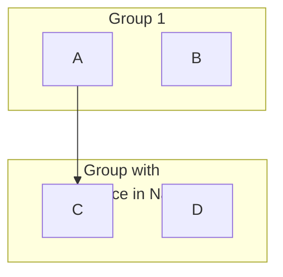

### Connections Between Subgraphs

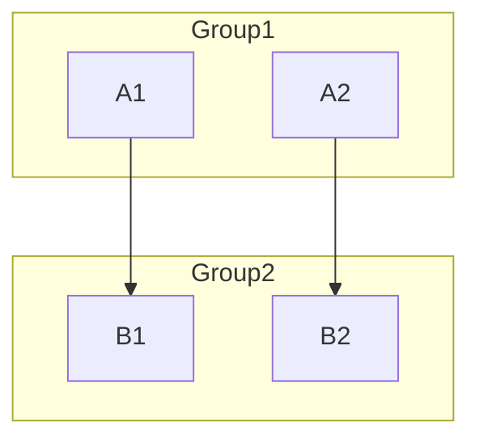

## Sequence Diagram Syntax

### Participants

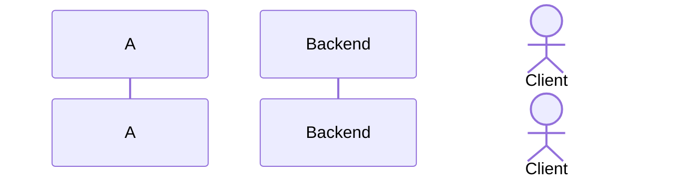

### Messages

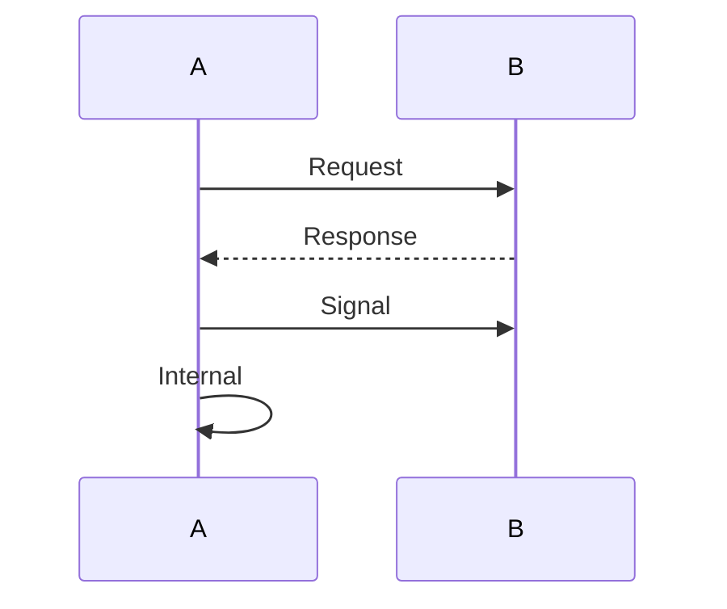

### Activation Boxes

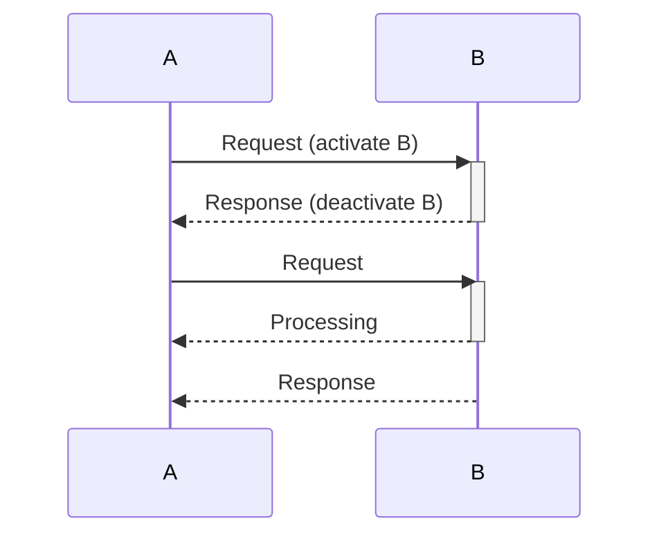

### Notes

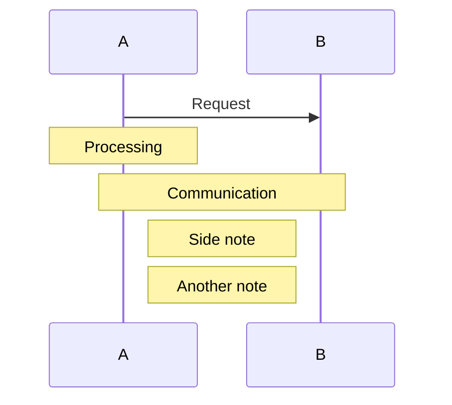

### Loops and Alternatives

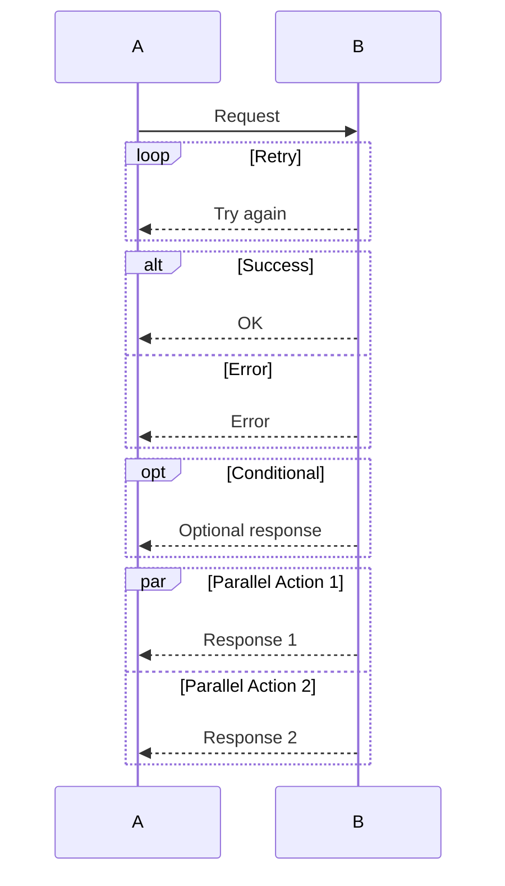

### Delay and Background

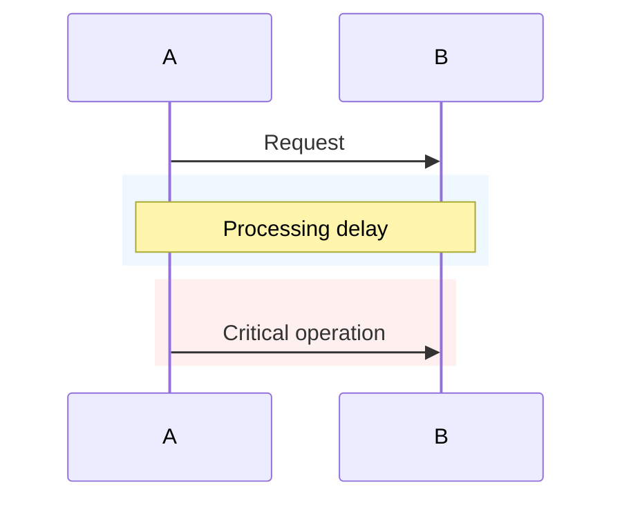

## Styling and Themes

### Theme Initialization

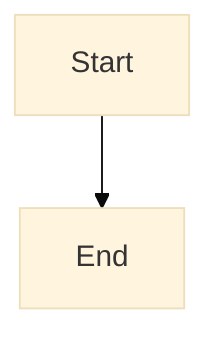

**Available Themes:**
- `default` - Standard Mermaid theme
- `forest` - Green nature theme
- `dark` - Dark mode theme
- `neutral` - Gray neutral theme
- `base` - Minimal base theme

### Custom Styles

**Single Node:**
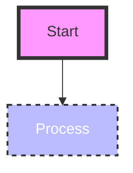

**Style Attributes:**
- `fill` - Background color (hex or name)
- `stroke` - Border color
- `stroke-width` - Border width (pixels)
- `color` - Text color
- `stroke-dasharray` - Dashed border (N M pattern)
- `fill-opacity` - Background opacity (0-1)
- `stroke-opacity` - Border opacity (0-1)

### Style Classes

```mermaid
graph TB
    A[Start] --> B[Process]
    C[End] --> D[Another End]

    %% Define class
    classDef startStyle fill:#0f0,stroke:#333,stroke-width:4px
    classDef endStyle fill:#f00,stroke:#333,stroke-width:2px

    %% Apply to nodes
    class A startStyle
    class C,D endStyle
```

**Multiple Classes:**
```mermaid
graph TB
    A[Node A]
    B[Node B]
    C[Node C]

    classDef style1 fill:#f00
    classDef style2 fill:#0f0
    classDef style3 fill:#00f

    class A,C style1,style3
    class B style2
```

### Link Styles

```mermaid
graph TB
    A-->B
    C-->D

    linkStyle 0 stroke:#f00,stroke-width:2px
    linkStyle 1 stroke:#0f0,stroke-width:4px
```

**Indexing:**
- Links are indexed by declaration order (0-based)
- First link is 0, second is 1, etc.

### erlmcp Color Scheme

```mermaid
graph TB
    %% erlmcp standard colors
    classDef coreStyle fill:#e8f5e9,stroke:#1b5e20,stroke-width:2px
    classDef transportStyle fill:#f3e5f5,stroke:#4a148c,stroke-width:2px
    classDef observabilityStyle fill:#fff3e0,stroke:#e65100,stroke-width:2px
    classDef validationStyle fill:#fce4ec,stroke:#880e4f,stroke-width:2px
    classDef depStyle fill:#f5f5f5,stroke:#424242,stroke-width:1px,stroke-dasharray: 5 5

    A[Core]:::coreStyle
    B[Transport]:::transportStyle
    C[Observability]:::observabilityStyle
    D[Validation]:::validationStyle
    E[Dependency]:::depStyle
```

## Advanced Features

### Markdown in Diagrams

```mermaid
graph TB
    A[**Bold Text**]
    B[*Italic Text*]
    C[***Bold Italic***]
    D[`Monospace Code`]
    E[Line 1<br/>Line 2<br/>Line 3]
```

### HTML Entities

```mermaid
graph LR
    A["&lt;tag&gt;"] --> B["&amp;"]
    C["&quot;quote&quot;"] --> D["&#169; Copyright"]
```

### Icons and Emojis

```mermaid
graph TB
    A[✅ Success]
    B[❌ Failure]
    C[⚠️ Warning]
    D[🔒 Security]
```

### Variables and Macros

**Variables (not directly supported, use subgraphs):**
```mermaid
graph TB
    subgraph Pattern ["Reusable Pattern"]
        X[Input] --> Y[Process] --> Z[Output]
    end

    A --> Pattern
    B --> Pattern
```

### Interactive Features

**Tooltip (not supported in all viewers):**
```mermaid
graph TB
    A[Start] --> B{Click me?}

    %% Note: Tooltips depend on viewer support
    %% Not recommended for portable diagrams
```

### Advanced Layout

**Direction with Subgraphs:**
```mermaid
graph TB
    subgraph Top [Top Section]
        direction LR
        A1[Left] --> A2[Right]
    end

    subgraph Bottom [Bottom Section]
        direction LR
        B1[Left] --> B2[Right]
    end

    A1 --> B1
```

## erlmcp Patterns

### System Architecture Pattern

```mermaid
graph TB
    subgraph "Layer Name"
        direction TB

        COMPONENT_A[Module Name]
        FEATURE_A[Features:<br/>✓ Feature 1<br/>✓ Feature 2]

        COMPONENT_A -.-> FEATURE_A
    end

    COMPONENT_A --> COMPONENT_B
```

### Supervision Tree Pattern

```mermaid
graph TB
    SUPERVISOR[Supervisor Name<br/>Strategy: one_for_one]

    subgraph Workers
        WORKER1[Worker 1]
        WORKER2[Worker 2]
    end

    SUPERVISOR --> WORKER1
    SUPERVISOR --> WORKER2
```

### Data Flow Pattern

```mermaid
sequenceDiagram
    participant Client
    participant Server
    participant Database

    Client->>Server: Request
    Server->>Database: Query
    Database-->>Server: Result
    Server-->>Client: Response
```

### Module Dependency Pattern

```mermaid
graph TD
    HIGH[High Level Module]
    LOW[Low Level Module]

    HIGH --> LOW

    style HIGH fill:#e8f5e9,stroke:#1b5e20
    style LOW fill:#f3e5f5,stroke:#4a148c
```

## Best Practices

### Diagram Structure

1. **Logical Flow**
   - Use consistent direction (TB or LR)
   - Group related components
   - Minimize edge crossings

2. **Clear Labels**
   - Descriptive node names
   - Meaningful edge labels
   - Include units where relevant

3. **Consistent Styling**
   - Use style classes
   - Follow color scheme
   - Maintain visual hierarchy

### Node Naming

**Good:**
```
ERLMCP_CLIENT[erlmcp_client<br/>MCP Client Implementation]
```

**Avoid:**
```
client1[client]
```

### Subgraph Usage

**Good:**
```mermaid
graph TB
    subgraph "Transport Layer"
        TCP[TCP Transport]
        HTTP[HTTP Transport]
    end
```

**Avoid:**
```mermaid
graph TB
    subgraph Group1
        TCP
        HTTP
    end
```

### Edge Styling

**Use meaningful arrow types:**
- `-->` - Standard flow
- `-.->` - Optional or indirect
- `==>` - Important or primary
- `---` - Association without direction

### Commenting

**Good:**
```mermaid
graph TB
    %% Core protocol processing
    PARSER[Parser] --> VALIDATOR[Validator]

    %% Message routing
    VALIDATOR --> ROUTER[Router]
```

**Avoid:**
```mermaid
graph TB
    PARSER --> VALIDATOR
    VALIDATOR --> ROUTER
    %% No context
```

## Syntax Reference

### Quick Reference

| Element | Syntax |
|---------|--------|
| **Node** | `A[Label]` |
| **Edge** | `A --> B` |
| **Subgraph** | `subgraph ID` ... `end` |
| **Style** | `style A fill:#fff` |
| **Class** | `classDef className fill:#fff` |
| **Note** | `Note over A,B: Text` |
| **Loop** | `loop Label` ... `end` |
| **Alt** | `alt Label` ... `end` |

### Color Reference

**Hex Colors:**
- `#000` - Black
- `#fff` - White
- `#f00` - Red
- `#0f0` - Green
- `#00f` - Blue

**Named Colors:**
- `red`, `green`, `blue`
- `yellow`, `orange`, `purple`
- `cyan`, `magenta`, `lime`

**erlmcp Theme:**
- Core: `#e8f5e9` (light green)
- Transport: `#f3e5f5` (light purple)
- Observability: `#fff3e0` (light orange)
- Validation: `#fce4ec` (light pink)
- Dependencies: `#f5f5f5` (gray)

### Common Patterns

**Supervision Tree:**
```mermaid
graph TB
    SUP[Supervisor] --> WORKER[Worker]
```

**Sequence Flow:**
```mermaid
sequenceDiagram
    A->>B: Message
```

**Grouping:**
```mermaid
graph TB
    subgraph Group
        A
        B
    end
```

## Resources

### Official Documentation

- [Mermaid Documentation](https://mermaid.js.org/)
- [Flowchart Syntax](https://mermaid.js.org/syntax/flowchart.html)
- [Sequence Diagram Syntax](https://mermaid.js.org/syntax/sequenceDiagram.html)
- [Theming](https://mermaid.js.org/config/theming.html)

### Tools

- [Mermaid Live Editor](https://mermaid.live)
- [Mermaid CLI](https://github.com/mermaid-js/mermaid-cli)
- [VS Code Extension](https://marketplace.visualstudio.com/items?itemName=bierner.markdown-mermaid)

### Community

- [Mermaid Discord](https://discord.gg/mermaid)
- [Stack Overflow](https://stackoverflow.com/questions/tagged/mermaid)
- [GitHub Discussions](https://github.com/mermaid-js/mermaid/discussions)

---

**Version:** 2.1.0
**Last Updated:** 2026-01-31
