# Using and Customizing erlmcp Diagrams

## Table of Contents

- [Quick Start](#quick-start)
- [Viewing Diagrams](#viewing-diagrams)
- [Editing Diagrams](#editing-diagrams)
- [Customization Guide](#customization-guide)
- [Integration](#integration)
- [Best Practices](#best-practices)
- [Troubleshooting](#troubleshooting)

## Quick Start

### Viewing a Diagram

1. **On GitHub/GitLab:**
   - Navigate to any `.mmd` file
   - The diagram renders automatically
   - Click "Raw" to see source

2. **In VS Code:**
   - Install Mermaid extension: `code --install-extension bierner.markdown-mermaid`
   - Open `.mmd` file
   - Press `Cmd+Shift+V` (Mac) or `Ctrl+Shift+V` (Windows/Linux)

3. **Online Editor:**
   - Visit [https://mermaid.live](https://mermaid.live)
   - Copy diagram content
   - Paste and see live preview

### Editing a Diagram

1. Open `.mmd` file in your preferred editor
2. Make changes following Mermaid syntax
3. Save file
4. View updated diagram

## Viewing Diagrams

### GitHub/GitLab Native Rendering

**Pros:**
- No installation required
- Automatic rendering
- Version control integration

**Cons:**
- Limited customization
- No export options
- Rendering delays on large diagrams

**Usage:**
```
1. Navigate to diagram file
2. View rendered diagram
3. Click "Raw" button for source
```

### VS Code with Extension

**Installation:**
```bash
code --install-extension bierner.markdown-mermaid
```

**Features:**
- Live preview in split pane
- Syntax highlighting
- Auto-render on save
- Export to PNG/SVG

**Shortcuts:**
- `Cmd+Shift+V` (Mac) / `Ctrl+Shift+V` (Windows) - Toggle preview
- `Cmd+K V` (Mac) / `Ctrl+K V` (Windows) - Preview to side

**Configuration:**
```json
// settings.json
{
    "markdown.marp.enableHtml": true,
    "mermaid.theme": "default",
    "mermaid.sequence": {
        "diagramMarginX": 50,
        "diagramMarginY": 10
    }
}
```

### Mermaid Live Editor

**URL:** https://mermaid.live

**Features:**
- Real-time preview
- Code completion
- Export options (PNG, SVG)
- Share via URL

**Workflow:**
```
1. Open https://mermaid.live
2. Copy diagram from .mmd file
3. Paste into editor
4. Edit and see live updates
5. Export or copy back to file
```

### Command Line Rendering

**Installation:**
```bash
npm install -g @mermaid-js/mermaid-cli
```

**Basic Usage:**
```bash
# Render to PNG
mmdc -i system-architecture.mmd -o system-architecture.png

# Render to SVG
mmdc -i system-architecture.mmd -o system-architecture.svg

# Render to PDF
mmdc -i system-architecture.mmd -o system-architecture.pdf
```

**Advanced Options:**
```bash
# Custom theme
mmdc -i diagram.mmd -o diagram.png -t dark

# Custom width
mmdc -i diagram.mmd -o diagram.png -w 2048

# High DPI
mmdc -i diagram.mmd -o diagram.png -s 2

# Transparent background
mmdc -i diagram.mmd -o diagram.png -b transparent
```

**Batch Processing:**
```bash
# Render all diagrams
for file in *.mmd; do
    mmdc -i "$file" -o "${file%.mmd}.png" -w 2048 -s 2
done

# Create documentation website
mmdc -i *.mmd -d docs/diagrams/images/
```

### Integration with Documentation Tools

#### MkDocs

**Plugin:** `mkdocs-mermaid2-plugin`

**Installation:**
```bash
pip install mkdocs-mermaid2-plugin
```

**Configuration (mkdocs.yml):**
```yaml
plugins:
  - search
  - mermaid2:
      version: 10.6.1
      arguments:
        theme: default
```

**Usage in Markdown:**
```markdown
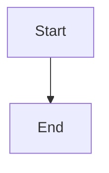
```

#### Docusaurus

**Built-in:** Mermaid support included

**Usage in Markdown:**
```markdown

```

#### Hugo

**Shortcode:**
```markdown

graph TB
    A[Start] --> B[End]

```

## Editing Diagrams

### Recommended Editors

#### VS Code

**Extensions:**
- `bierner.markdown-mermaid` - Mermaid preview
- `joaompinto.asciidoctor-vscode` - AsciiDoc support
- `shd101wyy.markdown-preview-enhanced` - Enhanced preview

**Features:**
- Live preview
- Syntax highlighting
- Auto-format
- Error detection

#### IntelliJ IDEA / PyCharm

**Plugin:** `Mermaid`

**Installation:**
```
Settings → Plugins → Search "Mermaid" → Install
```

#### Vim / Neovim

**Plugin:** `vim-mermaid`

**Installation (vim-plug):**
```vim
Plug 'wakatime/vim-mermaid'
```

**Usage:**
```vim
:MermaidPreview
```

### Syntax Validation

**Online:**
1. Paste into https://mermaid.live
2. Check for syntax errors
3. Verify rendering

**Command Line:**
```bash
# Validate syntax (errors return non-zero)
mmdc -i diagram.mmd -o /tmp/test.png
```

**VS Code:**
- Real-time syntax checking
- Error highlighting
- Auto-format on save

## Customization Guide

### Themes

**Available Themes:**
- `default` - Standard theme
- `forest` - Green nature theme
- `dark` - Dark mode theme
- `neutral` - Gray neutral theme
- `base` - Minimal theme

**Applying Themes:**

**In Diagram:**
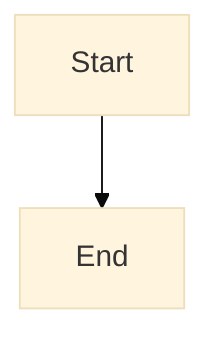

**Command Line:**
```bash
mmdc -i diagram.mmd -o output.png -t dark
```

**VS Code:**
```json
{
    "mermaid.theme": "dark"
}
```

### Colors

**Custom Colors in Diagram:**
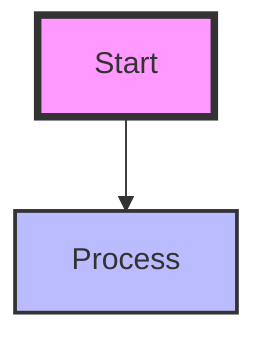

**Color Classes:**
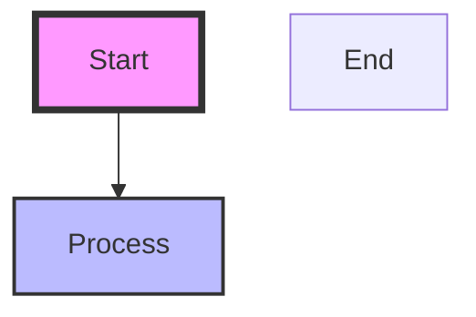

**erlmcp Color Scheme:**
- **Core:** `#e8f5e9` (light green)
- **Transport:** `#f3e5f5` (light purple)
- **Observability:** `#fff3e0` (light orange)
- **Validation:** `#fce4ec` (light pink)
- **Dependencies:** `#f5f5f5` (gray)

### Styling

**Node Styles:**
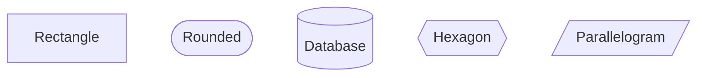

**Edge Styles:**
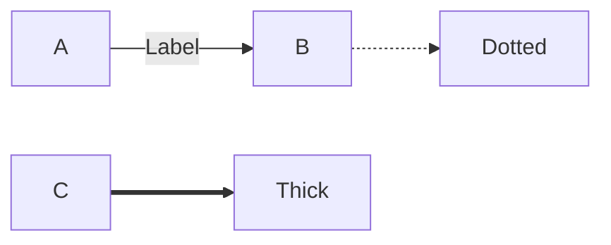

**Font Styling:**
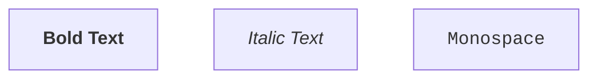

### Layout

**Direction:**
```mermaid
graph TB  % Top to Bottom
graph TD  % Top to Down (same as TB)
graph BT  % Bottom to Top
graph LR  % Left to Right
graph RL  % Right to Left
```

**Subgraphs:**
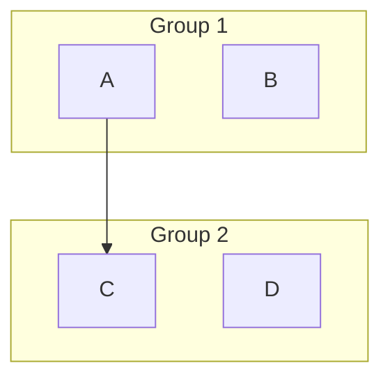

**Spacing:**
```mermaid
%% Not directly supported in Mermaid
%% Use node positioning and subgraph grouping
```

### Annotations

**Notes:**
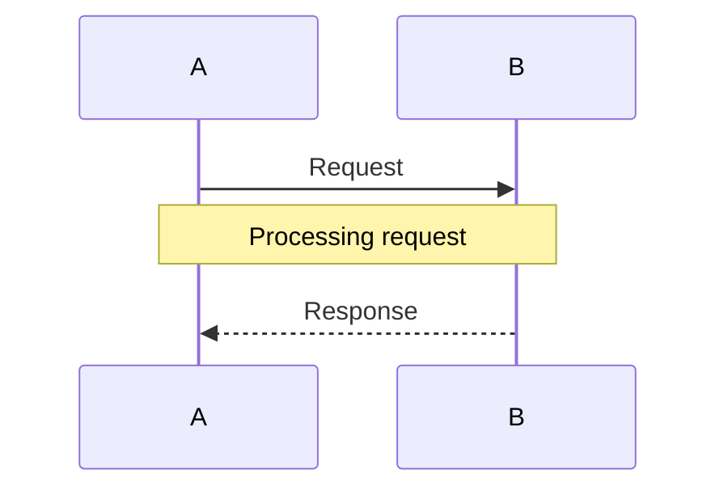

**Comments:**


**Alternatives:**
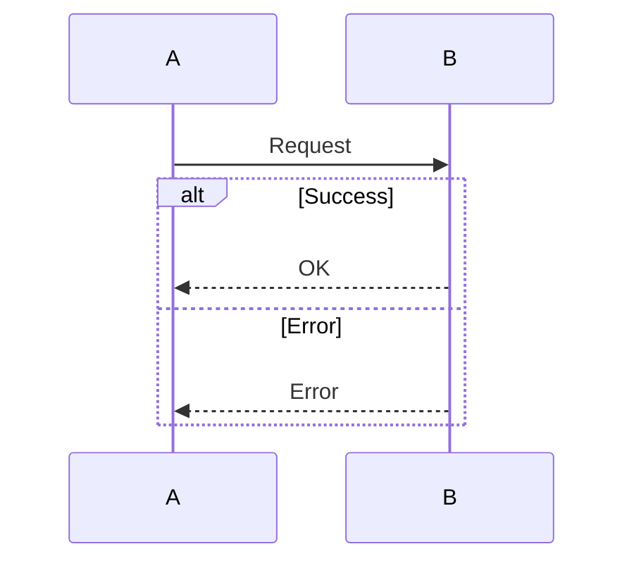

**Loops:**
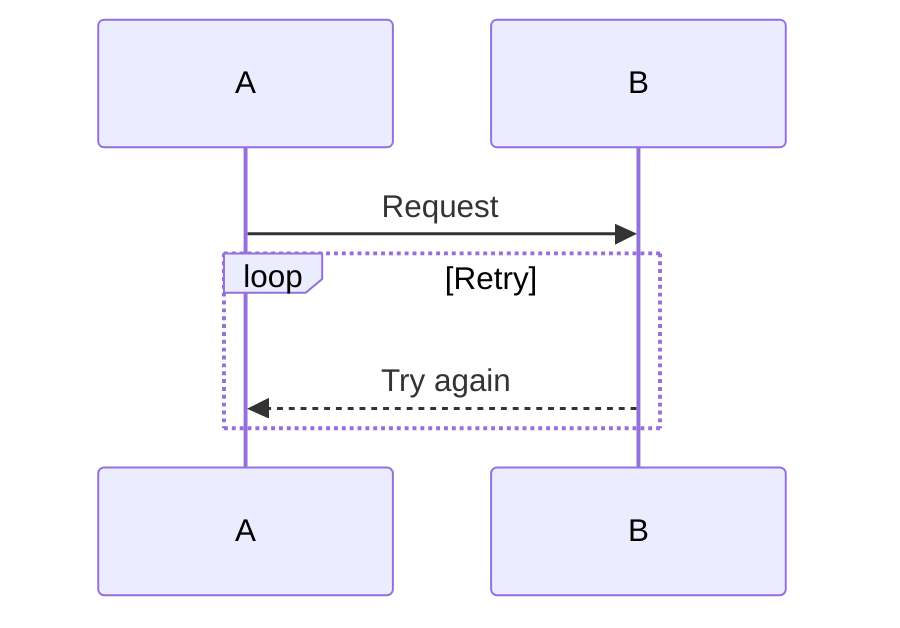

## Integration

### Embedding in Markdown

**GitHub/GitLab:**
```markdown
# Architecture

See the system architecture below:


```

**With Link to Source:**
```markdown
[](diagram.mmd)
```

### Embedding in HTML

**Direct Render:**
```html
<pre class="mermaid">
graph TB
    A[Start] --> B[End]
</pre>

<script src="https://cdn.jsdelivr.net/npm/mermaid/dist/mermaid.min.js"></script>
<script>
    mermaid.initialize({ startOnLoad: true });
</script>
```

**With Custom Config:**
```html
<script>
    mermaid.initialize({
        startOnLoad: true,
        theme: 'dark',
        flowchart: {
            useMaxWidth: false,
            htmlLabels: true,
            curve: 'basis'
        }
    });
</script>
```

### Automating Updates

**Git Pre-commit Hook:**
```bash
#!/bin/bash
# .git/hooks/pre-commit

# Render diagrams on commit
for file in docs/diagrams/*.mmd; do
    if [ "$file" -nt "${file%.mmd}.png" ]; then
        echo "Rendering $file..."
        mmdc -i "$file" -o "${file%.mmd}.png"
        git add "${file%.mmd}.png"
    fi
done
```

**Makefile:**
```makefile
.PHONY: diagrams render-diagrams

diagrams: render-diagrams

render-diagrams:
	@echo "Rendering Mermaid diagrams..."
	@for file in docs/diagrams/*.mmd; do \
		mmdc -i "$$file" -o "$${file%.mmd}.png" -w 2048 -s 2; \
	done

clean-diagrams:
	@rm -f docs/diagrams/*.png docs/diagrams/*.svg
```

**GitHub Actions:**
```yaml
name: Render Diagrams

on:
  push:
    paths:
      - 'docs/diagrams/*.mmd'

jobs:
  render:
    runs-on: ubuntu-latest
    steps:
      - uses: actions/checkout@v3
      - uses: actions/setup-node@v3
        with:
          node-version: '18'
      - run: npm install -g @mermaid-js/mermaid-cli
      - run: make diagrams
      - uses: stefanzweifel/git-auto-commit-action@v4
        with:
          commit_message: 'Auto-render diagrams'
```

## Best Practices

### Diagram Design

1. **Keep it Simple**
   - Focus on key concepts
   - Avoid overcrowding
   - Use subgraphs for grouping

2. **Consistent Styling**
   - Use color classes
   - Follow naming conventions
   - Maintain visual hierarchy

3. **Clear Labels**
   - Descriptive node names
   - Meaningful edge labels
   - Include notes for context

4. **Logical Flow**
   - Top-to-bottom or left-to-right
   - Minimize edge crossings
   - Group related components

### File Organization

1. **Naming**
   - Lowercase with hyphens: `system-architecture.mmd`
   - Descriptive names: `transport-interfaces.mmd`
   - Avoid spaces and special characters

2. **Structure**
   - One diagram per file
   - Include comments in diagram
   - Keep files under 500 lines

3. **Documentation**
   - Update README.md when adding diagrams
   - Include description in file header
   - Document custom styles

### Version Control

1. **Commit Strategy**
   - Commit `.mmd` source files
   - Optionally commit rendered images
   - Use Git LFS for large images

2. **Branching**
   - Edit diagrams in feature branches
   - Review rendering in PR
   - Keep diagrams in sync with code

3. **Documentation**
   - Document changes in commit message
   - Update related documentation
   - Add diagram changelog

## Troubleshooting

### Common Issues

**Diagram Not Rendering**

**Symptoms:**
- Blank page in GitHub/GitLab
- Error in VS Code preview
- CLI rendering fails

**Solutions:**
1. Check syntax with https://mermaid.live
2. Verify Mermaid version compatibility
3. Check for unsupported features
4. Review error messages

**Large Diagram Performance**

**Symptoms:**
- Slow rendering
- Browser hangs
- Memory issues

**Solutions:**
1. Break into smaller diagrams
2. Use subgraphs for grouping
3. Reduce node count
4. Export as static image

**Syntax Errors**

**Common Errors:**
- Unclosed quotes
- Invalid characters
- Missing semicolons
- Incorrect indentation

**Solutions:**
1. Use online validator
2. Check line endings (LF vs CRLF)
3. Escape special characters
4. Follow Mermaid syntax guide

**Rendering Differences**

**Symptoms:**
- Different appearance in tools
- Spacing issues
- Font problems

**Solutions:**
1. Use standard themes
2. Avoid custom fonts
3. Test in multiple viewers
4. Use relative sizing

### Getting Help

**Resources:**
- [Mermaid Documentation](https://mermaid.js.org/)
- [Mermaid GitHub](https://github.com/mermaid-js/mermaid)
- [erlmcp Repository](https://github.com/erlmcp/erlmcp)

**Community:**
- [Mermaid Discord](https://discord.gg/mermaid)
- [Stack Overflow](https://stackoverflow.com/questions/tagged/mermaid)

**Reporting Issues:**
1. Check existing issues
2. Include diagram source
3. Describe expected behavior
4. Include rendering output

---

## Quick Reference

### Common Commands

```bash
# Install Mermaid CLI
npm install -g @mermaid-js/mermaid-cli

# Render diagram
mmdc -i diagram.mmd -o diagram.png

# Validate syntax
mmdc -i diagram.mmd -o /tmp/test.png

# Batch render
for file in *.mmd; do mmdc -i "$file" -o "${file%.mmd}.png"; done

# Render all erlmcp diagrams
cd docs/diagrams
for file in *.mmd; do mmdc -i "$file" -o "${file%.mmd}.png" -w 2048 -s 2; done
```

### VS Code Shortcuts

- `Cmd+Shift+V` - Toggle preview
- `Cmd+K V` - Preview to side
- `Cmd+B` - Toggle sidebar

### Theme Quick Set

```mermaid
%%{init: {'theme':'dark'}}%%
```

---

**Version:** 2.1.0
**Last Updated:** 2026-01-31
