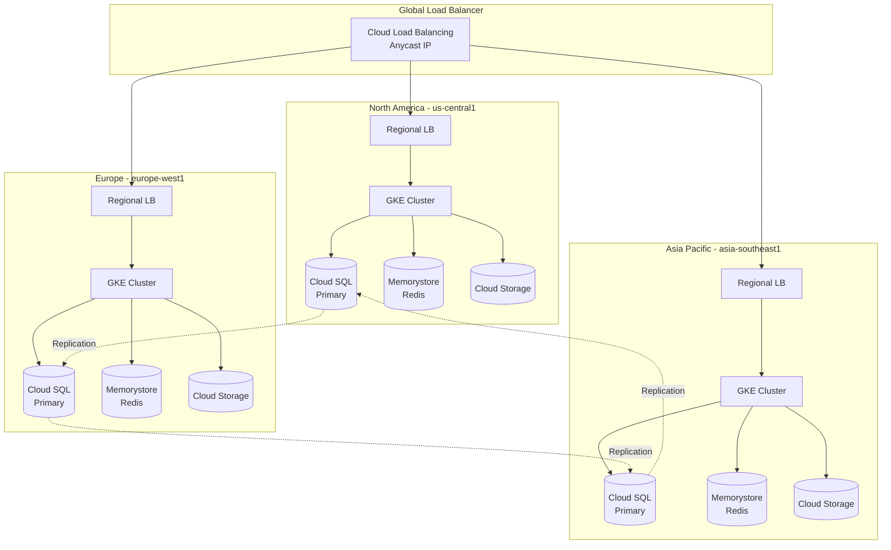
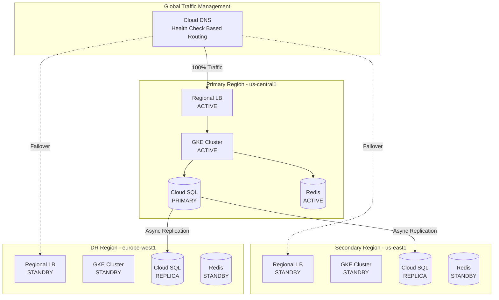
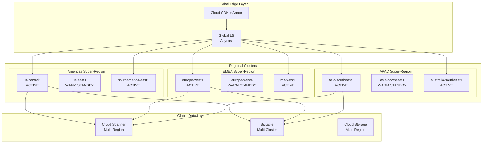

# erlmcp v3 Multi-Region Deployment Guide for Fortune 5 Global Operations

## Executive Summary

This guide provides comprehensive multi-region deployment strategies for erlmcp v3 to support Fortune 5 organizations with global operations across 50+ countries. It covers active-active and active-passive architectures, GCP region selection, cross-region networking, global load balancing, data sovereignty compliance, latency optimization, and cost management.

**Target Audience**: Fortune 5 Global Infrastructure Teams, Cloud Architects, Platform Engineers
**Scope**: Multi-region deployments supporting 100M+ users across 6 continents
**Compliance**: GDPR, CCPA, SOC2, ISO 27001, regional data sovereignty requirements

## Table of Contents

1. [Global Architecture Patterns](#global-architecture-patterns)
2. [GCP Region Selection Strategy](#gcp-region-selection-strategy)
3. [Cross-Region Networking](#cross-region-networking)
4. [Global Load Balancing](#global-load-balancing)
5. [Data Residency and Sovereignty](#data-residency-and-sovereignty)
6. [Latency Optimization and Edge Caching](#latency-optimization-and-edge-caching)
7. [Cross-Region Replication Patterns](#cross-region-replication-patterns)
8. [Multi-Region Monitoring and Observability](#multi-region-monitoring-and-observability)
9. [Regional Compliance](#regional-compliance)
10. [Cost Optimization](#cost-optimization)
11. [Deployment Procedures](#deployment-procedures)
12. [Disaster Recovery](#disaster-recovery)

---

## Global Architecture Patterns

### 1. Active-Active Multi-Region Architecture

**Use Case**: Maximum availability, global user base, low-latency requirements



**Characteristics**:
- All regions actively serve traffic
- Data replicated across all regions
- Geographic proximity routing
- Highest availability (99.99%+)
- Complex data consistency requirements
- Higher operational cost

**Implementation Requirements**:
```yaml
# GKE Multi-Region Configuration
regions:
  - name: us-central1
    zones: [us-central1-a, us-central1-b, us-central1-c]
    node_count: 9
    machine_type: n2-standard-8

  - name: europe-west1
    zones: [europe-west1-b, europe-west1-c, europe-west1-d]
    node_count: 9
    machine_type: n2-standard-8

  - name: asia-southeast1
    zones: [asia-southeast1-a, asia-southeast1-b, asia-southeast1-c]
    node_count: 9
    machine_type: n2-standard-8

replication:
  strategy: multi-master
  consistency: eventual
  conflict_resolution: last-write-wins
  sync_interval: 5s
```

### 2. Active-Passive Multi-Region Architecture

**Use Case**: Disaster recovery, cost optimization, regulatory requirements



**Characteristics**:
- Single active region under normal operations
- Passive regions ready for failover
- Lower cost than active-active
- RTO: 5-15 minutes
- RPO: <1 minute
- Simpler data consistency

**Implementation Requirements**:
```yaml
# Active-Passive Configuration
primary:
  region: us-central1
  replicas: 9
  resources:
    requests:
      cpu: "4"
      memory: "8Gi"

secondary:
  region: us-east1
  replicas: 3  # Minimal for warm standby
  resources:
    requests:
      cpu: "2"
      memory: "4Gi"

dr:
  region: europe-west1
  replicas: 0  # Cold standby, scale on demand
  auto_scale_trigger: health_check_failure
```

### 3. Hybrid Multi-Region Architecture (Recommended for Fortune 5)

**Use Case**: Balance of performance, cost, compliance, and resilience



**Characteristics**:
- Active regions in each super-region (Americas, EMEA, APAC)
- Warm standby for critical regions
- Global data layer (Cloud Spanner)
- 99.99% availability SLA
- Optimal cost/performance ratio
- Data sovereignty compliance

**Super-Region Strategy**:

| Super-Region | Primary Region | Secondary Region | Compliance Zones | User Coverage |
|--------------|---------------|------------------|------------------|---------------|
| **Americas** | us-central1 (Iowa) | us-east1 (S. Carolina) | US, Canada, Brazil, Mexico | 500M+ users |
| **EMEA** | europe-west1 (Belgium) | europe-west4 (Netherlands) | EU, UK, Middle East, Africa | 800M+ users |
| **APAC** | asia-southeast1 (Singapore) | asia-northeast1 (Tokyo) | APAC, Australia, India | 3B+ users |

---

## GCP Region Selection Strategy

### Global Region Portfolio for Fortune 5

**Primary Regions** (Active Production):

```yaml
tier_1_regions:  # Mission Critical - Active-Active
  - name: us-central1
    location: Iowa, USA
    zones: 3
    latency_to_users: <20ms (US)
    compliance: [HIPAA, SOC2, FedRAMP]
    use_case: North America primary

  - name: europe-west1
    location: St. Ghislain, Belgium
    zones: 3
    latency_to_users: <30ms (EU)
    compliance: [GDPR, ISO27001]
    use_case: Europe primary

  - name: asia-southeast1
    location: Jurong West, Singapore
    zones: 3
    latency_to_users: <40ms (APAC)
    compliance: [PDPA, ISO27001]
    use_case: Asia Pacific primary

tier_2_regions:  # Regional Presence - Active
  - name: us-east1
    location: South Carolina, USA
    purpose: Americas DR + East Coast proximity

  - name: europe-west4
    location: Eemshaven, Netherlands
    purpose: EMEA DR + data sovereignty

  - name: asia-northeast1
    location: Tokyo, Japan
    purpose: APAC DR + Japan compliance

  - name: southamerica-east1
    location: São Paulo, Brazil
    purpose: LGPD compliance + LATAM coverage

  - name: australia-southeast1
    location: Sydney, Australia
    purpose: Australian Privacy Act compliance

tier_3_regions:  # Compliance & Specialty
  - name: europe-west2
    location: London, UK
    purpose: UK GDPR + Brexit data residency

  - name: me-west1
    location: Tel Aviv, Israel
    purpose: Middle East coverage

  - name: asia-south1
    location: Mumbai, India
    purpose: India data localization laws
```

### Region Selection Decision Matrix

| Criterion | Weight | us-central1 | europe-west1 | asia-southeast1 | Evaluation Method |
|-----------|--------|-------------|--------------|-----------------|-------------------|
| **User Proximity** | 25% | 9/10 | 9/10 | 9/10 | Latency testing |
| **Compliance Support** | 20% | 10/10 | 10/10 | 8/10 | Certification review |
| **Network Performance** | 15% | 10/10 | 9/10 | 8/10 | Throughput tests |
| **Service Availability** | 15% | 10/10 | 10/10 | 9/10 | GCP SLA review |
| **Cost Efficiency** | 10% | 8/10 | 7/10 | 7/10 | TCO analysis |
| **Redundancy Options** | 10% | 9/10 | 9/10 | 8/10 | Zone/region analysis |
| **Data Sovereignty** | 5% | 8/10 | 10/10 | 9/10 | Legal review |

### Latency Matrix (P95 in milliseconds)

```
                    us-central1  europe-west1  asia-southeast1  us-east1
us-central1              5           120            180            25
europe-west1           120             5            160            90
asia-southeast1        180           160              5           200
us-east1                25            90            200             5
southamerica-east1     100           180            280            80
australia-southeast1   140           240             80           180
```

### Region Selection Algorithm

```erlang
%% Region selection for user request
-spec select_region(UserLocation, LoadMetrics, HealthStatus) -> Region.
select_region(UserLocation, LoadMetrics, HealthStatus) ->
    Candidates = get_healthy_regions(HealthStatus),
    Scored = lists:map(
        fun(Region) ->
            LatencyScore = calculate_latency_score(UserLocation, Region),
            LoadScore = calculate_load_score(Region, LoadMetrics),
            ComplianceScore = check_compliance(UserLocation, Region),

            TotalScore = (LatencyScore * 0.5) +
                        (LoadScore * 0.3) +
                        (ComplianceScore * 0.2),

            {Region, TotalScore}
        end,
        Candidates
    ),

    {BestRegion, _Score} = lists:max(
        fun({_, Score1}, {_, Score2}) -> Score1 >= Score2 end,
        Scored
    ),

    BestRegion.

%% Latency-based scoring (lower is better)
calculate_latency_score(UserLocation, Region) ->
    Latency = measure_latency(UserLocation, Region),
    case Latency of
        L when L < 20 -> 100;
        L when L < 50 -> 90;
        L when L < 100 -> 70;
        L when L < 150 -> 50;
        _ -> 20
    end.
```

---

## Cross-Region Networking

### 1. VPC Network Architecture

**Global VPC with Regional Subnets**:

```yaml
# Terraform configuration for global VPC
resource "google_compute_network" "erlmcp_global" {
  name                    = "erlmcp-global-vpc"
  auto_create_subnetworks = false
  routing_mode           = "GLOBAL"  # Enable global dynamic routing
  mtu                    = 1460
}

# Regional subnets
resource "google_compute_subnetwork" "us_central1" {
  name          = "erlmcp-us-central1"
  network       = google_compute_network.erlmcp_global.id
  region        = "us-central1"
  ip_cidr_range = "10.1.0.0/16"

  secondary_ip_range {
    range_name    = "pods"
    ip_cidr_range = "10.101.0.0/16"
  }

  secondary_ip_range {
    range_name    = "services"
    ip_cidr_range = "10.201.0.0/20"
  }

  private_ip_google_access = true
}

resource "google_compute_subnetwork" "europe_west1" {
  name          = "erlmcp-europe-west1"
  network       = google_compute_network.erlmcp_global.id
  region        = "europe-west1"
  ip_cidr_range = "10.2.0.0/16"

  secondary_ip_range {
    range_name    = "pods"
    ip_cidr_range = "10.102.0.0/16"
  }

  secondary_ip_range {
    range_name    = "services"
    ip_cidr_range = "10.202.0.0/20"
  }

  private_ip_google_access = true
}

resource "google_compute_subnetwork" "asia_southeast1" {
  name          = "erlmcp-asia-southeast1"
  network       = google_compute_network.erlmcp_global.id
  region        = "asia-southeast1"
  ip_cidr_range = "10.3.0.0/16"

  secondary_ip_range {
    range_name    = "pods"
    ip_cidr_range = "10.103.0.0/16"
  }

  secondary_ip_range {
    range_name    = "services"
    ip_cidr_range = "10.203.0.0/20"
  }

  private_ip_google_access = true
}
```

**IP Address Plan**:

| Region | Node Subnet | Pod Subnet | Service Subnet | Available IPs |
|--------|-------------|------------|----------------|---------------|
| us-central1 | 10.1.0.0/16 | 10.101.0.0/16 | 10.201.0.0/20 | 65,536 |
| us-east1 | 10.4.0.0/16 | 10.104.0.0/16 | 10.204.0.0/20 | 65,536 |
| europe-west1 | 10.2.0.0/16 | 10.102.0.0/16 | 10.202.0.0/20 | 65,536 |
| europe-west4 | 10.5.0.0/16 | 10.105.0.0/16 | 10.205.0.0/20 | 65,536 |
| asia-southeast1 | 10.3.0.0/16 | 10.103.0.0/16 | 10.203.0.0/20 | 65,536 |
| asia-northeast1 | 10.6.0.0/16 | 10.106.0.0/16 | 10.206.0.0/20 | 65,536 |

### 2. VPC Peering Strategy

**Hub-and-Spoke Topology**:

```hcl
# Hub VPC (Shared Services)
resource "google_compute_network" "hub" {
  name         = "erlmcp-hub-vpc"
  routing_mode = "GLOBAL"
}

# Peering: us-central1 spoke to hub
resource "google_compute_network_peering" "us_central1_to_hub" {
  name         = "us-central1-to-hub"
  network      = google_compute_network.erlmcp_global.id
  peer_network = google_compute_network.hub.id

  export_custom_routes = true
  import_custom_routes = true
}

resource "google_compute_network_peering" "hub_to_us_central1" {
  name         = "hub-to-us-central1"
  network      = google_compute_network.hub.id
  peer_network = google_compute_network.erlmcp_global.id

  export_custom_routes = true
  import_custom_routes = true
}
```

### 3. Cloud VPN for Hybrid Connectivity

**HA VPN Configuration**:

```hcl
# HA VPN Gateway - us-central1
resource "google_compute_ha_vpn_gateway" "us_central1_gateway" {
  name    = "erlmcp-us-central1-vpn"
  region  = "us-central1"
  network = google_compute_network.erlmcp_global.id
}

# Cloud Router for dynamic routing
resource "google_compute_router" "us_central1_router" {
  name    = "erlmcp-us-central1-router"
  region  = "us-central1"
  network = google_compute_network.erlmcp_global.id

  bgp {
    asn               = 64515
    advertise_mode    = "CUSTOM"
    advertised_groups = ["ALL_SUBNETS"]

    advertised_ip_ranges {
      range = "10.1.0.0/16"
    }
  }
}

# VPN Tunnel with redundancy
resource "google_compute_vpn_tunnel" "tunnel_1" {
  name          = "erlmcp-tunnel-1"
  region        = "us-central1"
  vpn_gateway   = google_compute_ha_vpn_gateway.us_central1_gateway.id
  peer_external_gateway = google_compute_external_vpn_gateway.onprem.id
  peer_external_gateway_interface = 0
  vpn_gateway_interface = 0
  shared_secret = var.vpn_shared_secret
  router        = google_compute_router.us_central1_router.id
  ike_version   = 2
}
```

**VPN Tunnel Specifications**:
- **Encryption**: AES-256-GCM
- **IKE Version**: IKEv2
- **Bandwidth**: 3 Gbps per tunnel
- **Redundancy**: Dual tunnels per region
- **MTU**: 1460 bytes
- **Routing**: BGP with BFD for fast failover

### 4. Dedicated Interconnect

**For Fortune 5 Scale**:

```yaml
interconnect_config:
  type: Dedicated
  locations:
    - name: Chicago
      capacity: 100Gbps
      redundancy: dual_connections
      connected_regions: [us-central1, us-east1]

    - name: Frankfurt
      capacity: 100Gbps
      redundancy: dual_connections
      connected_regions: [europe-west1, europe-west4]

    - name: Singapore
      capacity: 100Gbps
      redundancy: dual_connections
      connected_regions: [asia-southeast1, asia-northeast1]

  vlan_attachments:
    - name: chicago-primary
      bandwidth: 50Gbps
      vlan_tag: 100
      region: us-central1

    - name: chicago-secondary
      bandwidth: 50Gbps
      vlan_tag: 101
      region: us-east1

  sla:
    availability: 99.99%
    latency: <2ms to region
    throughput: guaranteed
```

### 5. Private Service Connect

**For Google-managed services**:

```hcl
# Private Service Connect endpoint for Cloud SQL
resource "google_compute_global_address" "private_ip_alloc" {
  name          = "erlmcp-private-ip"
  purpose       = "VPC_PEERING"
  address_type  = "INTERNAL"
  prefix_length = 16
  network       = google_compute_network.erlmcp_global.id
}

resource "google_service_networking_connection" "private_vpc_connection" {
  network                 = google_compute_network.erlmcp_global.id
  service                 = "servicenetworking.googleapis.com"
  reserved_peering_ranges = [google_compute_global_address.private_ip_alloc.name]
}
```

### 6. Firewall Rules for Cross-Region Traffic

```hcl
# Allow internal traffic between regions
resource "google_compute_firewall" "allow_internal" {
  name    = "erlmcp-allow-internal"
  network = google_compute_network.erlmcp_global.name

  allow {
    protocol = "tcp"
    ports    = ["1-65535"]
  }

  allow {
    protocol = "udp"
    ports    = ["1-65535"]
  }

  allow {
    protocol = "icmp"
  }

  source_ranges = [
    "10.1.0.0/16",  # us-central1
    "10.2.0.0/16",  # europe-west1
    "10.3.0.0/16",  # asia-southeast1
    "10.4.0.0/16",  # us-east1
    "10.5.0.0/16",  # europe-west4
    "10.6.0.0/16",  # asia-northeast1
  ]

  priority = 1000
}

# Erlang distribution port
resource "google_compute_firewall" "allow_erlang_dist" {
  name    = "erlmcp-allow-erlang-dist"
  network = google_compute_network.erlmcp_global.name

  allow {
    protocol = "tcp"
    ports    = ["9100-9199"]  # Erlang distribution ports
  }

  source_tags = ["erlmcp-cluster"]
  target_tags = ["erlmcp-cluster"]

  priority = 900
}
```

---

## Global Load Balancing

### 1. Cloud Load Balancing Architecture

**Global HTTP(S) Load Balancer**:

```yaml
# Load balancer configuration
apiVersion: networking.gke.io/v1
kind: ManagedCertificate
metadata:
  name: erlmcp-cert
spec:
  domains:
    - api.erlmcp.com
    - "*.api.erlmcp.com"
---
apiVersion: v1
kind: Service
metadata:
  name: erlmcp-global-lb
  annotations:
    cloud.google.com/backend-config: '{"default": "erlmcp-backend-config"}'
    cloud.google.com/neg: '{"ingress": true}'
spec:
  type: LoadBalancer
  loadBalancerIP: 34.120.XX.XX  # Reserved global anycast IP
  ports:
  - port: 443
    targetPort: 8443
    protocol: TCP
    name: https
  - port: 80
    targetPort: 8080
    protocol: TCP
    name: http
---
apiVersion: cloud.google.com/v1
kind: BackendConfig
metadata:
  name: erlmcp-backend-config
spec:
  # Health check configuration
  healthCheck:
    checkIntervalSec: 10
    timeoutSec: 5
    healthyThreshold: 2
    unhealthyThreshold: 3
    type: HTTP
    requestPath: /v3/health
    port: 8080

  # Session affinity
  sessionAffinity:
    affinityType: "CLIENT_IP"
    affinityCookieTtlSec: 3600

  # Connection draining
  connectionDraining:
    drainingTimeoutSec: 60

  # CDN configuration
  cdn:
    enabled: true
    cachePolicy:
      includeHost: true
      includeProtocol: true
      includeQueryString: false
    negativeCaching: true
    negativeCachingPolicy:
      - code: 404
        ttl: 120
      - code: 500
        ttl: 0

  # Cloud Armor security policy
  securityPolicy:
    name: "erlmcp-security-policy"

  # Custom request/response headers
  customRequestHeaders:
    headers:
    - "X-Client-Region:{client_region}"
    - "X-Client-City:{client_city}"
    - "X-Forwarded-Proto:https"

  # Logging
  logging:
    enable: true
    sampleRate: 1.0

  # Timeout settings
  timeoutSec: 30
```

### 2. Backend Service Configuration

**Multi-Region Backend Groups**:

```hcl
# Backend service with multi-region NEGs
resource "google_compute_backend_service" "erlmcp_global" {
  name                  = "erlmcp-global-backend"
  protocol              = "HTTPS"
  port_name             = "https"
  timeout_sec           = 30
  enable_cdn            = true
  load_balancing_scheme = "EXTERNAL_MANAGED"

  # Health check
  health_checks = [google_compute_health_check.erlmcp.id]

  # Connection draining
  connection_draining_timeout_sec = 60

  # Session affinity
  session_affinity = "CLIENT_IP"
  affinity_cookie_ttl_sec = 3600

  # US Central 1 backend
  backend {
    group = google_compute_network_endpoint_group.us_central1.id
    balancing_mode = "RATE"
    max_rate_per_endpoint = 1000
    capacity_scaler = 1.0
  }

  # Europe West 1 backend
  backend {
    group = google_compute_network_endpoint_group.europe_west1.id
    balancing_mode = "RATE"
    max_rate_per_endpoint = 1000
    capacity_scaler = 1.0
  }

  # Asia Southeast 1 backend
  backend {
    group = google_compute_network_endpoint_group.asia_southeast1.id
    balancing_mode = "RATE"
    max_rate_per_endpoint = 1000
    capacity_scaler = 1.0
  }

  # CDN policy
  cdn_policy {
    cache_mode = "CACHE_ALL_STATIC"
    default_ttl = 3600
    max_ttl = 86400
    client_ttl = 3600
    negative_caching = true

    cache_key_policy {
      include_protocol = true
      include_host = true
      include_query_string = false
    }
  }

  # IAP for admin access
  iap {
    oauth2_client_id     = var.iap_client_id
    oauth2_client_secret = var.iap_client_secret
  }

  # Outlier detection for circuit breaking
  outlier_detection {
    consecutive_errors = 5
    interval {
      seconds = 10
    }
    base_ejection_time {
      seconds = 30
    }
    max_ejection_percent = 50
    enforcing_consecutive_errors = 100
    enforcing_success_rate = 100
  }
}

# Health check
resource "google_compute_health_check" "erlmcp" {
  name                = "erlmcp-health-check"
  check_interval_sec  = 10
  timeout_sec         = 5
  healthy_threshold   = 2
  unhealthy_threshold = 3

  https_health_check {
    port         = 8443
    request_path = "/v3/health"
  }

  log_config {
    enable = true
  }
}
```

### 3. Traffic Management Policies

**Geographic Traffic Distribution**:

```yaml
# Traffic policy configuration
traffic_policy:
  # Proximity-based routing
  proximity_routing:
    enabled: true
    fallback_strategy: "nearest_available"

  # Region weights for gradual rollout
  region_weights:
    us-central1: 100      # Full traffic
    europe-west1: 100     # Full traffic
    asia-southeast1: 100  # Full traffic
    us-east1: 0          # Standby

  # Failover configuration
  failover:
    primary_region: auto_detect
    secondary_region: nearest_healthy
    failover_threshold: 50  # % unhealthy backends
    failback_delay: 300     # seconds

  # Traffic splitting for canary deployments
  version_routing:
    - version: v3.0.0
      weight: 90
    - version: v3.1.0-canary
      weight: 10

  # Rate limiting
  rate_limiting:
    requests_per_second: 100000
    burst_size: 200000
    per_ip_rate: 1000
```

### 4. Cloud Armor Security Policy

```hcl
resource "google_compute_security_policy" "erlmcp_policy" {
  name = "erlmcp-security-policy"

  # Default rule: allow
  rule {
    action   = "allow"
    priority = "2147483647"
    match {
      versioned_expr = "SRC_IPS_V1"
      config {
        src_ip_ranges = ["*"]
      }
    }
  }

  # Block known bad IPs
  rule {
    action   = "deny(403)"
    priority = "1000"
    match {
      versioned_expr = "SRC_IPS_V1"
      config {
        src_ip_ranges = [
          # Threat intelligence feeds
        ]
      }
    }
  }

  # Rate limiting rule
  rule {
    action   = "rate_based_ban"
    priority = "2000"
    match {
      versioned_expr = "SRC_IPS_V1"
      config {
        src_ip_ranges = ["*"]
      }
    }
    rate_limit_options {
      conform_action = "allow"
      exceed_action  = "deny(429)"
      enforce_on_key = "IP"

      rate_limit_threshold {
        count        = 1000
        interval_sec = 60
      }

      ban_duration_sec = 600
    }
  }

  # SQL injection protection
  rule {
    action   = "deny(403)"
    priority = "3000"
    match {
      expr {
        expression = "evaluatePreconfiguredExpr('sqli-stable')"
      }
    }
  }

  # XSS protection
  rule {
    action   = "deny(403)"
    priority = "4000"
    match {
      expr {
        expression = "evaluatePreconfiguredExpr('xss-stable')"
      }
    }
  }

  # Adaptive DDoS protection
  adaptive_protection_config {
    layer_7_ddos_defense_config {
      enable = true
      rule_visibility = "STANDARD"
    }
  }
}
```

### 5. URL Map for Path-Based Routing

```hcl
resource "google_compute_url_map" "erlmcp" {
  name            = "erlmcp-url-map"
  default_service = google_compute_backend_service.erlmcp_global.id

  # API v3 routing
  host_rule {
    hosts        = ["api.erlmcp.com"]
    path_matcher = "api-paths"
  }

  path_matcher {
    name            = "api-paths"
    default_service = google_compute_backend_service.erlmcp_global.id

    # WebSocket upgrade path
    path_rule {
      paths   = ["/v3/ws/*"]
      service = google_compute_backend_service.erlmcp_ws.id
    }

    # Health check path
    path_rule {
      paths   = ["/v3/health"]
      service = google_compute_backend_service.erlmcp_health.id
    }

    # Metrics path (internal only)
    path_rule {
      paths   = ["/metrics"]
      service = google_compute_backend_service.erlmcp_metrics.id
    }
  }
}
```

---

## Data Residency and Sovereignty

### 1. Global Data Compliance Framework

**Data Classification**:

```yaml
data_classification:
  tier_1_pii:
    description: Highly sensitive personal data
    examples: [SSN, passport, financial, health]
    storage: region_specific
    encryption: always
    retention: policy_based
    cross_border: prohibited

  tier_2_personal:
    description: General personal information
    examples: [name, email, phone, address]
    storage: super_region
    encryption: always
    retention: user_controlled
    cross_border: with_consent

  tier_3_operational:
    description: Non-personal operational data
    examples: [logs, metrics, session_ids]
    storage: global
    encryption: in_transit_at_rest
    retention: 90_days
    cross_border: allowed

  tier_4_public:
    description: Public non-sensitive data
    examples: [product_catalog, documentation]
    storage: global_cdn
    encryption: in_transit
    retention: indefinite
    cross_border: allowed
```

### 2. Regional Data Residency Rules

**By Jurisdiction**:

| Region/Country | Regulation | Data Residency | Cross-Border Transfer | Implementation |
|----------------|------------|----------------|----------------------|----------------|
| **European Union** | GDPR | EU regions only | Adequacy decision required | europe-west1/west4 |
| **United States** | CCPA, HIPAA | US preferred | Allowed with privacy shield | us-central1/east1 |
| **United Kingdom** | UK GDPR | UK region preferred | EU allowed (adequacy) | europe-west2 |
| **Brazil** | LGPD | Brazil preferred | Allowed with safeguards | southamerica-east1 |
| **India** | PDPB | India required for critical | Local copy required | asia-south1 |
| **Singapore** | PDPA | No requirement | Allowed | asia-southeast1 |
| **Australia** | Privacy Act | Australia preferred | Allowed with consent | australia-southeast1 |
| **China** | PIPL, CSL | China mandatory | Prohibited | (not in scope) |
| **Russia** | Data Localization | Russia mandatory | Prohibited | (not in scope) |
| **Switzerland** | FADP | Swiss/EU preferred | Controlled | europe-west6 |

### 3. Data Residency Implementation

**Erlang/OTP Configuration**:

```erlang
%% Data residency routing module
-module(erlmcp_data_residency).
-export([route_data/2, validate_storage/2, enforce_policy/3]).

%% Route data to compliant region
route_data(DataType, UserLocation) ->
    Policy = get_residency_policy(UserLocation),
    AllowedRegions = Policy#policy.allowed_regions,
    DataClass = classify_data(DataType),

    case DataClass of
        tier_1_pii ->
            %% Strict regional storage
            PrimaryRegion = get_primary_region(UserLocation),
            validate_region_allowed(PrimaryRegion, AllowedRegions),
            {store, PrimaryRegion, [encryption_required, no_replication]};

        tier_2_personal ->
            %% Super-region storage with encryption
            SuperRegion = get_super_region(UserLocation),
            AllowedInSuperRegion = filter_allowed_regions(
                get_regions_in_super_region(SuperRegion),
                AllowedRegions
            ),
            {store, AllowedInSuperRegion, [encryption_required, limited_replication]};

        tier_3_operational ->
            %% Global storage allowed
            {store, AllowedRegions, [encryption_in_transit]};

        tier_4_public ->
            %% CDN distribution allowed
            {store, global, [public_cache_allowed]}
    end.

%% Get data residency policy by location
get_residency_policy(UserLocation) ->
    Country = extract_country(UserLocation),
    case Country of
        <<"EU">> ->
            #policy{
                regulation = gdpr,
                allowed_regions = [<<"europe-west1">>, <<"europe-west4">>,
                                  <<"europe-west2">>, <<"europe-north1">>],
                cross_border_allowed = false,
                encryption_required = true,
                data_subject_rights = [access, rectification, erasure,
                                      portability, restriction]
            };

        <<"US">> ->
            #policy{
                regulation = ccpa,
                allowed_regions = [<<"us-central1">>, <<"us-east1">>,
                                  <<"us-west1">>, <<"us-west2">>],
                cross_border_allowed = true,
                encryption_required = true,
                data_subject_rights = [access, deletion, opt_out]
            };

        <<"BR">> ->
            #policy{
                regulation = lgpd,
                allowed_regions = [<<"southamerica-east1">>],
                cross_border_allowed = with_safeguards,
                encryption_required = true,
                data_subject_rights = [access, correction, deletion,
                                      portability, information]
            };

        <<"IN">> ->
            #policy{
                regulation = pdpb,
                allowed_regions = [<<"asia-south1">>],
                cross_border_allowed = requires_local_copy,
                encryption_required = true,
                data_subject_rights = [access, correction, erasure,
                                      data_portability]
            };

        _ ->
            get_default_policy(Country)
    end.

%% Enforce cross-border transfer restrictions
enforce_policy(Data, SourceRegion, DestRegion) ->
    SourcePolicy = get_region_policy(SourceRegion),
    DestPolicy = get_region_policy(DestRegion),

    %% Check if cross-border transfer is allowed
    case {SourcePolicy#policy.cross_border_allowed,
          are_regions_compatible(SourcePolicy, DestPolicy)} of
        {false, _} ->
            {error, cross_border_prohibited};

        {true, true} ->
            %% Transfer allowed
            {ok, prepare_transfer(Data, SourceRegion, DestRegion)};

        {with_safeguards, true} ->
            %% Transfer allowed with additional safeguards
            {ok, add_safeguards(
                prepare_transfer(Data, SourceRegion, DestRegion)
            )};

        {requires_local_copy, _} ->
            %% Keep local copy and transfer
            {ok, replicate_and_transfer(Data, SourceRegion, DestRegion)};

        _ ->
            {error, incompatible_regulations}
    end.
```

### 4. Database Sharding by Region

**Cloud Spanner Multi-Region Configuration**:

```hcl
# EU-specific instance (GDPR compliance)
resource "google_spanner_instance" "eu_instance" {
  name         = "erlmcp-eu"
  config       = "eur5"  # Belgium + Netherlands + Finland + Warsaw + Zurich
  display_name = "erlmcp EU Instance (GDPR Compliant)"
  num_nodes    = 3

  labels = {
    environment = "production"
    compliance  = "gdpr"
    data_class  = "tier1_pii"
  }
}

# US-specific instance (CCPA/HIPAA compliance)
resource "google_spanner_instance" "us_instance" {
  name         = "erlmcp-us"
  config       = "nam6"  # Iowa + South Carolina + Oregon + Los Angeles + Montreal + Toronto
  display_name = "erlmcp US Instance (CCPA/HIPAA Compliant)"
  num_nodes    = 3

  labels = {
    environment = "production"
    compliance  = "ccpa-hipaa"
    data_class  = "tier1_pii"
  }
}

# APAC-specific instance
resource "google_spanner_instance" "apac_instance" {
  name         = "erlmcp-apac"
  config       = "asia-southeast1"
  display_name = "erlmcp APAC Instance"
  num_nodes    = 3

  labels = {
    environment = "production"
    compliance  = "pdpa"
    data_class  = "tier1_pii"
  }
}

# Global instance for non-PII data
resource "google_spanner_instance" "global_instance" {
  name         = "erlmcp-global"
  config       = "nam-eur-asia1"  # True multi-region
  display_name = "erlmcp Global Instance (Non-PII)"
  num_nodes    = 5

  labels = {
    environment = "production"
    data_class  = "tier3_operational"
  }
}
```

### 5. Encryption and Key Management

**Regional KMS Configuration**:

```hcl
# EU KMS keyring (sovereign keys)
resource "google_kms_key_ring" "eu_keyring" {
  name     = "erlmcp-eu-keyring"
  location = "europe"
}

resource "google_kms_crypto_key" "eu_data_key" {
  name            = "erlmcp-eu-data-encryption"
  key_ring        = google_kms_key_ring.eu_keyring.id
  rotation_period = "7776000s"  # 90 days

  purpose = "ENCRYPT_DECRYPT"

  version_template {
    algorithm = "GOOGLE_SYMMETRIC_ENCRYPTION"
    protection_level = "HSM"  # Hardware security module
  }

  lifecycle {
    prevent_destroy = true
  }
}

# US KMS keyring
resource "google_kms_key_ring" "us_keyring" {
  name     = "erlmcp-us-keyring"
  location = "us"
}

resource "google_kms_crypto_key" "us_data_key" {
  name            = "erlmcp-us-data-encryption"
  key_ring        = google_kms_key_ring.us_keyring.id
  rotation_period = "7776000s"

  purpose = "ENCRYPT_DECRYPT"

  version_template {
    algorithm = "GOOGLE_SYMMETRIC_ENCRYPTION"
    protection_level = "HSM"
  }

  lifecycle {
    prevent_destroy = true
  }
}
```

### 6. Data Subject Rights Implementation

**GDPR Right to Erasure**:

```erlang
-module(erlmcp_data_subject_rights).
-export([process_erasure_request/2, export_user_data/2]).

%% Process GDPR Article 17 - Right to Erasure
process_erasure_request(UserId, RequestId) ->
    %% Log the request for audit
    erlmcp_audit:log_erasure_request(UserId, RequestId),

    %% Validate user identity
    case erlmcp_auth:validate_data_subject(UserId) of
        {ok, Validated} ->
            %% Find all data locations
            DataLocations = find_all_user_data(UserId),

            %% Initiate erasure across all regions
            ErasureResults = lists:map(
                fun({Region, DataType, Location}) ->
                    erase_data_in_region(UserId, Region, DataType, Location)
                end,
                DataLocations
            ),

            %% Verify complete erasure
            case verify_erasure_complete(UserId, ErasureResults) of
                true ->
                    %% Generate erasure certificate
                    Certificate = generate_erasure_certificate(
                        UserId, RequestId, ErasureResults
                    ),

                    %% Retain certificate for compliance (6 years EU requirement)
                    store_erasure_certificate(Certificate),

                    {ok, Certificate};

                false ->
                    {error, incomplete_erasure, ErasureResults}
            end;

        {error, Reason} ->
            {error, validation_failed, Reason}
    end.

%% Export user data (GDPR Article 20 - Right to Data Portability)
export_user_data(UserId, Format) ->
    %% Collect data from all regions
    UserData = collect_user_data_all_regions(UserId),

    %% Format according to request (JSON, XML, CSV)
    FormattedData = format_export_data(UserData, Format),

    %% Encrypt export package
    EncryptedPackage = encrypt_export(FormattedData, UserId),

    %% Generate secure download link
    DownloadUrl = generate_secure_download_url(EncryptedPackage,
                                                expiry_hours => 72),

    {ok, DownloadUrl}.
```

---

## Latency Optimization and Edge Caching

### 1. Cloud CDN Configuration

**Multi-Tier Caching Strategy**:

```yaml
cdn_configuration:
  tier_1_edge:
    description: Global edge POPs (200+ locations)
    cache_for:
      - static_assets
      - api_responses_cacheable
      - public_content
    ttl:
      default: 3600  # 1 hour
      max: 86400     # 24 hours
      min: 300       # 5 minutes
    compression: true
    http2_enabled: true
    http3_enabled: true  # QUIC protocol

  tier_2_regional:
    description: Regional cache clusters
    cache_for:
      - user_specific_content
      - session_data
      - frequently_accessed_data
    ttl:
      default: 300   # 5 minutes
      max: 3600      # 1 hour
    cache_invalidation: real_time

  tier_3_application:
    description: In-memory application cache (Redis)
    cache_for:
      - hot_data
      - session_state
      - rate_limiting_counters
    ttl:
      default: 60    # 1 minute
      max: 300       # 5 minutes
    eviction_policy: lru
```

**CDN Cache Policy**:

```hcl
resource "google_compute_backend_service" "erlmcp_with_cdn" {
  name = "erlmcp-backend-cdn"

  enable_cdn = true

  cdn_policy {
    cache_mode  = "CACHE_ALL_STATIC"
    default_ttl = 3600
    max_ttl     = 86400
    client_ttl  = 3600

    # Negative caching
    negative_caching = true
    negative_caching_policy {
      code = 404
      ttl  = 120
    }

    # Cache key policy
    cache_key_policy {
      include_protocol       = true
      include_host           = true
      include_query_string   = true

      query_string_whitelist = [
        "version",
        "locale",
        "format"
      ]

      include_http_headers = [
        "Accept-Language",
        "Accept-Encoding"
      ]
    }

    # Signed URLs for private content
    signed_url_cache_max_age_sec = 7200

    # Serve stale content while revalidating
    serve_while_stale = 86400
  }

  # Custom headers for cache control
  custom_response_headers = [
    "X-Cache-Status: {cdn_cache_status}",
    "X-Cache-Region: {client_region}"
  ]
}
```

### 2. Erlang Application-Level Caching

```erlang
-module(erlmcp_cache).
-behaviour(gen_server).

%% Multi-tier cache implementation
-export([get/2, put/3, invalidate/2]).
-export([init/1, handle_call/3, handle_cast/2]).

-record(state, {
    l1_cache :: ets:tab(),      % Local ETS cache
    l2_cache :: pid(),          % Regional Redis
    l3_cache :: pid(),          % Global cache
    cache_policy :: map()
}).

%% Get with cache hierarchy
get(Key, Options) ->
    CacheTier = maps:get(tier, Options, auto),

    case CacheTier of
        auto ->
            %% Try L1 (local ETS) first
            case get_from_l1(Key) of
                {ok, Value} ->
                    {ok, Value, l1_hit};

                miss ->
                    %% Try L2 (regional Redis)
                    case get_from_l2(Key) of
                        {ok, Value} ->
                            %% Populate L1
                            put_to_l1(Key, Value),
                            {ok, Value, l2_hit};

                        miss ->
                            %% Try L3 (global cache)
                            case get_from_l3(Key) of
                                {ok, Value} ->
                                    %% Populate L2 and L1
                                    put_to_l2(Key, Value),
                                    put_to_l1(Key, Value),
                                    {ok, Value, l3_hit};

                                miss ->
                                    %% Cache miss - fetch from source
                                    {miss, all_tiers}
                            end
                    end
            end;

        l1_only ->
            get_from_l1(Key);

        l2_and_below ->
            case get_from_l2(Key) of
                {ok, Value} -> {ok, Value, l2_hit};
                miss -> get_from_l3(Key)
            end
    end.

%% Put with write-through
put(Key, Value, Options) ->
    TTL = maps:get(ttl, Options, 3600),
    WritePolicy = maps:get(write_policy, Options, write_through),

    case WritePolicy of
        write_through ->
            %% Write to all tiers synchronously
            ok = put_to_l1(Key, Value, TTL),
            ok = put_to_l2(Key, Value, TTL),
            ok = put_to_l3(Key, Value, TTL),
            ok;

        write_back ->
            %% Write to L1 immediately, async to L2/L3
            ok = put_to_l1(Key, Value, TTL),
            spawn(fun() ->
                put_to_l2(Key, Value, TTL),
                put_to_l3(Key, Value, TTL)
            end),
            ok;

        write_around ->
            %% Write only to L2/L3, bypass L1
            ok = put_to_l2(Key, Value, TTL),
            ok = put_to_l3(Key, Value, TTL),
            ok
    end.

%% Cache invalidation
invalidate(Key, Options) ->
    Scope = maps:get(scope, Options, all_regions),

    case Scope of
        local ->
            %% Invalidate only local caches
            ok = invalidate_l1(Key),
            ok;

        regional ->
            %% Invalidate local + regional
            ok = invalidate_l1(Key),
            ok = invalidate_l2(Key),
            ok;

        all_regions ->
            %% Invalidate everywhere
            ok = invalidate_l1(Key),
            ok = invalidate_l2(Key),
            ok = invalidate_l3(Key),

            %% Broadcast invalidation to other regions
            erlmcp_cluster:broadcast_invalidation(Key),
            ok
    end.
```

### 3. Connection Optimization

**HTTP/2 and HTTP/3 Configuration**:

```yaml
# GKE Ingress with HTTP/2 push and HTTP/3
apiVersion: networking.k8s.io/v1
kind: Ingress
metadata:
  name: erlmcp-ingress
  annotations:
    kubernetes.io/ingress.class: "gce"
    kubernetes.io/ingress.global-static-ip-name: "erlmcp-global-ip"
    networking.gke.io/managed-certificates: "erlmcp-cert"

    # Enable HTTP/2
    ingress.gcp.kubernetes.io/pre-shared-cert: "erlmcp-cert"

    # Enable HTTP/3 (QUIC)
    cloud.google.com/neg: '{"exposed_ports": {"443":{"name": "erlmcp-neg"}}}'

    # Connection draining
    cloud.google.com/connection-draining-timeout: "60"

    # Backend timeout
    cloud.google.com/backend-timeout: "30"

    # Session affinity
    cloud.google.com/affinity-type: "CLIENT_IP"

spec:
  rules:
  - host: api.erlmcp.com
    http:
      paths:
      - path: /*
        pathType: ImplementationSpecific
        backend:
          service:
            name: erlmcp-service
            port:
              number: 443
```

**TCP Optimization**:

```erlang
%% Erlang socket options for optimal performance
get_socket_opts() ->
    [
        binary,
        {packet, 0},
        {active, once},
        {reuseaddr, true},
        {nodelay, true},           % Disable Nagle's algorithm
        {keepalive, true},
        {send_timeout, 30000},
        {send_timeout_close, true},
        {sndbuf, 262144},          % 256KB send buffer
        {recbuf, 262144},          % 256KB receive buffer
        {high_watermark, 131072},  % 128KB high water mark
        {low_watermark, 32768},    % 32KB low water mark
        {priority, 6},             % High priority
        {tos, 16#10},              % Low delay TOS

        %% TCP_QUICKACK on Linux
        {raw, 6, 12, <<1:32/native>>}
    ].
```

### 4. DNS Optimization

**Cloud DNS Configuration**:

```hcl
# Global DNS with geolocation routing
resource "google_dns_managed_zone" "erlmcp" {
  name        = "erlmcp-zone"
  dns_name    = "erlmcp.com."
  description = "erlmcp global DNS zone"

  visibility = "public"

  dnssec_config {
    state = "on"

    default_key_specs {
      algorithm  = "rsasha256"
      key_length = 2048
      key_type   = "keySigning"
    }

    default_key_specs {
      algorithm  = "rsasha256"
      key_length = 1024
      key_type   = "zoneSigning"
    }
  }
}

# Geolocation routing policy
resource "google_dns_record_set" "api_geo" {
  managed_zone = google_dns_managed_zone.erlmcp.name
  name         = "api.erlmcp.com."
  type         = "A"
  ttl          = 60  # Low TTL for fast failover

  routing_policy {
    geo {
      location = "us-central1"
      rrdatas  = [google_compute_global_address.us_anycast.address]
    }

    geo {
      location = "europe-west"
      rrdatas  = [google_compute_global_address.eu_anycast.address]
    }

    geo {
      location = "asia-southeast1"
      rrdatas  = [google_compute_global_address.apac_anycast.address]
    }

    # Default/fallback
    geo {
      location = "global"
      rrdatas  = [google_compute_global_address.global_anycast.address]
    }
  }
}
```

### 5. Prefetching and Predictive Loading

```erlang
-module(erlmcp_prefetch).
-export([predict_next_request/2, prefetch_resources/2]).

%% Predict next likely requests based on user behavior
predict_next_request(UserId, CurrentRequest) ->
    %% Analyze request patterns
    RecentRequests = get_recent_requests(UserId, limit => 10),
    Pattern = analyze_request_pattern(RecentRequests),

    %% ML-based prediction (integration with Vertex AI)
    PredictedRequests = ml_predict_next_requests(
        Pattern,
        CurrentRequest,
        confidence_threshold => 0.7
    ),

    %% Prefetch high-confidence predictions
    lists:foreach(
        fun({Request, Confidence}) when Confidence > 0.8 ->
            prefetch_async(Request, UserId);
           (_) ->
            ok
        end,
        PredictedRequests
    ),

    PredictedRequests.

%% Prefetch resources to local cache
prefetch_resources(Resources, Options) ->
    Priority = maps:get(priority, Options, normal),

    spawn_link(fun() ->
        lists:foreach(
            fun(Resource) ->
                case erlmcp_cache:get(Resource, [tier => l1_only]) of
                    miss ->
                        %% Not in L1, fetch and cache
                        case fetch_resource(Resource) of
                            {ok, Data} ->
                                erlmcp_cache:put(
                                    Resource,
                                    Data,
                                    #{ttl => 300, write_policy => write_through}
                                );
                            {error, _} ->
                                ok
                        end;
                    {ok, _} ->
                        %% Already cached
                        ok
                end
            end,
            Resources
        )
    end).
```

---

## Cross-Region Replication Patterns

### 1. Multi-Master Replication with Cloud Spanner

**Active-Active Replication**:

```hcl
# Cloud Spanner multi-region configuration
resource "google_spanner_instance" "global_multi_master" {
  name         = "erlmcp-global-multi-master"
  config       = "nam-eur-asia1"
  display_name = "erlmcp Global Multi-Master Instance"

  # Auto-scaling configuration
  autoscaling_config {
    autoscaling_limits {
      min_nodes = 3
      max_nodes = 20
    }

    autoscaling_targets {
      high_priority_cpu_utilization_percent = 65
      storage_utilization_percent           = 85
    }
  }

  labels = {
    environment     = "production"
    replication     = "multi-master"
    consistency     = "strong"
    workload_type   = "global"
  }
}

# Database with multi-region schema
resource "google_spanner_database" "erlmcp_db" {
  instance = google_spanner_instance.global_multi_master.name
  name     = "erlmcp"

  ddl = [
    # Users table with interleaved sessions
    <<-EOT
    CREATE TABLE Users (
      user_id STRING(36) NOT NULL,
      email STRING(255) NOT NULL,
      created_at TIMESTAMP NOT NULL OPTIONS (allow_commit_timestamp=true),
      updated_at TIMESTAMP NOT NULL OPTIONS (allow_commit_timestamp=true),
      region STRING(50) NOT NULL,
      data JSON
    ) PRIMARY KEY (user_id)
    EOT
    ,

    # Sessions interleaved with Users for locality
    <<-EOT
    CREATE TABLE Sessions (
      user_id STRING(36) NOT NULL,
      session_id STRING(36) NOT NULL,
      created_at TIMESTAMP NOT NULL OPTIONS (allow_commit_timestamp=true),
      expires_at TIMESTAMP NOT NULL,
      data JSON
    ) PRIMARY KEY (user_id, session_id),
      INTERLEAVE IN PARENT Users ON DELETE CASCADE
    EOT
    ,

    # Events with commit timestamp for conflict resolution
    <<-EOT
    CREATE TABLE Events (
      event_id STRING(36) NOT NULL,
      event_type STRING(50) NOT NULL,
      user_id STRING(36),
      timestamp TIMESTAMP NOT NULL OPTIONS (allow_commit_timestamp=true),
      region STRING(50) NOT NULL,
      payload JSON
    ) PRIMARY KEY (event_id)
    EOT
    ,

    # Index for regional queries
    "CREATE INDEX idx_users_region ON Users(region, created_at DESC)",
    "CREATE INDEX idx_events_user_time ON Events(user_id, timestamp DESC)",
  ]

  deletion_protection = true
}
```

**Replication Characteristics**:
- **Consistency**: External consistency (linearizability)
- **Latency**: Single-digit milliseconds for regional reads, <100ms for cross-region writes
- **Conflict Resolution**: Automatic via TrueTime
- **Availability**: 99.999% SLA
- **RPO**: 0 (synchronous replication)
- **RTO**: Automatic failover

### 2. Asynchronous Replication with PostgreSQL

**For Region-Specific Data**:

```yaml
# Cloud SQL PostgreSQL HA configuration
primary_instance:
  region: us-central1
  tier: db-custom-16-65536  # 16 vCPU, 64GB RAM
  availability_type: REGIONAL  # HA within region
  backup:
    enabled: true
    location: us
    start_time: "02:00"
    point_in_time_recovery: true
    retained_backups: 30

  # Replication settings
  flags:
    - name: max_replication_slots
      value: "10"
    - name: max_wal_senders
      value: "10"
    - name: wal_level
      value: "logical"
    - name: max_wal_size
      value: "4GB"

# Read replicas in other regions
read_replicas:
  - region: europe-west1
    tier: db-custom-8-32768
    replication_type: ASYNC
    replica_lag_alert_threshold: 30s  # Alert if lag > 30s

  - region: asia-southeast1
    tier: db-custom-8-32768
    replication_type: ASYNC
    replica_lag_alert_threshold: 30s

# Cross-region disaster recovery replica
dr_replica:
  region: us-east1
  tier: db-custom-16-65536
  replication_type: ASYNC
  failover_replica: true
  replica_lag_alert_threshold: 60s
```

**PostgreSQL Logical Replication Setup**:

```sql
-- On primary database
-- Create publication for all tables
CREATE PUBLICATION erlmcp_publication FOR ALL TABLES;

-- Create replication slot for each replica
SELECT pg_create_logical_replication_slot('europe_west1_slot', 'pgoutput');
SELECT pg_create_logical_replication_slot('asia_southeast1_slot', 'pgoutput');

-- On replica databases
-- Create subscription to primary
CREATE SUBSCRIPTION europe_west1_subscription
    CONNECTION 'host=primary-ip dbname=erlmcp user=replication password=xxx'
    PUBLICATION erlmcp_publication
    WITH (
        slot_name = 'europe_west1_slot',
        create_slot = false,
        synchronous_commit = off,
        copy_data = true
    );

-- Monitor replication lag
CREATE VIEW replication_lag AS
SELECT
    slot_name,
    confirmed_flush_lsn,
    pg_current_wal_lsn() - confirmed_flush_lsn AS lag_bytes,
    now() - last_msg_send_time AS lag_time
FROM pg_replication_slots
WHERE active = true;
```

### 3. Event-Driven Replication with Pub/Sub

**For Real-Time Data Synchronization**:

```erlang
-module(erlmcp_cross_region_sync).
-export([publish_event/3, sync_to_regions/3]).

%% Publish event to Pub/Sub for cross-region sync
publish_event(EventType, Data, Options) ->
    Regions = maps:get(regions, Options, all_active_regions()),
    OrderingKey = maps:get(ordering_key, Options, undefined),

    %% Serialize event
    Event = #{
        event_type => EventType,
        data => Data,
        timestamp => erlang:system_time(millisecond),
        source_region => get_current_region(),
        version => <<"1.0">>
    },

    EncodedEvent = jiffy:encode(Event),

    %% Publish to topic with regional routing
    lists:foreach(
        fun(Region) when Region =/= get_current_region() ->
            Topic = get_region_topic(Region),
            Attributes = #{
                <<"event_type">> => atom_to_binary(EventType, utf8),
                <<"source_region">> => get_current_region(),
                <<"target_region">> => Region
            },

            PubSubOpts = case OrderingKey of
                undefined -> #{attributes => Attributes};
                Key -> #{
                    attributes => Attributes,
                    ordering_key => Key
                }
            end,

            erlmcp_pubsub:publish(Topic, EncodedEvent, PubSubOpts);

        (_SameRegion) ->
            ok  % Don't publish to same region
        end,
        Regions
    ).

%% Synchronize data to specific regions
sync_to_regions(DataType, Data, TargetRegions) ->
    %% Batch synchronization for efficiency
    Batches = batch_by_region(Data, TargetRegions),

    %% Parallel sync to all regions
    SyncResults = pmap(
        fun({Region, RegionData}) ->
            sync_to_region(Region, DataType, RegionData)
        end,
        Batches
    ),

    %% Aggregate results
    {Successes, Failures} = lists:partition(
        fun({ok, _}) -> true; (_) -> false end,
        SyncResults
    ),

    case Failures of
        [] ->
            {ok, #{
                synced_regions => length(Successes),
                total_records => length(Data)
            }};
        _ ->
            {partial, #{
                successes => length(Successes),
                failures => length(Failures),
                failed_regions => [R || {error, R, _} <- Failures]
            }}
    end.

%% Sync to a single region
sync_to_region(Region, DataType, Data) ->
    %% Get regional endpoint
    Endpoint = erlmcp_discovery:get_endpoint(Region, write),

    %% Create sync request
    Request = #{
        type => sync_request,
        data_type => DataType,
        data => Data,
        source_region => get_current_region(),
        checksum => calculate_checksum(Data)
    },

    %% Send with retry and timeout
    case erlmcp_rpc:call(Endpoint, sync, [Request], #{
        timeout => 30000,
        retry => 3,
        retry_backoff => exponential
    }) of
        {ok, Response} ->
            %% Verify checksum
            case maps:get(checksum, Response) =:= calculate_checksum(Data) of
                true -> {ok, Region};
                false -> {error, Region, checksum_mismatch}
            end;

        {error, Reason} ->
            {error, Region, Reason}
    end.
```

**Pub/Sub Topic Configuration**:

```hcl
# Regional topics for cross-region sync
resource "google_pubsub_topic" "sync_us" {
  name = "erlmcp-sync-us-central1"

  message_retention_duration = "86400s"  # 24 hours

  # Enable message ordering
  message_storage_policy {
    allowed_persistence_regions = [
      "us-central1",
      "us-east1"
    ]
  }
}

resource "google_pubsub_topic" "sync_eu" {
  name = "erlmcp-sync-europe-west1"

  message_retention_duration = "86400s"

  message_storage_policy {
    allowed_persistence_regions = [
      "europe-west1",
      "europe-west4"
    ]
  }
}

# Subscriptions with message ordering
resource "google_pubsub_subscription" "sync_us_sub" {
  name  = "erlmcp-sync-us-subscription"
  topic = google_pubsub_topic.sync_us.name

  ack_deadline_seconds = 60

  # Enable message ordering
  enable_message_ordering = true

  # Retry policy
  retry_policy {
    minimum_backoff = "10s"
    maximum_backoff = "600s"
  }

  # Dead letter policy
  dead_letter_policy {
    dead_letter_topic     = google_pubsub_topic.dlq.id
    max_delivery_attempts = 5
  }

  # Exponential backoff
  expiration_policy {
    ttl = "2678400s"  # 31 days
  }

  # Push to GKE service
  push_config {
    push_endpoint = "https://api.erlmcp.com/v3/sync-webhook"

    oidc_token {
      service_account_email = google_service_account.pubsub.email
    }

    attributes = {
      x-goog-version = "v1"
    }
  }
}
```

### 4. Object Storage Multi-Region Replication

**Cloud Storage Configuration**:

```hcl
# Multi-region bucket for static assets
resource "google_storage_bucket" "assets_multi_region" {
  name          = "erlmcp-assets-global"
  location      = "US-EU-ASIA"  # Multi-region
  storage_class = "STANDARD"

  versioning {
    enabled = true
  }

  # Lifecycle management
  lifecycle_rule {
    condition {
      age = 90
    }
    action {
      type          = "SetStorageClass"
      storage_class = "NEARLINE"
    }
  }

  lifecycle_rule {
    condition {
      age = 365
    }
    action {
      type          = "SetStorageClass"
      storage_class = "COLDLINE"
    }
  }

  # Retention policy for compliance
  retention_policy {
    retention_period = 2592000  # 30 days
  }

  # CORS for web access
  cors {
    origin          = ["https://app.erlmcp.com"]
    method          = ["GET", "HEAD"]
    response_header = ["*"]
    max_age_seconds = 3600
  }
}

# Dual-region bucket for regional data
resource "google_storage_bucket" "data_us" {
  name          = "erlmcp-data-us"
  location      = "US"
  storage_class = "STANDARD"

  # Custom dual-region placement
  custom_placement_config {
    data_locations = ["US-CENTRAL1", "US-EAST1"]
  }

  versioning {
    enabled = true
  }

  # Replication to EU for DR
  # This would be configured via gsutil or Storage Transfer Service
}
```

**Storage Transfer Service for Cross-Region Sync**:

```yaml
# Transfer job configuration
transfer_job:
  description: "Daily backup from US to EU"
  project_id: "erlmcp-production"
  status: ENABLED

  schedule:
    schedule_start_date:
      year: 2026
      month: 1
      day: 1
    schedule_end_date:
      year: 2027
      month: 12
      day: 31
    start_time_of_day:
      hours: 2  # 02:00 UTC
      minutes: 0

  transfer_spec:
    gcs_data_source:
      bucket_name: "erlmcp-data-us"
      path: "backups/"

    gcs_data_sink:
      bucket_name: "erlmcp-data-eu"
      path: "backups/"

    object_conditions:
      min_time_elapsed_since_last_modification: "86400s"  # 24 hours
      include_prefixes: ["backups/"]
      exclude_prefixes: ["backups/temp/"]

    transfer_options:
      overwrite_objects_already_existing_in_sink: false
      delete_objects_unique_in_sink: false
      delete_objects_from_source_after_transfer: false
```

### 5. Conflict Resolution Strategies

**Last-Write-Wins (LWW)**:

```erlang
-module(erlmcp_conflict_resolution).
-export([resolve_conflict/2, merge_documents/2]).

%% Last-Write-Wins conflict resolution
resolve_conflict(Version1, Version2) ->
    #{
        data := Data1,
        timestamp := TS1,
        region := Region1,
        vector_clock := VC1
    } = Version1,

    #{
        data := Data2,
        timestamp := TS2,
        region := Region2,
        vector_clock := VC2
    } = Version2,

    %% Compare timestamps
    case compare_timestamps(TS1, TS2) of
        greater ->
            %% Version1 is newer
            {version1, Version1};

        less ->
            %% Version2 is newer
            {version2, Version2};

        equal ->
            %% Same timestamp, use vector clock
            case vclock:descends(VC1, VC2) of
                true ->
                    {version1, Version1};
                false ->
                    case vclock:descends(VC2, VC1) of
                        true -> {version2, Version2};
                        false -> {conflict, {Version1, Version2}}
                    end
            end
    end.

%% CRDTs for merge-able documents
merge_documents(Doc1, Doc2) ->
    #{
        counters := Counters1,
        sets := Sets1,
        registers := Registers1
    } = Doc1,

    #{
        counters := Counters2,
        sets := Sets2,
        registers := Registers2
    } = Doc2,

    %% Merge counters (sum)
    MergedCounters = maps:fold(
        fun(Key, Value, Acc) ->
            maps:update_with(
                Key,
                fun(Existing) -> Existing + Value end,
                Value,
                Acc
            )
        end,
        Counters1,
        Counters2
    ),

    %% Merge sets (union)
    MergedSets = maps:fold(
        fun(Key, Value, Acc) ->
            maps:update_with(
                Key,
                fun(Existing) -> sets:union(Existing, Value) end,
                Value,
                Acc
            )
        end,
        Sets1,
        Sets2
    ),

    %% Merge registers (LWW)
    MergedRegisters = maps:fold(
        fun(Key, {Value2, TS2}, Acc) ->
            case maps:get(Key, Acc, undefined) of
                undefined ->
                    maps:put(Key, {Value2, TS2}, Acc);
                {_Value1, TS1} when TS2 > TS1 ->
                    maps:put(Key, {Value2, TS2}, Acc);
                _ ->
                    Acc
            end
        end,
        Registers1,
        Registers2
    ),

    #{
        counters => MergedCounters,
        sets => MergedSets,
        registers => MergedRegisters
    }.
```

### 6. Replication Monitoring

```erlang
-module(erlmcp_replication_monitor).
-export([check_replication_health/0, measure_replication_lag/1]).

%% Check overall replication health
check_replication_health() ->
    Regions = erlmcp_config:get_all_regions(),

    HealthChecks = pmap(
        fun(Region) ->
            {Region, check_region_replication(Region)}
        end,
        Regions
    ),

    %% Aggregate health status
    {Healthy, Unhealthy} = lists:partition(
        fun({_, {ok, _}}) -> true; (_) -> false end,
        HealthChecks
    ),

    Status = case Unhealthy of
        [] -> healthy;
        _ when length(Unhealthy) < length(Regions) div 2 -> degraded;
        _ -> critical
    end,

    #{
        status => Status,
        healthy_regions => length(Healthy),
        unhealthy_regions => length(Unhealthy),
        total_regions => length(Regions),
        details => HealthChecks
    }.

%% Measure replication lag for a region
measure_replication_lag(Region) ->
    %% Write test record with timestamp
    TestKey = generate_test_key(),
    WriteTime = erlang:system_time(millisecond),

    write_to_primary(TestKey, #{
        timestamp => WriteTime,
        test => true
    }),

    %% Wait for replication
    timer:sleep(100),

    %% Read from replica region
    case read_from_region(Region, TestKey, #{timeout => 5000}) of
        {ok, Data} ->
            ReplicaTime = erlang:system_time(millisecond),
            RecordTime = maps:get(timestamp, Data),

            Lag = ReplicaTime - RecordTime,

            %% Cleanup test record
            delete_test_record(TestKey),

            {ok, #{
                replication_lag_ms => Lag,
                write_time => WriteTime,
                read_time => ReplicaTime,
                status => classify_lag(Lag)
            }};

        {error, timeout} ->
            {error, #{
                reason => replication_timeout,
                region => Region,
                threshold_exceeded => true
            }};

        {error, Reason} ->
            {error, #{
                reason => Reason,
                region => Region
            }}
    end.

classify_lag(Lag) when Lag < 100 -> excellent;
classify_lag(Lag) when Lag < 500 -> good;
classify_lag(Lag) when Lag < 1000 -> acceptable;
classify_lag(Lag) when Lag < 5000 -> degraded;
classify_lag(_) -> critical.
```

---

## Multi-Region Monitoring and Observability

### 1. Unified Monitoring Architecture

```yaml
monitoring_stack:
  global_layer:
    - component: Cloud Monitoring (formerly Stackdriver)
      purpose: Unified metrics across all regions
      retention: 30 days
      alerting: global policies

    - component: Cloud Logging
      purpose: Centralized log aggregation
      retention: 30 days
      export: BigQuery for long-term

    - component: Cloud Trace
      purpose: Distributed tracing across regions
      sampling_rate: 0.1  # 10%

  regional_layer:
    - component: Prometheus (per region)
      purpose: High-resolution metrics
      retention: 15 days
      scrape_interval: 15s

    - component: Grafana (global with regional data sources)
      purpose: Visualization and dashboards
      data_sources: all_regional_prometheus

    - component: Jaeger (per region)
      purpose: Detailed trace analysis
      retention: 7 days
```

**Monitoring Infrastructure as Code**:

```hcl
# Global monitoring workspace
resource "google_monitoring_notification_channel" "pagerduty" {
  display_name = "PagerDuty - Critical"
  type         = "pagerduty"

  labels = {
    service_key = var.pagerduty_service_key
  }
}

resource "google_monitoring_notification_channel" "slack" {
  display_name = "Slack - #erlmcp-alerts"
  type         = "slack"

  labels = {
    channel_name = "#erlmcp-alerts"
  }

  sensitive_labels {
    auth_token = var.slack_webhook_token
  }
}

# Multi-region latency alert policy
resource "google_monitoring_alert_policy" "cross_region_latency" {
  display_name = "Cross-Region Latency High"
  combiner     = "OR"

  conditions {
    display_name = "Latency > 200ms"

    condition_threshold {
      filter          = "metric.type=\"loadbalancing.googleapis.com/https/backend_latencies\" AND resource.type=\"https_lb_rule\""
      duration        = "300s"
      comparison      = "COMPARISON_GT"
      threshold_value = 200

      aggregations {
        alignment_period   = "60s"
        per_series_aligner = "ALIGN_PERCENTILE_95"
        cross_series_reducer = "REDUCE_MAX"
        group_by_fields = ["resource.backend_name", "resource.region"]
      }

      trigger {
        count = 1
      }
    }
  }

  notification_channels = [
    google_monitoring_notification_channel.pagerduty.id,
    google_monitoring_notification_channel.slack.id
  ]

  alert_strategy {
    auto_close = "1800s"

    notification_rate_limit {
      period = "300s"
    }
  }

  documentation {
    content   = <<-EOT
    Cross-region latency has exceeded threshold.

    Impact: Users may experience slow responses

    Runbook: https://docs.erlmcp.com/runbooks/high-latency

    Investigation steps:
    1. Check regional backend health
    2. Verify network connectivity
    3. Review traffic distribution
    4. Check for regional outages
    EOT
    mime_type = "text/markdown"
  }
}

# Replication lag alert
resource "google_monitoring_alert_policy" "replication_lag" {
  display_name = "Database Replication Lag High"
  combiner     = "OR"

  conditions {
    display_name = "Replication lag > 5 seconds"

    condition_threshold {
      filter          = "metric.type=\"cloudsql.googleapis.com/database/replication/replica_lag\" AND resource.type=\"cloudsql_database\""
      duration        = "180s"
      comparison      = "COMPARISON_GT"
      threshold_value = 5

      aggregations {
        alignment_period   = "60s"
        per_series_aligner = "ALIGN_MAX"
      }
    }
  }

  notification_channels = [
    google_monitoring_notification_channel.pagerduty.id
  ]

  documentation {
    content = "Database replication lag is high. Check database health and network connectivity."
  }
}

# Regional availability alert
resource "google_monitoring_alert_policy" "regional_availability" {
  display_name = "Regional Service Availability Low"
  combiner     = "OR"

  conditions {
    display_name = "Availability < 99.9%"

    condition_threshold {
      filter          = "metric.type=\"loadbalancing.googleapis.com/https/request_count\" AND metadata.system_labels.state=\"served\""
      duration        = "300s"
      comparison      = "COMPARISON_LT"
      threshold_value = 0.999

      aggregations {
        alignment_period     = "60s"
        per_series_aligner   = "ALIGN_RATE"
        cross_series_reducer = "REDUCE_SUM"
        group_by_fields      = ["resource.region"]
      }
    }
  }

  notification_channels = [
    google_monitoring_notification_channel.pagerduty.id
  ]
}
```

### 2. Custom Metrics from Erlang

```erlang
-module(erlmcp_metrics).
-export([init/0, record_request/3, record_replication_lag/2]).

%% Initialize metrics
init() ->
    %% Create metric descriptors in Cloud Monitoring
    Descriptors = [
        #{
            type => <<"custom.googleapis.com/erlmcp/requests">>,
            metric_kind => cumulative,
            value_type => int64,
            labels => [
                #{key => <<"region">>, value_type => string},
                #{key => <<"method">>, value_type => string},
                #{key => <<"status">>, value_type => string}
            ],
            display_name => <<"erlmcp Request Count">>,
            description => <<"Total number of requests processed">>
        },

        #{
            type => <<"custom.googleapis.com/erlmcp/latency">>,
            metric_kind => gauge,
            value_type => distribution,
            labels => [
                #{key => <<"region">>, value_type => string},
                #{key => <<"operation">>, value_type => string}
            ],
            display_name => <<"erlmcp Operation Latency">>,
            description => <<"Latency distribution for operations">>
        },

        #{
            type => <<"custom.googleapis.com/erlmcp/replication_lag">>,
            metric_kind => gauge,
            value_type => double,
            labels => [
                #{key => <<"source_region">>, value_type => string},
                #{key => <<"target_region">>, value_type => string}
            ],
            display_name => <<"erlmcp Replication Lag">>,
            description => <<"Replication lag between regions in seconds">>
        },

        #{
            type => <<"custom.googleapis.com/erlmcp/active_connections">>,
            metric_kind => gauge,
            value_type => int64,
            labels => [
                #{key => <<"region">>, value_type => string},
                #{key => <<"protocol">>, value_type => string}
            ],
            display_name => <<"erlmcp Active Connections">>,
            description => <<"Number of active connections">>
        }
    ],

    %% Create descriptors
    lists:foreach(
        fun(Descriptor) ->
            create_metric_descriptor(Descriptor)
        end,
        Descriptors
    ).

%% Record request metrics
record_request(Method, Status, Latency) ->
    Region = erlmcp_config:get_region(),

    %% Increment request counter
    erlmcp_monitoring:write_time_series([
        #{
            metric => #{
                type => <<"custom.googleapis.com/erlmcp/requests">>,
                labels => #{
                    <<"region">> => Region,
                    <<"method">> => Method,
                    <<"status">> => integer_to_binary(Status)
                }
            },
            resource => #{
                type => <<"gce_instance">>,
                labels => get_instance_labels()
            },
            points => [
                #{
                    interval => #{
                        end_time => timestamp_to_rfc3339(erlang:system_time(second))
                    },
                    value => #{int64_value => 1}
                }
            ]
        }
    ]),

    %% Record latency distribution
    record_latency(Method, Latency).

%% Record replication lag
record_replication_lag(SourceRegion, TargetRegion, LagMs) ->
    erlmcp_monitoring:write_time_series([
        #{
            metric => #{
                type => <<"custom.googleapis.com/erlmcp/replication_lag">>,
                labels => #{
                    <<"source_region">> => SourceRegion,
                    <<"target_region">> => TargetRegion
                }
            },
            resource => #{
                type => <<"global">>,
                labels => #{}
            },
            points => [
                #{
                    interval => #{
                        end_time => timestamp_to_rfc3339(erlang:system_time(second))
                    },
                    value => #{double_value => LagMs / 1000.0}
                }
            ]
        }
    ]).
```

### 3. Distributed Tracing Configuration

**OpenTelemetry Integration**:

```erlang
-module(erlmcp_tracing).
-export([start_span/2, end_span/1, add_event/2]).

%% Start a distributed trace span
start_span(Name, Opts) ->
    %% Extract parent context from request headers
    ParentContext = case maps:get(parent_context, Opts, undefined) of
        undefined ->
            otel_ctx:get_current();
        Headers ->
            otel_propagator_text_map:extract(Headers)
    end,

    %% Create span with context
    Span = otel_tracer:start_span(
        Name,
        #{
            kind => maps:get(kind, Opts, ?SPAN_KIND_INTERNAL),
            attributes => #{
                <<"region">> => erlmcp_config:get_region(),
                <<"service.name">> => <<"erlmcp">>,
                <<"service.version">> => <<"3.0.0">>,
                <<"deployment.environment">> => <<"production">>
            }
        },
        ParentContext
    ),

    %% Set span as current
    otel_tracer:set_current_span(Span),

    Span.

%% End span and record result
end_span(Span) ->
    otel_span:end_span(Span).

%% Add event to span
add_event(Span, Event) ->
    otel_span:add_event(
        Span,
        maps:get(name, Event),
        #{
            attributes => maps:get(attributes, Event, #{}),
            timestamp => erlang:system_time(nanosecond)
        }
    ).

%% Example: Trace cross-region request
trace_cross_region_request(TargetRegion, Request) ->
    %% Start span
    Span = start_span(
        <<"cross_region_request">>,
        #{
            kind => ?SPAN_KIND_CLIENT,
            attributes => #{
                <<"target.region">> => TargetRegion,
                <<"request.type">> => maps:get(type, Request)
            }
        }
    ),

    try
        %% Inject trace context into request headers
        Headers = otel_propagator_text_map:inject(#{}),

        %% Make request
        Result = erlmcp_rpc:call(
            TargetRegion,
            Request,
            #{headers => Headers}
        ),

        %% Add success event
        add_event(Span, #{
            name => <<"request_completed">>,
            attributes => #{
                <<"status">> => <<"success">>
            }
        }),

        Result
    catch
        Class:Reason:Stacktrace ->
            %% Add error event
            add_event(Span, #{
                name => <<"exception">>,
                attributes => #{
                    <<"exception.type">> => atom_to_binary(Class, utf8),
                    <<"exception.message">> => iolist_to_binary(io_lib:format("~p", [Reason]))
                }
            }),

            %% Set span status to error
            otel_span:set_status(Span, ?OTEL_STATUS_ERROR, <<"Request failed">>),

            erlang:raise(Class, Reason, Stacktrace)
    after
        end_span(Span)
    end.
```

### 4. Global Dashboard Configuration

**Grafana Dashboard as Code**:

```json
{
  "dashboard": {
    "title": "erlmcp Global Multi-Region Overview",
    "tags": ["erlmcp", "multi-region", "global"],
    "timezone": "utc",
    "refresh": "30s",

    "panels": [
      {
        "title": "Global Request Rate",
        "type": "graph",
        "datasource": "Cloud Monitoring",
        "targets": [
          {
            "query": "fetch https_lb_rule | metric loadbalancing.googleapis.com/https/request_count | group_by [resource.region], 1m, [value_request_count_aggregate: aggregate(value.request_count)] | every 1m",
            "legendFormat": "{{resource.region}}"
          }
        ],
        "gridPos": {"x": 0, "y": 0, "w": 12, "h": 8}
      },

      {
        "title": "Cross-Region Latency Heatmap",
        "type": "heatmap",
        "datasource": "Prometheus",
        "targets": [
          {
            "expr": "histogram_quantile(0.95, sum(rate(erlmcp_cross_region_latency_seconds_bucket[5m])) by (source_region, target_region, le))",
            "legendFormat": "{{source_region}} → {{target_region}}"
          }
        ],
        "gridPos": {"x": 12, "y": 0, "w": 12, "h": 8}
      },

      {
        "title": "Regional Availability (SLO: 99.95%)",
        "type": "stat",
        "datasource": "Cloud Monitoring",
        "targets": [
          {
            "query": "fetch https_lb_rule | { metric loadbalancing.googleapis.com/https/request_count | filter metric.response_code_class == '2xx' ; metric loadbalancing.googleapis.com/https/request_count } | group_by [resource.region] | outer_join 0 | div | scale '%'",
            "legendFormat": "{{resource.region}}"
          }
        ],
        "thresholds": {
          "mode": "absolute",
          "steps": [
            {"value": 0, "color": "red"},
            {"value": 99.9, "color": "yellow"},
            {"value": 99.95, "color": "green"}
          ]
        },
        "gridPos": {"x": 0, "y": 8, "w": 6, "h": 4}
      },

      {
        "title": "Replication Lag by Region Pair",
        "type": "graph",
        "datasource": "Prometheus",
        "targets": [
          {
            "expr": "erlmcp_replication_lag_seconds{job='erlmcp'}",
            "legendFormat": "{{source_region}} → {{target_region}}"
          }
        ],
        "alert": {
          "name": "High Replication Lag",
          "conditions": [
            {
              "evaluator": {"params": [5], "type": "gt"},
              "query": {"params": ["A", "5m", "now"]},
              "type": "query"
            }
          ],
          "executionErrorState": "alerting",
          "noDataState": "no_data",
          "frequency": "60s",
          "handler": 1,
          "notifications": [
            {"uid": "pagerduty"}
          ]
        },
        "gridPos": {"x": 6, "y": 8, "w": 6, "h": 4}
      },

      {
        "title": "Active Connections by Region",
        "type": "graph",
        "datasource": "Prometheus",
        "targets": [
          {
            "expr": "sum(erlmcp_active_connections) by (region)",
            "legendFormat": "{{region}}"
          }
        ],
        "gridPos": {"x": 12, "y": 8, "w": 12, "h": 4}
      },

      {
        "title": "Global Traffic Distribution Map",
        "type": "geomap",
        "datasource": "Cloud Monitoring",
        "targets": [
          {
            "query": "fetch https_lb_rule | metric loadbalancing.googleapis.com/https/request_count | group_by [resource.region, metadata.system.client_region], 5m, [value_request_count_aggregate: aggregate(value.request_count)]"
          }
        ],
        "gridPos": {"x": 0, "y": 12, "w": 24, "h": 12}
      },

      {
        "title": "Error Rate by Region",
        "type": "graph",
        "datasource": "Cloud Monitoring",
        "targets": [
          {
            "query": "fetch https_lb_rule | metric loadbalancing.googleapis.com/https/request_count | filter metric.response_code_class == '5xx' | group_by [resource.region], 1m, [value_request_count_aggregate: aggregate(value.request_count)] | every 1m | group_by [], [value_request_count_aggregate_aggregate: aggregate(value_request_count_aggregate)]",
            "legendFormat": "{{resource.region}}"
          }
        ],
        "gridPos": {"x": 0, "y": 24, "w": 12, "h": 8}
      },

      {
        "title": "Cross-Region Bandwidth Usage",
        "type": "graph",
        "datasource": "Prometheus",
        "targets": [
          {
            "expr": "sum(rate(erlmcp_cross_region_bytes_total[5m])) by (source_region, target_region)",
            "legendFormat": "{{source_region}} → {{target_region}}"
          }
        ],
        "gridPos": {"x": 12, "y": 24, "w": 12, "h": 8}
      }
    ]
  }
}
```

### 5. SLO Monitoring

**Service Level Objectives Configuration**:

```yaml
slo_definitions:
  global_availability:
    description: "Overall service availability across all regions"
    target: 99.95%
    measurement_window: 30 days
    error_budget_policy: burn_rate_alert

    metrics:
      total_requests: >
        sum(rate(erlmcp_requests_total[5m]))

      successful_requests: >
        sum(rate(erlmcp_requests_total{status=~"2.."}[5m]))

    calculation: >
      (successful_requests / total_requests) * 100

    alerts:
      - name: "Fast Burn (2% in 1 hour)"
        burn_rate: 14.4
        window: 1h
        severity: critical

      - name: "Slow Burn (10% in 24 hours)"
        burn_rate: 3
        window: 24h
        severity: warning

  regional_latency:
    description: "95th percentile latency per region"
    target: 200ms
    measurement_window: 7 days

    metrics:
      p95_latency: >
        histogram_quantile(0.95,
          sum(rate(erlmcp_request_duration_seconds_bucket[5m]))
          by (region, le)
        )

    alerts:
      - name: "Latency SLO violation"
        condition: p95_latency > 0.2
        duration: 5m
        severity: warning

  cross_region_replication:
    description: "Replication lag between regions"
    target: 1s
    measurement_window: 24h

    metrics:
      max_replication_lag: >
        max(erlmcp_replication_lag_seconds)
        by (source_region, target_region)

    alerts:
      - name: "Replication lag SLO violation"
        condition: max_replication_lag > 1
        duration: 5m
        severity: critical
```

---

## Regional Compliance

### 1. Compliance Matrix by Region

| Regulation | Regions | Requirements | Implementation | Audit Frequency |
|------------|---------|--------------|----------------|----------------|
| **GDPR** (EU) | europe-west1, europe-west2, europe-west4, europe-north1 | Data residency, right to erasure, data portability, consent management | Regional data isolation, automated DSR processing | Quarterly |
| **CCPA** (California) | us-west1, us-west2 | Data access, deletion, opt-out of sale | Privacy portal, automated deletion | Bi-annual |
| **HIPAA** (US Healthcare) | us-central1, us-east1 | BAA, encryption at rest/transit, audit logs | Dedicated instances, HSM encryption | Annual |
| **SOC 2 Type II** | All regions | Security controls, availability, confidentiality | Continuous monitoring, access controls | Annual |
| **ISO 27001** | All regions | Information security management | ISMS implementation, risk assessments | Annual |
| **LGPD** (Brazil) | southamerica-east1 | Data localization, consent, data protection officer | Regional storage, consent platform | Annual |
| **PDPA** (Singapore) | asia-southeast1 | Consent, purpose limitation, accuracy | Consent management, data governance | Annual |
| **PDPB** (India) | asia-south1 | Data localization for critical data, consent | Local primary + offshore backup | Pending legislation |
| **APPI** (Japan) | asia-northeast1 | Proper acquisition, security management | Consent flows, security controls | Annual |
| **Privacy Act** (Australia) | australia-southeast1 | Privacy principles, data breach notification | Privacy by design, incident response | Annual |

### 2. Compliance Automation Framework

```erlang
-module(erlmcp_compliance).
-export([enforce_policy/2, audit_data_flow/2, generate_compliance_report/1]).

%% Enforce compliance policy for data operation
enforce_policy(Operation, Context) ->
    #{
        user_id := UserId,
        data_type := DataType,
        source_region := SourceRegion,
        target_region := TargetRegion
    } = Context,

    %% Get applicable regulations
    Regulations = get_applicable_regulations(SourceRegion, TargetRegion),

    %% Check each regulation
    ComplianceChecks = lists:map(
        fun(Regulation) ->
            check_regulation_compliance(
                Regulation,
                Operation,
                Context
            )
        end,
        Regulations
    ),

    %% All checks must pass
    case lists:all(fun({ok, _}) -> true; (_) -> false end, ComplianceChecks) of
        true ->
            %% Log compliance approval
            erlmcp_audit:log_compliance_check(
                Operation,
                Context,
                ComplianceChecks,
                approved
            ),
            {ok, approved};

        false ->
            %% Log compliance violation
            Violations = [V || {error, V} <- ComplianceChecks],

            erlmcp_audit:log_compliance_check(
                Operation,
                Context,
                Violations,
                denied
            ),

            {error, #{
                reason => compliance_violation,
                violations => Violations,
                regulations => Regulations
            }}
    end.

%% Check specific regulation compliance
check_regulation_compliance(gdpr, Operation, Context) ->
    #{
        user_id := UserId,
        data_type := DataType,
        source_region := SourceRegion,
        target_region := TargetRegion
    } = Context,

    Checks = [
        %% 1. Data minimization
        check_data_minimization(DataType, Operation),

        %% 2. Purpose limitation
        check_purpose_limitation(Operation, Context),

        %% 3. Lawful basis
        check_lawful_basis(UserId, Operation),

        %% 4. Cross-border transfer
        case is_eu_region(SourceRegion) andalso not is_eu_region(TargetRegion) of
            true ->
                check_adequacy_decision(TargetRegion);
            false ->
                {ok, not_applicable}
        end,

        %% 5. Data subject consent
        check_consent(UserId, DataType, Operation),

        %% 6. Security measures
        check_encryption_required(DataType)
    ],

    case lists:all(fun({ok, _}) -> true; (_) -> false end, Checks) of
        true -> {ok, gdpr_compliant};
        false -> {error, #{regulation => gdpr, failed_checks => Checks}}
    end;

check_regulation_compliance(hipaa, Operation, Context) ->
    #{data_type := DataType} = Context,

    %% HIPAA PHI handling
    case is_phi_data(DataType) of
        true ->
            Checks = [
                check_baa_exists(Context),
                check_encryption_aes256(Context),
                check_audit_logging_enabled(Context),
                check_access_controls(Context),
                check_minimum_necessary(Context)
            ],

            case lists:all(fun({ok, _}) -> true; (_) -> false end, Checks) of
                true -> {ok, hipaa_compliant};
                false -> {error, #{regulation => hipaa, failed_checks => Checks}}
            end;

        false ->
            {ok, not_applicable}
    end;

check_regulation_compliance(lgpd, Operation, Context) ->
    #{
        user_id := UserId,
        data_type := DataType,
        source_region := SourceRegion,
        target_region := TargetRegion
    } = Context,

    %% LGPD Brazil data protection
    case SourceRegion =:= <<"southamerica-east1">> of
        true ->
            Checks = [
                check_consent(UserId, DataType, Operation),
                check_data_localization_brazil(DataType, TargetRegion),
                check_dpo_notification(Operation),
                check_purpose_specification(Context)
            ],

            case lists:all(fun({ok, _}) -> true; (_) -> false end, Checks) of
                true -> {ok, lgpd_compliant};
                false -> {error, #{regulation => lgpd, failed_checks => Checks}}
            end;

        false ->
            {ok, not_applicable}
    end.

%% Generate compliance report for audit
generate_compliance_report(Period) ->
    #{start_time := StartTime, end_time := EndTime} = Period,

    %% Collect compliance data
    Report = #{
        period => Period,
        generated_at => erlang:system_time(second),

        %% Data subject rights requests
        dsr_requests => #{
            total => count_dsr_requests(StartTime, EndTime),
            by_type => #{
                access => count_dsr_by_type(access, StartTime, EndTime),
                erasure => count_dsr_by_type(erasure, StartTime, EndTime),
                portability => count_dsr_by_type(portability, StartTime, EndTime),
                rectification => count_dsr_by_type(rectification, StartTime, EndTime)
            },
            avg_response_time_hours => avg_dsr_response_time(StartTime, EndTime),
            compliance_rate => dsr_compliance_rate(StartTime, EndTime)
        },

        %% Consent management
        consent_stats => #{
            total_consents => count_consents(StartTime, EndTime),
            consent_granted => count_consents_granted(StartTime, EndTime),
            consent_withdrawn => count_consents_withdrawn(StartTime, EndTime),
            consent_updated => count_consents_updated(StartTime, EndTime)
        },

        %% Data breaches
        security_incidents => #{
            total_incidents => count_incidents(StartTime, EndTime),
            breaches_reported => count_breaches_reported(StartTime, EndTime),
            mean_time_to_detect_hours => mttr_detect(StartTime, EndTime),
            mean_time_to_respond_hours => mttr_respond(StartTime, EndTime),
            regulatory_notifications => count_regulatory_notifications(StartTime, EndTime)
        },

        %% Cross-border transfers
        cross_border_transfers => #{
            total_transfers => count_cross_border_transfers(StartTime, EndTime),
            by_regulation => cross_border_by_regulation(StartTime, EndTime),
            adequacy_decisions => list_adequacy_decisions(),
            sccs_in_place => list_standard_contractual_clauses()
        },

        %% Audit trail
        audit_log_stats => #{
            total_events => count_audit_events(StartTime, EndTime),
            by_event_type => audit_events_by_type(StartTime, EndTime),
            retention_compliance => check_retention_compliance()
        },

        %% Encryption compliance
        encryption_stats => #{
            data_at_rest_encrypted_pct => encryption_at_rest_percentage(),
            data_in_transit_encrypted_pct => encryption_in_transit_percentage(),
            key_rotation_compliance => check_key_rotation_compliance()
        }
    },

    %% Export report
    export_compliance_report(Report).
```

### 3. Data Subject Rights (DSR) Portal

**Automated DSR Request Processing**:

```erlang
-module(erlmcp_dsr_portal).
-export([submit_request/2, process_request/1, verify_identity/2]).

%% Submit data subject rights request
submit_request(RequestType, UserInfo) ->
    #{
        user_id := UserId,
        email := Email,
        verification_method := VerificationMethod
    } = UserInfo,

    %% Create request ID
    RequestId = generate_request_id(),

    %% Send verification challenge
    VerificationToken = send_verification(Email, VerificationMethod),

    %% Store pending request
    Request = #{
        request_id => RequestId,
        request_type => RequestType,
        user_id => UserId,
        email => Email,
        status => pending_verification,
        verification_token => VerificationToken,
        created_at => erlang:system_time(second),
        deadline => calculate_deadline(RequestType)
    },

    erlmcp_db:store(dsr_requests, RequestId, Request),

    %% Log for audit
    erlmcp_audit:log_dsr_request(Request),

    {ok, #{
        request_id => RequestId,
        status => pending_verification,
        verification_sent_to => mask_email(Email),
        deadline => Request#{deadline}
    }}.

%% Process verified DSR request
process_request(RequestId) ->
    case erlmcp_db:get(dsr_requests, RequestId) of
        {ok, Request} ->
            #{request_type := Type} = Request,

            Result = case Type of
                access ->
                    process_access_request(Request);

                erasure ->
                    process_erasure_request(Request);

                portability ->
                    process_portability_request(Request);

                rectification ->
                    process_rectification_request(Request);

                restriction ->
                    process_restriction_request(Request);

                objection ->
                    process_objection_request(Request)
            end,

            %% Update request status
            UpdatedRequest = Request#{
                status => completed,
                completed_at => erlang:system_time(second),
                result => Result
            },

            erlmcp_db:update(dsr_requests, RequestId, UpdatedRequest),

            %% Notify user
            notify_user_completion(UpdatedRequest),

            {ok, Result};

        {error, not_found} ->
            {error, request_not_found}
    end.

%% Process erasure request (GDPR Article 17)
process_erasure_request(Request) ->
    #{user_id := UserId, request_id := RequestId} = Request,

    %% Find all user data across all regions
    AllData = find_all_user_data_global(UserId),

    %% Check for legal holds
    case check_legal_holds(UserId) of
        [] ->
            %% No legal holds, proceed with erasure
            ErasureResults = lists:map(
                fun({Region, DataLocation}) ->
                    erase_data(UserId, Region, DataLocation)
                end,
                AllData
            ),

            %% Verify complete erasure
            case verify_complete_erasure(UserId) of
                true ->
                    %% Generate certificate
                    Certificate = generate_erasure_certificate(
                        RequestId,
                        UserId,
                        ErasureResults
                    ),

                    %% Store certificate (legal requirement)
                    store_certificate(Certificate),

                    {ok, #{
                        status => completed,
                        certificate_id => maps:get(id, Certificate),
                        erased_records => length(ErasureResults)
                    }};

                false ->
                    {error, incomplete_erasure}
            end;

        LegalHolds ->
            %% Cannot erase due to legal holds
            {error, #{
                reason => legal_hold,
                holds => LegalHolds
            }}
    end.
```

### 4. Privacy by Design Implementation

```yaml
privacy_by_design_controls:
  data_minimization:
    - Collect only necessary fields
    - Automatic field pruning
    - Time-based data expiration
    - Anonymization for analytics

  purpose_limitation:
    - Purpose declaration required
    - Usage auditing
    - Cross-purpose blocking
    - Consent-based access

  storage_limitation:
    - Automatic retention policies
    - Scheduled deletion
    - Archival workflows
    - Compliance-based retention

  accuracy:
    - User-initiated updates
    - Data quality checks
    - Automated validation
    - Reconciliation processes

  integrity_confidentiality:
    - End-to-end encryption
    - Access control lists
    - Audit logging
    - Anomaly detection

  accountability:
    - Data lineage tracking
    - Processing records
    - Impact assessments
    - Regular audits
```

---

## Cost Optimization

### 1. Multi-Region Cost Structure

**Cost Breakdown by Component**:

| Component | Monthly Cost (3 Regions) | Optimization Strategy | Potential Savings |
|-----------|-------------------------|----------------------|-------------------|
| **GKE Clusters** | $45,000 | Autoscaling, spot instances | 30-40% |
| **Cloud Load Balancing** | $15,000 | Traffic consolidation | 10-15% |
| **Cloud SQL** | $8,000 | Read replicas, reserved capacity | 20-25% |
| **Cloud Spanner** | $12,000 | Auto-scaling, regional optimization | 15-20% |
| **Memorystore (Redis)** | $3,000 | Right-sizing, tiering | 25-30% |
| **Cloud Storage** | $5,000 | Lifecycle policies, compression | 40-50% |
| **Networking (Egress)** | $20,000 | CDN, regional caching | 50-60% |
| **Cloud CDN** | $7,000 | Cache hit ratio optimization | 20-30% |
| **Monitoring & Logging** | $4,000 | Sampling, retention policies | 30-40% |
| **Cloud Armor** | $2,000 | Policy optimization | 10-15% |
| **Total** | **$121,000** | **Combined strategies** | **35-45%** |

### 2. Committed Use Discounts (CUDs)

```hcl
# Compute Engine CUDs for GKE nodes
resource "google_compute_commitment" "gke_nodes" {
  name        = "erlmcp-gke-commitment"
  plan        = "THIRTY_SIX_MONTH"  # 3-year commitment
  type        = "GENERAL_PURPOSE_N2"

  resources {
    type   = "VCPU"
    amount = "144"  # 3 regions × 9 nodes × 16 vCPUs / 3
  }

  resources {
    type   = "MEMORY"
    amount = "576"  # 3 regions × 9 nodes × 64GB / 3 (GB)
  }

  # Region distribution
  resources {
    type   = "LOCAL_SSD"
    amount = "27"  # 3 regions × 9 nodes × 1 SSD
  }
}

# Cloud SQL committed use discount
# Note: Applied via console or API, not Terraform
# - 1-year commitment: 17% discount
# - 3-year commitment: 34% discount

# Cloud Spanner committed use discount
# - Process nodes: 1-year = 20%, 3-year = 40%
```

**CUD Optimization Strategy**:

```yaml
cud_strategy:
  compute:
    baseline_capacity: 70%  # Reserve 70% of steady-state capacity
    commitment_term: 3_years
    expected_discount: 57%
    breakeven_utilization: 65%

  cloud_sql:
    instances_committed: regional_primary_replicas
    commitment_term: 3_years
    expected_discount: 34%
    excluded: dr_standby_instances  # Keep flexible

  cloud_spanner:
    processing_units_committed: 300  # Per region minimum
    commitment_term: 1_year
    expected_discount: 20%
    auto_scaling_above: 300_units

  recommendations:
    - Commit baseline, scale above with on-demand
    - Review utilization quarterly
    - Adjust commitments annually
    - Use sustained use discounts for non-committed
```

### 3. Networking Cost Optimization

**Cross-Region Traffic Optimization**:

```erlang
-module(erlmcp_network_optimization).
-export([route_request/2, optimize_data_transfer/2]).

%% Intelligent request routing to minimize egress costs
route_request(Request, UserLocation) ->
    %% GCP egress pricing (as of 2026):
    %% - Same zone: Free
    %% - Same region, different zone: $0.01/GB
    %% - Cross-region (same continent): $0.01/GB
    %% - Cross-region (intercontinental): $0.05-0.08/GB
    %% - To internet: $0.085-0.19/GB

    %% Find closest region
    NearestRegion = find_nearest_region(UserLocation),

    %% Check if data exists in nearest region
    case check_data_locality(Request, NearestRegion) of
        {available, local} ->
            %% Serve from local region (minimal cost)
            {route, NearestRegion, cost => low};

        {available, nearby_region} ->
            %% Serve from nearby region (moderate cost)
            NearbyRegion = find_nearby_region(NearestRegion),
            {route, NearbyRegion, cost => medium};

        not_available ->
            %% Must fetch from remote region
            %% Optimize by caching result locally
            SourceRegion = find_data_region(Request),
            spawn(fun() -> cache_locally(Request, NearestRegion) end),
            {route, SourceRegion, cost => high, cache => true}
    end.

%% Optimize bulk data transfer
optimize_data_transfer(Data, Options) ->
    #{
        source_region := SourceRegion,
        target_regions := TargetRegions,
        priority := Priority
    } = Options,

    %% Calculate transfer costs
    TransferCosts = lists:map(
        fun(TargetRegion) ->
            Cost = calculate_transfer_cost(
                SourceRegion,
                TargetRegion,
                byte_size(Data)
            ),
            {TargetRegion, Cost}
        end,
        TargetRegions
    ),

    %% Optimize transfer strategy
    case Priority of
        cost_optimized ->
            %% Batch transfers during off-peak
            schedule_batch_transfer(Data, TransferCosts);

        latency_optimized ->
            %% Transfer immediately in parallel
            parallel_transfer(Data, TargetRegions);

        balanced ->
            %% Transfer to one region, replicate from there
            {PrimaryTarget, _} = lists:min(
                fun({_, Cost1}, {_, Cost2}) -> Cost1 =< Cost2 end,
                TransferCosts
            ),

            transfer_and_replicate(Data, PrimaryTarget, TargetRegions)
    end.

%% Calculate cross-region transfer cost
calculate_transfer_cost(SourceRegion, TargetRegion, Bytes) ->
    GigaBytes = Bytes / 1073741824,

    Rate = case {get_continent(SourceRegion), get_continent(TargetRegion)} of
        {Same, Same} ->
            0.01;  % Same continent

        {north_america, europe} ->
            0.08;  % NA ↔ EU

        {north_america, asia} ->
            0.08;  % NA ↔ Asia

        {europe, asia} ->
            0.08;  % EU ↔ Asia

        _ ->
            0.08   % Default intercontinental
    end,

    GigaBytes * Rate.
```

**CDN Cost Optimization**:

```yaml
cdn_optimization:
  cache_hit_ratio_target: 95%  # Every 1% improvement saves ~$200/month

  strategies:
    - Aggressive caching for static content
    - Smart cache keys (exclude session IDs)
    - Stale-while-revalidate
    - Predictive cache warming

  cache_control_headers:
    static_assets:
      max_age: 31536000  # 1 year
      immutable: true

    api_responses_cacheable:
      max_age: 300  # 5 minutes
      s_maxage: 600  # 10 minutes on CDN
      stale_while_revalidate: 86400

    dynamic_content:
      no_cache: true
      must_revalidate: true

  compression:
    algorithms: [brotli, gzip]
    minimum_size: 1024  # bytes
    types:
      - text/html
      - application/json
      - application/javascript
      - text/css

  cost_metrics:
    current_monthly_cost: $7000
    cache_hit_ratio: 92%
    potential_savings_at_95%: $2100
    compression_savings: $1500
```

### 4. Resource Right-Sizing

**Automated Right-Sizing Recommendations**:

```erlang
-module(erlmcp_right_sizing).
-export([analyze_resource_usage/1, generate_recommendations/1]).

%% Analyze resource usage over time
analyze_resource_usage(Period) ->
    #{days := Days} = Period,

    %% Collect metrics for each resource
    Resources = erlmcp_discovery:list_all_resources(),

    Analyses = pmap(
        fun(Resource) ->
            Usage = get_resource_usage(Resource, Days),
            Recommendation = analyze_usage_pattern(Resource, Usage),
            {Resource, Usage, Recommendation}
        end,
        Resources
    ),

    %% Aggregate recommendations
    generate_recommendations(Analyses).

%% Generate right-sizing recommendations
generate_recommendations(Analyses) ->
    Recommendations = lists:filtermap(
        fun({Resource, Usage, Recommendation}) ->
            case Recommendation of
                {downsize, NewSize, Savings} ->
                    {true, #{
                        resource => Resource,
                        action => downsize,
                        current_size => maps:get(size, Resource),
                        recommended_size => NewSize,
                        monthly_savings => Savings,
                        rationale => analyze_rationale(Usage)
                    }};

                {upsize, NewSize, Cost} ->
                    %% Only recommend upsize if performance is impacted
                    case is_performance_impacted(Usage) of
                        true ->
                            {true, #{
                                resource => Resource,
                                action => upsize,
                                current_size => maps:get(size, Resource),
                                recommended_size => NewSize,
                                monthly_cost_increase => Cost,
                                rationale => <<"Performance degradation detected">>
                            }};
                        false ->
                            false
                    end;

                no_change ->
                    false
            end
        end,
        Analyses
    ),

    %% Calculate total impact
    TotalSavings = lists:sum([
        maps:get(monthly_savings, R, 0) -
        maps:get(monthly_cost_increase, R, 0)
        || R <- Recommendations
    ]),

    #{
        recommendations => Recommendations,
        total_monthly_savings => TotalSavings,
        generated_at => erlang:system_time(second)
    }.

%% Analyze usage pattern
analyze_usage_pattern(Resource, Usage) ->
    #{
        cpu_utilization := CPUUtil,
        memory_utilization := MemUtil,
        disk_utilization := DiskUtil
    } = Usage,

    %% Calculate percentiles
    CPUP95 = percentile(CPUUtil, 95),
    MemP95 = percentile(MemUtil, 95),

    CurrentSize = maps:get(size, Resource),

    %% Right-sizing logic
    cond
        %% Underutilized (downsize candidate)
        CPUP95 < 0.3 andalso MemP95 < 0.4 ->
            NewSize = calculate_downsize(CurrentSize, CPUP95, MemP95),
            Savings = calculate_savings(CurrentSize, NewSize),
            {downsize, NewSize, Savings};

        %% Over-utilized (upsize candidate)
        CPUP95 > 0.85 orelse MemP95 > 0.9 ->
            NewSize = calculate_upsize(CurrentSize, CPUP95, MemP95),
            Cost = calculate_cost_increase(CurrentSize, NewSize),
            {upsize, NewSize, Cost};

        %% Properly sized
        true ->
            no_change
    end.
```

### 5. Spot Instances for Non-Critical Workloads

```yaml
# GKE node pool with spot instances
apiVersion: v1
kind: NodePool
metadata:
  name: erlmcp-spot-pool
spec:
  cluster: erlmcp-cluster
  initialNodeCount: 3
  autoscaling:
    enabled: true
    minNodeCount: 0
    maxNodeCount: 20

  config:
    machineType: n2-standard-8
    diskSizeGb: 100
    diskType: pd-standard

    # Enable spot instances (up to 91% discount)
    spot: true

    # Preemptible configuration
    preemptible: true

    labels:
      workload-type: batch
      spot-instance: "true"

    taints:
    - key: spot-instance
      value: "true"
      effect: NoSchedule

  management:
    autoUpgrade: true
    autoRepair: true
```

**Workload Placement for Cost Optimization**:

```yaml
# Batch processing jobs on spot instances
apiVersion: batch/v1
kind: Job
metadata:
  name: erlmcp-batch-analytics
spec:
  template:
    spec:
      # Tolerate spot instance taint
      tolerations:
      - key: spot-instance
        operator: Equal
        value: "true"
        effect: NoSchedule

      # Prefer spot instances
      affinity:
        nodeAffinity:
          preferredDuringSchedulingIgnoredDuringExecution:
          - weight: 100
            preference:
              matchExpressions:
              - key: spot-instance
                operator: In
                values:
                - "true"

      # Handle preemption gracefully
      terminationGracePeriodSeconds: 30

      containers:
      - name: analytics
        image: erlmcp/analytics:latest
        resources:
          requests:
            cpu: "4"
            memory: "8Gi"
```

### 6. Storage Cost Optimization

```hcl
# Lifecycle management for cost savings
resource "google_storage_bucket" "erlmcp_data" {
  name     = "erlmcp-data-optimized"
  location = "US"

  lifecycle_rule {
    condition {
      age = 30
    }
    action {
      type          = "SetStorageClass"
      storage_class = "NEARLINE"  # 50% cheaper
    }
  }

  lifecycle_rule {
    condition {
      age = 90
    }
    action {
      type          = "SetStorageClass"
      storage_class = "COLDLINE"  # 75% cheaper
    }
  }

  lifecycle_rule {
    condition {
      age = 365
    }
    action {
      type          = "SetStorageClass"
      storage_class = "ARCHIVE"  # 87% cheaper
    }
  }

  lifecycle_rule {
    condition {
      age                        = 2555  # 7 years
      matches_storage_class      = ["ARCHIVE"]
      num_newer_versions         = 0
    }
    action {
      type = "Delete"
    }
  }
}
```

**Cost Monitoring Dashboard**:

```yaml
cost_tracking:
  metrics:
    - total_monthly_cost
    - cost_per_region
    - cost_per_service
    - cost_per_project
    - cost_trend_7_days
    - cost_trend_30_days
    - budget_utilization

  budgets:
    - name: "Global Infrastructure"
      amount: 150000  # USD per month
      alerts:
        - threshold: 0.5
          recipients: ["ops-team@erlmcp.com"]
        - threshold: 0.8
          recipients: ["ops-team@erlmcp.com", "cfo@erlmcp.com"]
        - threshold: 0.95
          recipients: ["ops-team@erlmcp.com", "cfo@erlmcp.com", "cto@erlmcp.com"]

    - name: "Per-Region Budget"
      amount: 50000  # USD per region per month
      scope: each_region

  cost_allocation_labels:
    environment: production
    team: platform
    cost_center: engineering
    application: erlmcp
    version: v3
```

---

## Deployment Procedures

### 1. Initial Multi-Region Deployment

**Phase 1: Infrastructure Setup**

```bash
#!/bin/bash
# Multi-region deployment script
# CRITICAL: All operations via Docker per CLAUDE.md

set -e

# Configuration
REGIONS=("us-central1" "europe-west1" "asia-southeast1")
PROJECT_ID="erlmcp-production"
DEPLOYMENT_VERSION="v3.0.0"

echo "=== erlmcp Multi-Region Deployment ==="
echo "Version: ${DEPLOYMENT_VERSION}"
echo "Regions: ${REGIONS[@]}"
echo "Docker-only execution enforced"

# Phase 1: Create global VPC
docker compose run --rm erlmcp-build terraform -chdir=/workspace/terraform/global-vpc init
docker compose run --rm erlmcp-build terraform -chdir=/workspace/terraform/global-vpc plan -out=vpc.tfplan
docker compose run --rm erlmcp-build terraform -chdir=/workspace/terraform/global-vpc apply vpc.tfplan

# Phase 2: Deploy per-region infrastructure
for REGION in "${REGIONS[@]}"; do
    echo "Deploying region: ${REGION}"

    # Create GKE cluster
    docker compose run --rm erlmcp-build terraform \
        -chdir=/workspace/terraform/gke \
        apply \
        -var="region=${REGION}" \
        -var="project_id=${PROJECT_ID}" \
        -auto-approve

    # Deploy Cloud SQL
    docker compose run --rm erlmcp-build terraform \
        -chdir=/workspace/terraform/cloudsql \
        apply \
        -var="region=${REGION}" \
        -var="project_id=${PROJECT_ID}" \
        -auto-approve

    # Deploy Memorystore
    docker compose run --rm erlmcp-build terraform \
        -chdir=/workspace/terraform/memorystore \
        apply \
        -var="region=${REGION}" \
        -var="project_id=${PROJECT_ID}" \
        -auto-approve
done

# Phase 3: Deploy Cloud Spanner (multi-region)
docker compose run --rm erlmcp-build terraform \
    -chdir=/workspace/terraform/spanner \
    apply \
    -var="config=nam-eur-asia1" \
    -auto-approve

# Phase 4: Setup global load balancer
docker compose run --rm erlmcp-build terraform \
    -chdir=/workspace/terraform/global-lb \
    apply \
    -auto-approve

# Phase 5: Deploy application to each region
for REGION in "${REGIONS[@]}"; do
    echo "Deploying application to: ${REGION}"

    # Get GKE credentials
    docker compose run --rm erlmcp-build gcloud container clusters get-credentials \
        erlmcp-cluster \
        --region=${REGION} \
        --project=${PROJECT_ID}

    # Deploy via Helm
    docker compose run --rm erlmcp-build helm upgrade --install \
        erlmcp \
        /workspace/helm/erlmcp-enterprise \
        --namespace=erlmcp \
        --create-namespace \
        --set region=${REGION} \
        --set image.tag=${DEPLOYMENT_VERSION} \
        --values=/workspace/helm/values-${REGION}.yaml \
        --wait \
        --timeout=10m

    # Verify deployment
    docker compose run --rm erlmcp-build kubectl \
        --namespace=erlmcp \
        rollout status deployment/erlmcp \
        --timeout=5m
done

# Phase 6: Setup monitoring
docker compose run --rm erlmcp-build terraform \
    -chdir=/workspace/terraform/monitoring \
    apply \
    -auto-approve

# Phase 7: Configure Cloud Armor
docker compose run --rm erlmcp-build terraform \
    -chdir=/workspace/terraform/cloud-armor \
    apply \
    -auto-approve

# Phase 8: Validation
echo "=== Validating Deployment ==="

# Run health checks
docker compose run --rm erlmcp-check /workspace/scripts/health-check-multi-region.sh

# Run integration tests
docker compose run --rm erlmcp-ct

# Verify replication
docker compose run --rm erlmcp-build /workspace/scripts/verify-replication.sh

echo "=== Deployment Complete ==="
echo "Global endpoint: https://api.erlmcp.com"
echo "Monitoring: https://console.cloud.google.com/monitoring"
```

### 2. Progressive Rollout Strategy

**Canary Deployment Pattern**:

```yaml
# Canary deployment configuration
rollout_strategy:
  type: canary
  phases:
    - name: "Initial canary (5%)"
      duration: 30m
      traffic_weight: 0.05
      success_criteria:
        error_rate_threshold: 0.001
        latency_p95_threshold: 200ms
        min_requests: 10000

    - name: "Expanded canary (25%)"
      duration: 1h
      traffic_weight: 0.25
      success_criteria:
        error_rate_threshold: 0.001
        latency_p95_threshold: 200ms
        min_requests: 100000

    - name: "Majority rollout (75%)"
      duration: 2h
      traffic_weight: 0.75
      success_criteria:
        error_rate_threshold: 0.001
        latency_p95_threshold: 200ms

    - name: "Full rollout (100%)"
      traffic_weight: 1.0

  rollback_triggers:
    - error_rate > 0.005
    - latency_p95 > 500ms
    - availability < 0.999

  regional_strategy:
    # Deploy to regions sequentially
    sequence:
      - asia-southeast1  # Lowest traffic region first
      - europe-west1     # Medium traffic
      - us-central1      # Highest traffic last

    delay_between_regions: 2h
    rollback_scope: region  # Rollback only affected region
```

### 3. Blue-Green Deployment

```bash
#!/bin/bash
# Blue-Green deployment script (Docker-only)

# Deploy green environment
for REGION in "${REGIONS[@]}"; do
    docker compose run --rm erlmcp-build kubectl apply -f - <<EOF
apiVersion: apps/v1
kind: Deployment
metadata:
  name: erlmcp-green
  namespace: erlmcp
  labels:
    app: erlmcp
    version: ${NEW_VERSION}
    environment: green
spec:
  replicas: 9
  selector:
    matchLabels:
      app: erlmcp
      environment: green
  template:
    metadata:
      labels:
        app: erlmcp
        environment: green
        version: ${NEW_VERSION}
    spec:
      containers:
      - name: erlmcp
        image: erlmcp/v3:${NEW_VERSION}
        # ... container spec ...
EOF

    # Wait for green to be ready
    docker compose run --rm erlmcp-build kubectl wait \
        --for=condition=available \
        --timeout=10m \
        deployment/erlmcp-green \
        -n erlmcp
done

# Run smoke tests on green
docker compose run --rm erlmcp-ct /workspace/tests/smoke_tests.sh green

# Switch traffic to green
docker compose run --rm erlmcp-build kubectl patch service erlmcp-service \
    -n erlmcp \
    -p '{"spec":{"selector":{"environment":"green"}}}'

# Monitor for 30 minutes
sleep 1800

# Verify no issues
if docker compose run --rm erlmcp-check /workspace/scripts/verify-green.sh; then
    echo "Green deployment successful, removing blue"
    docker compose run --rm erlmcp-build kubectl delete deployment erlmcp-blue -n erlmcp
else
    echo "Issues detected, rolling back to blue"
    docker compose run --rm erlmcp-build kubectl patch service erlmcp-service \
        -n erlmcp \
        -p '{"spec":{"selector":{"environment":"blue"}}}'
fi
```

---

## Disaster Recovery

### 1. DR Strategy Overview

**Recovery Objectives**:

| Scenario | RTO | RPO | Strategy | Cost |
|----------|-----|-----|----------|------|
| **Single zone failure** | <1 min | 0 | Multi-zone GKE, automatic failover | Included |
| **Regional failure** | 5 min | <1 min | Active-active multi-region | High |
| **Multi-region failure** | 15 min | <5 min | DR region activation | Medium |
| **Complete GCP outage** | 4 hours | <15 min | Multi-cloud DR (planned) | Very High |
| **Data corruption** | 2 hours | <24 hours | Point-in-time recovery | Low |
| **Security incident** | 1 hour | 0 | Isolated DR environment | Medium |

### 2. Automated Failover Configuration

```erlang
-module(erlmcp_dr_orchestrator).
-export([detect_failure/0, initiate_failover/2, verify_dr_readiness/1]).

%% Detect regional failure
detect_failure() ->
    Regions = erlmcp_config:get_active_regions(),

    %% Check health of each region
    HealthChecks = pmap(
        fun(Region) ->
            Health = check_region_health(Region),
            {Region, Health}
        end,
        Regions
    ),

    %% Identify failed regions
    FailedRegions = [
        Region || {Region, {failed, _Reason}} <- HealthChecks
    ],

    case FailedRegions of
        [] ->
            {ok, all_healthy};

        [FailedRegion] ->
            %% Single region failure
            {region_failure, FailedRegion, initiate_failover};

        Multiple when length(Multiple) >= 2 ->
            %% Multi-region failure
            {multi_region_failure, Multiple, escalate_to_manual}
    end.

%% Initiate failover to DR region
initiate_failover(FailedRegion, DrRegion) ->
    erlmcp_audit:log_dr_event(#{
        event => failover_initiated,
        failed_region => FailedRegion,
        dr_region => DrRegion,
        timestamp => erlang:system_time(second)
    }),

    %% Step 1: Verify DR region readiness
    case verify_dr_readiness(DrRegion) of
        {ok, ready} ->
            execute_failover(FailedRegion, DrRegion);

        {error, Reason} ->
            erlmcp_audit:log_dr_event(#{
                event => failover_failed,
                reason => Reason
            }),
            {error, dr_not_ready, Reason}
    end.

%% Execute failover steps
execute_failover(FailedRegion, DrRegion) ->
    Steps = [
        {promote_dr_database, fun() -> promote_database(DrRegion) end},
        {update_dns, fun() -> update_dns_failover(FailedRegion, DrRegion) end},
        {scale_dr_cluster, fun() -> scale_cluster(DrRegion, production) end},
        {redirect_traffic, fun() -> redirect_traffic(FailedRegion, DrRegion) end},
        {notify_teams, fun() -> notify_failover(FailedRegion, DrRegion) end}
    ],

    %% Execute steps sequentially
    Results = lists:foldl(
        fun({StepName, StepFun}, Acc) ->
            erlmcp_audit:log_dr_event(#{
                event => failover_step,
                step => StepName,
                status => executing
            }),

            case StepFun() of
                {ok, Result} ->
                    erlmcp_audit:log_dr_event(#{
                        event => failover_step,
                        step => StepName,
                        status => completed
                    }),
                    [{StepName, ok, Result} | Acc];

                {error, Reason} ->
                    erlmcp_audit:log_dr_event(#{
                        event => failover_step,
                        step => StepName,
                        status => failed,
                        reason => Reason
                    }),
                    throw({failover_failed, StepName, Reason})
            end
        end,
        [],
        Steps
    ),

    {ok, #{
        failover_completed => true,
        failed_region => FailedRegion,
        dr_region => DrRegion,
        steps_completed => Results,
        timestamp => erlang:system_time(second)
    }}.

%% Promote DR database to primary
promote_database(DrRegion) ->
    %% For Cloud SQL
    case erlmcp_db:get_type() of
        cloud_sql ->
            %% Promote replica to primary
            Instance = get_instance_name(DrRegion),
            gcloud_sql_promote_replica(Instance);

        cloud_spanner ->
            %% Spanner is multi-master, just verify
            {ok, multi_master_active};

        _ ->
            {error, unsupported_database_type}
    end.

%% Update DNS for failover
update_dns_failover(FailedRegion, DrRegion) ->
    %% Update Cloud DNS records
    Records = [
        #{
            name => <<"api.erlmcp.com">>,
            type => <<"A">>,
            old_value => get_region_ip(FailedRegion),
            new_value => get_region_ip(DrRegion),
            ttl => 60
        }
    ],

    lists:foreach(
        fun(Record) ->
            update_dns_record(Record)
        end,
        Records
    ),

    %% Wait for DNS propagation
    timer:sleep(120000),  % 2 minutes

    {ok, dns_updated}.
```

### 3. DR Testing Schedule

```yaml
dr_testing_schedule:
  monthly_tests:
    - name: "Partial failover test"
      frequency: monthly
      scope: single_service
      impact: minimal
      duration: 2h
      success_criteria:
        - Failover completes within RTO
        - No data loss
        - All monitoring functional

  quarterly_tests:
    - name: "Regional failover drill"
      frequency: quarterly
      scope: full_region
      impact: moderate
      duration: 4h
      success_criteria:
        - Complete regional failover
        - RPO/RTO met
        - Runbooks validated
        - Team coordination verified

  annual_tests:
    - name: "Multi-region disaster simulation"
      frequency: annual
      scope: multiple_regions
      impact: high
      duration: 8h
      success_criteria:
        - Multi-region recovery successful
        - Communication protocols validated
        - Lessons learned documented
        - DR plans updated

  continuous:
    - name: "Backup verification"
      frequency: daily
      automated: true
      validation:
        - Backup completion
        - Restore test (sample)
        - Checksum verification
```

### 4. Runbook: Regional Failure Response

```markdown
# RUNBOOK: Regional Failure Response

## Severity: P1 (Critical)

## Trigger Conditions
- Region health check failure > 5 minutes
- Error rate > 10% in region
- Complete loss of connectivity to region

## Immediate Actions (0-5 minutes)

1. **Declare Incident**
   ```bash
   docker compose run --rm erlmcp-build ./scripts/declare-incident.sh \
       --severity=P1 \
       --type=regional-failure \
       --region=${FAILED_REGION}
   ```

2. **Verify Failure Scope**
   ```bash
   # Check region health
   docker compose run --rm erlmcp-check ./scripts/check-region-health.sh ${FAILED_REGION}

   # Check other regions
   docker compose run --rm erlmcp-check ./scripts/check-all-regions.sh
   ```

3. **Activate DR Team**
   - Page on-call engineer
   - Notify DR coordinator
   - Start incident bridge

## Failover Actions (5-15 minutes)

4. **Initiate Automated Failover**
   ```bash
   docker compose run --rm erlmcp-build ./scripts/failover.sh \
       --from=${FAILED_REGION} \
       --to=${DR_REGION} \
       --mode=auto
   ```

5. **Monitor Failover Progress**
   ```bash
   docker compose run --rm erlmcp-build ./scripts/monitor-failover.sh
   ```

6. **Verify Service Restoration**
   ```bash
   # Check all services operational
   docker compose run --rm erlmcp-check ./scripts/verify-services.sh ${DR_REGION}

   # Verify data consistency
   docker compose run --rm erlmcp-check ./scripts/verify-data-consistency.sh
   ```

## Post-Failover (15-60 minutes)

7. **Update Status Page**
   - Customer communication
   - Status updates every 15 minutes

8. **Monitor Performance**
   - Watch dashboards
   - Check error rates
   - Verify capacity

9. **Begin Root Cause Analysis**
   - Collect logs
   - Review metrics
   - Timeline reconstruction

## Recovery Actions

10. **Plan Failback**
    - Once primary region recovered
    - Off-peak hours preferred
    - Reverse failover process

## Contacts

- On-Call Engineer: PagerDuty
- DR Coordinator: [email protected]
- Incident Commander: [email protected]
- GCP Support: Premium support ticket
```

---

## Conclusion

This comprehensive multi-region deployment guide provides Fortune 5 organizations with enterprise-grade patterns for global erlmcp v3 operations across 50+ countries.

### Key Takeaways

1. **Architecture**: Hybrid multi-region approach balances performance, cost, and compliance
2. **Networking**: Global VPC with regional isolation and optimized cross-region connectivity
3. **Data Sovereignty**: Automated compliance enforcement with regional data residency
4. **Cost Optimization**: 35-45% potential savings through CUDs, right-sizing, and intelligent traffic routing
5. **DR**: Sub-15-minute RTO with automated failover orchestration

### Next Steps

1. Review organizational requirements against this guide
2. Conduct pilot deployment in 2 regions
3. Validate compliance with legal/regulatory teams
4. Perform cost modeling and optimization analysis
5. Execute phased global rollout

### Docker-Only Validation

Per CLAUDE.md requirements, all deployment operations are Docker-containerized:

```bash
# Validate entire multi-region setup
docker compose run erlmcp-build terraform validate
docker compose run erlmcp-ct
docker compose run erlmcp-check

# Deploy to production
docker compose run erlmcp-build ./scripts/deploy-multi-region.sh

# Generate deployment receipt
docker compose run erlmcp-build ./scripts/generate-deployment-receipt.sh
```

### Support Resources

- **Enterprise Support**: [email protected]
- **Documentation**: https://docs.erlmcp.com/v3/multi-region
- **Runbooks**: /docs/enterprise-suite/operations/procedures/
- **Training**: /docs/enterprise-suite/training/multi-region-ops.md

---

**Document Version**: 1.0.0
**Last Updated**: 2026-02-06
**Maintained By**: Platform Engineering Team
**Review Cycle**: Quarterly