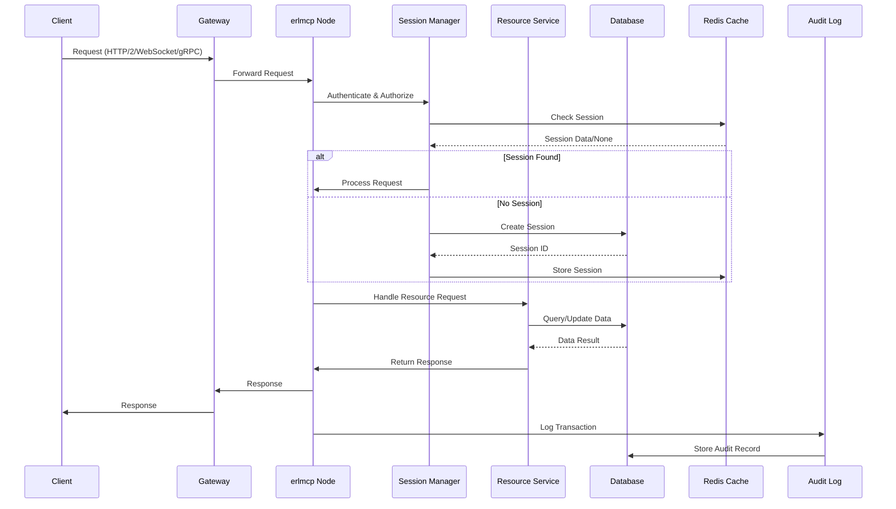
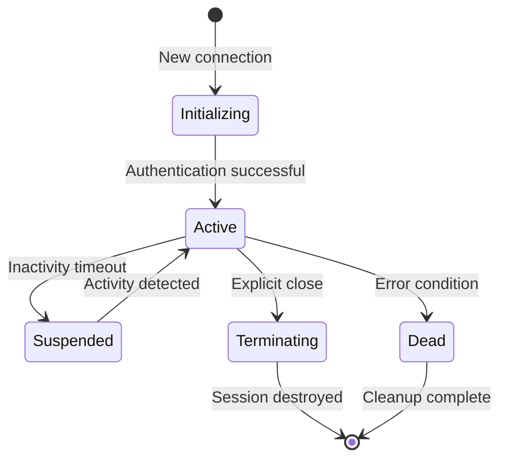
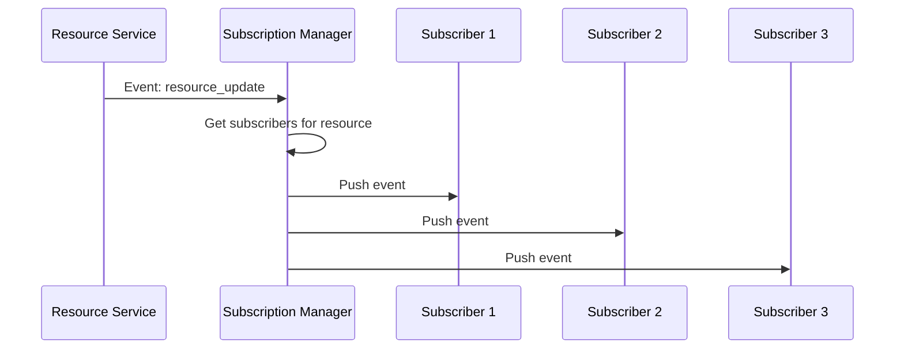
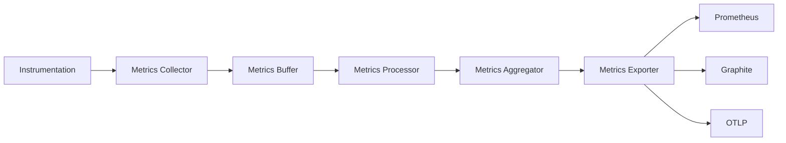
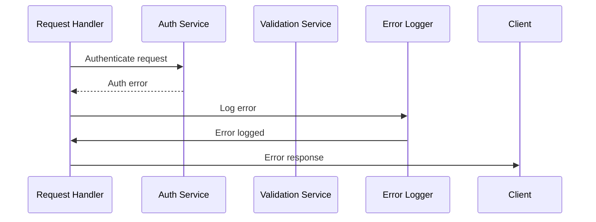
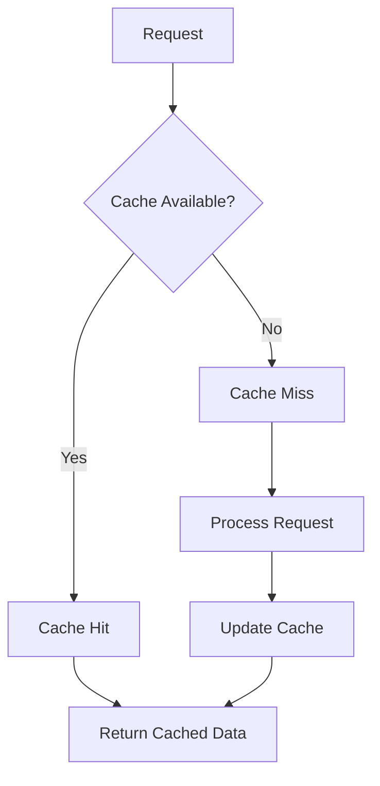
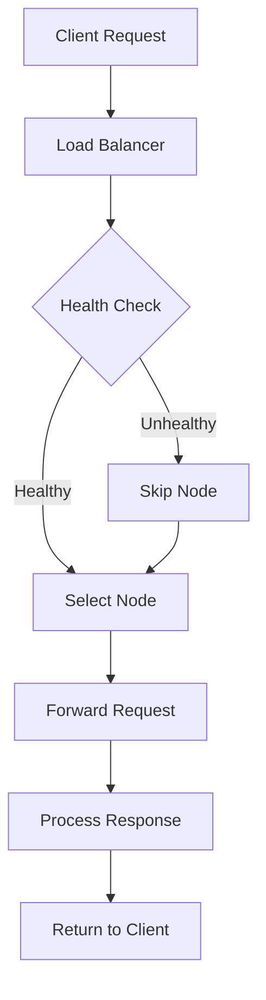
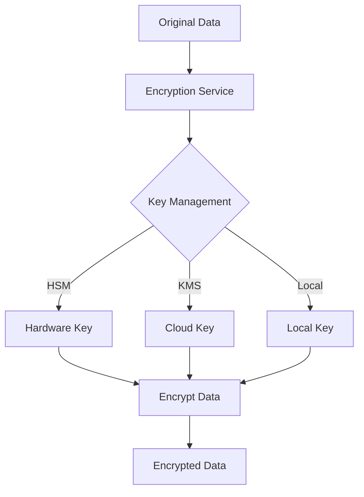

# erlmcp v3 Data Flow Architecture

## 1. Introduction

This document describes the data flow patterns and interactions within erlmcp v3, focusing on how data moves through the system, processing stages, and transformation points.

## 2. Data Flow Overview

### 2.1 System Context

erlmcp v3 operates as a distributed message communication platform with the following key data flows:

1. **Client Request Flow**: From client applications to erlmcp services
2. **Internal Processing Flow**: Within erlmcp cluster
3. **Resource Subscription Flow**: Event-based data distribution
4. **Audit Logging Flow**: Compliance and security tracking
5. **Telemetry Flow**: System and application metrics

### 2.2 Data Flow Diagram



## 3. Request Processing Flow

### 3.1 Request Lifecycle

```erlang
% Request states
-type request_state() :: received | authenticating | authorized | processing | responding | completed.

% Request context
-record(request_context, {
    id :: binary(),
    client_id :: binary(),
    session_id :: binary(),
    method :: binary(),
    params :: map(),
    metadata :: map(),
    timestamp :: erlang:timestamp(),
    state :: request_state()
}).
```

### 3.2 Processing Pipeline

#### 3.2.1 Authentication Stage

```erlang
% Authentication flow
authenticate_request(Request) ->
    % Extract authentication token
    Token = extract_token(Request),

    % Validate token
    case jwt:validate(Token) of
        {ok, Claims} ->
            % Load user context
            case load_user_context(Claims) of
                {ok, UserCtx} ->
                    {ok, UserCtx};
                {error, Reason} ->
                    {error, Reason}
            end;
        {error, Reason} ->
            {error, Reason}
    end.
```

#### 3.2.2 Authorization Stage

```erlang
% Authorization flow
authorize_request(UserCtx, Request) ->
    % Check permissions
    RequiredPerm = required_permission(Request),

    case has_permission(UserCtx, RequiredPerm) of
        true ->
            {ok, authorized};
        false ->
            {error, insufficient_permissions}
    end.
```

#### 3.2.3 Processing Stage

```erlang
% Request processing
process_request(Request, UserCtx) ->
    % Route to appropriate handler
    Handler = get_handler(Request),

    % Process request
    case Handler:execute(Request, UserCtx) of
        {ok, Result} ->
            {ok, Result};
        {error, Reason} ->
            {error, Reason}
    end.
```

## 4. Session Management Flow

### 4.1 Session Lifecycle



### 4.2 Session Persistence Flow

```erlang
% Session storage flow
store_session(Session) ->
    % Determine storage backend
    Backend = get_backend(Session),

    % Store session data
    case Backend:store(Session) of
        ok ->
            % Update cache
            cache:put(Session#session.id, Session),
            ok;
        {error, Reason} ->
            {error, Reason}
    end.
```

## 5. Resource Subscription Flow

### 5.1 Subscription Management

```erlang
% Subscription flow
manage_subscription(ResourceURI, Events) ->
    % Validate resource URI
    case validate_uri(ResourceURI) of
        {ok, ParsedURI} ->
            % Check resource existence
            case resource_exists(ParsedURI) of
                true ->
                    % Create/update subscription
                    Subscription = #{
                        id = generate_id(),
                        resource = ParsedURI,
                        events = Events,
                        client_id = get_client_id(),
                        created = erlang:timestamp()
                    },
                    subscription_manager:register(Subscription);
                false ->
                    {error, resource_not_found}
            end;
        {error, Reason} ->
            {error, Reason}
    end.
```

### 5.2 Event Distribution Flow



## 6. Audit Logging Flow

### 6.1 Audit Event Lifecycle

```erlang
% Audit event structure
-record(audit_event, {
    id :: binary(),
    timestamp :: erlang:timestamp(),
    user_id :: binary(),
    action :: binary(),
    resource_type :: binary(),
    resource_id :: binary(),
    details :: map(),
    source_ip :: binary(),
    user_agent :: binary(),
    session_id :: binary()
}).
```

### 6.2 Audit Pipeline

```ermaid
flowchart TD
    A[Application Action] --> B[Audit Generator]
    B --> C{Event Type}
    C -->|Security| D[Security Events Queue]
    C -->|Data| E[Data Events Queue]
    C -->|System| F[System Events Queue]
    D --> G[Batch Processor]
    E --> G
    F --> G
    G --> H[Event Formatter]
    H --> I[Event Writer]
    I --> J[Audit Database]
    J --> K[Log Aggregator]
    K --> L[SIEM Integration]
```

## 7. Telemetry Flow

### 7.1 Metrics Collection

```erlang
% Metrics collection flow
collect_metrics() ->
    % System metrics
    SystemMetrics = collect_system_metrics(),

    % Application metrics
    AppMetrics = collect_app_metrics(),

    % Combine metrics
    Combined = maps:merge(SystemMetrics, AppMetrics),

    % Send to telemetry
    telemetry:emit(metrics_collected, Combined).
```

### 7.2 Metrics Pipeline



## 8. Data Transformation Points

### 8.1 Request Transformation

```erlang
% Request transformation
transform_request(Request) ->
    % Normalize request format
    Normalized = normalize_request(Request),

    % Validate request structure
    case validate_request(Normalized) of
        {ok, Validated} ->
            % Enrich with metadata
            Enriched = enrich_request(Validated),
            {ok, Enriched};
        {error, Reason} ->
            {error, Reason}
    end.
```

### 8.2 Response Transformation

```erlang
% Response transformation
transform_response(Response) ->
    % Add standard headers
    Headers = add_standard_headers(Response),

    % Format according to protocol
    Formatted = format_response(Response, Headers),

    % Add telemetry
    Enriched = add_telemetry(Formatted),
    Enriched.
```

## 9. Error Handling Flow

### 9.1 Error Propagation



### 9.2 Error Recovery Flow

```erlang
% Error recovery
handle_error(Error, Context) ->
    % Log error
    log_error(Error, Context),

    % Determine error category
    Category = categorize_error(Error),

    % Apply recovery strategy
    case Category of
        retryable ->
            retry(Context);
        recoverable ->
            recover(Context, Error);
        fatal ->
            {error, fatal, Context}
    end.
```

## 10. Data Consistency

### 10.1 Consistency Model

- **Strong Consistency**: For critical operations (user authentication, billing)
- **Eventual Consistency**: For non-critical operations (preferences, settings)
- **Causal Consistency**: For related operations (session state)

### 10.2 Conflict Resolution

```ermaid
flowchart TD
    A[Update Request] --> B{Check Conflicts}
    B -->|No Conflict| C[Apply Update]
    B -->|Conflict Detected| D[Resolve Strategy]
    D -->|Last Write Wins| E[Apply Update]
    D -->|Merge| F[Merge Updates]
    D -->|Reject| G[Return Conflict]
    C --> H[Confirm Update]
    F --> H
    G --> I[Return Error]
```

## 11. Performance Optimization

### 11.1 Caching Strategy



### 11.2 Load Balancing



## 12. Security Data Flow

### 12.1 Encryption Flow



### 12.2 Security Validation

```erlang
% Security validation flow
validate_security(Request) ->
    % Input validation
    case validate_inputs(Request) of
        {ok, CleanRequest} ->
            % Output validation
            case validate_outputs(CleanRequest) of
                {ok, ValidRequest} ->
                    % Rate limiting
                    case check_rate_limit(ValidRequest) of
                        {ok, Allowed} ->
                            {ok, Allowed};
                        {error, Reason} ->
                            {error, Reason}
                    end;
                {error, Reason} ->
                    {error, Reason}
            end;
        {error, Reason} ->
            {error, Reason}
    end.
```

---

*For additional architecture details, refer to the [Architecture Overview](architecture.md) and [System Design Document](system-design.md).*