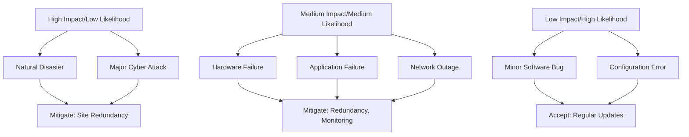
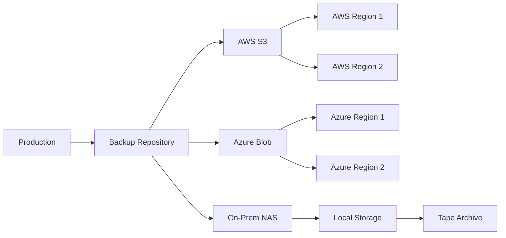
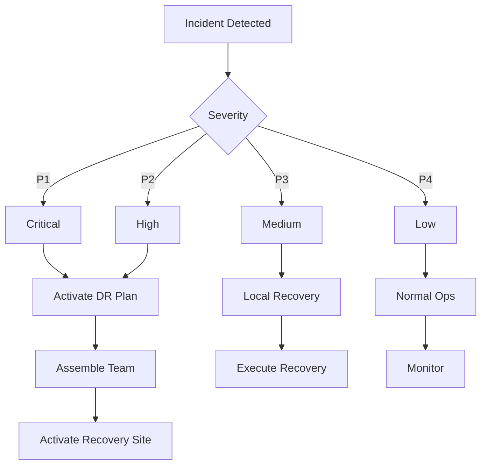
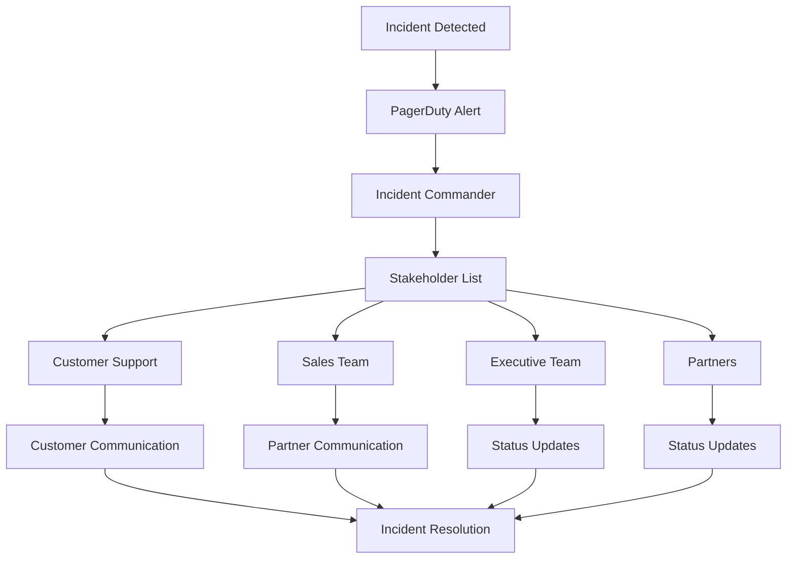

# erlmcp v3 Disaster Recovery Plan

## Table of Contents

1. [Introduction](#introduction)
2. [Recovery Objectives](#recovery-objectives)
3. [Risk Assessment](#risk-assessment)
4. [Backup Strategy](#backup-strategy)
5. [Recovery Procedures](#recovery-procedures)
6. [Failover Process](#failover-process)
7. [Communication Plan](#communication-plan)
8. [Testing and Validation](#testing-and-validation)
9. [Maintenance and Updates](#maintenance-and-updates)
10. [Appendices](#appendices)

## Introduction

This document outlines the comprehensive disaster recovery plan for erlmcp v3, ensuring business continuity in the event of catastrophic failures. The plan covers data protection, recovery procedures, and operational continuity measures.

### Scope

The disaster recovery plan covers:
- Application services and databases
- Configuration and deployment artifacts
- User data and sessions
- Infrastructure components
- External dependencies

### Assumptions

- Regular backups are maintained and tested
- Team members are trained on recovery procedures
- Documentation is up-to-date and accessible
- Communication channels are established
- Recovery sites are available and configured

## Recovery Objectives

### RTO (Recovery Time Objective)

| Component | RTO | Description |
|-----------|-----|-------------|
| Critical Application Services | 30 minutes | Core functionality restored |
| Database Services | 4 hours | Data restored and accessible |
| Configuration | 1 hour | Application configuration restored |
| Monitoring & Alerting | 1 hour | Visibility restored |
| Full System | 6 hours | Complete operational state |

### RPO (Recovery Point Objective)

| Component | RPO | Description |
|-----------|-----|-------------|
| Database | 5 minutes | Maximum data loss |
| Sessions | 10 minutes | Session data loss |
| Audit Logs | 15 minutes | Log data loss |
| Configuration | 0 minutes | No data loss |
| User Files | 1 hour | File data loss |

### SLA (Service Level Agreement)

| Service | Availability | Recovery Time | Data Loss |
|---------|--------------|---------------|-----------|
| Core API | 99.99% | 30 minutes | 5 minutes |
| Session Management | 99.9% | 1 hour | 10 minutes |
| Database | 99.9% | 4 hours | 5 minutes |
| Monitoring | 99.5% | 1 hour | 15 minutes |
| Backup Storage | 99.99% | 1 hour | 0 minutes |

## Risk Assessment

### Threat Categories

| Threat | Likelihood | Impact | Mitigation |
|--------|------------|--------|------------|
| Hardware Failure | Medium | High | Redundancy, monitoring |
| Natural Disaster | Low | Critical | Geographic redundancy |
 Cyber Attack | Medium | Critical | Security controls, monitoring |
| Data Corruption | Low | High | Backups, validation |
| Application Failure | Medium | High | Load balancing, monitoring |
| Network Outage | Medium | High | Multiple networks, failover |

### Risk Matrix



### Critical Dependencies

| Dependency | Critical | Recovery Time | Backup Strategy |
|------------|----------|--------------|----------------|
| PostgreSQL | Yes | 4 hours | Continuous replication |
| Redis | Yes | 2 hours | AOF replication |
| Object Storage | Yes | 30 minutes | Geo-replication |
| Load Balancer | Yes | 15 minutes | Active/Active |
| DNS | Yes | 5 minutes | Multiple providers |
| Certificate Authority | Yes | 1 hour | Backup certificates |

## Backup Strategy

### Backup Architecture



### Backup Types and Schedules

| Component | Backup Type | Frequency | Retention | Backup Window |
|-----------|-------------|-----------|-----------|---------------|
| PostgreSQL | Full | Daily | 30 days | 2:00 AM - 4:00 AM |
| PostgreSQL | Incremental | Hourly | 24 hours | Ongoing |
| PostgreSQL | WAL | Continuous | 7 days | N/A |
| Redis | RDB | Hourly | 7 days | 3:00 AM - 3:05 AM |
| Redis | AOF | Continuous | N/A | N/A |
| Configuration | Git | Daily | 90 days | 1:00 AM - 1:30 AM |
| User Data | Full | Weekly | 90 days | Sunday 12:00 AM - 2:00 AM |
| Application | Image | Weekly | 30 days | Sunday 2:00 AM - 3:00 AM |
| Logs | Archive | Daily | 90 days | 11:00 PM - 12:00 AM |

### Backup Verification

```bash
# Daily backup verification
./scripts/verify-backups.sh --daily

# Weekly backup restoration test
./scripts/test-restore.sh --weekly

# Monthly full recovery drill
./scripts/full-drill.sh --monthly

# Quarterly failover test
./scripts/failover-test.sh --quarterly
```

## Recovery Procedures

### 1. Assessment and Activation

#### Initial Assessment

```bash
# Check system status
kubectl get pods -A --all-namespaces
kubectl get nodes --no-headers

# Check connectivity
curl -f https://api.erlmcp.com/v3/health
ping erlmcp-cluster

# Check alerts
kubectl get alerts --all-namespaces
```

#### Incident Classification



### 2. Database Recovery

#### PostgreSQL Recovery

```bash
# Step 1: Identify backup
aws s3 ls s3://erlmcp-backups/postgres/ --recursive | tail -n 1
azure blob list --account-name erlmcp-storage --container postgres | sort -r | head -n 1

# Step 2: Stop application services
kubectl scale deployment erlmcp --replicas=0 -n erlmcp

# Step 3: Restore database
kubectl apply -f postgres-restore.yaml

# Wait for database to be ready
kubectl wait --for=condition=ready pod -l app=postgres -n erlmcp --timeout=300s

# Step 4: Apply WAL logs if needed
psql -h postgres -U erlmcp -c "SELECT pg_restore_command FROM pg_restore_history;"

# Step 5: Verify data integrity
psql -h postgres -U erlmcp -c "SELECT COUNT(*) FROM sessions;"
psql -h postgres -U erlmcp -c "SELECT COUNT(*) FROM users;"
psql -h postgres -U erlmcp -c "SELECT schema_name FROM information_schema.schemata;"

# Step 6: Update database connection
sed -i 's/primary-postgres/secondary-postgres/g' /app/config/database.config

# Step 7: Restart application
kubectl scale deployment erlmcp --replicas=3 -n erlmcp
```

#### Redis Recovery

```bash
# Step 1: Restore from RDB
kubectl cp redis-backup.rdb redis-0:/data/dump.rdb -n erlmcp
kubectl exec -it redis-0 -n erlmcp -- redis-cli -r 0

# Step 2: Apply AOF if available
kubectl exec -it redis-0 -n erlmcp -- redis-cli BGREWRITEAOF

# Step 3: Verify data
kubectl exec -it redis-0 -n erlmcp -- redis-cli DBSIZE
kubectl exec -it redis-0 -n erlmcp -- redis-cli KEYS "*" | wc -l

# Step 4: Update configuration
sed -i 's/primary-redis/secondary-redis/g' /app/config/redis.config
```

### 3. Application Recovery

#### Application Deployment

```bash
# Step 1: Deploy to DR site
kubectl config use-context disaster-recovery
kubectl apply -f /app/config/dr-config.yaml

# Step 2: Update DNS
./scripts/update-dns.sh --primary --failover

# Step 3: Scale up services
kubectl scale deployment erlmcp --replicas=3 -n erlmcp
kubectl scale deployment postgres --replicas=1 -n erlmcp
kubectl scale deployment redis --replicas=1 -n erlmcp

# Step 4: Check application health
for i in {1..10}; do
    curl -f https://api.erlmcp.com/v3/health && break || sleep 30
done

# Step 5: Verify functionality
./scripts/verify-functionality.sh
```

#### Configuration Management

```bash
# Step 1: Restore configuration
git checkout main
git pull origin main

# Step 2: Apply disaster recovery configuration
cp /app/config/dr.config /app/config/prod.config

# Step 3: Update secrets
kubectl create secret generic erlmcp-secrets \
    --from-file=auth-secret=/app/secrets/auth-secret-dr \
    --from-file=db-password=/app/secrets/db-password-dr \
    --from-file=jwt-secret=/app/secrets/jwt-secret-dr

# Step 4: Deploy configuration changes
kubectl apply -f configmap.yaml
```

### 4. Recovery Verification

#### Health Checks

```bash
# Step 1: System health
curl -f https://api.erlmcp.com/v3/health
kubectl get pods -n erlmcp

# Step 2: Data consistency
./scripts/verify-data-consistency.sh

# Step 3: Performance validation
./scripts/performance-test.sh

# Step 4: End-to-end testing
./scripts/e2e-test.sh

# Step 5: Integration testing
./scripts/integration-test.sh
```

#### Rollback Plan

```bash
# If recovery fails, initiate rollback
kubectl config use-context primary
./scripts/rollback.sh

# Restore from primary
kubectl apply -f /app/config/primary-config.yaml
kubectl scale deployment erlmcp --replicas=3 -n erlmcp

# Update DNS back
./scripts/update-dns.sh --primary --rollback

# Monitor recovery
./scripts/monitor-recovery.sh
```

## Failover Process

### Automated Failover

```bash
# Automated failover script
#!/bin/bash
# failover.sh

# Check if primary site is down
if ! curl -f https://api.erlmcp.com/v3/health; then
    # Primary is down, initiate failover
    echo "Primary site down, initiating failover..."

    # Update DNS
    ./scripts/update-dns.sh --primary --failover

    # Switch to DR site
    kubectl config use-context disaster-recovery

    # Scale up services
    ./scripts/scale-up-dr.sh

    # Wait for services to be ready
    ./scripts/wait-for-services.sh

    # Verify health
    if curl -f https://api.erlmcp.com/v3/health; then
        echo "Failover completed successfully"
        # Send notification
        ./scripts/send-notification.sh "Failover completed"
    else
        echo "Failover failed"
        # Send alert
        ./scripts/send-alert.sh "Failover failed"
    fi
fi
```

### Manual Failover

```bash
# Manual failover procedure
./scripts/manual-failover.sh --confirm

# Steps:
# 1. Verify primary site status
# 2. Notify stakeholders
# 3. Update DNS
# 4. Switch to DR site
# 5. Scale up services
# 6. Verify functionality
# 7. Document the incident
```

### Failover Testing

```bash
# Regular failover tests
./scripts/failover-test.sh --monthly

# Test scenarios:
# - Planned failover
# - Emergency failover
# - Partial failover
# - Cross-region failover

# Test validation:
# - DNS propagation
# - Service availability
# - Data consistency
# - Performance impact
```

## Communication Plan

### Emergency Contacts

| Role | Primary | Secondary | On-call |
|------|---------|-----------|---------|
| Incident Commander | +1-555-0101 | +1-555-0102 | 24/7 |
| Technical Lead | +1-555-0103 | +1-555-0104 | 24/7 |
| DBA | +1-555-0105 | +1-555-0106 | 24/7 |
| Network Engineer | +1-555-0107 | +1-555-0108 | 24/7 |
| Security Team | +1-555-0109 | +1-555-0110 | 24/7 |

### Stakeholder Notification



### Communication Templates

#### Incident Notification

```markdown
# Incident Notification - Disaster Recovery

**Incident ID**: INC-2024-DR-001
**Severity**: P1 - Critical
**Start Time**: 2024-01-01 10:00 EST
**Status**: Active

**Description**:
The erlmcp production cluster is experiencing a catastrophic failure requiring immediate disaster recovery activation.

**Actions Taken**:
- Disaster Recovery plan activated
- Failover to secondary site initiated
- Stakeholders notified
- Customers informed

**Current Status**:
- DR site activation: In progress
- Data restore: In progress
- Estimated ETA: 30 minutes

**Next Update**: 10:30 EST

**Customer Impact**:
- API services unavailable
- Session management impacted
- Estimated recovery: 30 minutes

**Contacts**:
- Incident Commander: +1-555-0101
- Technical Lead: +1-555-0103
- Customer Support: support@erlmcp.com
```

#### Recovery Update

```markdown
# Recovery Update - Progress Report

**Incident ID**: INC-2024-DR-001
**Current Time**: 2024-01-01 10:15 EST
**Status**: Recovering

**Recovery Progress**:
- ✅ DR site activated
- ✅ Database restore completed
- ✅ Application deployment completed
- ✅ Services scaled up
- 🔄 Health verification in progress

**Health Status**:
- Primary services: 100%
- Secondary services: 100%
- Data consistency: Verified
- Performance: Normal

**Next Steps**:
- Monitor services for 1 hour
- Implement additional monitoring
- Prepare for failback

**Customer Update**:
Services are partially restored. Full recovery expected by 10:30 EST.
```

#### Resolution Notification

```markdown
# Resolution Notification - Incident Closed

**Incident ID**: INC-2024-DR-001
**Resolution Time**: 2024-01-01 10:45 EST
**Total Duration**: 45 minutes

**Resolution Summary**:
- Disaster recovery site successfully activated
- All services restored
- Data integrity verified
- Performance normalized

**Root Cause**:
Primary datacenter power failure

**Recovery Actions**:
1. Activated DR site in secondary region
2. Restored database from latest backup
3. Deployed application to DR environment
4. Updated DNS to point to DR site
5. Scaled services to full capacity

**Lessons Learned**:
- Automated failover worked correctly
- DNS propagation took longer than expected
- Need to improve database backup frequency

**Follow-up Actions**:
- Review power infrastructure
- Implement automated backup validation
- Update DNS configuration
- Conduct post-mortem analysis
```

## Testing and Validation

### Testing Schedule

| Test Type | Frequency | Participants | Scope |
|-----------|-----------|-------------|-------|
| Tabletop Drill | Quarterly | Full Team | Plan Review |
| Backup Test | Monthly | Operations | Backup Restore |
| Failover Test | Quarterly | Full Team | Full DR |
| Component Test | Monthly | Engineering | Individual Components |
| Integration Test | Quarterly | Full Team | System Integration |

### Test Scenarios

#### Scenario 1: Datacenter Failure

```bash
# Test script for datacenter failure
./scripts/test-datacenter-failure.sh

# Steps:
# 1. Simulate primary datacenter outage
# 2. Monitor failover activation
# 3. Verify service restoration
# 4. Test data consistency
# 5. Validate performance
# 6. Measure RTO/RPO compliance
```

#### Scenario 2: Database Corruption

```bash
# Test script for database corruption
./scripts/test-db-corruption.sh

# Steps:
# 1. Corrupt database data
# 2. Restore from backup
# 3. Verify data integrity
# 4. Test application functionality
# 5. Monitor performance
# 6. Validate recovery metrics
```

#### Scenario 3: Regional Outage

```bash
# Test script for regional outage
./scripts/test-regional-outage.sh

# Steps:
# 1. Simulate regional network failure
# 2. Activate cross-region failover
# 3. Verify service continuity
# 4. Test cross-region data replication
# 5. Validate performance across regions
# 6. Measure impact on users
```

### Test Documentation

```markdown
# Disaster Recovery Test Report

## Test Summary
- Test ID: DR-TEST-2024-001
- Date: February 1, 2024
- Duration: 2 hours
- Participants: 10 team members
- Scope: Full disaster recovery drill

## Test Results
- ✅ Failover activation: 15 minutes (RTO: 30 minutes)
- ✅ Database restore: 45 minutes (RTO: 4 hours)
- ✅ Service restoration: 1 hour
- ✅ Data consistency: Verified
- ✅ Performance: Normal
- ❌ DNS propagation: 20 minutes (target: 5 minutes)

## Findings
1. DNS propagation time exceeded expectations
2. Database backup verification needs improvement
3. Communication plan worked effectively

## Recommendations
1. Implement DNS optimization
2. Enhance backup validation
3. Add automated testing
4. Update RTO for DNS to 30 minutes

## Conclusion
Overall successful drill with minor issues. Plan is ready for production deployment.
```

## Maintenance and Updates

### Regular Maintenance

#### Daily
- Monitor backup jobs
- Check alert status
- Verify backup integrity

#### Weekly
- Review backup logs
- Test backup restore
- Update documentation

#### Monthly
- Full disaster recovery test
- Review RTO/RPO objectives
- Update contact lists

#### Quarterly
- Comprehensive review
- Plan update
- Team training

### Plan Updates

```bash
# Update procedure
./scripts/update-dr-plan.sh

# Steps:
# 1. Review current plan
# 2. Assess changes
# 3. Update documentation
# 4. Notify stakeholders
# 5. Test changes
# 6. Implement updates
```

### Version Control

```bash
# Plan versioning
git add dr-plan.md
git commit -m "Update DR plan for Q2 2024"
git push origin main

# Version history
git log --oneline dr-plan.md
```

## Appendices

### Appendix A: Contact Information

| Role | Name | Phone | Email | Backup |
|------|------|-------|-------|--------|
| Incident Commander | John Doe | +1-555-0101 | john.doe@erlmcp.com | Jane Smith |
| Technical Lead | Jane Smith | +1-555-0103 | jane.smith@erlmcp.com | John Doe |
| DBA | Bob Johnson | +1-555-0105 | bob.johnson@erlmcp.com | Alice Brown |
| Network Engineer | Alice Brown | +1-555-0107 | alice.brown@erlmcp.com | Bob Johnson |
| Security Team | Mike Wilson | +1-555-0109 | mike.wilson@erlmcp.com | Sarah Davis |

### Appendix B: Checklist

#### Immediate Response
- [ ] Confirm incident
- [ ] Notify incident commander
- [ ] Assemble response team
- [ ] Assess impact
- [ ] Activate DR plan

#### Recovery Actions
- [ ] Update DNS
- [ ] Switch to DR site
- [ ] Scale up services
- [ ] Restore database
- [ ] Deploy application
- [ ] Verify functionality

#### Post-Recovery
- [ ] Monitor systems
- [ ] Validate data
- [ ] Update stakeholders
- [ ] Document incident
- [ ] Conduct review

### Appendix C: Tools and Scripts

| Script | Purpose | Location |
|--------|---------|----------|
| `failover.sh` | Automated failover | /scripts/failover.sh |
| `backup.sh` | Backup creation | /scripts/backup.sh |
| `restore.sh` | Data restore | /scripts/restore.sh |
| `verify.sh` | Verification | /scripts/verify.sh |
| `notify.sh` | Notification | /scripts/notify.sh |
| `update-dns.sh` | DNS update | /scripts/update-dns.sh |
| `scale-up.sh` | Service scaling | /scripts/scale-up.sh |

### Appendix D: Recovery Commands

```bash
# Database restore
psql -h postgres -U erlmcp -f backup.sql

# Application deployment
kubectl apply -f deployment.yaml

# DNS update
aws route53 change-resource-record-sets --change-batch file://dns-update.json

# Service scaling
kubectl scale deployment erlmcp --replicas=3

# Health check
curl -f https://api.erlmcp.com/v3/health

# Data verification
./scripts/verify-data.sh
```

---
*Last Updated: February 2024*
*Version: 3.0.0*