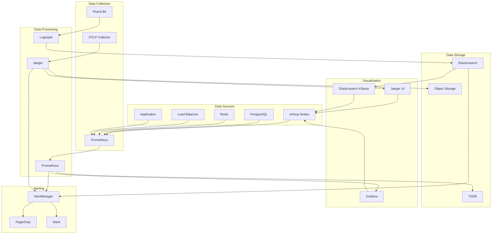

# erlmcp v3 Monitoring and Observability Guide

## Table of Contents

1. [Introduction](#introduction)
2. [Monitoring Architecture](#monitoring-architecture)
3. [Key Metrics](#key-metrics)
4. [Alerting Configuration](#alerting-configuration)
5. [Logging Configuration](#logging-configuration)
6. [Tracing Setup](#tracing-setup)
7. [Dashboards](#dashboards)
8. [Troubleshooting](#troubleshooting)
9. [Best Practices](#best-practices)
10. [Maintenance](#maintenance)

## Introduction

This comprehensive guide covers the monitoring and observability capabilities of erlmcp v3. It provides detailed instructions for setting up, configuring, and maintaining monitoring systems to ensure system health, performance, and security.

### Target Audience

- Site Reliability Engineers (SREs)
- DevOps Engineers
- System Administrators
- Development Teams

### Monitoring Philosophy

- **Proactive Monitoring**: Detect issues before they affect users
- **Comprehensive Coverage**: Monitor all critical components
- **Actionable Alerts**: Provide context and guidance for resolution
- **Continuous Improvement**: Regularly tune and optimize monitoring

## Monitoring Architecture

### Architecture Overview



### Technology Stack

| Component | Technology | Purpose |
|-----------|------------|---------|
| Metrics | Prometheus | Metrics collection and storage |
| Tracing | Jaeger | Distributed tracing |
| Logging | Fluent Bit/Elasticsearch | Log collection and analysis |
| Visualization | Grafana | Dashboards and visualization |
| Alerting | AlertManager | Alert routing and management |
| Synthetics | UptimeRobot | External monitoring |

## Key Metrics

### System Metrics

| Metric | Type | Description | Target |
|--------|------|-------------|--------|
| system_cpu_usage | gauge | CPU utilization percentage | <80% |
| system_memory_usage | gauge | Memory utilization percentage | <90% |
| system_disk_usage | gauge | Disk utilization percentage | <85% |
| system_network_in | counter | Network incoming bytes | N/A |
| system_network_out | counter | Network outgoing bytes | N/A |

### Application Metrics

| Metric | Type | Description | Target |
|--------|------|-------------|--------|
| erlmcp_sessions_count | gauge | Active session count | <max_capacity |
| erlmcp_tools_executed_total | counter | Total tool executions | N/A |
| erlmcp_tools_error_total | counter | Tool execution errors | <1% |
| erlmcp_requests_total | counter | HTTP requests | N/A |
| erlmcp_requests_duration_seconds | histogram | Request duration | <500ms |

### Database Metrics

| Metric | Type | Description | Target |
|--------|------|-------------|--------|
| pg_stat_database_numbackends | gauge | Active database connections | <80% |
| pg_stat_database_xact_commit | counter | Transaction commits | N/A |
| pg_stat_database_xact_rollback | counter | Transaction rollbacks | <5% |
| pg_stat_database_tup_inserted | counter | Rows inserted | N/A |
| pg_stat_database_tup_updated | counter | Rows updated | N/A |

### Cache Metrics

| Metric | Type | Description | Target |
|--------|------|-------------|--------|
| redis_used_memory | gauge | Redis memory usage | <80% |
| redis_connected_clients | gauge | Connected client count | <1000 |
| redis_commands_processed_total | counter | Commands processed | N/A |
| redis_keyspace_hits_total | counter | Cache hits | >80% |

### Business Metrics

| Metric | Type | Description | Target |
|--------|------|-------------|--------|
| active_users | gauge | Daily active users | N/A |
| revenue_per_user | gauge | Revenue per user | N/A |
| api_calls_per_user | counter | API calls per user | N/A |
| error_rate | gauge | Error rate percentage | <1% |

## Alerting Configuration

### Alerting Rules

```yaml
# prometheus-alerts.yaml
groups:
- name: erlmcp-alerts
  interval: 1m
  rules:
  # Critical Alerts
  - alert: HighCPUUsage
    expr: rate(container_cpu_usage_seconds_total{container="erlmcp"}[5m]) > 0.8
    for: 10m
    labels:
      severity: critical
      category: system
      team: erlmcp
    annotations:
      summary: "High CPU usage on {{ $labels.instance }}"
      description: "CPU usage is {{ $value }} for 10 minutes"
      runbook_url: "https://docs.erlmcp.com/v3/monitoring/troubleshooting/high-cpu"

  - alert: HighMemoryUsage
    expr: container_memory_usage_bytes{container="erlmcp"} / container_spec_memory_limit_bytes{container="erlmcp"} > 0.9
    for: 5m
    labels:
      severity: critical
      category: system
      team: erlmcp
    annotations:
      summary: "High memory usage on {{ $labels.instance }}"
      description: "Memory usage is {{ $value }} for 5 minutes"
      runbook_url: "https://docs.erlmcp.com/v3/monitoring/troubleshooting/high-memory"

  - alert: DatabaseConnectionsHigh
    expr: pg_stat_database_numbackends{datname="erlmcp"} / 100 > 0.9
    for: 5m
    labels:
      severity: high
      category: database
      team: erlmcp
    annotations:
      summary: "High database connections on {{ $labels.instance }}"
      description: "Database connections at {{ $value }} of maximum"
      runbook_url: "https://docs.erlmcp.com/v3/monitoring/troubleshooting/database-connections"

  - alert: HighErrorRate
    expr: rate(http_requests_total{status=~"5.."}[5m]) / rate(http_requests_total[5m]) > 0.01
    for: 5m
    labels:
      severity: high
      category: application
      team: erlmcp
    annotations:
      summary: "High error rate on {{ $labels.instance }}"
      description: "Error rate is {{ $value }} for 5 minutes"
      runbook_url: "https://docs.erlmcp.com/v3/monitoring/troubleshooting/high-errors"

  - alert: HighLatency
    expr: histogram_quantile(0.95, rate(http_request_duration_seconds_bucket[5m])) > 1
    for: 5m
    labels:
      severity: medium
      category: performance
      team: erlmcp
    annotations:
      summary: "High latency on {{ $labels.instance }}"
      description: "P95 latency is {{ $value }}s for 5 minutes"
      runbook_url: "https://docs.erlmcp.com/v3/monitoring/troubleshooting/high-latency"

  - alert: SessionLimitReached
    expr: erlmcp_sessions_active > erlmcp_sessions_max
    for: 1m
    labels:
      severity: high
      category: application
      team: erlmcp
    annotations:
      summary: "Session limit reached"
      description: "Active sessions {{ $value }} exceed maximum {{ $labels.max }}"
      runbook_url: "https://docs.erlmcp.com/v3/monitoring/troubleshooting/sessions"

  # Warning Alerts
  - alert: LowDiskSpace
    expr: (1 - (node_filesystem_size_bytes{fstype=~"ext.*"} - node_filesystem_free_bytes{fstype=~"ext.*"}) / node_filesystem_size_bytes{fstype=~"ext.*"}) * 100 > 85
    for: 5m
    labels:
      severity: warning
      category: system
      team: erlmcp
    annotations:
      summary: "Low disk space on {{ $labels.instance }}"
      description: "Disk usage is {{ $value }}%"
      runbook_url: "https://docs.erlmcp.com/v3/monitoring/troubleshooting/low-disk"

  - alert: RedisMemoryHigh
    expr: redis_used_memory / redis_max_memory * 100 > 80
    for: 5m
    labels:
      severity: warning
      category: cache
      team: erlmcp
    annotations:
      summary: "High Redis memory usage"
      description: "Redis memory usage is {{ $value }}%"
      runbook_url: "https://docs.erlmcp.com/v3/monitoring/troubleshooting/redis-memory"

  - alert: DatabaseSlowQueries
    expr: rate(pg_stat_database_total_time[5m]) / rate(pg_stat_database_calls[5m]) > 0.1
    for: 5m
    labels:
      severity: warning
      category: database
      team: erlmcp
    annotations:
      summary: "Slow database queries"
      description: "Average query time is {{ $value }}s"
      runbook_url: "https://docs.erlmcp.com/v3/monitoring/troubleshooting/slow-queries"

  # Info Alerts
  - alert: DeploymentCompleted
    expr: changes(kube_deployment_status_replicas_updated[1h]) > 0
    for: 1m
    labels:
      severity: info
      category: deployment
      team: erlmcp
    annotations:
      summary: "Deployment completed"
      description: "Deployment {{ $labels.deployment }} updated to version {{ $labels.version }}"
      runbook_url: "https://docs.erlmcp.com/v3/monitoring/troubleshooting/deployment"

  - alert: NewErrorType
    expr: increase(http_requests_total{status=~"5.."}[1h]) > 0
    for: 10m
    labels:
      severity: info
      category: application
      team: erlmcp
    annotations:
      summary: "New error type detected"
      description: "New {{ $labels.status }} errors detected"
      runbook_url: "https://docs.erlmcp.com/v3/monitoring/troubleshooting/new-errors"
```

### Alerting Policies

```yaml
# alerting-policies.yaml
policies:
  # Critical Alerts
  critical:
    severity: critical
    channels:
      - pagerduty
      - slack-critical
    timeout: 15m
    escalation:
      - from: 15m
        to: on-call-manager
        repeat: 30m
      - from: 1h
        to: director-of-ops
        repeat: 2h

  # High Alerts
  high:
    severity: high
    channels:
      - slack-high
      - email
    timeout: 1h
    escalation:
      - from: 4h
        to: manager-on-call

  # Medium Alerts
  medium:
    severity: medium
    channels:
      - slack-medium
    timeout: 4h

  # Warning Alerts
  warning:
    severity: warning
    channels:
      - slack-warning
    timeout: 8h

  # Info Alerts
  info:
    severity: info
    channels:
      - slack-info
    timeout: 24h

  # Silencing Rules
  silences:
    - alertname: "DeploymentCompleted"
      duration: 2h
      environments: ["staging", "development"]
    - alertname: "HighMemoryUsage"
      duration: 1h
      reason: "Scheduled maintenance"
```

## Logging Configuration

### Log Configuration

```erlang
% config/logging.config
{
    logger,
    [
        % Console Handler
        {handler, default, logger_console_hander,
            {logger_formatter,
                #{single_line => false,
                  time_design => {utc, ISO8601},
                  legacy_header => true,
                  template => "[$time] $level $metadata $message $gl"
                }},
            #{level => info}},

        % File Handler (with rotation)
        {handler, file, logger_stdlib_hander,
            {logger_disk_log_hander,
                #{file => "/var/log/erlmcp/application.log",
                  type => wrap,
                  max_no_files => 10,
                  max_no_bytes => 100000000,  % 100MB
                  file_check_interval => 10000,
                  sync_mode_qlen => 0,
                  flush_qlen => 0,
                  discard_qlen => 0,
                  compress => true,
                  max_age => 86400,  % 24 hours
                  max_no_bytes => 104857600}},  % 100MB
            #{level => info}},

        % Error Handler
        {handler, error, logger_stdlib_hander,
            {logger_disk_log_hander,
                #{file => "/var/log/erlmcp/error.log",
                  type => wrap,
                  max_no_files => 5,
                  max_no_bytes => 50000000,  % 50MB
                  compress => true}},
            #{level => error}},

        % Access Log Handler
        {handler, access, logger_stdlib_hander,
            {logger_disk_log_hander,
                #{file => "/var/log/erlmcp/access.log",
                  type => wrap,
                  max_no_files => 10,
                  max_no_bytes => 100000000}},  % 100MB
            #{level => info}},

        % SASL Handler
        {handler, sasl, logger_stdlib_hander,
            {logger_disk_log_hander,
                #{file => "/var/log/erlmcp/sasl.log",
                  type => wrap,
                  max_no_files => 3,
                  max_no_bytes => 50000000}},  % 50MB
            #{level => debug}},

        % Filter Application Logs
        {filter, application,
            {fun erlmcp_logger_filter:filter/2, application}},

        % Filter Security Logs
        {filter, security,
            {fun erlmcp_logger_filter:filter/2, security}},

        % Filter Audit Logs
        {filter, audit,
            {fun erlmcp_logger_filter:filter/2, audit}}
    ]
}.
```

### Log Format

```json
{
  "timestamp": "2024-01-01T10:00:00.000Z",
  "level": "info",
  "logger": "erlmcp",
  "message": "HTTP request processed",
  "metadata": {
    "module": "erlmcp_http_handler",
    "function": "handle_request/2",
    "line": 123,
    "pid": "<0.123.456>",
    "trace_id": "trace-12345",
    "span_id": "span-67890"
  },
  "fields": {
    "method": "POST",
    "path": "/v3/tools/call",
    "status": 200,
    "duration_ms": 45,
    "user_id": "user-123",
    "client_ip": "192.168.1.1"
  }
}
```

### Log Forwarding

```yaml
# fluent-bit.conf
[INPUT]
    Name              tail
    Path              /var/log/erlmcp/*.log
    Parser            json
    Tag               erlmcp.*
    Refresh_Interval  5
    Mem_Buf_Limit     5MB

[FILTER]
    Name              modify
    Match             erlmcp.*
    Add               host ${HOSTNAME}
    Add               cluster erlmcp-prod

[FILTER]
    Name              kubernetes
    Match             erlmcp.*
    Kube_URL          https://kubernetes.default.svc:443
    Kube_CA_File      /var/run/secrets/kubernetes.io/serviceaccount/ca.crt
    Kube_Token_File   /var/run/secrets/kubernetes.io/serviceaccount/token
    Kube_Tag_Prefix   erlmcp.var.log.containers.erlmcp-
    Merge_Log         On
    K8S-Logging.Parser On

[OUTPUT]
    Name              es
    Match             erlmcp.*
    Host              elasticsearch-service.elasticsearch.svc.cluster.local
    Port              9200
    Index             erlmcp-logs
    Type              _doc
    Logstash_Format   On
    Logstash_Prefix   erlmcp
    HTTP_User         elastic
    HTTP_Passwd       ${ELASTICSEARCH_PASSWORD}
    Generate_ID        On
    Retry_Limit       False
```

## Tracing Setup

### OpenTelemetry Configuration

```yaml
# otel-collector-config.yaml
receivers:
  otlp:
    protocols:
      grpc:
        endpoint: 0.0.0.0:4317
      http:
        endpoint: 0.0.0.0:4318

  jaeger:
    protocols:
      thrift_http:
        endpoint: 0.0.0.0:14268

processors:
  batch:
    timeout: 1s
    send_batch_size: 1000

  memory_limiter:
    limit_mib: 128

  resource/detection:
    detectors: [default, process, host, kubernetes]

exporters:
  jaeger:
    endpoint: jaeger-collector:14250
    tls:
      insecure: true

  prometheus:
    endpoint: 0.0.0.0:8889

  logging:
    loglevel: debug

service:
  pipelines:
    traces:
      receivers: [otlp, jaeger]
      processors: [memory_limiter, resource/detection, batch]
      exporters: [jaeger, logging]

    metrics:
      receivers: [otlp]
      processors: [memory_limiter, batch]
      exporters: [prometheus, logging]
```

### Jaeger Configuration

```yaml
# jaeger-config.yaml
collector:
  zipkin:
    host_port: 9411

storage:
  type: cassandra
  options:
    hosts:
      - cassandra-node-1
      - cassandra-node-2
      - cassandra-node-3
    port: 9042
    keyspace: jaeger
    username: jaeger
    password: ${CASSANDRA_PASSWORD}

  # Span retention
  span_retention: 168h  # 7 days

  # Indexing
  index_dependencies: true

sampling:
  strategy: probabilistic
  param: 0.1  # 10% sample rate

ui:
  query_timeout: 30s
  max_results: 100
```

### Application Instrumentation

```erlang
% lib/erlmcp_telemetry.erl
-module(erlmcp_telemetry).

-export([start/0, stop/0, instrument/3]).

start() ->
    % Initialize OpenTelemetry
    ok = otel:start(),

    % Configure resources
    ok = otel:set_resource_attributes(#{
        service.name => "erlmcp",
        service.version => "3.0.0",
        deployment.environment => "production",
        host.name => erlang:system_info(hostname)
    }),

    % Configure meter
    ok = otel:meter_start(),

    % Configure exporters
    ok = configure_exporters(),

    % Register instruments
    ok = register_instruments(),

    ok.

stop() ->
    otel:stop().

instrument(Operation, Attributes, Measurements) ->
    % Create a span for the operation
    Span = otel:start_span(Operation, #{
        attributes => Attributes,
        links => []
    }),

    % Execute operation
    Result = execute_operation(Operation, Measurements),

    % End span
    otel:end_span(Span),

    Result.

% Example: Instrument tool execution
instrument_tool_execution(ToolName, Args, Result) ->
    Attributes = #{
        tool.name => ToolName,
        tool.args_count => maps:size(Args),
        tool.status => case Result of
            {ok, _} -> "success";
            {error, _} -> "error"
        end
    },
    Measurements = #{
        tool.execution_time => erlang:system_time(millisecond) - StartTime,
        tool.result_size => term_size(Result)
    },
    instrument("tool.execute", Attributes, Measurements).

% Example: Instrument HTTP request
instrument_http_request(Method, Path, Status, Duration) ->
    Attributes = #{
        http.method => Method,
        http.url => Path,
        http.status_code => Status,
        http.route => extract_route(Path)
    },
    Measurements = #{
        http.duration => Duration,
        http.response_size => 0  % Calculate actual size
    },
    instrument("http.request", Attributes, Measurements).
```

## Dashboards

### System Dashboard

```json
{
  "dashboard": {
    "title": "erlmcp System Overview",
    "panels": [
      {
        "title": "CPU Usage",
        "type": "graph",
        "targets": [
          {
            "expr": "100 - (avg by (instance) (irate(node_cpu_seconds_total{mode='idle'}[5m])) * 100)",
            "legendFormat": "{{instance}}"
          }
        ],
        "gridPos": {"h": 8, "w": 12, "x": 0, "y": 0}
      },
      {
        "title": "Memory Usage",
        "type": "graph",
        "targets": [
          {
            "expr": "1 - (node_memory_MemAvailable_bytes / node_memory_MemTotal_bytes) * 100",
            "legendFormat": "{{instance}}"
          }
        ],
        "gridPos": {"h": 8, "w": 12, "x": 12, "y": 0}
      },
      {
        "title": "Disk Usage",
        "type": "graph",
        "targets": [
          {
            "expr": "1 - (node_filesystem_avail_bytes / node_filesystem_size_bytes) * 100",
            "legendFormat": "{{instance}}-{{mountpoint}}"
          }
        ],
        "gridPos": {"h": 8, "w": 12, "x": 24, "y": 0}
      },
      {
        "title": "Network Traffic",
        "type": "graph",
        "targets": [
          {
            "expr": "sum by (instance, direction) (rate(node_network_receive_bytes_total[5m]))",
            "legendFormat": "{{instance}}-{{direction}}"
          }
        ],
        "gridPos": {"h": 8, "w": 24, "y": 8}
      }
    ]
  }
}
```

### Application Dashboard

```json
{
  "dashboard": {
    "title": "erlmcp Application Metrics",
    "panels": [
      {
        "title": "Active Sessions",
        "type": "singlestat",
        "targets": [
          {
            "expr": "erlmcp_sessions_active",
            "legendFormat": "Active Sessions"
          }
        ],
        "gridPos": {"h": 8, "w": 12, "x": 0, "y": 0}
      },
      {
        "title": "HTTP Requests",
        "type": "graph",
        "targets": [
          {
            "expr": "sum by (method) (rate(http_requests_total[5m]))",
            "legendFormat": "{{method}}"
          }
        ],
        "gridPos": {"h": 8, "w": 12, "x": 12, "y": 0}
      },
      {
        "title": "Response Times",
        "type": "graph",
        "targets": [
          {
            "expr": "histogram_quantile(0.95, rate(http_request_duration_seconds_bucket[5m]))",
            "legendFormat": "P95"
          },
          {
            "expr": "histogram_quantile(0.99, rate(http_request_duration_seconds_bucket[5m]))",
            "legendFormat": "P99"
          }
        ],
        "gridPos": {"h": 8, "w": 12, "x": 24, "y": 0}
      },
      {
        "title": "Error Rate",
        "type": "graph",
        "targets": [
          {
            "expr": "sum by (status) (rate(http_requests_total[5m])) / sum by (status) (rate(http_requests_total[5m]))",
            "legendFormat": "{{status}}"
          }
        ],
        "gridPos": {"h": 8, "w": 24, "y": 8}
      }
    ]
  }
}
```

### Database Dashboard

```json
{
  "dashboard": {
    "title": "Database Performance",
    "panels": [
      {
        "title": "Database Connections",
        "type": "graph",
        "targets": [
          {
            "expr": "pg_stat_database_numbackends{datname='erlmcp'}",
            "legendFormat": "Active Connections"
          },
          {
            "expr": "pg_settings_max_connections{datname='erlmcp'}",
            "legendFormat": "Max Connections"
          }
        ],
        "gridPos": {"h": 8, "w": 12, "x": 0, "y": 0}
      },
      {
        "title": "Query Performance",
        "type": "graph",
        "targets": [
          {
            "expr": "avg(rate(pg_stat_database_total_time[5m]) / rate(pg_stat_database_calls[5m]))",
            "legendFormat": "Avg Query Time (ms)"
          }
        ],
        "gridPos": {"h": 8, "w": 12, "x": 12, "y": 0}
      },
      {
        "title": "Transaction Rate",
        "type": "graph",
        "targets": [
          {
            "expr": "rate(pg_stat_database_xact_commit[5m])",
            "legendFormat": "Commits/s"
          },
          {
            "expr": "rate(pg_stat_database_xact_rollback[5m])",
            "legendFormat": "Rollbacks/s"
          }
        ],
        "gridPos": {"h": 8, "w": 12, "x": 24, "y": 0}
      }
    ]
  }
}
```

## Troubleshooting

### Common Issues

#### High CPU Usage

```bash
# Check top processes
kubectl top pods -n erlmcp

# Get detailed CPU metrics
kubectl exec -it <pod-name> -n erlmcp -- \
    curl -s http://localhost:9090/api/v1/query?query=sum by (container) (rate(container_cpu_usage_seconds_total{container="erlmcp"}[5m]))

# Analyze traces for hot paths
kubectl exec -it <pod-name> -n erlmcp -- \
    curl -s http://jaeger-query:16686/api/traces?service=erlmcp&lookback=1h

# Check specific Erlang processes
kubectl exec -it <pod-name> -n erlmcp -- \
    erl -pa /app/ebin -eval "recon:memory(processes)," -s init stop
```

#### High Memory Usage

```bash
# Check memory usage
kubectl top pods -n erlmcp

# Get memory metrics
kubectl exec -it <pod-name> -n erlmcp -- \
    curl -s http://localhost:9090/api/v1/query?query=container_memory_usage_bytes{container="erlmcp"}

# Check Erlang memory
kubectl exec -it <pod-name> -n erlmcp -- \
    erl -pa /app/ebin -eval "erlang:memory()," -s init stop

# Check for memory leaks
kubectl exec -it <pod-name> -n erlmcp -- \
    erl -pa /app/ebin -eval "recon:memory(processes)," -eval "recon:port_info()," -s init stop
```

#### Slow Database Queries

```bash
# Check database metrics
kubectl exec -it postgres-0 -n erlmcp -- \
    psql -U erlmcp -c "SELECT * FROM pg_stat_activity WHERE state != 'idle';"

# Analyze slow queries
kubectl exec -it postgres-0 -n erlmcp -- \
    psql -U erlmcp -c "SELECT query, calls, total_time, rows FROM pg_stat_statements ORDER BY total_time DESC LIMIT 10;"

# Check database performance
kubectl exec -it postgres-0 -n erlmcp -- \
    psql -U erlmcp -c "SELECT * FROM pg_stat_database WHERE datname = 'erlmcp';"
```

#### Network Issues

```bash
# Check network connectivity
kubectl exec -it <pod-name> -n erlmcp -- \
    curl -I http://postgres-service:5432

# Check network metrics
kubectl exec -it <pod-name> -n erlmcp -- \
    curl -s http://localhost:9090/api/v1/query?query=rate(container_network_transmit_bytes_total[5m])

# Check pod network policies
kubectl get networkpolicy -n erlmcp
```

### Performance Analysis

```bash
# Load testing
./scripts/load-test.sh --duration 30m --users 1000 --rps 5000

# Profiling
kubectl exec -it <pod-name> -n erlmcp -- \
    erl -pa /app/ebin -eval "recon_trace:calls({erlmcp_server, handle_request, 2}, 1000)," -s init stop

# GC analysis
kubectl exec -it <pod-name> -n erlmcp -- \
    erl -pa /app/ebin -eval "erlang:system_info([{garbage_collection_info,0},{heap_size,0}])," -s init stop
```

## Best Practices

### Monitoring Best Practices

1. **Set appropriate alert thresholds**
   - Start with conservative thresholds
   - Adjust based on historical data
   - Consider business impact

2. **Monitor key business metrics**
   - Track user engagement
   - Monitor revenue impact
   - Measure customer satisfaction

3. **Use meaningful alert names**
   - Include severity level
   - Describe the issue clearly
   - Provide actionable information

4. **Maintain documentation**
   - Document alert procedures
   - Create runbooks for common issues
   - Keep contact information updated

5. **Monitor across environments**
   - Production, staging, and development
   - Compare metrics across environments
   - Identify environment-specific issues

### Logging Best Practices

1. **Log at appropriate levels**
   - ERROR: System failures, critical issues
   - WARN: Unexpected situations, recoverable errors
   - INFO: Important operational events
   - DEBUG: Detailed debugging information

2. **Include correlation IDs**
   - Track requests across services
   - Include in HTTP headers
   - Use for troubleshooting

3. **Avoid logging sensitive data**
   - Never log passwords, tokens, or PII
   - Use data masking
   - Log metadata instead of values

4. **Structure logs consistently**
   - Use JSON format for structured logging
   - Include timestamps, levels, and messages
   - Add context information

5. **Log performance events**
   - Track slow operations
   - Monitor resource usage
   - Measure request/response times

### Tracing Best Practices

1. **Use spans effectively**
   - Create spans for logical operations
   - Include meaningful names
   - Add relevant attributes

2. **Sample appropriately**
   - Use probabilistic sampling
   - Adjust based on traffic
   - Consider business criticality

3. **Annotate spans**
   - Add tags for important events
   - Include error information
   - Mark service boundaries

4. **Distribute context**
   - Pass correlation IDs
   - Use HTTP headers
   - Preserve trace context

5. **Analyze traces regularly**
   - Look for slow operations
   - Identify error patterns
   - Optimize critical paths

## Maintenance

### Regular Maintenance Tasks

#### Daily
- Check alert status
- Review error logs
- Monitor system health
- Update dashboards

#### Weekly
- Review alert thresholds
- Check alert effectiveness
- Update documentation
- Perform maintenance windows

#### Monthly
- Review performance metrics
- Optimize monitoring configuration
- Audit alert policies
- Train team members

#### Quarterly
- Review business metrics
- Update monitoring strategy
- Conduct performance testing
- Review disaster recovery procedures

### Monitoring Configuration Updates

```bash
# Update Prometheus configuration
kubectl create configmap prometheus-config \
    --from-file=prometheus.yml \
    --dry-run=client -o yaml | \
    kubectl apply -f -

# Update AlertManager configuration
kubectl create configmap alertmanager-config \
    --from-file=alertmanager.yml \
    --dry-run=client -o yaml | \
    kubectl apply -f -

# Update Grafana dashboards
kubectl create configmap grafana-dashboards \
    --from-file=dashboards/ \
    --dry-run=client -o yaml | \
    kubectl apply -f -
```

### Performance Tuning

```bash
# Optimize Prometheus retention
kubectl edit configmap prometheus-config -n monitoring
# Add or update:
# retention: 30d
# retention_size: 10GB

# Optimize query performance
# Use recording rules for frequently used queries
kubectl edit configmap prometheus-config -n monitoring
# Add recording rules:
# - expr: sum(rate(http_requests_total[5m]))
#   labels:
#     __name__: http_requests_rate

# Optimize Grafana dashboards
# Use template variables for dynamic filtering
# Use panel linking for navigation
# Use annotations for events
```

---
*Last Updated: February 2024*