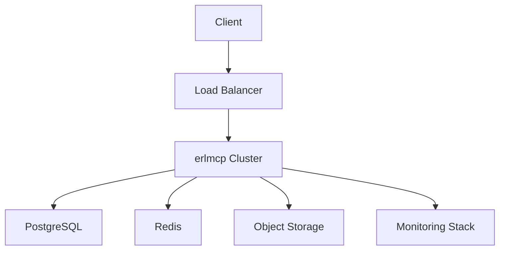

# erlmcp v3 Operations Manual

## Table of Contents

1. [Introduction](#introduction)
2. [System Overview](#system-overview)
3. [Daily Operations](#daily-operations)
4. [Monitoring](#monitoring)
5. [Incident Management](#incident-management)
6. [Change Management](#change-management)
7. [Maintenance Procedures](#maintenance-procedures)
8. [Performance Tuning](#performance-tuning)
9. [Disaster Recovery](#disaster-recovery)
10. [Contact Information](#contact-information)

## Introduction

This manual provides comprehensive guidance for operating erlmcp v3 in enterprise environments. It covers routine operations, monitoring procedures, incident response, and maintenance activities.

### Target Audience

- System Administrators
- DevOps Engineers
- Site Reliability Engineers (SREs)
- Support Teams

### Documentation Conventions

- **Bold text**: Important commands or critical information
- `Code blocks`: Commands, configurations, or code snippets
- `Italics`: File paths or directory names

## System Overview

### Architecture Components

| Component | Description | Health Indicators |
|----------|-------------|-------------------|
| erlmcp Node | Core application server | HTTP 200 OK, <5% CPU |
| PostgreSQL Database | Persistent storage | <10ms latency, <90% usage |
| Redis Cache | Session and data cache | <5ms latency, <80% memory |
| Load Balancer | Traffic distribution | 5xx <1%, <50ms latency |
| Monitoring | Observability stack | Data collection active |

### Service Dependencies



## Daily Operations

### 1. System Health Check

**Morning Checklist (09:00 EST)**

```bash
# Check overall health
curl -f https://api.erlmcp.com/v3/health

# Check cluster status
kubectl get pods -n erlmcp

# Check database status
kubectl exec -it postgres-0 -n erlmcp -- pg_isready -U erlmcp

# Check Redis status
kubectl exec -it redis-0 -n erlmcp -- redis-cli ping

# Check backup status
kubectl get backups -n erlmcp
```

### 2. Performance Monitoring

**Daily Performance Report**

```bash
# Check node performance
kubectl top nodes

# Check pod performance
kubectl top pods -n erlmcp

# Check database performance
kubectl exec -it postgres-0 -n erlmcp -- psql -U erlmcp -c "SELECT * FROM pg_stat_activity WHERE state != 'idle';"

# Check Redis memory usage
kubectl exec -it redis-0 -n erlmcp -- redis-cli INFO memory
```

### 3. Log Analysis

**Daily Log Review**

```bash
# Check error logs
kubectl logs -n erlmcp -l app=erlmcp | grep ERROR | tail -50

# Check database logs
kubectl logs -n erlmcp postgres-0 | grep ERROR | tail -50

# Check authentication logs
kubectl logs -n erlmcp -l app=erlmcp | grep "auth" | tail -100
```

## Monitoring

### Key Metrics to Monitor

#### System Metrics

| Metric | Threshold | Action Required |
|--------|-----------|----------------|
| CPU Utilization | >80% for 10 min | Scale up or optimize |
| Memory Usage | >90% for 10 min | Investigate memory leak |
| Disk Usage | >85% | Clean up or expand |
| Network Latency | >100ms | Investigate network issues |

#### Application Metrics

| Metric | Threshold | Action Required |
|--------|-----------|----------------|
| 5xx Errors | >1% for 5 min | Investigate application errors |
| Response Time | >500ms for 10 min | Profile and optimize |
| Active Sessions | >80% of capacity | Scale horizontally |
| Database Connections | >90% of max pool size | Increase pool size |

#### Business Metrics

| Metric | Threshold | Action Required |
|--------|-----------|----------------|
| Authentication Failures | >5% for 5 min | Check authentication service |
| Tool Execution Time | >1s for 10% of requests | Optimize tool performance |
| Resource Subscription Latency | >1s for 10% of subscriptions | Investigate subscription service |

### Monitoring Tools

#### Prometheus Queries

```yaml
# High CPU usage
- query: rate(container_cpu_usage_seconds_total{container="erlmcp"}[5m])
  threshold: 0.8
  duration: 10m

# High memory usage
- query: container_memory_usage_bytes{container="erlmcp"} / container_spec_memory_limit_bytes{container="erlmcp"}
  threshold: 0.9
  duration: 5m

# Database latency
- query: pg_stat_database_sum_call_time{datname="erlmcp"} / pg_stat_database_count_call_time{datname="erlmcp"}
  threshold: 0.01
  duration: 5m

# Error rate
- query: rate(http_requests_total{status=~"5.."}[5m]) / rate(http_requests_total[5m])
  threshold: 0.01
  duration: 5m
```

#### Grafana Dashboards

1. **System Dashboard**
   - CPU, Memory, Disk usage
   - Network throughput
   - Pod status and restarts

2. **Application Dashboard**
   - HTTP request rates and response times
   - Session counts
   - Tool execution metrics

3. **Database Dashboard**
   - Query performance
   - Connection pool usage
   - Storage growth

### Alerting Configuration

```yaml
groups:
- name: erlmcp_alerts
  rules:
  - alert: HighCPUUsage
    expr: rate(container_cpu_usage_seconds_total{container="erlmcp"}[5m]) > 0.8
    for: 10m
    labels:
      severity: critical
    annotations:
      summary: "High CPU usage on erlmcp node"
      description: "CPU usage is {{ $value }} for 10 minutes"

  - alert: HighMemoryUsage
    expr: container_memory_usage_bytes{container="erlmcp"} / container_spec_memory_limit_bytes{container="erlmcp"} > 0.9
    for: 5m
    labels:
      severity: warning
    annotations:
      summary: "High memory usage on erlmcp node"
      description: "Memory usage is {{ $value }}"

  - alert: DatabaseConnectionsHigh
    expr: pg_stat_database_numbackends{datname="erlmcp"} / 100 > 0.9
    for: 5m
    labels:
      severity: warning
    annotations:
      summary: "High database connections"
      description: "Database connections at {{ $value }} of maximum"
```

## Incident Management

### Incident Classification

| Level | Description | Response Time |
|-------|------------|---------------|
| P1 (Critical) | System down, service impacting | 15 minutes |
| P2 (High) | Major functionality impaired | 1 hour |
| P3 (Medium) | Minor functionality impaired | 4 hours |
| P4 (Low) | Cosmetic or minor issue | 8 hours |

### Incident Response Procedure

#### Step 1: Detection and Classification

```bash
# Check system status
curl -f https://api.erlmcp.com/v3/health

# Check specific components
kubectl get pods -n erlmcp
kubectl describe pod <problematic-pod> -n erlmcp
```

#### Step 2: Containment

```bash
# Scale affected service
kubectl scale deployment erlmcp --replicas=2 -n erlmcp

# Drain problematic node if needed
kubectl cordon <node-name>
kubectl drain <node-name> --ignore-daemonsets
```

#### Step 3: Diagnosis

```bash
# Check logs
kubectl logs <pod-name> -n erlmcp --tail=1000

# Check events
kubectl get events -n erlmcp --sort-by=.metadata.creationTimestamp

# Check resource usage
kubectl describe pod <pod-name> -n erlmcp
```

#### Step 4: Resolution

```bash
# Restart service
kubectl rollout restart deployment erlmcp -n erlmcp

# Apply configuration changes
kubectl apply -f fixed-config.yaml

# Update deployment
kubectl set image deployment/erlmcp erlmcp=erlmcp/v3:3.0.1-fixed -n erlmcp
```

#### Step 5: Post-Incident Review

Document the incident in the system:
- Timeline of events
- Root cause analysis
- Resolution steps
- Preventive measures

### Communication Templates

#### Critical Incident Notification

**Subject: CRITICAL: erlmcp Service Down**

**Message:**
```
CRITICAL INCIDENT NOTIFICATION

Incident ID: INC-2024-001
Severity: P1 - Critical
Start Time: 2024-01-01 10:00 EST
Affected Systems: erlmcp Production Cluster

Description:
The erlmcp production cluster is experiencing complete service outage.

Immediate Actions Taken:
- Restarted all erlmcp nodes
- Initiated failover procedures
- Engaged on-call engineers

Current Status:
- Investigation ongoing
- ETA: 30 minutes

Next Update: 10:30 EST

Contact: emergency-response@erlmcp.com
```

## Change Management

### Change Types

| Type | Description | Approval Required |
|------|------------|------------------|
| Standard | Minor bug fixes, documentation updates | Manager |
| Normal | Feature updates, configuration changes | Director |
| Emergency | Critical bug fixes, security patches | Emergency approval |

### Change Procedure

#### Pre-Change Checklist

```bash
# Verify backup status
kubectl get backups -n erlmcp

# Check system health
curl -f https://api.erlmcp.com/v3/health

# Validate configuration
erl -pa /app/ebin -eval "config:validate()" -s init stop
```

#### Change Execution

```bash
# Apply changes
kubectl apply -f update.yaml

# Monitor impact
kubectl get pods -n erlmcp -w

# Verify deployment
kubectl rollout status deployment/erlmcp -n erlmcp
```

#### Post-Change Verification

```bash
# Run full test suite
./test/smoke-test.sh

# Check performance metrics
kubectl top pods -n erlmcp

# Verify functionality
curl -f https://api.erlmcp.com/v3/health
```

### Rollback Procedure

```bash
# Immediate rollback
kubectl rollout undo deployment/erlmcp -n erlmcp

# Restore from backup
kubectl restore restore-from-backup-<timestamp>

# Check status
kubectl get pods -n erlmcp
```

## Maintenance Procedures

### Regular Maintenance Schedule

#### Weekly Maintenance (Sunday 02:00-04:00 EST)

```bash
# 1. Backup databases
./scripts/backup-weekly.sh

# 2. Rotate logs
./scripts/logs-rotate.sh

# 3. Clean up temporary files
./scripts/cleanup-temp.sh

# 4. Update system packages (if needed)
./scripts/update-packages.sh

# 5. Verify all services
./scripts/verify-services.sh
```

#### Monthly Maintenance (First Sunday 01:00-06:00 EST)

```bash
# 1. System health check
./scripts/health-check.sh

# 2. Performance optimization
./scripts/performance-optimize.sh

# 3. Security patching
.//scripts/security-patch.sh

# 4. Log archive
./scripts/archive-logs.sh

# 5. Database maintenance
./scripts/db-maintenance.sh
```

### Maintenance Windows

| Frequency | Duration | Allowed Downtime | Maintenance Type |
|-----------|----------|------------------|----------------|
| Weekly | 2 hours | 30 minutes | Minor updates |
| Monthly | 5 hours | 2 hours | Major updates |
| Quarterly | 8 hours | 4 hours | Version upgrades |

### Zero-Downtime Maintenance

```bash
# 1. Start with two nodes
kubectl scale deployment erlmcp --replicas=2 -n erlmcp

# 2. Perform rolling update
kubectl set image deployment/erlmcp erlmcp=erlmcp/v3:3.1.0 -n erlmcp

# 3. Monitor
kubectl rollout status deployment/erlmcp -n erlmcp --timeout=30m

# 4. Scale up to desired replicas
kubectl scale deployment erlmcp --replicas=3 -n erlmcp
```

## Performance Tuning

### Configuration Optimization

#### Erlang VM Tuning

```erlang
# config/vm.config
[
    % Erlang VM tuning
    {erts, [
        {async_threads, 64},
        {thread_pool_size, 64},
        {max_heap_size, {2,gb}},
        {max_heap_size, 0, {erlang, system_info, {wordsize}}},
        {heap_growth_margin, 20}
    ]},

    % Connection tuning
    {kernel, [
        {inet_default_connect_options, [{nodelay,true}]},
        {inet_default_listen_options, [{nodelay,true},{reuseaddr,true}]}
    ]},

    % ETS table optimization
    {erlmcp, [
        {ets_cache_size, 1048576},  % 1M entries
        {ets_cache_ttl, 3600},      % 1 hour
        {connection_pool_size, 100}
    ]}
].
```

#### Database Optimization

```sql
-- Optimize query performance
CREATE INDEX idx_sessions_user_id ON sessions(user_id);
CREATE INDEX idx_sessions_created_at ON sessions(created_at);

-- Optimize table storage
ALTER TABLE audit_logs SET (autovacuum_vacuum_scale_factor = 0.1);
ALTER TABLE audit_logs SET (autovacuum_analyze_scale_factor = 0.05);

-- Configure connection pooling
ALTER SYSTEM SET max_connections = 100;
ALTER SYSTEM SET shared_preload_libraries = 'pg_stat_statements';
```

### Load Testing

```bash
# Run load test
./scripts/load-test.sh --duration 30m --users 1000 --rps 5000

# Monitor during test
watch "kubectl top pods -n erlmcp"

# Analyze results
./scripts/analyze-results.sh load-test-results.json
```

## Disaster Recovery

### Recovery Time Objectives (RTO)

| Component | RTO | RPO |
|-----------|-----|-----|
| Database | 4 hours | <5 minutes |
| Application | 15 minutes | <1 minute |
| Configuration | 1 hour | 0 minutes |
| Backup | 6 hours | 24 hours |

### Recovery Procedures

#### Database Recovery

```bash
# 1. Identify backup
kubectl get backups -n erlmcp

# 2. Restore database
kubectl restore create --from-backup=backup-20240101020000 -n erlmcp

# 3. Verify data integrity
kubectl exec -it postgres-0 -n erlmcp -- psql -U erlmcp -c "SELECT COUNT(*) FROM sessions;"

# 4. Restart application
kubectl rollout restart deployment erlmcp -n erlmcp
```

#### Full Site Recovery

```bash
# 1. Standby cluster activation
kubectl config use-context disaster-recovery

# 2. Restore full stack
./scripts/restore-full-stack.sh

# 3. Verify services
./scripts/verify-full-recovery.sh

# 4. Update DNS
./scripts/update-dns-disaster-recovery.sh

# 5. Failover complete
./scripts/failover-complete.sh
```

### Testing Recovery Procedures

```bash
# Monthly recovery test
./scripts/test-database-recovery.sh

# Quarterly full drill
./scripts/full-drill.sh

# Verify RTO/RPO compliance
./scripts/compliance-check.sh
```

## Contact Information

### Support Teams

| Team | Contact | Hours |
|------|---------|-------|
| Tier 1 Support | support@erlmcp.com | 24/7 |
| Tier 2 Support | enterprise-support@erlmcp.com | 24/7 |
| Engineering Team | engineering@erlmcp.com | 24/7 on-call |
| Incident Commander | incident-response@erlmcp.com | 24/7 |

### Emergency Contacts

**P1/P2 Incidents:**
- Primary: +1-555-0101
- Secondary: +1-555-0102
- Tertiary: +1-555-0103

### Documentation Updates

This manual is updated quarterly. For immediate updates or corrections, contact:
- Documentation Team: docs@erlmcp.com
- Process Owner: operations@erlmcp.com

### Version History

| Version | Date | Changes |
|---------|------|---------|
| 3.0.0 | January 2024 | Initial version |
| 3.0.1 | February 2024 | Added incident management procedures |
| 3.0.2 | March 2024 | Updated disaster recovery procedures |

---
*Last Updated: February 2024*