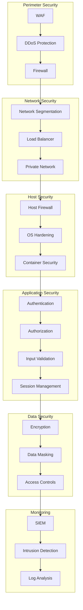
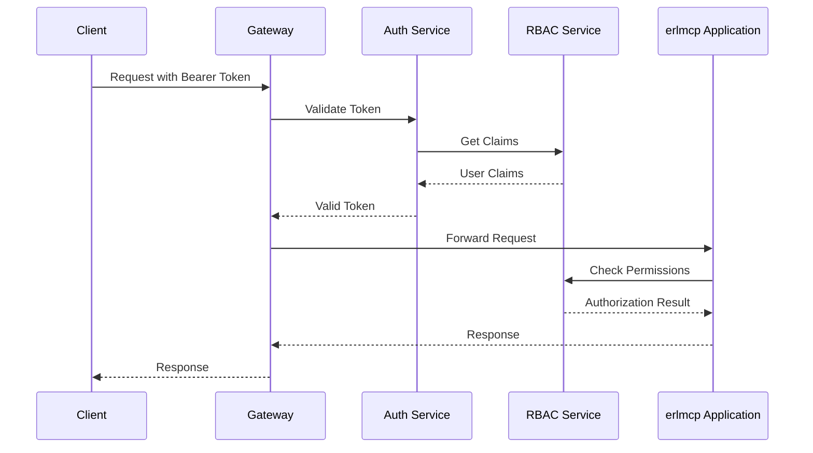
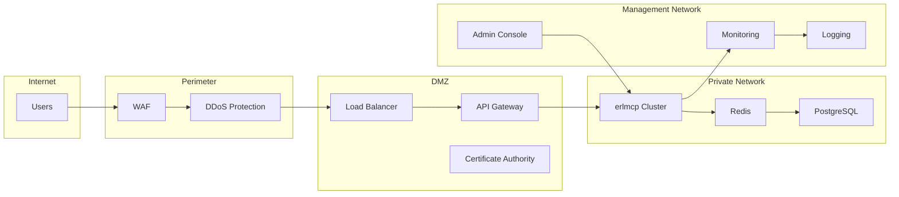

# erlmcp v3 Security Guide

## Table of Contents

1. [Introduction](#introduction)
2. [Security Architecture](#security-architecture)
3. [Authentication & Authorization](#authentication--authorization)
4. [Data Protection](#data-protection)
5. [Network Security](#network-security)
6. [Application Security](#application-security)
7. [Infrastructure Security](#infrastructure-security)
8. [Compliance](#compliance)
9. [Incident Response](#incident-response)
10. [Security Best Practices](#security-best-practices)
11. [Appendices](#appendices)

## Introduction

This security guide provides comprehensive information about securing erlmcp v3 deployments in enterprise environments. It covers security architecture, implementation details, compliance requirements, and operational procedures.

### Target Audience

- Security Engineers
- System Administrators
- DevOps Teams
- Compliance Officers
- Auditors

### Scope

The scope includes:
- Application security
- Infrastructure security
- Network security
- Data protection
- Compliance requirements

## Security Architecture

### Defense in Depth Model



### Security Zones

| Zone | Purpose | Security Level | Access Control |
|------|---------|---------------|---------------|
| DMZ | External-facing services | Medium | Strict ingress rules |
| Application | Application servers | High | Service-to-service auth |
| Database | Data storage | Critical | Database-level auth |
| Admin | Administrative access | Highest | Multi-factor auth |

## Authentication & Authorization

### Authentication Flow



### JWT Configuration

```erlang
% config/auth.config
{
    auth,
    [
        % JWT Configuration
        {jwt_provider, "https://auth.erlmcp.com"},
        {jwt_issuer, "erlmcp"},
        {jwt_audience, ["erlmcp-api"]},
        {jwt_algorithm, "RS256"},
        {jwt_public_key, "/etc/ssl/public.pem"},
        {jwt_private_key, "/etc/ssl/private.pem"},
        {jwt_ttl, 3600},  % 1 hour
        {jwt_refresh_ttl, 86400},  % 24 hours

        % OAuth2 Configuration
        {oauth2_providers, [
            {google, [
                {client_id, "your-google-client-id"},
                {client_secret, "your-google-client-id"},
                {discovery_url, "https://accounts.google.com/.well-known/openid-configuration"},
                {scopes, ["openid", "profile", "email"]}
            ]},
            {azure, [
                {tenant_id, "your-azure-tenant-id"},
                {client_id, "your-azure-client-id"},
                {client_secret, "your-azure-client-secret"},
                {discovery_url, "https://login.microsoftonline.com/{tenant_id}/v2.0/.well-known/openid-configuration"},
                {scopes, ["openid", "profile", "email"]}
            ]}
        ]},

        % Local Authentication
        {local_auth_enabled, true},
        {local_auth_max_attempts, 5},
        {local_auth_lockout_duration, 900},  % 15 minutes

        % SAML Configuration
        {saml_enabled, false},
        {saml_idp_metadata_url, "https://idp.example.com/metadata"},
        {saml_sp_metadata_url, "https://api.erlmcp.com/saml/metadata"}
    ]
}.
```

### Role-Based Access Control (RBAC)

```erlang
% roles.config
{
    rbac,
    [
        % System Roles
        {roles, [
            {admin, [
                "read:*",
                "write:*",
                "delete:*",
                "manage:*",
                "system:*"
            ]},
            {developer, [
                "read:resources",
                "write:resources",
                "read:prompts",
                "write:prompts",
                "read:tools",
                "write:tools"
            ]},
            {user, [
                "read:resources",
                "write:resources",
                "read:prompts"
            ]},
            {viewer, [
                "read:resources",
                "read:prompts"
            ]}
        ]},

        % Role inheritance
        {inheritance, [
            {developer, inherits_from => [user]},
            {admin, inherits_from => [developer]}
        ]},

        % Default roles
        {default_roles, ["viewer"]},

        % Permission validation
        {validation, [
            {pattern, "^[a-zA-Z]+:[a-zA-Z*]+$"},
            {min_permissions, 1},
            {max_permissions, 100}
        ]}
    ]
}.
```

### Multi-Factor Authentication (MFA)

```erlang
% mfa.config
{
    mfa,
    [
        % MFA Methods
        {methods, [
            {totp, [
                {issuer, "erlmcp"},
                {algorithm, "sha256"},
                {digits, 6},
                {period, 30}
            ]},
            {sms, [
                {provider, "twilio"},
                {from_number, "+15551234567"}
            ]},
            {email, [
                {template, "mfa-email.html"},
                {subject, "erlmcp Security Code"}
            ]}
        ]},

        % MFA Policies
        {policies, [
            {enforce_for, ["admin", "developer"]},
            {skip_for, ["viewer"]},
            {enforce_mfa_on, ["password_change", "api_key_create"]},
            {remember_device, true},
            {remember_duration, 86400}  % 24 hours
        ]}
    ]
}.
```

## Data Protection

### Encryption

#### Encryption Configuration

```erlang
% encryption.config
{
    encryption,
    [
        % At-Rest Encryption
        {at_rest,
            [
                {algorithm, "aes-256-gcm"},
                {key_rotation_days, 90},
                {data_classes, [
                    "sessions",
                    "audit_logs",
                    "user_data",
                    "configuration"
                ]},
                {key_store,
                    [
                        {type, "aws_kms"},
                        {region, "us-east-1"},
                        {key_id, "alias/erlmcp-master-key"}
                    ]
                }
            ]
        },

        % In-Transit Encryption
        {in_transit,
            [
                {protocols, ["tlsv1.2", "tlsv1.3"]},
                {cipher_suites, [
                    "TLS_AES_256_GCM_SHA384",
                    "TLS_CHACHA20_POLY1305_SHA256",
                    "TLS_AES_128_GCM_SHA256"
                ]},
                {certificate, "/etc/ssl/server.crt"},
                {private_key, "/etc/ssl/server.key"},
                {hsts, true},
                {hsts_max_age, 31536000}  % 1 year
            ]
        },

        % Field-Level Encryption
        {field_level,
            [
                {mappings, [
                    {"ssn", "aes-256-gcm"},
                    {"credit_card", "aes-256-gcm"},
                    {"medical_record", "aes-256-gcm"}
                ]},
                {key_derivation, "pbkdf2"},
                {iterations, 100000}
            ]
        }
    ]
}.
```

### Data Masking

```sql
-- Configure column-level data masking
ALTER TABLE users
    ADD COLUMN ssn_masked GENERATE ALWAYS AS (
        CASE
            WHEN role = 'admin' THEN ssn
            ELSE CONCAT('***-**-', RIGHT(ssn, 4))
        END
    ) STORED;

-- Row-level security policies
CREATE POLICY admin_users_policy ON users
    FOR ALL
    TO admin
    USING (role = 'admin');

CREATE POLICY regular_users_policy ON users
    FOR SELECT
    TO user
    USING (true);
```

### Data Loss Prevention (DLP)

```erlang
% dlp.config
{
    dlp,
    [
        % Data Classification Rules
        {classification, [
            {public, ["marketing_content", "documentation"]},
            {internal, ["user_profiles", "configuration"]},
            {confidential, ["ssn", "financial_data", "health_records"]},
            {restricted, ["corporate_secrets", "legal_documents"]}
        ]},

        % Inspection Rules
        {inspection, [
            {patterns, [
                {ssn, "\\b\\d{3}-\\d{2}-\\d{4}\\b"},
                {credit_card, "\\b\\d{4}[ -]?\\d{4}[ -]?\\d{4}[ -]?\\d{4}\\b"},
                {email, "\\b[A-Za-z0-9._%+-]+@[A-Za-z0-9.-]+\\.[A-Z|a-z]{2,}\\b"}
            ]},
            {thresholds, [
                {ssn, 1},
                {credit_card, 1},
                {email, 10}
            ]}
        ]},

        % Prevention Actions
        {prevention, [
            {block, ["restricted"]},
            {alert, ["confidential"]},
            {monitor, ["internal"]},
            {allow, ["public"]}
        ]},

        % Logging
        {logging, [
            {enabled, true},
            {level, "info"},
            {retention_days, 365}
        ]}
    ]
}.
```

## Network Security

### Network Architecture



### Firewall Rules

```bash
# Allow inbound traffic
iptables -A INPUT -p tcp --dport 80 -m state --state NEW -j ACCEPT
iptables -A INPUT -p tcp --dport 443 -m state --state NEW -j ACCEPT
iptables -A INPUT -p tcp --dport 8080 -m state --state NEW -j ACCEPT

# Allow outbound traffic
iptables -A OUTPUT -p tcp --dport 443 -m state --state NEW -j ACCEPT
iptables -A OUTPUT -p tcp --dport 5432 -m state --state NEW -j ACCEPT
iptables -A OUTPUT -p tcp --dport 6379 -m state --state NEW -j ACCEPT

# Deny all other traffic
iptables -A INPUT -j DROP
iptables -A OUTPUT -j DROP

# Rate limiting
iptables -A INPUT -p tcp --dport 80 -m limit --limit 100/minute --limit-burst 200 -j ACCEPT
iptables -A INPUT -p tcp --dport 443 -m limit --limit 100/minute --limit-burst 200 -j ACCEPT
```

### Network Policies (Kubernetes)

```yaml
apiVersion: networking.k8s.io/v1
kind: NetworkPolicy
metadata:
  name: erlmcp-network-policy
  namespace: erlmcp
spec:
  podSelector:
    matchLabels:
      app: erlmcp
  policyTypes:
  - Ingress
  - Egress
  ingress:
  - from:
    - namespaceSelector:
        matchLabels:
          name: ingress
    ports:
    - protocol: TCP
      port: 8080
  - from:
    - namespaceSelector:
        matchLabels:
          name: monitoring
    ports:
    - protocol: TCP
      port: 9090
  egress:
  - to:
    - namespaceSelector:
        matchLabels:
          name: databases
    ports:
    - protocol: TCP
      port: 5432
  - to:
    - namespaceSelector:
        matchLabels:
          name: caching
    ports:
    - protocol: TCP
      port: 6379
```

### Service Mesh Configuration

```yaml
apiVersion: security.istio.io/v1beta1
kind: PeerAuthentication
metadata:
  name: default
  namespace: erlmcp
spec:
  mtls:
    mode: STRICT
---
apiVersion: security.istio.io/v1beta1
kind: AuthorizationPolicy
metadata:
  name: erlmcp-allow
  namespace: erlmcp
spec:
  action: ALLOW
  rules:
  - from:
    - source:
        principals:
        - cluster.local/ns/ingress/sa/istio-ingressgateway-service-account
  - to:
    - operation:
        ports:
        - number: 8080
---
apiVersion: security.istio.io/v1beta1
kind: AuthorizationPolicy
metadata:
  name: erlmcp-deny
  namespace: erlmcp
spec:
  action: DENY
  rules:
  - from:
    - source:
        notPrincipals:
        - cluster.local/ns/ingress/sa/istio-ingressgateway-service-account
  - to:
    - operation:
        notPorts:
        - number: 8080
```

## Application Security

### Input Validation

```erlang
% lib/erlmcp_input_validation.erl
-module(erlmcp_input_validation).

-export([validate_request/1, validate_resource/1, validate_tool_args/1]).

validate_request(#{method := Method, params := Params}) ->
    case validate_method(Method) of
        ok ->
            case validate_params(Params) of
                ok -> ok;
                {error, Reason} -> {error, invalid_params, Reason}
            end;
        {error, Reason} -> {error, invalid_method, Reason}
    end.

validate_resource(Resource) when is_binary(Resource) ->
    % Validate resource URI format
    case binary:match(Resource, <<"://">>) of
        nomatch -> {error, invalid_uri_format};
        _ -> validate_resource_path(Resource)
    end.

validate_tool_args(Args) when is_map(Args) ->
    % Validate tool arguments against schema
    Schema = get_tool_schema(),
    case validate_against_schema(Args, Schema) of
        ok -> ok;
        {error, Reason} -> {error, invalid_arguments, Reason}
    end.
```

### Output Sanitization

```erlang
% lib/erlmcp_output_sanitization.erl
-module(erlmcp_output_sanitization).

-export([sanitize_response/1, sanitize_logs/1]).

sanitize_response(Response) ->
    Sanitized = maps:fold(fun(K, V, Acc) ->
        case is_sensitive_field(K) of
            true -> maps:put(K, mask_sensitive(V), Acc);
            false -> maps:put(K, V, Acc)
        end
    end, #{}, Response),
    Sanitized.

sanitize_logs(Logs) ->
    Sanitized = lists:map(fun(Log) ->
        SanitizedFields = maps:fold(fun(K, V, Acc) ->
            case is_sensitive_field(K) of
                true -> maps:put(K, "***", Acc);
                false -> maps:put(K, V, Acc)
            end
        end, #{}, Log),
        SanitizedFields
    end, Logs),
    Sanitized.

is_sensitive_field(Field) ->
    lists:member(Field, [<<"password">>, <<"ssn">>, <<"credit_card">>, <<"api_key">>]).

mask_sensitive(Value) when is_binary(Value) ->
    case byte_size(Value) of
        N when N > 4 -> <<<<"***">>/binary, binary:part(Value, -4, 4)>>;
        _ -> <<***>>
    end;
mask_sensitive(Value) when is_list(Value) ->
    string:substr(Value, 1, 3) ++ "***";
mask_sensitive(_) -> "***".
```

### Security Headers

```nginx
# nginx.conf
server {
    listen 443 ssl http2;
    server_name api.erlmcp.com;

    # SSL Configuration
    ssl_certificate /etc/nginx/ssl/server.crt;
    ssl_certificate_key /etc/nginx/ssl/server.key;
    ssl_protocols TLSv1.2 TLSv1.3;
    ssl_ciphers ECDHE-ECDSA-AES256-GCM-SHA384:ECDHE-RSA-AES256-GCM-SHA384;
    ssl_prefer_server_ciphers off;
    ssl_session_cache shared:SSL:10m;
    ssl_session_timeout 1d;

    # Security Headers
    add_header X-Frame-Options "SAMEORIGIN" always;
    add_header X-Content-Type-Options "nosniff" always;
    add_header X-XSS-Protection "1; mode=block" always;
    add_header Referrer-Policy "strict-origin-when-cross-origin" always;
    add_header Content-Security-Policy "default-src 'self'; script-src 'self' 'unsafe-inline'; style-src 'self' 'unsafe-inline'; img-src 'self' data:; font-src 'self'" always;
    add_header Strict-Transport-Security "max-age=31536000; includeSubDomains; preload" always;

    # Rate Limiting
    limit_req_zone $binary_remote_addr zone=api:10m rate=10r/s;
    limit_req zone=api burst=20 nodelay;

    # Access Control
    satisfy all;
    allow 10.0.0.0/8;
    allow 172.16.0.0/12;
    allow 192.168.0.0/16;
    deny all;

    location /v3/ {
        proxy_pass http://erlmcp-backend;
        proxy_set_header Host $host;
        proxy_set_header X-Real-IP $remote_addr;
        proxy_set_header X-Forwarded-For $proxy_add_x_forwarded_for;
        proxy_set_header X-Forwarded-Proto $scheme;

        # Timeout Configuration
        proxy_connect_timeout 5s;
        proxy_read_timeout 30s;
        proxy_send_timeout 30s;
    }
}
```

## Infrastructure Security

### Host Hardening

#### Linux Security Hardening

```bash
# Disable unused services
systemctl stop telnet.socket
systemctl disable telnet.socket
systemctl stop rsh.socket
systemctl disable rsh.socket

# Configure SSH
sed -i 's/PermitRootLogin yes/PermitRootLogin no/' /etc/ssh/sshd_config
sed -i 's/#PermitEmptyPasswords no/PermitEmptyPasswords no/' /etc/ssh/sshd_config
sed -i 's/#PasswordAuthentication yes/PasswordAuthentication no/' /etc/ssh/sshd_config
systemctl restart sshd

# Configure kernel security
echo "kernel.randomize_va_space = 2" >> /etc/sysctl.conf
echo "net.ipv4.conf.all.send_redirects = 0" >> /etc/sysctl.conf
echo "net.ipv4.conf.all.accept_redirects = 0" >> /etc/sysctl.conf
sysctl -p

# Configure user accounts
useradd -r -s /bin/false erlmcp
usermod -aG sudo erlmcp

# Configure log rotation
cat > /etc/logrotate.d/erlmcp << EOF
/var/log/erlmcp/*.log {
    daily
    missingok
    rotate 30
    compress
    delaycompress
    notifempty
    create 644 erlmcp erlmcp
    postrotate
        systemctl reload erlmcp
    endscript
}
EOF
```

#### Container Security

```dockerfile
# Dockerfile.security
FROM erlang:28.3.1-alpine AS base

# Create non-root user
RUN addgroup -g 1000 -S erlmcp && \
    adduser -u 1000 -S erlmcp -G erlmcp

# Install security tools
RUN apk add --no-cache \
    curl \
    openssl \
    bash

# Create directories
RUN mkdir -p /app/config /app/logs /app/data && \
    chown -R erlmcp:erlmcp /app

# Copy application code
COPY --from=builder /app /app

# Switch to non-root user
USER erlmcp

# Security labels
LABEL maintainer="erlmcp security team" \
    vendor="erlmcp" \
    com.docker.security.official-image="true" \
    com.docker.security.scan="true"

# Read-only filesystem
USER root
RUN chmod 755 /app && \
    chown -R erlmcp:erlmcp /app && \
    chmod -R 755 /app/config
USER erlmcp

# Health check
HEALTHCHECK --interval=30s --timeout=10s --start-period=40s --retries=3 \
    CMD curl -f http://localhost:8080/v3/health || exit 1
```

### Container Runtime Security

```yaml
# security-context.yaml
apiVersion: apps/v1
kind: Deployment
metadata:
  name: erlmcp
  namespace: erlmcp
spec:
  template:
    spec:
      securityContext:
        runAsNonRoot: true
        runAsUser: 1000
        runAsGroup: 1000
        fsGroup: 1000
        seccompProfile:
          type: RuntimeDefault
      containers:
      - name: erlmcp
        securityContext:
          allowPrivilegeEscalation: false
          readOnlyRootFilesystem: true
          runAsNonRoot: true
          capabilities:
            drop:
            - ALL
            add: []
          privileged: false
          readOnlyRootFilesystem: true
          runAsUser: 1000
          runAsGroup: 1000
```

### Vulnerability Management

```bash
# Regular vulnerability scanning
# 1. Scan base images
docker scan erlmcp/v3:3.0.0

# 2. Scan running containers
clair scan erlmcp-v3

# 3. Scan filesystem
lynis audit system

# 4. Scan dependencies
npm audit --audit-level moderate
```

## Compliance

### Compliance Frameworks

| Framework | Requirements | Implementation |
|-----------|-------------|----------------|
| PCI DSS | Card data protection | Encryption, access controls, logging |
| HIPAA | Healthcare data security | HIPAA-compliant encryption, audit logs |
| GDPR | Data privacy | Data minimization, consent management |
| SOC 2 | Service organization controls | Access controls, monitoring, policies |
| ISO 27001 | Information security management | ISMS, risk management |

### Audit Logging

```erlang
% lib/erlmcp_audit.erl
-module(erlmcp_audit).

-export([log_event/2, log_security_event/2, log_compliance_event/2]).

log_event(UserId, Event) ->
    AuditEvent = #{
        user_id => UserId,
        timestamp => erlang:timestamp(),
        event => Event,
        source_ip => get_source_ip(),
        user_agent => get_user_agent(),
        session_id => get_session_id()
    },
    store_audit_log(AuditEvent).

log_security_event(UserId, SecurityEvent) ->
    AuditEvent = maps:merge(log_event(UserId, security_event), #{
        security_event => SecurityEvent,
        severity => case maps:get(severity, SecurityEvent, info) of
            'critical' -> 1;
            'high' -> 2;
            'medium' -> 3;
            'low' -> 4;
            _ -> 5
        end
    }),
    store_audit_log(AuditEvent).

log_compliance_event(UserId, ComplianceEvent) ->
    AuditEvent = maps:merge(log_event(UserId, compliance_event), #{
        compliance_event => ComplianceEvent,
        regulation => maps:get(regulation, ComplianceEvent),
        category => maps:get(category, ComplianceEvent)
    }),
    store_audit_log(AuditEvent).

store_audit_log(Event) ->
    % Store in compliance-compliant format
    CompliantEvent = format_for_compliance(Event),
    % Send to audit system
    erlmcp_audit_logger:log(CompliantEvent),
    % Retain for required period
    schedule_retention(Event).
```

### Compliance Reports

```bash
# Generate compliance reports
./scripts/compliance-report.sh --framework=pci-dss
./scripts/compliance-report.sh --framework=hipaa
./scripts/compliance-report.sh --framework=soc2

# Generate audit trail
./scripts/audit-trail-report.sh --period=30

# Generate risk assessment
./scripts/risk-assessment.sh
```

## Incident Response

### Incident Classification

| Level | Response Time | Escalation Path |
|-------|---------------|-----------------|
| P1 (Critical) | 15 minutes | On-call team → CTO → CEO |
| P2 (High) | 1 hour | On-call team → Security Lead |
| P3 (Medium) | 4 hours | Support team → Security Team |
| P4 (Low) | 8 hours | Support team only |

### Incident Response Procedure

#### 1. Detection and Reporting

```bash
# Suspicious activity detection
./scripts/detect-suspicious-activity.sh

# Automatic incident creation
./scripts/create-incident.sh --severity=P1 --description="Data breach detected"
```

#### 2. Containment

```bash
# Immediate containment actions
./scripts/isolate-system.sh
./scripts/disable-user.sh --user=attacker123
./scripts-preserve-evidence.sh
```

#### 3. Investigation

```bash
# Forensic investigation
./scripts/collect-evidence.sh
./scripts/analyze-logs.sh --incident-id=INC-2024-001
./scripts/interview-witnesses.sh
```

#### 4. Eradication

```bash
# Remove attacker access
./scripts/revoke-access.sh --all-users
./scripts/rotate-secrets.sh
./scripts/patch-vulnerabilities.sh
```

#### 5. Recovery

```bash
# Restore systems
./scripts/restore-from-backup.sh
./scripts/verify-system-integrity.sh
./scripts/monitor-recovery.sh
```

#### 6. Post-Incident Review

```bash
# Generate report
./scripts/incident-report.sh --incident-id=INC-2024-001

# Update procedures
./scripts/update-incident-response.sh

# Implement improvements
./scripts/implement-security-improvements.sh
```

### Communication Templates

#### Incident Notification

```markdown
# Incident Notification - P1 Critical

**Incident ID**: INC-2024-001
**Severity**: P1 - Critical
**Start Time**: 2024-01-01 10:00 EST
**Status**: Active

**Description**:
The erlmcp system is experiencing a security incident involving unauthorized access to sensitive data.

**Current Status**:
- Immediate containment actions have been taken
- Law enforcement has been notified
- Customers are being notified

**Affected Systems**:
- Production database
- API gateway
- Authentication service

**Response Actions**:
1. Isolate affected systems
2. Preserve evidence for investigation
3. Notify customers and stakeholders
4. Engage incident response team

**Next Update**: Within 1 hour

**Emergency Contacts**:
- On-call Security Team: +1-555-0101
- CTO: +1-555-0102
- Legal Team: legal@erlmcp.com
```

## Security Best Practices

### Code Security

```erlang
% Example: Secure coding practices
-module(erlmcp_secure_coding).

-export([create_secure_session/1, handle_user_input/1]).

create_secure_session(UserId) ->
    % Generate secure session ID
    SessionId = crypto:strong_rand_bytes(32),
    % Set proper TTL
    TTL = 3600,  % 1 hour
    % Store with security headers
    Session = #{
        id => SessionId,
        user_id => UserId,
        created => erlang:timestamp(),
        expires => add_seconds(TTL),
        ip_address => get_client_ip(),
        user_agent => get_user_agent()
    },
    erlmcp_session_manager:store(Session),
    Session.

handle_user_input(Input) ->
    % Validate and sanitize input
    case validate_input(Input) of
        {ok, CleanInput} ->
            % Process input safely
            process_input(CleanInput);
        {error, Reason} ->
            log_security_event(invalid_input, #{reason => Reason}),
            {error, invalid_input}
    end.

validate_input(Input) when is_binary(Input) ->
    % Check for injection patterns
    case binary:match(Input, <<"'";";">>) of
        nomatch -> {ok, Input};
        _ -> {error, sql_injection_attempt}
    end;
validate_input(Input) when is_map(Input) ->
    % Validate all fields
    maps:fold(fun(K, V, Acc) ->
        case validate_input(V) of
            {ok, _} -> Acc;
            {error, Reason} -> [Reason | Acc]
        end
    end, [], Input).
```

### Configuration Security

```erlang
% Example: Secure configuration management
-module(erlmcp_config_security).

-export([load_secure_config/1, validate_config/1]).

load_secure_config(ConfigFile) ->
    % Load configuration with proper permissions
    case file:read_file(ConfigFile) of
        {ok, Binary} ->
            case parse_config(Binary) of
                {ok, Config} ->
                    validate_config(Config);
                {error, Reason} ->
                    {error, parse_error, Reason}
            end;
        {error, Reason} ->
            {error, file_error, Reason}
    end.

validate_config(Config) ->
    % Validate sensitive values
    SensitiveFields = [<<"auth_secret">>, <<"jwt_secret">>, <<"db_password">>],
    case validate_sensitive_fields(Config, SensitiveFields) of
        ok ->
            % Validate configuration values
            case validate_config_values(Config) of
                ok -> {ok, Config};
                {error, Reason} -> {error, config_error, Reason}
            end;
        {error, Reason} -> {error, sensitive_field_error, Reason}
    end.

validate_sensitive_fields(Config, Fields) ->
    lists:foldl(fun(Field, Acc) ->
        case maps:get(Field, Config, undefined) of
            undefined -> Acc;
            Value when size(Value) < 32 ->
                io:format("Warning: ~s is too short~n", [Field]),
                Acc;
            Value -> Acc
        end
    end, ok, Fields).
```

### Testing Security

```bash
# Security testing scripts
#!/bin/bash

# Run security tests
./scripts/security-test.sh --all

# Specific test suites
./scripts/security-test.sh --auth
./scripts/security-test.sh --input-validation
./scripts/security-test.sh --sql-injection
./scripts/security-test.sh --xss-prevention
./scripts/security-test.sh --csrf-prevention

# Vulnerability scanning
./scripts/vulnerability-scan.sh
./scripts/dependency-scan.sh

# Penetration testing
./scripts/pen-test.sh --external
./scripts/pen-test.sh --internal
```

## Appendices

### Appendix A: Security Configuration Checklist

- [ ] All services run as non-root users
- [ ] All communications use TLS 1.2 or higher
- [ ] All sensitive data is encrypted at rest
- [ ] Multi-factor authentication is enabled
- [ ] All user inputs are validated and sanitized
- [ ] Session timeout is properly configured
- [ ] Access controls are implemented
- [ ] Audit logging is enabled
- [ ] Regular security patching is performed
- [ ] Vulnerability scanning is automated

### Appendix B: Common Security Alerts

```yaml
alerts:
  - name: "Multiple Failed Logins"
    condition: "failed_logins > 5 in 5 minutes"
    action: "Lock account and alert security team"
    severity: "high"

  - name: "SQL Injection Attempt"
    condition: "sql_injection_pattern detected"
    action: "Block IP and log incident"
    severity: "critical"

  - name: "Unauthorized Access"
    condition: "access_denied > 10 in 5 minutes"
    action: "Review access logs and alert"
    severity: "high"

  - name: "Data Exfiltration"
    condition: "large_data_transfer > 1GB in 1 minute"
    action: "Investigate and block if malicious"
    severity: "critical"
```

### Appendix C: Security Resources

- **Security Documentation**: https://docs.erlmcp.com/v3/security
- **Vulnerability Database**: https://nvd.nist.gov/
- **CVE Database**: https://cve.mitre.org/
- **OWASP Top 10**: https://owasp.org/www-project-top-ten/
- **CIS Benchmarks**: https://www.cisecurity.org/cis-benchmarks/

---
*Last Updated: February 2024*