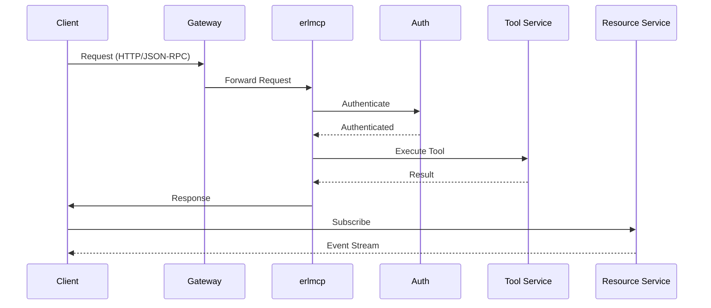
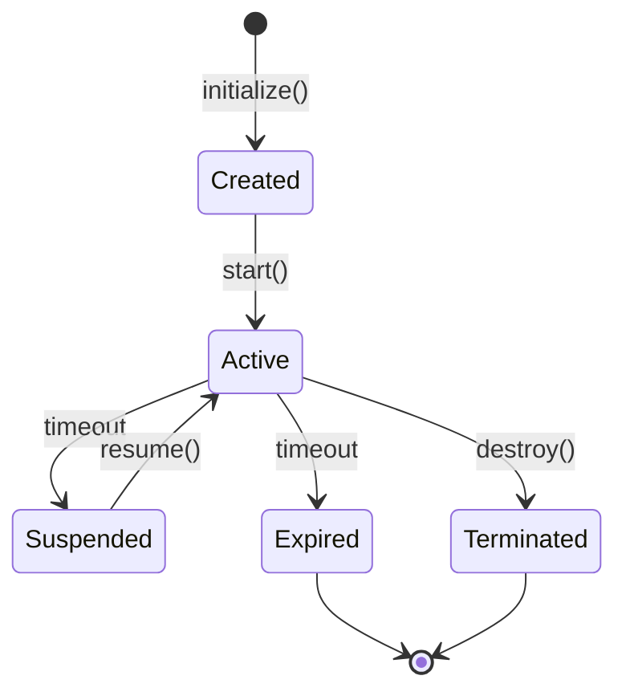

# erlmcp v3 Developer Training

## Table of Contents

1. [Introduction](#introduction)
2. [Getting Started](#getting-started)
3. [Core Concepts](#core-concepts)
4. [API Reference](#api-reference)
5. [Tool Development](#tool-development)
6. [Resource Management](#resource-management)
7. [Session Management](#session-management)
8. [Security Best Practices](#security-best-practices)
9. [Testing](#testing)
10. [Deployment](#deployment)

## Introduction

This training guide provides comprehensive instructions for developers working with erlmcp v3. It covers the API, tool development, resource management, and best practices for building applications on the erlmcp platform.

### Target Audience

- Application Developers
- API Developers
- Integration Developers
- Full Stack Developers

### Prerequisites

- Basic knowledge of Erlang/OTP
- Understanding of JSON-RPC
- Familiarity with REST APIs
- Experience with database design

## Getting Started

### Setup Development Environment

```bash
# Clone the repository
git clone https://github.com/erlmcp/erlmcp.git
cd erlmcp

# Install dependencies
./scripts/setup-dev-env.sh

# Start development server
./scripts/dev-server.sh
```

### First Application

```javascript
// Example: Basic erlmcp client
const { erlmcp } = require('@erlmcp/client');

// Initialize client
const client = erlmcp.createClient({
  url: 'http://localhost:8080',
  token: 'your-auth-token'
});

// Call a tool
async function main() {
  const result = await client.callTool('calculator', {
    expression: '2 + 2'
  });

  console.log('Result:', result.content.result);
}

main().catch(console.error);
```

### Quick Start Checklist

1. [ ] Install erlmcp development environment
2. [ ] Set up authentication
3. [ ] Explore the API
4. [ ] Create your first tool
5. [ ] Test your application
6. [ ] Deploy to staging

## Core Concepts

### Architecture Overview

```mermaid
graph TB
    subgraph "Client Layer"
        C1[Web Client]
        C2[Mobile Client]
        C3[Desktop Client]
    end

    subgraph "Gateway Layer"
        G1[Load Balancer]
        G2[API Gateway]
    end

    subgraph "Erlang Cluster"
        N1[erlmcp@node1]
        N2[erlmcp@node2]
        N3[erlmcp@node3]
    end

    subgraph "Services"
        S1[Tool Service]
        S2[Resource Service]
        S3[Session Service]
    end

    subgraph "Data Layer"
        D1[PostgreSQL]
        D2[Redis]
    end

    C1 --> G1
    C2 --> G1
    C3 --> G1
    G1 --> G2
    G2 --> N1
    G2 --> N2
    G2 --> N3
    N1 --> S1
    N2 --> S2
    N3 --> S3
    S1 --> D1
    S2 --> D2
    S3 --> D1
```

### Key Components

#### Sessions

Sessions maintain state between client requests. Each session has:
- Unique session ID
- Client metadata
- Authentication context
- Resource subscriptions
- Tool execution history

#### Resources

Resources represent data that clients can subscribe to. Resources have:
- URI-based addressing
- Event notifications
- Schema validation
- Access controls

#### Tools

Tools are executable functions that can be called by clients. Tools have:
- Input/output schemas
- Parameter validation
- Execution time limits
- Resource usage tracking

### Message Flow



## API Reference

### Authentication

#### Bearer Token

```javascript
// Set authorization header
const client = erlmcp.createClient({
  url: 'https://api.erlmcp.com',
  headers: {
    'Authorization': 'Bearer ' + token
  }
});
```

#### API Key

```javascript
const client = erlmcp.createClient({
  url: 'https://api.erlmcp.com',
  apiKey: 'your-api-key'
});
```

#### OAuth2

```javascript
// Implicit grant flow
const client = erlmcp.createClient({
  url: 'https://api.erlmcp.com',
  oauth2: {
    clientId: 'your-client-id',
    redirectUri: 'https://your-app.com/callback',
    scope: ['read', 'write']
  }
});
```

### Client Initialization

```javascript
const client = erlmcp.createClient({
  url: 'https://api.erlmcp.com/v3',
  version: '2024-11-05',
  transport: 'http',  // or 'websocket'
  autoReconnect: true,
  timeout: 30000,
  retryAttempts: 3
});
```

### Tools API

#### Call Tool

```javascript
// Basic tool call
const result = await client.callTool('calculator', {
  expression: '2 + 2 * 3'
});

console.log(result.content.result);  // 8

// With schema validation
const result = await client.callTool('weather', {
  location: 'New York'
}, {
  inputSchema: {
    type: 'object',
    properties: {
      location: { type: 'string' }
    },
    required: ['location']
  }
});
```

#### Define Tool Schema

```javascript
// Define tool schema
const calculatorSchema = {
  name: 'calculator',
  description: 'Perform mathematical calculations',
  parameters: {
    type: 'object',
    properties: {
      expression: {
        type: 'string',
        description: 'Mathematical expression'
      }
    },
    required: ['expression']
  },
  outputSchema: {
    type: 'number'
  }
};

// Register tool
await client.registerTool(calculatorSchema);
```

### Resources API

#### Subscribe to Resource

```javascript
// Subscribe to resource updates
const subscription = await client.subscribeResource(
  'resource://example.com/users/123',
  ['create', 'update', 'delete']
);

// Listen for events
client.on('resource.update', (event) => {
  console.log('Resource updated:', event.data);
});

// Unsubscribe
await client.unsubscribeResource(subscription.id);
```

#### Create Resource

```javascript
// Create new resource
const resource = await client.createResource(
  'resource://example.com/users',
  {
    name: 'John Doe',
    email: 'john@example.com'
  }
);

console.log('Created:', resource.uri);
```

### Sessions API

#### Create Session

```javascript
// Create session
const session = await client.createSession({
  metadata: {
    device: 'web',
    platform: 'chrome'
  }
});

console.log('Session ID:', session.sessionId);
```

#### Update Session

```javascript
// Update session metadata
await client.updateSession(session.sessionId, {
  metadata: {
    userAgent: 'Mozilla/5.0...',
    ipAddress: '192.168.1.1'
  }
});
```

## Tool Development

### Creating Tools

#### Erlang Tool Implementation

```erlang
% lib/my_tools/calculator.erl
-module(my_tools_calculator).
-export([execute/2]).

execute(#{expression := Expression}, Context) ->
  % Parse and evaluate expression
  try
    Result = erl_eval:expr(Expression, erl_eval:new_bindings()),
    {ok, #{
      result => Result,
      type => "number"
    }}
  catch
    error:Error ->
      {error, #{
        code => "EVALUATION_ERROR",
        message => io_lib:format("~p", [Error])
      }}
  end.
```

#### JavaScript Tool Implementation

```javascript
// tools/calculator.js
class CalculatorTool {
  async execute(args, context) {
    const { expression } = args;

    // Validate input
    if (!expression || typeof expression !== 'string') {
      throw new Error('Invalid expression');
    }

    // Evaluate expression safely
    const result = this.safeEvaluate(expression);

    return {
      result: result,
      type: 'number'
    };
  }

  safeEvaluate(expression) {
    // Implement safe evaluation
    // Use a secure evaluation library
    const evaluator = new SafeEvaluator();
    return evaluator.evaluate(expression);
  }
}

module.exports = CalculatorTool;
```

### Tool Configuration

#### Tool Registry

```erlang
% config/tools.yaml
tools:
  calculator:
    module: my_tools_calculator
    function: execute
    timeout: 5000
    limits:
      max_execution_time: 5000
      max_memory: 100MB
      rate_limit: 1000/min

  weather:
    module: weather_service
    function: get_weather
    timeout: 10000
    cache:
      ttl: 300
```

### Tool Development Best Practices

1. **Input Validation**
   ```javascript
   function validateInput(args) {
     if (!args.expression) {
       throw new Error('Expression is required');
     }
     if (!/^[0-9+\-*/\s()]+$/.test(args.expression)) {
       throw new Error('Invalid expression format');
     }
   }
   ```

2. **Error Handling**
   ```javascript
   async function execute(args) {
     try {
       const result = await doWork(args);
       return { success: true, data: result };
     } catch (error) {
       logger.error('Tool execution failed', error);
       return {
         success: false,
         error: {
           code: 'TOOL_ERROR',
           message: error.message
         }
       };
     }
   }
   ```

3. **Performance Considerations**
   ```javascript
   // Use caching for expensive operations
   const cache = new LRUCache({ max: 1000, ttl: 60000 });

   async function execute(args) {
     const cacheKey = JSON.stringify(args);
     if (cache.has(cacheKey)) {
       return cache.get(cacheKey);
     }

     const result = await expensiveOperation(args);
     cache.set(cacheKey, result);
     return result;
   }
   ```

## Resource Management

### Resource Types

#### Static Resources

```yaml
# Static resource definition
resources:
  users:
    uri: "resource://example.com/users"
    type: "collection"
    schema:
      type: "array"
      items:
        type: "object"
        properties:
          id: { type: "string" }
          name: { type: "string" }
          email: { type: "string" }
    access:
      read: "public"
      write: "authenticated"
```

#### Dynamic Resources

```javascript
// Dynamic resource implementation
class UserResource {
  async create(args) {
    // Validate input
    const validation = await this.validateUser(args);
    if (!validation.valid) {
      throw new Error(validation.errors.join(', '));
    }

    // Create user
    const user = await this.repository.create(args);

    // Return response
    return {
      uri: `resource://example.com/users/${user.id}`,
      data: user
    };
  }

  async update(id, args) {
    // Update user
    const user = await this.repository.update(id, args);
    return { data: user };
  }

  async delete(id) {
    // Delete user
    await this.repository.delete(id);
    return { success: true };
  }
}
```

### Resource Subscriptions

#### Event Handling

```javascript
// Subscribe to user updates
const subscription = await client.subscribeResource(
  'resource://example.com/users/*',
  ['create', 'update', 'delete']
);

// Event handlers
client.on('resource.create', (event) => {
  console.log('New user created:', event.data);
  // Trigger business logic
  this.handleNewUser(event.data);
});

client.on('resource.update', (event) => {
  console.log('User updated:', event.source, event.data);
  // Update cache
  this.updateUserCache(event.data);
});
```

### Resource Permissions

#### Access Control

```javascript
// Check permissions
async function checkPermission(resource, action, user) {
  const resourceConfig = await getResourceConfig(resource);

  if (resourceConfig.access[action] === 'public') {
    return true;
  }

  if (resourceConfig.access[action] === 'authenticated') {
    return !!user;
  }

  if (resourceConfig.access[action] === 'admin') {
    return user && user.roles.includes('admin');
  }

  return false;
}

// Protected resource access
async function getResource(resource, user) {
  const hasAccess = await checkPermission(resource, 'read', user);
  if (!hasAccess) {
    throw new Error('Access denied');
  }

  return await this.repository.get(resource);
}
```

## Session Management

### Session Lifecycle



### Session Implementation

#### Erlang Session Manager

```erlang
% lib/session_manager.erl
-module(session_manager).
-export([create_session/1, get_session/1, update_session/2, delete_session/1]).

-record(session, {
  id :: binary(),
  user_id :: binary(),
  created :: erlang:timestamp(),
  last_active :: erlang:timestamp(),
  metadata :: map(),
  state :: active | suspended | expired
}).

create_session(UserId, Metadata) ->
  SessionId = generate_id(),
  Session = #session{
    id = SessionId,
    user_id = UserId,
    created = erlang:timestamp(),
    last_active = erlang:timestamp(),
    metadata = Metadata,
    state = active
  },
  ets:insert(sessions, Session),
  Session.

get_session(SessionId) ->
  case ets:lookup(sessions, SessionId) of
    [{SessionId, Session}] -> Session;
    _ -> not_found
  end.
```

#### JavaScript Session Client

```javascript
class SessionManager {
  constructor(client) {
    this.client = client;
    this.currentSession = null;
  }

  async createSession(metadata = {}) {
    const response = await this.client.post('/sessions', {
      metadata
    });

    this.currentSession = {
      id: response.sessionId,
      metadata: response.metadata
    };

    return this.currentSession;
  }

  async updateSession(metadata) {
    if (!this.currentSession) {
      throw new Error('No active session');
    }

    await this.client.put(`/sessions/${this.currentSession.id}`, {
      metadata: { ...this.currentSession.metadata, ...metadata }
    });

    this.currentSession.metadata = { ...this.currentSession.metadata, ...metadata };
  }

  async destroySession() {
    if (this.currentSession) {
      await this.client.delete(`/sessions/${this.currentSession.id}`);
      this.currentSession = null;
    }
  }
}
```

### Session Storage Options

#### In-Memory Storage

```javascript
// Simple in-memory session store
class MemorySessionStore {
  constructor() {
    this.sessions = new Map();
  }

  async create(session) {
    const id = generateId();
    const newSession = { ...session, id, createdAt: Date.now() };
    this.sessions.set(id, newSession);
    return newSession;
  }

  async get(id) {
    return this.sessions.get(id);
  }

  async update(id, updates) {
    const session = this.sessions.get(id);
    if (!session) return null;

    const updatedSession = { ...session, ...updates, updatedAt: Date.now() };
    this.sessions.set(id, updatedSession);
    return updatedSession;
  }

  async delete(id) {
    return this.sessions.delete(id);
  }
}
```

#### Database Storage

```javascript
// PostgreSQL session storage
class DatabaseSessionStore {
  constructor(db) {
    this.db = db;
  }

  async create(session) {
    const result = await this.db.query(
      `INSERT INTO sessions (id, user_id, metadata, created_at, expires_at)
       VALUES ($1, $2, $3, $4, $5)
       RETURNING *`,
      [session.id, session.userId, session.metadata, new Date(), session.expiresAt]
    );

    return result.rows[0];
  }

  async get(id) {
    const result = await this.db.query(
      'SELECT * FROM sessions WHERE id = $1 AND expires_at > NOW()',
      [id]
    );

    return result.rows[0] || null;
  }
}
```

## Security Best Practices

### Input Validation

```javascript
// Comprehensive input validation
function validateInput(schema, input) {
  const result = ajv.validate(schema, input);
  if (!result) {
    throw new Error('Invalid input: ' + ajv.errorsText());
  }

  return true;
}

// Usage
const userSchema = {
  type: 'object',
  required: ['name', 'email'],
  properties: {
    name: {
      type: 'string',
      minLength: 2,
      maxLength: 100
    },
    email: {
      type: 'string',
      format: 'email'
    },
    age: {
      type: 'integer',
      minimum: 0,
      maximum: 150
    }
  }
};

validateInput(userSchema, request.body);
```

### Output Sanitization

```javascript
// Sanitize output data
function sanitizeOutput(data) {
  if (Array.isArray(data)) {
    return data.map(item => sanitizeOutput(item));
  }

  if (typeof data === 'object' && data !== null) {
    const sanitized = {};

    for (const [key, value] of Object.entries(data)) {
      // Skip sensitive fields
      if (['password', 'ssn', 'credit_card'].includes(key)) {
        sanitized[key] = '***';
      } else {
        sanitized[key] = sanitizeOutput(value);
      }
    }

    return sanitized;
  }

  return data;
}
```

### Authentication and Authorization

```javascript
// JWT validation middleware
async function validateToken(req, res, next) {
  const token = req.headers.authorization?.replace('Bearer ', '');

  if (!token) {
    return res.status(401).json({ error: 'No token provided' });
  }

  try {
    const decoded = jwt.verify(token, process.env.JWT_SECRET);
    req.user = decoded;
    next();
  } catch (error) {
    return res.status(401).json({ error: 'Invalid token' });
  }
}

// Role-based access control
function checkRole(roles) {
  return (req, res, next) => {
    if (!req.user) {
      return res.status(401).json({ error: 'Not authenticated' });
    }

    if (!roles.includes(req.user.role)) {
      return res.status(403).json({ error: 'Insufficient permissions' });
    }

    next();
  };
}

// Usage
router.get('/admin', validateToken, checkRole(['admin']), (req, res) => {
  res.json({ message: 'Welcome admin' });
});
```

### Security Headers

```javascript
// Set security headers
function securityHeaders(req, res, next) {
  res.set({
    'X-Content-Type-Options': 'nosniff',
    'X-Frame-Options': 'DENY',
    'X-XSS-Protection': '1; mode=block',
    'Content-Security-Policy': "default-src 'self'",
    'Strict-Transport-Security': 'max-age=31536000; includeSubDomains'
  });

  next();
}
```

## Testing

### Unit Testing

#### Erlang Tests

```erlang
% tests/calculator_tests.erl
-module(calculator_tests).
-include_lib("eunit/include/eunit.hrl").

add_test_() ->
  [
    ?_assertEqual(4, calculator:add(2, 2)),
    ?_assertEqual(0, calculator:add(-1, 1)),
    ?_assertError(badarith, calculator:add(a, b))
  ].

multiply_test_() ->
  [
    ?_assertEqual(6, calculator:multiply(2, 3)),
    ?_assertEqual(0, calculator:multiply(5, 0)),
    ?_assertError(badarith, calculator:multiply(2, a))
  ].
```

#### JavaScript Tests

```javascript
// tests/calculator.test.js
const Calculator = require('../src/calculator');

describe('Calculator', () => {
  let calculator;

  beforeEach(() => {
    calculator = new Calculator();
  });

  describe('add', () => {
    it('should correctly add numbers', () => {
      expect(calculator.add(2, 3)).toBe(5);
      expect(calculator.add(-1, 5)).toBe(4);
    });

    it('should handle invalid inputs', () => {
      expect(() => calculator.add('a', 2)).toThrow();
    });
  });

  describe('multiply', () => {
    it('should correctly multiply numbers', () => {
      expect(calculator.multiply(3, 4)).toBe(12);
      expect(calculator.multiply(0, 100)).toBe(0);
    });
  });
});
```

### Integration Testing

```javascript
// tests/integration.test.js
const { erlmcp } = require('@erlmcp/client');

describe('Integration Tests', () => {
  let client;

  beforeAll(async () => {
    client = erlmcp.createClient({
      url: process.env.TEST_URL || 'http://localhost:8080',
      apiKey: process.env.TEST_API_KEY
    });
  });

  test('should call calculator tool', async () => {
    const result = await client.callTool('calculator', {
      expression: '2 + 2'
    });

    expect(result.success).toBe(true);
    expect(result.content.result).toBe(4);
  });

  test('should create and update session', async () => {
    const session = await client.createSession({
      metadata: { test: true }
    });

    expect(session.sessionId).toBeDefined();

    await client.updateSession(session.sessionId, {
      metadata: { test: true, updated: true }
    });

    const updated = await client.getSession(session.sessionId);
    expect(updated.metadata.updated).toBe(true);
  });
});
```

### Performance Testing

```javascript
// tests/performance.test.js
const { exec } = require('child_process');
const { promisify } = require('util');

const execAsync = promisify(exec);

describe('Performance Tests', () => {
  test('should handle 100 concurrent requests', async () => {
    const promises = [];
    const startTime = Date.now();

    // Create 100 concurrent requests
    for (let i = 0; i < 100; i++) {
      promises.push(
        fetch('http://localhost:8080/v3/health')
          .then(res => res.json())
      );
    }

    const results = await Promise.all(promises);
    const duration = Date.now() - startTime;

    expect(results.every(r => r.status === 'healthy')).toBe(true);
    expect(duration).toBeLessThan(5000); // Should complete in 5 seconds
  });

  test('should handle load testing', async () => {
    // Use Apache Bench or similar tool
    const { stdout } = await execAsync(
      'ab -n 1000 -c 100 http://localhost:8080/v3/health'
    );

    const requests = parseInt(stdout.match(/Requests per second:\s+(\d+)/)[1]);
    expect(requests).toBeGreaterThan(100);
  });
});
```

### Test Configuration

```json
// package.json test scripts
{
  "scripts": {
    "test": "jest",
    "test:watch": "jest --watch",
    "test:coverage": "jest --coverage",
    "test:integration": "jest --testPathPattern=integration",
    "test:e2e": "jest --testPathPattern=e2e",
    "test:performance": "jest --testPathPattern=performance"
  },
  "jest": {
    "testEnvironment": "node",
    "coverageDirectory": "coverage",
    "coveragePathIgnorePatterns": [
      "/node_modules/",
      "/tests/"
    ],
    "testMatch": [
      "**/tests/**/*.test.js"
    ]
  }
}
```

## Deployment

### Docker Deployment

#### Dockerfile

```dockerfile
# Dockerfile
FROM erlang:28.3.1-alpine

# Install dependencies
RUN apk add --no-cache \
    build-base \
    git \
    curl \
    openssl \
    nodejs \
    npm

# Install rebar3
RUN curl -sSL https://github.com/erlang/rebar3/releases/download/3.22.1/rebar3 > /usr/local/bin/rebar3 \
    && chmod +x /usr/local/bin/rebar3

# Install Node.js dependencies
COPY package*.json /app/
RUN npm ci

# Copy application code
COPY . /app
WORKDIR /app

# Build the application
RUN rebar3 compile

# Create app user
RUN adduser -D erlmcp
USER erlmcp

# Expose ports
EXPOSE 8080 8443

# Start the application
CMD ["./scripts/start.sh"]
```

#### Docker Compose

```yaml
# docker-compose.yml
version: '3.8'

services:
  erlmcp:
    build: .
    ports:
      - "8080:8080"
      - "8443:8443"
    environment:
      - ERLMCP_ENV=production
      - DATABASE_URL=postgres://user:pass@db:5432/erlmcp
      - REDIS_URL=redis://redis:6379
    depends_on:
      - db
      - redis
    volumes:
      - ./config:/app/config
      - ./logs:/app/logs

  db:
    image: postgres:15
    environment:
      - POSTGRES_DB=erlmcp
      - POSTGRES_USER=user
      - POSTGRES_PASSWORD=pass
    volumes:
      - postgres_data:/var/lib/postgresql/data
    ports:
      - "5432:5432"

  redis:
    image: redis:7-alpine
    volumes:
      - redis_data:/data
    ports:
      - "6379:6379"

volumes:
  postgres_data:
  redis_data:
```

### Kubernetes Deployment

#### Helm Chart

```yaml
# values.yaml
replicaCount: 3

image:
  repository: erlmcp/v3
  tag: 3.0.0
  pullPolicy: IfNotPresent

service:
  type: LoadBalancer
  port: 8080
  annotations:
    cloud.google.com/load-balancer-type: "Internal"

ingress:
  enabled: true
  annotations:
    kubernetes.io/ingress.class: "nginx"
    cert-manager.io/cluster-issuer: "letsencrypt-prod"
  hosts:
    - host: api.erlmcp.com
      paths:
        - path: /
          pathType: Prefix

database:
  enabled: true
  type: postgresql
  persistence:
    enabled: true
    size: 50Gi

redis:
  enabled: true
  persistence:
    enabled: true
    size: 20Gi

resources:
  requests:
    memory: "4Gi"
    cpu: "2"
  limits:
    memory: "8Gi"
    cpu: "4"
```

#### Kubernetes Manifests

```yaml
# deployment.yaml
apiVersion: apps/v1
kind: Deployment
metadata:
  name: erlmcp
  labels:
    app: erlmcp
spec:
  replicas: 3
  selector:
    matchLabels:
      app: erlmcp
  template:
    metadata:
      labels:
        app: erlmcp
    spec:
      containers:
      - name: erlmcp
        image: erlmcp/v3:3.0.0
        ports:
        - containerPort: 8080
        env:
        - name: DATABASE_URL
          valueFrom:
            secretKeyRef:
              name: erlmcp-secrets
              key: database-url
        resources:
          requests:
            memory: "4Gi"
            cpu: "2"
          limits:
            memory: "8Gi"
            cpu: "4"
        livenessProbe:
          httpGet:
            path: /v3/health
            port: 8080
          initialDelaySeconds: 30
          periodSeconds: 10
        readinessProbe:
          httpGet:
            path: /v3/health
            port: 8080
          initialDelaySeconds: 5
          periodSeconds: 5
```

### CI/CD Pipeline

#### GitHub Actions

```yaml
# .github/workflows/deploy.yml
name: Deploy to Production

on:
  push:
    branches: [main]

jobs:
  deploy:
    runs-on: ubuntu-latest

    steps:
    - uses: actions/checkout@v3

    - name: Setup Node.js
      uses: actions/setup-node@v3
      with:
        node-version: '18'

    - name: Install dependencies
      run: npm ci

    - name: Run tests
      run: npm test

    - name: Build Docker image
      run: docker build -t erlmcp/v3:latest .

    - name: Deploy to staging
      run: |
        docker tag erlmcp/v3:latest erlmcp/v3:staging
        docker push erlmcp/v3:staging
        kubectl set image deployment/erlmcp erlmcp=erlmcp/v3:staging

    - name: Run smoke tests
      run: npm run test:smoke

    - name: Deploy to production
      if: success()
      run: |
        docker tag erlmcp/v3:latest erlmcp/v3:$(date +%Y%m%d-%H%M%S)
        docker push erlmcp/v3:$(date +%Y%m%d-%H%M%S)
        kubectl set image deployment/erlmcp erlmcp=erlmcp/v3:$(date +%Y%m%d-%H%M%S)
        kubectl rollout status deployment/erlmcp
```

### Monitoring and Logging

#### Application Monitoring

```javascript
// lib/monitoring.js
class Monitoring {
  constructor() {
    this.metrics = {
      requests: new Counter(),
      errors: new Counter(),
      duration: new Histogram()
    };
  }

  instrument(req, res, next) {
    const startTime = Date.now();

    res.on('finish', () => {
      const duration = Date.now() - startTime;

      this.metrics.requests.inc();
      this.metrics.duration.observe(duration);

      if (res.statusCode >= 400) {
        this.metrics.errors.inc();
      }
    });

    next();
  }

  getMetrics() {
    return {
      requests: this.metrics.requests.get(),
      errors: this.metrics.errors.get(),
      averageDuration: this.metrics.duration.getMean()
    };
  }
}

module.exports = new Monitoring();
```

#### Logging Configuration

```javascript
// lib/logger.js
const winston = require('winston');

const logger = winston.createLogger({
  level: process.env.LOG_LEVEL || 'info',
  format: winston.format.json(),
  defaultMeta: { service: 'erlmcp-api' },
  transports: [
    new winston.transports.File({ filename: 'error.log', level: 'error' }),
    new winston.transports.File({ filename: 'combined.log' })
  ]
});

if (process.env.NODE_ENV !== 'production') {
  logger.add(new winston.transports.Console({
    format: winston.format.simple()
  }));
}

module.exports = logger;
```

---
*Training Materials Version: 3.0.0*
*Last Updated: February 2024*