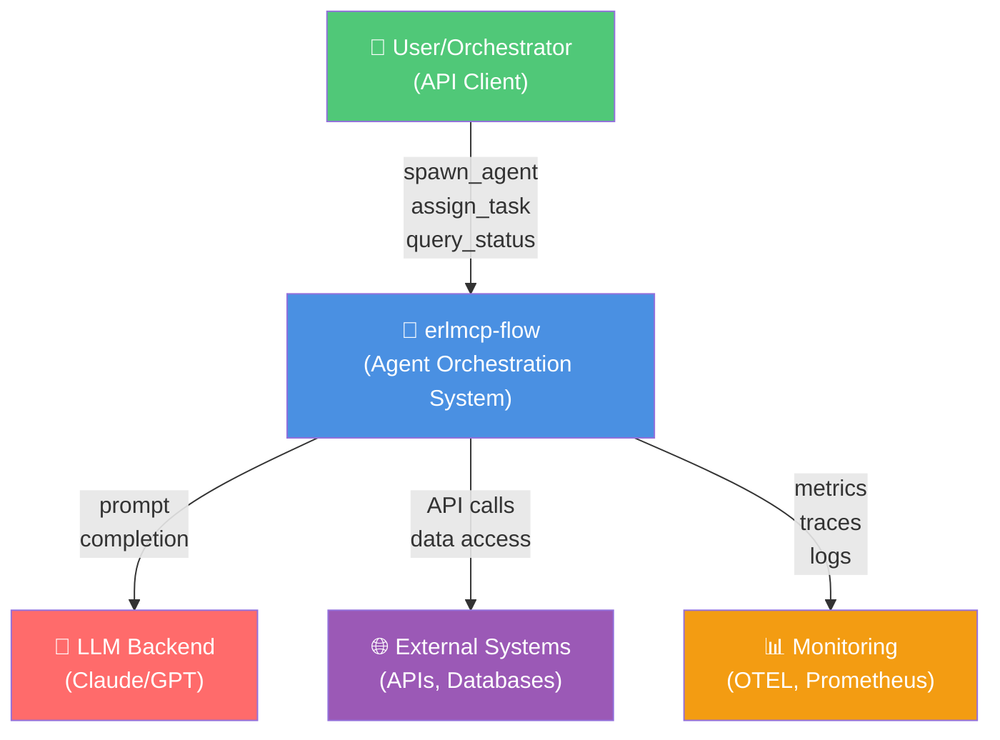
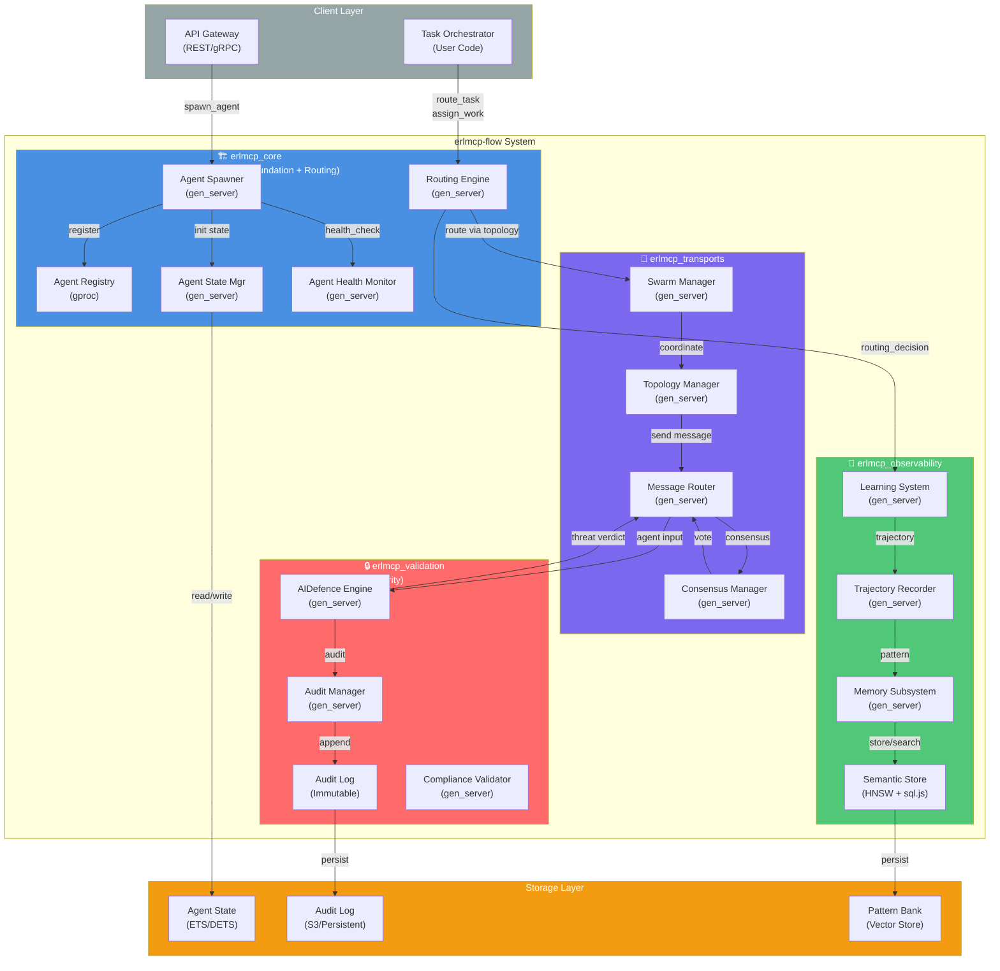
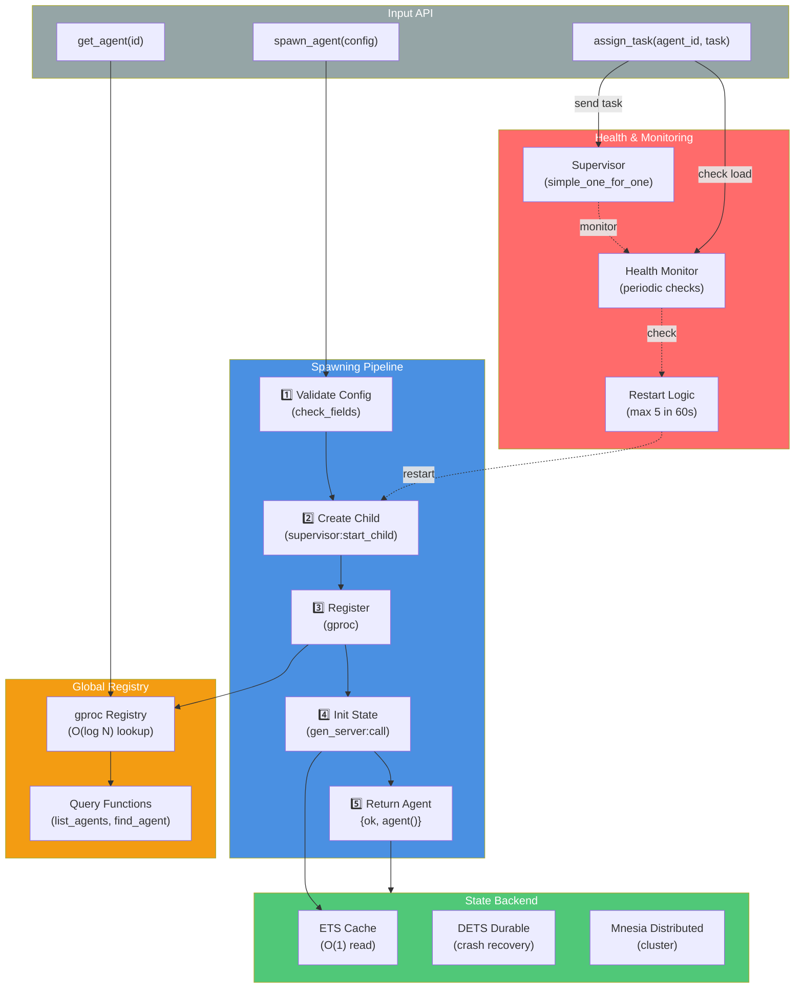
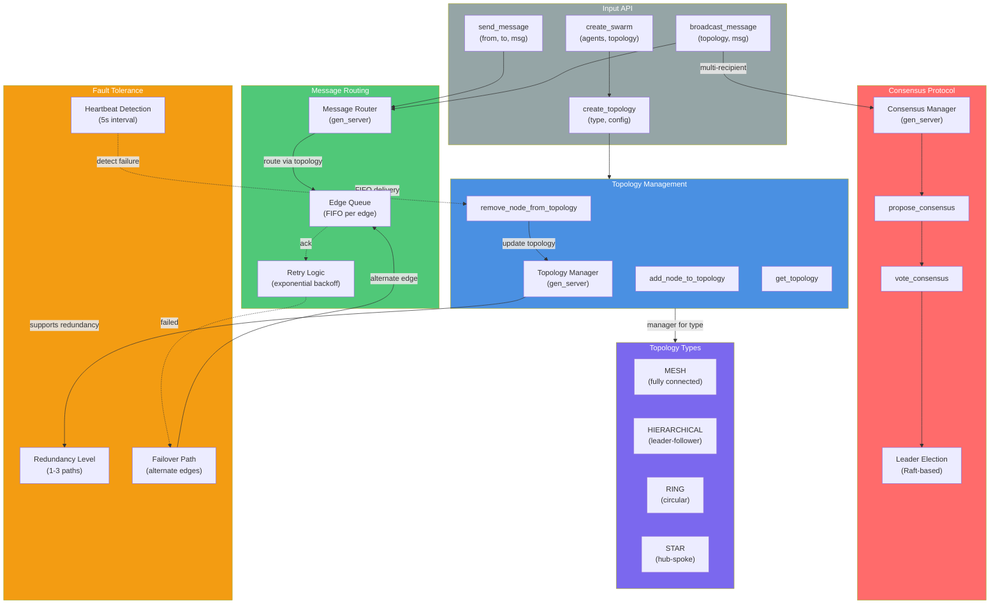
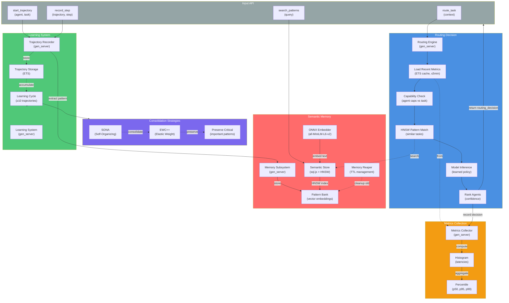
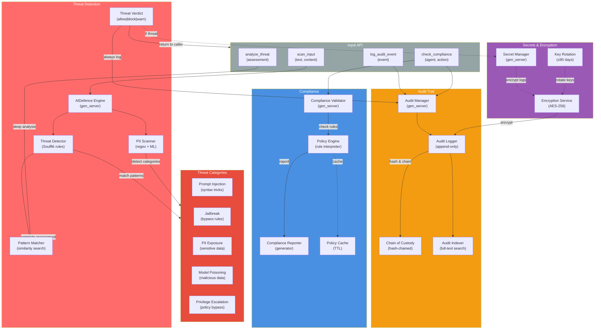
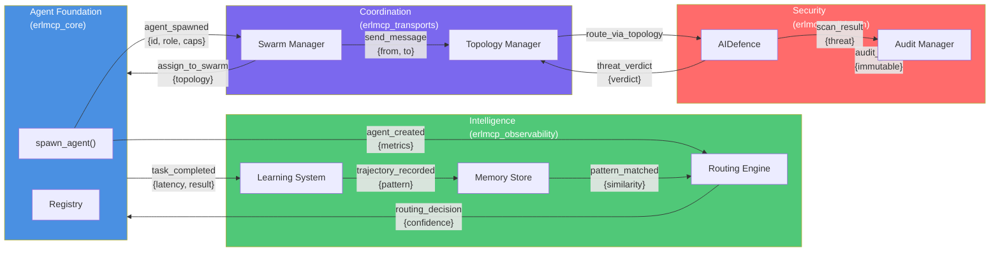
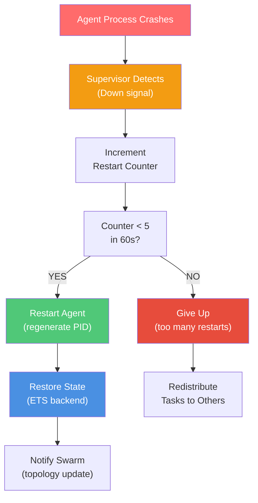
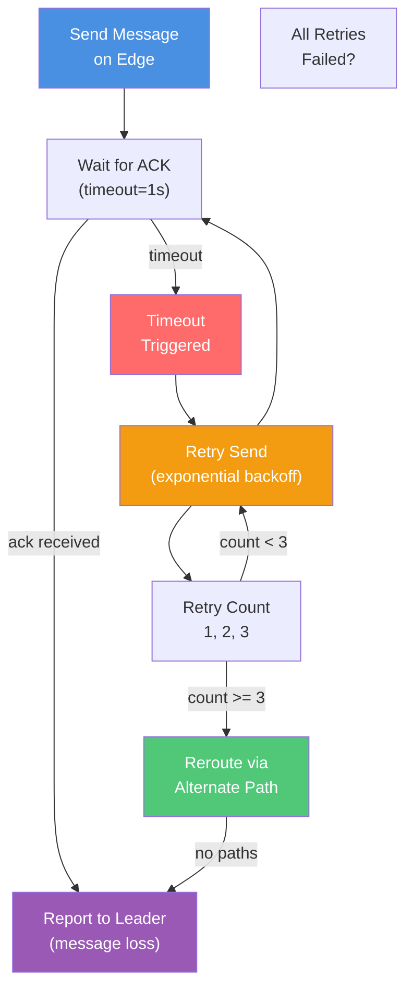
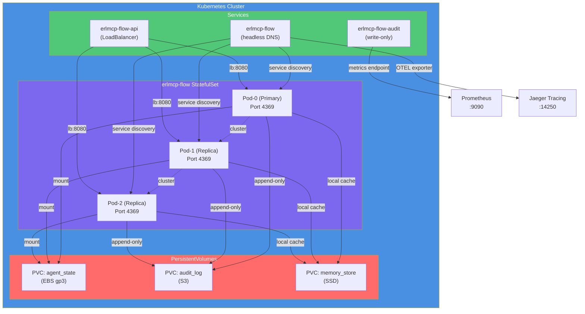

# erlmcp-flow C4 Architecture Diagrams

---

## C1: System Context



---

## C2: Container Architecture



---

## C3: Agent Foundation (Core App)



---

## C4: Coordination (Transports App)



---

## C4: Intelligence (Observability App)



---

## C4: Security (Validation App)



---

## Subsystem Integration Diagram



---

## Failure Recovery Workflows

### F-1: Agent Crash Recovery



### F-5: Message Loss Recovery



---

## Technology Stack

```
┌─────────────────────────────────────────────────────┐
│ Application Layer                                   │
│  erlmcp-flow (4 OTP Apps × 4 Subsystems)           │
└────────────────────────┬────────────────────────────┘
                         │
┌────────────────────────┴────────────────────────────┐
│ OTP Framework (Erlang 28.3.1)                       │
│ ├─ gen_server, gen_statem, supervisor              │
│ ├─ gproc (process registry)                        │
│ └─ OTEL (observability)                            │
└────────────────────────┬────────────────────────────┘
                         │
┌────────────────────────┴────────────────────────────┐
│ Persistent Storage                                  │
│ ├─ ETS (agent state cache, O(1))                   │
│ ├─ DETS (durable sessions)                         │
│ ├─ Mnesia (distributed state, optional)            │
│ ├─ S3 (audit logs, long-term)                      │
│ └─ sql.js (semantic store, HNSW)                   │
└────────────────────────┬────────────────────────────┘
                         │
┌────────────────────────┴────────────────────────────┐
│ External Dependencies                               │
│ ├─ ONNX Runtime (all-MiniLM-L6-v2 embeddings)      │
│ ├─ Soufflé (threat detection rules)                │
│ ├─ OpenTelemetry (metrics/traces)                  │
│ ├─ Prometheus (scraping metrics)                   │
│ └─ TLS/mTLS (transport encryption)                 │
└─────────────────────────────────────────────────────┘
```

---

## Deployment Architecture



---

**Document Version**: v1.0.0
**Last Updated**: 2026-02-01
**Next Review**: 2026-05-01

