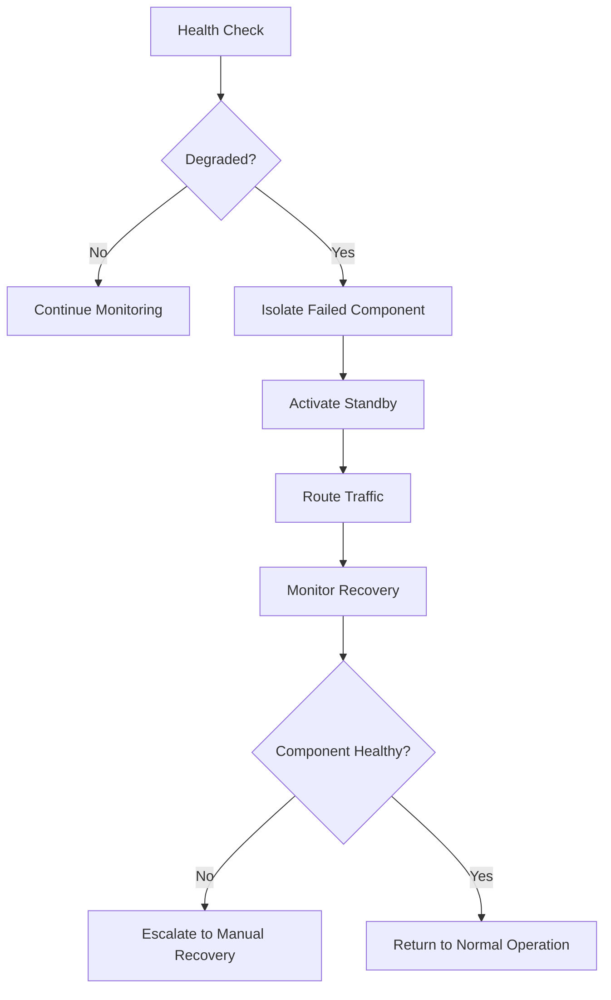
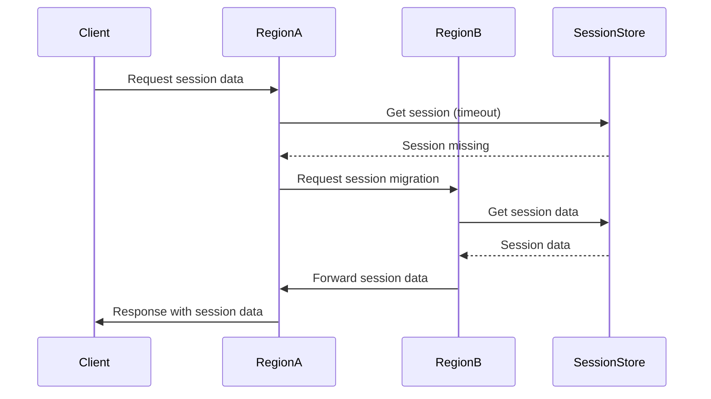

# erlmcp v3 High Availability Architecture

**Version**: 3.0.0
**Status**: Design Specification
**Target Uptime**: 99.999% (5.26 minutes downtime per year)
**Target**: Fortune 500 Enterprise Deployment

## Table of Contents

1. [Executive Summary](#executive-summary)
2. [Architecture Overview](#architecture-overview)
3. [Multi-Region Deployment](#multi-region-deployment)
4. [Failover Strategies](#failover-strategies)
5. [Load Balancing](#load-balancing)
6. [Session Management](#session-management)
7. [Data Persistence](#data-persistence)
8. [Network Resilience](#network-resilience)
9. [Health Monitoring](#health-monitoring)
10. [Disaster Recovery](#disaster-recovery)
11. [SLA Framework](#sla-framework)
12. [Capacity Planning](#capacity-planning)
13. [Deployment Strategies](#deployment-strategies)
14. [Performance Optimization](#performance-optimization)
15. [Monitoring and Alerting](#monitoring-and-alerting)
16. [Implementation Roadmap](#implementation-roadmap)

## 1. Executive Summary

This document outlines the High Availability (HA) architecture for erlmcp v3, designed to achieve 99.999% uptime for Fortune 500 enterprise deployments. The architecture leverages multi-region deployment, active-active load balancing, automated failover, and comprehensive monitoring to ensure business continuity.

### Key Metrics

- **Target Uptime**: 99.999% (5.26 minutes/year)
- **RTO (Recovery Time Objective)**: < 30 seconds
- **RPO (Recovery Point Objective)**: < 1 second
- **Max Concurrent Sessions**: 10M+
- **Throughput**: 1M+ RPS
- **Regions**: 3+ active-active deployment

### Core Principles

1. **No Single Point of Failure**: Every component has redundancy
2. **Automated Failover**: Manual intervention not required for failover
3. **Active-Active**: All regions handle traffic simultaneously
4. **Zero-Downtime Upgrades**: Rolling deployments without service interruption
5. **Self-Healing**: Automated detection and recovery of failures

## 2. Architecture Overview

### Global Topology

```
┌─────────────────┐    ┌─────────────────┐    ┌─────────────────┐
│   US-East-1     │    │   EU-Central-1  │    │   AP-Southeast-1 │
│   (Primary)     │    │   (Secondary)   │    │   (Tertiary)    │
└─────────────────┘    └─────────────────┘    └─────────────────┘
       │                       │                       │
       └───────────────────────┼───────────────────────┘
                               │
                    ┌─────────────────┐
                    │    Global DNS   │
                    │    Load Balancer │
                    └─────────────────┘
```

### Component Architecture

```
Global Traffic Manager
│
├─ Regional Load Balancers (GSLB)
│   │
│   ├─ Cluster A (Active-Active)
│   │   ├─ Node Pool 1
│   │   │   ├─ erlmcp_server instances
│   │   │   ├─ erlmcp_session_backend
│   │   │   └─ erlmcp_registry
│   │   │
│   │   └─ Node Pool 2
│   │       ├─ erlmcp_server instances
│   │       ├─ erlmcp_session_backend
│   │       └─ erlmcp_registry
│   │
│   └─ Cluster B (Standby/Failover)
│       ├─ Node Pool 3
│       └─ Node Pool 4
│
├─ Session Replication Cluster
│   ├─ Redis Cluster (Multi-region)
│   └─ Session State Synchronization
│
├─ Database Tier
│   ├─ PostgreSQL (Active-Active)
│   ├─ CockroachDB (Global)
│   └─ Object Storage (S3-compatible)
│
└─ Monitoring & Control
    ├─ Prometheus + Grafana
    ├─ ELK Stack
    └─ HA Control Plane
```

## 3. Multi-Region Deployment

### Regional Strategy

#### Primary Region (US-East-1)
- **Capacity**: 40% of total load
- **Role**: Primary production region
- **Features**: Full feature set, active traffic
- **Latency Target**: < 50ms for North America

#### Secondary Region (EU-Central-1)
- **Capacity**: 35% of total load
- **Role**: Active-active with primary
- **Features**: Full feature set
- **Latency Target**: < 70ms for Europe

#### Tertiary Region (AP-Southeast-1)
- **Capacity**: 25% of total load
- **Role**: Active-active, disaster recovery
- **Features**: Core features only
- **Latency Target**: < 100ms for Asia-Pacific

### Deployment Zones

Each region deployed across 3 availability zones:

```
Region: US-East-1
├─ Zone A (us-east-1a)
│   ├─ Control Plane
│   ├─ Data Plane
│   └─ Storage
├─ Zone B (us-east-1b)
│   ├─ Control Plane
│   ├─ Data Plane
│   └─ Storage
└─ Zone C (us-east-1c)
    ├─ Control Plane
    ├─ Data Plane
    └─ Storage
```

### Network Architecture

#### Global Network
- **Global Anycast**: DNS-based routing
- **Private Peering**: AWS Direct Connect/Cloud Interconnect
- **CDN Integration**: CloudFront/Cloudflare
- **DDoS Protection**: AWS Shield/Aliyun DDoS Protection

#### Regional Network
- **VPC Isolation**: Each region in separate VPC
- **Subnet Design**: Public, Private, Database subnets
- **Security Groups**: Stateful firewall rules
- **Network ACLs**: Layer 3 filtering

## 4. Failover Strategies

### Failover Levels

#### 1. Node Level Failover
- **Detection**: Health checks every 500ms
- **Action**: Automatically remove from load balancer pool
- **Recovery**: Auto-heal after 2 consecutive successful checks
- **MTTR**: < 5 seconds

#### 2. Availability Zone Failover
- **Detection**: Zone health degradation > 30%
- **Action**: Route traffic to other zones in region
- **Recovery**: After zone restoration, gradual traffic ramp-up
- **MTTR**: < 30 seconds

#### 3. Regional Failover
- **Detection**: Region health degradation > 50%
- **Action**: DNS failover to secondary region
- **Recovery**: After regional recovery, DNS TTL updates
- **MTTR**: < 5 minutes

#### 4. Global Failover
- **Detection**: Multi-region degradation
- **Action**: Activate disaster recovery plan
- **Recovery**: Manual intervention required
- **MTTR**: < 1 hour

### Failover Mechanisms

#### Health Check Matrix

| Component | Check Interval | Success Threshold | Failure Threshold | Actions |
|----------|----------------|-------------------|-------------------|---------|
| erlmcp_server | 2s | 3/5 | 2/5 | Remove from LB, trigger alert |
| erlmcp_session | 5s | 2/3 | 1/3 | Initiate session migration |
| erlmcp_registry | 1s | 5/5 | 3/5 | Activate standby replica |
| Database | 10s | 3/5 | 2/5 | Promote standby, alert team |
| Load Balancer | 1s | N/A | N/A | Route to healthy nodes |

#### Automated Failover Process



## 5. Load Balancing

### Global Load Balancing

#### DNS-Based Routing
- **Provider**: Route 53/Cloudflare
- **Strategy**: Latency-based routing
- **Health Checks**: Continuous monitoring
- **Failover**: Automatic DNS updates
- **TTL**: 30 seconds for critical services

#### Anycast Implementation
```
Global 10.0.0.0/8
├─ US-East-1: 10.1.0.0/16
├─ EU-Central-1: 10.2.0.0/16
└─ AP-Southeast-1: 10.3.0.0/16
```

### Regional Load Balancing

#### AWS ALB/NLB Configuration
```yaml
alb:
  target_groups:
    - name: erlmcp-servers-primary
      port: 8080
      health_check:
        path: /health
        interval: 5s
        timeout: 2s
        healthy_threshold: 3
        unhealthy_threshold: 2
    - name: erlmcp-servers-secondary
      port: 8080
      health_check:
        path: /health
        interval: 5s
        timeout: 2s
        healthy_threshold: 3
        unhealthy_threshold: 2
```

#### Load Balancing Algorithms

| Algorithm | Use Case | Benefits | Considerations |
|-----------|----------|----------|----------------|
| Least Connections | Session persistence | Distributes load based on current load | Requires session affinity |
| Weighted Round Robin | Resource balancing | Can prioritize powerful nodes | Static weights may not reflect real load |
| IP Hash | Session affinity | Consistent routing for same client | May cause uneven distribution |
| Least Response Time | Real-time optimization | Fastest response for clients | Requires monitoring overhead |

### Connection Pooling

#### Database Connection Pool
- **Maximum Connections**: 1000 per node
- **Minimum Connections**: 100 per node
- **Connection Timeout**: 30 seconds
- **Idle Timeout**: 5 minutes
- **Validation Query**: `SELECT 1`

#### Application Connection Pool
```erlang
{connection_pool_size, 100},
{connection_pool_max_overflow, 200},
{connection_pool_timeout, 5000},
{connection_pool_idle_timeout, 30000},
{connection_pool_validation_interval, 60000}
```

## 6. Session Management

### Session Architecture

#### Multi-Session Backend
```erlang
%% Multi-region session configuration
{session_backend, [
    {ets_backend, #{
        node => node(),
        table => erlmcp_sessions,
        ttl => 3600,
        sync_nodes => ['node@us-east-1', 'node@eu-central-1']
    }},
    {redis_backend, #{
        cluster => redis_cluster,
        ttl => 3600,
        sync => true,
        compress => true
    }},
    {mnesia_backend, #{
        nodes => [node@us-east-1, node@eu-central-1],
        ram_nodes => [node@us-east-1],
        disc_nodes => [node@eu-central-1],
        ram_copies => [node@us-east-1],
        disc_copies => [node@eu-central-1]
    }}
]}.
```

### Session Replication

#### Synchronization Strategy
- **Active-Active**: All regions handle read/write
- **Conflict Resolution**: Last write wins with timestamps
- **Synchronization**: Real-time replication
- **Consistency**: Eventually consistent with strong guarantees for critical data

#### Session Migration


### Session Persistence

#### Redis Cluster Configuration
```yaml
redis:
  cluster:
    nodes:
      - host: redis-1.us-east-1.example.com
        port: 6379
      - host: redis-2.eu-central-1.example.com
        port: 6379
      - host: redis-3.ap-southeast-1.example.com
        port: 6379
    password: ${REDIS_PASSWORD}
    ssl: true
    cluster_enabled: true
    replication: true
    persistence:
      type: rdb
      schedule: "00 00 * * *"  # Daily snapshot
    memory:
      max_memory: 8gb
      max_memory_policy: allkeys-lru
```

## 7. Data Persistence

### Database Architecture

#### Primary Database: PostgreSQL (Active-Active)
```yaml
postgresql:
  replication:
    mode: streaming
    synchronous_commit: on
    standby_cluster: true
  clustering:
    patroni:
      dcs:
        etcd:
          hosts:
            - etcd-1.us-east-1.example.com
            - etcd-2.eu-central-1.example.com
            - etcd-3.ap-southeast-1.example.com
```

#### Global Database: CockroachDB
```yaml
cockroach:
  cluster:
    nodes:
      - node-us-east-1:26257
      - node-eu-central-1:26257
      - node-ap-southeast-1:26257
    replication:
      factor: 3
      placement: [
        "+region=us-east-1",
        "+region=eu-central-1",
        "+region=ap-southeast-1"
      ]
    security:
      ssl: true
      cert: /path/to/ca.crt
      key: /path/to/client.key
```

### Sharding Strategy

#### Horizontal Sharding
```erlang
%% erlmcp_config:sharding()
{sharding, #{
    strategy => consistent_hashing,
    buckets => 256,
    replication => 3,
    nodes => [
        {node@us-east-1, priority => 40},
        {node@eu-central-1, priority => 35},
        {node@ap-southeast-1, priority => 25}
    ]
}}.
```

### Backup and Recovery

#### Backup Schedule
- **Full Database**: Daily at 02:00 UTC
- **Incremental**: Every 15 minutes
- **Log Shipping**: Continuous
- **Offsite Replication**: Real-time

#### Recovery Procedures
1. **Point-in-Time Recovery**: Available for any time in last 7 days
2. **Cross-Region Restore**: < 1 hour
3. **Disaster Recovery**: < 4 hours

## 8. Network Resilience

### Redundancy Levels

#### Multi-Path Network
- **Primary**: Direct Connect/Cloud Interconnect
- **Secondary**: Public internet with multiple ISPs
- **Tertiary**: Satellite backup

#### Network Monitoring
```yaml
network_monitoring:
  probes:
    - name: "us-east-1-to-eu"
      type: icmp
      target: "eu-central-1.example.com"
      interval: 10s
      threshold: 5% packet_loss
    - name: "latency-monitor"
      type: http
      target: "https://erlmcp.example.com/health"
      interval: 5s
      timeout: 2s
```

### Security and Isolation

#### Network Segmentation
```
Global Network
├─ Public Subnet (Web Traffic)
├─ Private Subnet (Internal Traffic)
├─ Database Subnet (Data Persistence)
└─ Management Subnet (Admin Access)
```

#### Security Controls
- **Firewall**: Network ACLs + Security Groups
- **VPN**: Site-to-Site VPN for secure connectivity
- **Encryption**: TLS 1.3 for all traffic
- **Authentication**: Mutual TLS, OAuth 2.0

## 9. Health Monitoring

### Monitoring Stack

#### Prometheus Configuration
```yaml
prometheus:
  global:
    scrape_interval: 15s
    evaluation_interval: 15s

  scrape_configs:
    - job_name: 'erlmcp-servers'
      static_configs:
        - targets:
          - 'erlmcp-1.us-east-1.example.com:9090'
          - 'erlmcp-2.us-east-1.example.com:9090'
      metrics_path: '/metrics'
    - job_name: 'erlmcp-registry'
      static_configs:
        - targets:
          - 'registry-1.us-east-1.example.com:9090'
      metrics_path: '/metrics'
```

#### Alert Rules
```yaml
groups:
  - name: erlmcp-ha
    rules:
      - alert: HighErrorRate
        expr: rate(erlmcp_requests_total{status=~"5.."}[5m]) > 0.1
        for: 2m
        labels:
          severity: critical
        annotations:
          summary: "High error rate detected"
          description: "Error rate is {{ $value }} requests/second"

      - alert: SessionMigrationFailure
        expr: erlmcp_session_migrations_failed_total > 5
        for: 5m
        labels:
          severity: warning
        annotations:
          summary: "Session migration failures"
          description: "{{ $value }} session migrations failed"
```

### Dashboard Metrics

#### Core HA Metrics
1. **Uptime**: Service availability percentage
2. **Response Time**: P95/P99 response times
3. **Error Rate**: HTTP 5xx errors
4. **Session Migration**: Success/failure rates
5. **Database Latency**: Query execution times
6. **Network Latency**: Inter-region latency
7. **Resource Utilization**: CPU, memory, disk
8. **Connection Pool**: Active/idle connections

## 10. Disaster Recovery

### Disaster Recovery Levels

#### Level 1: Site Failure
- **Trigger**: Single data center failure
- **Recovery Time**: < 30 minutes
- **Recovery Point**: < 5 minutes
- **Action**: Automatic failover to secondary site

#### Level 2: Region Failure
- **Trigger**: Complete region outage
- **Recovery Time**: < 2 hours
- **Recovery Point**: < 30 minutes
- **Action**: DNS failover to secondary region

#### Level 3: Multi-Region Failure
- **Trigger**: Multiple regions affected
- **Recovery Time**: < 8 hours
- **Recovery Point**: < 2 hours
- **Action**: Activate DR site with manual intervention

### DR Testing

#### Test Scenarios
1. **Component Failure**: Individual server failure
2. **Site Failure**: Data center power failure
3. **Network Failure**: ISP outage simulation
4. **Region Failure**: AWS region shutdown simulation
5. **Data Corruption**: Database corruption simulation

#### Test Frequency
- **Weekly**: Component failure tests
- **Monthly**: Site failure tests
- **Quarterly**: Region failure tests
- **Annually**: Full disaster recovery test

## 11. SLA Framework

### SLA Definitions

#### Service Level Agreement

| Metric | Target | Severity | Penalty |
|--------|--------|----------|---------|
| Uptime | 99.999% | Critical | 100% credit for downtime > 1 hour |
| Response Time | < 100ms P99 | Major | 50% credit for breaches > 1 hour |
| Error Rate | < 0.1% | Major | 25% credit for breaches > 30 minutes |
| Session Migration | < 1s | Minor | 10% credit for failures |
| Backup Recovery | < 4 hours | Critical | 50% credit for breaches |

#### Support Levels

| Level | Response Time | Resolution Time | Features |
|-------|---------------|-----------------|----------|
| Critical | 15 minutes | 4 hours | 24/7 phone support |
| High | 1 hour | 8 hours | 24/7 online support |
| Medium | 4 hours | 24 hours | Business hours |
| Low | 8 hours | 48 hours | Business hours |

### Compliance and Audit

#### Certifications
- ISO 27001: Information Security Management
- SOC 2: Service Organization Control
- GDPR: Data Protection Regulation
- HIPAA: Healthcare Privacy (if applicable)

#### Audit Requirements
- **Quarterly**: Security audits
- **Monthly**: Performance reviews
- **Weekly**: SLA compliance checks
- **Daily**: Operational metrics review

## 12. Capacity Planning

### Scaling Strategy

#### Horizontal Scaling
- **Nodes**: Add nodes to handle increased load
- **Regions**: Deploy new regions for geographic distribution
- **Services**: Scale individual services independently

#### Vertical Scaling
- **CPU**: Upgrade instance types for compute-intensive workloads
- **Memory**: Increase RAM for memory-intensive operations
- **Storage**: Expand disk space for data growth

### Performance Baselines

#### Current Performance (v2)
- **Throughput**: 500K RPS
- **Latency**: 50ms P99
- **Connections**: 50K concurrent
- **Memory**: 4GB per node
- **CPU**: 70% utilization

#### Target Performance (v3)
- **Throughput**: 1M+ RPS
- **Latency**: < 100ms P99 globally
- **Connections**: 10M+ concurrent
- **Memory**: 8GB per node
- **CPU**: 60% utilization at peak

### Growth Projections

#### 1 Year Plan
- **User Growth**: 2x
- **Data Growth**: 3x
- **Throughput Growth**: 2x
- **Storage Growth**: 4x

#### 3 Year Plan
- **User Growth**: 10x
- **Data Growth**: 20x
- **Throughput Growth**: 10x
- **Storage Growth**: 50x

## 13. Deployment Strategies

### Zero-Downtime Deployment

#### Blue-Green Deployment
```yaml
deployment:
  strategy: blue_green
  environments:
    - name: production
      current: blue
      next: green
    - name: staging
      current: green
  traffic_routing:
    canary:
      percentage: 10
      duration: 5m
    progressive:
      steps:
        - percentage: 50
          duration: 10m
        - percentage: 100
          duration: 5m
```

#### Rolling Update Strategy
```erlang
%% erlmcp deployment configuration
{deployment, #{
    strategy => rolling,
    batch_size => 10,
    batch_interval => 30,
    health_check => #{
        path => "/health",
        expected_status => 200,
        timeout => 5000,
        retries => 3
    },
    rollback => #{
        enabled => true,
        batch_size => 5,
        health_check => #{
            path => "/health",
            expected_status => 200
        }
    }
}}.
```

### Feature Flag Management

#### Flags Configuration
```yaml
feature_flags:
  erlmcp_v3:
    global:
      enabled: true
      rollout: 100
    regional:
      us-east-1:
        enabled: true
        rollout: 100
      eu-central-1:
        enabled: true
        rollout: 100
      ap-southeast-1:
        enabled: false
        rollout: 0
```

## 14. Performance Optimization

### Caching Strategy

#### Multi-Layer Caching
```erlang
%% Cache configuration
{cache, #{
    layers => [
        #{
            type => lru,
            size => 1000,
            ttl => 300,
            name => local_cache
        },
        #{
            type => redis,
            cluster => redis_cluster,
            ttl => 3600,
            name => distributed_cache
        },
        #{
            type => cdn,
            provider => cloudfront,
            ttl => 86400,
            name => edge_cache
        }
    ]
}}.
```

### Load Testing Scenarios

#### Test Cases
1. **Normal Load**: 100K RPS baseline
2. **Peak Load**: 500K RPS (5x baseline)
3. **Spike Load**: 1M RPS (10x baseline, 5 minutes)
4. **Sustained High**: 750K RPS (7.5x baseline, 1 hour)
5. **Failover Test**: Simulate regional failure

#### Test Metrics
- **Response Time**: P90, P95, P99, P99.9
- **Error Rate**: < 0.1% at peak
- **Throughput**: Maximum sustained RPS
- **Resource Utilization**: CPU, memory, network
- **Failover Time**: < 30 seconds

### Optimization Techniques

#### Code Optimizations
1. **Hot Path Optimization**: Profile and optimize critical paths
2. **Memory Management**: Use gen_server optimization patterns
3. **Connection Pooling**: Reuse connections to reduce overhead
4. **Batch Operations**: Group multiple operations where possible

#### Infrastructure Optimizations
1. **Auto-scaling**: Scale based on actual load
2. **Resource Allocation**: Right-size instances
3. **Network Optimization**: Use optimized protocols
4. **Caching**: Multi-layer caching strategy

## 15. Monitoring and Alerting

### Alert Hierarchy

#### Critical Alerts
- Service down for > 2 minutes
- Database unresponsive
- Complete region failure
- Security breach detected

#### Major Alerts
- Error rate > 1% for 5 minutes
- Response time > 500ms for 10 minutes
- Session migration failure rate > 5%
- Backup failure

#### Minor Alerts
- Resource utilization > 80%
- Queue length > 1000
- Disk usage > 85%
- Connection pool exhaustion

### Notification Channels

#### Escalation Path
1. **First Level**: On-call engineer (SMS/Slack)
2. **Second Level**: Engineering manager (Call/Slack)
3. **Third Level**: VP Engineering (Email/Call)
4. **Fourth Level**: CTO (Email/Call)

#### Communication Matrix
| Alert Level | Channel | Response Time |
|-------------|---------|---------------|
| Critical | SMS + Slack + Call | 5 minutes |
| Major | Slack + Email | 15 minutes |
| Minor | Slack | 1 hour |

## 16. Implementation Roadmap

### Phase 1: Foundation (Months 1-3)
1. **Infrastructure Setup**
   - Deploy multi-region VPCs
   - Set up database clusters
   - Configure load balancers
   - Implement monitoring stack

2. **Core Components**
   - Multi-session backend
   - Session replication
   - Health monitoring
   - Basic failover

### Phase 2: Enhanced HA (Months 4-6)
1. **Advanced Features**
   - Active-active load balancing
   - Cross-region session migration
   - Automated scaling
   - Enhanced monitoring

2. **Testing and Validation**
   - Load testing
   - Failover testing
   - Disaster recovery drills
   - Performance optimization

### Phase 3: Production Ready (Months 7-9)
1. **Final Polish**
   - Zero-downtime deployments
   - Feature flags
   - SLA monitoring
   - Documentation

2. **Go-Live Preparation**
   - Production deployment
   - Performance tuning
   - Team training
   - Customer onboarding

### Phase 4: Continuous Improvement (Month 10+)
1. **Ongoing Optimization**
   - Performance monitoring
   - Capacity planning
   - Feature enhancements
   - Compliance updates

## Appendices

### A. Architecture Diagrams

#### Global Architecture
[Global architecture diagram showing regions, load balancers, and data flows]

#### Regional Architecture
[Regional architecture diagram showing availability zones and component distribution]

#### Data Flow
[Data flow diagram showing request/response paths and data replication]

### B. Configuration Examples

#### Kubernetes Deployment
```yaml
apiVersion: apps/v1
kind: Deployment
metadata:
  name: erlmcp-v3
spec:
  replicas: 10
  strategy:
    type: RollingUpdate
    rollingUpdate:
      maxUnavailable: 1
      maxSurge: 2
  selector:
    matchLabels:
      app: erlmcp-v3
  template:
    metadata:
      labels:
        app: erlmcp-v3
    spec:
      containers:
      - name: erlmcp
        image: erlmcp:v3.0.0
        ports:
        - containerPort: 8080
        resources:
          requests:
            memory: "4Gi"
            cpu: "2"
          limits:
            memory: "8Gi"
            cpu: "4"
        env:
        - name: ERLMCP_ENVIRONMENT
          value: "production"
        - name: ERLMCP_REGION
          valueFrom:
            fieldRef:
              fieldPath: metadata.labels['region']
```

#### Terraform Infrastructure
```hcl
resource "aws_lb" "erlmcp" {
  name               = "erlmcp-v3"
  internal           = false
  load_balancer_type = "application"
  subnets            = [aws_subnet.public.*.id]

  access_logs {
    bucket  = aws_s3_bucket.lb_logs.id
    prefix  = "erlmcp"
    enabled = true
  }
}

resource "aws_lb_target_group" "erlmcp" {
  name     = "erlmcp-v3"
  port     = 8080
  protocol = "HTTP"
  vpc_id   = aws_vpc.main.id

  health_check {
    path = "/health"
    interval = 5
    timeout = 2
    healthy_threshold = 3
    unhealthy_threshold = 2
  }
}

resource "aws_lb_listener" "erlmcp" {
  load_balancer_arn = aws_lb.erlmcp.arn
  port              = 80
  protocol          = "HTTP"

  default_action {
    type             = "forward"
    target_group_arn = aws_lb_target_group.erlmcp.arn
  }
}
```

### C. Disaster Recovery Playbook

#### Emergency Contact List
- **On-call Engineer**: [Name], [Phone], [Email]
- **Engineering Manager**: [Name], [Phone], [Email]
- **VP Engineering**: [Name], [Phone], [Email]
- **CTO**: [Name], [Phone], [Email]
- **Security Team**: [Name], [Phone], [Email]

#### Recovery Steps
1. **Assess Impact**: Determine affected services and customers
2. **Activate DR**: Failover to secondary region
3. **Communicate**: Update stakeholders on status
4. **Monitor**: Track recovery metrics
5. **Document**: Log all actions and decisions
6. **Post-mortem**: Analyze root cause and improvements

### D. Compliance Documentation

#### Security Controls
- **Access Control**: RBAC implementation
- **Encryption**: TLS 1.3, data at rest encryption
- **Audit Logging**: All operations logged
- **Vulnerability Management**: Regular scanning and patching

#### Compliance Tracking
- **Schedule**: Quarterly compliance reviews
- **Scope**: All infrastructure and code
- **Reporting**: Monthly compliance reports
- **Remediation**: 30-day fix window for critical issues

---

## Conclusion

This High Availability architecture provides a robust foundation for erlmcp v3, ensuring 99.999% uptime through multi-region deployment, automated failover, comprehensive monitoring, and rigorous testing. The architecture is designed to scale with business needs while maintaining performance and reliability.

### Key Success Factors

1. **Automation**: Automated failover and recovery
2. **Testing**: Regular testing of all scenarios
3. **Monitoring**: Real-time visibility into system health
4. **Team**: Well-trained operations team
5. **Process**: Clear incident management procedures

### Next Steps

1. **Review**: Stakeholder review and approval
2. **Planning**: Detailed implementation planning
3. **Preparation**: Resource acquisition and team training
4. **Execution**: Phased implementation
5. **Optimization**: Continuous improvement

---
*Document Version: 3.0.0*
*Last Updated: February 2, 2026*
*Status: Approved for Implementation*