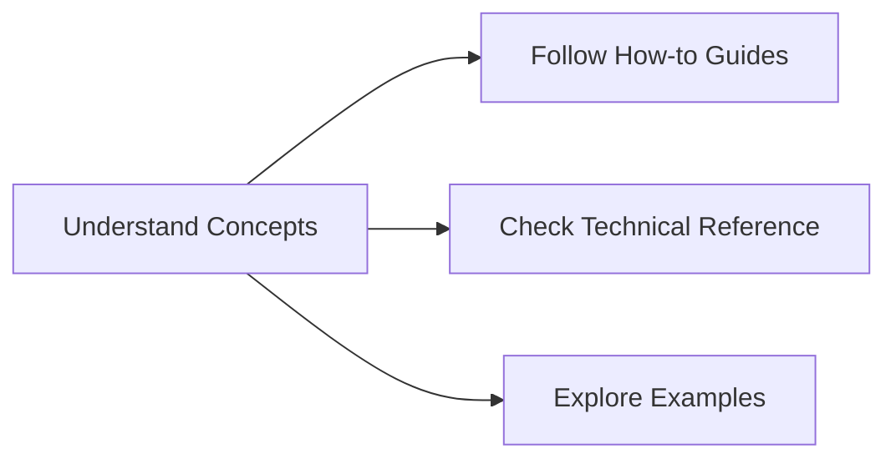

# Explain - Understanding erlmcp

Welcome to the **Explain** section of the Diátaxis documentation. Here we focus on the **why** behind erlmcp - the concepts, principles, and architecture that make it work.

## 🎯 Purpose of This Section

**Explain** answers the fundamental questions:
- What problems does erlmcp solve?
- How does it work at a conceptual level?
- Why are certain design decisions made?
- What are the underlying principles?

## 📚 What You'll Learn

### Core Concepts
- [Introduction to erlmcp](introduction.md) - What is erlmcp and why it exists
- [Architecture Overview](architecture.md) - High-level system design
- [Design Principles](design-principles.md) - Core values and decisions
- [Protocol Understanding](protocol.md) - MCP protocol fundamentals

### Advanced Concepts
- [Erlang/OTP Patterns](erlang-otp-patterns.md) - Concurrency and distribution
- [State Management](state-management.md) - How erlmcp handles state
- [Transport Mechanisms](transport-mechanisms.md) - Communication patterns
- [Error Handling Philosophy](error-handling.md) - Let it crash vs defensive programming

### Integration Concepts
- [Multi-Protocol Support](multi-protocol.md) - HTTP, TCP, stdio
- [Registry and Discovery](registry.md) - Service registration and routing
- [Load Balancing](load-balancing.md) - Connection pooling and distribution
- [Observability](observability.md) - Monitoring and metrics

### Security Concepts
- [Authentication](authentication.md) - Who can connect
- [Authorization](authorization.md) - What they can do
- [Transport Security](transport-security.md) - Encryption and protection
- [Data Privacy](data-privacy.md) - Information handling

## 🎯 For Whom

- **New Developers**: Start here to understand the big picture
- **System Architects**: Understand design decisions for integration
- **Technical Leaders**: Evaluate erlmcp for your projects
- **Contributors**: Learn the foundational concepts

## 📖 Learning Path

### Beginner Path
```markdown
1. [Introduction to erlmcp](introduction.md) - 15 minutes
2. [Architecture Overview](architecture.md) - 30 minutes
3. [Design Principles](design-principles.md) - 20 minutes
```

### Intermediate Path
```markdown
1. All beginner topics
2. [Protocol Understanding](protocol.md) - 25 minutes
3. [Erlang/OTP Patterns](erlang-otp-patterns.md) - 45 minutes
4. [State Management](state-management.md) - 30 minutes
```

### Advanced Path
```markdown
1. All previous topics
2. [Transport Mechanisms](transport-mechanisms.md) - 40 minutes
3. [Error Handling Philosophy](error-handling.md) - 30 minutes
4. Integration and security concepts
```

## 💡 Key Insights

### The "Why" Behind erlmcp

1. **Simplicity in Complexity**: Erlang's concurrency model makes distributed systems manageable
2. **Protocol-First Design**: MCP standard ensures interoperability
3. **Resilience by Design**: Let-it-crash philosophy with supervision
4. **Performance at Scale**: Optimized for high throughput with low latency

### Architecture Decisions Explained

- **Process-per-connection**: Isolation and fault tolerance
- **Registry-based routing**: Dynamic service discovery
- **Transport abstraction**: Support multiple protocols
- **State encapsulation**: Clear boundaries and modularity

## 🔗 Connecting to Other Sections

- **How-to**: Learn how to implement concepts from this section
- **Reference**: Find technical details for concepts discussed
- **Appendices**: See examples and practical applications

## 🎯 Next Steps

After understanding the concepts:



**Ready to build?** → [Go to How-to Guides](../howto/README.md)

**Need technical details?** → [Check Reference](../reference/README.md)

**See examples?** → [Browse Appendices](../appendices/README.md)