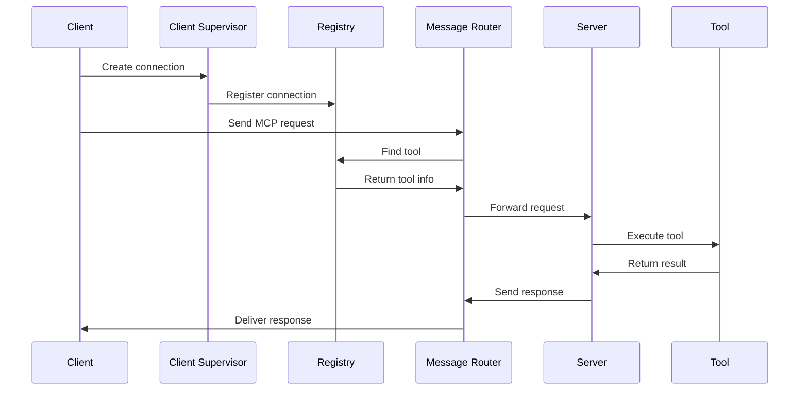
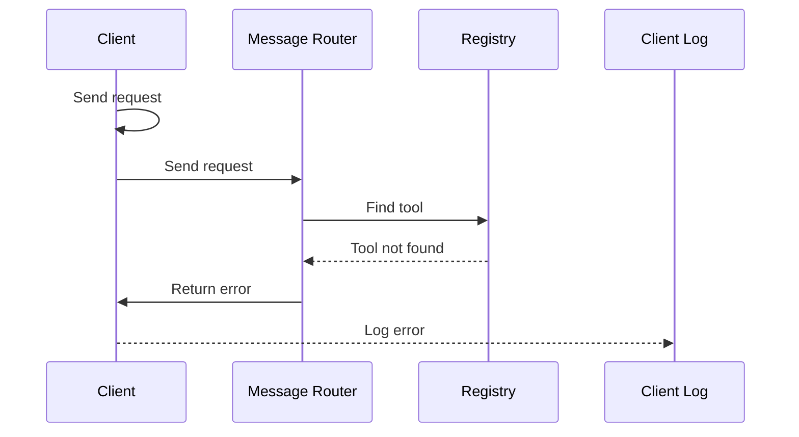

# Architecture Overview

The erlmcp architecture follows proven Erlang/OTP patterns to provide a robust, scalable, and maintainable foundation for MCP protocol implementation.

## High-Level Architecture

```
┌─────────────────────────────────────────────────────────────┐
│                    erlmcp Application                        │
│                                                             │
│  ┌─────────────────┐  ┌─────────────────┐  ┌─────────────────┐ │
│  │   Top Supervisor │  │   Registry      │  │   Event Manager │ │
│  │                 │  │                 │  │                 │ │
│  │                 │  │                 │  │                 │ │
│  └─────────────────┘  └─────────────────┘  └─────────────────┘ │
│           │                 │                 │                │
│           └─────────┬───────┴─────────┬───────┘                │
│                      │                 │                         │
│           ┌─────────────────────────────────────────────────┐    │
│           │              Message Router                     │    │
│           └─────────────────────────────────────────────────┘    │
│                      │                 │                         │
│        ┌─────────────┴───────────────┴─────────────┐        │
│        │           │           │           │         │        │
│  ┌─────────┐  ┌─────────┐  ┌─────────┐  ┌─────────┐  ┌─────────┐ │
│  │ Client  │  │ Server  │  │ TCP     │  │ HTTP    │  │ stdio   │ │
│  │  Supervisor │  Supervisor │  Supervisor │  Supervisor │ Supervisor │ │
│  └─────────┘  └─────────┘  └─────────┘  └─────────┘  └─────────┘ │
│        │           │           │           │           │        │
│  ┌─────────┐  ┌─────────┐  ┌─────────┐  ┌─────────┐  ┌─────────┐ │
│  │ Client  │  │ Server  │  │ TCP     │  │ HTTP    │  │ stdio   │ │
│  │  Workers │  │ Workers │  │ Workers │  │ Workers │  │ Workers │ │
│  └─────────┘  └─────────┘  └─────────┘  └─────────┘  └─────────┘ │
└─────────────────────────────────────────────────────────────┘
```

## Core Components

### 1. Top Supervisor (`erlmcp_sup`)

```erlang
% One-for-all supervision strategy
erlmcp_sup:start_link(#{strategy => one_for_all}).
```

**Responsibilities**:
- Start and monitor child processes
- Coordinate initialization
- Handle crashes with one-for-all strategy
- Maintain application state

**Key Features**:
- **Graceful shutdown**: Clean termination of all processes
- **Crash recovery**: Restart failed components
- **Load balancing**: Distribute work across workers

### 2. Registry (`erlmcp_registry`)

Built on `gproc` for efficient service discovery:

```erlang
% Register a service
gproc:reg({p, l, erlmcp_registry, tool_name, tool_id}).

% Discover a service
gproc:whereis_name({p, l, erlmcp_registry, tool_name, tool_id}).
```

**Responsibilities**:
- Service registration and discovery
- Message routing between components
- Load balancing across multiple instances
- Health monitoring of registered services

**Performance**:
- **553K msg/s** throughput
- **Constant-time lookup** via gproc
- **Automatic failover** of failed services

### 3. Message Router

Central component for protocol handling:

```erlang
% Route MCP requests
handle_mcp_request(Req) ->
    case maps:get(method, Req) of
        <<"tools/list">> -> route_to_registry(Req);
        <<"tools/call">> -> route_to_tool(Req);
        _ -> handle_unknown_method(Req)
    end.
```

**Responsibilities**:
- Parse and validate MCP requests
- Route to appropriate handlers
- Generate correlation IDs
- Handle timeouts and errors

### 4. Client Supervisor (`erlmcp_client_sup`)

```erlang
% Simple-one-for-one strategy for client connections
erlmcp_client_sup:start_child(#{transport => tcp, ...}).
```

**Responsibilities**:
- Manage client connections
- Handle connection lifecycle
- Provide worker process pool
- Monitor connection health

### 5. Server Supervisor (`erlmcp_server_sup`)

```erlang
% Simple-one-for-one strategy for server instances
erlmcp_server_sup:start_child(#{tools => [...]}).
```

**Responsibilities**:
- Manage server instances
- Register tools with registry
- Handle request processing
- Monitor server health

## Transport Layer Architecture

### Transport Interface

```erlang
% Transport behavior definition
-callback init(Options) -> {ok, State} | {error, Reason}.
-callback send(Data, State) -> {ok, NewState} | {error, Reason}.
-callback close(State) -> ok.
```

### Transport Implementations

#### TCP Transport
```erlang
% TCP transport using ranch
erlmcp_transport_tcp:init(#{port => 8080, ...}).
```

**Features**:
- High-performance TCP connections
- Connection pooling support
- Zero-copy message passing
- SSL/TLS encryption support

#### HTTP Transport
```erlang
% HTTP transport using gun/cowboy
erlmcp_transport_http:init(#{port => 8081, ...}).
```

**Features**:
- WebSocket support
- RESTful API endpoints
- CORS support
- Authentication handlers

#### stdio Transport
```erlang
% stdio transport for local development
erlmcp_transport_stdio:init(#{fd => std}).
```

**Features**:
- Simple local communication
- Debugging support
- Integration with CLI tools
- Zero dependency setup

## State Management

### Client State
```erlang
-record(state, {
    transport,          % Transport module
    transport_state,    % Transport state
    capabilities,      % MCP capabilities
    request_id,        % Request counter
    pending = #{},     % Pending requests
    timeout = 5000     % Default timeout
}).
```

### Server State
```erlang
-record(state, {
    tools = [],        % Available tools
    registry_ref,      % Registry reference
    request_id,        % Request counter
    metrics,          % Performance metrics
    limiters          % Rate limiters
}).
```

### State Management Principles

1. **Immutable Data**: Use records with clear boundaries
2. **Encapsulation**: State is private to each component
3. **Message Passing**: No shared state between processes
4. **Supervision**: Crashed processes are restarted with clean state

## Message Flow

### Request Flow


### Error Flow


## Load Balancing Strategies

### 1. Round Robin
```erlang
% Distribute requests evenly
select_worker([W1, W2, W3 | _], Index) ->
    lists:nth((Index rem length([W1, W2, W3])) + 1, [W1, W2, W3]).
```

### 2. Least Connections
```erlang
% Send to worker with fewest pending
select_worker(Workers) ->
    lists:min(fun(W1, W2) ->
        pending_requests(W1) =< pending_requests(W2)
    end, Workers).
```

### 3. Weighted Round Robin
```erlang
% Weighted distribution based on capacity
select_worker(Workers, Weights) ->
    % Weight-based selection logic
    ...
```

## Performance Optimizations

### 1. Connection Pooling
```erlang
% Reuse connections instead of creating new ones
connection_pool:get(#{host => Host, port => Port}).
```

### 2. Message Queue Optimization
```erlang
% Use message queues for high throughput
process_queue(Worker, Messages) ->
    [Worker ! Msg || Msg <- Messages].
```

### 3. Zero-Copy Optimization
```erlang
% Pass binary data directly, no copying
handle_data(<<_/binary>> = Bin) ->
    process_binary(Bin).
```

## Failure Handling

### 1. Let It Crash Philosophy
```erlang
% Don't handle errors in workers, let supervisor handle it
handle_call(_Request, _From, State) ->
    {stop, normal, State}.
```

### 2. Supervisor Strategies
```erlab
% Different strategies for different components
- erlmcp_sup: one_for_all (restart all if one crashes)
- client_sup: simple_one_for_one (independent workers)
- server_sup: simple_one_for_one (independent workers)
```

### 3. Graceful Degradation
```erlang
% Handle partial failures gracefully
handle_failure(Reason) ->
    case can_continue(Reason) of
        true -> degraded_mode();
        false -> emergency_shutdown()
    end.
```

## Monitoring and Observability

### Metrics Collection
```erlang
% Track performance metrics
update_metrics(#{operation => throughput, value = 1000}).
```

### Logging
```erlang
% Structured logging for debugging
log_info(#{event => request, id => Id, status => success}).
```

### Tracing
```erlang
 Distributed tracing for request flow
 trace_request(#{id => Id, from => From, to => To}).
```

## Scaling Architecture

### Vertical Scaling
- **Process density**: 40-50K connections per node
- **Memory optimization**: Efficient process creation
- **CPU optimization**: Lightweight message passing

### Horizontal Scaling
- **Multiple nodes**: Distribute load across nodes
- **Session affinity**: Stick to same server for session
- **Global registry**: Service discovery across nodes

### Clustering
```erlang
% Set up node clustering
net_adm:connect('node2@hostname').
net_adm:connect('node3@hostname').
```

## Design Decisions Explained

### Why Process-per-Connection?
- **Isolation**: Crash in one connection doesn't affect others
- **Simplicity**: No complex locking or shared state
- **Performance**: Erlang processes are lightweight
- **Concurrency**: Native support for thousands of connections

### Why Registry-based Routing?
- **Dynamic**: Services can be added/removed at runtime
- **Efficient**: Constant-time lookups
- **Scalable**: Works with multiple nodes
- **Flexible**: Support for different service types

### Why Multiple Transports?
- **Choice**: Different use cases need different transports
- **Future-proof**: New transports can be added easily
- **Performance**: Optimize for each transport type
- **Compatibility**: Support legacy systems

---

**Next**: [Design Principles](design-principles.md) to understand the core values behind this architecture.