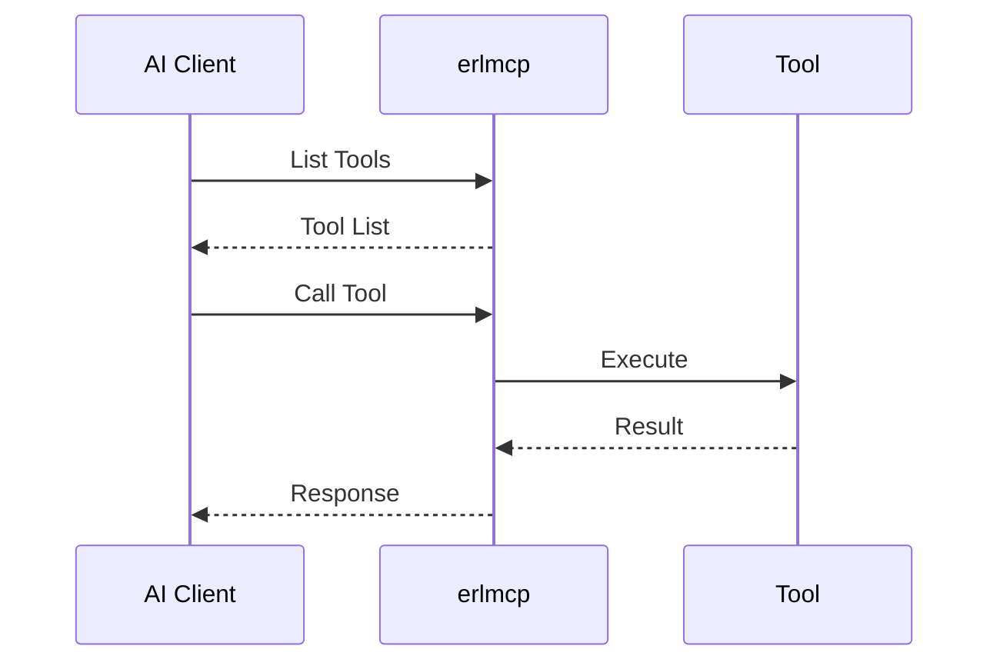

# Protocol Understanding

The Model Context Protocol (MCP) provides standardized communication between AI services and tools. Understanding the protocol at a deep level is essential for effective erlmcp implementation.

## MCP Protocol Overview

### Core Concepts

The MCP protocol enables AI services to:
- **Discover available tools** through a registry
- **Call tools** with structured requests
- **Receive results** with typed responses
- **Handle errors** gracefully
- **Maintain state** across interactions

### Protocol Flow



## Protocol Messages

### 1. Request Format

All MCP requests follow this structure:

```json
{
  "jsonrpc": "2.0",
  "id": "req-123",
  "method": "tools/call",
  "params": {
    "name": "calculator",
    "arguments": {
      "expression": "2 + 2"
    }
  }
}
```

### 2. Response Format

Standard MCP response:

```json
{
  "jsonrpc": "2.0",
  "id": "req-123",
  "result": {
    "content": [
      {
        "type": "text",
        "text": "4"
      }
    ]
  }
}
```

### 3. Error Response

Error handling follows JSON-RPC 2.0:

```json
{
  "jsonrpc": "2.0",
  "id": "req-123",
  "error": {
    "code": -32601,
    "message": "Tool not found",
    "data": {
      "tool_name": "calculator"
    }
  }
}
```

## Protocol Implementation in erlmcp

### Request Handling Pipeline

```erlang
% Complete request processing pipeline
handle_mcp_request(Req) ->
    % 1. Validate JSON-RPC structure
    case validate_jsonrpc(Req) of
        {ok, Validated} -> process_validated_request(Validated);
        {error, Reason} -> send_error(Req, Reason)
    end.

% 2. Route to appropriate handler
process_validated_request(Req) ->
    Method = maps:get(method, Req),
    case Method of
        <<"tools/list">> -> list_tools(Req);
        <<"tools/call">> -> call_tool(Req);
        _ -> send_error(Req, unknown_method)
    end.
```

### State Management

Client state tracks pending requests:

```erlang
-record(state, {
    transport,          % Transport module
    capabilities,      % Supported operations
    request_id = 1,    % Request counter
    pending = #{},     % Pending requests map
    timeout = 5000     % Default timeout (ms)
}).

% Track pending requests
add_pending_request(State, RequestId, From) ->
    NewPending = maps:put(RequestId, From, State#state.pending),
    State#state{pending = NewPending}.

% Complete pending request
complete_pending_request(State, RequestId, Response) ->
    From = maps:get(RequestId, State#state.pending, undefined),
    if
        From =/= undefined -> gen_server:reply(From, Response);
        true -> ok
    end,
    NewPending = maps:remove(RequestId, State#state.pending),
    State#state{pending = NewPending}.
```

### Transport Integration

Protocol is transport-agnostic:

```erlang
% TCP transport implementation
handle_tcp_data(Socket, Data) ->
    % Parse JSON-RPC message
    case jsx:decode(Data) of
        {ok, Request} ->
            handle_mcp_request(Request);
        {error, _} ->
            send_error(ResponseId, parse_error)
    end.

% HTTP transport implementation
handle_http_request(Req) ->
    {ok, Body, _} = cowboy_req:read_body(Req),
    case jsx:decode(Body) of
        {ok, Request} ->
            handle_mcp_request(Request);
        {error, _} ->
            send_http_error(Req, 400, "Invalid JSON")
    end.
```

## Protocol Extensions

### 1. Custom Tools

Extending MCP with custom tools:

```erlang
% Define custom tool
-export([weather_tool/1]).

weather_tool(#{arguments := #{city := City}}) ->
    case weather_api:get_current_weather(City) of
        {ok, Weather} ->
            #{content => [#{type => text, text => Weather}]};
        {error, Reason} ->
            throw({error, Reason})
    end.

% Register the tool
erlmcp_server:register_tool(<<"weather">>, ?MODULE, weather_tool).
```

### 2. Batch Operations

Optimize for multiple operations:

```json
{
  "jsonrpc": "2.0",
  "id": "batch-123",
  "params": {
    "operations": [
      {"method": "tools/call", "params": {...}},
      {"method": "tools/call", "params": {...}}
    ]
  }
}
```

### 3. Streaming Responses

Support for streaming data:

```json
{
  "jsonrpc": "2.0",
  "id": "stream-123",
  "method": "tools/stream",
  "params": {
    "name": "log_reader",
    "arguments": {
      "path": "/var/log/app.log"
    }
  }
}
```

## Protocol Compliance

### Validation Rules

erlmcp enforces strict protocol compliance:

```erlang
% Validate JSON-RPC 2.0
validate_jsonrpc(Req) ->
    RequiredFields = [<<"jsonrpc">>, <<"id">>, <<"method">>],
    case check_required_fields(Req, RequiredFields) of
        ok -> check_version(Req);
        {error, _} = Error -> Error
    end.

% Validate tool call parameters
validate_tool_call(Params) ->
    case maps:is_key(<<"name">>, Params) of
        true -> validate_arguments(Params);
        false -> {error, missing_name}
    end.
```

### Error Codes

Standard error codes for different scenarios:

| Code | Message | Description |
|------|---------|-------------|
| -32600 | Parse Error | Invalid JSON |
| -32601 | Method Not Found | Unknown method |
| -32602 | Invalid Params | Invalid parameters |
| -32603 | Internal Error | Internal error |
| -32604 | Tool Not Found | Tool not registered |
| -32605 | Permission Denied | Authorization failed |

## Performance Considerations

### Message Size Optimization

```erlang
% Compress large messages
handle_large_message(Data) when byte_size(Data) > 1024*1024 ->
    Compressed = zlib:compress(Data),
    process_compressed_message(Compressed);

% Process directly
handle_large_message(Data) ->
    process_message(Data).
```

### Connection Reuse

```erlang
% Keep connections alive
keep_alive_connection(Conn) ->
    erlang:send_after(30000, Conn, ping).
```

### Batch Processing

```erlang
% Process batch requests efficiently
process_batch(Operations) ->
    Results = [process_op(Op) || Op <- Operations],
    wrap_batch_response(Results).
```

## Security Considerations

### Input Validation

```erlang
% Validate all inputs
validate_input(#{arguments := Args}) ->
    case validate_arguments(Args) of
        {ok, Valid} -> {ok, Valid};
        {error, Reason} -> throw({error, Reason})
    end.
```

### Rate Limiting

```erlang
% Apply rate limiting per client
rate_limit_check(ClientId) ->
    case rate_limiter:check(ClientId) of
        allowed -> proceed_with_request();
        denied -> send_too_many_requests_error()
    end.
```

### Authentication

```erlang
% Authenticate requests
authenticate_request(#{auth := Auth}) ->
    case auth_service:validate(Auth) of
        {ok, User} -> authorize_request(User);
        {error, _} -> throw({error, authentication_failed})
    end.
```

## Monitoring and Observability

### Protocol Metrics

Track protocol-specific metrics:

```erlang
% Update protocol metrics
update_protocol_metrics(Operation, Status) ->
    case Status of
        success -> metrics:increment(protocol_success);
        error -> metrics:increment(protocol_error)
    end,
    metrics:timing(protocol_latency, Operation).
```

### Protocol Logging

Structured logging for protocol events:

```erlang
% Log protocol events
log_protocol_event(Event, Details) ->
    case Event of
        request_received ->
            logger:info(#{event => protocol_request, details => Details});
        response_sent ->
            logger:info(#{event => protocol_response, details => Details});
        error_occurred ->
            logger:error(#{event => protocol_error, details => Details})
    end.
```

## Protocol Evolution

### Version Compatibility

```erlang
% Handle protocol versions
handle_version(Request) ->
    case maps:get(<<"protocol_version">>, Request, <<"1.0">>) of
        <<"1.0">> -> handle_v1_request(Request);
        <<"1.1">> -> handle_v1_1_request(Request);
        _ -> send_version_error()
    end.
```

### Deprecation Strategy

Graceful handling of deprecated features:

```erlang
% Handle deprecated methods
handle_method(Method) ->
    case lists:member(Method, deprecated_methods()) of
        true ->
            logger:warning(#{event => deprecated_method, method => Method}),
            handle_deprecated_method(Method);
        false ->
            handle_supported_method(Method)
    end.
```

## Protocol Testing

### Unit Tests

```erlang
% Test protocol compliance
protocol_test_() ->
    [
        ?_assertEqual(200, validate_message(valid_message())),
        ?_assertEqual(400, validate_message(invalid_message())),
        ?_assertEqual(404, handle_not_found_method())
    ].
```

### Integration Tests

```erlang
% Test end-to-end protocol flow
integration_test_() ->
    [
        ?_test(begin
            Client = start_client(),
            Response = call_tool(Client, calculator_request()),
            ?assertMatch({ok, _}, Response)
        end)
    ].
```

---

**Next**: [Erlang/OTP Patterns](erlang-otp-patterns.md) to understand how Erlang's unique features shape the protocol implementation.