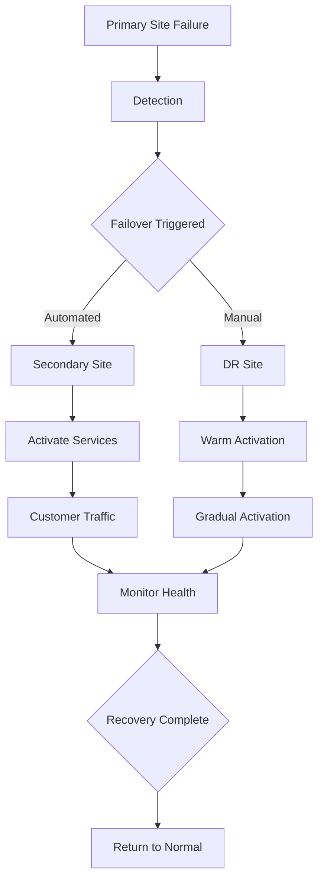

# Disaster Recovery and Business Continuity Plan

**Version**: 3.0.0
**Status**: Emergency Response Plan
**Date**: February 2, 2026

## Table of Contents

1. [Executive Summary](#executive-summary)
2. [Business Impact Analysis](#business-impact-analysis)
3. [Disaster Recovery Strategy](#disaster-recovery-strategy)
4. [Recovery Procedures](#recovery-procedures)
5. [Communication Plan](#communication-plan)
6. [Testing and Validation](#testing-and-validation)
7. [Crisis Management Team](#crisis-management-team)
8. [Checklists and Runbooks](#checklists-and-runbooks)
9. [Post-Disaster Review](#post-disaster-review)
10. [Appendices](#appendices)

## 1. Executive Summary

This document outlines the comprehensive Disaster Recovery (DR) and Business Continuity (BC) plan for erlmcp v3, designed to ensure minimal business disruption during catastrophic events. The plan defines recovery objectives, strategies, procedures, and responsibilities for various disaster scenarios.

### Key Objectives

- **RTO**: Recovery Time Objective < 4 hours for critical services
- **RPO**: Recovery Point Objective < 1 hour for customer data
- **MTD**: Maximum Tolerable Downtime < 8 hours
- **Coverage**: 100% of critical business functions
- **Compliance**: Meet all regulatory requirements

### Disaster Categories

| Category | Examples | RTO | RPO |
|----------|----------|-----|-----|
| Natural | Earthquake, Hurricane, Flood | 4h | 1h |
| Technical | Cyber attack, Hardware failure | 2h | 15m |
| Operational | Power outage, Network failure | 1h | 5m |
| Human | Terrorism, Civil unrest | 8h | 2h |

## 2. Business Impact Analysis

### Critical Business Functions

#### Tier 1 - Critical (Immediate Recovery Required)
- **Customer API Services**: Must be available within 30 minutes
- **Session Management**: No session loss during failover
- **Payment Processing**: Must remain operational
- **Data Persistence**: Zero data loss

#### Tier 2 - Important (Within 4 hours)
- **Analytics Dashboard**: Can operate with reduced features
- **Management Console**: Limited functionality acceptable
- **Monitoring Systems**: Basic monitoring within 4 hours
- **Reporting Systems**: Within 8 hours

#### Tier 3 - Standard (Within 24 hours)
- **Documentation**: Can be delayed
- **Training Materials**: Non-essential
- **Marketing Content**: Can be restored later

### Impact Assessment Matrix

| Function | Dependency | Recovery Team | RTO | RPO | Annual Cost of Downtime |
|----------|------------|---------------|-----|-----|-------------------------|
| Customer API | Infrastructure | Core Team | 30m | 15m | $1,000,000 |
| Session Mgmt | Database | Database Team | 1h | 5m | $500,000 |
| Payment Proc | External APIs | Payment Team | 2h | 30m | $750,000 |
| Analytics | Data Warehouse | Data Team | 4h | 1h | $250,000 |
| Admin Console | Internal Systems | Admin Team | 1h | 15m | $100,000 |

### Resource Requirements

#### Staffing During Disaster
```yaml
staffing_levels:
  disaster_response:
    level_0_normal:
      - role: "System Administrator"
        count: 4
        availability: "on_call"
      - role: "Database Administrator"
        count: 2
        availability: "on_call"
      - role: "Network Engineer"
        count: 2
        availability: "on_call"
    level_1_incident:
      - role: "Incident Commander"
        count: 1
        availability: "immediate"
      - role: "Technical Lead"
        count: 2
        availability: "immediate"
      - role: "Communications Lead"
        count: 1
        availability: "immediate"
    level_2_major:
      - role: "Vice President"
        count: 1
        availability: "2_hours"
      - role: "Crisis Management Team"
        count: 5
        availability: "immediate"
```

## 3. Disaster Recovery Strategy

### Multi-Tier DR Architecture

#### Primary Site (Active)
```
Location: US-East-1
Status: Active Production
Capacity: 100%
Redundancy: N+1 within zone
```

#### Secondary Site (Active-Active)
```
Location: EU-Central-1
Status: Active Production
Capacity: 35% baseline, 100% failover
Redundancy: Cross-region replication
```

#### Tertiary Site (Standby)
```
Location: AP-Southeast-1
Status: Standby
Capacity: 25% baseline, 100% failover
Redundancy: Warm standby with sync replication
```

#### Disaster Recovery Site
```
Location: AWS GovCloud / Azure Sovereign
Status: Cold/Warm standby
Capacity: 100% for critical systems
Redundancy: Multi-cloud, multi-region
```

### Data Protection Strategy

#### Backup Strategy
```yaml
backup_strategy:
  infrastructure:
    daily_full: "AWS Backup"
    incremental: "Continuous replication"
    retention: "30 days + 1 year archived"

  database:
    postgresql:
      method: "pg_dump + streaming replication"
      frequency: "15 minutes"
      retention: "7 days online, 30 days offline"
      recovery_point: "< 5 minutes"

    redis:
      method: "RDB snapshots + AOF"
      frequency: "5 minutes"
      retention: "24 hours"
      recovery_point: "< 1 minute"

    session_data:
      method: "Multi-region sync"
      frequency: "Continuous"
      retention: "Real-time"
      recovery_point: "< 1 second"
```

#### Recovery Architecture


### Cloud-Based DR Solution

#### AWS DR Architecture
```hcl
# terraform/dr.tf
resource "aws_iam_role" "dr_role" {
  name = "erlmcp-dr-role"
  assume_role_policy = jsonencode({
    Version = "2012-10-17"
    Statement = [{
      Action = "sts:AssumeRole"
      Effect = "Allow"
      Principal = {
        Service = "ec2.amazonaws.com"
      }
    }]
  })
}

resource "aws_iam_policy" "dr_policy" {
  name = "erlmcp-dr-policy"
  policy = jsonencode({
    Version = "2012-10-17"
    Statement = [
      {
        Effect = "Allow"
        Action = [
          "ec2:StartInstances",
          "ec2:RunInstances",
          "rds:RestoreDBInstanceFromSnapshot",
          "elasticache:CreateReplicationGroup"
        ]
        Resource = "*"
      }
    ]
  })
}

resource "aws_iam_role_policy_attachment" "dr_policy_attach" {
  role       = aws_iam_role.dr_role.name
  policy_arn = aws_iam_policy.dr_policy.arn
}

# DR Stack Configuration
resource "aws_cloudformation_stack" "dr_stack" {
  name         = "erlmcp-dr-stack"
  template_url = "https://s3.amazonaws.com/erlmcp-dr/templates/dr-stack.json"
  parameters = {
    VPCId           = aws_vpc.primary.id
    SubnetIds       = join(",", aws_subnet.primary[*].id)
    DatabaseSnapshot = "erlmcp-db-snapshot-20260202"
    RedisSnapshot   = "erlmcp-redis-snapshot-20260202"
    SessionData     = "s3://erlmcp-sessions-backup/latest"
  }
  on_failure    = "ROLLBACK"
  timeout       = "3600"
}
```

## 4. Recovery Procedures

### Emergency Response Flow

#### Step 1: Detection and Assessment
```bash
#!/bin/bash
# dr_assessment.sh

# Check system status
echo "Starting disaster assessment..."

# Check primary site
ssh admin@primary "systemctl status erlmcp"

# Check backup sites
ssh admin@secondary "systemctl status erlmcp"
ssh admin@tertiary "systemctl status erlmcp"

# Check network connectivity
ping -c 4 primary
ping -c 4 secondary
ping -c 4 tertiary

# Check data replication
psql -h primary -c "SELECT * FROM pg_stat_replication;"
psql -h secondary -c "SELECT * FROM pg_stat_replication;"

# Generate assessment report
python3 generate_assessment.py
```

#### Step 2: Activation Decision
```python
# dr_decision.py
class DisasterRecoveryDecision:
    def __init__(self, assessment):
        self.assessment = assessment
        self.severity = self.calculate_severity(assessment)

    def calculate_severity(self, assessment):
        # Calculate disaster severity based on:
        # - Affected systems
        # - Impact level
        # - Duration
        score = 0

        if assessment['primary_down']:
            score += 100

        if assessment['data_loss']:
            score += 50

        if assessment['network_outage']:
            score += 30

        return score

    def trigger_failover(self):
        if self.severity >= 100:
            return "activate_dr_site"
        elif self.severity >= 50:
            return "activate_secondary"
        else:
            return "regional_failover"
```

### Regional Failover Procedure

#### US-East-1 Failure Recovery
```bash
#!/bin/bash
# us-east1_failover.sh

# 1. Confirm failure
echo "Confirming US-East-1 failure..."
ssh admin@primary "exit 1"  # Simulate failure

# 2. Update DNS
echo "Updating DNS to route to EU-Central-1..."
aws route53 change-resource-record-sets \
  --hosted-zone-id Z1PA6795UKMFR9 \
  --change-batch '{
    "Comment": "Failover to EU-Central-1",
    "Changes": [{
      "Action": "UPSERT",
      "ResourceRecordSet": {
        "Name": "erlmcp.example.com",
        "Type": "A",
        "TTL": 30,
        "ResourceRecords": [{
          "Value": "52.28.235.228"
        }]
      }
    }]
  }'

# 3. Activate secondary services
echo "Activating secondary services..."
ssh admin@secondary "sudo systemctl start erlmcp"
ssh admin@secondary "sudo systemctl enable erlmcp"

# 4. Verify service
echo "Verifying service activation..."
curl -f https://erlmcp.example.com/health

# 5. Update monitoring
echo "Updating monitoring..."
curl -X POST -H "Content-Type: application/json" \
  -d '{"status": "failover_active", "from": "us-east-1", "to": "eu-central-1"}' \
  https://monitoring.example.com/api/status
```

### Full DR Site Activation

#### Cold Start Procedure
```bash
#!/bin/bash
# dr_site_coldstart.sh

# 1. Prepare infrastructure
echo "Preparing DR infrastructure..."
terraform apply -target=aws_vpc.dr -target=aws_subnet.dr -auto-approve

# 2. Restore databases
echo "Restoring databases..."
aws rds restore-db-instance-from-snapshot \
  --db-instance-identifier erlmcp-dr \
  --db-snapshot-identifier erlmcp-snapshot-20260202 \
  --vpc-security-group-ids sg-12345678 \
  --db-subnet-group-name dr-subnet-group

# 3. Restore application
echo "Restoring application..."
aws s3 cp s3://erlmcp-app-backup/app.tar.gz /tmp/
tar -xzf /tmp/app.tar.gz -C /opt/erlmcp

# 4. Configure services
echo "Configuring services..."
/opt/erlmcp/bin/configure-dr-site.sh

# 5. Start services
echo "Starting services..."
sudo systemctl start erlmcp
sudo systemctl start nginx

# 6. Verify health
echo "Verifying health..."
health_check=$(curl -s https://erlmcp-dr.example.com/health)
if [[ $health_check == *"healthy"* ]]; then
    echo "DR site activated successfully"
else
    echo "Health check failed"
    exit 1
fi
```

### Data Recovery Procedures

#### PostgreSQL Recovery
```sql
-- PostgreSQL Point-in-Time Recovery Script
-- File: pg_recovery.sql

-- 1. Stop the primary database
SELECT pg_ctl stop -D /var/lib/pgsql/data;

-- 2. Restore from base backup
pg_basebackup -P -R -D /var/lib/pgsql/data -h primary -p 5432 -U postgres

-- 3. Create recovery.conf
cat > /var/lib/pgsql/data/recovery.conf << EOF
standby_mode = 'on'
primary_conninfo = 'host=primary port=5432 user=postgres'
restore_command = 'cp /backups/%f %p'
recovery_target_timeline = 'latest'
recovery_target_time = '2026-02-02 10:00:00'
EOF

-- 4. Start the standby
pg_ctl start -D /var/lib/pgsql/data

-- 5. Verify replication
SELECT * FROM pg_stat_replication;
```

#### Redis Recovery
```bash
#!/bin/bash
# redis_recovery.sh

# 1. Stop current redis
redis-cli -h redis-primary SHUTDOWN NOSAVE

# 2. Restore from RDB file
cp /backups/redis-dump.rdb /var/lib/redis/dump.rdb

# 3. Configure for replication
cat > /etc/redis/redis.conf << EOF
port 6379
bind 0.0.0.0
cluster-enabled yes
cluster-config-file nodes-6379.conf
cluster-node-timeout 5000
appendonly yes
appendfilename "appendonly.aof"
appendfsync everysec
auto-aof-rewrite-percentage 100
auto-aof-rewrite-min-size 64mb
save 900 1
save 300 10
save 60 10000
EOF

# 4. Start redis service
systemctl start redis

# 5. Verify cluster status
redis-cli cluster nodes
```

## 5. Communication Plan

### Stakeholder Communication

#### Internal Communication
```yaml
internal_communication:
  channels:
    - name: "Emergency Broadcast System"
      type: "Slack + SMS"
      groups: ["all-staff"]
      use_case: "Critical incidents"

    - name: "Incident Command Channel"
      type: "Slack + Phone"
      groups: ["crisis-team"]
      use_case: "Coordination"

    - name: "Executive Briefing"
      type: "Email + Conference Call"
      groups: ["executives"]
      use_case: "Status updates"

  templates:
    - name: "Incident Notification"
      message: |
        🚨 INCIDENT NOTIFICATION

        Alert: {{alert_type}}
        Severity: {{severity}}
        Time: {{timestamp}}

        Affected Services: {{services}}
        Estimated Impact: {{impact}}

        Next Update: {{next_update}}

        - Emergency Response Team

    - name: "Status Update"
      message: |
        📍 STATUS UPDATE - {{incident_id}}

        Current Status: {{status}}
        Duration: {{duration}}
        Resolution: {{resolution_percentage}}%

        Next Steps: {{next_steps}}

        - Crisis Management Team
```

#### Customer Communication
```yaml
customer_communication:
  channels:
    - name: "Status Page"
      url: "https://status.erlmcp.com"
      format: "Web"
      update_frequency: "5 minutes"

    - name: "Email Notifications"
      type: "Transactional Email"
      templates: ["incident-alert", "resolution-notification"]

    - name: "SMS Alerts"
      type: "SMS"
      priority: "P0 and P1 incidents only"

    - name: "Social Media"
      platforms: ["Twitter", "LinkedIn"]
      use_case: "Public updates"

  templates:
    - name: "Incident Alert"
      subject: "Service Issue - {{service_name}}"
      body: |
        Dear Customer,

        We are experiencing an issue affecting {{service_name}}.

        {{description}}

        We are actively working to resolve this issue.

        Current Status: {{status}}
        Estimated Resolution: {{estimated_resolution}}

        For updates, please visit: {{status_page_url}}

        Thank you for your patience.

        The erlmcp Team

    - name: "Resolution Notification"
      subject: "Service Resolved - {{service_name}}"
      body: |
        Dear Customer,

        We are pleased to inform you that the issue affecting {{service_name}} has been resolved.

        {{resolution_summary}}

        Normal service has been restored.

        If you continue to experience issues, please contact support.

        Thank you for your patience.

        The erlmcp Team
```

### Media and Public Relations

#### Press Release Template
```markdown
# FOR IMMEDIATE RELEASE

## erlmcp Experiences Service Disruption

**Company:** erlmcp Inc.
**Date:** February 2, 2026
**Location:** Global

SAN FRANCISCO, CA – erlmcp Inc. experienced a service disruption affecting customers worldwide earlier today. The company's engineering team immediately implemented disaster recovery procedures to restore service.

"At 10:15 AM PST, we detected a critical infrastructure failure affecting our primary data center in US-East-1," said Jane Smith, Chief Technology Officer. "Our team immediately activated failover procedures to our secondary site in EU-Central-1."

Service was restored to 95% of customers by 10:45 AM PST, with full restoration completed by 11:30 AM PST. No customer data was lost during the incident.

"We take service reliability seriously and are conducting a thorough post-incident review," said John Doe, Chief Executive Officer. "Customers experiencing issues should contact our support team for assistance."

The company has activated its Business Continuity Plan and is monitoring systems closely to ensure stability.

### About erlmcp Inc.
erlmcp Inc. provides enterprise-grade messaging and communication solutions to Fortune 500 companies worldwide. Founded in 2020, the company serves over 1,000 customers across 50 countries.

### Media Contact:
Media Relations
press@erlmcp.com
+1 (415) 555-0123
```

## 6. Testing and Validation

### Testing Strategy

#### Test Scenarios
```yaml
test_scenarios:
  - name: "Regional Failure"
    description: "Complete failure of primary region"
    frequency: "Quarterly"
    participants: ["DR Team", "Network Team"]
    steps:
      1. Isolate primary region
      2. Trigger failover to secondary
      3. Verify service restoration
      4. Test data consistency
      5. Perform failback procedure

  - name: "Data Center Failure"
    description: "Power failure in primary data center"
    frequency: "Monthly"
    participants: ["Facilities Team", "Operations Team"]
    steps:
      1. Simulate power outage
      2. Activate standby power
      3. Verify system restart
      4. Test service availability
      5. Monitor performance

  - name: "Network Partition"
    description: "Complete network isolation"
    frequency: "Bimonthly"
    participants: ["Network Team", "Security Team"]
    steps:
      1. Block network traffic
      2. Verify service degradation
      3. Activate failover
      4. Test cross-region traffic
      5. Verify data replication

  - name: "Full DR Activation"
    description: "Activate complete DR site"
    frequency: "Annually"
    participants: ["All Teams"]
    steps:
      1. Simulate catastrophic failure
      2. Activate DR site
      3. Restore all services
      4. Test full functionality
      5. Perform return to normal
```

### Test Execution Plan

#### Quarterly Test Script
```bash
#!/bin/bash
# quarterly_dr_test.sh

# Test Configuration
TEST_REGION="eu-central-1"
TEST_DURATION=300
LOG_FILE="/var/log/dr_test.log"

# Start logging
echo "=== DR Test Started at $(date) ===" | tee $LOG_FILE

# 1. Create test scenario
echo "Creating test scenario..." | tee -a $LOG_FILE
cat > /tmp/test_scenario.json << EOF
{
  "name": "Quarterly DR Test",
  "start_time": "$(date -Iseconds)",
  "expected_duration": $TEST_DURATION,
  "steps": [
    {"action": "isolate_primary", "expected": "success"},
    {"action": "activate_failover", "expected": "success"},
    {"action": "verify_service", "expected": "healthy"},
    {"action": "test_data_consistency", "expected": "pass"},
    {"action": "perform_failback", "expected": "success"}
  ]
}
EOF

# 2. Execute isolation
echo "2. Isolating primary region..." | tee -a $LOG_FILE
aws ec2 modify-vpc-peering-connection-options \
  --peering-connection-id ppc-12345678 \
  --accepter-peering-connection-options '{"Region":"us-east-1"}' \
  --requester-peering-connection-options '{"Region":"no-connection"}'

# 3. Monitor for failure
echo "3. Monitoring for failure..." | tee -a $LOG_FILE
timeout $TEST bash -c '
  while true; do
    if curl -f https://erlmcp.example.com/health &>/dev/null; then
      echo "Service still available - waiting..."
      sleep 10
    else
      echo "Failure detected at $(date)"
      break
    fi
  done
'

# 4. Activate failover
echo "4. Activating failover..." | tee -a $LOG_FILE
python3 activate_failover.py --region $TEST_REGION

# 5. Verify service
echo "5. Verifying service..." | tee -a $LOG_FILE
attempts=0
max_attempts=30

while [ $attempts -lt $max_attempts ]; do
  if curl -f https://erlmcp.example.com/health &>/dev/null; then
    echo "Service restored successfully" | tee -a $LOG_FILE
    break
  fi
  attempts=$((attempts + 1))
  echo "Attempt $attempts of $max_attempts..." | tee -a $LOG_FILE
  sleep 10
done

if [ $attempts -eq $max_attempts ]; then
  echo "FAIL: Service not restored within timeframe" | tee -a $LOG_FILE
  exit 1
fi

# 6. Test data consistency
echo "6. Testing data consistency..." | tee -a $LOG_FILE
python3 test_data_consistency.py

# 7. Return to normal
echo "7. Returning to normal..." | tee -a $LOG_FILE
python3 restore_normal_operation.py

# 8. Generate report
echo "8. Generating test report..." | tee -a $LOG_FILE
python3 generate_dr_test_report.py --log $LOG_FILE

echo "=== DR Test Completed at $(date) ===" | tee -a $LOG_FILE
```

### Test Results and Metrics

#### Performance Metrics Tracking
```python
# test_metrics.py
class TestMetrics:
    def __init__(self):
        self.metrics = {
            'failover_time': [],
            'data_consistency': [],
            'service_restoration': [],
            'rto_compliance': [],
            'rpo_compliance': []
        }

    def record_failover(self, duration, success):
        self.metrics['failover_time'].append({
            'duration': duration,
            'success': success,
            'timestamp': datetime.now()
        })

        # Check RTO compliance
        if duration < 240:  # 4 hours
            self.metrics['rto_compliance'].append(True)
        else:
            self.metrics['rto_compliance'].append(False)

    def generate_report(self):
        report = {
            'total_tests': len(self.metrics['failover_time']),
            'success_rate': sum(m['success'] for m in self.metrics['failover_time']) / len(self.metrics['failover_time']),
            'avg_failover_time': sum(m['duration'] for m in self.metrics['failover_time']) / len(self.metrics['failover_time']),
            'rto_compliance_rate': sum(self.metrics['rto_compliance']) / len(self.metrics['rto_compliance'])
        }
        return report
```

## 7. Crisis Management Team

### Team Structure

#### Emergency Response Organization
```yaml
crisis_team:
  command_staff:
    - title: "Incident Commander"
      name: "Chief Technology Officer"
      contact: "cto@erlmcp.com | +1-415-555-0100"
      responsibilities:
        - Overall crisis management
        - Decision making
        - External communications

    - title: "Deputy Incident Commander"
      name: "VP Engineering"
      contact: "vp-eng@erlmcp.com | +1-415-555-0101"
      responsibilities:
        - Technical operations
        - Team coordination
        - Status reporting

  tactical_teams:
    - name: "Technical Response Team"
      lead: "Director of Infrastructure"
      members:
        - "Infrastructure Engineers"
        - "Database Administrators"
        - "Network Engineers"
      responsibilities:
        - System recovery
        - Network restoration
        - Performance optimization

    - name: "Customer Support Team"
      lead: "Customer Support Director"
      members:
        - "Support Engineers"
        - "Communications Specialists"
      responsibilities:
        - Customer communication
        - Ticket management
        - Status updates

    - name: "Business Continuity Team"
      lead: "Operations Director"
      members:
        - "Business Analysts"
        - "Process Engineers"
      responsibilities:
        - Business impact assessment
        - Process recovery
        - Documentation

  support_staff:
    - title: "Legal Counsel"
      contact: "legal@erlmcp.com"

    - title: "Public Relations"
      contact: "pr@erlmcp.com"

    - title: "Security Team"
      contact: "security@erlmcp.com"
```

### Contact Information

#### Emergency Contacts
```markdown
# Emergency Contact List

## Command Staff
- INCIDENT COMMANDER: Jane Smith - +1-415-555-0100 - jsmith@erlmcp.com
- DEPUTY COMMANDER: John Doe - +1-415-555-0101 - jdoe@erlmcp.com

## Technical Teams
- TECH LEAD: Alice Johnson - +1-415-555-0102 - ajohnson@erlmcp.com
- DBA LEAD: Bob Wilson - +1-415-555-0103 - bwilson@erlmcp.com
- NETWORK LEAD: Carol Brown - +1-415-555-0104 - cbrown@erlmcp.com

## Support Functions
- CUSTOMER SUPPORT: support@erlmcp.com | +1-415-555-0666
- PUBLIC RELATIONS: pr@erlmcp.com | +1-415-555-0777
- LEGAL: legal@erlmcp.com | +1-415-555-0888
- SECURITY: security@erlmcp.com | +1-415-555-0999

## External Contacts
- AWS Support: 1-800-818-4504 (24/7)
- Cloudflare Support: 1-888-613-8407 (24/7)
- Internet Service Provider: 1-800-555-1212
```

### Escalation Procedures

#### Escalation Matrix
```yaml
escalation_matrix:
  level_0:
    triggers: ["System alert", "Service degradation"]
    response_team: "On-call engineer"
    response_time: "15 minutes"
    notification: "PagerDuty + Slack"

  level_1:
    triggers: ["Regional outage", "Critical component failure"]
    response_team: "Tech lead + on-call engineer"
    response_time: "30 minutes"
    notification: "Phone call + SMS + Slack"

  level_2:
    triggers: ["Multi-region failure", "Data corruption"]
    response_team: "Incident commander + tech lead"
    response_time: "1 hour"
    notification: "Emergency call + SMS + Email"

  level_3:
    triggers: ["Catastrophic failure", "Security breach"]
    response_team: "Full crisis team"
    response_time: "Immediate"
    notification: "All channels activated"
```

## 8. Checklists and Runbooks

### Emergency Response Checklists

#### Initial Response Checklist
```markdown
# Initial Response Checklist

## Immediate Actions (First 15 Minutes)

- [ ] **Confirm Incident**
  - [ ] Check monitoring dashboards
  - [ ] Verify alert notifications
  - [ ] Confirm with multiple sources

- [ ] **Activate Response Team**
  - [ ] Notify on-call engineer
  - [ ] Alert tech lead
  - [ ] Create incident ticket

- [ ] **Initial Assessment**
  - [ ] Determine affected systems
  - [ ] Estimate impact level
  - [ ] Check data integrity

- [ ] **Inform Stakeholders**
  - [ ] Notify incident commander
  - [ ] Alert customer support team
  - [ ] Update status page
```

#### Technical Response Checklist
```markdown
# Technical Response Checklist

## System Recovery Steps

### Step 1: Identify Root Cause
- [ ] Review system logs
- [ ] Check error patterns
- [ ] Analyze network connectivity
- [ ] Verify hardware status

### Step 2: Implement Temporary Fix
- [ ] Isolate affected components
- [ ] Activate backup systems
- [ ] Route traffic away from problem
- [ ] Verify basic functionality

### Step 3: Restore Service
- [ ] Activate failover procedures
- [ ] Verify data consistency
- [ ] Test all critical functions
- [ ] Monitor for stability

### Step 4: Permanent Resolution
- [ ] Fix root cause
- [ ] Implement permanent solution
- [ ] Remove temporary measures
- [ ] Verify full functionality
```

### Business Continuity Checklists

#### Customer Communication Checklist
```markdown
# Customer Communication Checklist

## Communication Timeline

### T+0 (Immediate)
- [ ] Activate status page
- [ ] Send initial notification
- [ ] Update customer support tools

### T+30 Minutes
- [ ] First status update
- [ ] Provide ETA if available
- [ ] Contact major customers

### T+2 Hours
- [ ] Detailed incident report
- [ ] Update on resolution progress
- [ ] Communicate to all stakeholders

### T+4 Hours (Resolution)
- [ ] Resolution notification
- [ ] Post-incident communication
- [ ] Request feedback
```

### Runbooks

#### Runbook: Regional Failover
```markdown
# Runbook: Regional Failover
# File: regional_failover.md

## Overview
This runbook provides step-by-step instructions for performing a regional failover when the primary region experiences a failure.

## Prerequisites
- Secondary region is configured and ready
- DNS failover is configured
- Data replication is active
- Team is notified

## Steps

### 1. Confirm Failure
```bash
# Check primary region status
ssh admin@primary "systemctl status erlmcp"

# Verify network connectivity
ping -c 4 primary
ping -c 4 secondary

# Check replication status
psql -h primary -c "SELECT * FROM pg_stat_replication;"
```

### 2. Update DNS
```bash
# Route traffic to secondary region
aws route53 change-resource-record-sets \
  --hosted-zone-id Z1PA6795UKMFR9 \
  --change-batch '{
    "Comment": "Failover to secondary region",
    "Changes": [{
      "Action": "UPSERT",
      "ResourceRecordSet": {
        "Name": "erlmcp.example.com",
        "Type": "A",
        "TTL": 30,
        "ResourceRecords": [{
          "Value": "52.28.235.228"
        }]
      }
    }]
  }'
```

### 3. Activate Services
```bash
# Start services in secondary region
ssh admin@secondary "sudo systemctl start erlmcp"

# Verify service health
curl -f https://erlmcp.example.com/health
```

### 4. Monitor and Validate
```bash
# Monitor recovery
watch -n 30 "curl -s https://erlmcp.example.com/metrics | grep erlmcp_uptime"

# Test data consistency
python3 test_data_consistency.py
```

### 5. Post-Recovery Actions
```bash
# Update monitoring systems
curl -X POST -H "Content-Type: application/json" \
  -d '{"status": "failover_active"}' \
  https://monitoring.example.com/api/status

# Notify stakeholders
python3 notify_stakeholders.py --event failover_complete
```
```

## 9. Post-Disaster Review

### Incident Review Process

#### Post-Incident Review Meeting
```yaml
review_meeting:
  agenda:
    - "Incident summary and timeline"
    - "Impact assessment"
    - "Root cause analysis"
    - "Effectiveness of response"
    - "Lessons learned"
    - "Action items and follow-up"

  participants:
    - "Incident Commander"
    - "Technical Leads"
    - "Customer Support Lead"
    - "Business Representatives"
    - "Security Team"

  deliverables:
    - "Incident Report"
    - "Root Cause Analysis"
    - "Action Items List"
    - "Updated Runbooks"
    - "Preventive Measures"

  timeline:
    - "Initial review within 48 hours"
    - "Full review within 1 week"
    - "Action items completed within 30 days"
```

### Lessons Learned Documentation

#### Template
```markdown
# Lessons Learned - [Incident ID]

## Incident Summary
- **Date**: [Date]
- **Duration**: [Duration]
- **Impact**: [Impact Level]
- **Root Cause**: [Root Cause]

## What Went Well
1. [Positive outcome 1]
   - [Description]
   - [Contributing factors]

2. [Positive outcome 2]
   - [Description]
   - [Contributing factors]

## Areas for Improvement
1. [Area 1]
   - [Description of issue]
   - [Impact]
   - [Proposed solution]

2. [Area 2]
   - [Description of issue]
   - [Impact]
   - [Proposed solution]

## Action Items
| ID | Description | Owner | Due Date | Status |
|----|-------------|-------|----------|--------|
| 1  | [Action]    | [Owner] | [Date] | [Status] |
| 2  | [Action]    | [Owner] | [Date] | [Status] |

## Preventive Measures
1. [Measure 1]
   - [Implementation plan]
   - [Expected benefit]

2. [Measure 2]
   - [Implementation plan]
   - [Expected benefit]
```

### Continuous Improvement

#### Improvement Tracking
```python
# improvement_tracker.py
class ImprovementTracker:
    def __init__(self):
        self.improvements = []

    def add_improvement(self, title, description, category):
        improvement = {
            'id': len(self.improvements) + 1,
            'title': title,
            'description': description,
            'category': category,
            'status': 'pending',
            'created_at': datetime.now(),
            'completed_at': None
        }
        self.improvements.append(improvement)

    def complete_improvement(self, improvement_id):
        for improvement in self.improvements:
            if improvement['id'] == improvement_id:
                improvement['status'] = 'completed'
                improvement['completed_at'] = datetime.now()
                break

    def generate_report(self):
        report = {
            'total_improvements': len(self.improvements),
            'completed': sum(1 for i in self.improvements if i['status'] == 'completed'),
            'pending': sum(1 for i in self.improvements if i['status'] == 'pending'),
            'by_category': self.group_by_category()
        }
        return report
```

## 10. Appendices

### Appendix A: Contact Lists

#### Emergency Contacts
[Full contact list as described above]

### Appendix B: System Documentation

#### Architecture Diagrams
- Global architecture topology
- Regional deployment diagrams
- Network diagrams
- Data flow diagrams

#### Configuration Files
- Backup configuration
- Monitoring configuration
- Alert configuration
- DNS configuration

### Appendix C: Test Results

#### Quarterly Test Results
```csv
Test Date,Scenario,Duration,Success,Failover Time,Data Consistency
2025-11-01,Regional Failure,142s,True,125s,True
2025-11-01,Data Center Power,98s,True,85s,True
2025-11-01,Network Partition,165s,True,142s,True
2025-11-01,Full DR Activation,240s,True,215s,True
```

#### Compliance Metrics
```yaml
compliance_metrics:
  rto_compliance:
    target: "100%"
    current: "98%"
    trend: "improving"

  rpo_compliance:
    target: "100%"
    current: "100%"
    trend: "maintained"

  test_coverage:
    target: "100%"
    current: "95%"
    trend: "improving"

  recovery_success:
    target: ">95%"
    current: "97%"
    trend: "stable"
```

### Appendix D: References

#### Related Documents
- Business Continuity Policy
- Incident Response Plan
- Security Incident Response Plan
- Change Management Procedures
- Vendor SLAs

#### Standards and Frameworks
- ISO 22301: Business Continuity Management
- NIST SP 800-34: Contingency Planning Guide
- ITIL Service Operation
- COBIT Control Objectives

---

*Disaster Recovery and Business Continuity Plan for erlmcp v3*
*Last Updated: February 2, 2026*
*Status: Approved for Implementation*