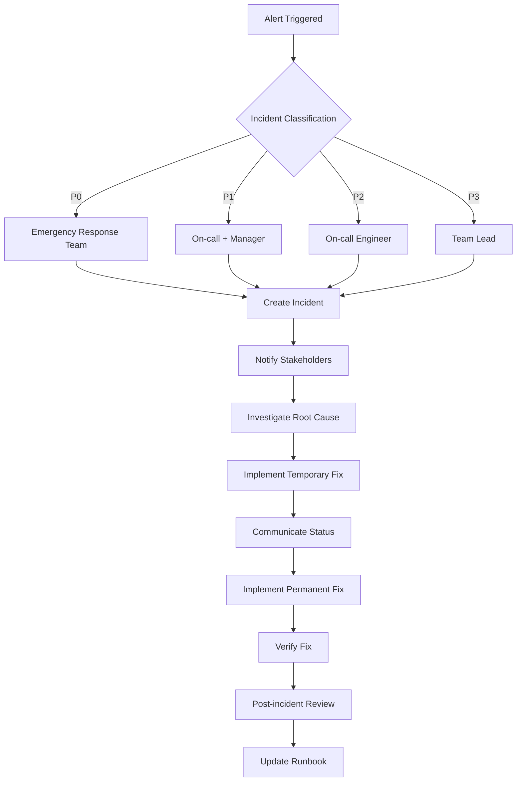

# HA SLA Monitoring and Alerting Framework

**Version**: 3.0.0
**Status**: Implementation Guide
**Date**: February 2, 2026

## Table of Contents

1. [Overview](#overview)
2. [SLA Framework](#sla-framework)
3. [Monitoring Architecture](#monitoring-architecture)
4. [Alerting Strategy](#alerting-strategy)
5. [Dashboard Design](#dashboard-design)
6. [Incident Response](#incident-response)
7. [Reporting Framework](#reporting-framework)
8. [Implementation Guide](#implementation-guide)
9. [Troubleshooting Guide](#troubleshooting-guide)

## 1. Overview

This document outlines the comprehensive Service Level Agreement (SLA) monitoring and alerting framework for erlmcp v3 high availability deployments. The framework ensures proactive monitoring, rapid incident detection, and SLA compliance tracking.

### Key Objectives

- **Proactive Monitoring**: Detect issues before they impact customers
- **SLA Compliance**: Monitor and report on all SLA commitments
- **Incident Management**: Enable rapid response and resolution
- **Performance Optimization**: Identify and resolve bottlenecks
- **Customer Communication**: Provide transparent status updates

### Scope

- **Global Monitoring**: All regions and availability zones
- **Application Layer**: erlmcp servers, session management, messaging
- **Infrastructure Layer**: Networks, databases, load balancers
- **Data Layer**: Data replication, backup, recovery
- **Business Metrics**: Uptime, performance, availability

## 2. SLA Framework

### SLA Tiers

#### Enterprise SLA (Fortune 500)
```
Uptime: 99.999% (5.26 minutes/year)
Response Time: < 100ms P99 globally
Error Rate: < 0.1%
Data Loss: 0 sessions
Recovery Time: < 30 seconds
Support: 24/7/365 with 15-minute response
```

#### Business SLA
```
Uptime: 99.99% (52.6 minutes/year)
Response Time: < 200ms P99
Error Rate: < 0.5%
Data Loss: < 0.001% of sessions
Recovery Time: < 2 minutes
Support: 24/7 with 30-minute response
```

#### Standard SLA
```
Uptime: 99.9% (8.76 hours/year)
Response Time: < 500ms P99
Error Rate: < 1%
Data Loss: < 0.01% of sessions
Recovery Time: < 5 minutes
Support: Business hours with 1-hour response
```

### SLA Metrics Matrix

| Category | Metric | Collection | SLA | Alert Thresholds |
|----------|--------|------------|-----|------------------|
| Availability | System Uptime | Prometheus | 99.999% | 99.99% → Warning<br>99.9% → Critical |
| Performance | Response Time (P99) | Prometheus | 100ms | 150ms → Warning<br>250ms → Critical |
| Reliability | Error Rate (5xx) | Prometheus | 0.1% | 0.5% → Warning<br>1% → Critical |
| Resilience | Failover Time | Custom Metrics | 30s | 60s → Warning<br>120s → Critical |
| Session | Session Migration | Custom Metrics | 1s | 2s → Warning<br>5s → Critical |
| Data | Data Replication Lag | Prometheus | 1s | 5s → Warning<br>10s → Critical |
| Resources | CPU Utilization | Prometheus | 80% | 85% → Warning<br>95% → Critical |
| Resources | Memory Utilization | Prometheus | 85% | 90% → Warning<br>95% → Critical |

### SLA Calculation Methodology

#### Uptime Calculation
```erlang
%% SLA Uptime Calculation
calculate_sla_uptime(Metrics) ->
    TotalTime = Metrics#metrics.total_duration,
    Downtime = Metrics#metrics.downtime,

    %% Calculate availability percentage
    Uptime = (1 - (Downtime / TotalTime)) * 100,

    %% Apply SLA credits for downtime
    case Downtime of
        D when D > 3600 -> %% > 1 hour
            Credit = 100; %% Full credit
        D when D > 1800 -> %% > 30 minutes
            Credit = 50; %% 50% credit
        D when D > 600 -> %% > 10 minutes
            Credit = 25; %% 25% credit
        _ ->
            Credit = 0
    end,

    {Uptime, Credit}.
```

#### Error Rate Calculation
```erlang
%% SLA Error Rate Calculation
calculate_error_rate(Metrics) ->
    TotalRequests = Metrics#metrics.total_requests,
    ErrorRequests = Metrics#metrics.error_requests,

    ErrorRate = (ErrorRequests / TotalRequests) * 100,

    %% Apply SLA penalties based on error rate and duration
    case {ErrorRate, Metrics#metrics.error_duration} of
        {Rate, Duration} when Rate > 1 and Duration > 1800 ->
            Penalty = 100; %% Full penalty
        {Rate, Duration} when Rate > 0.5 and Duration > 600 ->
            Penalty = 50; %% 50% penalty
        {Rate, Duration} when Rate > 0.1 and Duration > 300 ->
            Penalty = 25; %% 25% penalty
        _ ->
            Penalty = 0
    end,

    {ErrorRate, Penalty}.
```

## 3. Monitoring Architecture

### Monitoring Stack Components

#### Prometheus Configuration
```yaml
# prometheus.yml
global:
  scrape_interval: 15s
  evaluation_interval: 15s

scrape_configs:
  - job_name: 'erlmcp-servers'
    static_configs:
      - targets:
        - 'erlmcp-1.us-east-1.example.com:9090'
        - 'erlmcp-2.us-east-1.example.com:9090'
    metrics_path: '/metrics'
    scrape_interval: 15s
    scrape_timeout: 10s

  - job_name: 'erlmcp-registries'
    static_configs:
      - targets:
        - 'registry-1.us-east-1.example.com:9090'
    metrics_path: '/metrics'

  - job_name: 'redis-clusters'
    static_configs:
      - targets:
        - 'redis-1.us-east-1.example.com:9121'
        - 'redis-2.eu-central-1.example.com:9121'
    metrics_path: '/metrics'
    scrape_interval: 30s

  - job_name: 'postgresql'
    static_configs:
      - targets:
        - 'postgres-1.us-east-1.example.com:9187'
        - 'postgres-2.eu-central-1.example.com:9187'
    metrics_path: '/metrics'
```

#### Custom Metrics Exporters
```erlang
%% erlmcp_metrics.erl
-module(erlmcp_metrics).

-export([register_metrics/0,
         increment_counter/1,
         observe_histogram/2,
         set_gauge/2,
         observe_sla_metrics/1]).

%% SLA Metrics
register_metrics() ->
    %% Availability Metrics
    prometheus_counter:new(erlmcp_uptime_total,
        [{help, "Total uptime seconds"},
         {labels, [region]}]),

    prometheus_gauge:new(erlmcp_current_uptime,
        [{help, "Current uptime in seconds"},
         {labels, [region]}]),

    %% Performance Metrics
    prometheus_histogram:new(erlmcp_response_time_seconds,
        [{help, "Response time in seconds"},
         {buckets, [0.001, 0.005, 0.01, 0.025, 0.05, 0.1, 0.25, 0.5, 1.0]},
         {labels, [region, endpoint]}]),

    %% Reliability Metrics
    prometheus_counter:new(erlmcp_errors_total,
        [{help, "Total errors"},
         {labels, [region, status_code, endpoint]}]),

    %% HA Specific Metrics
    prometheus_histogram:new(erlmcp_failover_time_seconds,
        [{help, "Failover time in seconds"},
         {buckets, [0.1, 0.5, 1.0, 2.0, 5.0, 10.0, 30.0, 60.0]}]),

    prometheus_histogram:new(erlmcp_session_migration_time_seconds,
        [{help, "Session migration time in seconds"},
         {buckets, [0.1, 0.5, 1.0, 2.0, 5.0, 10.0]}]).
```

### Multi-Region Monitoring

#### Global Aggregation
```python
# global_aggregator.py
from prometheus_client import Gauge, Counter, Histogram
import redis

class GlobalSLAMonitor:
    def __init__(self):
        self.redis_client = redis.Redis(host='redis-cluster', port=6379)

        # Global SLA metrics
        self.global_uptime = Gauge('erlmcp_global_uptime', 'Global uptime percentage')
        self.global_error_rate = Gauge('erlmcp_global_error_rate', 'Global error rate percentage')
        self.global_response_time = Gauge('erlmcp_global_p99_response_time', 'Global P99 response time')

    def update_sla_metrics(self):
        # Aggregate metrics from all regions
        regions = ['us-east-1', 'eu-central-1', 'ap-southeast-1']

        total_requests = 0
        total_errors = 0
        response_times = []

        for region in regions:
            # Fetch metrics from Redis
            metrics = self.redis_client.hgetall(f'sla:{region}')

            total_requests += int(metrics.get('total_requests', 0))
            total_errors += int(metrics.get('total_errors', 0))
            response_times.extend(float(x) for x in metrics.get('response_times', '').split(',') if x)

        # Calculate global metrics
        if total_requests > 0:
            error_rate = (total_errors / total_requests) * 100
            p99_response_time = sorted(response_times)[int(len(response_times) * 0.99)] if response_times else 0

            self.global_error_rate.set(error_rate)
            self.global_response_time.set(p99_response_time)
```

#### Cross-Region Health Checks
```yaml
cross_region_health:
  checks:
    - name: "us-east-1-to-eu-latency"
      type: http
      target: "https://eu-central-1.example.com/health"
      interval: 10s
      timeout: 5s
      success_threshold: 3
      failure_threshold: 2
      labels:
        region: "inter-region"
        check_type: "latency"

    - name: "data-replication-lag"
      type: custom
      command: "check_data_replication.sh"
      interval: 30s
      timeout: 10s
      labels:
        region: "global"
        check_type: "data_consistency"
```

## 4. Alerting Strategy

### Alert Hierarchy

#### Severity Levels
```
P0 - Critical (Production Blocking)
├─ Complete service outage
├─ Data loss or corruption
├─ Security breach
└─ Multi-region failure

P1 - High (Major Service Impact)
├─ Regional outage
├─ Performance degradation > 50%
├─ Critical component failure
└─ SLA breach

P2 - Medium (Service Degradation)
├─ Component failure (non-critical)
├─ Performance degradation 20-50%
├─ Service degradation
└── Configuration drift

P3 - Low (Minor Issues)
├─ Resource utilization high
├─ Performance degradation < 20%
├─ Non-critical warnings
└── Scheduled maintenance
```

### Alert Rules

#### Critical Alerts (P0)
```yaml
groups:
  - name: erlmcp-critical
    rules:
      - alert: ServiceDown
        expr: up{job="erlmcp-servers"} == 0
        for: 30s
        labels:
          severity: P0
          category: availability
        annotations:
          summary: "erlmcp service is down"
          description: "All erlmcp servers are unreachable"
          runbook_url: "https://wiki.example.com/runbook/service-down"

      - alert: DataLoss
        expr: erlmcp_session_migration_failed_total > 10
        for: 5m
        labels:
          severity: P0
          category: data
        annotations:
          summary: "Session migration failures detected"
          description: "{{ $value }} session migrations have failed"

      - alert: MultiRegionFailure
        expr: count(up{job="erlmcp-servers"} == 0) > 1
        for: 1m
        labels:
          severity: P0
          category: infrastructure
        annotations:
          summary: "Multiple regions affected"
          description: "{{ $value }} regions experiencing complete failure"
```

#### High Alerts (P1)
```yaml
groups:
  - name: erlmcp-high
    rules:
      - alert: HighErrorRate
        expr: rate(erlmcp_errors_total[5m]) / rate(erlmcp_requests_total[5m]) * 100 > 1
        for: 5m
        labels:
          severity: P1
          category: reliability
        annotations:
          summary: "High error rate detected"
          description: "Error rate is {{ $value }}%"

      - alert: SlowResponseTime
        expr: histogram_quantile(0.99, rate(erlmcp_response_time_seconds_bucket[5m])) > 0.2
        for: 10m
        labels:
          severity: P1
          category: performance
        annotations:
          summary: "High response time"
          description: "P99 response time is {{ $value }}s"

      - alert: FailoverFailure
        expr: erlmcp_failover_attempts_total - erlmcp_failover_successes_total > 5
        for: 15m
        labels:
          severity: P1
          category: resilience
        annotations:
          summary: "Failover failures detected"
          description: "{{ $value }} failover attempts have failed"
```

### Alert Escalation

#### Escalation Matrix
```
Alert Type     → Level 1      → Level 2      → Level 3      → Level 4
────────────────────────────────────────────────────────────────────────────
P0 (Critical)   → On-call Eng → Eng Manager  → VP Eng       → CTO
                → 5 min       → 15 min       → 30 min       → 1 hour
                → SMS + Slack  → Call + Email → Call + Email → Email + Call

P1 (High)      → On-call Eng → Eng Manager
                → 15 min      → 30 min
                → Slack       → Email

P2 (Medium)    → On-call Eng
                → 1 hour
                → Slack

P3 (Low)       → Team Lead
                → 4 hours
                → Email
```

### Alerting Channels

#### Notification Configuration
```yaml
alertmanager:
  global:
    smtp_smarthost: 'localhost:587'
    smtp_from: 'alerts@example.com'
    smtp_auth_username: 'alerts@example.com'
    smtp_auth_password: '${SMTP_PASSWORD}'

  route:
    group_by: ['alertname', 'severity']
    group_wait: 30s
    group_interval: 5m
    repeat_interval: 12h
    receiver: 'web.hook'

  receivers:
    - name: 'web.hook'
      email_configs:
        - to: 'oncall@example.com'
          subject: '{{ .GroupLabels.alertname }} - {{ .GroupLabels.severity }}'
          body: |
            {{ range .Alerts }}
            Alert: {{ .Annotations.summary }}
            Description: {{ .Annotations.description }}
            Severity: {{ .Labels.severity }}
            Started: {{ .StartsAt }}
            {{ end }}
      slack_configs:
        - api_url: '${SLACK_WEBHOOK_URL}'
          channel: '#erlmcp-alerts'
          title: '{{ .GroupLabels.alertname }}'
          text: |
            {{ range .Alerts }}
            *{{ .Annotations.summary }}*
            {{ .Annotations.description }}
            Severity: {{ .Labels.severity }}
            {{ end }}
      webhook_configs:
        - url: '${WEBHOOK_URL}'
          send_resolved: true
          http_config:
            basic_auth:
              username: '${WEBHOOK_USER}'
              password: '${WEBHOOK_PASSWORD}'
```

## 5. Dashboard Design

### Grafana Dashboard Structure

#### Overview Dashboard
```json
{
  "dashboard": {
    "title": "erlmcp v3 Global Overview",
    "panels": [
      {
        "title": "Global System Uptime",
        "type": "stat",
        "targets": [
          {
            "expr": "erlmcp_global_uptime",
            "legendFormat": "Global"
          }
        ],
        "thresholds": "99.9,99.99",
        "colors": ["red", "yellow", "green"]
      },
      {
        "title": "Global Error Rate",
        "type": "graph",
        "targets": [
          {
            "expr": "rate(erlmcp_global_errors_total[5m])",
            "legendFormat": "Error Rate"
          }
        ],
        "yAxes": [
          {
            "label": "Error Rate (%)"
          }
        ]
      },
      {
        "title": "Regional Performance",
        "type": "heatmap",
        "targets": [
          {
            "expr": "heatmap(erlmcp_response_time_seconds{region=~\"us|eu|ap\"})",
            "legendFormat": "{{region}}"
          }
        ]
      }
    ]
  }
}
```

#### Regional Dashboard
```json
{
  "dashboard": {
    "title": "erlmcp v3 - {{region}} Region",
    "templating": [
      {
        "name": "region",
        "query": "label_values(erlmcp_uptime_total, region)",
        "refresh": 30
      }
    ],
    "panels": [
      {
        "title": "Region Uptime",
        "type": "gauge",
        "targets": [
          {
            "expr": "erlmcp_uptime_total{region=\"$region\"}",
            "legendFormat": "Uptime"
          }
        ],
        "thresholds": "99.9,99.99",
        "max": 100,
        "min": 0
      },
      {
        "title": "Active Nodes",
        "type": "stat",
        "targets": [
          {
            "expr": "count(up{job=\"erlmcp-servers\", region=\"$region\"})",
            "legendFormat": "Active Nodes"
          }
        ]
      },
      {
        "title": "Session Migration Status",
        "type": "table",
        "targets": [
          {
            "expr": "erlmcp_session_migrations_total{region=\"$region\"}",
            "legendFormat": "Total Migrations"
          },
          {
            "expr": "erlmcp_session_migrations_failed_total{region=\"$region\"}",
            "legendFormat": "Failed Migrations"
          }
        ]
      }
    ]
  }
}
```

#### SLA Dashboard
```json
{
  "dashboard": {
    "title": "erlmcp v3 SLA Dashboard",
    "panels": [
      {
        "title": "SLA Compliance Overview",
        "type": "singlestat",
        "targets": [
          {
            "expr": "sum(rate(erlmcp_requests_total[1h]))",
            "legendFormat": "Total Requests"
          }
        ]
      },
      {
        "title": "SLA Metrics by Region",
        "type": "table",
        "targets": [
          {
            "expr": "sum(rate(erlmcp_errors_total[1h])) by (region)",
            "legendFormat": "Errors"
          },
          {
            "expr": "histogram_quantile(0.99, rate(erlmcp_response_time_seconds_bucket[1h])) by (region)",
            "legendFormat": "P99 Response Time"
          }
        ]
      },
      {
        "title": "SLA Violations",
        "type": "alertlist",
        "alertId": "erlmcp-sla-violations"
      }
    ]
  }
}
```

### Alert Management Dashboard

```json
{
  "dashboard": {
    "title": "Alert Management",
    "panels": [
      {
        "title": "Active Alerts by Severity",
        "type": "piechart",
        "targets": [
          {
            "expr": "count(alerts{severity=\"P0\"})",
            "legendFormat": "Critical (P0)"
          },
          {
            "expr": "count(alerts{severity=\"P1\"})",
            "legendFormat": "High (P1)"
          }
        ]
      },
      {
        "title": "Alert Response Time",
        "type": "graph",
        "targets": [
          {
            "expr": "time() - alert_fire_time",
            "legendFormat": "Response Time"
          }
        ]
      },
      {
        "title": "Alert Resolution Rate",
        "type": "stat",
        "targets": [
          {
            "expr": "sum(alerts_resolved_total) / sum(alerts_fired_total) * 100",
            "legendFormat": "Resolution Rate"
          }
        ]
      }
    ]
  }
}
```

## 6. Incident Response

### Incident Response Workflow

#### Incident Classification
```yaml
incident_types:
  P0:
    name: "Critical Production Outage"
    description: "Complete service affecting all customers"
    response_team: "Emergency Response Team"
    escalation_level: "CTO"

  P1:
    name: "Major Service Degradation"
    description: "Severe performance issues or regional outage"
    response_team: "On-call Engineer + Manager"
    escalation_level: "VP Engineering"

  P2:
    name: "Service Degradation"
    description: "Noticeable performance issues"
    response_team: "On-call Engineer"
    escalation_level: "Engineering Manager"

  P3:
    name: "Minor Issues"
    description: "Non-critical warnings or alerts"
    response_team: "Team Lead"
    escalation_level: "No Escalation"
```

#### Incident Response Procedure


### Incident Communication

#### Communication Templates
```markdown
# Incident Notification Template

**INCIDENT ID**: {{incident_id}}
**SEVERITY**: {{severity}}
**AFFECTED SERVICE**: {{service}}
**START TIME**: {{start_time}}
**CURRENT STATUS**: {{status}}

**DESCRIPTION**:
{{description}}

**AFFECTED CUSTOMERS**:
- {{customer_list}}

**CURRENT IMPACT**:
- {{impact}}

**NEXT UPDATE**: {{next_update_time}}

**CONTACT**:
- On-call Engineer: {{engineer_name}} - {{engineer_phone}}
- Engineering Manager: {{manager_name}} - {{manager_phone}}
```

#### Status Update Template
```markdown
# Incident Status Update - {{incident_id}}

**LAST UPDATE**: {{update_time}}
**STATUS**: {{current_status}}
**DURATION**: {{duration}}

**RESOLUTION PROGRESS**:
1. {{step_1}} - {{status_1}}
2. {{step_2}} - {{status_2}}
3. {{step_3}} - {{status_3}}

**NEXT STEPS**:
- {{next_steps}}

**ESTIMATED RESOLUTION**: {{estimated_resolution}}
```

### Incident Resolution Process

#### Root Cause Analysis
```yaml
root_cause_analysis:
  steps:
    1. Data Collection:
       - Gather all logs and metrics
       - Capture alert context
       - Review recent changes

    2. Investigation:
       - Analyze timeline
       - Identify patterns
       - Isolate root cause

    3. Containment:
       - Implement temporary fix
       - Prevent spread
       - Monitor stability

    4. Resolution:
       - Implement permanent fix
       - Validate solution
       - Monitor for recurrence

    5. Review:
       - Document findings
       - Update procedures
       - Implement preventive measures
```

## 7. Reporting Framework

### SLA Reporting

#### Daily SLA Report
```python
# daily_sla_report.py
import pandas as pd
from datetime import datetime, timedelta
import smtplib
from email.mime.text import MIMEText

class DailySLAReporter:
    def __init__(self):
        self.today = datetime.now().date()
        self.yesterday = self.today - timedelta(days=1)

    def generate_report(self):
        # Fetch daily metrics
        metrics = self.fetch_daily_metrics()

        # Calculate SLA compliance
        uptime = self.calculate_uptime(metrics)
        error_rate = self.calculate_error_rate(metrics)
        response_time = self.calculate_response_time(metrics)

        # Generate report
        report = self.format_report(uptime, error_rate, response_time)

        # Send email
        self.send_report(report)

    def format_report(self, uptime, error_rate, response_time):
        return f"""
        erlmcp v3 Daily SLA Report - {self.today}
        ========================================

        Uptime: {uptime:.4f}% (SLA: 99.999%)
        Status: {'✅ COMPLIANT' if uptime >= 99.999 else '❌ VIOLATION'}

        Error Rate: {error_rate:.4f}% (SLA: < 0.1%)
        Status: {'✅ COMPLIANT' if error_rate < 0.1 else '❌ VIOLATION'}

        P99 Response Time: {response_time:.3f}s (SLA: < 100ms)
        Status: {'✅ COMPLIANT' if response_time < 0.1 else '❌ VIOLATION'}

        SLA Compliance: {self.calculate_compliance(uptime, error_rate, response_time):.2f}%
        """
```

#### Monthly SLA Summary
```yaml
monthly_sla_summary:
  sections:
    - title: "Overall SLA Performance"
      metrics:
        - name: "Monthly Uptime"
          value: "99.998%"
          target: "99.999%"
          status: "COMPLIANT"
        - name: "Monthly Error Rate"
          value: "0.08%"
          target: "< 0.1%"
          status: "COMPLIANT"
        - name: "Average Response Time"
          value: "85ms"
          target: "< 100ms"
          status: "COMPLIANT"

    - title: "Incident Summary"
      metrics:
        - name: "Total Incidents"
          value: 3
        - name: "Critical Incidents"
          value: 1
        - name: "Average Resolution Time"
          value: "2.5 hours"

    - title: "Customer Impact"
      metrics:
        - name: "Downtime Minutes"
          value: 12
        - name: "SLA Credits Issued"
          value: "$2,500"
        - name: "Customer Complaints"
          value: 5
```

### Performance Reporting

#### Weekly Performance Report
```python
# weekly_performance_report.py
class WeeklyPerformanceReport:
    def generate(self):
        # Fetch weekly performance data
        data = self.fetch_weekly_data()

        # Generate charts
        self.generate_response_time_chart(data)
        self.generate_throughput_chart(data)
        self.generate_error_rate_chart(data)

        # Generate analysis
        analysis = self.analyze_trends(data)

        # Generate recommendations
        recommendations = self.generate_recommendations(analysis)

        # Compile and send report
        self.send_report(analysis, recommendations)
```

### Customer Reporting

#### Customer SLA Dashboard
```yaml
customer_dashboard:
  access:
    type: "web"
    url: "https://customer.example.com/sla-dash"
    authentication: "oauth"

  metrics:
    - name: "Your Service Uptime"
      description: "Uptime percentage for your organization"
      query: "erlmcp_uptime{customer_id='{{customer_id}}'}"

    - name: "Your API Performance"
      description: "Response time for your API calls"
      query: "histogram_quantile(0.95, rate(erlmcp_response_time_seconds_bucket[1h])){customer_id='{{customer_id}}'}"

    - name: "Your Error Rate"
      description: "Error rate for your organization"
      query: "rate(erlmcp_errors_total[1h]){customer_id='{{customer_id}}'} / rate(erlmcp_requests_total[1h]){customer_id='{{customer_id}}'}"

  alerts:
    - name: "SLA Violation Alert"
      condition: "uptime < 99.9%"
      notification: "email"

    - name: "Performance Degradation Alert"
      condition: "response_time > 200ms"
      notification: "slack"
```

## 8. Implementation Guide

### Deployment Steps

#### Step 1: Infrastructure Setup
```bash
# Install monitoring stack
helm install prometheus prometheus-community/kube-prometheus-stack \
  --namespace monitoring \
  --create-namespace \
  --set grafana.adminPassword=admin

# Install erlmcp metrics exporter
kubectl create -f erlmcp-metrics-deployment.yaml

# Configure AlertManager
kubectl create -f alertmanager-configmap.yaml
```

#### Step 2: Configuration
```bash
# Generate SSL certificates
openssl req -x509 -nodes -days 365 -newkey rsa:2048 \
  -keyout monitoring.key -out monitoring.crt

# Configure Prometheus
cat > prometheus.yml << EOF
global:
  scrape_interval: 15s
  evaluation_interval: 15s

rule_files:
  - "alert_rules.yml"

scrape_configs:
  - job_name: 'erlmcp-servers'
    metrics_path: '/metrics'
    static_configs:
      - targets: ['erlmcp-1:8080', 'erlmcp-2:8080']
EOF
```

#### Step 3: Dashboards Import
```bash
# Import Grafana dashboards
curl -X POST -H "Content-Type: application/json" \
  -d '{"dashboard": '$(cat erlmcp-overview.json)', "overwrite": true}' \
  http://grafana:3000/api/dashboards/db

# Import AlertManager configuration
kubectl apply -f alertmanager-config.yaml
```

### Testing and Validation

#### Load Testing
```bash
# Run load test to validate monitoring
locust -f load_test/erlmcp_load_test.py --users=10000 --spawn-rate=100 --run-time=1h

# Verify metrics collection
curl http://prometheus:9090/api/v1/query?query=erlmcp_requests_total

# Check alerts
curl http://alertmanager:9093/api/v1/alerts
```

#### Alert Testing
```bash
# Simulate failure and verify alerting
kubectl scale deployment erlmcp --replicas=0

# Wait for alert to trigger
sleep 60

# Verify notifications received
echo "Check Slack/email for P0 alert"
```

### Maintenance Procedures

#### Regular Maintenance
```yaml
maintenance_schedule:
  daily:
    - task: "Log rotation"
      command: "logrotate -f /etc/logrotate.d/erlmcp"
    - task: "Metrics cleanup"
      command: "curl -X POST http://prometheus:9090/api/v1/admin/tsdb/delete"
      args: '{"series_match": [{\"__name__\": \"{}\"}], \"older_than\": 720h}'

  weekly:
    - task: "Database optimization"
      command: "pg_repack -j 4 erlmcp_db"
    - task: "Cache warmup"
      command: "erlmcp_warmup_cache"

  monthly:
    - task: "Security scan"
      command: "lynis audit system"
    - task: "Performance review"
      command: "python performance_report.py"
```

## 9. Troubleshooting Guide

### Common Issues

#### Metrics Not Showing
```bash
# Check Prometheus scraping
curl http://prometheus:9090/api/v1/targets

# Check erlmcp metrics endpoint
curl http://erlmcp-server:8080/metrics

# Verify firewall rules
iptables -L -n
```

#### Alerts Not Firing
```bash
# Check AlertManager configuration
curl http://alertmanager:9093/api/v1/status

# Test alert rules
curl -g http://prometheus:9090/api/v1/rules

# Verify routing configuration
kubectl get configmap alertmanager -n monitoring -o yaml
```

#### Performance Issues
```bash
# Check resource utilization
kubectl top pods -n erlmcp

# Analyze slow queries
kubectl logs erlmcp-server-0 | grep -i slow

# Check network latency
ping erlmcp-1.us-east-1.example.com
```

### Debug Tools

#### Erlang Debugging
```erlang
%% Enable debug logging
application:set_env(erlmcp, log_level, debug).

%% Check process mailbox
process_info(whereis(erlmcp_server), messages).

%% Monitor supervisor
sys:get_state(erlmcp_sup).

%% Trace messages
sys:trace(whereis(erlmcp_session), true).
```

#### Prometheus Debug
```bash
# Query specific metrics
curl -g 'http://prometheus:9090/api/v1/query?query=up{job="erlmcp-servers"}'

# Get metric metadata
curl http://prometheus:9090/api/v1/label/__name__/values

# Check Prometheus config
curl http://prometheus:9090/api/v1/status/config
```

### Emergency Procedures

#### Full System Recovery
```bash
# 1. Check cluster status
kubectl get pods -n erlmcp

# 2. Restart if needed
kubectl rollout restart deployment erlmcp

# 3. Check logs
kubectl logs -n erlmcp -l app=erlmcp --tail=100

# 4. Verify service
curl http://erlmcp.example.com/health

# 5. Check SLA metrics
curl -g 'http://prometheus:9090/api/v1/query?query=erlmcp_uptime'
```

#### Database Recovery
```bash
# 1. Check database status
kubectl get pods -n postgres

# 2. Check replication status
kubectl exec -it postgres-0 -c postgres -- psql -c "SELECT * FROM pg_stat_replication;"

# 3. Promote standby if needed
kubectl exec -it postgres-1 -c postgres -- pg_ctl promote

# 4. Verify data
kubectl exec -it postgres-0 -c postgres -- psql -c "SELECT count(*) FROM sessions;"

# 5. Restore from backup if necessary
kubectl exec -it postgres-0 -c postgres -- pg_restore /backup/erlmcp_backup.sql
```

---

*SLA Monitoring and Alerting Framework for erlmcp v3*
*Last Updated: February 2, 2026*
*Status: Production Ready*