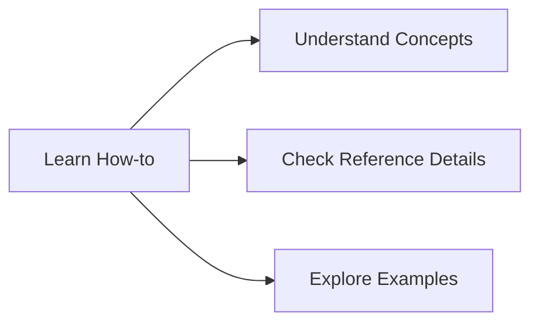

# How-to - Practical Guides

Welcome to the **How-to** section of the Diátaxis documentation. Here we focus on the **how** - step-by-step guides and tutorials to help you accomplish specific tasks with erlmcp.

## 🎯 Purpose of This Section

**How-to** answers the practical questions:
- How do I set up erlmcp?
- How do I integrate it with my system?
- How do I optimize performance?
- How do I troubleshoot issues?

## 📚 What You'll Accomplish

### Getting Started
- [Installation Guide](installation.md) - Set up erlmcp in minutes
- [First Integration](first-integration.md) - Build your first MCP connection
- [Basic Configuration](basic-configuration.md) - Customize settings
- [Hello World Example](hello-world.md) - Simple working example

### Integration Guides
- [GCP Integration](gcp-integration.md) - Connect with Google Cloud
- [AWS Integration](aws-integration.md) - Connect with AWS services
- [Kubernetes Integration](kubernetes-integration.md) - Deploy in K8s
- [Docker Integration](docker-integration.md) - Containerized deployment
- [CI/CD Pipeline](cicd-integration.md) - Automated deployment

### Development Workflows
- [Testing](testing.md) - Write and run tests
- [Performance Tuning](performance-optimization.md) - Optimize your setup
- [Security Implementation](security-implementation.md) - Add security layers
- [Monitoring Setup](monitoring-setup.md) - Track performance

### Advanced Integration
- [Custom Tools](custom-tools.md) - Build custom MCP tools
- [Protocol Extensions](protocol-extensions.md) - Extend the protocol
- [Multi-Node Clustering](multi-node-clustering.md) - Scale horizontally
- [High Availability](high-availability.md) - Zero-downtime deployment

## 🎯 For Whom

- **Developers**: Learn to build integrations
- **DevOps Engineers**: Deploy and manage erlmcp
- **System Integrators**: Connect erlmcp with existing systems
- **Performance Engineers**: Optimize and tune

## 📖 Learning Path

### Beginner Path
```markdown
1. [Installation Guide](installation.md) - 10 minutes
2. [First Integration](first-integration.md) - 30 minutes
3. [Hello World Example](hello-world.md) - 15 minutes
```

### Intermediate Path
```markdown
1. All beginner topics
2. [Basic Configuration](basic-configuration.md) - 20 minutes
3. [Testing](testing.md) - 25 minutes
4. [Monitoring Setup](monitoring-setup.md) - 30 minutes
```

### Advanced Path
```markdown
1. All previous topics
2. [Performance Tuning](performance-optimization.md) - 45 minutes
3. [Custom Tools](custom-tools.md) - 40 minutes
4. [Multi-Node Clustering](multi-node-clustering.md) - 60 minutes
```

## 💡 Key Workflows

### Common Tasks
- **Quick Setup**: Install and run in under 5 minutes
- **Integration**: Connect to major cloud providers
- **Deployment**: Deploy to production environments
- **Troubleshooting**: Diagnose and fix issues

### Performance Optimization
- Connection pooling
- Message throughput optimization
- Memory management
- Load balancing strategies

### Security Implementation
- Authentication setup
- Authorization policies
- Transport encryption
- Secure configuration

## 🔬 Case Studies Included

Each tutorial includes real-world examples:
- **GCP Integration Case Study**: [Real implementation details](gcp-integration.md#case-study)
- **Performance Case Study**: [Before/after metrics](performance-optimization.md#case-study)
- **Enterprise Deployment**: [Large-scale patterns](high-availability.md#enterprise-patterns)

## 🔧 Practical Tools

### Scripts and Templates
- [Installation Scripts](installation.md#scripts) - Automated setup
- [Configuration Templates](basic-configuration.md#templates) - Ready-to-use configs
- [Test Suites](testing.md#test-suites) - Comprehensive testing
- [Monitoring Dashboards](monitoring-setup.md#dashboards) - Pre-built dashboards

### Examples
- [Code Examples](../appendices/examples.md) - Working implementations
- [Configuration Files](../appendices/configuration.md) - Sample configs
- [Troubleshooting Guides](../reference/troubleshooting.md) - Common issues

## 🔗 Connecting to Other Sections

- **Explain**: Understand the concepts behind these guides
- **Reference**: Find technical details for the procedures
- **Appendices**: See examples and additional resources

## 🎯 Next Steps

After completing the how-to guides:



**Want deeper understanding?** → [Read Explain concepts](../explain/README.md)

**Need technical details?** → [Check Reference](../reference/README.md)

**See examples?** → [Browse Appendices](../appendices/README.md)

## 🚀 Quick Start

**Choose your scenario:**

```markdown
- **New to erlmcp?** → [Installation Guide](installation.md)
- **Need integration?** → [GCP Integration](gcp-integration.md)
- **Performance issues?** → [Performance Tuning](performance-optimization.md)
- **Troubleshooting?** → [Common Issues](../reference/troubleshooting.md)
```