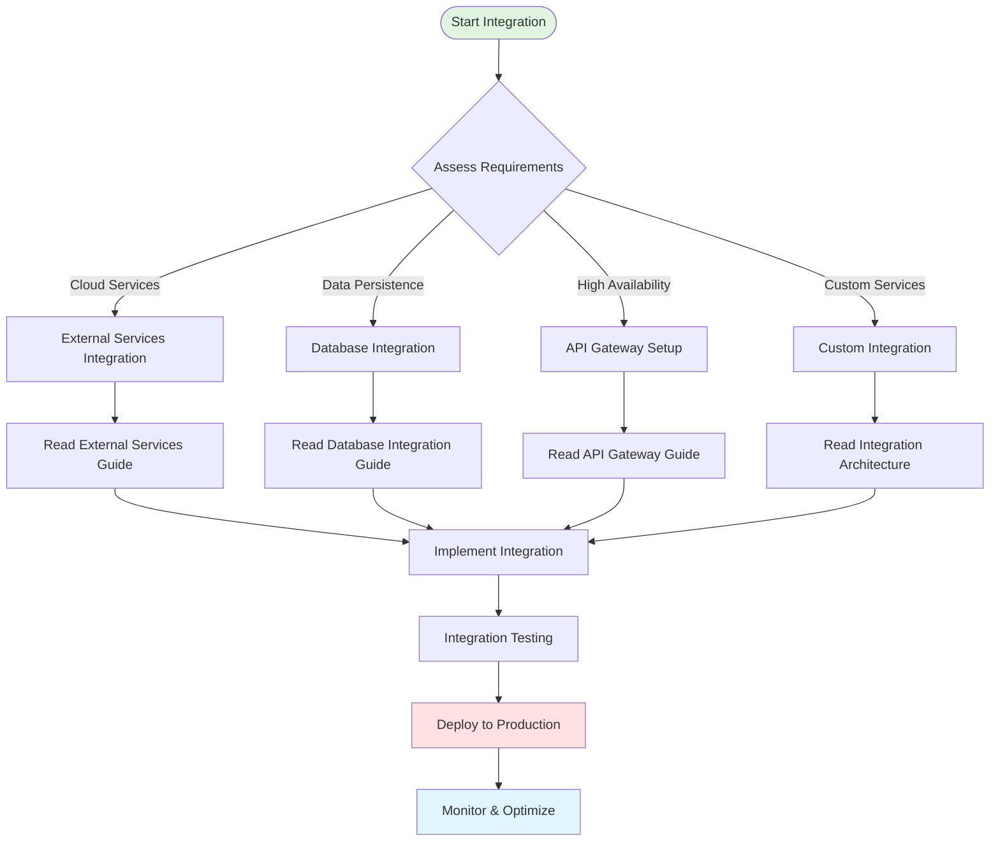
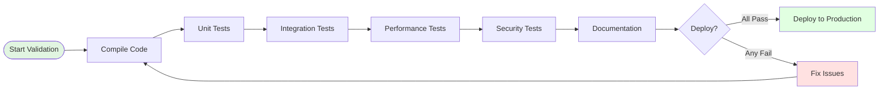

# Integration Documentation

**Version**: 2.1.0
**Last Updated**: 2026-01-31

---

## Overview

This section provides comprehensive integration guides for erlmcp, covering architecture patterns, external service integration, database strategies, API gateway configuration, and deployment patterns. Each guide includes detailed Mermaid diagrams for visual understanding.

## Available Guides

### 1. [Integration Architecture](./integration-architecture.md)
**Complete system integration architecture with visual diagrams**

- System topology and component relationships
- Data flow patterns
- Service mesh integration
- Supervision tree integration
- Transport layer integration
- Module dependency analysis

**Diagrams:**
- System integration overview
- Service mesh topology
- Data flow orchestration
- Inter-module communication

### 2. [External Services Integration](./external-services.md)
**Integrating erlmcp with external cloud services**

- Google Cloud Platform (GCP) integration
- AWS services integration
- Azure integration patterns
- HashiCorp Vault secrets management
- OpenTelemetry observability backends
- CI/CD platform integration

**Diagrams:**
- Cloud provider integration
- Secrets management flow
- Observability pipeline
- CI/CD automation flow

### 3. [Database Integration Strategies](./database.md)
**Database integration for session persistence and distributed systems**

- ETS (in-memory) session storage
- DETS (disk-based) persistence
- Mnesia (distributed) clustering
- Database connection pooling
- Data replication strategies
- Backup and recovery procedures

**Diagrams:**
- Session backend architecture
- Data persistence flow
- Mnesia cluster topology
- Replication strategies
- Backup/restore workflows

### 4. [API Gateway Integration](./api-gateway.md)
**API gateway patterns for load balancing and routing**

- Gateway architecture patterns
- Load balancing strategies
- Request routing algorithms
- Rate limiting at gateway level
- Circuit breaker patterns
- Service discovery integration

**Diagrams:**
- Gateway deployment topology
- Load balancing flow
- Request routing pipeline
- Circuit breaker state machine
- Service discovery mechanism

### 5. [Integration Patterns Reference](../archive/misc/INTEGRATION_PATTERNS.md)
**Comprehensive reference of integration patterns and best practices**

- Integration pattern catalog
- Anti-patterns to avoid
- Performance optimization techniques
- Security considerations
- Testing strategies
- Troubleshooting guides

**Diagrams:**
- Pattern classification taxonomy
- Anti-pattern detection flow
- Performance optimization flow
- Security validation layers
- Testing strategy matrix

---

## Quick Start Integration

### Step 1: Choose Integration Type



### Step 2: Basic Integration Example

**Minimal stdio integration:**
```erlang
% Start erlmcp server with stdio transport
{ok, Server} = erlmcp_server:start_link(#{
    transport => stdio,
    capabilities => #{
        tools => true,
        resources => true,
        prompts => true
    }
}).

% Register a simple tool
Tool = #mcp_tool{
    name = <<"echo">>,
    description = <<"Echo back the input text">>,
    input_schema => #{
        type => <<"object">>,
        properties => #{
            text => #{type => <<"string">>}
        },
        required => [<<"text">>]
    }
},
Handler = fun(#{<<"text">> := Text}) ->
    #{content => [#{type => text, text => Text}]}
end,
ok = erlmcp_server:add_tool(Server, Tool, Handler).
```

### Step 3: Advanced Integration with External Services

**Integrate with Google Cloud services:**
```erlang
% Configure GCP integration
{ok, Server} = erlmcp_server:start_link(#{
    transport => tcp,
    port => 8080,
    gcp_config => #{
        project_id => <<"my-project">>,
        credentials => {service_account, <<"path/to/key.json">>},
        services => [compute_engine, cloud_storage, pubsub]
    },
    capabilities => #{
        tools => true,
        resources => true,
        logging => true
    }
}).

% GCP tools automatically registered
% See examples/gcp_simulator for complete implementation
```

---

## Integration Categories

### By Transport Layer

| Transport | Use Case | Latency | Throughput | Guide |
|-----------|----------|---------|------------|-------|
| **stdio** | Local AI runtimes | <1ms | Unlimited | [Integration Architecture](./integration-architecture.md) |
| **TCP** | Network services | 1-5ms | 50K conn/node | [API Gateway](./api-gateway.md) |
| **HTTP** | REST APIs | 5-20ms | 10K req/s | [API Gateway](./api-gateway.md) |
| **WebSocket** | Real-time bidirectional | <5ms | 5K conn/node | [Integration Architecture](./integration-architecture.md) |
| **SSE** | Server notifications | <10ms | 10K conn/node | [Integration Architecture](./integration-architecture.md) |

### By Deployment Pattern

| Pattern | Complexity | Scalability | Reliability | Guide |
|---------|-----------|-------------|-------------|-------|
| **Single Node** | Low | Low | Medium | [Integration Architecture](./integration-architecture.md) |
| **Active-Passive** | Medium | Medium | High | [API Gateway](./api-gateway.md) |
| **Active-Active** | High | High | Very High | [Database](./database.md) |
| **Multi-Region** | Very High | Very High | Very High | [External Services](./external-services.md) |

### By Data Persistence

| Backend | Performance | Durability | Scale | Guide |
|---------|-------------|------------|-------|-------|
| **ETS** | Very High | Low | Single node | [Database](./database.md) |
| **DETS** | High | Medium | Single node | [Database](./database.md) |
| **Mnesia** | High | High | Cluster | [Database](./database.md) |
| **Cloud SQL** | Medium | Very High | Unlimited | [External Services](./external-services.md) |

---

## Integration Testing

### Validation Checklist

Before deploying any integration, verify:



**Required Tests:**
- ✅ Compilation: `rebar3 compile` (0 errors)
- ✅ Unit tests: `rebar3 eunit` (95%+ pass rate)
- ✅ Integration tests: `rebar3 ct` (all suites pass)
- ✅ Performance: `make benchmark-quick` (no regression)
- ✅ Security: `rebar3 dialyzer` (0 critical warnings)
- ✅ Documentation: Complete setup guide and diagrams

---

## Performance Benchmarks

### Integration Performance Baseline

| Integration Pattern | Throughput | Latency P50 | Latency P99 | Memory/Conn |
|---------------------|------------|-------------|-------------|-------------|
| **stdio (local)** | N/A | <1ms | 5ms | <1KB |
| **TCP (single node)** | 43K msg/s | 2ms | 10ms | 1.5KB |
| **HTTP (gateway)** | 12K req/s | 8ms | 25ms | 2KB |
| **WebSocket** | 5K msg/s | 3ms | 15ms | 2KB |
| **Mnesia cluster** | 30K msg/s | 5ms | 20ms | 2.5KB |

**Measurement:**
```bash
# Run integration benchmarks
./scripts/bench/run_integration_benchmarks.sh

# Expected output:
# TCP Integration: 43,000 msg/s
# HTTP Integration: 12,000 req/s
# WS Integration: 5,000 msg/s
# Mnesia Cluster: 30,000 msg/s
```

---

## Troubleshooting

### Common Integration Issues

**Issue 1: Connection Refused**
```erlang
% Symptom: {error, econnrefused}
% Cause: Transport not started or wrong port
% Solution:
1. Verify transport is started: erlmcp_transport:status()
2. Check port configuration: sys.config
3. Test connectivity: telnet localhost 8080
```

**Issue 2: Session Not Found**
```erlang
% Symptom: {error, session_not_found}
% Cause: Session backend not configured
% Solution:
1. Check session backend: erlmcp_session_backend:info()
2. Verify ETS/DETS/Mnesia tables exist
3. Check replication status in cluster
```

**Issue 3: Tool Validation Failed**
```erlang
% Symptom: {error, invalid_tool}
% Cause: Tool definition missing required fields
% Solution:
1. Verify tool has description (max 10K chars)
2. Check input_schema is valid JSON Schema
3. Test with erlmcp_test_client
```

For more troubleshooting guides, see [Integration Patterns Reference](../archive/misc/INTEGRATION_PATTERNS.md).

---

## Next Steps

1. **Read Integration Architecture** - Understand complete system design
2. **Choose Your Integration** - Select based on requirements
3. **Follow Step-by-Step Guide** - Implement integration
4. **Run Validation** - Test thoroughly before production
5. **Deploy & Monitor** - Use observability tools

---

## Support & Resources

- **Examples**: [examples/](../../examples/) - 40+ integration examples
- **Architecture**: [../architecture.md](../architecture.md) - Complete system architecture
- **API Reference**: [../api-reference.md](../api-reference.md) - Full API documentation
- **GitHub Issues**: [Report integration problems](https://github.com/your-org/erlmcp/issues)

---

**Version**: 2.1.0
**Last Updated**: 2026-01-31
