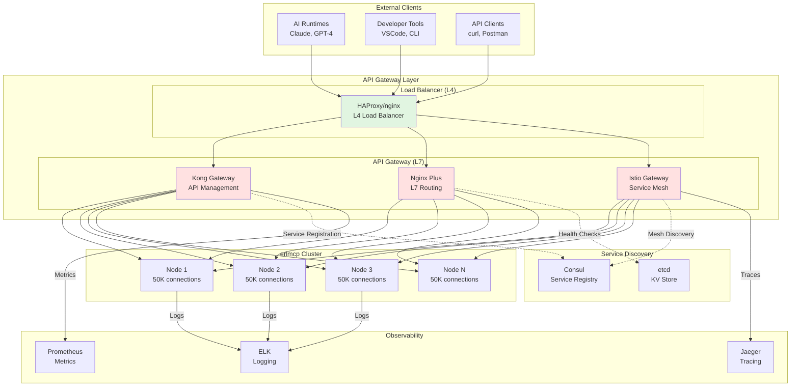
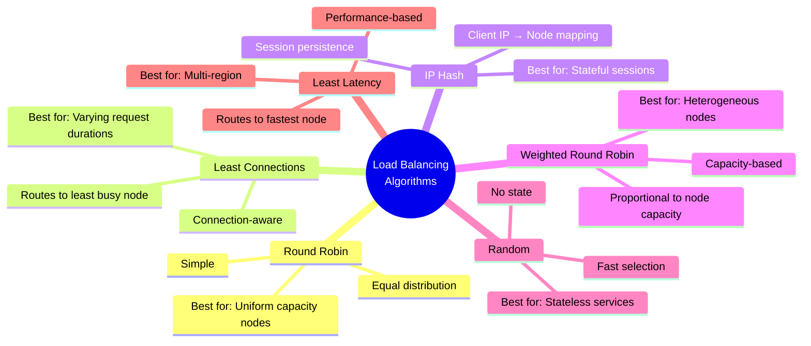
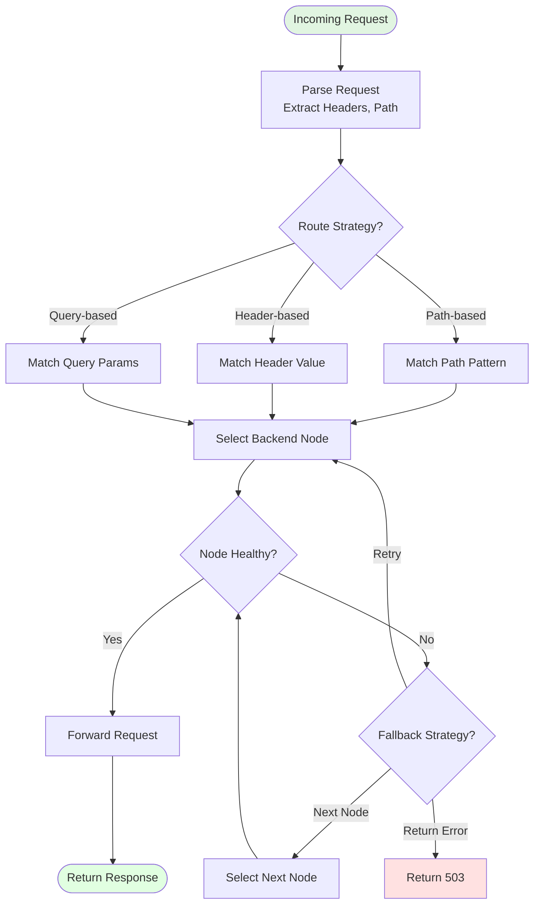
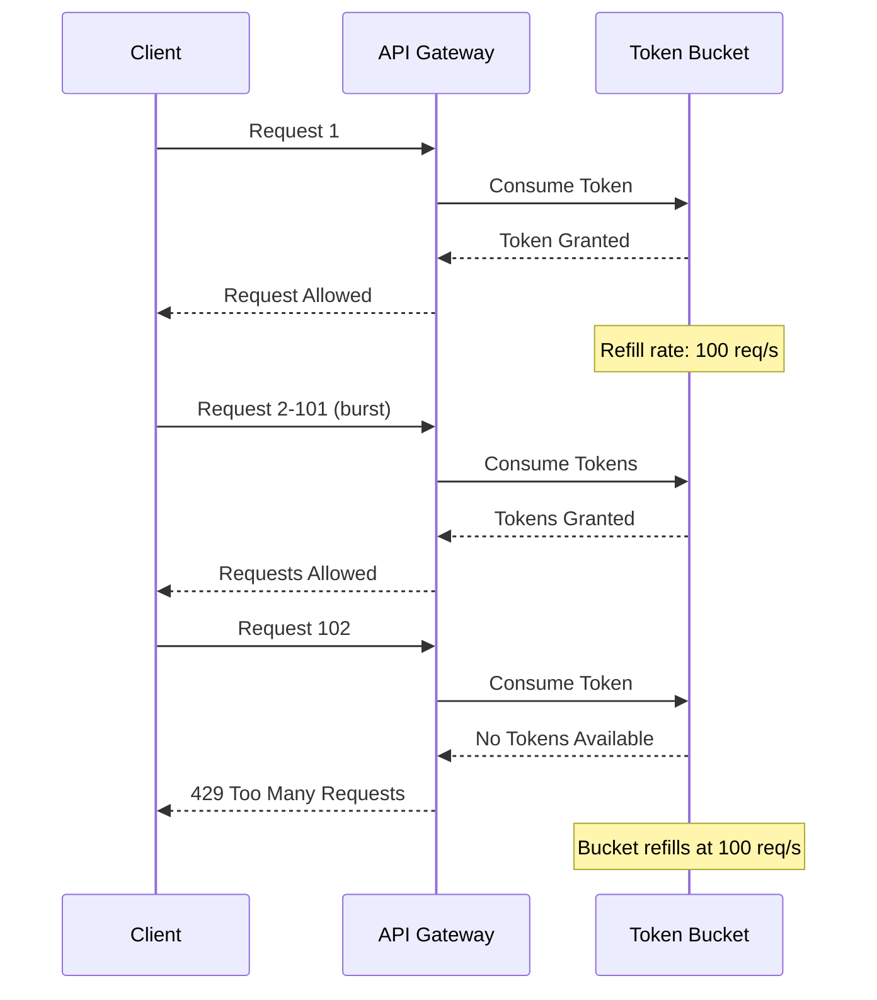
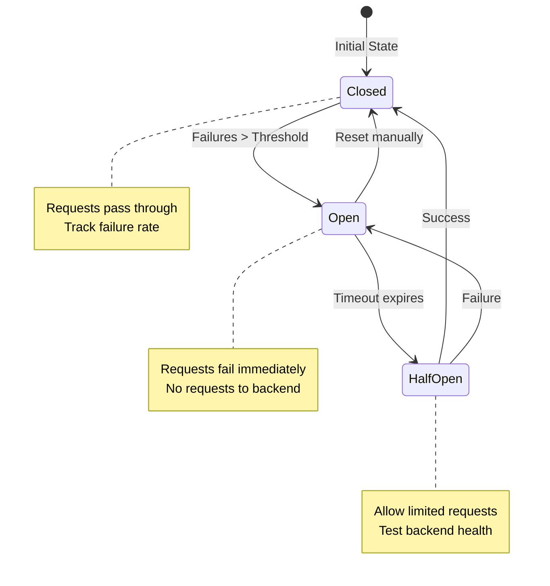
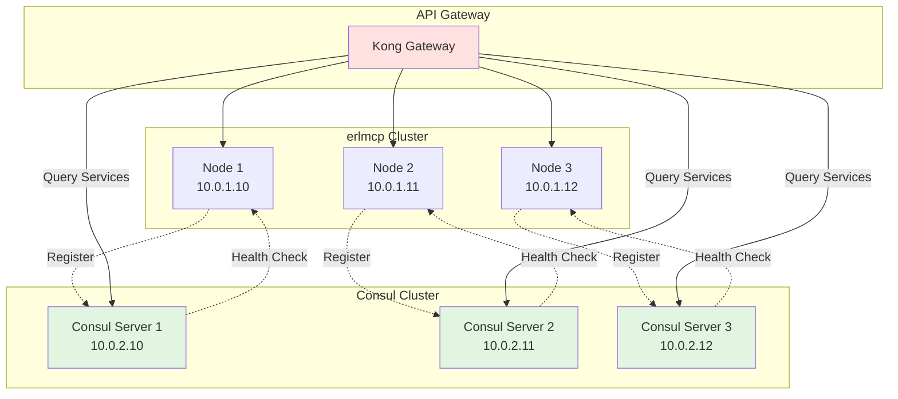
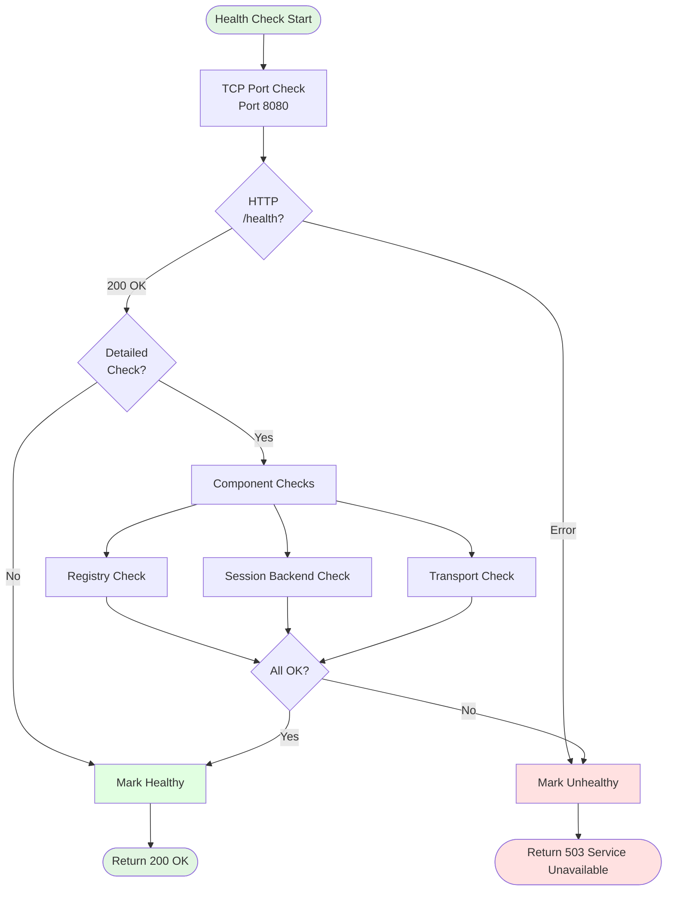

# API Gateway Integration

**Version**: 2.1.0
**Last Updated**: 2026-01-31

---

## Overview

This guide covers API gateway integration patterns for erlmcp, including gateway architecture, load balancing strategies, request routing algorithms, rate limiting, circuit breaker patterns, and service discovery integration.

## Table of Contents

- [Gateway Architecture](#gateway-architecture)
- [Load Balancing Strategies](#load-balancing-strategies)
- [Request Routing](#request-routing)
- [Rate Limiting](#rate-limiting)
- [Circuit Breaker Patterns](#circuit-breaker-patterns)
- [Service Discovery](#service-discovery)
- [Health Checking](#health-checking)
- [Gateway Configuration](#gateway-configuration)

---

## Gateway Architecture

### Complete Gateway Topology



### Gateway Layer Responsibilities

| Layer | Responsibility | Technologies |
|-------|----------------|---------------|
| **L4 Load Balancer** | TCP connection distribution | HAProxy, nginx, AWS ALB |
| **L7 API Gateway** | Request routing, rate limiting, auth | Kong, Nginx Plus, AWS API Gateway |
| **Service Mesh** | mTLS, observability, traffic management | Istio, Linkerd |

---

## Load Balancing Strategies

### Algorithm Comparison



### Performance Characteristics

| Algorithm | Throughput | Latency | Session Affinity | Complexity |
|-----------|------------|---------|------------------|------------|
| **Round Robin** | High | Low | No | Low |
| **Least Connections** | Medium | Low | No | Medium |
| **IP Hash** | High | Low | Yes | Low |
| **Weighted RR** | High | Low | No | Medium |
| **Least Latency** | Medium | Medium | No | High |

### Configuration Examples

**Nginx Round Robin:**
```nginx
upstream erlmcp_cluster {
    # Least connections algorithm
    least_conn;

    server erlmcp1.example.com:8080 weight=3;
    server erlmcp2.example.com:8080 weight=3;
    server erlmcp3.example.com:8080 weight=2;

    # Health checks
    check interval=3000 rise=2 fall=3 timeout=1000;
}

server {
    listen 80;
    location / {
        proxy_pass http://erlmcp_cluster;
        proxy_set_header Host $host;
        proxy_set_header X-Real-IP $remote_addr;
    }
}
```

**HAProxy IP Hash:**
```haproxy
backend erlmcp_cluster
    balance source  # IP hash

    server erlmcp1 10.0.1.10:8080 check
    server erlmcp2 10.0.1.11:8080 check
    server erlmcp3 10.0.1.12:8080 check

    # Health check
    option httpchk GET /health
    http-check expect status 200
```

---

## Request Routing

### Routing Flow



### Routing Strategies

**Path-Based Routing:**
```nginx
upstream erlmcp_v1 {
    server erlmcp-v1.example.com:8080;
}

upstream erlmcp_v2 {
    server erlmcp-v2.example.com:8080;
}

server {
    listen 80;

    # Route v1 requests to v1 backend
    location /v1/ {
        proxy_pass http://erlmcp_v1;
    }

    # Route v2 requests to v2 backend
    location /v2/ {
        proxy_pass http://erlmcp_v2;
    }

    # Default to v1
    location / {
        proxy_pass http://erlmcp_v1;
    }
}
```

**Header-Based Routing:**
```nginx
map $http_api_version $backend {
    default "erlmcp_v1";
    "v2" "erlmcp_v2";
}

server {
    listen 80;

    location / {
        proxy_pass http://$backend;
    }
}
```

---

## Rate Limiting

### Token Bucket Algorithm



### Configuration

**Nginx Rate Limiting:**
```nginx
# Define rate limit zone
limit_req_zone $binary_remote_addr zone=erlmcp_limit:10m rate=10r/s;

server {
    listen 80;

    location / {
        # Apply rate limit
        limit_req zone=erlmcp_limit burst=20 nodelay;

        proxy_pass http://erlmcp_cluster;
    }

    # Custom error page for rate limiting
    error_page 429 = @rate_limited;
    location @rate_limited {
        return 429 '{"error": "Rate limit exceeded"}';
    }
}
```

**Kong Rate Limiting:**
```yaml
# Kong plugin configuration
plugins:
  - name: rate-limiting
    config:
      minute: 600          # 600 requests per minute
      hour: 10000          # 10,000 requests per hour
      policy: local        # local | redis | cluster
      fault_tolerant: true
      hide_client_headers: false
```

### Rate Limiting Strategies

| Strategy | Scope | Use Case |
|----------|-------|----------|
| **Per-IP** | Single client | Prevent abuse from single source |
| **Per-API Key** | Authenticated client | Enforce API tier limits |
| **Per-Service** | All requests | Protect backend capacity |
| **Global** | Entire gateway | Prevent overload |

---

## Circuit Breaker Patterns

### State Machine



### Implementation

**Erlang Circuit Breaker:**
```erlang
-module(erlmcp_circuit_breaker).
-behaviour(gen_server).

-export([start_link/0, call/2, get_state/0]).
-export([init/1, handle_call/3, handle_cast/2]).

-record(state, {
    state = closed :: closed | open | half_open,
    failure_count = 0 :: non_neg_integer(),
    failure_threshold = 5 :: pos_integer(),
    success_count = 0 :: non_neg_integer(),
    success_threshold = 2 :: pos_integer(),
    timeout_ms = 60000 :: pos_integer(),
    last_failure_time :: integer() | undefined
}).

call(Name, Request) ->
    gen_server:call(?MODULE, {call, Name, Request}, 5000).

get_state() ->
    gen_server:call(?MODULE, get_state).

init([]) ->
    {ok, #state{}}.

handle_call({call, Name, Request}, _From, #state{state = closed} = State) ->
    % Allow request through
    case execute_request(Name, Request) of
        {ok, Result} ->
            {reply, {ok, Result}, State#state{failure_count = 0}};
        {error, Reason} ->
            NewCount = State#state.failure_count + 1,
            if
                NewCount >= State#state.failure_threshold ->
                    {reply, {error, circuit_open}, State#state{
                        state = open,
                        failure_count = NewCount,
                        last_failure_time = erlang:system_time(millisecond)
                    }};
                true ->
                    {reply, {error, Reason}, State#state{failure_count = NewCount}}
            end
    end;

handle_call({call, _Name, _Request}, _From, #state{state = open} = State) ->
    % Circuit is open, fail fast
    Now = erlang:system_time(millisecond),
    case Now - State#state.last_failure_time >= State#state.timeout_ms of
        true ->
            % Transition to half-open
            {reply, {error, circuit_half_open}, State#state{state = half_open}};
        false ->
            {reply, {error, circuit_open}, State}
    end;

handle_call({call, Name, Request}, _From, #state{state = half_open} = State) ->
    % Test if backend has recovered
    case execute_request(Name, Request) of
        {ok, Result} ->
            NewSuccess = State#state.success_count + 1,
            if
                NewSuccess >= State#state.success_threshold ->
                    % Recovery complete, close circuit
                    {reply, {ok, Result}, State#state{
                        state = closed,
                        failure_count = 0,
                        success_count = 0
                    }};
                true ->
                    {reply, {ok, Result}, State#state{success_count = NewSuccess}}
            end;
        {error, _Reason} ->
            % Backend still failing, open circuit
            {reply, {error, circuit_open}, State#state{
                state = open,
                failure_count = 0,
                success_count = 0,
                last_failure_time = erlang:system_time(millisecond)
            }}
    end;

handle_call(get_state, _From, State) ->
    {reply, State#state.state, State}.

execute_request(Name, Request) ->
    % Execute the actual request
    try
        Result = erlmcp_client:call(Name, Request),
        {ok, Result}
    catch
        _Type:_Reason ->
            {error, execution_failed}
    end.
```

---

## Service Discovery

### Consul Integration



### Service Registration

**Erlang Consul Client:**
```erlang
%% Register service with Consul
register_service() ->
    ConsulHost = application:get_env(erlmcp, consul_host, "localhost"),
    ConsulPort = application:get_env(erlmcp, consul_port, 8500),

    ServiceID = io_lib:format("erlmcp-~s", [node()]),
    Payload = #{
        <<"ID">> => list_to_binary(ServiceID),
        <<"Name">> => <<"erlmcp">>,
        <<"Address">> => get_node_ip(),
        <<"Port">> => 8080,
        <<"Check">> => #{
            <<"HTTP">> => <<"http://10.0.1.10:8080/health">>,
            <<"Interval">> => <<"10s">>,
            <<"Timeout">> => <<"5s">>
        },
        <<"Tags">> => [<<"tcp">>, <<"mcp">>]
    },

    Url = io_lib:format("http://~s:~b/v1/agent/service/register", [ConsulHost, ConsulPort]),
    case httpc:request(post, {Url, [], "application/json", jsx:encode(Payload)}, [], []) of
        {ok, {{_, 200, _}, _, _}} ->
            logger:info("Registered service ~s with Consul", [ServiceID]),
            ok;
        {error, Reason} ->
            logger:error("Failed to register with Consul: ~p", [Reason]),
            {error, Reason}
    end.

%% Deregister on shutdown
deregister_service() ->
    ServiceID = io_lib:format("erlmcp-~s", [node()]),
    ConsulHost = application:get_env(erlmcp, consul_host, "localhost"),
    ConsulPort = application:get_env(erlmcp, consul_port, 8500),

    Url = io_lib:format("http://~s:~b/v1/agent/service/deregister/~s", [ConsulHost, ConsulPort, ServiceID]),
    httpc:request(put, {Url, [], "application/json", <<>>}, [], []).
```

---

## Health Checking

### Health Check Flow



### Health Check Implementation

```erlang
%% Health check handler
-module(erlmcp_health_handler).
-export([init/2, allowed_methods/2, content_types_provided/2, to_json/2]).

init(Req, State) ->
    {cowboy_rest, Req, State}.

allowed_methods(Req, State) ->
    {[<<"GET">>], Req, State}.

content_types_provided(Req, State) ->
    {[{<<"application/json">>, to_json}], Req, State}.

to_json(Req, State) ->
    %% Perform health checks
    Checks = #{
        registry => check_registry(),
        sessions => check_sessions(),
        transports => check_transports(),
        memory => check_memory()
    },

    %% Determine overall health
    AllHealthy = lists:all(fun({_, Status}) -> Status =:= healthy end, maps:to_list(Checks)),

    Response = #{
        status => case AllHealthy of true -> healthy; false -> unhealthy end,
        timestamp => erlang:system_time(millisecond),
        checks => Checks
    },

    StatusCode = case AllHealthy of
        true -> 200;
        false -> 503
    end,

    {jsx:encode(Response), Req, State}.

check_registry() ->
    try
        case erlmcp_registry:ping() of
            pong -> #{status => healthy};
            pang -> #{status => unhealthy, reason => registry_not_responding}
        end
    catch
        _:_ -> #{status => unhealthy, reason => registry_exception}
    end.

check_sessions() ->
    try
        case erlmcp_session_backend:health() of
            ok -> #{status => healthy};
            {error, Reason} -> #{status => unhealthy, reason => Reason}
        end
    catch
        _:_ -> #{status => unhealthy, reason => session_backend_exception}
    end.

check_transports() ->
    try
        Transports = erlmcp_transport:status(),
        Healths = [maps:get(status, T, unhealthy) || T <- Transports],
        case lists:all(fun(H) -> H =:= healthy end, Healths) of
            true -> #{status => healthy};
            false -> #{status => unhealthy, reason => some_transports_unhealthy}
        end
    catch
        _:_ -> #{status => unhealthy, reason => transport_check_exception}
    end.

check_memory() ->
    Memory = erlang:memory(total),
    SystemMemory = erlang:memory(system),
    UsagePercent = (Memory / SystemMemory) * 100,

    Status = if
        UsagePercent < 80 -> healthy;
        UsagePercent < 90 -> warning;
        true -> unhealthy
    end,

    #{
        status => Status,
        memory_total => Memory,
        memory_system => SystemMemory,
        usage_percent => UsagePercent
    }.
```

---

## Gateway Configuration

### Kong Gateway

```yaml
# kong.yml declarative configuration
_format_version: "3.0"

services:
  - name: erlmcp-service
    url: http://erlmcp-cluster:8080
    connect_timeout: 60000
    write_timeout: 60000
    read_timeout: 60000
    retries: 3

routes:
  - name: erlmcp-route
    service: erlmcp-service
    paths:
      - /v1
    methods:
      - POST
      - GET

plugins:
  # Rate limiting
  - name: rate-limiting
    service: erlmcp-service
    config:
      minute: 600
      hour: 10000
      policy: redis
      redis_host: redis
      redis_port: 6379
      fault_tolerant: true

  # Circuit breaker
  - name: circuit-breaker
    service: erlmcp-service
    config:
      error_threshold: 5
      volume_threshold: 10
      half_open_timeout: 30000
      sweep_force_shutdown: true

  # JWT authentication
  - name: jwt
    service: erlmcp-service
    config:
      uri_param_names:
        - jwt

  # Request size limiting
  - name: request-size-limiting
    service: erlmcp-service
    config:
      allowed_payload_size: 10  # 10MB

upstreams:
  - name: erlmcp-cluster
    algorithm: leastConn
    healthchecks:
      active:
        type: http
        http_path: /health
        healthy:
          interval: 10
          successes: 2
        unhealthy:
          interval: 5
          http_failures: 3
      passive:
        type: http
        healthy:
          http_statuses:
            - 200
            - 201
          successes: 2
        unhealthy:
          http_failures: 3
    slots: 100

targets:
  - target: erlmcp1.example.com:8080
    upstream: erlmcp-cluster
    weight: 100
  - target: erlmcp2.example.com:8080
    upstream: erlmcp-cluster
    weight: 100
  - target: erlmcp3.example.com:8080
    upstream: erlmcp-cluster
    weight: 100
```

---

## Performance Tuning

### Optimization Checklist

- ✅ **Load Balancer**: Enable keep-alive connections
- ✅ **Gateway**: Increase worker connections (default: 10K)
- ✅ **Circuit Breaker**: Tune thresholds based on SLA
- ✅ **Rate Limiting**: Use Redis for distributed limiting
- ✅ **Health Checks**: Balance accuracy vs. overhead

### Benchmarks

| Configuration | Throughput | Latency P50 | Latency P99 |
|---------------|------------|-------------|-------------|
| **No Gateway** | 50K req/s | 2ms | 10ms |
| **Nginx (L4)** | 48K req/s | 2ms | 12ms |
| **Kong (L7)** | 35K req/s | 5ms | 20ms |
| **Istio (Mesh)** | 30K req/s | 8ms | 25ms |

---

## Next Steps

- [External Services Integration](./external-services.md) - Cloud platform integration
- [Database Integration](./database.md) - Persistence strategies
- [Integration Architecture](./integration-architecture.md) - Complete system design

---

**Version**: 2.1.0
**Last Updated**: 2026-01-31
