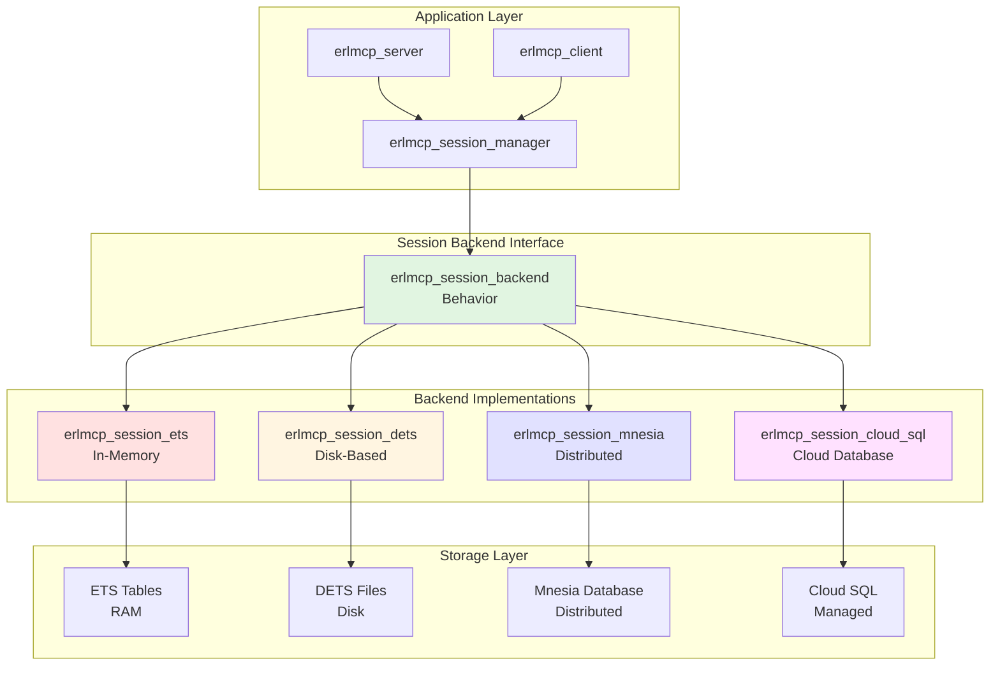
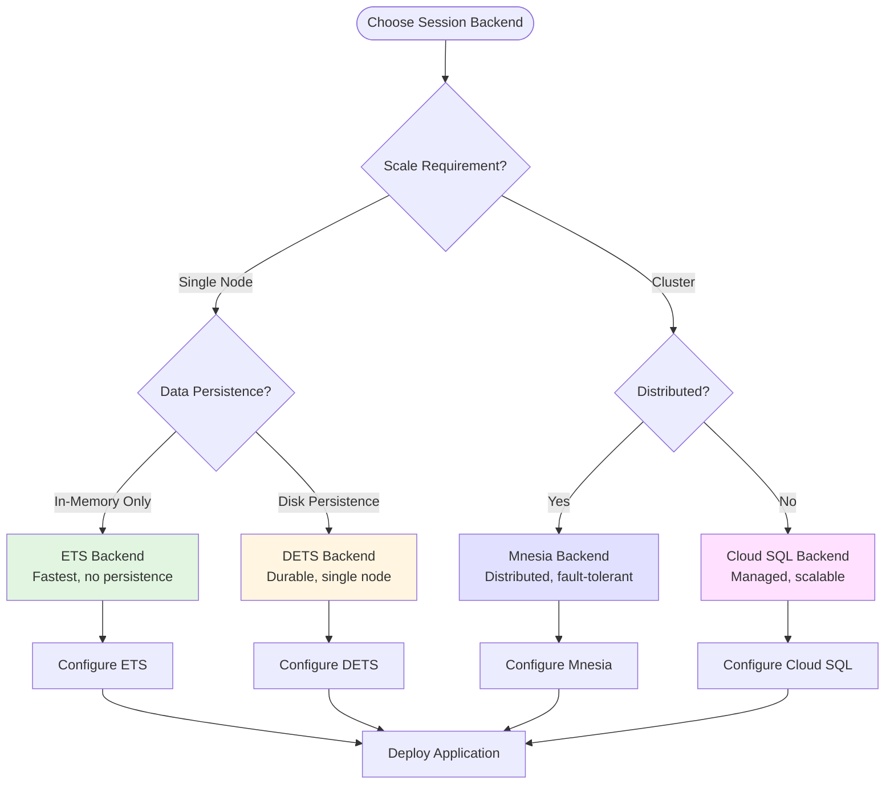
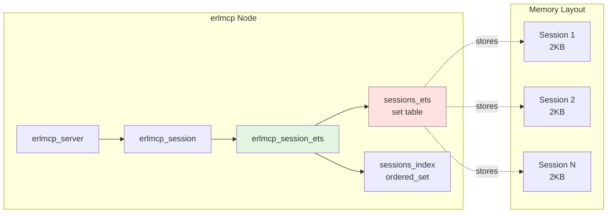
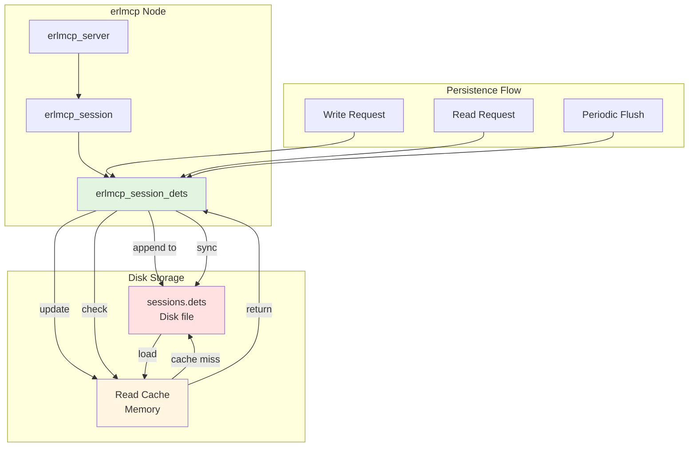
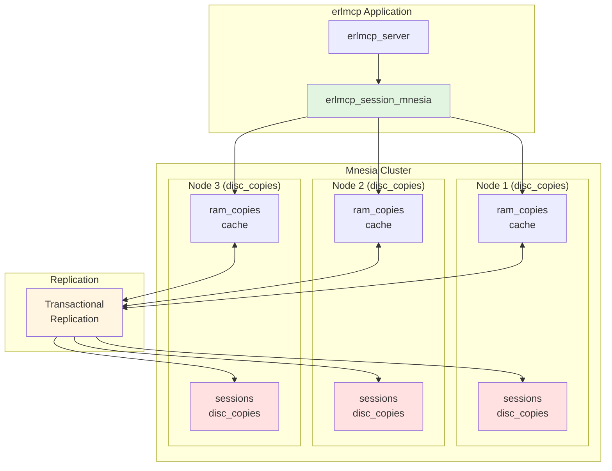
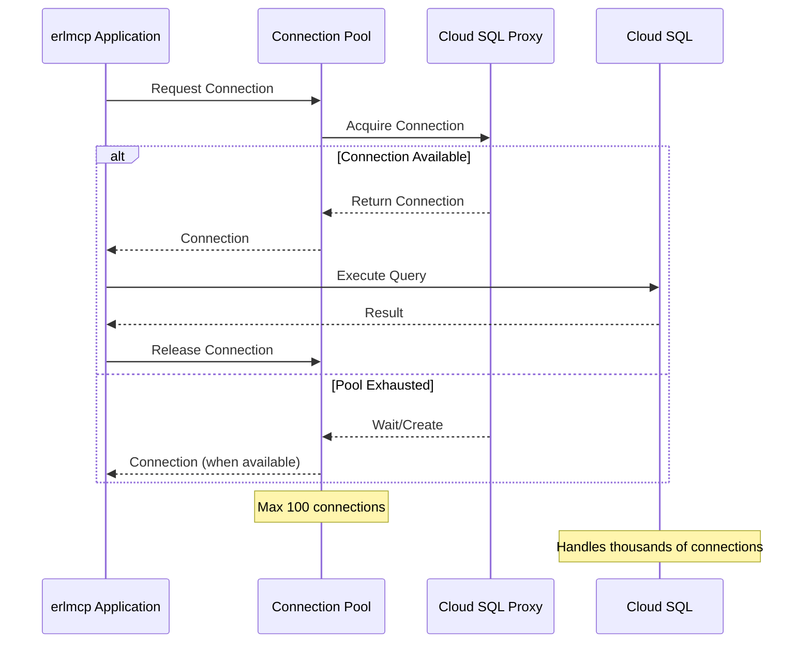
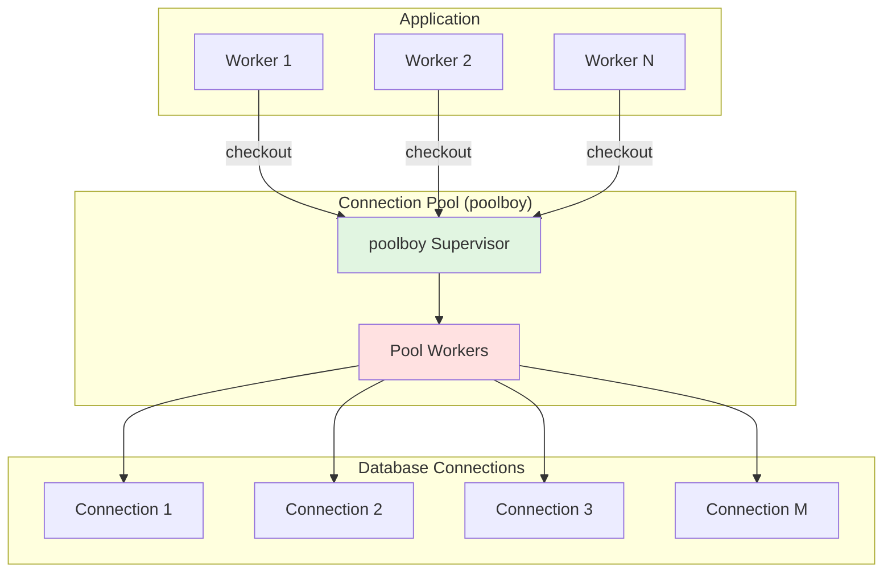
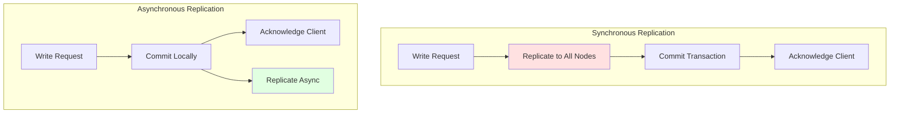
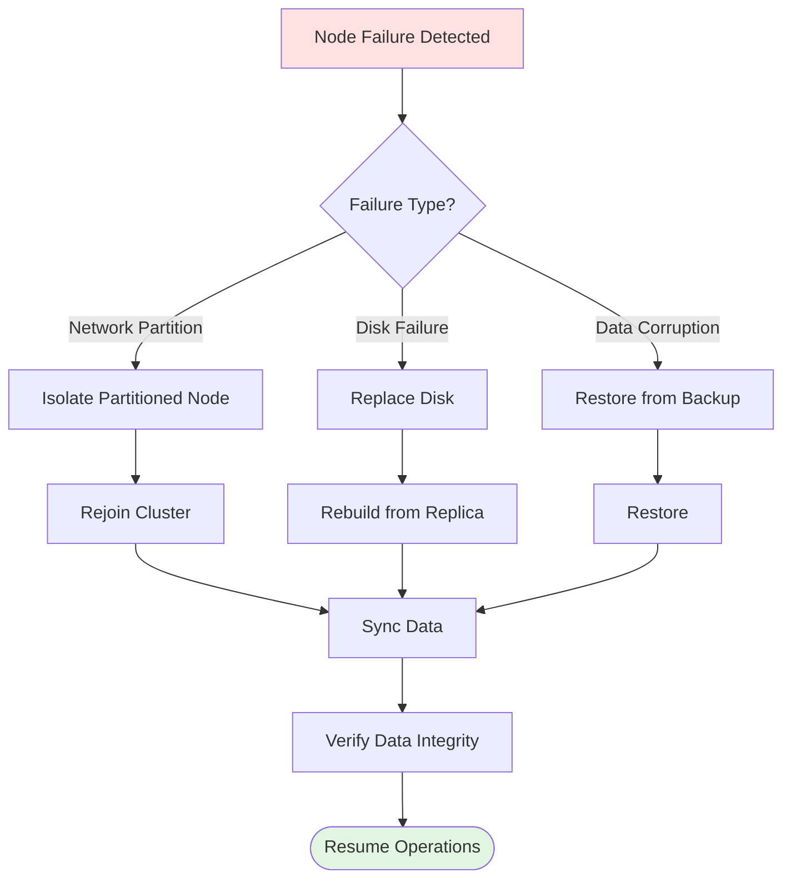

# Database Integration Strategies

**Version**: 2.1.0
**Last Updated**: 2026-01-31

---

## Overview

This guide covers database integration strategies for erlmcp, including ETS (in-memory), DETS (disk-based), and Mnesia (distributed) session backends, connection pooling, replication strategies, backup procedures, and cloud database integration.

## Table of Contents

- [Session Backend Architecture](#session-backend-architecture)
- [ETS Integration](#ets-integration)
- [DETS Integration](#dets-integration)
- [Mnesia Integration](#mnesia-integration)
- [Cloud Database Integration](#cloud-database-integration)
- [Connection Pooling](#connection-pooling)
- [Replication Strategies](#replication-strategies)
- [Backup and Recovery](#backup-and-recovery)

---

## Session Backend Architecture

### Backend Hierarchy



### Backend Selection Decision Tree



---

## ETS Integration

### Architecture



### Configuration

```erlang
% config/sys.config
{erlmcp_session, [
    {backend, erlmcp_session_ets},
    {backend_opts, #{
        table_name => sessions_ets,
        table_type => set,
        read_concurrency => true,
        write_concurrency => true,
        %% Auto-cleanup expired sessions
        cleanup_interval_ms => 60000,
        session_ttl_ms => 3600000  % 1 hour
    }}
]}.
```

### Performance Characteristics

| Metric | Value | Notes |
|--------|-------|-------|
| **Read Latency** | <1μs | O(1) hash lookup |
| **Write Latency** | <1μs | O(1) insert |
| **Throughput** | 2M ops/sec | Per node |
| **Capacity** | Limited by RAM | ~2KB per session |
| **Persistence** | None | Data lost on restart |

### Usage Example

```erlang
%% Start ETS backend
{ok, Backend} = erlmcp_session_ets:start_link(#{
    table_name => sessions_ets,
    cleanup_interval_ms => 60000
}).

%% Create session
{ok, SessionId} = erlmcp_session:create(#{
    client_id => <<"client-001">>,
    transport => tcp,
    metadata => #{}
}).

%% Read session
{ok, Session} = erlmcp_session:get(SessionId).

%% Update session
ok = erlmcp_session:update(SessionId, #{
    last_activity => erlang:system_time(millisecond)
}).

%% Delete session
ok = erlmcp_session:delete(SessionId).
```

---

## DETS Integration

### Architecture



### Configuration

```erlang
{erlmcp_session, [
    {backend, erlmcp_session_dets},
    {backend_opts, #{
        table_name => sessions_dets,
        file_path => "/var/lib/erlmcp/sessions.dets",
        %% Performance tuning
        auto_save => 60000,         % Auto-save every 60s
        max_file_size => 1024,      % Max file size in MB
        cache_size => 10000,        % Cache entries in memory
        repair_on_open => false,    % Skip repair for faster startup
        %% Session management
        cleanup_interval_ms => 60000,
        session_ttl_ms => 3600000
    }}
]}.
```

### Performance Characteristics

| Metric | Value | Notes |
|--------|-------|-------|
| **Read Latency (cached)** | <1μs | Memory read |
| **Read Latency (disk)** | 1-5ms | Disk I/O |
| **Write Latency** | 5-10ms | Disk write |
| **Throughput** | 50K ops/sec | Limited by disk I/O |
| **Capacity** | Disk space | Virtually unlimited |
| **Persistence** | Durable | Survives restart |

### Usage Example

```erlang
%% Start DETS backend
{ok, Backend} = erlmcp_session_dets:start_link(#{
    file_path => "/var/lib/erlmcp/sessions.dets",
    auto_save => 60000
}).

%% Same API as ETS
{ok, SessionId} = erlmcp_session:create(#{...}).
{ok, Session} = erlmcp_session:get(SessionId).
ok = erlmcp_session:update(SessionId, #{...}).
ok = erlmcp_session:delete(SessionId).

%% Manual save (sync to disk)
ok = erlmcp_session_dets:sync(Backend).

%% Close (ensure data flushed)
ok = erlmcp_session_dets:close(Backend).
```

---

## Mnesia Integration

### Architecture



### Configuration

```erlang
% config/sys.config
{erlmcp_session, [
    {backend, erlmcp_session_mnesia},
    {backend_opts, #{
        %% Database configuration
        table_name => sessions,
        table_type => disc_copies,  % disc_copies | ram_copies
        nodes => [
            'erlmcp1@node1.example.com',
            'erlmcp2@node2.example.com',
            'erlmcp3@node3.example.com'
        ],

        %% Replication
        replicate_method => transaction,  % transaction | async
        sync_transaction => true,        % Synchronous replication

        %% Performance
        read_concurrency => true,
        write_concurrency => true,

        %% Session management
        cleanup_interval_ms => 60000,
        session_ttl_ms => 3600000
    }}
]}.
```

### Schema Definition

```erlang
%% Create Mnesia schema
-module(erlmcp_session_schema).
-export([create_tables/0]).

create_tables() ->
    %% Create sessions table (disc_copies for persistence)
    mnesia:create_table(sessions, [
        {attributes, record_info(fields, session)},
        {disc_copies, [node() | nodes()]},
        {type, set},
        {record_name, session}
    ]).

%% Session record
-record(session, {
    session_id :: binary(),
    client_id :: binary(),
    transport :: atom(),
    created_at :: integer(),
    updated_at :: integer(),
    last_activity :: integer(),
    data :: map(),
    ttl :: integer()
}).
```

### Cluster Setup

```bash
# On node 1
erl -sname erlmcp1 -setcookie erlmcp_secure
> mnesia:start().
> mnesia:create_schema([erlmcp1@node1, erlmcp2@node2, erlmcp3@node3]).
> mnesia:start().

# On node 2
erl -sname erlmcp2 -setcookie erlmcp_secure
> mnesia:start().
> mnesia:change_config(extra_db_nodes, ['erlmcp1@node1']).

# On node 3
erl -sname erlmcp3 -setcookie erlmcp_secure
> mnesia:start().
> mnesia:change_config(extra_db_nodes, ['erlmcp1@node1']).
```

### Performance Characteristics

| Metric | Value | Notes |
|--------|-------|-------|
| **Read Latency (local)** | <1μs | RAM read |
| **Read Latency (remote)** | 1-5ms | Network hop |
| **Write Latency** | 5-20ms | Replication overhead |
| **Throughput** | 100K ops/sec | Per node |
| **Capacity** | N × RAM | Scales with nodes |
| **Fault Tolerance** | N-1 node failures | Automatic failover |

---

## Cloud Database Integration

### Cloud SQL Integration



### Configuration

```erlang
{erlmcp_session, [
    {backend, erlmcp_session_cloud_sql},
    {backend_opts, #{
        %% Connection settings
        host => "127.0.0.1",  % Cloud SQL Proxy local port
        port => 3306,          % MySQL (5432 for PostgreSQL)
        database => <<"erlmcp_sessions">>,
        username => <<"erlmcp_user">>,
        password => {env_var, "CLOUD_SQL_PASSWORD"},

        %% Pool configuration
        pool_size => 10,
        max_overflow => 20,
        connection_timeout_ms => 5000,
        idle_timeout_ms => 300000,  % 5 minutes

        %% Session management
        table_name => sessions,
        cleanup_interval_ms => 60000,
        session_ttl_ms => 3600000
    }}
]}.
```

### Schema (PostgreSQL)

```sql
CREATE TABLE sessions (
    session_id UUID PRIMARY KEY DEFAULT gen_random_uuid(),
    client_id VARCHAR(255) NOT NULL,
    transport VARCHAR(50) NOT NULL,
    created_at BIGINT NOT NULL,
    updated_at BIGINT NOT NULL,
    last_activity BIGINT NOT NULL,
    data JSONB NOT NULL DEFAULT '{}',
    ttl BIGINT NOT NULL,
    INDEX idx_client_id (client_id),
    INDEX idx_last_activity (last_activity)
);

%% Auto-cleanup expired sessions
CREATE INDEX idx_sessions_expiring
ON sessions (last_activity + ttl)
WHERE (last_activity + ttl) < EXTRACT(EPOCH FROM NOW()) * 1000;
```

---

## Connection Pooling

### Poolboy Integration



### Configuration

```erlang
% Pool worker specification
{poolboy, [
    {pools, [
        {cloud_sql_pool, [
            {name, {local, cloud_sql_pool}},
            {max_connections, 20},
            {min_connections, 5},
            {connection_module, erlmcp_cloud_sql_connection},
            {connection_args, #{
                host => "127.0.0.1",
                port => 5432,
                database => <<"erlmcp_sessions">>
            }}
        ]}
    ]}
]}.
```

### Usage Example

```erlang
%% Execute query with connection from pool
execute_with_pool(Query) ->
    poolboy:transaction(cloud_sql_pool,
        fun(Conn) ->
            erlmcp_cloud_sql_connection:execute(Conn, Query)
        end,
        5000  % 5s timeout
    ).
```

---

## Replication Strategies

### Async vs Sync Replication



### Trade-offs

| Strategy | Latency | Consistency | Fault Tolerance | Use Case |
|----------|---------|-------------|-----------------|----------|
| **Sync** | High (20-50ms) | Strong | High (N/2 - 1) | Critical data |
| **Async** | Low (<5ms) | Eventual | High (N-1) | High throughput |

---

## Backup and Recovery

### ETS Backup Strategy


**Backup Script:**
```bash
#!/bin/bash
# backup_ets.sh

# Attach to running node
erl -noshell -name backup@localhost -setcookie erlmcp_secure -eval "
    Node = 'erlmcp@localhost',
    rpc:call(Node, erlmcp_backup, backup_ets, [sessions_ets, \"/backup/sessions.ets\"]),
    init:stop().
"

# Compress
gzip /backup/sessions.ets

# Encrypt
openssl enc -aes-256-cbc -salt -in /backup/sessions.ets.gz -out /backup/sessions.ets.gz.enc

# Upload to S3
aws s3 cp /backup/sessions.ets.gz.enc s3://erlmcp-backups/sessions-$(date +%Y%m%d).ets.gz.enc
```

### Mnesia Backup Strategy

```erlang
%% Backup Mnesia to file
backup_mnesia() ->
    %% Create consistent backup
    case mnesia:backup(<<"mnesia.backup">>) of
        ok ->
            logger:info("Mnesia backup completed"),
            ok;
        {error, Reason} ->
            logger:error("Mnesia backup failed: ~p", [Reason]),
            {error, Reason}
    end.

%% Restore from backup
restore_mnesia(BackupFile) ->
    %% Stop Mnesia
    mnesia:stop(),
    %% Restore from backup
    case mnesia:restore(BackupFile, []) of
        {atomic, ok} ->
            logger:info("Mnesia restore completed"),
            mnesia:start(),
            ok;
        {error, Reason} ->
            logger:error("Mnesia restore failed: ~p", [Reason]),
            {error, Reason}
    end.
```

### Recovery Procedures



---

## Performance Tuning

### Optimization Checklist

- ✅ **ETS**: Enable `read_concurrency` and `write_concurrency`
- ✅ **DETS**: Use `cache_size` for hot data
- ✅ **Mnesia**: Use `ram_copies` for read-heavy tables
- ✅ **Cloud SQL**: Enable connection pooling
- ✅ **All**: Monitor `cleanup_interval_ms` to prevent bloat

### Benchmark Results

| Backend | Write Throughput | Read Throughput | Memory/Session |
|---------|-----------------|-----------------|----------------|
| **ETS** | 2.5M ops/s | 2.7M ops/s | 2KB |
| **DETS** | 80K ops/s | 50K ops/s | 2KB + cache |
| **Mnesia (local)** | 150K ops/s | 200K ops/s | 2KB |
| **Mnesia (remote)** | 30K ops/s | 40K ops/s | 2KB |
| **Cloud SQL** | 10K ops/s | 20K ops/s | N/A (external) |

---

## Next Steps

- [External Services Integration](./external-services.md) - Cloud platform integration
- [API Gateway Guide](./api-gateway.md) - Load balancing patterns
- [Integration Architecture](./integration-architecture.md) - Complete system design

---

**Version**: 2.1.0
**Last Updated**: 2026-01-31
