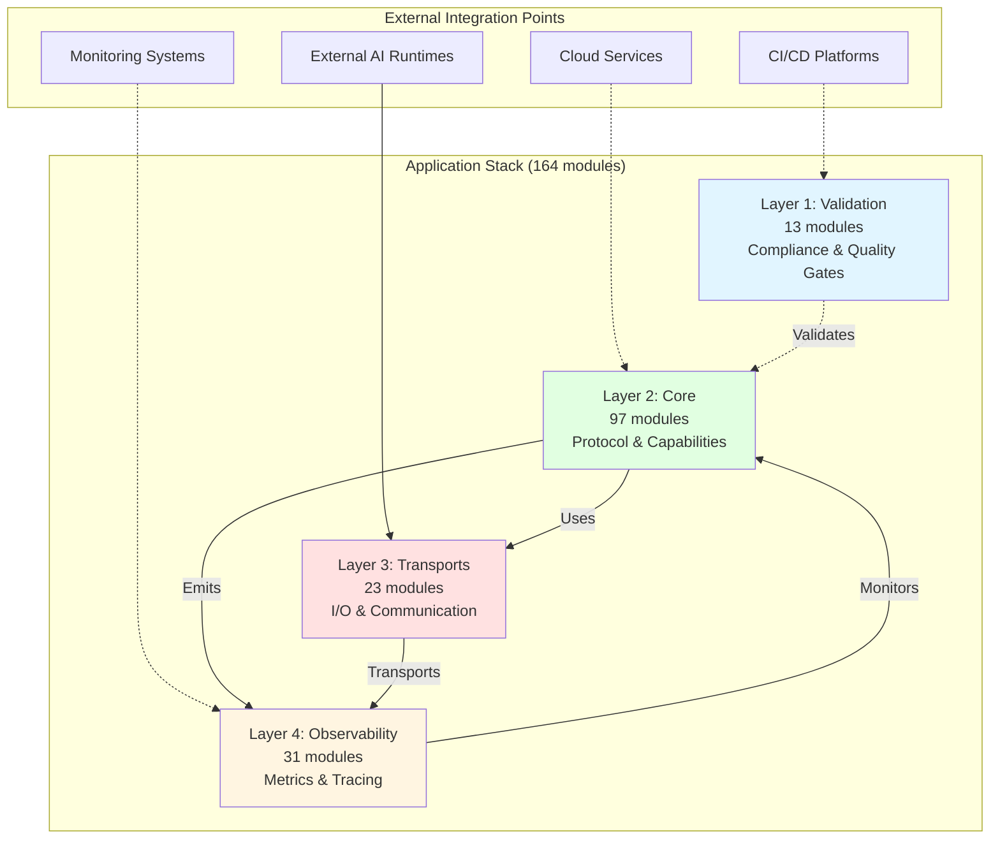
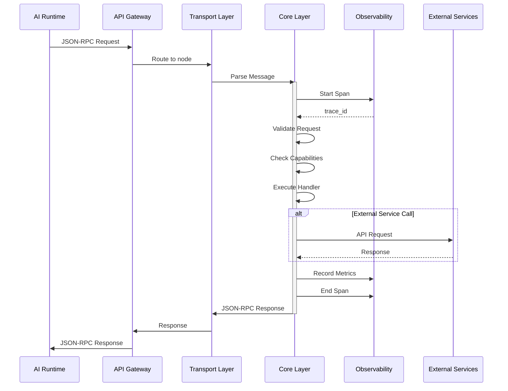
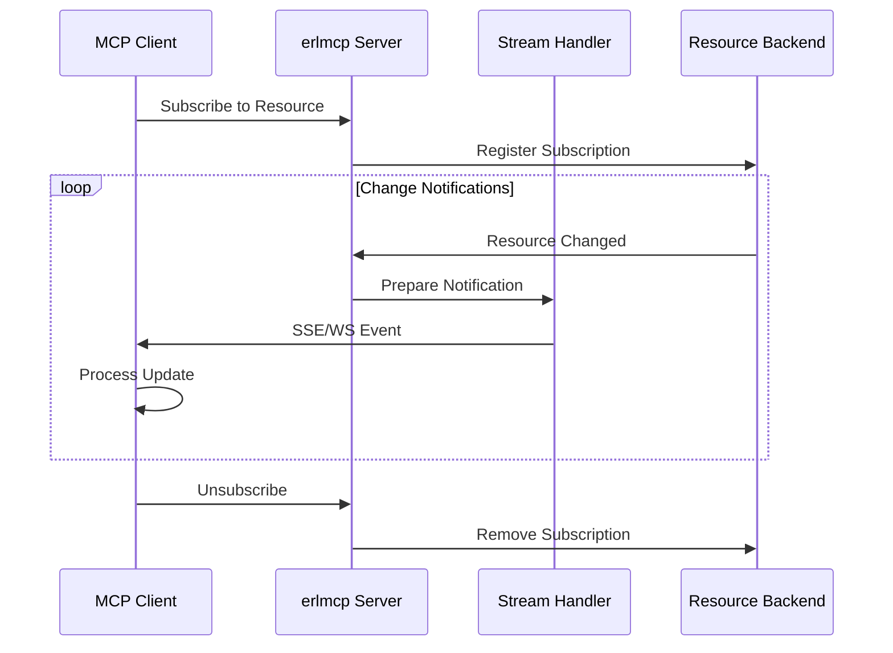
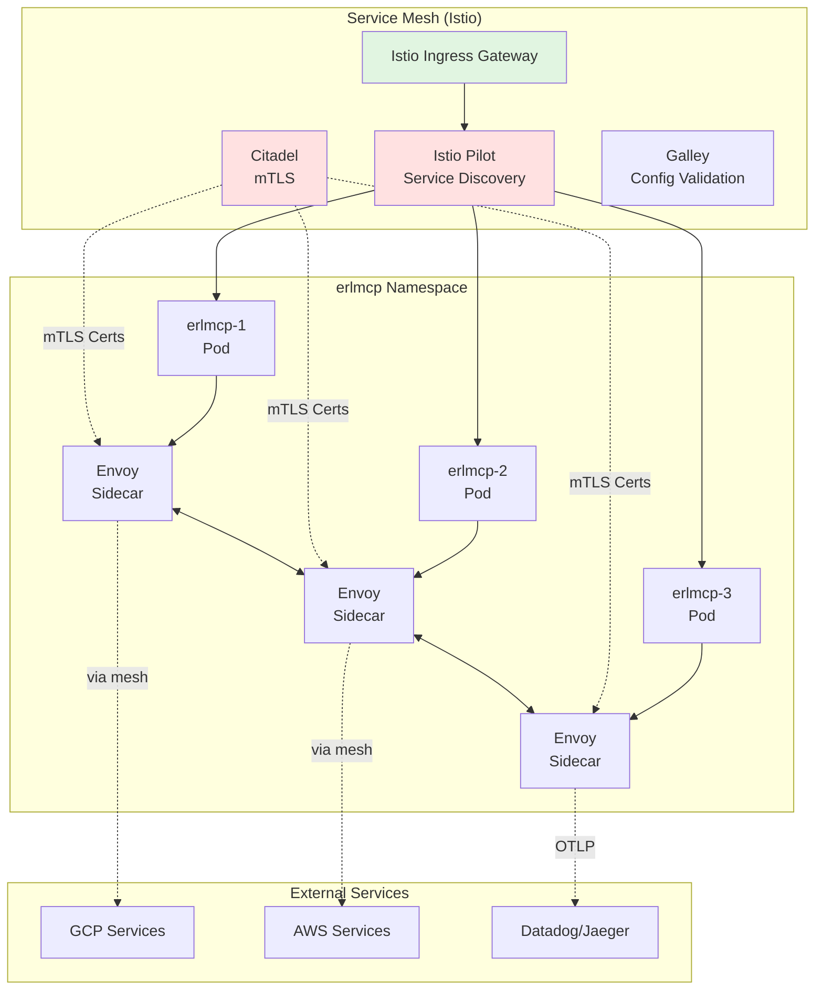
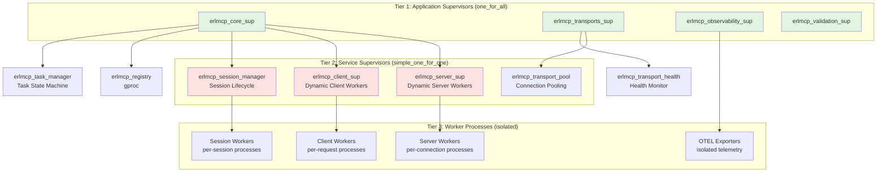
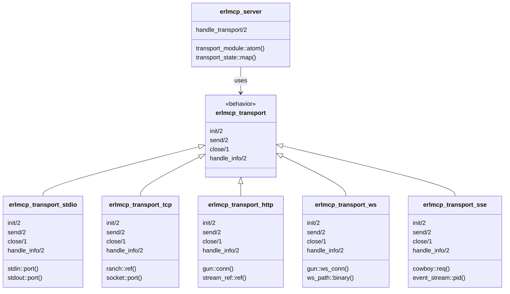
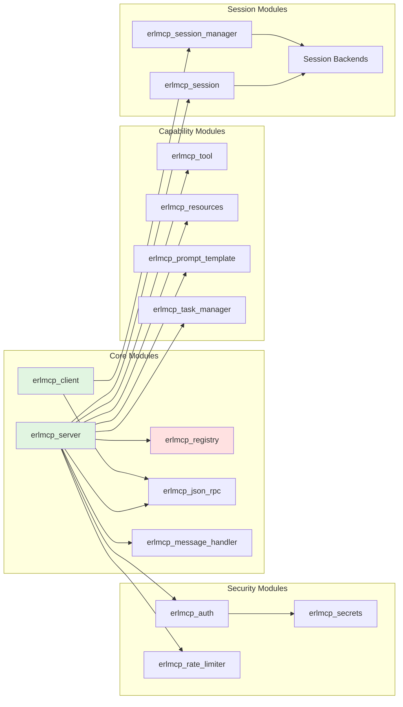
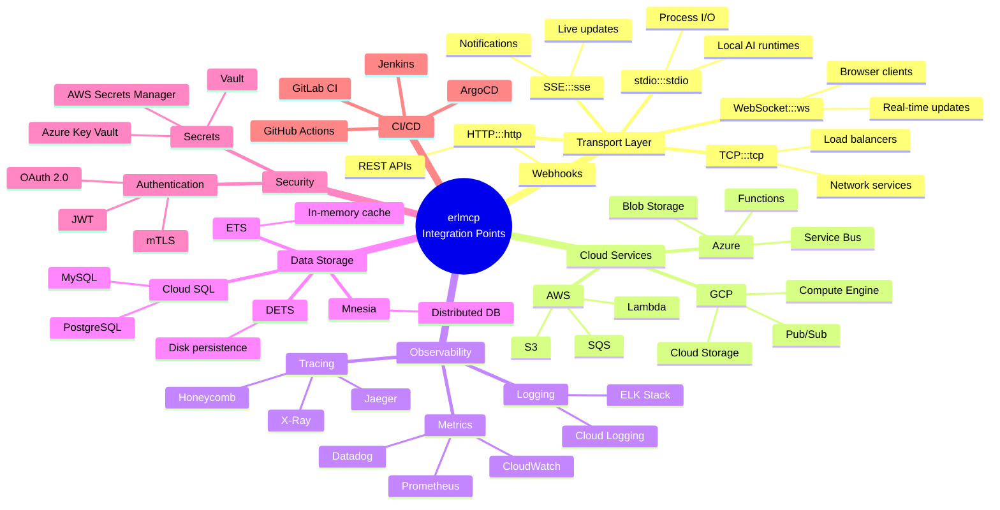
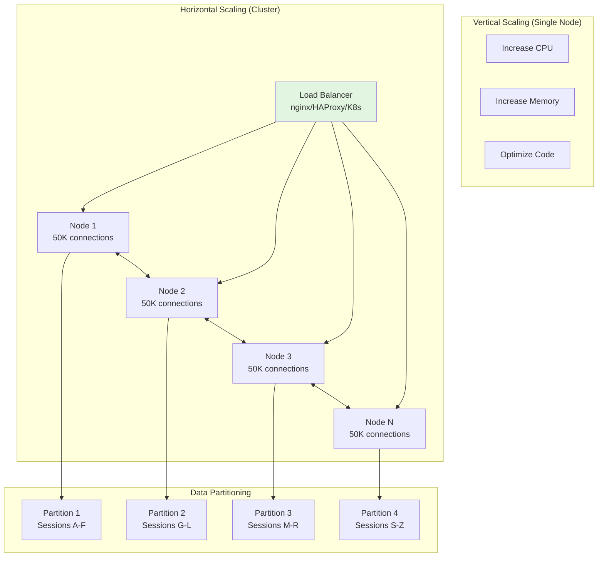

# Integration Architecture

**Version**: 2.1.0
**Last Updated**: 2026-01-31

---

## Overview

This document describes the complete integration architecture of erlmcp, including system topology, component relationships, data flow patterns, service mesh integration, supervision tree integration, and module dependencies. It provides the foundation for understanding how to integrate erlmcp with external systems.

## Table of Contents

- [System Architecture Overview](#system-architecture-overview)
- [Component Integration](#component-integration)
- [Data Flow Patterns](#data-flow-patterns)
- [Service Mesh Integration](#service-mesh-integration)
- [Supervision Tree Integration](#supervision-tree-integration)
- [Transport Layer Integration](#transport-layer-integration)
- [Module Dependency Analysis](#module-dependency-analysis)
- [Integration Points](#integration-points)
- [Scalability Patterns](#scalability-patterns)

---

## System Architecture Overview

### Complete System Topology

```mermaid
graph TB
    subgraph "External Systems"
        AI_CLIENTS[AI Runtimes<br/>Claude, GPT-4, Local LLMs]
        DEV_TOOLS[Developer Tools<br/>VSCode, JetBrains, CLI]
        CLOUD_SERVICES[Cloud Services<br/>GCP, AWS, Azure]
        MONITORING[Monitoring Systems<br/>Datadog, Honeycomb, Jaeger]
        CI_CD[CI/CD Platforms<br/>GitHub Actions, GitLab CI]
    end

    subgraph "API Gateway Layer"
        NGINX[Nginx/Gateway<br/>Load Balancer]
        K8S_INGRESS[Kubernetes Ingress<br/>Service Mesh]
    end

    subgraph "erlmcp Cluster"
        direction TB

        subgraph "Node 1 (Primary)"
            N1_CORE[Core App<br/>97 modules]
            N1_TRANS[Transports App<br/>23 modules]
            N1_OBS[Observability App<br/>31 modules]
            N1_VAL[Validation App<br/>13 modules]
        end

        subgraph "Node 2 (Replica)"
            N2_CORE[Core App<br/>97 modules]
            N2_TRANS[Transports App<br/>23 modules]
            N2_OBS[Observability App<br/>31 modules]
            N2_VAL[Validation App<br/>13 modules]
        end

        subgraph "Node 3 (Replica)"
            N3_CORE[Core App<br/>97 modules]
            N3_TRANS[Transports App<br/>23 modules]
            N3_OBS[Observability App<br/>31 modules]
            N3_VAL[Validation App<br/>13 modules]
        end

        subgraph "Shared Storage"
            Mnesia[Mnesia Cluster<br/>Distributed DB]
            Registry[gproc Registry<br/>Distributed Registry]
        end
    end

    subgraph "External Dependencies"
        GPROC[gproc<br/>Process Registry]
        JSX[jsx<br/>JSON Codec]
        JESSE[jesse<br/>JSON Schema]
        GUN[gun<br/>HTTP Client]
        RANCH[ranch<br/>TCP Acceptors]
        COWBOY[cowboy<br/>HTTP Server]
        POOLBOY[poolboy<br/>Pool Mgmt]
    end

    %% External connections
    AI_CLIENTS --> NGINX
    DEV_TOOLS --> NGINX
    NGINX --> K8S_INGRESS
    CLOUD_SERVICES -.->|API Calls| N1_CORE
    MONITORING -.->|OTLP| N1_OBS
    CI_CD -.->|Deploy| N1_VAL

    %% Gateway to cluster
    K8S_INGRESS --> N1_TRANS
    K8S_INGRESS --> N2_TRANS
    K8S_INGRESS --> N3_TRANS

    %% Inter-node communication
    N1_CORE <--> Mnesia
    N2_CORE <--> Mnesia
    N3_CORE <--> Mnesia

    N1_CORE <--> Registry
    N2_CORE <--> Registry
    N3_CORE <--> Registry

    %% Internal app connections
    N1_TRANS --> N1_CORE
    N1_CORE --> N1_OBS
    N1_CORE --> N1_VAL

    N2_TRANS --> N2_CORE
    N2_CORE --> N2_OBS
    N2_CORE --> N2_VAL

    N3_TRANS --> N3_CORE
    N3_CORE --> N3_OBS
    N3_CORE --> N3_VAL

    %% External library connections
    N1_TRANS --> RANCH
    N1_TRANS --> COWBOY
    N1_TRANS --> GUN
    N1_CORE --> GPROC
    N1_CORE --> JSX
    N1_CORE --> JESSE
    N1_CORE --> POOLBOY

    style N1_CORE fill:#e1f5e1
    style N2_CORE fill:#e1f5e1
    style N3_CORE fill:#e1f5e1
    style Mnesia fill:#ffe1e1
    style Registry fill:#ffe1e1
```



**Architecture Principles:**
1. **Horizontal Scaling** - Add nodes for increased capacity
2. **Fault Isolation** - Node failures don't affect other nodes
3. **Data Consistency** - Mnesia provides distributed transactions
4. **Service Discovery** - gproc enables dynamic routing
5. **Observability** - All nodes export telemetry

---

## Component Integration

### Layer Breakdown



**Layer Responsibilities:**

| Layer | Modules | Responsibility | External Integration |
|-------|---------|----------------|----------------------|
| **Validation** | 13 | Compliance, testing, quality gates | CI/CD platforms, test runners |
| **Core** | 97 | MCP protocol, capabilities, session management | Cloud services, databases |
| **Transports** | 23 | stdio, TCP, HTTP, WebSocket, SSE | AI runtimes, load balancers |
| **Observability** | 31 | Metrics, tracing, chaos engineering | Monitoring systems, APM tools |

---

## Data Flow Patterns

### Request-Response Flow



### Streaming Data Flow



---

## Service Mesh Integration

### Istio/Linkerd Integration Pattern



**Service Mesh Features:**
- **mTLS** - Automatic encryption between all services
- **Traffic Management** - Canary deployments, A/B testing
- **Observability** - Distributed tracing out of the box
- **Policy Enforcement** - Rate limiting, access control

**Configuration:**
```yaml
# Istio ServiceEntry for erlmcp
apiVersion: networking.istio.io/v1beta1
kind: ServiceEntry
metadata:
  name: erlmcp
spec:
  hosts:
  - erlmcp.default.svc.cluster.local
  ports:
  - number: 8080
    name: tcp
    protocol: TCP
  location: MESH_INTERNAL
  resolution: DNS
```

---

## Supervision Tree Integration

### Three-Tier Supervision Hierarchy



**Supervision Strategies:**

| Tier | Strategy | Use Case | Failure Impact |
|------|----------|----------|----------------|
| **Tier 1** | `one_for_all` | Application supervisors | All children restart if one fails |
| **Tier 2** | `simple_one_for_one` | Dynamic workers (servers, clients) | Only failed worker restarts |
| **Tier 3** | `isolated` | Observability exporters | No cascade failures |

---

## Transport Layer Integration

### Transport Polymorphism



**Transport Selection Guide:**

| Transport | Best For | Max Connections | Latency | Bidirectional |
|-----------|----------|-----------------|---------|---------------|
| **stdio** | Local AI runtimes | 1 | <1ms | No |
| **TCP** | High-performance | 50K/node | 1-5ms | Yes |
| **HTTP** | REST APIs | 10K/node | 5-20ms | Request/Response |
| **WebSocket** | Real-time | 5K/node | <5ms | Yes |
| **SSE** | Notifications | 10K/node | <10ms | Server→Client |

---

## Module Dependency Analysis

### Core Dependencies



**Dependency Categories:**

1. **Critical Path** - Required for basic operation
   - erlmcp_server, erlmcp_client, erlmcp_registry, erlmcp_json_rpc

2. **Capability Path** - Required for MCP features
   - erlmcp_tool, erlmcp_resources, erlmcp_prompt_template, erlmcp_task_manager

3. **Security Path** - Required for production deployments
   - erlmcp_auth, erlmcp_secrets, erlmcp_rate_limiter

4. **Session Path** - Required for stateful connections
   - erlmcp_session, erlmcp_session_manager, session backends

---

## Integration Points

### External System Hooks



---

## Scalability Patterns

### Scaling Strategies



**Scaling Guidelines:**

| Scale | Connections | Nodes | Transport | Session Backend |
|-------|-------------|-------|-----------|-----------------|
| **Small** | <1K | 1 | stdio, TCP | ETS |
| **Medium** | 1K-50K | 1-3 | TCP, HTTP | ETS, DETS |
| **Large** | 50K-500K | 3-10 | TCP, WS | Mnesia |
| **X-Large** | >500K | 10+ | TCP, WS | Mnesia + Partitioning |

---

## Next Steps

- **External Services Integration** - [Read guide](./external-services.md)
- **Database Integration** - [Read guide](./database.md)
- **API Gateway** - [Read guide](./api-gateway.md)
- **Integration Patterns** - [Read reference](../archive/misc/INTEGRATION_PATTERNS.md)

---

**Version**: 2.1.0
**Last Updated**: 2026-01-31
