# Monitoring Architecture Guide

**Version:** 2.1.0  
**Last Updated:** January 31, 2026

## Overview

erlmcp provides comprehensive monitoring architecture following Toyota Production System principles: Andon (visible alerts), Poka-Yoke (mistake-proofing), Jidoka (built-in quality), and Kaizen (continuous improvement).

## System Monitoring Topology

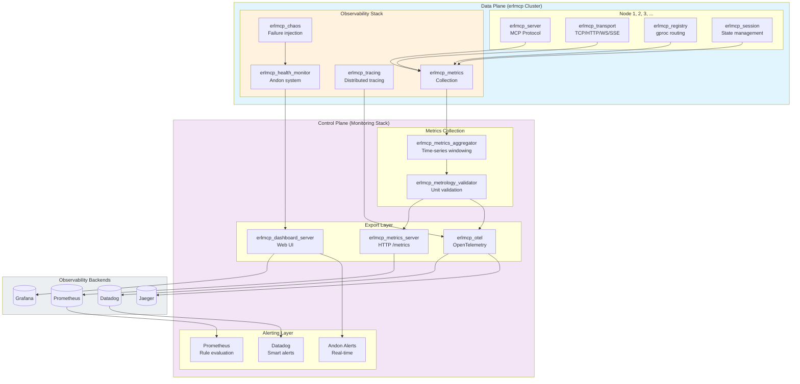

## Monitoring Layers

### Layer 1: Instrumentation (Data Collection)

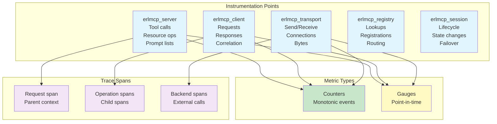

### Layer 2: Aggregation (Time-Series Processing)

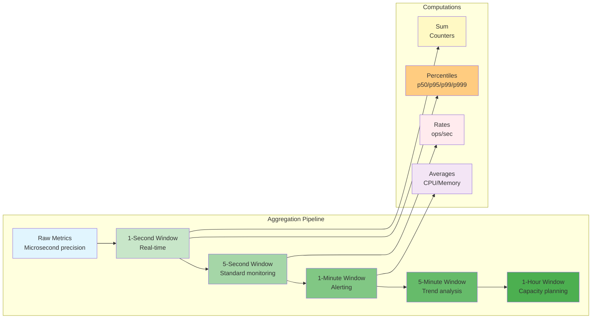

### Layer 3: Validation (Metrology Compliance)

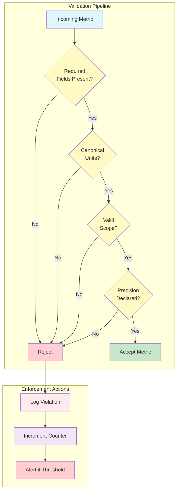

### Layer 4: Export (Observability Backends)

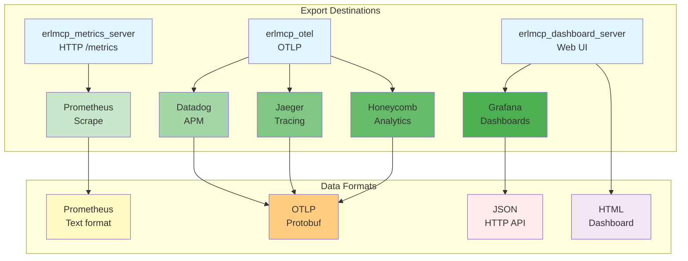

## Alerting Architecture (Andon System)

### Andon Alert Flow

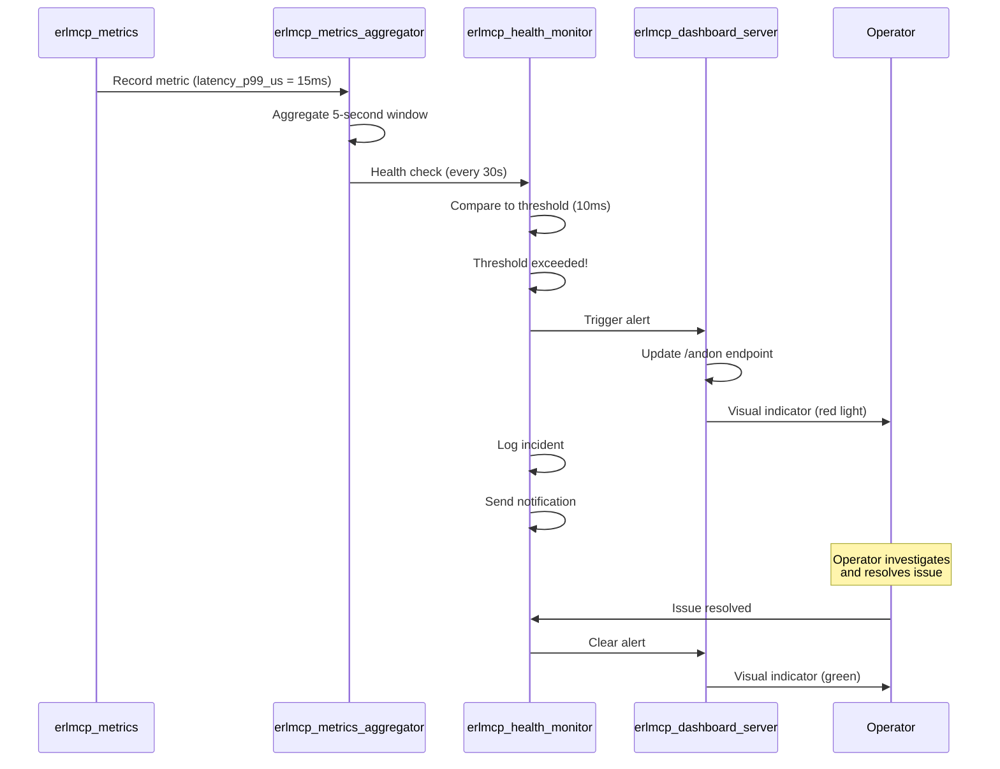

### Alert Hierarchy

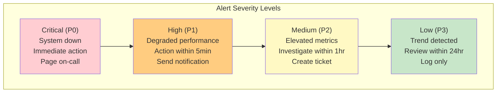

### Alert Configuration

```erlang
{erlmcp_health_monitor, [
    {check_interval, 30000},  % 30 seconds
    
    {thresholds, #{
        % Critical thresholds
        latency_p99_us_critical => 50000000,  % 50 seconds
        error_rate_5m_critical => 0.10,  % 10%
        memory_heap_mib_per_conn_critical => 200,
        
        % Warning thresholds
        latency_p99_us_warning => 10000000,  % 10 seconds
        error_rate_5m_warning => 0.05,  % 5%
        memory_heap_mib_per_conn_warning => 100,
        
        % Info thresholds
        throughput_msg_per_s_info => 400000  % Below baseline
    }},
    
    {alert_handlers, [
        {erlmcp_dashboard_server, alert},
        {logger, warning},
        {otel, trace},
        {webhook, "https://alerts.example.com/webhook"}
    ]}
]}.
```

## Distributed Tracing Architecture

### Trace Propagation

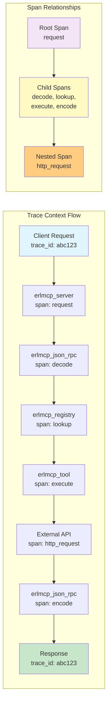

### Trace Sampling Strategy

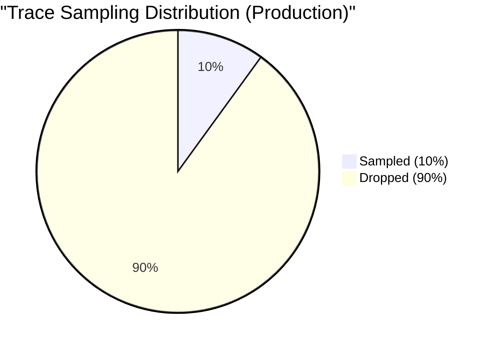

**Configuration:**
```erlang
% Production: 10% sampling
{sampler, #{
    type => trace_id_ratio_based,
    ratio => 0.1
}}.

% Development: 100% sampling
{sampler, #{
    type => always_on
}}.

% Staging: 50% sampling
{sampler, #{
    type => trace_id_ratio_based,
    ratio => 0.5
}}.
```

## Dashboard Architecture

### Dashboard Components

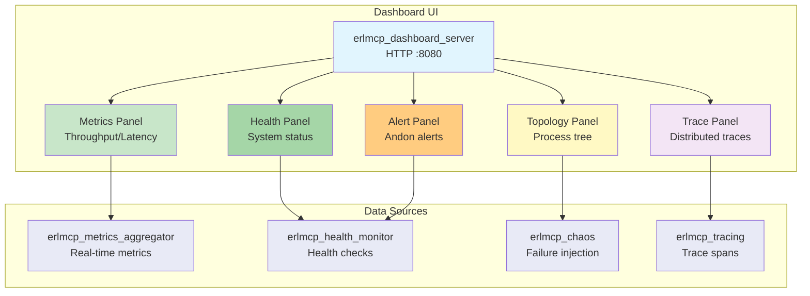

### Dashboard Panels

**1. Metrics Panel (Real-time)**
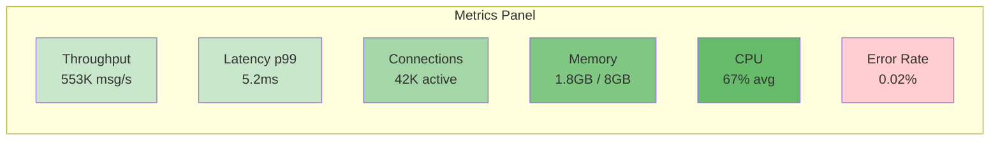

**2. Health Panel (Status)**
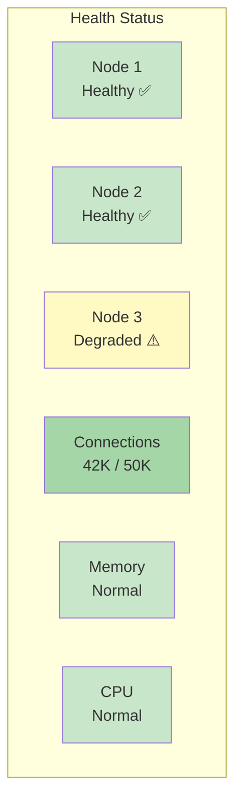

**3. Alert Panel (Andon)**
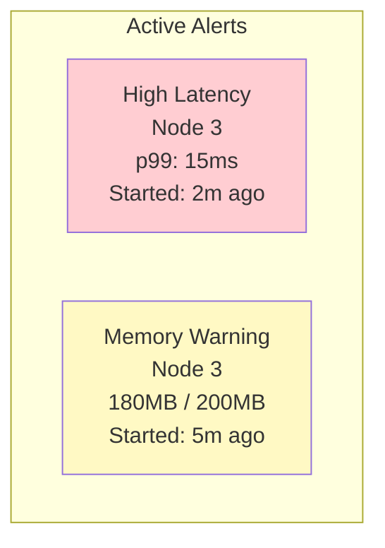

## Chaos Engineering Integration

### Chaos-to-Monitoring Loop

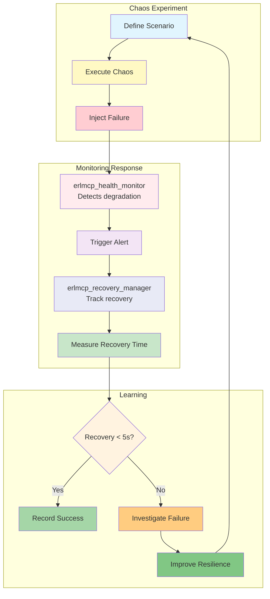

## Performance Considerations

### Monitoring Overhead

| Component | CPU Overhead | Memory Overhead | Network Overhead |
|-----------|--------------|-----------------|------------------|
| Metrics Collection | 1-2% | 10-20MB | Minimal |
| Tracing (10% sample) | 2-3% | 50-100MB | 1-2KB/s |
| Health Monitoring | <1% | 5-10MB | Minimal |
| Dashboard Server | <1% | 5-15MB | 100-200KB/s |
| **Total** | **4-6%** | **70-145MB** | **~200KB/s** |

### Optimization Strategies

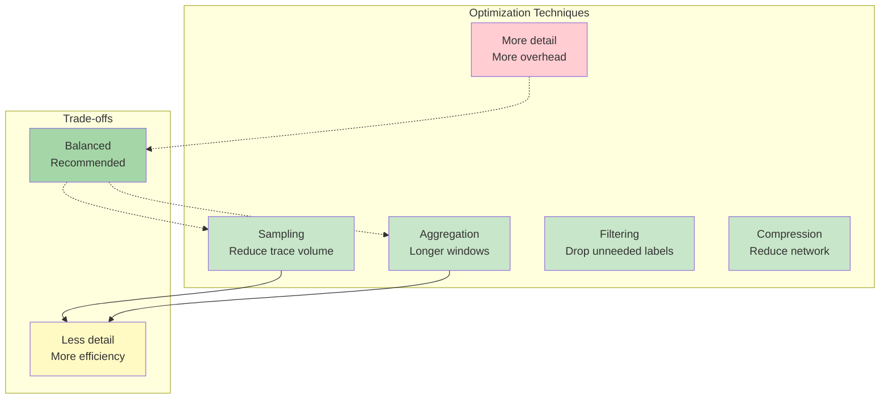

## Best Practices

### 1. Set Meaningful Thresholds

```erlang
% Based on baseline measurements
{thresholds, #{
    latency_p99_us => 10000000,  % 10x baseline (5.2ms * 10)
    error_rate_5m => 0.05,  % 5% (baseline: 0.02%)
    memory_heap_mib_per_conn => 100  % 2x baseline (45KB * 2)
}}.
```

### 2. Use Alert Hierarchy

```erlang
% Critical: Page on-call
% High: Send notification
% Medium: Create ticket
% Low: Log only
```

### 3. Monitor Observability Overhead

```erlang
% Track metrics system performance
erlmcp_metrics:histogram(<<"otel_span_duration_us">>, SpanDuration).
erlmcp_metrics:gauge(<<"metrics_buffer_size">>, BufferSize).
erlmcp_metrics:counter(<<"metrics_export_total">>).
```

### 4. Validate All Metrics

```erlang
% Ensure metrology compliance
case erlmcp_metrology_validator:validate_metric(Metric) of
    {ok, _} -> record_metric(Metric);
    {error, Violation} -> logger:warning("Metric violation: ~p", [Violation])
end.
```

### 5. Use Distributed Context

```erlang
% Propagate trace context across nodes
?WITH_SPAN(<<"cross_node_operation">>, #{},
    % Context automatically propagated
    rpc:call(Node, erlmcp_server, handle_request, [Request])
).
```

## References

- [Observability Overview](README.md)
- [Metrics Collection](../performance/METRICS_COLLECTION.md)
- [Dashboard Guide](dashboard.md)
- [Chaos Engineering](chaos.md)
- [Toyota Production System](../TCPS_HEALTH_SUMMARY.md)

---

**Last Updated:** January 31, 2026  
**Version:** 2.1.0
