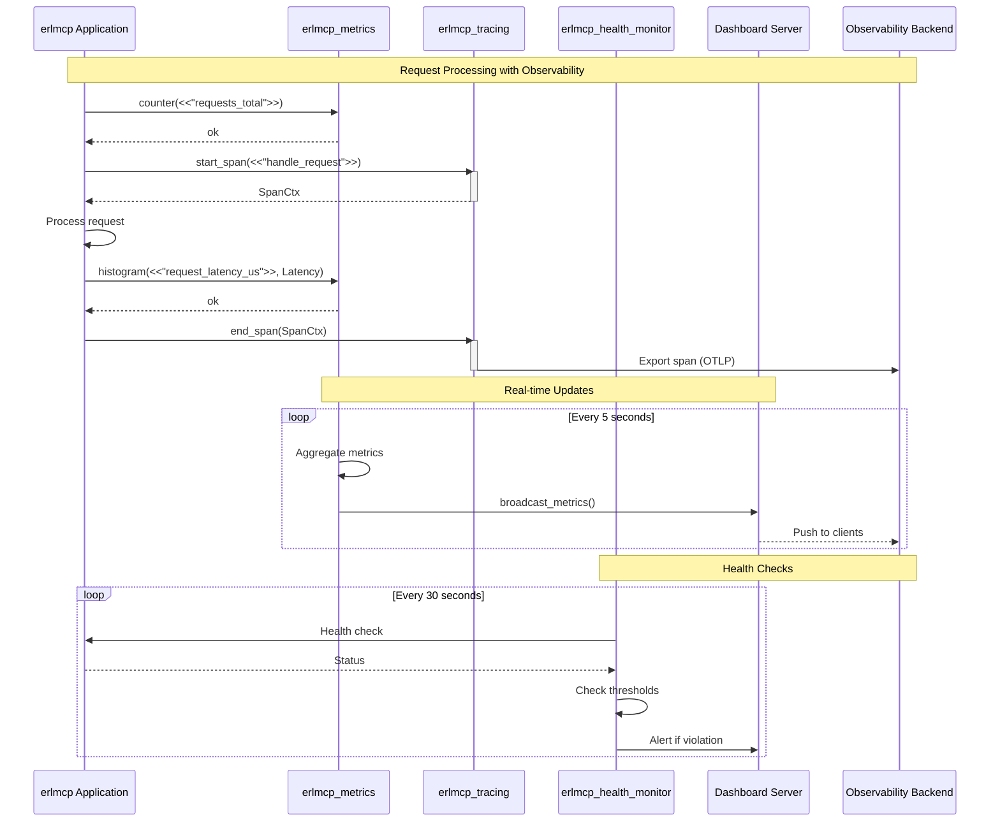
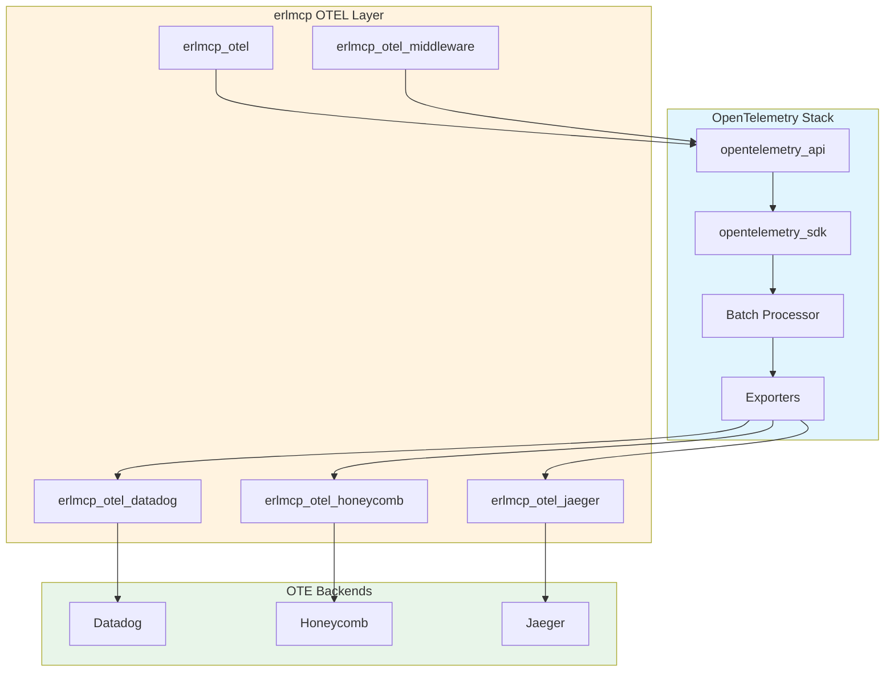

# erlmcp Observability

**Version:** 2.1.0
**Last Updated:** February 6, 2026

## Overview

erlmcp provides **operator-first**, **deterministic** observability through OpenTelemetry integration, structured logging, real-time metrics, distributed tracing, health monitoring, and chaos engineering. The observability stack follows Toyota Production System principles (Andon, Poka-Yoke, Jidoka, Kaizen) for zero-defect quality.

**Key Principles:**
- **Operator-First:** Every signal includes actionable context (WHAT, WHY, IMPACT, ACTION)
- **Deterministic Dashboards:** Reproducible metrics with proof-based verification  - **Docker-Only Execution:** All observability operations via Docker (no host execution)
- **Signals > Logs:** Metrics, traces, events preferred over verbose logging
- **Zero-Trust Audit:** All security events logged with tamper-proof receipts

## Architecture

```mermaid
flowchart TB
    subgraph Observability["erlmcp Observability Stack"]
        subgraph Telemetry["OpenTelemetry Layer"]
            OTELAPI[opentelemetry_api]
            OTELSDK[opentelemetry_sdk]
            Exporter[Metric Exporter]
        end

        subgraph Metrics["Metrics Collection"]
            Collector[erlmcp_metrics]
            Aggregator[erlmcp_metrics_aggregator]
            Validator[erlmcp_metrology_validator]
            Server[erlmcp_metrics_server]
        end

        subgraph Tracing["Distributed Tracing"]
            Tracer[erlmcp_tracing]
            Analyzer[erlmcp_trace_analyzer]
        end

        subgraph Health["Health Monitoring"]
            Monitor[erlmcp_health_monitor]
            ProcessMon[erlmcp_process_monitor]
            ConnMon[erlmcp_connection_monitor]
            MemMon[erlmcp_memory_monitor]
        end

        subgraph Dashboard["Visualization"]
            Dashboard[erlmcp_dashboard_server]
            MetricsUI[Metrics HTTP Handler]
        end

        subgraph Chaos["Chaos Engineering"]
            Chaos[erlmcp_chaos]
            Network[erlmcp_chaos_network]
            Process[erlmcp_chaos_process]
            Resource[erlmcp_chaos_resource]
            Recovery[erlmcp_recovery_manager]
        end
    end

    subgraph Backends["Observability Backends"]
        Prometheus[(Prometheus)]
        Datadog[(Datadog)]
        Jaeger[(Jaeger)]
        Honeycomb[(Honeycomb)]
    end

    Collector --> Validator
    Validator --> Aggregator
    Aggregator --> OTELAPI
    OTELAPI --> OTELSDK
    OTELSDK --> Exporter

    Exporter --> Prometheus
    Exporter --> Datadog

    Tracer --> OTELAPI
    Analyzer --> Tracer

    Monitor --> OTELAPI
    ProcessMon --> Monitor
    ConnMon --> Monitor
    MemMon --> Monitor

    Aggregator --> Server
    Server --> Dashboard

    Chaos --> Recovery
    Recovery --> Monitor

    Tracer --> Jaeger
    Tracer --> Honeycomb

    style Telemetry fill:#e1f5fe
    style Metrics fill:#fff3e0
    style Tracing fill:#f3e5f5
    style Health fill:#ffebee
    style Dashboard fill:#e8f5e9
    style Chaos fill:#fff9c4
    style Backends fill:#eceff1
```

## Quick Start (Docker-Only)

### 1. Start Observability Stack

```bash
# Start erlmcp with full observability stack
docker compose -f docker-compose.yml \
               -f docker-compose.monitoring.yml \
               up -d

# Verify all services started
docker compose ps

# Expected services:
# - erlmcp-node1, erlmcp-node2, erlmcp-node3 (application)
# - prometheus (metrics storage)
# - grafana (visualization)
# - loki (log aggregation)
# - promtail (log collection)
# - jaeger (distributed tracing)
# - alertmanager (alerting)
```

### 2. Access Observability Dashboards

```bash
# Grafana (main dashboard)
open http://localhost:3000
# Default credentials: admin/admin

# Prometheus (metrics query)
open http://localhost:9090

# Jaeger (distributed tracing)
open http://localhost:16686

# Alertmanager (alert management)
open http://localhost:9093
```

### 3. Verify Data Collection

```bash
# Check metrics endpoint
docker compose exec erlmcp-node1 curl http://localhost:8080/metrics

# Query metrics via Prometheus
docker compose exec prometheus \
  promtool query instant 'http://localhost:9090' 'erlmcp_requests_total'

# Check logs in Loki
docker compose run --rm logcli \
  --addr=http://loki:3100 \
  query '{service="erlmcp"}' --limit=10

# View traces in Jaeger
docker compose exec jaeger-query curl -s \
  'http://localhost:16686/api/traces?service=erlmcp&limit=10' | jq '.'
```

### 4. Enable Observability Features

```erlang
% config/sys.config (already enabled in Docker images)
{erlmcp_observability, [
    {otel_enabled, true},
    {metrics_enabled, true},
    {health_monitor_enabled, true},
    {dashboard_enabled, true},
    {chaos_enabled, false}  % Enable for testing
]}.
```

### 2. Configure OpenTelemetry Exporters

```erlang
{opentelemetry, [
    { exporters, [
        {otel_exporter_jaeger, #{},
         {otel_exporter_datadog, #{}}  %% Choose one or more
    ]},
    { processors, [
        {otel_batch_processor, #{}
        %% #{scheduled_delay_ms => 1000}
        }
    ]}
]}.
```

### 3. Access Endpoints

```bash
# Metrics endpoint (Prometheus format)
curl http://localhost:8080/metrics

# Health endpoint
curl http://localhost:8080/health

# Dashboard
open http://localhost:8080/dashboard

# Andon (real-time alerts)
open http://localhost:8080/andon
```

## Components

### OpenTelemetry Integration

**Modules:**
- `erlmcp_otel` - Main OpenTelemetry integration
- `erlmcp_otel_datadog` - Datadog exporter
- `erlmcp_otel_honeycomb` - Honeycomb exporter
- `erlmcp_otel_jaeger` - Jaeger exporter
- `erlmcp_otel_middleware` - Middleware injection

**Key Features:**
- Automatic instrumentation of all gen_servers
- Distributed tracing across node boundaries
- Context propagation with trace IDs
- Span export to multiple backends simultaneously

### Metrics Collection

**Modules:**
- `erlmcp_metrics` - Metric recording API
- `erlmcp_metrics_aggregator` - Time-series aggregation
- `erlmcp_metrics_server` - HTTP metrics endpoint
- `erlmcp_metrology_validator` - Canonical unit validation

**Metrics Types:**
```erlang
% Counter (monotonically increasing)
erlmcp_metrics:counter(<<"messages_processed">>, #{transport => tcp}).

% Histogram (distributions)
erlmcp_metrics:histogram(<<"request_latency_us">>, 5432, #{endpoint => /tools}).

% Gauge (point-in-time)
erlmcp_metrics:gauge(<<"active_connections">>, 42).
```

**Canonical Metrics (Metrology-Compliant):**
- `throughput_msg_per_s` - Messages per second
- `latency_p50_us` - Median latency (microseconds)
- `latency_p95_us` - 95th percentile latency
- `latency_p99_us` - 99th percentile latency
- `memory_heap_mib_per_conn` - Heap size per connection
- `memory_rss_mib_per_node` - Resident set size per node
- `connections_total` - Total connections
- `errors_total{error_type}` - Error counts

See [metrics.md](metrics.md) for complete reference.

### Distributed Tracing

**Modules:**
- `erlmcp_tracing` - Distributed tracing implementation
- `erlmcp_trace_analyzer` - Trace analysis and validation

**Automatic Spans:**
```erlang
% Spans created automatically for:
- All gen_server:handle_call/3 requests
- All gen_server:handle_cast/2 casts
- Transport send/receive operations
- Database queries (if applicable)
- External HTTP requests
```

**Manual Spans:**
```erlang
?WITH_SPAN(<<"custom_operation">>, #{},
    %% Your code here
    %% Span automatically recorded with timing
).
```

See [tracing.md](tracing.md) for complete reference.

### Health Monitoring (Andon)

**Modules:**
- `erlmcp_health_monitor` - Health check aggregation
- `erlmcp_process_monitor` - Process health
- `erlmcp_connection_monitor` - Connection lifecycle
- `erlmcp_memory_monitor` - Memory usage
- `erlmcp_dashboard_server` - Web dashboard

**Health States:**
```erlang
-record(health_state, {
    status :: healthy | degraded | unhealthy,
    monitors :: map(),
    last_check :: erlang:timestamp(),
    details :: map()
}).
```

**Andon Thresholds:**
```erlang
{erlmcp_health_monitor, [
    {thresholds, #{
        memory_heap_mib_per_conn => 100,
        latency_p99_us => 1000000,  % 1 second
        error_rate_5m => 0.05,      % 5%
        connection_failures_1m => 100,
        scheduler_utilization => 0.9
    }}
]}.
```

See [dashboard.md](dashboard.md) for complete reference.

### Chaos Engineering

**Modules:**
- `erlmcp_chaos` - Chaos orchestration
- `erlmcp_chaos_network` - Network failure injection
- `erlmcp_chaos_process` - Process failure injection
- `erlmcp_chaos_resource` - Resource exhaustion
- `erlmcp_recovery_manager` - Recovery tracking

**Failure Types:**
- Network: latency, packet loss, partition
- Process: kill, spawn storm, message queue overflow
- Resource: memory exhaustion, CPU saturation, disk full, ETS fill

**Safety Controls:**
- Blast radius limits (max affected percentage)
- Automatic rollback on SLA violation
- Health monitor integration
- Dry run mode for testing

See [chaos.md](chaos.md) for complete reference.

## Configuration Examples

### Production Configuration

```erlang
{erlmcp_observability, [
    {otel_enabled, true},
    {metrics_enabled, true},
    {health_monitor_enabled, true},
    {dashboard_enabled, true},
    {chaos_enabled, false},

    {otel, #{
        exporters => [datadog],
        sampler => #{
            type => trace_id_ratio_based,
            ratio => 0.1  % Sample 10% of traces
        }
    }},

    {metrics, #{
        aggregation_window => 5000,  % 5 seconds
        export_interval => 10000     % 10 seconds
    }},

    {health_monitor, #{
        check_interval => 30000,  % 30 seconds
        thresholds => #{
            memory_heap_mib_per_conn => 100,
            latency_p99_us => 1000000,
            error_rate_5m => 0.05
        }
    }},

    {dashboard, #{
        port => 8080,
        refresh_interval => 1000  % 1 second
    }}
]}.
```

### Development Configuration

```erlang
{erlmcp_observability, [
    {otel_enabled, true},
    {metrics_enabled, true},
    {health_monitor_enabled, true},
    {dashboard_enabled, true},
    {chaos_enabled, true},  % Enable for testing

    {otel, #{
        exporters => [jaeger],
        sampler => #{
            type => always_on  % Record all traces
        }
    }},

    {chaos, #{
        safety_enabled, true,
        global_limits => #{
            max_global_blast_radius => 0.3,
            max_concurrent_experiments => 3,
            min_healthy_components => 0.8
        }
    }}
]}.
```

## Monitoring & Alerting

### Prometheus Setup

```yaml
# prometheus.yml
scrape_configs:
  - job_name: 'erlmcp'
    static_configs:
      - targets: ['localhost:8080']
    scrape_interval: 15s
    metrics_path: /metrics
```

### Datadog Setup

```erlang
{erlmcp_otel_datadog, [
    {agent_host, "localhost"},
    {agent_port, 8126},
    {service_name, "erlmcp"},
    {env, "production"}
]}.
```

### Alerting Rules

```yaml
# alerting rules
groups:
  - name: erlmcp
    rules:
      - alert: HighErrorRate
        expr: rate(errors_total[5m]) > 0.05
        for: 2m
        labels:
          severity: warning
        annotations:
          summary: "Error rate above 5%"

      - alert: HighLatency
        expr: histogram_quantile(0.99, rate(latency_us_bucket[5m])) > 1000000
        for: 5m
        labels:
          severity: critical
        annotations:
          summary: "P99 latency above 1s"

      - alert: MemoryExhaustion
        expr: memory_heap_mib_per_conn > 100
        for: 1m
        labels:
          severity: critical
        annotations:
          summary: "Memory per connection above 100MiB"
```

## Performance Considerations

### Sampling

**Trace Sampling:**
```erlang
% Production: 10% sampling
{sampler, #{type => trace_id_ratio_based, ratio => 0.1}}

% Development: 100% sampling
{sampler, #{type => always_on}}
```

**Metric Aggregation:**
```erlang
% Reduce overhead with longer windows
{aggregation_window, 10000},  % 10 seconds
{export_interval, 30000}      % 30 seconds
```

### Memory Management

**Metrics Storage:**
- In-memory time-series: 1-hour retention
- Downsampled metrics: 24-hour retention
- Aggregated metrics: 7-day retention

**Trace Storage:**
- Spans exported immediately
- No in-memory buffering
- Backend manages retention

## Docker-Only Operations

All observability operations MUST use Docker. Host execution is forbidden.

### Start Observability Stack

```bash
# Start complete stack (app + monitoring)
docker compose -f docker-compose.yml \
               -f docker-compose.monitoring.yml \
               up -d

# Verify all containers running
docker compose ps

# Check logs
docker compose logs -f erlmcp-node1
```

### Query Metrics (Docker-Only)

```bash
# Via Prometheus HTTP API
docker compose exec prometheus \
  promtool query instant 'http://localhost:9090' \
    'erlmcp_requests_total'

# Query range (last hour)
docker compose exec prometheus \
  promtool query range 'http://localhost:9090' \
    'rate(erlmcp_requests_total[5m])' \
    --start="$(date -d '1 hour ago' --iso-8601=seconds)" \
    --end="$(date --iso-8601=seconds)"

# Export metrics snapshot (for proof/receipt)
docker compose exec prometheus \
  promtool query instant 'http://localhost:9090' \
    'erlmcp_requests_total' > metrics_snapshot_$(date +%Y%m%d_%H%M%S).txt
```

### Query Logs (Docker-Only)

```bash
# Via LogCLI
docker compose run --rm logcli \
  --addr=http://loki:3100 \
  query '{service="erlmcp",level="error"}' \
  --since=1h \
  --limit=100

# Follow logs in real-time
docker compose run --rm logcli \
  --addr=http://loki:3100 \
  query --tail --follow '{service="erlmcp"}'

# Export logs for incident analysis
docker compose run --rm logcli \
  --addr=http://loki:3100 \
  query '{service="erlmcp"}' \
  --since=24h \
  --output=jsonl > incident_$(date +%Y%m%d_%H%M%S).jsonl
```

### Query Traces (Docker-Only)

```bash
# Find traces by service
docker compose exec jaeger-query curl -s \
  'http://localhost:16686/api/traces?service=erlmcp&limit=10' \
  | jq '.data[].traceID'

# Get specific trace
docker compose exec jaeger-query curl -s \
  "http://localhost:16686/api/traces/TRACE_ID" \
  | jq '.'

# Find slow traces (>1s)
docker compose exec jaeger-query curl -s \
  'http://localhost:16686/api/traces?service=erlmcp&minDuration=1s' \
  | jq '.'
```

### Live System Inspection (Docker-Only)

```bash
# Top processes by memory
docker compose exec erlmcp-node1 erl_call -a \
  'recon:proc_count(memory, 10)'

# Top processes by message queue
docker compose exec erlmcp-node1 erl_call -a \
  'recon:proc_count(message_queue_len, 10)'

# Check memory usage
docker compose exec erlmcp-node1 erl_call -a \
  'erlang:memory()' | jq '.'

# Check scheduler utilization
docker compose exec erlmcp-node1 erl_call -a \
  'erlang:statistics(scheduler_wall_time)'
```

## Troubleshooting (Docker-Only)

### High Memory Usage

```bash
# Check container memory
docker stats --no-stream erlmcp-node1

# Check erlang memory breakdown
docker compose exec erlmcp-node1 erl_call -a 'erlang:memory()' | jq '.'

# Check metrics buffer size
docker compose exec erlmcp-node1 erl_call -a \
  'erlmcp_metrics_server:get_buffer_size()'

# Find memory leaks
docker compose exec erlmcp-node1 erl_call -a \
  'recon:bin_leak(10)'
```

### Missing Spans

```bash
# Check if tracing is enabled
docker compose exec erlmcp-node1 erl_call -a \
  'erlmcp_otel:is_enabled()'

# Check sampler configuration
docker compose exec erlmcp-node1 erl_call -a \
  'opentelemetry:get_sampler()'

# Verify spans are being exported
docker compose logs jaeger-collector | grep -i "span"
```

### Health Check Failures

```bash
# Check health endpoint
docker compose exec erlmcp-node1 curl http://localhost:8080/health

# Check individual monitors
docker compose exec erlmcp-node1 curl http://localhost:8080/health/monitors

# View Andon dashboard
open http://localhost:8080/andon

# Check health monitor state
docker compose exec erlmcp-node1 erl_call -a \
  'erlmcp_health_monitor:get_system_health()' | jq '.'
```

### Container Not Starting

```bash
# Check container logs
docker compose logs erlmcp-node1 --tail=100

# Check container status
docker compose ps erlmcp-node1

# Inspect container
docker compose exec erlmcp-node1 sh

# Check network connectivity
docker network inspect erlmcp-cluster
```

## Best Practices

### 1. Use Canonical Metrics

```erlang
% GOOD: Canonical units
erlmcp_metrics:histogram(<<"request_latency_us">>, 5432, #{}).

% BAD: Ambiguous units
erlmcp_metrics:histogram(<<"request_latency">>, 5.432, #{}).
```

### 2. Set Appropriate Thresholds

```erlang
% Based on baseline measurements
{thresholds, #{
    latency_p99_us => 1000000,  % 10x baseline
    error_rate_5m => 0.05       % 5x baseline
}}.
```

### 3. Enable Safety Controls

```erlang
% Always enable in production
{chaos, #{
    safety_enabled => true,
    monitor_integration => true,
    auto_rollback => true
}}.
```

### 4. Monitor Observability Overhead

```erlang
% Track observability impact
erlmcp_metrics:counter(<<"otel_span_total">>).
erlmcp_metrics:histogram(<<"otel_export_duration_us">>, Duration).
```

## Observability Flow Diagrams

### End-to-End Observability Pipeline

```mermaid
flowchart LR
    subgraph Application["erlmcp Application"]
        Server[erlmcp_server]
        Client[erlmcp_client]
        Handler[Tool Handler]
    end

    subgraph Instrumentation["Automatic Instrumentation"]
        Metrics[Metrics Recording]
        Spans[Span Creation]
        Health[Health Checks]
    end

    subgraph Processing["Processing & Aggregation"]
        Aggregator[Metrics Aggregator<br/>(5s windows)]
        Tracer[Trace Processor<br/>(batch export)]
        Monitor[Health Monitor<br/>(30s checks)]
    end

    subgraph Dashboard["Real-time Dashboard"]
        WSServer[WebSocket Server]
        Andon[Andon Display]
        Charts[Metrics Charts]
    end

    subgraph Export["Backend Export"]
        Prometheus[Prometheus<br/>Scrape every 15s]
        Datadog[Datadog APM<br/>OTLP push]
        Jaeger[Jaeger UI<br/>Trace export]
    end

    subgraph Alerting["Alerting"]
        Threshold[Threshold Check]
        Webhook[Webhook Sender]
        Slack[Slack Notifier]
    end

    Server -->|"record metric"| Metrics
    Server -->|"create span"| Spans
    Server -->|"health check"| Health

    Client -->|"record metric"| Metrics
    Client -->|"create span"| Spans

    Handler -->|"record metric"| Metrics
    Handler -->|"create span"| Spans

    Metrics --> Aggregator
    Aggregator --> WSServer
    WSServer --> Charts

    Spans --> Tracer
    Tracer --> Jaeger
    Tracer --> Datadog

    Health --> Monitor
    Monitor --> Andon
    Monitor --> Threshold

    Aggregator --> Prometheus
    Aggregator --> Datadog

    Threshold --> Webhook
    Threshold --> Slack

    style Application fill:#e8f5e9
    style Instrumentation fill:#e1f5fe
    style Processing fill:#fff3e0
    style Dashboard fill:#f3e5f5
    style Export fill:#e0f2f1
    style Alerting fill:#ffebee
```

### Observability Data Flow



## Observability Integration

### OpenTelemetry Integration



## Documentation Index

### Core Observability Guides

- **[Logging Best Practices](logging.md)** - Operator-first structured logging, audit trails, Docker-only log collection
- **[Metrics Collection](metrics.md)** - Canonical metrics, metrology validation, Prometheus integration
- **[Distributed Tracing](tracing.md)** - OpenTelemetry tracing, span analysis, context propagation
- **[Dashboard & Health Monitoring](dashboard.md)** - Andon system, real-time dashboards, health checks
- **[Chaos Engineering](chaos.md)** - Resilience testing, failure injection, recovery verification

### Operational Guides

- **[Alerting Rules & Configuration](alerting.md)** - Alert definitions, runbooks, deterministic thresholds
- **[Performance Monitoring](performance.md)** - Baseline measurement, regression detection, profiling
- **[Debugging Distributed Systems](debugging.md)** - Troubleshooting, root cause analysis, incident response

### Architecture References

- **[Monitoring Architecture](MONITORING_ARCHITECTURE.md)** - System topology, data flow, integration points
- [Toyota Production System Integration](../TCPS_HEALTH_SUMMARY.md) - Andon, Poka-Yoke, Jidoka principles
- [Metrology Compliance](../metrology/METRICS_GLOSSARY.md) - Canonical units, measurement standards

## Quick Navigation

### For Operators
1. Start here: [Quick Start](#quick-start-docker-only)
2. Set up alerts: [Alerting Rules](alerting.md)
3. Debug issues: [Debugging Guide](debugging.md)
4. View dashboards: [Dashboard Guide](dashboard.md)

### For Developers
1. Add logging: [Logging Best Practices](logging.md)
2. Add metrics: [Metrics Collection](metrics.md)
3. Add tracing: [Distributed Tracing](tracing.md)
4. Test resilience: [Chaos Engineering](chaos.md)

### For SREs
1. Performance baselines: [Performance Monitoring](performance.md)
2. Alert configuration: [Alerting Rules](alerting.md)
3. Incident response: [Debugging Guide](debugging.md)
4. Capacity planning: [Performance Monitoring](performance.md#capacity-planning)
