# erlmcp Alerting Rules & Configuration

**Version:** 2.1.0
**Last Updated:** February 6, 2026

## Overview

erlmcp alerting follows deterministic, operator-first principles with **zero false positives** as the goal. All alerts are actionable, include runbooks, and integrate with the Andon system for visible quality signaling.

## Alerting Philosophy

### Deterministic Alerting

```mermaid
graph TB
    subgraph Principles["Alerting Principles"]
        P1[1. Every Alert = Action Required]
        P2[2. Include Runbook Link]
        P3[3. Deterministic Thresholds]
        P4[4. No Alert Fatigue]
    end

    subgraph AntiPatterns["Anti-Patterns"]
        A1[❌ Symptom-Only Alerts]
        A2[❌ Missing Context]
        A3[❌ Vague Thresholds]
        A4[❌ Alert Spam]
    end

    P1 --> P2 --> P3 --> P4

    style P1 fill:#c8e6c9
    style P2 fill:#c8e6c9
    style P3 fill:#c8e6c9
    style P4 fill:#c8e6c9
    style A1 fill:#ffcdd2
    style A2 fill:#ffcdd2
    style A3 fill:#ffcdd2
    style A4 fill:#ffcdd2
```



### Alert Severity Tiers


## Docker-Only Alert Architecture


## Prometheus Alert Rules (Docker Setup)

### Directory Structure

```bash
monitoring/
├── prometheus/
│   ├── prometheus.yml              # Main config
│   └── rules/
│       ├── critical.yml            # P0: Critical alerts
│       ├── high.yml                # P1: High priority
│       ├── medium.yml              # P2: Medium priority
│       └── recording_rules.yml     # Pre-computed metrics
```

### Docker Compose Configuration

```yaml
# docker-compose.yml
services:
  prometheus:
    image: prom/prometheus:v2.45.0
    container_name: erlmcp-prometheus
    command:
      - '--config.file=/etc/prometheus/prometheus.yml'
      - '--storage.tsdb.path=/prometheus'
      - '--storage.tsdb.retention.time=15d'
      - '--web.enable-lifecycle'
    volumes:
      - ./monitoring/prometheus/prometheus.yml:/etc/prometheus/prometheus.yml:ro
      - ./monitoring/prometheus/rules:/etc/prometheus/rules:ro
      - prometheus_data:/prometheus
    ports:
      - "9090:9090"
    networks:
      - erlmcp-monitoring
    restart: unless-stopped

  alertmanager:
    image: prom/alertmanager:v0.25.0
    container_name: erlmcp-alertmanager
    command:
      - '--config.file=/etc/alertmanager/alertmanager.yml'
      - '--storage.path=/alertmanager'
    volumes:
      - ./monitoring/alertmanager/alertmanager.yml:/etc/alertmanager/alertmanager.yml:ro
      - ./monitoring/alertmanager/templates:/etc/alertmanager/templates:ro
      - alertmanager_data:/alertmanager
    ports:
      - "9093:9093"
    networks:
      - erlmcp-monitoring
    restart: unless-stopped
    depends_on:
      - prometheus

volumes:
  prometheus_data:
  alertmanager_data:

networks:
  erlmcp-monitoring:
```

### Prometheus Main Configuration

```yaml
# monitoring/prometheus/prometheus.yml
global:
  scrape_interval: 15s
  evaluation_interval: 15s
  external_labels:
    cluster: 'erlmcp-production'
    environment: 'production'

# Alertmanager configuration
alerting:
  alertmanagers:
    - static_configs:
        - targets: ['alertmanager:9093']

# Load alert rules
rule_files:
  - '/etc/prometheus/rules/critical.yml'
  - '/etc/prometheus/rules/high.yml'
  - '/etc/prometheus/rules/medium.yml'
  - '/etc/prometheus/rules/recording_rules.yml'

# Scrape configurations
scrape_configs:
  # erlmcp metrics endpoint
  - job_name: 'erlmcp'
    static_configs:
      - targets:
          - 'erlmcp-node1:8080'
          - 'erlmcp-node2:8080'
          - 'erlmcp-node3:8080'
    scrape_interval: 15s
    metrics_path: '/metrics'

  # Prometheus self-monitoring
  - job_name: 'prometheus'
    static_configs:
      - targets: ['localhost:9090']

  # Node exporter (system metrics)
  - job_name: 'node'
    static_configs:
      - targets: ['node-exporter:9100']
```

## Critical Alert Rules (P0)

```yaml
# monitoring/prometheus/rules/critical.yml
groups:
  - name: critical_alerts
    interval: 15s
    rules:

      # System completely down (zero availability)
      - alert: ErlmcpSystemDown
        expr: up{job="erlmcp"} == 0
        for: 1m
        labels:
          severity: critical
          priority: P0
          component: system
        annotations:
          summary: "erlmcp system is completely down"
          description: |
            All erlmcp nodes are unreachable.

            IMPACT: Zero service availability. All requests failing.

            ACTION REQUIRED (immediate):
            1. Check node health: docker compose ps
            2. Check logs: docker compose logs erlmcp-node1 --tail=100
            3. Restart if needed: docker compose restart erlmcp-node1
            4. Page on-call if restart fails

            Runbook: https://docs.erlmcp.dev/runbooks/system-down

      # Data loss risk detected
      - alert: ErlmcpDataLossRisk
        expr: |
          rate(erlmcp_data_integrity_check_failures_total[5m]) > 0
        for: 0s  # Immediate alert
        labels:
          severity: critical
          priority: P0
          component: data
        annotations:
          summary: "Data integrity check failed - potential data loss"
          description: |
            Data integrity verification detected corruption or inconsistency.

            IMPACT: Data loss or corruption possible. Service must be stopped.

            ACTION REQUIRED (immediate):
            1. STOP accepting writes: docker compose exec erlmcp-node1 erl_call -a 'erlmcp_server stop_writes'
            2. Capture state: docker compose exec erlmcp-node1 erl_call -a 'erlmcp_debug dump_state "/tmp/state.dump"'
            3. Page on-call engineer
            4. DO NOT restart until data verified

            Runbook: https://docs.erlmcp.dev/runbooks/data-loss-risk

      # High error rate (>50% requests failing)
      - alert: ErlmcpHighErrorRate
        expr: |
          (
            sum(rate(erlmcp_errors_total[5m]))
            /
            sum(rate(erlmcp_requests_total[5m]))
          ) > 0.5
        for: 2m
        labels:
          severity: critical
          priority: P0
          component: availability
        annotations:
          summary: "High error rate: >50% of requests failing"
          description: |
            Error rate is {{ $value | humanizePercentage }} (threshold: 50%).

            IMPACT: Majority of requests failing. Severe service degradation.

            ACTION REQUIRED (within 5 minutes):
            1. Check error types: docker compose exec prometheus wget -qO- 'http://localhost:9090/api/v1/query?query=topk(5,sum%20by%20(error_type)(rate(erlmcp_errors_total[5m])))'
            2. Check circuit breakers: docker compose exec erlmcp-node1 erl_call -a 'erlmcp_circuit_breaker get_all_states'
            3. If timeout errors: scale up or enable rate limiting
            4. If dependency errors: check downstream services

            Current value: {{ $value | humanizePercentage }}
            Runbook: https://docs.erlmcp.dev/runbooks/high-error-rate

      # Memory exhaustion imminent (OOM killer)
      - alert: ErlmcpMemoryExhaustion
        expr: |
          (
            erlmcp_memory_rss_mib_per_node
            /
            node_memory_MemTotal_bytes / 1024 / 1024
          ) > 0.95
        for: 1m
        labels:
          severity: critical
          priority: P0
          component: resources
        annotations:
          summary: "Memory exhaustion: {{ $value | humanizePercentage }} used"
          description: |
            Memory usage at {{ $value | humanizePercentage }} (threshold: 95%).
            OOM killer will terminate processes imminently.

            IMPACT: Node crash imminent. Service interruption in <1 minute.

            ACTION REQUIRED (immediate):
            1. Enable circuit breaker to shed load: docker compose exec erlmcp-node1 erl_call -a 'erlmcp_circuit_breaker open_all'
            2. Check heap per connection: docker compose exec prometheus wget -qO- 'http://localhost:9090/api/v1/query?query=erlmcp_memory_heap_mib_per_conn'
            3. If high, kill expensive connections: docker compose exec erlmcp-node1 erl_call -a 'erlmcp_connection_manager kill_top_memory_consumers 10'
            4. Consider immediate scale-out

            Current: {{ $value | humanizePercentage }}
            Runbook: https://docs.erlmcp.dev/runbooks/memory-exhaustion

      # Cluster quorum lost (split-brain risk)
      - alert: ErlmcpQuorumLost
        expr: |
          (
            count(up{job="erlmcp"} == 1)
            /
            count(up{job="erlmcp"})
          ) < 0.5
        for: 30s
        labels:
          severity: critical
          priority: P0
          component: cluster
        annotations:
          summary: "Cluster quorum lost: {{ $value | humanizePercentage }} nodes reachable"
          description: |
            Less than 50% of cluster nodes are reachable. Split-brain risk.

            IMPACT: Cluster cannot make progress. Data consistency at risk.

            ACTION REQUIRED (immediate):
            1. Check network: docker network inspect erlmcp-cluster
            2. Check node status: docker compose ps
            3. Check logs for partition: docker compose logs --tail=100 | grep partition
            4. If network partition: wait for network recovery (automatic rejoins)
            5. If node crashes: restart missing nodes

            Nodes reachable: {{ $value | humanizePercentage }}
            Runbook: https://docs.erlmcp.dev/runbooks/quorum-lost
```

## High Priority Alert Rules (P1)

```yaml
# monitoring/prometheus/rules/high.yml
groups:
  - name: high_priority_alerts
    interval: 15s
    rules:

      # Circuit breaker open (traffic being rejected)
      - alert: ErlmcpCircuitBreakerOpen
        expr: |
          erlmcp_circuit_breaker_state{state="open"} == 1
        for: 1m
        labels:
          severity: high
          priority: P1
          component: availability
        annotations:
          summary: "Circuit breaker open on {{ $labels.instance }}"
          description: |
            Circuit breaker {{ $labels.circuit }} is OPEN. Traffic is being rejected.

            IMPACT: Requests to {{ $labels.circuit }} failing with 503. Partial service degradation.

            ACTION REQUIRED (within 5 minutes):
            1. Check error rate: docker compose exec prometheus wget -qO- 'http://localhost:9090/api/v1/query?query=rate(erlmcp_errors_total{circuit="{{ $labels.circuit }}"}[5m])'
            2. Check downstream health: curl -f http://{{ $labels.downstream }}/health || echo "Downstream unhealthy"
            3. If downstream healthy: manual reset: docker compose exec erlmcp-node1 erl_call -a 'erlmcp_circuit_breaker close {{ $labels.circuit }}'
            4. If downstream unhealthy: investigate downstream service

            Circuit: {{ $labels.circuit }}
            Runbook: https://docs.erlmcp.dev/runbooks/circuit-breaker-open

      # High latency (P99 > 5 seconds)
      - alert: ErlmcpHighLatency
        expr: |
          histogram_quantile(0.99,
            rate(erlmcp_request_latency_us_bucket[5m])
          ) > 5000000
        for: 5m
        labels:
          severity: high
          priority: P1
          component: performance
        annotations:
          summary: "High P99 latency: {{ $value | humanizeDuration }}"
          description: |
            P99 latency is {{ $value | humanizeDuration }} (threshold: 5s).

            IMPACT: Users experiencing slow responses. Degraded UX.

            ACTION REQUIRED (within 5 minutes):
            1. Check slow queries: docker compose exec erlmcp-node1 erl_call -a 'erlmcp_trace_analyzer find_slow_operations "5000"'
            2. Check CPU: docker stats --no-stream --format "table {{.Name}}\t{{.CPUPerc}}"
            3. Check contention: docker compose exec erlmcp-node1 erl_call -a 'erlang statistics scheduler_utilization'
            4. If CPU high: scale horizontally
            5. If contention: enable backpressure

            Current P99: {{ $value | humanizeDuration }}
            Runbook: https://docs.erlmcp.dev/runbooks/high-latency

      # Elevated error rate (5-50%)
      - alert: ErlmcpElevatedErrorRate
        expr: |
          (
            sum(rate(erlmcp_errors_total[5m]))
            /
            sum(rate(erlmcp_requests_total[5m]))
          ) > 0.05 and < 0.5
        for: 5m
        labels:
          severity: high
          priority: P1
          component: availability
        annotations:
          summary: "Elevated error rate: {{ $value | humanizePercentage }}"
          description: |
            Error rate is {{ $value | humanizePercentage }} (threshold: 5-50%).

            IMPACT: Partial service degradation. Some requests failing.

            ACTION REQUIRED (within 10 minutes):
            1. Top error types: docker compose exec prometheus wget -qO- 'http://localhost:9090/api/v1/query?query=topk(5,sum%20by%20(error_type)(rate(erlmcp_errors_total[5m])))'
            2. Check logs: docker compose logs erlmcp-node1 --since=10m | grep '"level":"error"'
            3. Check downstream: docker compose exec prometheus wget -qO- 'http://localhost:9090/api/v1/query?query=up{job!="erlmcp"}'
            4. If timeout errors: increase timeout or enable circuit breaker
            5. If resource errors: check memory/CPU

            Current: {{ $value | humanizePercentage }}
            Runbook: https://docs.erlmcp.dev/runbooks/elevated-errors

      # Connection pool exhausted
      - alert: ErlmcpConnectionPoolExhausted
        expr: |
          (
            erlmcp_connections_active
            /
            erlmcp_connections_max
          ) > 0.95
        for: 2m
        labels:
          severity: high
          priority: P1
          component: resources
        annotations:
          summary: "Connection pool {{ $value | humanizePercentage }} full"
          description: |
            Active connections: {{ $value | humanizePercentage }} of limit.

            IMPACT: New connections being rejected. Service capacity exhausted.

            ACTION REQUIRED (within 5 minutes):
            1. Check connection distribution: docker compose exec prometheus wget -qO- 'http://localhost:9090/api/v1/query?query=erlmcp_connections_active'
            2. Increase pool size: docker compose exec erlmcp-node1 erl_call -a 'application set_env erlmcp max_connections 2000'
            3. OR scale horizontally: docker compose up -d --scale erlmcp-node=5
            4. Check for connection leaks: docker compose exec erlmcp-node1 erl_call -a 'erlmcp_connection_monitor find_stale_connections'

            Current: {{ $value | humanizePercentage }}
            Runbook: https://docs.erlmcp.dev/runbooks/connection-pool-exhausted
```

## Medium Priority Alert Rules (P2)

```yaml
# monitoring/prometheus/rules/medium.yml
groups:
  - name: medium_priority_alerts
    interval: 30s
    rules:

      # Resource pressure (80% memory)
      - alert: ErlmcpMemoryPressure
        expr: |
          (
            erlmcp_memory_rss_mib_per_node
            /
            (node_memory_MemTotal_bytes / 1024 / 1024)
          ) > 0.8
        for: 10m
        labels:
          severity: medium
          priority: P2
          component: resources
        annotations:
          summary: "Memory pressure: {{ $value | humanizePercentage }} used"
          description: |
            Memory usage at {{ $value | humanizePercentage }} (threshold: 80%).

            IMPACT: Approaching memory limits. Performance may degrade.

            ACTION REQUIRED (within 1 hour):
            1. Check memory growth trend: http://grafana:3000/d/erlmcp-memory
            2. Check for memory leaks: docker compose exec erlmcp-node1 erl_call -a 'erlmcp_memory_monitor check_leaks'
            3. Consider vertical scaling if trending up
            4. Review heap-per-connection: http://prometheus:9090/graph?g0.expr=erlmcp_memory_heap_mib_per_conn

            Current: {{ $value | humanizePercentage }}
            Runbook: https://docs.erlmcp.dev/runbooks/memory-pressure

      # Approaching connection limits
      - alert: ErlmcpConnectionsWarning
        expr: |
          (
            erlmcp_connections_active
            /
            erlmcp_connections_max
          ) > 0.8
        for: 5m
        labels:
          severity: medium
          priority: P2
          component: capacity
        annotations:
          summary: "Connections at {{ $value | humanizePercentage }} of limit"
          description: |
            Active connections: {{ $value | humanizePercentage }} of capacity.

            IMPACT: Approaching connection limit. May reject new connections soon.

            ACTION REQUIRED (within 1 hour):
            1. Plan capacity increase
            2. Review connection patterns: http://grafana:3000/d/erlmcp-connections
            3. Consider horizontal scaling

            Current: {{ $value | humanizePercentage }}
            Runbook: https://docs.erlmcp.dev/runbooks/connection-capacity

      # Certificate expiry warning (30 days)
      - alert: ErlmcpCertificateExpiring
        expr: |
          (
            erlmcp_certificate_expiry_seconds
            /
            (60 * 60 * 24)
          ) < 30
        for: 1h
        labels:
          severity: medium
          priority: P2
          component: security
        annotations:
          summary: "Certificate expires in {{ $value }} days"
          description: |
            TLS certificate expires in {{ $value }} days.

            IMPACT: Service will fail when certificate expires.

            ACTION REQUIRED (within 24 hours):
            1. Generate new certificate
            2. Update docker secrets: docker secret create erlmcp-cert-new cert.pem
            3. Rolling restart: docker service update --secret-rm erlmcp-cert --secret-add source=erlmcp-cert-new,target=erlmcp-cert erlmcp

            Days remaining: {{ $value }}
            Runbook: https://docs.erlmcp.dev/runbooks/cert-renewal
```

## Recording Rules (Pre-computed Metrics)

```yaml
# monitoring/prometheus/rules/recording_rules.yml
groups:
  - name: recording_rules
    interval: 15s
    rules:

      # Error rate (5m)
      - record: erlmcp:error_rate:5m
        expr: |
          sum(rate(erlmcp_errors_total[5m]))
          /
          sum(rate(erlmcp_requests_total[5m]))

      # Request rate (1m)
      - record: erlmcp:request_rate:1m
        expr: sum(rate(erlmcp_requests_total[1m]))

      # P50 latency (5m)
      - record: erlmcp:latency_p50:5m
        expr: |
          histogram_quantile(0.50,
            sum(rate(erlmcp_request_latency_us_bucket[5m])) by (le)
          )

      # P95 latency (5m)
      - record: erlmcp:latency_p95:5m
        expr: |
          histogram_quantile(0.95,
            sum(rate(erlmcp_request_latency_us_bucket[5m])) by (le)
          )

      # P99 latency (5m)
      - record: erlmcp:latency_p99:5m
        expr: |
          histogram_quantile(0.99,
            sum(rate(erlmcp_request_latency_us_bucket[5m])) by (le)
          )

      # Memory utilization
      - record: erlmcp:memory_utilization
        expr: |
          erlmcp_memory_rss_mib_per_node
          /
          (node_memory_MemTotal_bytes / 1024 / 1024)

      # Connection utilization
      - record: erlmcp:connection_utilization
        expr: |
          erlmcp_connections_active
          /
          erlmcp_connections_max
```

## Alertmanager Configuration

```yaml
# monitoring/alertmanager/alertmanager.yml
global:
  resolve_timeout: 5m
  slack_api_url: ${SLACK_WEBHOOK_URL}
  pagerduty_url: https://events.pagerduty.com/v2/enqueue

# Templates for alert formatting
templates:
  - '/etc/alertmanager/templates/*.tmpl'

# Routing tree
route:
  # Default receiver
  receiver: 'slack-general'

  # Group alerts to reduce noise
  group_by: ['alertname', 'cluster', 'service']
  group_wait: 10s        # Wait for more alerts before sending first notification
  group_interval: 5m     # Wait before sending update
  repeat_interval: 4h    # Resend alert if still firing

  # Child routes (specific routing)
  routes:
    # P0 Critical -> Page on-call
    - match:
        severity: critical
      receiver: 'pagerduty-critical'
      group_wait: 0s       # Immediate notification
      repeat_interval: 10m  # Remind every 10min
      continue: true       # Also send to Slack

    # P0 Critical -> Slack critical channel
    - match:
        severity: critical
      receiver: 'slack-critical'

    # P1 High -> Slack + webhook
    - match:
        severity: high
      receiver: 'slack-high'
      continue: true

    - match:
        severity: high
      receiver: 'webhook-high'

    # P2 Medium -> Slack only
    - match:
        severity: medium
      receiver: 'slack-general'

# Inhibition rules (suppress dependent alerts)
inhibit_rules:
  # If system down, suppress all other alerts for that instance
  - source_match:
      alertname: 'ErlmcpSystemDown'
    target_match_re:
      alertname: '.+'
    equal: ['instance']

  # If memory exhaustion, suppress memory pressure
  - source_match:
      alertname: 'ErlmcpMemoryExhaustion'
    target_match:
      alertname: 'ErlmcpMemoryPressure'
    equal: ['instance']

  # If high error rate, suppress elevated error rate
  - source_match:
      alertname: 'ErlmcpHighErrorRate'
    target_match:
      alertname: 'ErlmcpElevatedErrorRate'
    equal: ['instance']

# Notification receivers
receivers:
  # PagerDuty for P0 critical
  - name: 'pagerduty-critical'
    pagerduty_configs:
      - service_key: ${PAGERDUTY_SERVICE_KEY}
        severity: 'critical'
        description: '{{ .GroupLabels.alertname }}: {{ .Annotations.summary }}'
        details:
          firing: '{{ .Alerts.Firing | len }}'
          resolved: '{{ .Alerts.Resolved | len }}'
          description: '{{ .Annotations.description }}'
          runbook: '{{ .Annotations.runbook }}'

  # Slack critical channel
  - name: 'slack-critical'
    slack_configs:
      - channel: '#alerts-critical'
        color: 'danger'
        title: '🚨 {{ .GroupLabels.alertname }}'
        text: |
          {{ range .Alerts }}
          *Summary:* {{ .Annotations.summary }}
          *Description:* {{ .Annotations.description }}
          *Severity:* {{ .Labels.severity }} ({{ .Labels.priority }})
          *Runbook:* {{ .Annotations.runbook }}
          {{ end }}

  # Slack high priority channel
  - name: 'slack-high'
    slack_configs:
      - channel: '#alerts-high'
        color: 'warning'
        title: '⚠️ {{ .GroupLabels.alertname }}'
        text: |
          {{ range .Alerts }}
          *Summary:* {{ .Annotations.summary }}
          *Description:* {{ .Annotations.description }}
          *Runbook:* {{ .Annotations.runbook }}
          {{ end }}

  # Slack general channel
  - name: 'slack-general'
    slack_configs:
      - channel: '#alerts'
        color: 'good'
        title: 'ℹ️ {{ .GroupLabels.alertname }}'
        text: '{{ .Annotations.summary }}'

  # Webhook for custom integrations
  - name: 'webhook-high'
    webhook_configs:
      - url: 'http://erlmcp-andon:8080/webhook/alert'
        send_resolved: true
```

## Testing Alerts (Docker-Only)

### Trigger Test Alert

```bash
# Start monitoring stack
docker compose -f docker-compose.yml -f docker-compose.monitoring.yml up -d

# Verify alert rules loaded
docker compose exec prometheus promtool check rules /etc/prometheus/rules/*.yml

# Trigger high memory alert (inject memory pressure)
docker compose run --rm erlmcp-test \
  erl -eval '
    lists:foreach(fun(_) ->
      spawn(fun() ->
        L = binary:copy(<<0>>, 100000000),
        timer:sleep(300000)
      end)
    end, lists:seq(1, 50))
  '

# Check alert fired
docker compose exec prometheus wget -qO- \
  'http://localhost:9090/api/v1/alerts' | jq '.data.alerts'

# Check alertmanager received it
docker compose exec alertmanager wget -qO- \
  'http://localhost:9093/api/v2/alerts' | jq '.'

# Silence alert (for testing)
docker compose exec alertmanager amtool silence add \
  alertname=ErlmcpMemoryPressure \
  --duration=1h \
  --comment="Testing alert system"
```

### Validate Alert Routing

```bash
# Send test alert to Alertmanager
docker compose run --rm -e ALERTMANAGER=alertmanager:9093 \
  prom/alertmanager:v0.25.0 \
  amtool alert add \
    --alertmanager.url=http://${ALERTMANAGER} \
    alertname=TestAlert \
    severity=critical \
    instance=test

# Check if routed to PagerDuty (check logs)
docker compose logs alertmanager | grep -i pagerduty

# Check if posted to Slack
docker compose logs alertmanager | grep -i slack
```

## Alert Runbooks

### Runbook Template

```markdown
# Runbook: [Alert Name]

## Severity
P0 / P1 / P2 / P3

## Symptoms
- What operators see
- What users experience
- What metrics show

## Impact
- Service availability impact
- Data integrity impact
- User experience impact

## Diagnosis (Docker-Only)

### 1. Gather Evidence
```bash
# Check service health
docker compose ps

# Check logs (last 100 lines)
docker compose logs erlmcp-node1 --tail=100

# Check metrics
docker compose exec prometheus wget -qO- \
  'http://localhost:9090/api/v1/query?query=erlmcp_metric_name'
```

### 2. Identify Root Cause
```bash
# Check specific subsystem
docker compose exec erlmcp-node1 erl_call -a 'SubsystemMod get_status'

# Correlate with traces
docker compose exec jaeger-query wget -qO- \
  'http://localhost:16686/api/traces?service=erlmcp&lookback=1h'
```

## Resolution (Docker-Only)

### Immediate Actions
1. [Action 1 with docker command]
2. [Action 2 with docker command]

### Follow-up
1. [Post-incident review]
2. [Preventive measures]

## Escalation
- L1: Team Slack channel
- L2: On-call engineer (PagerDuty)
- L3: Engineering lead

## Prevention
- [How to prevent in future]
- [Monitoring improvements]
```

## Alert Silencing

```bash
# Silence alert during maintenance (1 hour)
docker compose exec alertmanager amtool silence add \
  alertname=ErlmcpMemoryPressure \
  instance=erlmcp-node1:8080 \
  --duration=1h \
  --author="operator@example.com" \
  --comment="Planned maintenance"

# List active silences
docker compose exec alertmanager amtool silence query

# Expire silence early
docker compose exec alertmanager amtool silence expire <SILENCE_ID>
```

## Further Reading

- [Observability README](README.md)
- [Logging Best Practices](logging.md)
- [Performance Monitoring](performance.md)
- [Debugging Distributed Systems](debugging.md)
- [Dashboard Guide](dashboard.md)
