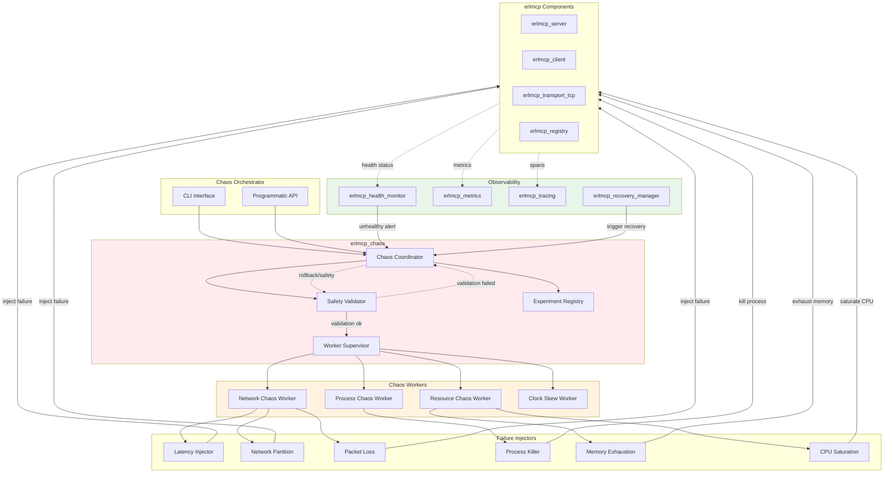
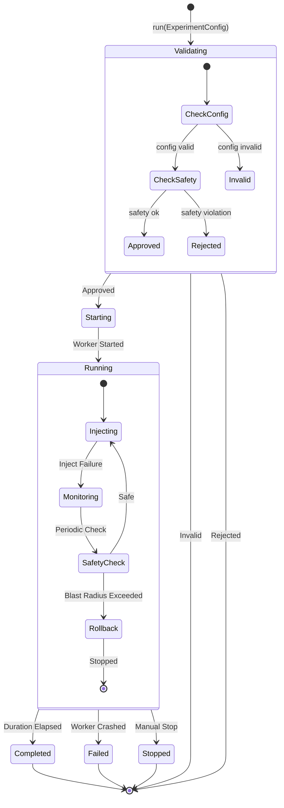
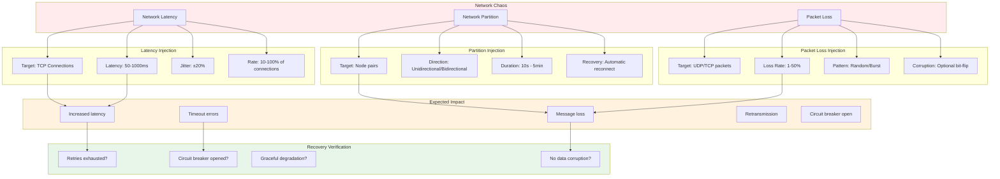
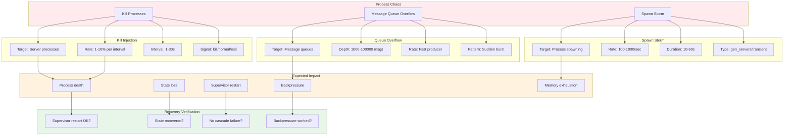
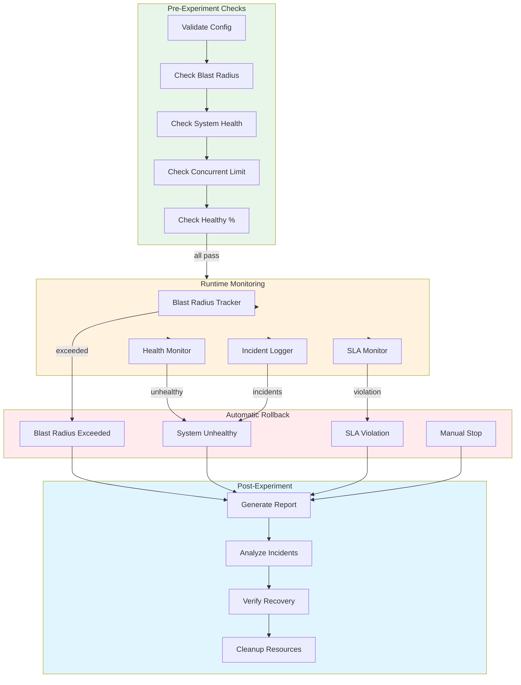
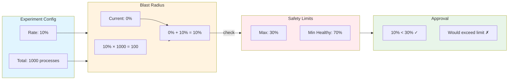
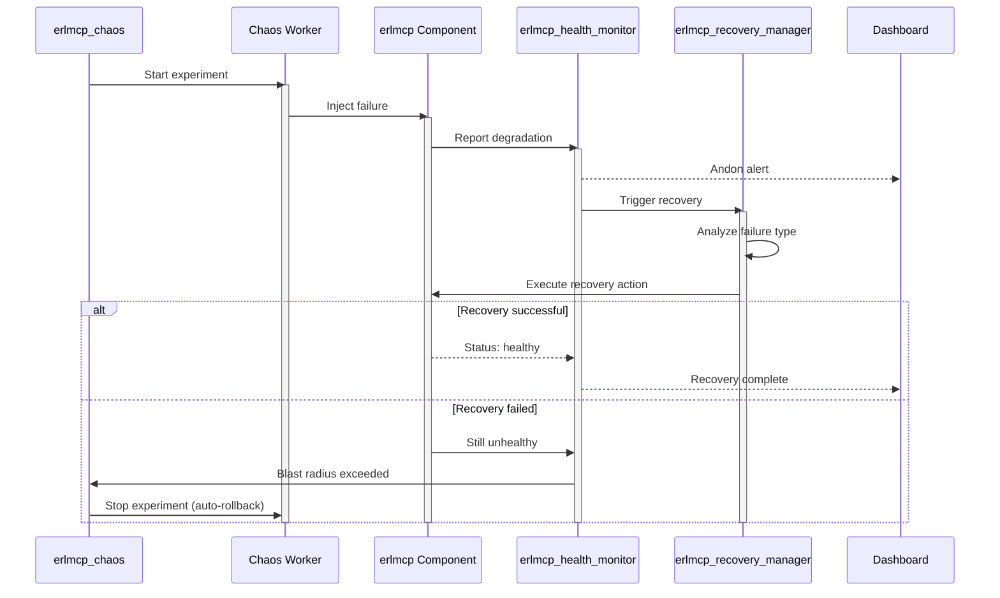

# erlmcp Chaos Engineering

## Overview

erlmcp provides a comprehensive chaos engineering framework for testing system resilience through controlled failure injection. The framework follows Toyota Production System principles (Kaizen - continuous improvement through controlled stress testing).

## Architecture



## Experiment Lifecycle



## Failure Scenarios

### Network Chaos



### Process Chaos



### Resource Chaos

```mermaid
flowchart TB
    subgraph ResourceChaos["Resource Chaos"]
        Memory[Memory Exhaustion]
        CPU[CPU Saturation]
        Disk[Disk Full]
        ETS[ETS Table Full]
    end

    subgraph MemoryDetails["Memory Injection"]
        M1[Target: Process heap]
        M2[Allocation: Binary spam]
        M3[Rate: 10-100 MB/s]
        M4[Duration: Until OOM]
    end

    subgraph CPUDetails["CPU Injection"]
        C1[Target: Scheduler]
        C2[Load: Busy spin]
        C3[Rate: 100% utilization]
        C4[Duration: 10-60s]
    end

    subgraph DiskDetails["Disk Injection"]
        D1[Target: Disk space]
        D2[Method: Fill temp dir]
        D3[Rate: 1-10 GB/s]
        D4[Cleanup: Auto delete]
    end

    subgraph ETSDetails["ETS Injection"]
        E1[Target: ETS tables]
        E2[Method: Create tables]
        E3[Rate: 1000 tables/s]
        E4[Limit: Until system limit]
    end

    subgraph Impact["Expected Impact"]
        I1[OOM killer]
        I2[Scheduler starvation]
        I3[Write failures]
        I4[ETS limit errors]
        I5[Swap thrashing]
    end

    subgraph Recovery["Recovery Verification"]
        R1[Memory guard triggered?]
        R2[CPU quota enforced?]
        R3[Graceful shutdown?]
        R4[No data corruption?]
    end

    Memory --> M1
    Memory --> M2
    Memory --> M3
    Memory --> M4

    CPU --> C1
    CPU --> C2
    CPU --> C3
    CPU --> C4

    Disk --> D1
    Disk --> D2
    Disk --> D3
    Disk --> D4

    ETS --> E1
    ETS --> E2
    ETS --> E3
    ETS --> E4

    M2 --> I1
    C2 --> I2
    D2 --> I3
    E2 --> I4

    I1 --> R1
    I2 --> R2
    I3 --> R3
    I4 --> R4

    style ResourceChaos fill:#ffebee
    style Impact fill:#fff3e0
    style Recovery fill:#e8f5e9
```



## Safety Controls



### Blast Radius Calculation



## Experiment Examples

### Network Latency Experiment

```erlang
% Run network latency experiment
Config = #{
    experiment => network_latency,
    target => erlmcp_transport_tcp,
    latency => 100,              % 100ms latency
    jitter => 20,                % ±20% jitter
    rate => 0.1,                 % Affect 10% of connections
    interval => 10000,           % Inject every 10s
    duration => 300000,          % Run for 5 minutes
    max_blast_radius => 0.2,     % Max 20% of system
    auto_rollback => true,
    safety_checks => true,
    sla_threshold => #{
        latency_p99_us => 5000000,  % Max 5s P99
        error_rate_5m => 0.10          % Max 10% error rate
    }
},

{ok, ExpId} = erlmcp_chaos:run(Config),

% Monitor experiment
{ok, Status} = erlmcp_chaos:get_experiment_status(ExpId),

% Stop if needed
erlmcp_chaos:stop_experiment(ExpId).
```

**Expected Behavior:**
- Latency increases to 100ms for 10% of connections
- P99 latency increases but stays < 5s
- Error rate increases but stays < 10%
- Circuit breakers may open for slow connections
- System recovers when experiment stops

### Process Kill Experiment

```erlang
% Kill random server processes
Config = #{
    experiment => kill_servers,
    target => erlmcp_server,
    rate => 0.05,               % Kill 5% per interval
    interval => 30000,          % Check every 30s
    duration => 600000,         % Run for 10 minutes
    max_blast_radius => 0.1,    % Max 10% of servers
    auto_rollback => true,
    safety_checks => true,
    sla_threshold => #{
        connections_total => 0,     % Min 0 connections
        error_rate_5m => 0.20       % Max 20% error rate
    }
},

{ok, ExpId} = erlmcp_chaos:run(Config).
```

**Expected Behavior:**
- 5% of server processes killed every 30s
- Supervisors restart processes automatically
- Brief connection errors during restart
- No cascade failures
- System recovers within 5s per kill

### Memory Exhaustion Experiment

```erlang
% Exhaust memory to test OOM handling
Config = #{
    experiment => resource_memory,
    rate => 0.9,                % Fill to 90% of available
    interval => 5000,           % Check every 5s
    duration => 120000,         % Run for 2 minutes
    max_blast_radius => 0.2,    % Affect single node only
    auto_rollback => true,
    safety_checks => true,
    sla_threshold => #{
        memory_heap_mib_per_conn => 500,  % Max 500 MiB
        process_count => 0.8              % Max 80% of limit
    }
},

{ok, ExpId} = erlmcp_chaos:run(Config).
```

**Expected Behavior:**
- Memory fills to 90% of available
- Memory guard triggers alarms
- Memory monitor triggers recovery
- Processes restart if needed
- System recovers when experiment stops

**CAUTION:** This experiment can cause system instability. Run with extreme caution in production.

## Dry Run Mode

```erlang
% Simulate experiment without actual damage
Config = #{
    experiment => network_latency,
    target => erlmcp_transport_tcp,
    rate => 0.5,
    duration => 60000
},

{ok, Report} = erlmcp_chaos:dry_run(Config).

% Report includes:
% - experiment_type: network_latency
% - estimated_affected: 50 (estimated processes affected)
% - estimated_blast_radius: 0.5
% - safety_checks: #{passes_safety_checks => true}
% - estimated_duration: 60000 (1 minute)
% - risks: [<<"May cause timeout cascades">>, ...]
% - recommendations: [<<"Start with lower rate">>, ...]
```

## Chaos Reports

```erlang
% Get comprehensive chaos report
Report = erlmcp_chaos:get_chaos_report().

% Report structure:
#{
    timestamp => {1738, 360000, 0},
    total_experiments => 15,
    active_experiments => 2,
    completed_experiments => 10,
    failed_experiments => 3,
    total_incidents => 45,
    current_blast_radius => 0.15,
    safety_enabled => true,
    monitor_integration => true,
    experiments => [
        #{
            id => <<"chaos_1738360000_123456">>,
            type => network_latency,
            state => running,
            start_time => {1738, 360000, 0},
            targets_affected => 42,
            total_targets => 420,
            blast_radius => 0.10,
            incidents => [
                {timeout, <<"connection_timeout">>, ...},
                {circuit_breaker, <<"opened_slow_endpoint">>, ...}
            ],
            metrics => #{
                latency_p50_us => 50000,
                latency_p99_us => 250000,
                error_rate => 0.02
            }
        },
        ...
    ]
}.
```

## Configuration

### Production Safety Limits

```erlang
{erlmcp_observability, [
    {chaos_enabled, true},  % Enable in production for resilience testing

    {chaos, #{
        safety_enabled => true,
        monitor_integration => true,
        global_limits => #{
            max_concurrent_experiments => 3,
            max_global_blast_radius => 0.3,      % 30% max across all
            min_healthy_components => 0.7        % 70% must stay healthy
        },

        default_config => #{
            max_blast_radius => 0.1,             % 10% per experiment
            auto_rollback => true,
            safety_checks => true,
            duration => 300000                   % 5 minutes max
        }
    }}
]}.
```

### Development Configuration

```erlang
{erlmcp_observability, [
    {chaos_enabled, true},

    {chaos, #{
        safety_enabled => true,
        monitor_integration => true,
        global_limits => #{
            max_concurrent_experiments => 5,
            max_global_blast_radius => 0.5,
            min_healthy_components => 0.5
        },

        default_config => #{
            max_blast_radius => 0.3,
            auto_rollback => true,
            safety_checks => true,
            duration => 120000
        }
    }}
]}.
```

## Best Practices

### 1. Progressive Testing

```erlang
% GOOD: Start small, increase gradually
% Step 1: 1% latency, 10s duration
Config1 = #{experiment => network_latency, rate => 0.01, duration => 10000},

% Step 2: 5% latency, 30s duration
Config2 = #{experiment => network_latency, rate => 0.05, duration => 30000},

% Step 3: 10% latency, 60s duration
Config3 = #{experiment => network_latency, rate => 0.10, duration => 60000}.

% BAD: Start with maximum chaos
ConfigBad = #{experiment => network_latency, rate => 1.0, duration => 600000}.
```

### 2. Always Use Dry Run First

```erlang
% GOOD: Validate with dry run
{ok, DryRun} = erlmcp_chaos:dry_run(Config),
case maps:get(safety_checks, DryRun) of
    #{passes_safety_checks := true} ->
        erlmcp_chaos:run(Config);
    _ ->
        logger:error("Safety checks failed: ~p", [DryRun])
end.

% BAD: Run experiments without validation
erlmcp_chaos:run(UnvalidatedConfig).
```

### 3. Monitor During Experiments

```erlang
% GOOD: Continuous monitoring
{ok, ExpId} = erlmcp_chaos:run(Config),

monitor_experiment(ExpId).

monitor_experiment(ExpId) ->
    timer:sleep(5000),
    {ok, Status} = erlmcp_chaos:get_experiment_status(ExpId),
    case maps:get(state, Status) of
        running ->
            io:format("Blast radius: ~.2f, Incidents: ~p~n",
                     [maps:get(blast_radius, Status),
                      length(maps:get(incidents, Status))]),
            monitor_experiment(ExpId);
        _ ->
            ok
    end.
```

### 4. Set Realistic SLA Thresholds

```erlang
% GOOD: Based on baseline measurements
% Baseline: P99 = 100ms, Error rate = 0.5%
Config = #{
    sla_threshold => #{
        latency_p99_us => 1000000,   % 10x baseline
        error_rate_5m => 0.05        % 10x baseline
    }
}.

% BAD: Thresholds too tight (false rollbacks)
Config = #{
    sla_threshold => #{
        latency_p99_us => 110000,    % 1.1x baseline
        error_rate_5m => 0.006       % 1.2x baseline
    }
}.
```

### 5. Document Experiments

```erlang
% GOOD: Track experiments for Kaizen (continuous improvement)
-record(chaos_experiment_log, {
    timestamp :: erlang:timestamp(),
    experiment_type :: atom(),
    config :: map(),
    result :: success | failure | partial,
    incidents :: [term()],
    lessons_learned :: binary(),
    improvement_actions :: [binary()]
}).

% Store experiment results
mnesia:dirty_write(chaos_experiment_log, #chaos_experiment_log{
    timestamp = erlang:timestamp(),
    experiment_type = network_latency,
    config = Config,
    result = success,
    incidents = [],
    lessons_learned = <<"System handled 100ms latency well">>,
    improvement_actions = [<<"Consider testing 200ms">>]
}).
```

## Recovery Integration



## Troubleshooting

### Experiment Not Starting

```erlang
% Check safety validation
{ok, DryRun} = erlmcp_chaos:dry_run(Config),
maps:get(safety_checks, DryRun).

% Check system health
Health = erlmcp_health_monitor:get_system_health(),
maps:get(overall_status, Health).

% Check concurrent experiments
Active = erlmcp_chaos:get_active_experiments(),
length(Active).
```

### Unexpected Rollback

```erlang
% Check experiment status
{ok, Status} = erlmcp_chaos:get_experiment_status(ExpId),
maps:get(incidents, Status).

% Check system health
Health = erlmcp_health_monitor:get_system_health().

% Check current blast radius
Report = erlmcp_chaos:get_chaos_report(),
maps:get(current_blast_radius, Report).
```

### System Not Recovering

```erlang
% Check recovery manager
erlmcp_recovery_manager:get_recovery_status(ExpId).

% Manually stop all experiments
erlmcp_chaos:stop_all_experiments().

% Reset health status
erlmcp_health_monitor:reset_health_status().
```

## Further Reading

- [Observability README](README.md)
- [Health Monitoring](dashboard.md#health-monitoring-andon)
- [Recovery Manager](../architecture.md#recovery-management)
- [Toyota Production System Integration](../TCPS_HEALTH_SUMMARY.md)
