# erlmcp Dashboard & Health Monitoring

## Overview

erlmcp provides real-time observability dashboards with WebSocket-based metrics streaming, health monitoring (Andon), and alerting. The dashboard follows Toyota Production System principles for zero-defect quality with visible error signaling (Andon cords).

## Architecture


## WebSocket Protocol


## Health Monitoring (Andon)

```mermaid
flowchart TB
    subgraph System["erlmcp System"]
        subgraph Components["Monitored Components"]
            Server[erlmcp_server]
            Client[erlmcp_client]
            Registry[erlmcp_registry]
            Transport[erlmcp_transport_tcp]
        end

        subgraph Monitors["Health Monitors"]
            Process[Process Monitor]
            Memory[Memory Monitor]
            Connection[Connection Monitor]
            Queue[Message Queue Monitor]
        end
    end

    subgraph Andon["Andon System"]
        Health[erlmcp_health_monitor]
        Circuit[Circuit Breaker Tracker]
        Threshold[Threshold Validator]
        Alert[Alert Generator]
        Display[Andon Display]
    end

    subgraph States["Health States"]
        Healthy[Healthy ✓]
        Degraded[Degraded ⚠]
        Unhealthy[Unhealthy ✗]
        Unknown[Unknown ?]
    end

    subgraph Recovery["Recovery System"]
        Recovery[erlmcp_recovery_manager]
        AutoRollback[Auto Rollback]
        Manual[Manual Intervention]
    end

    Server -.->|monitor| Process
    Client -.->|monitor| Process
    Registry -.->|monitor| Process
    Transport -.->|monitor| Connection

    Process -->|"health status"| Health
    Memory -->|"memory usage"| Health
    Connection -->|"conn state"| Health
    Queue -->|"queue depth"| Health
    Circuit -->|"circuit state"| Health

    Health --> Threshold
    Threshold -->|"check vs limits"| Health

    Health -->|"aggregate"| States
    States --> Display

    Threshold -.->|"violation"| Alert
    Alert -->|"Andon signal"| Display
    Alert -->|"trigger"| Recovery

    Recovery --> AutoRollback
    Recovery -.->|"if auto fails"| Manual

    style Andon fill:#ffebee
    style States fill:#fff3e0
    style Recovery fill:#e1f5fe
```

### Andon Thresholds


## Dashboard UI Structure

```mermaid
graph TB
    subgraph Dashboard["Dashboard UI Layout"]
        Header[Header: erlmcp Observability]

        subgraph Row1["Top Row"]
            SystemHealth[System Health Card]
            Throughput[Throughput Card]
            Latency[Latency Card]
            Errors[Errors Card]
        end

        subgraph Row2["Middle Row"]
            Memory[Memory Chart]
            CPU[CPU Chart]
            Connections[Connections Chart]
            Queue[Queue Depth Chart]
        end

        subgraph Row3["Bottom Row"]
            Timeline[Metrics Timeline]
            Andon[Andon Alert Panel]
            Components[Component Health Table]
        end
    end

    subgraph Cards["Card Details"]
        SystemHealthCard[Overall: Healthy ✓<br/>Components: 42/42<br/>Uptime: 15d 4h]
        ThroughputCard[Rate: 372K msg/s<br/>Trend: ↗ +5%]
        LatencyCard[p50: 2.3ms<br/>p95: 8.1ms<br/>p99: 15.2ms]
        ErrorsCard[Rate: 0.02%<br/>Total: 1,234]
    end

    subgraph Charts["Real-time Charts"]
        MemoryChart[Heap Size (MiB)<br/>┌────────┐<br/>│ ░░░░░░ │<br/>│ ░░░░░░ │<br/>└────────┘]
        CPUChart[Scheduler Util<br/>┌────────┐<br/>│ ░░░░░░ │<br/>│ ░░░░░░ │<br/>└────────┘]
    end

    subgraph AndonPanel["Andon Alerts"]
        Alert1[⚠ WARNING: High latency (15.2ms)]
        Alert2[✗ CRITICAL: Circuit breaker open]
        Alert3[✓ INFO: Component recovered]
    end

    SystemHealth --> SystemHealthCard
    Throughput --> ThroughputCard
    Latency --> LatencyCard
    Errors --> ErrorsCard

    Memory --> MemoryChart
    CPU --> CPUChart

    Andon --> AndonPanel

    style Dashboard fill:#f3e5f5
    style Cards fill:#e8f5e9
    style AndonPanel fill:#ffebee
```

## Metrics Collection Flow


## Health Check Flow


## Alerting Patterns

```mermaid
flowchart LR
    subgraph Triggers["Alert Triggers"]
        MemAlert[Memory > 95%]
        CPUAlert[CPU > 90%]
        ErrorAlert[Error Rate > 5%]
        LatencyAlert[P99 Latency > 1s]
        ConnAlert[Conn Failures > 100/min]
        CircuitAlert[Circuit Breaker Open]
    end

    subgraph Severities["Alert Severities"]
        INFO[ℹ️ Info]
        WARNING[⚠️ Warning]
        CRITICAL[🚨 Critical]
    end

    subgraph Actions["Alert Actions"]
        Log[Log to File]
        Dashboard[Show on Dashboard]
        Webhook[Send Webhook]
        Email[Send Email]
        Slack[Post to Slack]
        PagerDuty[Trigger PagerDuty]
    end

    MemAlert --> CRITICAL
    CPUAlert --> WARNING
    ErrorAlert --> WARNING
    LatencyAlert --> WARNING
    ConnAlert --> CRITICAL
    CircuitAlert --> CRITICAL

    INFO --> Log
    INFO --> Dashboard

    WARNING --> Log
    WARNING --> Dashboard
    WARNING --> Slack

    CRITICAL --> Log
    CRITICAL --> Dashboard
    CRITICAL --> Webhook
    CRITICAL --> Email
    CRITICAL --> Slack
    CRITICAL --> PagerDuty

    style Triggers fill:#fff3e0
    style Severities fill:#e1f5fe
    style Actions fill:#ffebee
```



## Dashboard Endpoints

### HTTP Endpoints

```erlang
% Static files
GET  /                           % Dashboard UI (index.html)
GET  /static/*                   % CSS, JS, images

% WebSocket
GET  /ws                         % WebSocket endpoint

% Metrics API
GET  /api/metrics                % Current metrics (JSON)
GET  /api/metrics/historical     % Historical metrics
GET  /api/metrics/export         % Export metrics (CSV/JSON)

% Health API
GET  /api/health                 % System health
GET  /api/health/components      % Component health
GET  /api/health/monitors        % Monitor states

% Andon API
GET  /api/andon/alerts           % Active alerts
GET  /api/andon/thresholds       % Current thresholds
POST /api/andon/acknowledge      % Acknowledge alert
```

### WebSocket Messages

```erlang
% Server -> Client
{<<"type">> := <<"connected">>, client_id := binary()}.
{<<"type">> := <<"metrics">>, data := #{}}.
{<<"type">> := <<"alert">>, severity := binary(), message := binary()}.
{<<"type">> := <<"subscribed">>, metrics := [binary()]}.
{<<"type">> := <<"pong">>, timestamp := integer()}.

% Client -> Server
{<<"type">> := <<"subscribe">>, metrics := [binary()]}.
{<<"type">> := <<"subscribe">>, filter := #{<<"types">> := [binary()]}}.
{<<"type">> := <<"unsubscribe">>}.
{<<"type">> := <<"ping">>}.
```

## Configuration

### Production Configuration

```erlang
{erlmcp_observability, [
    {dashboard_enabled, true},
    {dashboard_port, 9090},

    {dashboard, #{
        refresh_interval => 1000,       % 1 second
        metrics_history => 3600,        % 1 hour
        max_websocket_clients => 100
    }},

    {health_monitor, #{
        enabled => true,
        check_interval => 30000,        % 30 seconds
        thresholds => #{
            memory_heap_mib_per_conn => 100,
            latency_p99_us => 1000000,
            error_rate_5m => 0.05,
            connection_failures_1m => 100,
            scheduler_utilization => 0.9
        }
    }},

    {alerting, #{
        enabled => true,
        webhooks => ["https://alerts.example.com/webhook"],
        slack_webhook => "https://hooks.slack.com/services/...",
        pagerduty_integration_key => "...",
        email_recipients => ["ops@example.com"]
    }}
]}.
```

### Development Configuration

```erlang
{erlmcp_observability, [
    {dashboard_enabled, true},
    {dashboard_port, 9090},

    {dashboard, #{
        refresh_interval => 500,        % 500ms (faster updates)
        metrics_history => 300,         % 5 minutes
        max_websocket_clients => 10
    }},

    {health_monitor, #{
        enabled => true,
        check_interval => 10000,        % 10 seconds (more frequent)
        thresholds => #{
            memory_heap_mib_per_conn => 500,  % More lenient
            latency_p99_us => 5000000,
            error_rate_5m => 0.10
        }
    }},

    {alerting, #{
        enabled => false  % Disable external alerts in dev
    }}
]}.
```

## Andon Usage

### Andon Cord (Manual Stop)

```erlang
% Pull Andon cord (stop accepting traffic)
erlmcp_health_monitor:report_degradation(erlmcp_server).

% This will:
% 1. Mark component as degraded
% 2. Open circuit breakers
% 3. Trigger alerting
% 4. Initiate recovery
```

### Andon Reset

```erlang
% Reset all health status (after issue resolved)
erlmcp_health_monitor:reset_health_status().

% This will:
% 1. Clear all unhealthy states
% 2. Close circuit breakers
% 3. Resume normal operations
```

### Component Health Query

```erlang
% Get system health
Health = erlmcp_health_monitor:get_system_health().
% #{overall_status => healthy,
%   system_metrics => #{...},
%   component_health => #{...},
%   active_alerts => [...]}

% Get specific component
Status = erlmcp_health_monitor:get_component_health(erlmcp_server).
% healthy | unhealthy | degraded | unknown

% Get all components
AllHealth = erlmcp_health_monitor:get_all_component_health().
% #{erlmcp_server => #{status => healthy, ...},
%   erlmcp_client => #{status => healthy, ...},
%   ...}
```

## Best Practices

### 1. Andon Integration

```erlang
% GOOD: Integrate Andon with circuit breakers
case error_rate() of
    Rate when Rate > 0.05 ->
        erlmcp_health_monitor:report_degradation(my_component),
        erlmcp_circuit_breaker:open(my_circuit);
    _ ->
        ok
end.

% GOOD: Report circuit breaker state
erlmcp_health_monitor:report_circuit_breaker(
    my_component,
    erlmcp_circuit_breaker:get_state(my_circuit)
).
```

### 2. Threshold Tuning

```erlang
% GOOD: Set thresholds based on baseline
% Baseline: P99 latency = 100ms, Error rate = 0.5%
% Set thresholds at 10x baseline
{thresholds, #{
    latency_p99_us => 1000000,  % 10x
    error_rate_5m => 0.05       % 10x
}}.

% BAD: Thresholds too sensitive (false alarms)
{thresholds, #{
    latency_p99_us => 100000   % 1.1x baseline
}}.
```

### 3. Alert Fatigue Prevention

```erlang
% GOOD: Alert on persistent issues
{alerting, #{
    min_alert_interval => 60000,  % Max 1 alert/minute
    aggregate_alerts => true,      % Aggregate similar alerts
    alert_cooldown => 300          % 5 min cooldown after resolution
}}.

% BAD: Alert on every single error
% This creates alert fatigue and causes ops to ignore alerts
```

### 4. Dashboard Performance

```erlang
% GOOD: Filter metrics at source
Client -> Server: {subscribe, #{types => [<<"cpu">>, <<"memory">>]}}

% BAD: Send all metrics, filter on client
% This wastes network bandwidth and CPU
```

### 5. Graceful Degradation

```erlang
% GOOD: Dashboard continues if aggregator is down
case whereis(erlmcp_metrics_aggregator) of
    undefined ->
        #{error => <<"aggregator_not_started">>};
    _Pid ->
        erlmcp_metrics_aggregator:get_current_metrics()
end.
```

## Troubleshooting

### Dashboard Not Loading

```erlang
% Check if dashboard server is running
erlmcp_dashboard_server:get_port().
% {ok, 9090} | {error, not_started}

% Check port availability
net_adm:localhost_name().
% Should return hostname

% Check firewall
% telnet localhost 9090
```

### Metrics Not Updating

```erlang
% Check if metrics aggregator is running
whereis(erlmcp_metrics_aggregator).
% Should return PID

% Check if metrics are being recorded
erlmcp_metrics:counter(<<"test_counter">>).
% Then check: erlmcp_metrics:get(<<"test_counter">>).
```

### Health Checks Failing

```erlang
% Check component registration
erlmcp_health_monitor:get_all_component_health().

% Trigger manual health check
erlmcp_health_monitor:trigger_health_check(erlmcp_server).

% Check thresholds
erlmcp_health_monitor:get_health_check_config(erlmcp_server).
```

### WebSocket Connection Issues

```erlang
% Check WebSocket handler
% Browser console should show:
% WebSocket connection established
% {type: "connected", client_id: "client_..."}

% If not, check:
% 1. Port is accessible
% 2. Firewall allows WebSocket
% 3. No proxy interfering
```

## Further Reading

- [Observability README](README.md)
- [Metrics Collection](metrics.md)
- [Distributed Tracing](tracing.md)
- [Chaos Engineering](chaos.md)
- [Toyota Production System Integration](../TCPS_HEALTH_SUMMARY.md)
