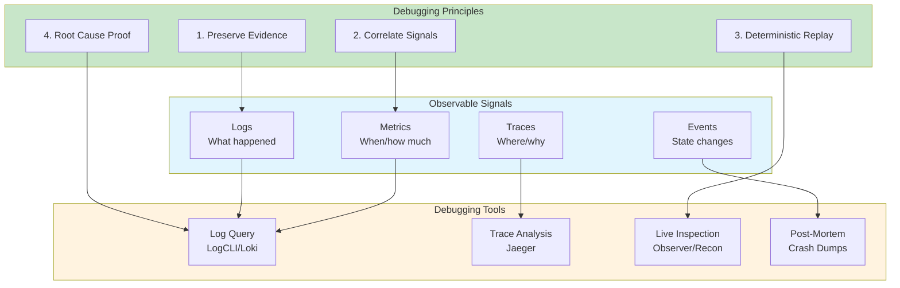
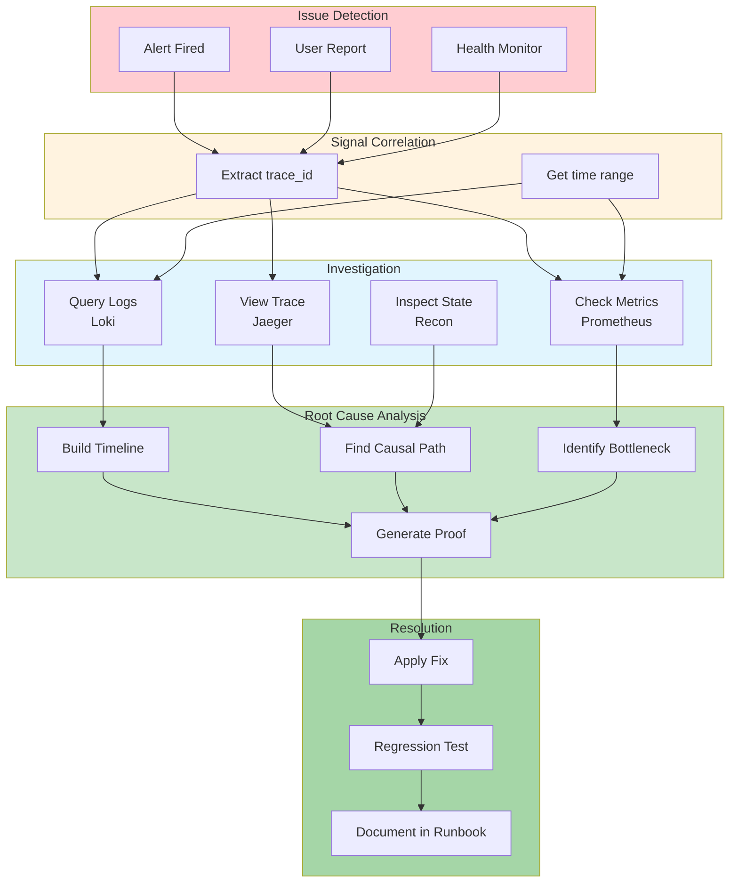

# Debugging Distributed erlmcp Systems

**Version:** 2.1.0
**Last Updated:** February 6, 2026

## Overview

Debugging distributed erlmcp systems requires operator-first tools, deterministic replay, and correlation across logs/metrics/traces. All debugging operations use Docker-only execution with evidence preservation for root cause analysis.

## Debugging Philosophy

### Operator-First Debugging



## Distributed Debugging Architecture



## Docker-Only Debugging Tools

### Live System Inspection

```bash
#!/bin/bash
# Debug running erlmcp node (Docker-only)

set -euo pipefail

NODE=${1:-erlmcp-node1}

echo "🔍 Debugging ${NODE}..."

# 1. System Overview
echo "=== System Overview ==="
docker compose exec ${NODE} erl_call -a 'erlang system_info allocator' \
  | head -20

# 2. Process Count
echo "=== Process Count ==="
docker compose exec ${NODE} erl_call -a 'erlang system_info process_count'

# 3. Memory Usage
echo "=== Memory Usage ==="
docker compose exec ${NODE} erl_call -a 'erlang memory' \
  | jq '.'

# 4. Top Processes by Memory
echo "=== Top 10 Processes (Memory) ==="
docker compose exec ${NODE} erl_call -a '
  recon:proc_count(memory, 10)
'

# 5. Top Processes by Message Queue
echo "=== Top 10 Processes (Message Queue) ==="
docker compose exec ${NODE} erl_call -a '
  recon:proc_count(message_queue_len, 10)
'

# 6. Top Processes by Reductions (CPU)
echo "=== Top 10 Processes (CPU) ==="
docker compose exec ${NODE} erl_call -a '
  recon:proc_count(reductions, 10)
'

# 7. Scheduler Utilization
echo "=== Scheduler Utilization ==="
docker compose exec ${NODE} erl_call -a '
  erlang:statistics(scheduler_wall_time)
'

# 8. Port Count
echo "=== Port Count ==="
docker compose exec ${NODE} erl_call -a '
  erlang:system_info(port_count)
'

# 9. ETS Tables
echo "=== ETS Table Count ==="
docker compose exec ${NODE} erl_call -a '
  length(ets:all())
'

# 10. Application Status
echo "=== Application Status ==="
docker compose exec ${NODE} erl_call -a '
  application:which_applications()
'
```

### Trace-Driven Debugging

```bash
#!/bin/bash
# Debug request by trace_id (Docker-only)

set -euo pipefail

TRACE_ID=${1:?Usage: $0 TRACE_ID}

echo "🔍 Debugging trace: ${TRACE_ID}"

# 1. Find all logs for this trace
echo "=== Logs for trace ${TRACE_ID} ==="
docker compose run --rm logcli \
  --addr=http://loki:3100 \
  query "{trace_id=\"${TRACE_ID}\"}" \
  --output=jsonl \
  | tee "/tmp/trace_${TRACE_ID}_logs.jsonl"

# 2. Get trace from Jaeger
echo "=== Trace Visualization ==="
docker compose exec jaeger-query curl -s \
  "http://localhost:16686/api/traces/${TRACE_ID}" \
  | jq '.' \
  | tee "/tmp/trace_${TRACE_ID}.json"

# 3. Extract span durations
echo "=== Span Durations ==="
jq -r '.data[0].spans[] | "\(.operationName): \(.duration)us"' \
  "/tmp/trace_${TRACE_ID}.json" \
  | sort -t: -k2 -rn

# 4. Check for errors in trace
echo "=== Errors in Trace ==="
jq -r '.data[0].spans[] | select(.tags[] | select(.key=="error" and .value==true)) | .operationName' \
  "/tmp/trace_${TRACE_ID}.json"

# 5. Build timeline
echo "=== Timeline ==="
jq -r '.data[0].spans[] | "\(.startTime/1000000 | strftime("%H:%M:%S")) \(.operationName) [\(.duration/1000)ms]"' \
  "/tmp/trace_${TRACE_ID}.json" \
  | sort

# 6. Critical path analysis
echo "=== Critical Path ==="
docker compose run --rm erlmcp-trace-analyzer \
  critical-path --trace-id "${TRACE_ID}" \
  --output "/results/critical_path_${TRACE_ID}.txt"

echo "✅ Debug artifacts saved to /tmp/trace_${TRACE_ID}*"
```

### Correlate Metrics with Logs

```bash
#!/bin/bash
# Correlate spike in metrics with logs (Docker-only)

set -euo pipefail

METRIC=${1:?Usage: $0 METRIC [TIME_RANGE]}
TIME_RANGE=${2:-1h}

echo "🔍 Investigating ${METRIC} spike in last ${TIME_RANGE}"

# 1. Find spike timestamp
echo "=== Detecting Spike ==="
SPIKE_TIME=$(docker compose exec prometheus \
  promtool query range \
    'http://localhost:9090' \
    "${METRIC}" \
    --start="$(date -d "${TIME_RANGE} ago" --iso-8601=seconds)" \
    --end="$(date --iso-8601=seconds)" \
    --step=1m \
  | jq -r '.data.result[0].values | max_by(.[1])[0]')

echo "Spike detected at: $(date -d @${SPIKE_TIME})"

# 2. Get logs around spike (±5 minutes)
echo "=== Logs Around Spike ==="
docker compose run --rm logcli \
  --addr=http://loki:3100 \
  query '{service="erlmcp"}' \
  --from="$(date -d @$((SPIKE_TIME - 300)) --iso-8601=seconds)" \
  --to="$(date -d @$((SPIKE_TIME + 300)) --iso-8601=seconds)" \
  --limit=1000 \
  --output=jsonl \
  | tee "/tmp/spike_${METRIC}_logs.jsonl"

# 3. Analyze log patterns
echo "=== Top Error Types ==="
jq -r '.what' "/tmp/spike_${METRIC}_logs.jsonl" \
  | sort | uniq -c | sort -rn | head -10

# 4. Find trace IDs around spike
echo "=== Trace IDs Around Spike ==="
jq -r 'select(.trace_id != null) | .trace_id' \
  "/tmp/spike_${METRIC}_logs.jsonl" \
  | sort -u \
  | head -10

echo "✅ Investigation saved to /tmp/spike_${METRIC}_logs.jsonl"
```

## Common Debugging Scenarios

### Scenario 1: High Latency Investigation

```bash
#!/bin/bash
# Debug high latency (Docker-only)

set -euo pipefail

echo "🔍 Investigating high latency..."

# Step 1: Confirm high latency from metrics
P99=$(docker compose exec prometheus \
  promtool query instant \
    'http://localhost:9090' \
    'histogram_quantile(0.99, rate(erlmcp_request_latency_us_bucket[5m]))' \
  | jq -r '.data.result[0].value[1]')

echo "Current P99 latency: ${P99}us ($(echo "$P99 / 1000" | bc)ms)"

# Step 2: Find slow traces
echo "=== Slow Traces (>1s) ==="
docker compose exec jaeger-query curl -s \
  'http://localhost:16686/api/traces?service=erlmcp&minDuration=1s&limit=10' \
  | jq -r '.data[] | .traceID' \
  | while read TRACE_ID; do
    echo "Trace: ${TRACE_ID}"
    docker compose exec jaeger-query curl -s \
      "http://localhost:16686/api/traces/${TRACE_ID}" \
      | jq -r '.data[0].spans | sort_by(.duration) | reverse | .[0] | "\(.operationName): \(.duration/1000)ms"'
  done

# Step 3: Check for CPU saturation
echo "=== CPU Usage ==="
docker stats --no-stream --format "table {{.Name}}\t{{.CPUPerc}}" \
  | grep erlmcp

# Step 4: Check for lock contention
echo "=== Lock Contention ==="
docker compose exec erlmcp-node1 erl_call -a '
  recon:get_state(erlmcp_registry)
' | jq '.locks'

# Step 5: Check message queue depths
echo "=== Message Queue Depths ==="
docker compose exec erlmcp-node1 erl_call -a '
  [{Pid, process_info(Pid, message_queue_len)} || Pid <- processes(), element(2, process_info(Pid, message_queue_len)) > 100]
'

# Step 6: Profile top slow operation
echo "=== Profiling Slow Operation ==="
SLOW_SPAN=$(docker compose exec jaeger-query curl -s \
  'http://localhost:16686/api/traces?service=erlmcp&minDuration=1s&limit=1' \
  | jq -r '.data[0].spans | sort_by(.duration) | reverse | .[0].operationName')

echo "Slowest operation: ${SLOW_SPAN}"

# Recommendation
echo "
📊 Diagnosis:
- P99 Latency: ${P99}us
- Slowest Operation: ${SLOW_SPAN}

🔧 Recommended Actions:
1. Profile ${SLOW_SPAN} with fprof
2. Check for database query slowness
3. Review algorithm complexity
4. Consider caching
"
```

### Scenario 2: Memory Leak Detection

```bash
#!/bin/bash
# Detect memory leaks (Docker-only)

set -euo pipefail

NODE=${1:-erlmcp-node1}
INTERVAL=${2:-60}  # seconds

echo "🔍 Memory leak detection on ${NODE} (${INTERVAL}s snapshots)..."

# Take baseline snapshot
echo "Taking baseline snapshot..."
BASELINE=$(docker compose exec ${NODE} erl_call -a 'erlang:memory(total)')
echo "Baseline: $((BASELINE / 1024 / 1024)) MiB"

# Wait
sleep ${INTERVAL}

# Take second snapshot
SNAPSHOT1=$(docker compose exec ${NODE} erl_call -a 'erlang:memory(total)')
echo "Snapshot 1: $((SNAPSHOT1 / 1024 / 1024)) MiB"

# Calculate growth rate
GROWTH1=$((SNAPSHOT1 - BASELINE))
echo "Growth: $((GROWTH1 / 1024 / 1024)) MiB in ${INTERVAL}s"

# Wait again
sleep ${INTERVAL}

# Take third snapshot
SNAPSHOT2=$(docker compose exec ${NODE} erl_call -a 'erlang:memory(total)')
echo "Snapshot 2: $((SNAPSHOT2 / 1024 / 1024)) MiB"

GROWTH2=$((SNAPSHOT2 - SNAPSHOT1))
echo "Growth: $((GROWTH2 / 1024 / 1024)) MiB in ${INTERVAL}s"

# Check if leak detected (consistent growth)
if [ ${GROWTH1} -gt 0 ] && [ ${GROWTH2} -gt 0 ]; then
  RATIO=$(echo "scale=2; ${GROWTH2} / ${GROWTH1}" | bc)

  if (( $(echo "${RATIO} > 0.8 && ${RATIO} < 1.2" | bc -l) )); then
    echo "❌ MEMORY LEAK DETECTED (consistent growth)"

    # Find top memory consumers
    echo "=== Top Memory Consumers ==="
    docker compose exec ${NODE} erl_call -a '
      recon:proc_count(memory, 10)
    '

    # Check for binary leaks
    echo "=== Binary Leak Check ==="
    docker compose exec ${NODE} erl_call -a '
      recon:bin_leak(10)
    '

    # Get process info for top consumer
    TOP_PID=$(docker compose exec ${NODE} erl_call -a '
      element(1, hd(recon:proc_count(memory, 1)))
    ')

    echo "=== Top Consumer Details (${TOP_PID}) ==="
    docker compose exec ${NODE} erl_call -a "
      recon:info(${TOP_PID})
    "

    # Recommendation
    echo "
🔧 Recommended Actions:
1. Review process ${TOP_PID} for accumulation
2. Check for unprocessed messages
3. Look for growing ETS tables
4. Consider heap dump: recon:proc_window(${TOP_PID}, 10, fun(Pid, Mem) -> {Pid, Mem} end)
    "
  else
    echo "✅ Growth rate not consistent (ratio: ${RATIO})"
  fi
else
  echo "✅ No memory growth detected"
fi
```

### Scenario 3: Network Partition Recovery

```bash
#!/bin/bash
# Debug network partition (Docker-only)

set -euo pipefail

echo "🔍 Network partition debugging..."

# Check cluster connectivity
echo "=== Cluster Connectivity ==="
for NODE in erlmcp-node1 erlmcp-node2 erlmcp-node3; do
  echo "Checking ${NODE}..."

  # Get visible nodes
  VISIBLE=$(docker compose exec ${NODE} erl_call -a 'nodes()')
  echo "${NODE} sees: ${VISIBLE}"

  # Ping other nodes
  for TARGET in erlmcp-node1 erlmcp-node2 erlmcp-node3; do
    if [ "${NODE}" != "${TARGET}" ]; then
      PING_RESULT=$(docker compose exec ${NODE} erl_call -a "net_adm:ping('${TARGET}@erlmcp')")
      echo "  ${NODE} -> ${TARGET}: ${PING_RESULT}"
    fi
  done
done

# Check for split-brain
echo "=== Split-Brain Detection ==="
ALL_NODES=$(docker compose exec erlmcp-node1 erl_call -a '
  [node() | nodes()]
')
NODE_COUNT=$(echo "${ALL_NODES}" | jq 'length')

EXPECTED_NODES=3

if [ ${NODE_COUNT} -lt ${EXPECTED_NODES} ]; then
  echo "❌ PARTITION DETECTED: ${NODE_COUNT}/${EXPECTED_NODES} nodes visible"

  # Find isolated nodes
  echo "=== Isolated Nodes ==="
  for NODE in erlmcp-node1 erlmcp-node2 erlmcp-node3; do
    STATUS=$(docker compose ps ${NODE} --format json | jq -r '.State')
    if [ "${STATUS}" != "running" ]; then
      echo "${NODE}: ${STATUS} (container down)"
    else
      VISIBLE=$(docker compose exec ${NODE} erl_call -a 'length(nodes())')
      if [ "${VISIBLE}" -eq 0 ]; then
        echo "${NODE}: isolated (sees 0 nodes)"
      fi
    fi
  done

  # Check network
  echo "=== Network Status ==="
  docker network inspect erlmcp-cluster \
    | jq -r '.[0].Containers | to_entries[] | "\(.value.Name): \(.value.IPv4Address)"'

  # Recommendation
  echo "
🔧 Recovery Actions:
1. Check Docker network: docker network inspect erlmcp-cluster
2. Restart isolated nodes: docker compose restart erlmcp-node1
3. Force cluster rejoin: docker compose exec erlmcp-node1 erl_call -a 'erlmcp_cluster:force_join()'
4. Monitor recovery: watch -n1 'docker compose exec erlmcp-node1 erl_call -a \"nodes()\"'
  "
else
  echo "✅ All nodes connected (${NODE_COUNT}/${EXPECTED_NODES})"
fi
```

### Scenario 4: Crash Dump Analysis

```bash
#!/bin/bash
# Analyze crash dump (Docker-only)

set -euo pipefail

DUMP_FILE=${1:?Usage: $0 DUMP_FILE}

echo "🔍 Analyzing crash dump: ${DUMP_FILE}"

# Copy dump file from container
CONTAINER=$(docker compose ps -q erlmcp-node1)
docker cp "${CONTAINER}:/app/erl_crash.dump" "${DUMP_FILE}"

# Parse crash dump
echo "=== Crash Reason ==="
grep "Slogan:" "${DUMP_FILE}"

# Extract processes
echo "=== Process Count ==="
grep "^=" "${DUMP_FILE}" | grep "proc:" | wc -l

# Find crashed process
echo "=== Crashed Process ==="
awk '/=proc:.*{name,.*}/,/=proc_stack:/' "${DUMP_FILE}" | head -50

# Extract memory info
echo "=== Memory At Crash ==="
grep "^total:" "${DUMP_FILE}"
grep "^processes:" "${DUMP_FILE}"
grep "^ets:" "${DUMP_FILE}"

# Extract last messages
echo "=== Last Messages ==="
awk '/=proc_messages/,/^=/' "${DUMP_FILE}" | head -20

# Load into crashdump_viewer (if available)
echo "=== Opening in Crash Dump Viewer ==="
docker compose run --rm -v "$(pwd)/${DUMP_FILE}:/dump" \
  erlang:26 \
  erl -eval "crashdump_viewer:start('/dump'), timer:sleep(infinity)"

echo "
📊 Crash Dump Summary:
- File: ${DUMP_FILE}
- Slogan: $(grep 'Slogan:' ${DUMP_FILE} | cut -d: -f2)

🔧 Next Steps:
1. Review crashed process stack trace
2. Check last messages received
3. Correlate with logs around crash time
4. File bug report with dump and reproduction steps
"
```

## Deterministic Replay

### Capture Request/Response for Replay

```bash
#!/bin/bash
# Capture traffic for replay (Docker-only)

set -euo pipefail

OUTPUT_DIR=${1:-./captured_traffic}
DURATION=${2:-60}  # seconds

mkdir -p "${OUTPUT_DIR}"

echo "📼 Capturing traffic for ${DURATION}s..."

# Capture with tcpdump
docker compose exec erlmcp-node1 \
  tcpdump -i any -w "/tmp/capture.pcap" \
  "tcp port 8080" &

TCPDUMP_PID=$!

# Wait for capture
sleep ${DURATION}

# Stop capture
kill ${TCPDUMP_PID}

# Copy capture file
docker compose cp erlmcp-node1:/tmp/capture.pcap \
  "${OUTPUT_DIR}/capture_$(date +%Y%m%d_%H%M%S).pcap"

# Parse requests from capture
echo "=== Parsing Requests ==="
tshark -r "${OUTPUT_DIR}/capture_$(date +%Y%m%d_%H%M%S).pcap" \
  -Y "http.request" \
  -T fields -e http.request.method -e http.request.uri \
  | head -10

echo "✅ Capture saved to ${OUTPUT_DIR}/"
```

### Replay Captured Traffic

```bash
#!/bin/bash
# Replay captured traffic (Docker-only)

set -euo pipefail

CAPTURE_FILE=${1:?Usage: $0 CAPTURE_FILE}
TARGET=${2:-http://erlmcp-node1:8080}

echo "▶️  Replaying traffic from ${CAPTURE_FILE} to ${TARGET}"

# Replay with tcpreplay (requires HTTP reconstruction)
docker run --rm \
  --network erlmcp-cluster \
  -v "$(pwd)/${CAPTURE_FILE}:/capture.pcap:ro" \
  nicolaka/netshoot \
  tcpreplay --intf1=eth0 /capture.pcap

echo "✅ Replay complete"
```

## Debugging Cheat Sheet

### Quick Commands

```bash
# === System Health ===

# Check all nodes
docker compose ps

# Check logs (last 100 lines)
docker compose logs erlmcp-node1 --tail=100

# Check errors
docker compose logs erlmcp-node1 | grep '"level":"error"'

# === Process Inspection ===

# Top 10 processes by memory
docker compose exec erlmcp-node1 erl_call -a 'recon:proc_count(memory, 10)'

# Top 10 processes by message queue
docker compose exec erlmcp-node1 erl_call -a 'recon:proc_count(message_queue_len, 10)'

# Top 10 processes by CPU (reductions)
docker compose exec erlmcp-node1 erl_call -a 'recon:proc_count(reductions, 10)'

# === Memory ===

# Total memory
docker compose exec erlmcp-node1 erl_call -a 'erlang:memory()'

# Binary leaks
docker compose exec erlmcp-node1 erl_call -a 'recon:bin_leak(10)'

# ETS tables
docker compose exec erlmcp-node1 erl_call -a 'ets:all()'

# === Metrics ===

# Current P99 latency
docker compose exec prometheus promtool query instant \
  'http://localhost:9090' \
  'histogram_quantile(0.99, rate(erlmcp_request_latency_us_bucket[5m]))'

# Error rate
docker compose exec prometheus promtool query instant \
  'http://localhost:9090' \
  'rate(erlmcp_errors_total[5m]) / rate(erlmcp_requests_total[5m])'

# === Logs ===

# Query logs by trace_id
docker compose run --rm logcli \
  --addr=http://loki:3100 \
  query '{trace_id="abc123"}'

# Query error logs (last hour)
docker compose run --rm logcli \
  --addr=http://loki:3100 \
  query '{level="error"}' --since=1h

# === Traces ===

# Find slow traces (>1s)
docker compose exec jaeger-query curl -s \
  'http://localhost:16686/api/traces?service=erlmcp&minDuration=1s&limit=10' \
  | jq -r '.data[].traceID'

# View specific trace
docker compose exec jaeger-query curl -s \
  "http://localhost:16686/api/traces/TRACE_ID" \
  | jq '.'

# === Network ===

# Check cluster connectivity
docker compose exec erlmcp-node1 erl_call -a 'nodes()'

# Ping node
docker compose exec erlmcp-node1 erl_call -a "net_adm:ping('erlmcp@node2')"

# Network stats
docker network inspect erlmcp-cluster
```

## Debugging Runbook Template

```markdown
# Runbook: [Problem Name]

## Symptoms
- [ ] What users report
- [ ] What monitors show
- [ ] What alerts fired

## Evidence Collection (Docker-Only)

### 1. Check System Health
```bash
docker compose ps
docker compose logs --tail=100
```

### 2. Check Metrics
```bash
# P99 latency
docker compose exec prometheus promtool query instant \
  'http://localhost:9090' 'erlmcp:latency_p99:5m'

# Error rate
docker compose exec prometheus promtool query instant \
  'http://localhost:9090' 'erlmcp:error_rate:5m'
```

### 3. Correlate Logs
```bash
# Find trace IDs for errors
docker compose run --rm logcli \
  --addr=http://loki:3100 \
  query '{level="error"}' --since=1h \
  | jq -r '.trace_id'
```

### 4. Analyze Traces
```bash
# View trace details
docker compose exec jaeger-query curl -s \
  "http://localhost:16686/api/traces/TRACE_ID" | jq '.'
```

## Diagnosis

### Root Cause Analysis
1. [Correlation 1]
2. [Correlation 2]
3. [Hypothesis]

### Evidence
- Logs: /tmp/incident_logs.jsonl
- Traces: /tmp/trace_TRACE_ID.json
- Metrics: /tmp/metrics_snapshot.json

## Resolution

### Immediate Fix
```bash
# Apply fix (example)
docker compose restart erlmcp-node1
```

### Verification
```bash
# Verify fix worked
docker compose logs erlmcp-node1 --tail=20
```

### Prevention
- [ ] Update monitoring
- [ ] Add test case
- [ ] Update documentation
```

## Further Reading

- [Observability README](README.md)
- [Logging Best Practices](logging.md)
- [Metrics Collection](metrics.md)
- [Distributed Tracing](tracing.md)
- [Alerting Rules](alerting.md)
- [Performance Monitoring](performance.md)
