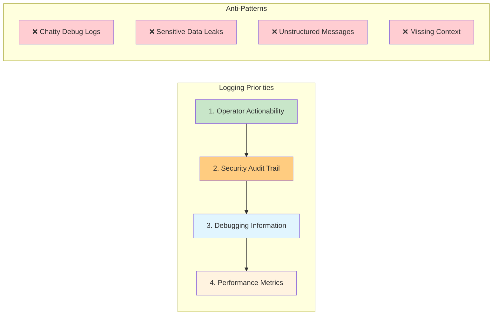
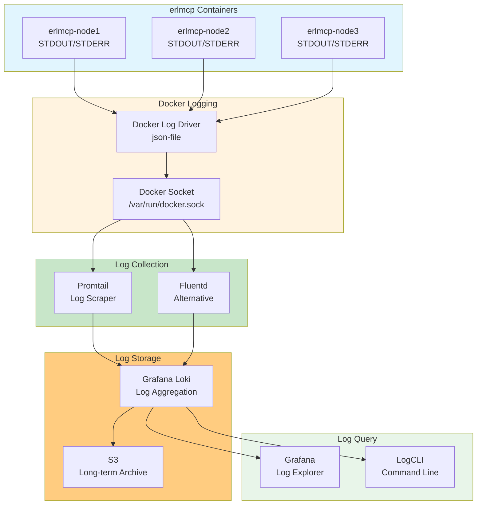

# erlmcp Logging Best Practices

**Version:** 2.1.0
**Last Updated:** February 6, 2026

## Overview

erlmcp logging follows operator-first principles with structured logging, log levels aligned to operational urgency, zero-trust audit trails, and deterministic log analysis. All logs are treated as **evidence** for system behavior, security audits, and compliance.

## Logging Philosophy

### Operator-First Logging



### Log Levels by Operational Urgency

```erlang
%% EMERGENCY (level 0): System unusable - IMMEDIATE action required
?LOG_EMERGENCY(#{
    what => <<"cluster_total_failure">>,
    why => <<"all_nodes_unreachable">>,
    impact => <<"zero_service_availability">>,
    action => <<"initiate_disaster_recovery">>
}).

%% ALERT (level 1): Action MUST be taken immediately
?LOG_ALERT(#{
    what => <<"memory_oom_imminent">>,
    why => <<"heap_exhaustion_90_percent">>,
    impact => <<"node_crash_in_30_seconds">>,
    action => <<"trigger_circuit_breaker">>
}).

%% CRITICAL (level 2): Critical conditions - action within 5 minutes
?LOG_CRITICAL(#{
    what => <<"circuit_breaker_open">>,
    why => <<"error_rate_threshold_exceeded">>,
    impact => <<"traffic_rejected">>,
    action => <<"investigate_root_cause">>
}).

%% ERROR (level 3): Error conditions - action within 1 hour
?LOG_ERROR(#{
    what => <<"tool_call_failed">>,
    why => <<"timeout_5000ms">>,
    impact => <<"client_retry_required">>,
    context => #{tool_id => ToolId, request_id => RequestId}
}).

%% WARNING (level 4): Warning conditions - review within 24 hours
?LOG_WARNING(#{
    what => <<"latency_p99_elevated">>,
    why => <<"resource_contention">>,
    impact => <<"degraded_user_experience">>,
    metric => #{latency_p99_us => 15000}
}).

%% NOTICE (level 5): Normal but significant condition
?LOG_NOTICE(#{
    what => <<"configuration_reloaded">>,
    why => <<"operator_request">>,
    impact => <<"feature_flags_updated">>,
    diff => ConfigDiff
}).

%% INFO (level 6): Informational messages
?LOG_INFO(#{
    what => <<"connection_established">>,
    peer => PeerAddr,
    transport => tcp,
    trace_id => TraceId
}).

%% DEBUG (level 7): Debug-level messages (ONLY in development)
?LOG_DEBUG(#{
    what => <<"state_transition">>,
    from => OldState,
    to => NewState,
    event => Event
}).
```

## Structured Logging

### Standard Log Format

Every log entry follows this structure:

```erlang
#{
    %% REQUIRED FIELDS
    timestamp := erlang:timestamp(),
    level := emergency | alert | critical | error | warning | notice | info | debug,
    what := binary(),  % What happened (action/event)

    %% OPERATIONAL CONTEXT
    why => binary(),  % Why it happened (cause)
    impact => binary(),  % Impact on system/users
    action => binary(),  % What operator should do

    %% TECHNICAL CONTEXT
    node => node(),
    pid => pid(),
    module => atom(),
    function => atom(),
    line => integer(),

    %% TRACING CONTEXT
    trace_id => binary(),
    span_id => binary(),
    request_id => binary(),
    session_id => binary(),

    %% SECURITY CONTEXT
    user_id => binary(),
    ip_address => inet:ip_address(),
    operation => atom(),

    %% CUSTOM CONTEXT
    context => #{}
}.
```

### Example: Operator-First Log Entry

```erlang
%% GOOD: Operator can immediately understand and act
?LOG_CRITICAL(#{
    what => <<"database_connection_pool_exhausted">>,
    why => <<"spike_in_concurrent_requests">>,
    impact => <<"new_requests_failing_with_timeout">>,
    action => <<"scale_pool_or_enable_circuit_breaker">>,

    context => #{
        pool_size => 100,
        active_connections => 100,
        waiting_requests => 247,
        wait_time_ms => 5000,
        error_rate => 0.42
    },

    trace_id => <<"abc123">>,
    node => 'erlmcp@node1'
}).

%% BAD: Operator has to guess what to do
?LOG_ERROR("DB error: timeout").
```

## Docker-Only Logging Setup

### Logging Architecture



### Docker Compose Logging Configuration

```yaml
# docker-compose.yml
version: '3.8'

services:
  erlmcp-node1:
    image: erlmcp:latest
    logging:
      driver: "json-file"
      options:
        max-size: "100m"
        max-file: "10"
        labels: "node,service,environment"
        tag: "{{.Name}}/{{.ID}}"
    labels:
      logging: "promtail"
      service: "erlmcp"
      environment: "production"
      node: "node1"

  # Promtail log collector
  promtail:
    image: grafana/promtail:2.8.0
    volumes:
      - /var/run/docker.sock:/var/run/docker.sock:ro
      - /var/lib/docker/containers:/var/lib/docker/containers:ro
      - ./monitoring/logging/promtail-config.yml:/etc/promtail/config.yml:ro
    command: -config.file=/etc/promtail/config.yml
    networks:
      - erlmcp-monitoring

  # Grafana Loki log storage
  loki:
    image: grafana/loki:2.8.0
    ports:
      - "3100:3100"
    volumes:
      - ./monitoring/logging/loki-config.yml:/etc/loki/config.yml:ro
      - loki_data:/loki
    command: -config.file=/etc/loki/config.yml
    networks:
      - erlmcp-monitoring

volumes:
  loki_data:

networks:
  erlmcp-monitoring:
```

### Promtail Configuration

```yaml
# monitoring/logging/promtail-config.yml
server:
  http_listen_port: 9080
  grpc_listen_port: 0

positions:
  filename: /tmp/positions.yaml

clients:
  - url: http://loki:3100/loki/api/v1/push

scrape_configs:
  # Docker container logs
  - job_name: docker
    docker_sd_configs:
      - host: unix:///var/run/docker.sock
        refresh_interval: 5s
        filters:
          - name: label
            values: ["logging=promtail"]

    relabel_configs:
      # Extract container name
      - source_labels: ['__meta_docker_container_name']
        regex: '/(.*)'
        target_label: 'container'

      # Extract service label
      - source_labels: ['__meta_docker_container_label_service']
        target_label: 'service'

      # Extract environment label
      - source_labels: ['__meta_docker_container_label_environment']
        target_label: 'environment'

      # Extract node label
      - source_labels: ['__meta_docker_container_label_node']
        target_label: 'node'

    pipeline_stages:
      # Parse JSON logs
      - json:
          expressions:
            timestamp: timestamp
            level: level
            what: what
            why: why
            impact: impact
            action: action
            trace_id: trace_id
            request_id: request_id

      # Extract timestamp
      - timestamp:
          source: timestamp
          format: RFC3339

      # Set log level label
      - labels:
          level:
          what:
          trace_id:

      # Drop debug logs in production
      - drop:
          source: level
          expression: "debug"
          drop_counter_reason: "debug_filtered"
```

### Loki Configuration

```yaml
# monitoring/logging/loki-config.yml
auth_enabled: false

server:
  http_listen_port: 3100
  grpc_listen_port: 9096

common:
  path_prefix: /loki
  storage:
    filesystem:
      chunks_directory: /loki/chunks
      rules_directory: /loki/rules
  replication_factor: 1
  ring:
    kvstore:
      store: inmemory

schema_config:
  configs:
    - from: 2020-10-24
      store: boltdb-shipper
      object_store: filesystem
      schema: v11
      index:
        prefix: index_
        period: 24h

storage_config:
  boltdb_shipper:
    active_index_directory: /loki/boltdb-shipper-active
    cache_location: /loki/boltdb-shipper-cache
    cache_ttl: 24h
    shared_store: filesystem

  filesystem:
    directory: /loki/chunks

limits_config:
  enforce_metric_name: false
  reject_old_samples: true
  reject_old_samples_max_age: 168h  # 7 days
  ingestion_rate_mb: 16
  ingestion_burst_size_mb: 32
  max_query_length: 721h  # 30 days
  max_query_parallelism: 32

chunk_store_config:
  max_look_back_period: 0s

table_manager:
  retention_deletes_enabled: true
  retention_period: 2160h  # 90 days

compactor:
  working_directory: /loki/boltdb-shipper-compactor
  shared_store: filesystem
```

## Log Query Operations (Docker-Only)

### Query Logs with LogCLI

```bash
# Start LogCLI container
docker compose run --rm logcli

# Query logs by level
docker compose run --rm logcli \
  --addr=http://loki:3100 \
  query '{level="error"}' --limit=100

# Query logs by service and time range
docker compose run --rm logcli \
  --addr=http://loki:3100 \
  query '{service="erlmcp",environment="production"}' \
  --since=1h

# Query logs by trace_id (distributed tracing)
docker compose run --rm logcli \
  --addr=http://loki:3100 \
  query '{trace_id="abc123"}' \
  --since=24h

# Follow logs in real-time
docker compose run --rm logcli \
  --addr=http://loki:3100 \
  query --tail --follow '{service="erlmcp",level=~"error|critical"}'

# Export logs to file (for evidence/audit)
docker compose run --rm logcli \
  --addr=http://loki:3100 \
  query '{service="erlmcp"}' \
  --since=24h \
  --output=jsonl > incident_$(date +%Y%m%d_%H%M%S).jsonl
```

### Query Logs with Grafana Explore

```logql
# All error logs in last hour
{service="erlmcp", level="error"} |= ""

# Critical logs with specific action
{service="erlmcp", level="critical"} |= "action" |= "circuit_breaker"

# Logs for specific trace (distributed debugging)
{service="erlmcp", trace_id="abc123"}

# Count errors by what field
sum by (what) (
  count_over_time({service="erlmcp", level="error"}[5m])
)

# Top 10 error types
topk(10,
  sum by (what) (
    count_over_time({service="erlmcp", level="error"}[1h])
  )
)

# Error rate calculation
sum(rate({service="erlmcp", level="error"}[5m]))
/
sum(rate({service="erlmcp"}[5m]))
```

## Security & Audit Logging

### Audit Log Requirements

```erlang
%% ALWAYS log these security events
-spec audit_log(Operation, User, Resource, Result) -> ok.

audit_log(Operation, User, Resource, Result) ->
    ?LOG_NOTICE(#{
        %% Event type (for compliance)
        event_type => audit,

        %% Who (identity)
        user_id => User#user.id,
        user_ip => User#user.ip_address,
        user_agent => User#user.agent,

        %% What (operation)
        operation => Operation,
        resource => Resource,

        %% When (timestamp - RFC3339 for compliance)
        timestamp => iso8601:format(erlang:timestamp()),

        %% Result
        result => Result,  % success | failure | denied

        %% Why (if denied/failed)
        reason => maps:get(reason, Result, undefined),

        %% Evidence (hash for tamper detection)
        evidence_hash => crypto:hash(sha256, term_to_binary({
            Operation, User, Resource, Result
        }))
    }).
```

### Audit Log Examples

```erlang
%% Authentication events
audit_log(authenticate, User, <<"api_key">>, #{
    result => success,
    method => api_key
}).

audit_log(authenticate, User, <<"api_key">>, #{
    result => failure,
    reason => invalid_key,
    attempts => 3
}).

%% Authorization events
audit_log(authorize, User, <<"tool:execute:calculator">>, #{
    result => denied,
    reason => insufficient_permissions,
    required_role => admin,
    user_role => user
}).

%% Data access events
audit_log(read_resource, User, <<"file:///etc/passwd">>, #{
    result => denied,
    reason => path_traversal_attempt,
    security_violation => true
}).

%% Configuration changes
audit_log(update_config, User, <<"feature_flags">>, #{
    result => success,
    old_value => #{flag_x => false},
    new_value => #{flag_x => true}
}).
```

### Sensitive Data Redaction

```erlang
%% Automatic redaction of sensitive fields
-define(SENSITIVE_FIELDS, [
    password, api_key, secret, token,
    credit_card, ssn, private_key
]).

redact_sensitive(Map) when is_map(Map) ->
    maps:fold(fun(Key, Value, Acc) ->
        case lists:member(Key, ?SENSITIVE_FIELDS) of
            true -> Acc#{Key => <<"[REDACTED]">>};
            false -> Acc#{Key => redact_sensitive(Value)}
        end
    end, #{}, Map);
redact_sensitive(Value) ->
    Value.

%% Usage in logging
?LOG_INFO(#{
    what => <<"user_login">>,
    user => redact_sensitive(UserData),
    context => redact_sensitive(RequestContext)
}).
```

## Performance Logging

### Latency Logging

```erlang
%% Log slow operations automatically
-define(SLOW_THRESHOLD_MS, 1000).

log_operation(Operation, Fun) ->
    Start = erlang:monotonic_time(microsecond),
    try
        Result = Fun(),
        Duration = erlang:monotonic_time(microsecond) - Start,

        %% Log if slow
        case Duration > (?SLOW_THRESHOLD_MS * 1000) of
            true ->
                ?LOG_WARNING(#{
                    what => <<"slow_operation">>,
                    operation => Operation,
                    duration_us => Duration,
                    threshold_us => ?SLOW_THRESHOLD_MS * 1000,
                    impact => <<"performance_degradation">>,
                    action => <<"investigate_bottleneck">>
                });
            false ->
                ok
        end,

        %% Always emit metric
        erlmcp_metrics:histogram(<<"operation_duration_us">>, Duration, #{
            operation => Operation
        }),

        Result
    catch
        Class:Reason:Stacktrace ->
            Duration = erlang:monotonic_time(microsecond) - Start,
            ?LOG_ERROR(#{
                what => <<"operation_failed">>,
                operation => Operation,
                error_class => Class,
                error_reason => Reason,
                duration_us => Duration,
                stacktrace => Stacktrace
            }),
            erlang:raise(Class, Reason, Stacktrace)
    end.
```

## Log Retention & Archival

### Retention Policy (Docker Volumes)

```yaml
# docker-compose.yml
volumes:
  # Hot storage: 7 days (fast queries)
  loki_data:
    driver: local
    driver_opts:
      type: none
      o: bind
      device: /data/loki/hot

  # Warm storage: 30 days (moderate queries)
  loki_warm:
    driver: local
    driver_opts:
      type: none
      o: bind
      device: /data/loki/warm

  # Cold storage: 90 days (archive/compliance)
  loki_cold:
    driver: local
    driver_opts:
      type: none
      o: bind
      device: /data/loki/cold
```

### Archival to S3 (Compliance)

```bash
#!/bin/bash
# Archive logs to S3 for compliance (90-day retention)
# Run via: docker compose run --rm archiver

BUCKET="s3://erlmcp-audit-logs"
DATE=$(date -d "90 days ago" +%Y-%m-%d)

# Export logs older than 90 days
docker compose run --rm logcli \
  --addr=http://loki:3100 \
  query '{service="erlmcp",event_type="audit"}' \
  --from="${DATE}T00:00:00Z" \
  --to="${DATE}T23:59:59Z" \
  --output=jsonl \
  | docker compose run --rm aws-cli s3 cp - \
      "${BUCKET}/audit-logs/${DATE}.jsonl.gz" \
      --content-encoding gzip

# Verify upload (proof of archival)
docker compose run --rm aws-cli s3 ls "${BUCKET}/audit-logs/${DATE}.jsonl.gz"
```

## Logging Best Practices

### 1. Operator-First Messages

```erlang
%% GOOD: Operator knows WHAT, WHY, IMPACT, ACTION
?LOG_CRITICAL(#{
    what => <<"circuit_breaker_open">>,
    why => <<"error_rate_exceeded_threshold_5_percent">>,
    impact => <<"requests_failing_with_503">>,
    action => <<"investigate_downstream_service">>,
    context => #{threshold => 0.05, current => 0.12}
}).

%% BAD: Operator has to guess
?LOG_ERROR("Circuit breaker triggered").
```

### 2. Always Include Trace Context

```erlang
%% GOOD: Can correlate with traces
?LOG_ERROR(#{
    what => <<"request_timeout">>,
    trace_id => TraceId,
    span_id => SpanId,
    request_id => RequestId
}).

%% BAD: Cannot correlate
?LOG_ERROR("Request timeout").
```

### 3. Use Structured Context

```erlang
%% GOOD: Queryable, filterable
?LOG_WARNING(#{
    what => <<"high_memory_usage">>,
    context => #{
        heap_size_mib => 450,
        threshold_mib => 500,
        utilization => 0.90
    }
}).

%% BAD: Unparseable string
?LOG_WARNING("High memory: 450MB / 500MB (90%)").
```

### 4. Log Security Events

```erlang
%% ALWAYS log authentication/authorization
?LOG_NOTICE(#{
    event_type => audit,
    operation => authenticate,
    result => success,
    user_id => UserId
}).

?LOG_WARNING(#{
    event_type => audit,
    operation => authorize,
    result => denied,
    user_id => UserId,
    resource => Resource,
    reason => insufficient_permissions
}).
```

### 5. Avoid Log Spam

```erlang
%% GOOD: Throttled logging (max 1/minute)
-define(LOG_THROTTLE, 60000).  % 60 seconds

throttled_log(Key, LogFun) ->
    case erlang:get({log_throttle, Key}) of
        undefined ->
            erlang:put({log_throttle, Key}, erlang:monotonic_time(millisecond)),
            LogFun();
        LastLog ->
            Now = erlang:monotonic_time(millisecond),
            case Now - LastLog > ?LOG_THROTTLE of
                true ->
                    erlang:put({log_throttle, Key}, Now),
                    LogFun();
                false ->
                    ok
            end
    end.

%% Usage
throttled_log(connection_error, fun() ->
    ?LOG_WARNING(#{what => <<"connection_failed">>})
end).
```

## Troubleshooting

### View Logs in Real-Time (Docker)

```bash
# Follow all erlmcp logs
docker compose logs -f erlmcp-node1

# Follow error logs only
docker compose logs -f erlmcp-node1 | grep '"level":"error"'

# Query Loki for errors
docker compose run --rm logcli \
  --addr=http://loki:3100 \
  query --tail --follow '{level="error"}'
```

### Export Logs for Analysis

```bash
# Export last hour of errors (for incident investigation)
docker compose run --rm logcli \
  --addr=http://loki:3100 \
  query '{level=~"error|critical"}' \
  --since=1h \
  --output=jsonl > incident.jsonl

# Analyze with jq
cat incident.jsonl | jq -r '.what' | sort | uniq -c | sort -rn
```

### Log Volume Too High

```bash
# Check log volume per container
docker compose exec prometheus wget -qO- \
  'http://localhost:9090/api/v1/query?query=rate(loki_ingester_bytes_received_total[5m])'

# Reduce log level (production)
docker compose exec erlmcp-node1 \
  erl_call -n erlmcp@node1 -c erlmcp -a 'logger set_primary_config level warning'
```

## Further Reading

- [Observability README](README.md)
- [Metrics Collection](metrics.md)
- [Distributed Tracing](tracing.md)
- [Alerting Rules](alerting.md)
- [Debugging Guide](debugging.md)
