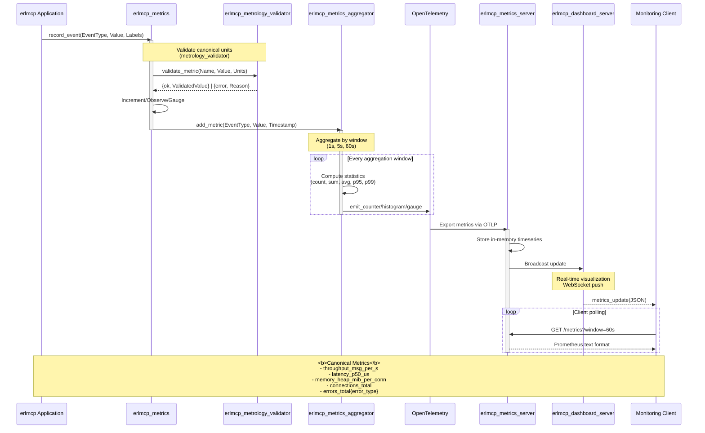
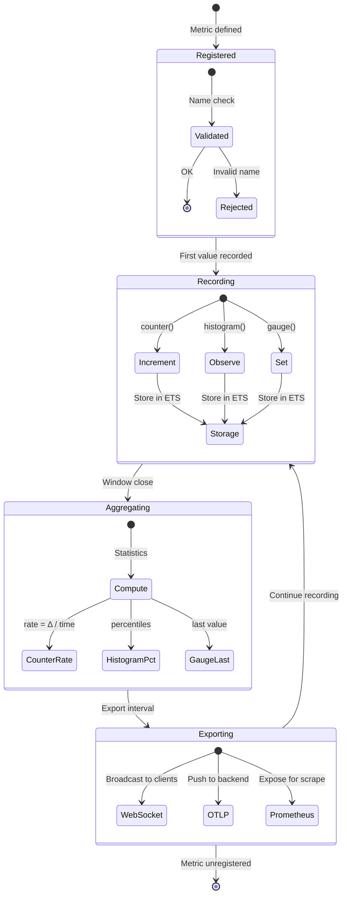
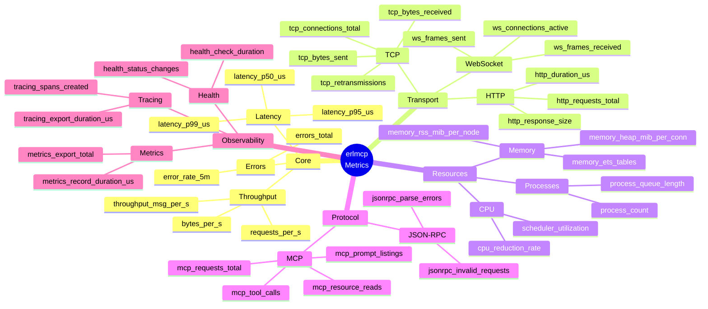

# erlmcp Metrics Collection

## Overview

erlmcp provides OpenTelemetry-compliant metrics collection with metrology validation (canonical units), time-series aggregation, and multi-backend export. The metrics system follows Lean Six Sigma principles for zero-defect measurement.

## Architecture



## Metric Types

### Counter

**Purpose:** Monotonically increasing values (requests, errors, bytes)

```erlang
% Simple counter
erlmcp_metrics:counter(<<"messages_processed">>).

% Counter with labels
erlmcp_metrics:counter(<<"messages_processed">>, #{
    transport => tcp,
    direction => inbound
}).

% Counter with incremental value
erlmcp_metrics:counter(<<"bytes_received">>, 1024, #{}).
```

**Examples:**
- `messages_total` - Total messages processed
- `errors_total{error_type}` - Total errors by type
- `connections_total` - Total connections established
- `bytes_total{direction}` - Bytes transmitted/received

### Histogram

**Purpose:** Value distributions (latencies, request sizes)

```erlang
% Record latency in microseconds
erlmcp_metrics:histogram(<<"request_latency_us">>, 5432, #{
    endpoint => <<"/tools/call">>,
    transport => tcp
}).

% Histogram with explicit buckets
erlmcp_metrics:histogram(
    <<"message_size_bytes">>,
    4096,
    #{},
    [100, 1000, 10000, 100000, 1000000]
).
```

**Default Buckets (microseconds):**
```erlang
[10, 50, 100, 500, 1000, 5000, 10000, 50000, 100000, 500000, 1000000]
```

**Automatic Statistics:**
- `count` - Total observations
- `sum` - Sum of all values
- `avg` - Average value
- `p50` - Median (50th percentile)
- `p95` - 95th percentile
- `p99` - 99th percentile
- `max` - Maximum value

### Gauge

**Purpose:** Point-in-time values (memory, connections, temperature)

```erlang
% Set gauge value
erlmcp_metrics:gauge(<<"active_connections">>, 42).

% Gauge with labels
erlmcp_metrics:gauge(<<"memory_heap_mib">>, 1024, #{
    node => node()
}).

% Increment/decrement gauge
erlmcp_metrics:gauge(<<"queue_depth">>, 1, #{}, increment).
erlmcp_metrics:gauge(<<"queue_depth">>, -1, #{}, increment).
```

**Examples:**
- `active_connections` - Current active connections
- `memory_heap_mib_per_conn` - Heap size per connection
- `scheduler_utilization` - CPU usage percentage
- `queue_depth` - Message queue length

## Canonical Metrics (Metrology-Compliant)

### Throughput Metrics

**`throughput_msg_per_s`**
```erlang
% Messages processed per second
erlmcp_metrics:histogram(<<"throughput_msg_per_s">>, MsgCount, #{
    transport => Transport
}).
```

- **Unit:** messages/second (msg/s)
- **Scope:** per_transport
- **Aggregation:** rate over 1s window

### Latency Metrics

**`latency_p50_us`, `latency_p95_us`, `latency_p99_us`**
```erlang
% Request latency in microseconds
erlmcp_metrics:histogram(<<"request_latency_us">>, LatencyUs, #{
    endpoint => Endpoint,
    operation => Operation
}).

% Percentiles computed automatically
```

- **Unit:** microseconds (us)
- **Scope:** per_endpoint
- **Buckets:** [10, 50, 100, 500, 1000, 5000, 10000, 50000, 100000, 500000, 1000000]

### Memory Metrics

**`memory_heap_mib_per_conn`**
```erlang
% Heap size per connection
erlmcp_metrics:gauge(<<"memory_heap_mib_per_conn">>, HeapMiB, #{
    transport => Transport
}).
```

- **Unit:** mebibytes (MiB)
- **Scope:** per_connection_heap

**`memory_rss_mib_per_node`**
```erlang
% Resident set size per node
erlmcp_metrics:gauge(<<"memory_rss_mib_per_node">>, RSSMiB, #{
    node => node()
}).
```

- **Unit:** mebibytes (MiB)
- **Scope:** per_node_total

### Connection Metrics

**`connections_total`**
```erlang
erlmcp_metrics:counter(<<"connections_total">>, 1, #{
    transport => Transport,
    state => established
}).
```

- **Unit:** count (dimensionless)
- **Scope:** per_transport

### Error Metrics

**`errors_total{error_type}`**
```erlang
erlmcp_metrics:counter(<<"errors_total">>, 1, #{
    error_type => <<"protocol_violation">>,
    transport => tcp
}).
```

- **Unit:** count (dimensionless)
- **Labels:** error_type (atom)

## Metric Validation

### Metrology Validator

**Purpose:** Enforce canonical units and prevent ambiguous metrics

```erlang
% Valid metric
{ok, Value} = erlmcp_metrology_validator:validate(
    <<"request_latency_us">>,
    5432,
    us
).  % microseconds - OK

% Invalid: wrong units
{error, invalid_unit} = erlmcp_metrology_validator:validate(
    <<"request_latency_us">>,
    5.432,  % seconds instead of microseconds
    s
).

% Invalid: ambiguous name
{error, invalid_metric_name} = erlmcp_metrology_validator:validate(
    <<"latency">>,  % Missing unit suffix
    5432,
    us
).
```

**Validation Rules:**
1. Metric names must include unit suffix: `_{unit}`
2. Value must match specified unit
3. No duplicate metrics with different units
4. Time units must use ISO prefixes (us, ms, s)
5. Memory units must use binary prefixes (MiB, GiB)

**Valid Units:**
- Time: `us` (microseconds), `ms` (milliseconds), `s` (seconds)
- Data: `B` (bytes), `KiB`, `MiB`, `GiB`
- Rate: `per_s`, `per_m`, `per_h`
- Count: dimensionless (no unit suffix)

## Aggregation

### Time Windows

```erlang
% Configure aggregation windows
{erlmcp_metrics, [
    {aggregation_windows, [
        {1s, 60},    % 1-second window, keep 60 samples (1 minute)
        {5s, 288},   % 5-second window, keep 288 samples (24 hours)
        {60s, 144}   % 60-second window, keep 144 samples (2 hours)
    ]}
]}.
```

### Aggregation Functions

```erlang
% Counter: rate per second
aggregation_rate(count) = sum(delta) / time_window

% Histogram: percentiles
aggregation_p50(values) = percentile(values, 50)
aggregation_p95(values) = percentile(values, 95)
aggregation_p99(values) = percentile(values, 99)

% Gauge: last value, min, max, avg
aggregation_last(values) = last(values)
aggregation_min(values) = min(values)
aggregation_max(values) = max(values)
aggregation_avg(values) = sum(values) / length(values)
```

### Downsampling

```erlang
% Automatic downsampling to reduce storage
{downsample, [
    {raw, 1h},         % Keep raw data for 1 hour
    {1s, 24h},         % Keep 1s aggregates for 24 hours
    {1m, 7d},          % Keep 1m aggregates for 7 days
    {5m, 30d}          % Keep 5m aggregates for 30 days
]}.
```

## Export Formats

### Prometheus (Text Format)

```bash
$ curl http://localhost:8080/metrics

# HELP erlmcp_messages_total Total messages processed
# TYPE erlmcp_messages_total counter
erlmcp_messages_total{transport="tcp"} 1234567.0

# HELP erlmcp_request_latency_us Request latency in microseconds
# TYPE erlmcp_request_latency_us histogram
erlmcp_request_latency_us_bucket{endpoint="/tools",le="10"} 0.0
erlmcp_request_latency_us_bucket{endpoint="/tools",le="100"} 123.0
erlmcp_request_latency_us_bucket{endpoint="/tools",le="1000"} 5678.0
erlmcp_request_latency_us_bucket{endpoint="/tools",le="+Inf"} 5901.0
erlmcp_request_latency_us_sum{endpoint="/tools"} 2876543.0
erlmcp_request_latency_us_count{endpoint="/tools"} 5901.0

# HELP erlmcp_active_connections Current active connections
# TYPE erlmcp_active_connections gauge
erlmcp_active_connections{transport="tcp"} 42.0
```

### OpenTelemetry (OTLP)

```erlang
% Automatic export via OTLP
{opentelemetry, [
    {exporters, [
        {otel_exporter_otlp_http, #{
            endpoint => "https://otlp-collector:4318",
            headers => [{"Authorization", "Bearer TOKEN"}]
        }}
    ]}
]}.
```

### Datadog (DogStatsD)

```erlang
% Datadog-specific format
{erlmcp_otel_datadog, [
    {agent_host, "localhost"},
    {agent_port, 8126},
    {service_name, "erlmcp"},
    {tags => ["env:production", "version:2.1.0"]}
]}.
```

## Configuration

### Production Configuration

```erlang
{erlmcp_metrics, [
    {enabled, true},
    {aggregation_window, 5000},  % 5 seconds
    {export_interval, 10000},    % 10 seconds

    {metrics, [
        {<<"throughput_msg_per_s">>, histogram, [1, 10, 100, 1000, 10000, 100000]},
        {<<"latency_p99_us">>, histogram, [10, 100, 1000, 10000, 100000, 1000000]},
        {<<"memory_heap_mib_per_conn">>, gauge, []},
        {<<"connections_total">>, counter, []},
        {<<"errors_total">>, counter, []}
    ]},

    {validation, strict},  % Enforce metrology compliance

    {exporters, [
        {prometheus, #{
            port => 8080,
            path => "/metrics"
        }},
        {datadog, #{
            host => "localhost",
            port => 8126
        }}
    ]}
]}.
```

### Development Configuration

```erlang
{erlmcp_metrics, [
    {enabled, true},
    {aggregation_window, 1000},  % 1 second (more granular)
    {export_interval, 5000},     % 5 seconds (faster feedback)
    {validation, lenient}        % Allow experimental metrics
]}.
```

## Best Practices

### 1. Use Canonical Units

```erlang
% GOOD: Explicit units in name
erlmcp_metrics:histogram(<<"request_latency_us">>, 5432, #{}).

% BAD: Ambiguous units
erlmcp_metrics:histogram(<<"request_latency">>, 5.432, #{}).
```

### 2. Label Dimensions Appropriately

```erlang
% GOOD: High-cardinality labels (transport, endpoint)
erlmcp_metrics:counter(<<"errors_total">>, 1, #{
    transport => tcp,
    error_type => <<"timeout">>,
    endpoint => <<"/tools/call">>
}).

% BAD: Low-cardinality labels (no filtering)
erlmcp_metrics:counter(<<"errors_total">>, 1, #{}).
```

### 3. Set Appropriate Buckets

```erlang
% GOOD: Based on baseline measurements
Buckets = [10, 50, 100, 500, 1000, 5000, 10000, 50000, 100000, 500000, 1000000].

% BAD: Default buckets may not fit your data
Buckets = [0.005, 0.01, 0.025, 0.05, 0.1, 0.25, 0.5, 1, 2.5, 5, 10].
```

### 4. Avoid High Cardinality

```erlang
% BAD: user_id causes cardinality explosion
erlmcp_metrics:counter(<<"requests_total">>, 1, #{
    user_id => UserId
}).

% GOOD: Use histograms for user-scoped metrics
erlmcp_metrics:histogram(<<"requests_per_user">>, RequestCount, #{}).
```

### 5. Track Observability Overhead

```erlang
% Monitor metrics system performance
erlmcp_metrics:histogram(<<"metric_record_duration_us">>, Duration, #{}).
erlmcp_metrics:gauge(<<"metrics_buffer_size">>, BufferSize).
erlmcp_metrics:counter(<<"metrics_export_total">>, 1, #{
    status => Status
}).
```

## API Reference

### Recording Metrics

```erlang
% Counter
erlmcp_metrics:counter(Name) -> ok.
erlmcp_metrics:counter(Name, Increment) -> ok.
erlmcp_metrics:counter(Name, Increment, Labels) -> ok.

% Histogram
erlmcp_metrics:histogram(Name, Value) -> ok.
erlmcp_metrics:histogram(Name, Value, Labels) -> ok.
erlmcp_metrics:histogram(Name, Value, Labels, Buckets) -> ok.

% Gauge
erlmcp_metrics:gauge(Name, Value) -> ok.
erlmcp_metrics:gauge(Name, Value, Labels) -> ok.
erlmcp_metrics:gauge(Name, Value, Labels, set) -> ok.
erlmcp_metrics:gauge(Name, Value, Labels, increment) -> ok.
erlmcp_metrics:gauge(Name, Value, Labels, decrement) -> ok.
```

### Querying Metrics

```erlang
% Get current metric value
{ok, Value} = erlmcp_metrics:get(<<"active_connections">>).

% Get metric with labels
{ok, Value} = erlmcp_metrics:get(<<"errors_total">>, #{
    transport => tcp
}).

% Get all label values for a metric
{ok, LabelSets} = erlmcp_metrics:get_labels(<<"errors_total">>).

% Get histogram percentiles
{ok, Percentiles} = erlmcp_metrics:percentiles(<<"request_latency_us">>, #{
    p50 => true,
    p95 => true,
    p99 => true
}).
```

## Troubleshooting

### Metric Not Appearing

```erlang
% Check if metric is registered
erlmcp_metrics:is_registered(<<"my_metric">>).

% Check if metric is being exported
erlmcp_metrics:get_export_status().

% Verify metric name (must include unit)
erlmcp_metrology_validator:validate_name(<<"my_metric_us">>).
```

### Incorrect Values

```erlang
% Check metric type (counter vs gauge vs histogram)
erlmcp_metrics:get_type(<<"my_metric">>).

% Verify labels match
erlmcp_metrics:get_labels(<<"my_metric">>).

% Check aggregation window
erlmcp_metrics_aggregator:get_window_size().
```

### High Memory Usage

```erlang
% Check buffer size
erlmcp_metrics_server:get_buffer_size().

% Reduce aggregation window
% In config: {aggregation_window, 10000}  % 10 seconds

% Enable downsampling
% In config: {downsample, [...]}
```

## Metrics Flow Diagrams

### Metric Recording Pipeline

```mermaid
flowchart LR
    subgraph Application["Application Code"]
        Code[erlmcp_server<br/>erlmcp_client<br/>erlmcp_transport]
    end

    subgraph API["Metrics API"]
        Counter[counter/3]
        Histogram[histogram/3]
        Gauge[gauge/3]
    end

    subgraph Validation["Metrology Validation"]
        Validator[erlmcp_metrology_validator]
        CheckName[Check unit suffix]
        CheckValue[Check unit match]
        CheckType[Check type validity]
    end

    subgraph Storage["Metric Storage"]
        CounterTable[Counter Table]
        HistogramTable[Histogram Table]
        GaugeTable[Gauge Table]
    end

    subgraph Aggregation["Aggregation"]
        Window[Time Window<br/>1s, 5s, 60s]
        Stats[Statistics<br/>sum, avg, p95, p99]
    end

    subgraph Export["Export"]
        Aggregator[erlmcp_metrics_aggregator]
        OTEL[OpenTelemetry]
        Server[erlmcp_metrics_server]
    end

    Code -->|"call"| Counter
    Code -->|"call"| Histogram
    Code -->|"call"| Gauge

    Counter --> Validator
    Histogram --> Validator
    Gauge --> Validator

    Validator --> CheckName
    Validator --> CheckValue
    Validator --> CheckType

    CheckName -->|"valid"| Storage
    CheckValue -->|"match"| Storage
    CheckType -->|"valid"| Storage

    Storage --> Window
    Window --> Stats
    Stats --> Aggregator

    Aggregator --> OTEL
    Aggregator --> Server

    style Application fill:#e8f5e9
    style API fill:#e1f5fe
    style Validation fill:#fff3e0
    style Storage fill:#f3e5f5
    style Aggregation fill:#e0f2f1
    style Export fill:#ffebee
```



### Metrics Collection Timeline

```mermaid
gantt
    title Metrics Collection and Export Timeline
    dateFormat X
    axisFormat %L0s

    section Metric Recording
    counter() call     :0, 100
    histogram() call   :200, 100
    gauge() call       :400, 100

    section Validation
    Validate units     :100, 50
    Validate name      :300, 50
    Validate value     :500, 50

    section Storage
    Store in ETS       :150, 100
    Update aggregates  :350, 100
    Store gauge value  :550, 100

    section Aggregation
    1s window close    :1000, 50
    5s window close    :5000, 50
    Compute stats      :1050, 100
    Compute stats      :5050, 100

    section Export
    WebSocket broadcast :1150, 50
    OTLP export         :1150, 50
    Prometheus scrape   :active, 15000
```



## Metrics Lifecycle



### Metrics by Component



## Further Reading

- [Metrology Glossary](../metrology/METRICS_GLOSSARY.md)
- [OpenTelemetry Specification](https://opentelemetry.io/docs/reference/specification/metrics/)
- [Prometheus Best Practices](https://prometheus.io/docs/practices/naming/)
