# erlmcp Performance Monitoring

**Version:** 2.1.0
**Last Updated:** February 6, 2026

## Overview

erlmcp performance monitoring provides operator-first, deterministic performance insights with baseline measurement, regression detection, and optimization recommendations. All measurements use Docker-only execution with proof-based verification.

## Performance Monitoring Philosophy

### Operator-First Performance Insights

```mermaid
graph TB
    subgraph Principles["Performance Principles"]
        P1[1. Baseline First]
        P2[2. Detect Regressions]
        P3[3. Root Cause Analysis]
        P4[4. Optimization Proof]
    end

    subgraph Metrics["Key Metrics"]
        M1[Throughput<br/>msg/s]
        M2[Latency<br/>P50/P95/P99]
        M3[Resource Usage<br/>CPU/Memory]
        M4[Efficiency<br/>msg/CPU·s]
    end

    subgraph Analysis["Analysis"]
        A1[Trend Detection]
        A2[Bottleneck ID]
        A3[Capacity Planning]
        A4[Cost Optimization]
    end

    P1 --> M1
    P2 --> A1
    P3 --> A2
    P4 --> M4

    M1 --> A3
    M2 --> A2
    M3 --> A4
    M4 --> A4

    style Principles fill:#c8e6c9
    style Metrics fill:#e1f5fe
    style Analysis fill:#fff3e0
```



## Docker-Only Performance Testing

### Performance Test Architecture


### Docker Compose Performance Stack

```yaml
# docker-compose.perf.yml
version: '3.8'

services:
  # System Under Test (SUT)
  erlmcp-node1:
    image: erlmcp:${VERSION:-latest}
    container_name: erlmcp-perf-node1
    environment:
      - ERLMCP_NODE_NAME=erlmcp@node1
      - ERLMCP_COOKIE=perf_test_cookie
    volumes:
      - ./config/perf.config:/app/config/sys.config:ro
    networks:
      - erlmcp-perf
    deploy:
      resources:
        limits:
          cpus: '2.0'
          memory: 4G
        reservations:
          cpus: '1.0'
          memory: 2G

  # Load generator
  erlmcp-loadgen:
    image: erlmcp-loadgen:latest
    build:
      context: ./tests/load
      dockerfile: Dockerfile.loadgen
    depends_on:
      - erlmcp-node1
    environment:
      - TARGET=erlmcp-node1:8080
      - RPS=10000
      - DURATION=300s
      - CLIENTS=100
    volumes:
      - ./tests/load/scenarios:/scenarios:ro
      - perf_results:/results
    networks:
      - erlmcp-perf
    command: |
      --scenario /scenarios/baseline.yml
      --output /results/perf_${VERSION}_$(date +%Y%m%d_%H%M%S).json

  # Prometheus metrics collection
  prometheus:
    image: prom/prometheus:v2.45.0
    volumes:
      - ./monitoring/prometheus/prometheus.perf.yml:/etc/prometheus/prometheus.yml:ro
      - prometheus_perf_data:/prometheus
    ports:
      - "9090:9090"
    networks:
      - erlmcp-perf
    command:
      - '--config.file=/etc/prometheus/prometheus.yml'
      - '--storage.tsdb.retention.time=7d'

  # Grafana visualization
  grafana:
    image: grafana/grafana:10.2.0
    volumes:
      - ./monitoring/grafana/dashboards/performance.json:/etc/grafana/provisioning/dashboards/performance.json:ro
      - grafana_perf_data:/var/lib/grafana
    ports:
      - "3000:3000"
    networks:
      - erlmcp-perf

volumes:
  perf_results:
  prometheus_perf_data:
  grafana_perf_data:

networks:
  erlmcp-perf:
    driver: bridge
```

## Baseline Measurement (Docker-Only)

### Establish Performance Baseline

```bash
#!/bin/bash
# tests/load/baseline.sh - Establish performance baseline

set -euo pipefail

VERSION=${1:-latest}
OUTPUT_DIR="./results/baseline/${VERSION}"

mkdir -p "${OUTPUT_DIR}"

echo "🔬 Establishing baseline for erlmcp:${VERSION}"

# 1. Start clean environment
docker compose -f docker-compose.perf.yml down -v
docker compose -f docker-compose.perf.yml build
docker compose -f docker-compose.perf.yml up -d erlmcp-node1 prometheus grafana

# Wait for services to be ready
echo "⏳ Waiting for services to stabilize (30s)..."
sleep 30

# 2. Warmup (avoid cold-start effects)
echo "🔥 Warmup run (30s @ 1000 RPS)..."
docker compose -f docker-compose.perf.yml run --rm erlmcp-loadgen \
  --target erlmcp-node1:8080 \
  --rps 1000 \
  --duration 30s \
  --clients 10 \
  --scenario /scenarios/warmup.yml

# Wait for cooldown
sleep 10

# 3. Baseline measurement (5 minutes)
echo "📊 Baseline measurement (5min @ 10000 RPS)..."
docker compose -f docker-compose.perf.yml run --rm erlmcp-loadgen \
  --target erlmcp-node1:8080 \
  --rps 10000 \
  --duration 300s \
  --clients 100 \
  --scenario /scenarios/baseline.yml \
  --output "/results/baseline_${VERSION}.json"

# 4. Collect metrics snapshot (proof)
echo "📸 Collecting metrics snapshot..."
docker compose -f docker-compose.perf.yml exec prometheus \
  promtool query instant \
    'http://localhost:9090' \
    'erlmcp:latency_p99:5m' > "${OUTPUT_DIR}/p99_latency.txt"

docker compose -f docker-compose.perf.yml exec prometheus \
  promtool query instant \
    'http://localhost:9090' \
    'erlmcp:request_rate:1m' > "${OUTPUT_DIR}/throughput.txt"

docker compose -f docker-compose.perf.yml exec prometheus \
  promtool query instant \
    'http://localhost:9090' \
    'erlmcp:error_rate:5m' > "${OUTPUT_DIR}/error_rate.txt"

# 5. Generate baseline report with receipt
cat > "${OUTPUT_DIR}/baseline_report.md" <<EOF
# Performance Baseline Report

**Version:** ${VERSION}
**Date:** $(date -u +"%Y-%m-%d %H:%M:%S UTC")
**Git SHA:** $(git rev-parse HEAD)
**Docker Image:** $(docker inspect erlmcp:${VERSION} --format='{{.Id}}')

## Test Configuration

- **Duration:** 5 minutes
- **Target RPS:** 10,000
- **Clients:** 100
- **Scenario:** baseline.yml

## Results

### Throughput
\`\`\`
$(cat "${OUTPUT_DIR}/throughput.txt")
\`\`\`

### Latency (P99)
\`\`\`
$(cat "${OUTPUT_DIR}/p99_latency.txt")
\`\`\`

### Error Rate
\`\`\`
$(cat "${OUTPUT_DIR}/error_rate.txt")
\`\`\`

## Proof Receipt

\`\`\`
SHA256 Hash: $(find "${OUTPUT_DIR}" -type f -exec sha256sum {} \; | sha256sum | cut -d' ' -f1)
Git SHA: $(git rev-parse HEAD)
Image Digest: $(docker inspect erlmcp:${VERSION} --format='{{.RepoDigests}}')
Timestamp: $(date -u +%s)
\`\`\`

EOF

echo "✅ Baseline established: ${OUTPUT_DIR}/baseline_report.md"

# Cleanup
docker compose -f docker-compose.perf.yml down
```

### Baseline Report Example

```markdown
# Performance Baseline Report

**Version:** 2.1.0
**Date:** 2026-02-06 18:30:00 UTC
**Git SHA:** abc123def456789
**Docker Image:** sha256:1234567890abcdef

## Test Configuration

- **Duration:** 5 minutes
- **Target RPS:** 10,000
- **Clients:** 100
- **Scenario:** baseline.yml

## Results

### Throughput
```
Metric: erlmcp:request_rate:1m
Value: 9,847 msg/s (98.47% of target)
```

### Latency
```
P50: 2.3 ms
P95: 8.7 ms
P99: 15.2 ms
P999: 42.8 ms
```

### Error Rate
```
Rate: 0.02% (2 errors per 10,000 requests)
Error types:
  - timeout: 1 (0.01%)
  - connection_refused: 1 (0.01%)
```

### Resource Usage
```
CPU: 67% average (2 cores)
Memory: 1.8 GB / 4 GB (45%)
Network: 125 Mbps
```

## Proof Receipt

```
SHA256 Hash: e3b0c44298fc1c149afbf4c8996fb92427ae41e4649b934ca495991b7852b855
Git SHA: abc123def456789
Image Digest: sha256:1234567890abcdef
Timestamp: 1738872600
```
```

## Regression Detection (Docker-Only)

### Automated Regression Test

```bash
#!/bin/bash
# tests/load/regression_test.sh - Detect performance regressions

set -euo pipefail

BASELINE_VERSION=${1:-2.0.0}
CURRENT_VERSION=${2:-2.1.0}
THRESHOLD_PERCENT=${3:-10}

echo "🔍 Regression test: ${BASELINE_VERSION} vs ${CURRENT_VERSION}"

# Run baseline
./tests/load/baseline.sh "${BASELINE_VERSION}"

# Run current
./tests/load/baseline.sh "${CURRENT_VERSION}"

# Compare results
docker run --rm -v "$(pwd)/results:/results" \
  erlmcp-perf-analyzer:latest \
  compare \
    --baseline "/results/baseline/${BASELINE_VERSION}/baseline_${BASELINE_VERSION}.json" \
    --current "/results/baseline/${CURRENT_VERSION}/baseline_${CURRENT_VERSION}.json" \
    --threshold ${THRESHOLD_PERCENT} \
    --output "/results/regression_report.md"

# Check for regressions
REGRESSION_EXIT_CODE=$?

if [ ${REGRESSION_EXIT_CODE} -eq 0 ]; then
  echo "✅ No regressions detected"
  exit 0
else
  echo "❌ Regression detected! See results/regression_report.md"
  cat "./results/regression_report.md"
  exit 1
fi
```

### Regression Report Example

```markdown
# Performance Regression Report

**Baseline:** 2.0.0
**Current:** 2.1.0
**Threshold:** 10% degradation

## Summary

❌ **REGRESSION DETECTED**

- **Latency P99:** +23% (REGRESSION)
- **Throughput:** -5% (within threshold)
- **Error Rate:** +150% (REGRESSION)
- **Memory:** +8% (within threshold)

## Detailed Comparison

### Throughput

| Metric | Baseline | Current | Change | Status |
|--------|----------|---------|--------|--------|
| RPS | 9,847 | 9,354 | -5.0% | ✅ OK |

### Latency

| Percentile | Baseline | Current | Change | Status |
|------------|----------|---------|--------|--------|
| P50 | 2.3 ms | 2.4 ms | +4.3% | ✅ OK |
| P95 | 8.7 ms | 9.8 ms | +12.6% | ⚠️ WARNING |
| P99 | 15.2 ms | 18.7 ms | +23.0% | ❌ REGRESSION |
| P999 | 42.8 ms | 51.2 ms | +19.6% | ❌ REGRESSION |

### Error Rate

| Type | Baseline | Current | Change | Status |
|------|----------|---------|--------|--------|
| Total | 0.02% | 0.05% | +150% | ❌ REGRESSION |
| Timeout | 0.01% | 0.04% | +300% | ❌ REGRESSION |

## Root Cause Analysis

### Latency Regression

Trace analysis shows increased time in:
- `erlmcp_json_rpc:decode/1`: +8ms (new validation logic)
- `erlmcp_registry:lookup/1`: +3ms (lock contention)

**Recommendation:**
1. Profile JSON decode with `fprof`
2. Optimize registry locking strategy
3. Consider caching validated schemas

### Error Rate Regression

New timeout errors in:
- Tool: `calculator` (75% of new timeouts)
- Cause: Synchronous validation blocking

**Recommendation:**
1. Make validation asynchronous
2. Increase timeout from 5s to 10s
3. Add backpressure to prevent queue buildup

## Proof Receipt

```
Baseline SHA: abc123
Current SHA: def456
Comparison Hash: 789abc
Timestamp: 1738872600
```
```

## Profiling (Docker-Only)

### CPU Profiling with fprof

```bash
#!/bin/bash
# Profile CPU usage during load test

# Start profiling
docker compose exec erlmcp-node1 erl_call -a '
  fprof:trace([start, {file, "/tmp/fprof.trace"}, {procs, all}])
'

# Run load test (1 minute)
docker compose run --rm erlmcp-loadgen \
  --target erlmcp-node1:8080 \
  --rps 10000 \
  --duration 60s

# Stop profiling and analyze
docker compose exec erlmcp-node1 erl_call -a '
  fprof:trace(stop),
  fprof:profile({file, "/tmp/fprof.trace"}),
  fprof:analyse([{dest, "/tmp/fprof.analysis"}, {sort, own}])
'

# Copy results out
docker compose cp erlmcp-node1:/tmp/fprof.analysis ./results/fprof_$(date +%Y%m%d_%H%M%S).txt

echo "✅ CPU profile saved to results/"
```

### Memory Profiling

```bash
#!/bin/bash
# Profile memory allocations

# Enable recon memory profiling
docker compose exec erlmcp-node1 erl_call -a '
  recon:proc_count(memory, 10)
'

# Get heap dump
docker compose exec erlmcp-node1 erl_call -a '
  erlang:system_info(procs)
' > ./results/proc_info_$(date +%Y%m%d_%H%M%S).txt

# Analyze binary allocations
docker compose exec erlmcp-node1 erl_call -a '
  recon:bin_leak(10)
' > ./results/binary_leak_$(date +%Y%m%d_%H%M%S).txt

echo "✅ Memory profiles saved to results/"
```

## Performance Dashboard (Grafana)

### Deterministic Performance Dashboard

```json
{
  "dashboard": {
    "title": "erlmcp Performance (Operator-First)",
    "panels": [
      {
        "title": "🎯 Golden Signals",
        "type": "stat",
        "targets": [
          {
            "expr": "erlmcp:request_rate:1m",
            "legendFormat": "Throughput (msg/s)"
          },
          {
            "expr": "erlmcp:latency_p99:5m / 1000",
            "legendFormat": "P99 Latency (ms)"
          },
          {
            "expr": "erlmcp:error_rate:5m * 100",
            "legendFormat": "Error Rate (%)"
          }
        ],
        "thresholds": [
          {"value": 0, "color": "green"},
          {"value": 10000, "color": "yellow"},
          {"value": 5000, "color": "red"}
        ]
      },
      {
        "title": "📈 Throughput Trend (deterministic)",
        "type": "graph",
        "targets": [
          {
            "expr": "erlmcp:request_rate:1m",
            "legendFormat": "Current RPS"
          },
          {
            "expr": "vector(10000)",
            "legendFormat": "Baseline (v2.0.0)"
          },
          {
            "expr": "vector(10000) * 0.9",
            "legendFormat": "Regression Threshold (-10%)"
          }
        ]
      },
      {
        "title": "⏱️ Latency Distribution (P50/P95/P99)",
        "type": "graph",
        "targets": [
          {
            "expr": "erlmcp:latency_p50:5m / 1000",
            "legendFormat": "P50 (median)"
          },
          {
            "expr": "erlmcp:latency_p95:5m / 1000",
            "legendFormat": "P95"
          },
          {
            "expr": "erlmcp:latency_p99:5m / 1000",
            "legendFormat": "P99"
          }
        ],
        "alert": {
          "name": "P99 Latency Regression",
          "conditions": [
            {
              "evaluator": {"type": "gt", "params": [15.2]},
              "query": {"model": "erlmcp:latency_p99:5m / 1000"}
            }
          ]
        }
      },
      {
        "title": "💰 Efficiency (msg/CPU·s)",
        "type": "graph",
        "targets": [
          {
            "expr": "erlmcp:request_rate:1m / sum(rate(process_cpu_seconds_total[1m]))",
            "legendFormat": "Messages per CPU second"
          }
        ]
      },
      {
        "title": "🔥 Hot Spots (Top 10 slowest operations)",
        "type": "table",
        "targets": [
          {
            "expr": "topk(10, erlmcp_operation_duration_us{quantile=\"0.99\"})",
            "format": "table",
            "instant": true
          }
        ]
      }
    ]
  }
}
```

## Capacity Planning

### Determine Maximum Capacity

```bash
#!/bin/bash
# tests/load/max_capacity.sh - Find breaking point

set -euo pipefail

START_RPS=1000
MAX_RPS=100000
STEP_RPS=5000
DURATION=60s

echo "🔬 Determining maximum capacity..."

for RPS in $(seq ${START_RPS} ${STEP_RPS} ${MAX_RPS}); do
  echo "Testing ${RPS} RPS..."

  docker compose -f docker-compose.perf.yml run --rm erlmcp-loadgen \
    --target erlmcp-node1:8080 \
    --rps ${RPS} \
    --duration ${DURATION} \
    --output "/results/capacity_${RPS}.json"

  # Check if error rate > 5% (breaking point)
  ERROR_RATE=$(docker compose exec prometheus \
    promtool query instant \
      'http://localhost:9090' \
      'erlmcp:error_rate:5m' \
    | jq -r '.data.result[0].value[1]')

  if (( $(echo "${ERROR_RATE} > 0.05" | bc -l) )); then
    echo "❌ Breaking point reached at ${RPS} RPS (error rate: ${ERROR_RATE})"
    MAX_CAPACITY=$((RPS - STEP_RPS))
    break
  fi

  echo "✅ ${RPS} RPS passed (error rate: ${ERROR_RATE})"
done

echo "📊 Maximum capacity: ${MAX_CAPACITY} RPS"
echo "📊 Recommended capacity (80% of max): $((MAX_CAPACITY * 80 / 100)) RPS"
```

## Optimization Workflow


## Performance Testing Best Practices

### 1. Always Establish Baseline First

```bash
# GOOD: Establish baseline before any changes
./tests/load/baseline.sh v2.0.0

# Make changes...

# Test for regressions
./tests/load/regression_test.sh v2.0.0 v2.1.0
```

### 2. Use Deterministic Thresholds

```bash
# GOOD: Explicit thresholds from baseline
BASELINE_P99=15.2  # ms
THRESHOLD=10       # percent
MAX_ALLOWED=$((BASELINE_P99 * (100 + THRESHOLD) / 100))

# Test against threshold
CURRENT_P99=$(get_p99_latency)
if [ ${CURRENT_P99} -gt ${MAX_ALLOWED} ]; then
  echo "❌ Regression detected"
  exit 1
fi
```

### 3. Always Provide Proof (Receipts)

```bash
# Generate performance receipt
cat > perf_receipt.txt <<EOF
Git SHA: $(git rev-parse HEAD)
Image: $(docker inspect erlmcp:latest --format='{{.Id}}')
Test: baseline.yml
RPS: 10000
Duration: 300s
P99 Latency: ${P99_LATENCY_MS} ms
Throughput: ${THROUGHPUT_RPS} RPS
Error Rate: ${ERROR_RATE_PCT}%
Receipt Hash: $(sha256sum results/* | sha256sum | cut -d' ' -f1)
Timestamp: $(date -u +%s)
EOF
```

### 4. Test Under Realistic Conditions

```yaml
# tests/load/scenarios/realistic.yml
scenario:
  name: "Realistic Mixed Load"

  # Match production traffic patterns
  phases:
    - name: "Morning Peak (8-10 AM)"
      duration: 120s
      rps: 15000

    - name: "Midday Steady (10 AM-4 PM)"
      duration: 300s
      rps: 10000

    - name: "Evening Peak (4-6 PM)"
      duration: 120s
      rps: 18000

    - name: "Night Low (6 PM-8 AM)"
      duration: 60s
      rps: 2000

  # Request mix (tool calls)
  requests:
    - type: "tool_call"
      tool: "calculator"
      weight: 40%

    - type: "tool_call"
      tool: "file_read"
      weight: 30%

    - type: "resource_list"
      weight: 20%

    - type: "prompt_list"
      weight: 10%
```

## Further Reading

- [Observability README](README.md)
- [Metrics Collection](metrics.md)
- [Distributed Tracing](tracing.md)
- [Alerting Rules](alerting.md)
- [Debugging Guide](debugging.md)
