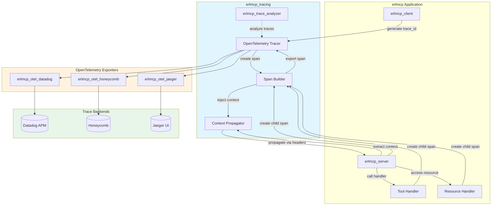
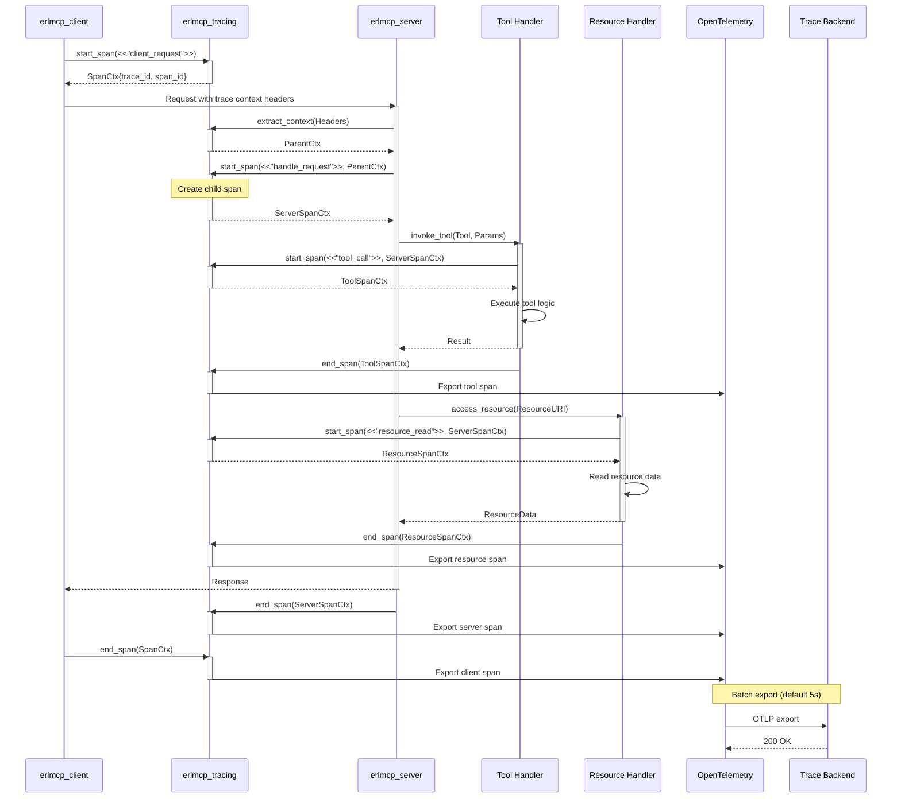
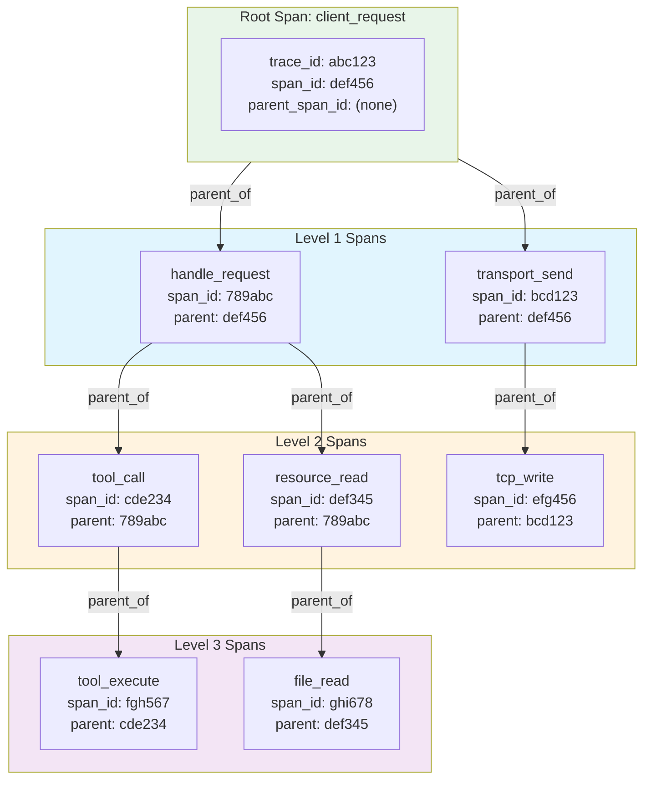
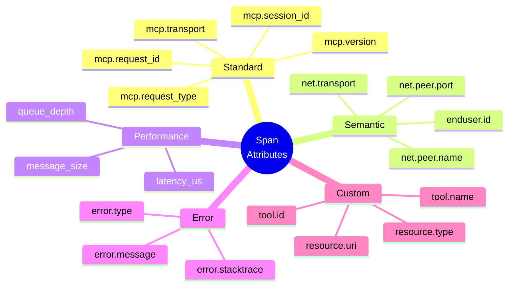
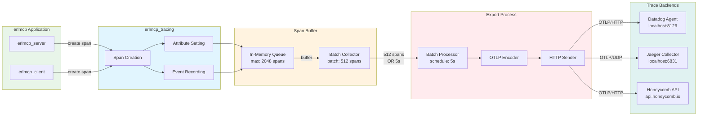
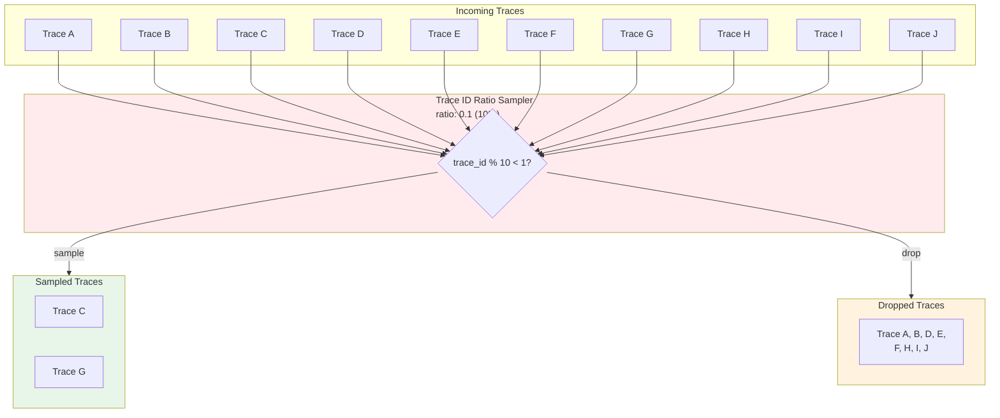
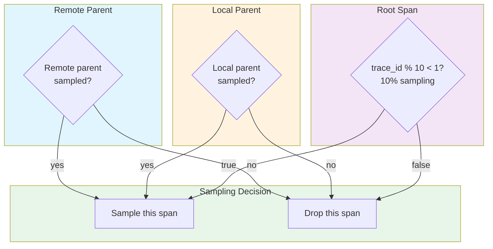

# erlmcp Distributed Tracing

## Overview

erlmcp provides OpenTelemetry-compliant distributed tracing with automatic span creation for all gen_server calls, context propagation across node boundaries, and multi-backend export (Datadog, Honeycomb, Jaeger).

## Architecture



## Trace Flow



## Automatic Spans

### gen_server Callbacks

All gen_server callbacks automatically create spans:

```erlang
% erlmcp_server.erl
handle_call({call_tool, ToolId, Params}, From, State) ->
    % AUTOMATIC SPAN: span_name = "handle_call"
    % Attributes:
    %   - mcp.module: "erlmcp_server"
    %   - mcp.request_type: "call_tool"
    %   - mcp.tool_id: ToolId

    Result = execute_tool(ToolId, Params, State),
    {reply, Result, State}.
```

**Generated Span:**
```json
{
  "name": "erlmcp_server:handle_call",
  "parent_span_id": "...",
  "trace_id": "...",
  "attributes": {
    "mcp.module": "erlmcp_server",
    "mcp.request_type": "call_tool",
    "mcp.tool_id": "my_tool"
  },
  "events": [
    {"name": "call_start", "time": "..."},
    {"name": "call_end", "time": "..."}
  ]
}
```

### Transport Operations

```erlang
% erlmcp_transport_tcp.erl
send(Data, State) ->
    % AUTOMATIC SPAN: span_name = "transport_send"
    % Attributes:
    %   - transport.type: "tcp"
    %   - transport.direction: "send"
    %   - transport.data_size: byte_size(Data)

    gen_tcp:send(State#state.socket, Data).
```

### Resource Operations

```erlang
% erlmcp_resource.erl
get(ResourceURI, State) ->
    % AUTOMATIC SPAN: span_name = "resource_get"
    % Attributes:
    %   - resource.uri: ResourceURI
    %   - resource.type: "file|http|memory"

    read_resource(ResourceURI).
```

## Manual Spans

### Creating Custom Spans

```erlang
% Using the ?WITH_SPAN macro
?WITH_SPAN(<<"custom_operation">>, #{
    <<"operation.type">> => <<"data_processing">>,
    <<"operation.input_size">> => InputSize
},
    %% Your code here
    Result = process_data(Input),

    %% Add events
    otel_span:add_event(<<"processing_step">>, #{
        <<"step">> => 1,
        <<"status">> => <<"complete">>
    }),

    %% Set status
    otel_span:set_status(otel_status:ok()),
    Result
).
```

### Span Attributes

```erlang
% Add attributes to current span
otel_span:set_current_span(<<"custom_operation">>),
otel_span:set_attribute(<<"mcp.session_id">>, SessionId),
otel_span:set_attribute(<<"mcp.user_id">>, UserId),
otel_span:set_attribute(<<"mcp.transport">>, Transport).

% Set attributes on specific span
otel_span:set_attribute(SpanCtx, <<"custom.attr">>, Value).
```

### Span Events

```erlang
% Add event with timestamp
otel_span:add_event(<<"error_occurred">>, #{
    <<"error.type">> => <<"timeout">>,
    <<"error.message">> => <<"Operation timed out">>
}).

% Add event with explicit timestamp
otel_span:add_event(SpanCtx, <<"custom_event">>, Attrs, Timestamp).
```

### Span Links

```erlang
% Link to another trace (useful for async operations)
LinkCtx = get_context_from_async_operation(),
otel_span:add_link(SpanCtx, LinkCtx).
```

## Context Propagation

### Injecting Context

```erlang
% Inject trace context into outgoing message
SpanCtx = otel_tracer:current_span_ctx(),
Headers = otel_propagator_text_map:inject(SpanCtx, #{}),

% Add headers to HTTP request / TCP message / etc.
HeadersWithTrace = maps:put("traceparent", TraceParent, Headers),
send_message_with_headers(Message, HeadersWithTrace).
```

### Extracting Context

```erlang
% Extract trace context from incoming message
Headers = get_headers_from_message(),
case otel_propagator_text_map:extract(Headers) of
    {ok, SpanCtx} ->
        % Continue trace with parent context
        ?WITH_SPAN(<<"handle_incoming">>, #{}, SpanCtx,
            handle_request(Request)
        );
    {error, no_context} ->
        % Start new trace
        ?WITH_SPAN(<<"handle_incoming">>, #{},
            handle_request(Request)
        )
end.
```

### Distributed Context

```erlang
% Cross-node tracing
Node1 = node1@host,
Node2 = node2@host,

% Node1 starts trace
?WITH_SPAN(<<"distributed_request">>, #{},
    % Send request to Node2 with trace context
    {Node2, RequestWithTrace} = prepare_request_with_trace(Request),
    gen_server:call({Node2, ?MODULE}, RequestWithTrace)
).

% Node2 extracts context and continues trace
handle_call(RequestWithTrace, From, State) ->
    SpanCtx = extract_trace_context(RequestWithTrace),
    ?WITH_SPAN(<<"handle_distributed">>, #{}, SpanCtx,
        process_request(RequestWithTrace)
    ).
```

## Span Names and Attributes

### Naming Convention

```erlang
% GOOD: Specific, descriptive names
?WITH_SPAN(<<"tool_invoke_calculator">>, #{}, ...)
?WITH_SPAN(<<"resource_read_file">>, #{}, ...)
?WITH_SPAN(<<"transport_tcp_send">>, #{}, ...)

% BAD: Generic names
?WITH_SPAN(<<"operation">>, #{}, ...)
?WITH_SPAN(<<"function">>, #{}, ...)
```

### Standard Attributes

```erlang
% MCP-specific attributes
#{
    <<"mcp.version">> => <<"2.1.0">>,
    <<"mcp.transport">> => <<"tcp">>,
    <<"mcp.session_id">> => SessionId,
    <<"mcp.request_id">> => RequestId,
    <<"mcp.request_type">> => <<"tool_call">>,

    % OpenTelemetry semantic attributes
    <<"net.transport">> => <<"IP.TCP">>,
    <<"net.peer.name">> => Hostname,
    <<"net.peer.port">> => Port,
    <<"enduser.id">> => UserId
}
```

### Error Attributes

```erlang
% Record errors in spans
case process_request(Request) of
    {ok, Result} ->
        otel_span:set_status(otel_status:ok()),
        Result;
    {error, Reason} ->
        % Record exception
        otel_span:record_exception(
            Reason,
            #{},
            [{error_stacktrace, Stacktrace}]
        ),
        otel_span:set_status(otel_status:error(Reason)),
        error
end.
```

## Sampling

### Sampling Strategies

```erlang
% Configuration
{opentelemetry, [
    {sampler, #{
        type => trace_id_ratio_based,  % Sample based on trace ID
        ratio => 0.1                   % 10% sampling
    }}
]}.

% Alternative: Always sample (development)
{opentelemetry, [
    {sampler, #{
        type => always_on
    }}
]}.

% Alternative: Never sample (disabled)
{opentelemetry, [
    {sampler, #{
        type => always_off
    }}
]}.
```

### Parent-Based Sampling

```erlang
% Sample based on parent span
{opentelemetry, [
    {sampler, #{
        type => parent_based,
        root => #{
            type => trace_id_ratio_based,
            ratio => 0.1
        },
        remote_parent_sampled => true,
        remote_parent_not_sampled => false,
        local_parent_sampled => true,
        local_parent_not_sampled => false
    }}
]}.
```

## Trace Analysis

### Trace Analyzer

```erlang
% Analyze trace for performance issues
{ok, Analysis} = erlmcp_trace_analyzer:analyze(TraceId),

% Analysis includes:
% - Total duration
% - Critical path
% - Slow operations (> 1000ms)
% - Missing spans (gaps in trace)
% - Span depth (detect infinite loops)
% - Error count
% - Recommendations
```

### Critical Path Detection

```erlang
% Find the longest path through the trace
{ok, CriticalPath} = erlmcp_trace_analyzer:critical_path(TraceId),

% CriticalPath = [
%   {span_id, duration, operation_name},
%   ...
% ]
```

### Performance Detection

```erlang
% Detect slow operations
{ok, SlowOps} = erlmcp_trace_analyzer:find_slow_operations(TraceId, 1000),
% Returns spans with duration > 1000ms

% Detect missing spans
{ok, MissingSpans} = erlmcp_trace_analyzer:find_gaps(TraceId),
% Returns time gaps without spans (may indicate blocking operations)
```

## Configuration

### OpenTelemetry Configuration

```erlang
{opentelemetry, [
    {processors, [
        {otel_batch_processor, #{
            scheduled_delay_ms => 5000,    % Export every 5s
            max_queue_size => 2048,        % Max 2048 spans in buffer
            max_export_batch_size => 512   % Export in batches of 512
        }}
    ]},

    {sampler, #{
        type => trace_id_ratio_based,
        ratio => 0.1  % 10% sampling
    }}
]}.
```

### Exporter Configuration

```erlang
% Datadog
{erlmcp_otel_datadog, [
    {agent_host, "localhost"},
    {agent_port, 8126},
    {service_name, "erlmcp"},
    {env, "production"},
    {version, "2.1.0"}
]}.

% Jaeger
{erlmcp_otel_jaeger, [
    {host, "localhost"},
    {port, 6831},
    {service_name, "erlmcp"}
]}.

% Honeycomb
{erlmcp_otel_honeycomb, [
    {api_key, "YOUR_API_KEY"},
    {dataset, "erlmcp"},
    {service_name, "erlmcp"}
]}.
```

## Best Practices

### 1. Use Specific Span Names

```erlang
% GOOD: Descriptive name
?WITH_SPAN(<<"tool_invoke_calculator_add">>, #{}, ...)

% BAD: Generic name
?WITH_SPAN(<<"tool">>, #{}, ...)
```

### 2. Add Relevant Attributes

```erlang
% GOOD: High-value attributes
?WITH_SPAN(<<"tool_call">>, #{
    <<"tool.id">> => ToolId,
    <<"tool.input_size">> => InputSize,
    <<"session.id">> => SessionId
}, ...)

% BAD: Low-value attributes
?WITH_SPAN(<<"tool_call">>, #{
    <<"timestamp">> => erlang:system_time(millisecond),
    <<"pid">> => pid_to_list(self())
}, ...)
```

### 3. Record Errors

```erlang
case process_request(Request) of
    {ok, Result} ->
        otel_span:set_status(otel_status:ok()),
        Result;
    {error, Reason} ->
        otel_span:record_exception(Reason),
        otel_span:set_status(otel_status:error(Reason)),
        error
end.
```

### 4. Use Appropriate Sampling

```erlang
% Development: 100% sampling
{sampler, #{type => always_on}}.

% Production: 10% sampling
{sampler, #{type => trace_id_ratio_based, ratio => 0.1}}.

% High-traffic systems: 1% sampling
{sampler, #{type => trace_id_ratio_based, ratio => 0.01}}.
```

### 5. Avoid Span Explosion

```erlang
% BAD: Creating span per item in loop
lists:foreach(fun(Item) ->
    ?WITH_SPAN(<<"process_item">>, #{},
        process_item(Item)
    )
end, Items).

% GOOD: Single span with event counter
?WITH_SPAN(<<"process_items">>, #{},
    lists:foreach(fun(Item) ->
        process_item(Item)
    end, Items),
    otel_span:set_attribute(<<"items.count">>, length(Items))
).
```

## Troubleshooting

### Missing Spans

```erlang
% Check if tracing is enabled
erlmcp_otel:is_enabled().

% Check sampler configuration
opentelemetry:get_sampler().

% Verify context propagation
erlmcp_tracing:current_context().
```

### High Memory Usage

```erlang
% Check buffer size
otel_batch_processor:get_buffer_size().

% Reduce buffer size
{max_queue_size, 512}  % Default 2048

% Increase sampling ratio
{ratio, 0.05}  % 5% instead of 10%
```

### Slow Exports

```erlang
% Check batch size
{max_export_batch_size, 512}.

% Increase export interval
{scheduled_delay_ms, 10000}.  % 10s instead of 5s
```

## API Reference

### Span Creation

```erlang
% Create span with macro
?WITH_SPAN(Name, Attributes, Fun).
?WITH_SPAN(Name, Attributes, ParentCtx, Fun).

% Create span manually
{ok, SpanCtx} = otel_tracer:start_span(Name, Attributes).
otel_tracer:end_span(SpanCtx).
```

### Context Management

```erlang
% Get current context
Ctx = otel_ctx:get_current(),

% Get current span
Span = otel_span:get_current_span(),

% Set current span
otel_ctx:set_current(Ctx).

% Inject/Extract context
Headers = otel_propagator_text_map:inject(SpanCtx, #{}),
{ok, SpanCtx} = otel_propagator_text_map:extract(Headers).
```

### Span Attributes

```erlang
% Set attributes
otel_span:set_attribute(Key, Value).
otel_span:set_attributes(#{}).

% Add events
otel_span:add_event(Name).
otel_span:add_event(Name, Attributes).

% Record exceptions
otel_span:record_exception(Exception).
otel_span:record_exception(Exception, Attributes, Stacktrace).

% Set status
otel_span:set_status(otel_status:ok()).
otel_span:set_status(otel_status:error(Description)).
```

## Distributed Tracing Diagrams

### Span Hierarchy



### Trace Context Propagation

```mermaid
sequenceDiagram
    participant Client as erlmcp_client
    participant Tracer as erlmcp_tracing
    participant Server as erlmcp_server
    participant Handler as Tool Handler
    participant DB as Resource (DB/File)

    Client->>Tracer: start_span(<<"client_request">>)
    activate Tracer
    Tracer-->>Client: Ctx{trace_id: abc, span_id: def}
    deactivate Tracer

    Client->>Client: Inject context into headers
    Note over Client: Headers = {<br/>  "traceparent": "00-abc-def-01",<br/>  "mcp.trace_id": "abc"<br/>}

    Client->>Server: Request with trace headers
    activate Server
    Server->>Tracer: extract_context(Headers)
    activate Tracer
    Tracer-->>Server: ParentCtx{trace_id: abc, parent_span_id: def}
    deactivate Tracer

    Server->>Tracer: start_span(<<"handle_request">>, ParentCtx)
    activate Tracer
    Note over Tracer: New span_id: ghi<br/>parent: def
    Tracer-->>Server: ServerCtx
    deactivate Tracer

    Server->>Handler: invoke_tool(Tool, ServerCtx)
    activate Handler
    Handler->>Tracer: start_span(<<"tool_call">>, ServerCtx)
    activate Tracer
    Note over Tracer: New span_id: jkl<br/>parent: ghi
    Tracer-->>Handler: ToolCtx
    deactivate Tracer

    Handler->>DB: read_resource(ToolCtx)
    activate DB
    Note over DB: Same trace_id: abc<br/>parent: jkl
    DB-->>Handler: Resource Data
    deactivate DB

    Handler->>Tracer: end_span(ToolCtx)
    deactivate Handler

    Server->>Tracer: end_span(ServerCtx)
    deactivate Server

    Client->>Tracer: end_span(ClientCtx)
    deactivate Client
```

### Span Attributes



### Trace Export Pipeline



## Sampling Strategies



### Parent-Based Sampling



## Trace Analysis

### Critical Path Detection



```mermaid
gantt
    title Trace Critical Path Analysis
    dateFormat X
    axisFormat %L0

    section Client Request
    client_request        :0, 500

    section Server Processing
    handle_request        :501, 300
    tool_call             :801, 150
    tool_execute          :951, 200
    resource_read         :802, 100
    response_serialize    :1152, 50

    section Transport
    tcp_send              :1203, 100
    tcp_recv              :1304, 50

    section Critical Path
    CRITICAL client_request :crit, 0, 500
    CRITICAL handle_request :crit, 501, 300
    CRITICAL tool_call      :crit, 801, 150
    CRITICAL tool_execute   :crit, 951, 200
    CRITICAL tcp_send       :crit, 1203, 100
    CRITICAL tcp_recv       :crit, 1304, 50
```

### Performance Analysis

```mermaid
graph LR
    subgraph Metrics["Span Metrics"]
        Total[Total Duration: 1354us]
        Critical[Critical Path: 1354us]
        Parallel[Parallel Work: 150us]
    end

    subgraph Analysis["Performance Analysis"]
        Bottleneck[Bottleneck: tool_execute<br/>200us (14.8%)]
        Optimization[Optimization: Parallelize<br/>resource_read]
        Efficiency[Parallelism:<br/>150us / 1354us = 11%]
    end

    subgraph Recommendations["Recommendations"]
        R1[Reduce tool_execute time]
        R2[Parallelize independent operations]
        R3[Cache resource reads]
    end

    Total --> Analysis
    Critical --> Analysis
    Parallel --> Analysis

    Bottleneck --> Recommendations
    Optimization --> Recommendations
    Efficiency --> Recommendations

    style Metrics fill:#e1f5fe
    style Analysis fill:#fff3e0
    style Recommendations fill:#e8f5e9
```

## Further Reading

- [OpenTelemetry Specification](https://opentelemetry.io/docs/reference/specification/trace/)
- [Trace Context](https://www.w3.org/TR/trace-context/)
- [Semantic Conventions](https://opentelemetry.io/docs/reference/specification/trace/semantic_conventions/)
