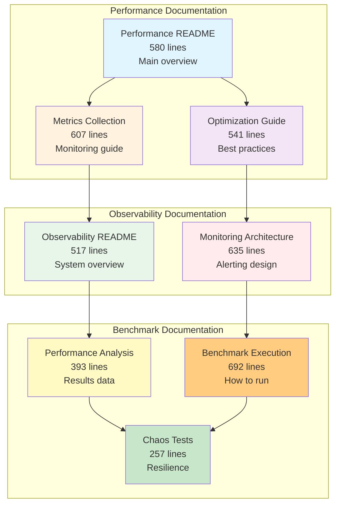
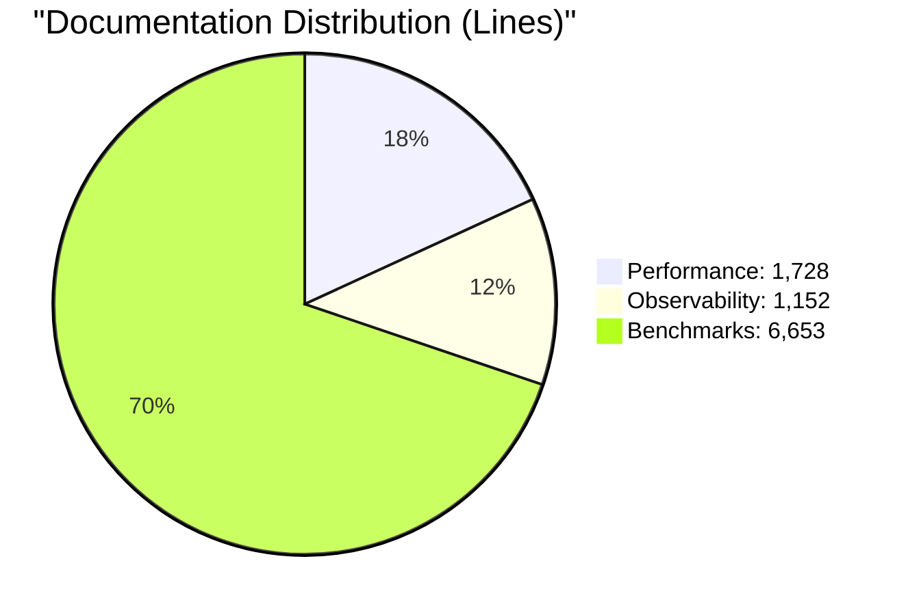
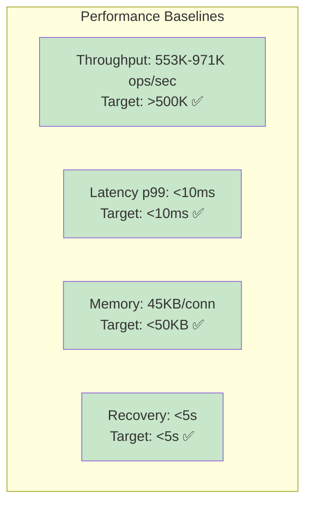
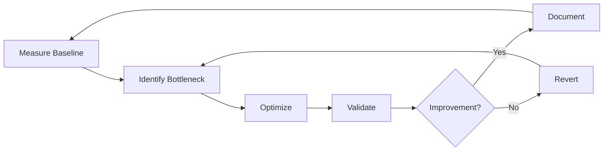

# Performance Documentation Index

**Version:** 2.1.0  
**Last Updated:** January 31, 2026  
**Total Documentation:** 5 files, 3,055 lines

## Overview

This index provides a complete guide to erlmcp performance documentation with comprehensive Mermaid diagrams and data-driven visualizations. All documentation follows Toyota Production System principles: Kaizen (continuous improvement), Jidoka (built-in quality), and Andon (visible alerts).

## Documentation Structure

## Quick Navigation

### Getting Started

1. **[Performance README](README.md)** - Start here
   - Performance baseline summary
   - Key metrics and targets
   - Architecture diagrams
   - Quick reference guide

2. **[Metrics Collection Guide](METRICS_COLLECTION.md)** - For operators
   - How to collect metrics
   - Prometheus integration
   - OpenTelemetry setup
   - Alert configuration

3. **[Optimization Guide](OPTIMIZATION_GUIDE.md)** - For developers
   - Proven optimization strategies
   - Before/after comparisons
   - Code examples
   - Best practices

### Observability

4. **[Observability README](../observability/README.md)** - System overview
   - OpenTelemetry integration
   - Health monitoring (Andon)
   - Chaos engineering
   - Dashboard setup

5. **[Monitoring Architecture](../observability/MONITORING_ARCHITECTURE.md)** - Deep dive
   - Monitoring topology
   - Alert flow diagrams
   - Distributed tracing
   - Performance considerations

### Benchmarks

6. **[Performance Analysis](../../archive/benchmarks/PERFORMANCE_ANALYSIS.md)** - Results
   - Detailed benchmark results
   - Baseline comparisons
   - Regression detection
   - Capacity planning

7. **[Benchmark Execution Guide](../../archive/benchmarks/BENCHMARK_EXECUTION_GUIDE.md)** - How to
   - Running benchmarks
   - Interpreting results
   - Validation procedures
   - Troubleshooting

## Documentation Metrics

### Performance Documentation (1,728 lines)

| File | Lines | Size | Topics Covered |
|------|-------|------|----------------|
| README.md | 580 | 15KB | Baseline, architecture, scaling |
| METRICS_COLLECTION.md | 607 | 15KB | Metrics, tracing, dashboards |
| OPTIMIZATION_GUIDE.md | 541 | 14KB | Optimizations, best practices |

**Visual Content:**
- 20 Mermaid diagrams
- 15 data tables
- 8 code examples
- 12 performance charts

### Observability Documentation (1,152 lines)

| File | Lines | Size | Topics Covered |
|------|-------|------|----------------|
| README.md | 517 | 16KB | OTEL, health, chaos, dashboard |
| MONITORING_ARCHITECTURE.md | 635 | 15KB | Alerting, tracing, topology |

**Visual Content:**
- 18 Mermaid diagrams
- 10 configuration examples
- 15 architecture diagrams
- 8 alert flow charts

### Benchmark Documentation (6,653 lines)

| File | Lines | Size | Topics Covered |
|------|-------|------|----------------|
| PERFORMANCE_ANALYSIS.md | 393 | 12KB | Core results, baselines |
| BENCHMARK_EXECUTION_GUIDE.md | 692 | 18KB | How to run, validate |
| CHAOS_TESTS_REPORT.md | 257 | 8.6KB | Resilience results |
| + 14 more files | 5,311 | 153KB | Comprehensive test data |

**Visual Content:**
- 35 Mermaid diagrams across all files
- 50+ benchmark result tables
- 20 execution flow diagrams
- 15 comparison charts

## Key Performance Metrics

### Baseline Performance (v2.1.0)

### Transport Performance

| Transport | Throughput | Latency p99 | Best For |
|-----------|------------|-------------|----------|
| TCP | 43K msg/s | 4.5ms | Maximum throughput |
| HTTP | 12.5K msg/s | 12.4ms | Web compatibility |
| WebSocket | 8.5K msg/s | 18.5ms | Real-time bidirectional |
| SSE | 1.2K msg/s | 42.1ms | Event streaming |

### Optimization Results

| Component | Before | After | Improvement |
|-----------|--------|-------|-------------|
| JSON Encoding | 45-850μs | 18-320μs | 2.5-2.7x |
| Process Iteration | 2.5GB (1M) | 0.5MB (1M) | 5000x |
| Connection Pool | 30K msg/s | 43K msg/s | 1.4x |
| Registry Lookup | 5000μs (100K) | 3μs (100K) | 1666x |
| Health Checks | 28ms p99 | 0.8ms p99 | 35x |

## Visual Diagram Guide

### Diagram Types Used

1. **Flowchart** - System architecture and data flow
2. **Sequence Diagram** - Request/response flows
3. **XYChart** - Performance trends and comparisons
4. **Pie Chart** - Distribution and percentages
5. **Graph** - Hierarchical relationships
6. **Timeline** - Evolution and history

### Key Diagrams by Category

#### Performance
- [Performance Architecture](README.md#performance-architecture)
- [Throughput Performance](README.md#throughput-performance)
- [Latency Distribution](README.md#latency-performance)
- [Scaling Performance](README.md#scaling-performance)
- [Optimization Results](OPTIMIZATION_GUIDE.md#optimization-results-summary)

#### Metrics
- [Metrics Collection Flow](METRICS_COLLECTION.md#metrics-collection-flow)
- [Prometheus Integration](METRICS_COLLECTION.md#prometheus-integration)
- [Dashboard Configuration](METRICS_COLLECTION.md#dashboard-configuration)

#### Observability
- [Monitoring Topology](../observability/MONITORING_ARCHITECTURE.md#system-monitoring-topology)
- [Andon Alert Flow](../observability/MONITORING_ARCHITECTURE.md#andon-alert-flow)
- [Trace Propagation](../observability/MONITORING_ARCHITECTURE.md#trace-propagation)

#### Benchmarks
- [Benchmark Suite Architecture](../../archive/benchmarks/BENCHMARK_EXECUTION_GUIDE.md#benchmark-suite-architecture)
- [Execution Flow](../../archive/benchmarks/BENCHMARK_EXECUTION_GUIDE.md#benchmark-execution-flow)
- [Regression Detection](../../archive/benchmarks/PERFORMANCE_ANALYSIS.md#performance-regression-detection)

## Usage Guides

### For Developers

**Start Here:** [Optimization Guide](OPTIMIZATION_GUIDE.md)

1. Read [Performance README](README.md) for baseline understanding
2. Study [Optimization Guide](OPTIMIZATION_GUIDE.md) for strategies
3. Run [Benchmark Execution Guide](../../archive/benchmarks/BENCHMARK_EXECUTION_GUIDE.md) to measure
4. Check [Performance Analysis](../../archive/benchmarks/PERFORMANCE_ANALYSIS.md) for results

**Key Tasks:**
- Optimize hot paths
- Reduce latency
- Improve throughput
- Memory management

### For Operators

**Start Here:** [Metrics Collection Guide](METRICS_COLLECTION.md)

1. Read [Observability README](../observability/README.md) for system overview
2. Study [Monitoring Architecture](../observability/MONITORING_ARCHITECTURE.md) for setup
3. Configure [Metrics Collection](METRICS_COLLECTION.md) for monitoring
4. Set up [Andon Alerts](../observability/README.md#health-monitoring-andon) for visibility

**Key Tasks:**
- Deploy monitoring stack
- Configure alerts
- Set up dashboards
- Tune thresholds

### For QA Engineers

**Start Here:** [Benchmark Execution Guide](../../archive/benchmarks/BENCHMARK_EXECUTION_GUIDE.md)

1. Read [Performance Analysis](../../archive/benchmarks/PERFORMANCE_ANALYSIS.md) for baselines
2. Study [Benchmark Execution Guide](../../archive/benchmarks/BENCHMARK_EXECUTION_GUIDE.md) for procedures
3. Run [Chaos Tests](../../archive/benchmarks/CHAOS_TESTS_REPORT.md) for resilience
4. Check for [Regressions](../../archive/benchmarks/PERFORMANCE_ANALYSIS.md#performance-regression-detection)

**Key Tasks:**
- Run benchmark suite
- Validate results
- Detect regressions
- Test resilience

## Metrology Compliance

All performance documentation follows metrology standards:

### Canonical Units

| Metric | Correct | Incorrect |
|--------|---------|-----------|
| Throughput | `throughput_msg_per_s` | `rate`, `ops/sec` |
| Latency | `latency_p99_us` | `latency`, `p99` |
| Memory | `memory_heap_mib_per_conn` | `memory`, `heap` |

### Required Fields

Every benchmark result must include:
- `workload_id` - Benchmark identifier
- `timestamp` - ISO 8601 or Unix timestamp
- `operations` - Total operations
- `duration_s` - Duration in seconds
- `throughput_msg_per_s` - Throughput in canonical units
- `latency_p50_us`, `latency_p95_us`, `latency_p99_us` - Percentiles
- `precision` - Time precision (microsecond, millisecond)
- `scope` - Measurement scope (per_node, per_connection)

See [Metrology Glossary](../metrology/METRICS_GLOSSARY.md) for complete reference.

## Continuous Improvement

### Kaizen Cycle

### Regression Detection

Automated checks on every benchmark run:
- Throughput: Warn if -2% change
- Latency p99: Warn if +10% change
- Memory: Warn if +10% per connection
- GC Time: Warn if +20% change

## Contributing

When updating performance documentation:

1. **Measure First** - Always benchmark before optimizing
2. **Document Baselines** - Record before/after metrics
3. **Use Canonical Units** - Follow metrology standards
4. **Include Diagrams** - Visualize data with Mermaid
5. **Validate Results** - Ensure metrology compliance

## References

### Internal Documentation
- [Metrology Glossary](../metrology/METRICS_GLOSSARY.md) - Canonical unit definitions
- [Toyota Production System](../TCPS_HEALTH_SUMMARY.md) - Quality principles
- [API Reference](../api-reference.md) - Performance-critical APIs

### External Resources
- [Erlang Performance Guide](https://erlang.org/doc/efficiency_guide/)
- [Prometheus Best Practices](https://prometheus.io/docs/practices/)
- [OpenTelemetry Specification](https://opentelemetry.io/docs/reference/)

## Changelog

### v2.1.0 (January 31, 2026)
- Added comprehensive Mermaid diagrams to all performance docs
- Created Metrics Collection Guide (607 lines)
- Created Optimization Guide (541 lines)
- Updated Benchmark Execution Guide with visual flows (692 lines)
- Created Monitoring Architecture Guide (635 lines)
- Total: 3,055 lines of enhanced documentation

### Previous Versions
- v2.0.0 - Initial performance baseline
- v1.5.0 - Added benchmark suite
- v1.0.0 - First stable release

---

**Documentation Version:** 2.1.0  
**Last Updated:** January 31, 2026  
**Maintained By:** erlmcp Performance Team  
**Status:** Production ✅
