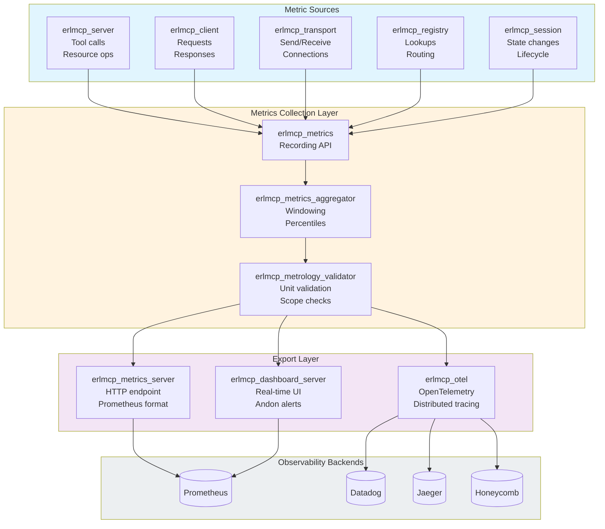
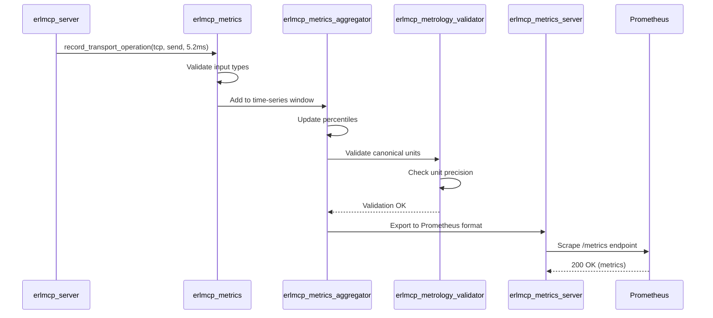
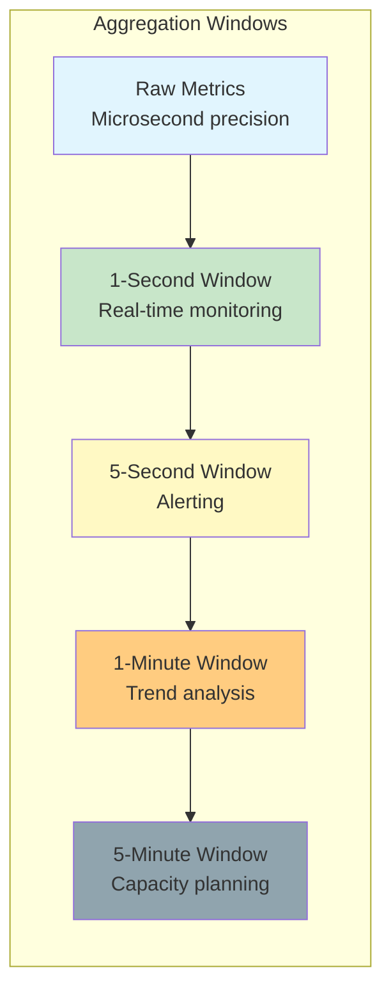
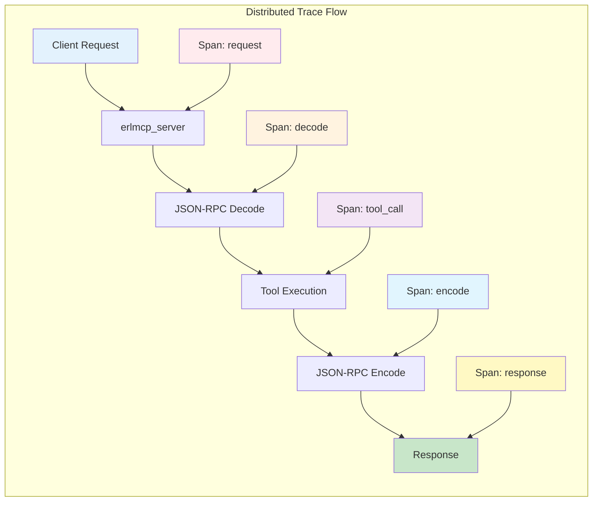
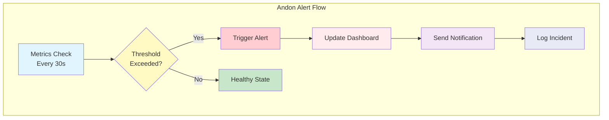
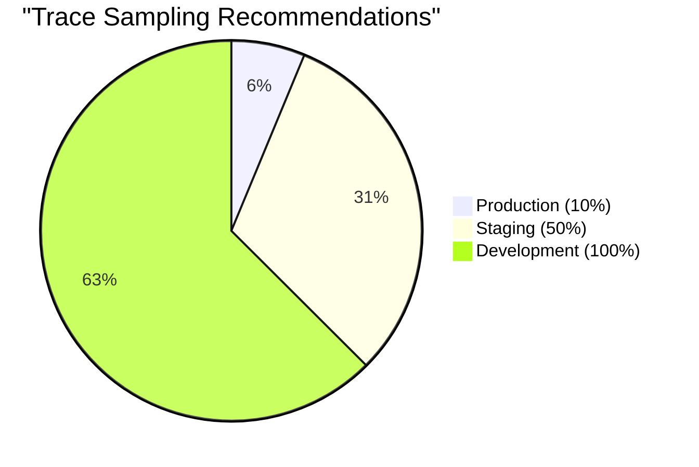

# Metrics Collection & Monitoring Guide

**Version:** 2.1.0  
**Last Updated:** January 31, 2026

## Overview

erlmcp provides comprehensive metrics collection following metrology standards (canonical units, validated precision). All metrics are automatically collected and exported to observability backends.

## Metrics Architecture



## Metric Types

### 1. Counter (Monotonically Increasing)

**Definition:** Cumulative metric that only increases  
**Use Case:** Counting events (requests, errors, connections)

```erlang
% Record a counter
erlmcp_metrics:counter(<<"messages_processed_total">>, #{
    <<"transport">> => tcp,
    <<"direction">> => receive
}).

% Example output
messages_processed_total{transport="tcp",direction="receive"} 1234567
```

**Canonical Counter Metrics:**

| Metric Name | Description | Labels |
|-------------|-------------|--------|
| `connections_total` | Total connections established | transport, status |
| `messages_sent_total` | Total messages sent | transport, error |
| `messages_received_total` | Total messages received | transport, error |
| `errors_total` | Total errors | error_type, component |
| `tool_calls_total` | Total tool invocations | tool_name, status |

### 2. Histogram (Distributions)

**Definition:** Metric that counts observations into configurable buckets  
**Use Case:** Latency, request sizes, response times

```erlang
% Record a histogram value
erlmcp_metrics:histogram(<<"request_latency_us">>, 5432, #{
    <<"endpoint">> => <<"tools/call">>,
    <<"transport">> => tcp
}).

% Example output (Prometheus format)
request_latency_us_bucket{endpoint="tools/call",transport="tcp",le="10"} 0
request_latency_us_bucket{endpoint="tools/call",transport="tcp",le="100"} 42
request_latency_us_bucket{endpoint="tools/call",transport="tcp",le="1000"} 1234
request_latency_us_bucket{endpoint="tools/call",transport="tcp",le="+Inf"} 5678
request_latency_us_sum{endpoint="tools/call",transport="tcp"} 2345678
request_latency_us_count{endpoint="tools/call",transport="tcp"} 5678
```

**Canonical Histogram Metrics:**

| Metric Name | Description | Unit | Labels |
|-------------|-------------|------|--------|
| `request_latency_us` | Request latency | microseconds | endpoint, transport |
| `throughput_msg_per_s` | Message throughput | msg/sec | transport, direction |
| `message_size_bytes` | Message size distribution | bytes | transport, direction |
| `queue_latency_us` | Queue wait time | microseconds | queue_name |
| `gc_duration_us` | Garbage collection duration | microseconds | gen, type |

### 3. Gauge (Point-in-Time)

**Definition:** Metric that can go up or down  
**Use Case:** Current state (memory, connections, queue depth)

```erlang
% Set a gauge value
erlmcp_metrics:gauge(<<"active_connections">>, 42).

% Increment/decrement
erlmcp_metrics:gauge_inc(<<"active_connections">>).
erlmcp_metrics:gauge_dec(<<"active_connections">>).

% Example output
active_connections 42
```

**Canonical Gauge Metrics:**

| Metric Name | Description | Unit | Labels |
|-------------|-------------|------|--------|
| `active_connections` | Currently active connections | connections | transport, state |
| `memory_heap_mib` | Heap memory usage | MiB | scope, node |
| `memory_rss_mib` | Resident set size | MiB | scope, node |
| `process_count` | Erlang process count | processes | node |
| `queue_depth` | Message queue depth | messages | queue_name |

## Metric Collection Flow



## Time-Series Aggregation

### Windowing Strategy



### Percentile Calculation

```erlang
% Aggregator computes percentiles for each window
-calculate_percentiles(WindowData) ->
    Sorted = lists:sort(WindowData),
    Count = length(Sorted),
    #{
        p50 => percentile(Sorted, Count, 0.50),
        p90 => percentile(Sorted, Count, 0.90),
        p95 => percentile(Sorted, Count, 0.95),
        p99 => percentile(Sorted, Count, 0.99),
        p999 => percentile(Sorted, Count, 0.999)
    }.

percentile(Sorted, Count, P) ->
    Index = max(1, round(P * Count)),
    lists:nth(Index, Sorted).
```

## Prometheus Integration

### Configuration

```erlang
% sys.config
{erlmcp_metrics_server, [
    {enabled, true},
    {port, 8080},
    {endpoint, "/metrics"},
    {scrape_interval, 15000},  % 15 seconds
    {aggregation_window, 5000}  % 5 seconds
]}.
```

### Prometheus Scrape Config

```yaml
# prometheus.yml
scrape_configs:
  - job_name: 'erlmcp'
    static_configs:
      - targets: ['localhost:8080']
    scrape_interval: 15s
    metrics_path: /metrics
    honor_labels: true
```

### Example PromQL Queries

```promql
# Throughput (messages per second)
rate(messages_sent_total[5m])

# P99 latency
histogram_quantile(0.99, rate(request_latency_us_bucket[5m]))

# Error rate
rate(errors_total[5m]) / rate(messages_processed_total[5m])

# Memory per connection
memory_heap_mib / active_connections

# Connection growth rate
rate(connections_total[1h])
```

## OpenTelemetry Integration

### Distributed Tracing



### Trace Context Propagation

```erlang
% Automatic span creation
-module(erlmcp_server).
-behaviour(gen_server).

handle_call({call_tool, ToolName, Args}, _From, State) ->
    ?WITH_SPAN(<<"tool_call">>, #{
        <<"tool_name">> => ToolName,
        <<"args">> => length(Args)
    },
        % Tool execution logic
        Result = execute_tool(ToolName, Args),
        {reply, Result, State}
    ).
```

### OTEL Exporter Configuration

```erlang
{opentelemetry, [
    {processors, [
        {otel_batch_processor, #{
            scheduled_delay_ms => 1000,
            max_queue_size => 2048,
            export_timeout_ms => 30000
        }}
    ]},
    {exporters, [
        {otel_exporter_jaeger, #{
            host => "localhost",
            port => 6831
        }}
    ]},
    {sampler, #{
        type => trace_id_ratio_based,
        ratio => 0.1  % Sample 10% of traces
    }}
]}.
```

## Dashboard Configuration

### Real-Time Metrics Dashboard

```erlang
{erlmcp_dashboard_server, [
    {enabled, true},
    {port, 8080},
    {refresh_interval, 1000},  % 1 second
    {panels, [
        #{name => <<"Throughput">>, type => line_chart, metrics => [<<"throughput_msg_per_s">>]},
        #{name => <<"Latency">>, type => heatmap, metrics => [<<"request_latency_us">>]},
        #{name => <<"Connections">>, type => gauge, metrics => [<<"active_connections">>]},
        #{name => <<"Memory">>, type => line_chart, metrics => [<<"memory_heap_mib">>]}
    ]}
]}.
```

### Andon Alert System



### Andon Threshold Configuration

```erlang
{erlmcp_health_monitor, [
    {check_interval, 30000},  % 30 seconds
    {thresholds, #{
        latency_p99_us => 10000000,  % 10 seconds
        error_rate_5m => 0.05,  % 5%
        memory_heap_mib_per_conn => 100,
        connection_failures_1m => 100,
        throughput_msg_per_s => 400000  % Minimum throughput
    }},
    {alert_handlers, [
        {erlmcp_dashboard_server, alert},
        {logger, warning},
        {otel, trace}
    ]}
]}.
```

## Metrics Optimization

### Sampling Strategies



**Configuration:**
```erlang
% Production: Sample 10% of traces
{sampler, #{type => trace_id_ratio_based, ratio => 0.1}}

% Staging: Sample 50% of traces
{sampler, #{type => trace_id_ratio_based, ratio => 0.5}}

% Development: Sample all traces
{sampler, #{type => always_on}}
```

### Aggregation Window Tuning

| Window Size | Use Case | Pros | Cons |
|-------------|----------|------|------|
| 1 second | Real-time alerting | Immediate detection | High noise |
| 5 seconds | Standard monitoring | Balanced | Slight delay |
| 1 minute | Trend analysis | Smooth curves | Delayed detection |
| 5 minutes | Capacity planning | Long-term patterns | Not for alerting |

**Recommendation:** Use 5-second window for production monitoring

### Memory Management

```erlang
% Retention policy
{erlmcp_metrics_aggregator, [
    {retention, #{
        raw_metrics => 3600,  % 1 hour
        downsampled_1s => 86400,  % 24 hours
        downsampled_1m => 604800  % 7 days
    }}
]}.
```

## Metrology Compliance

### Validation Rules

```erlang
% All metrics must pass validation
validate_metric(MetricName, Value, Labels) ->
    Rules = [
        {name, fun is_binary/1},
        {value, fun is_number/1},
        {labels, fun is_map/1},
        {canonical_unit, fun check_canonical_unit/1},
        {scope, fun check_scope/1}
    ],
    lists:all(fun({_, Check}) -> Check(MetricName, Value, Labels) end, Rules).
```

### Canonical Unit Enforcement

```erlang
% GOOD: Canonical units
erlmcp_metrics:histogram(<<"request_latency_us">>, 5432, #{}).

% BAD: Ambiguous units (rejected by validator)
erlmcp_metrics:histogram(<<"request_latency">>, 5.432, #{}).
```

See [Metrology Glossary](../metrology/METRICS_GLOSSARY.md) for complete unit reference.

## Troubleshooting

### Missing Metrics

**Problem:** Metrics not appearing in Prometheus

**Diagnosis:**
```bash
# Check if metrics server is running
curl http://localhost:8080/metrics

# Check aggregator buffer
erlmcp_metrics_aggregator:get_buffer_size()

# Check validation errors
erlmcp_metrology_validator:get_violations()
```

**Solution:** Verify metrics server enabled and port accessible

### High Memory Usage

**Problem:** Metrics aggregator consuming too much memory

**Diagnosis:**
```bash
# Check buffer size
erlmcp_metrics_aggregator:get_buffer_size()

# Check retention policy
erlmcp_metrics_aggregator:get_retention().
```

**Solution:**
```erlang
% Reduce aggregation window
{aggregation_window, 10000}  % 10 seconds instead of 1s

% Reduce retention
{retention, #{
    raw_metrics => 1800,  % 30 minutes instead of 1 hour
    downsampled_1s => 43200  % 12 hours instead of 24
}}
```

### Slow Metrics Export

**Problem:** Prometheus scrape timeouts

**Diagnosis:**
```bash
# Time the scrape
time curl http://localhost:8080/metrics > /dev/null
```

**Solution:**
```erlang
% Increase scrape timeout in Prometheus
scrape_timeout: 30s

% Reduce metric cardinality
% Use labels selectively
erlmcp_metrics:counter(<<"requests_total">>, #{
    <<"endpoint">> => Endpoint  % GOOD: Low cardinality
    % NOT: <<"request_id">> => RequestId  % BAD: High cardinality
}).
```

## Best Practices

### 1. Use Canonical Metric Names

```erlang
% GOOD: Explicit unit
<<"throughput_msg_per_s">>

% BAD: Ambiguous unit
<<"throughput">>
<<"rate">>
```

### 2. Limit Label Cardinality

```erlang
% GOOD: Low cardinality labels (endpoint, transport)
erlmcp_metrics:counter(<<"requests_total">>, #{
    <<"endpoint">> => <<"tools/call">>,
    <<"transport">> => tcp
}).

% BAD: High cardinality labels (request_id, user_id)
erlmcp_metrics:counter(<<"requests_total">>, #{
    <<"request_id">> => RequestId,  % Unique per request
    <<"user_id">> => UserId  % Unique per user
}).
```

### 3. Set Appropriate Sampling

```erlang
% Production: 10% sampling
{sampler, #{type => trace_id_ratio_based, ratio => 0.1}}
```

### 4. Monitor Metrics Overhead

```erlang
% Track metrics system performance
erlmcp_metrics:histogram(<<"metrics_export_duration_us">>, Duration).
erlmcp_metrics:gauge(<<"metrics_buffer_size">>, Size).
```

### 5. Validate Metrics Early

```erlang
% Validate in tests
validate_benchmark_output(BenchmarkResult) ->
    case erlmcp_metrology_validator:validate_benchmark_output(BenchmarkResult) of
        {ok, _} -> pass;
        {error, Errors} -> {fail, Errors}
    end.
```

## References

- [Metrics Reference](../observability/metrics.md)
- [Tracing Guide](../observability/tracing.md)
- [Dashboard & Andon](../observability/dashboard.md)
- [Metrology Glossary](../metrology/METRICS_GLOSSARY.md)

---

**Last Updated:** January 31, 2026  
**Version:** 2.1.0
