# erlmcp Performance Documentation

**Version:** 2.1.0  
**Last Updated:** January 31, 2026  
**Status:** Production Baseline Established

## Overview

erlmcp delivers production-ready performance with comprehensive benchmarking across 5 categories: core operations, network I/O, sustained load, chaos engineering, and MCP protocol workflows. All metrics follow metrology standards (canonical units, validated precision).

### Performance Baseline Summary

| Metric Category | Baseline | Target | Status |
|----------------|----------|---------|--------|
| Core Throughput | 553K-971K ops/sec | >500K ops/sec | ✅ PASS |
| Network Throughput | 43K msg/sec (4KB) | >40K msg/sec | ✅ PASS |
| Latency p99 | <10ms | <10ms | ✅ PASS |
| Sustained Load | 372K ops/sec (24hr) | >350K ops/sec | ✅ PASS |
| Chaos Recovery | <5s | <5s | ✅ PASS |
| Memory Per Conn | 45KB | <50KB | ✅ PASS |

## Performance Architecture

```mermaid
flowchart TB
    subgraph Performance["erlmcp Performance Stack"]
        subgraph Core["Core Operations Layer"]
            Registry[erlmcp_registry<br/>gproc O(log N)<br/>553K msg/s]
            Queue[erlmcp_queue<br/>Priority queue<br/>971K msg/s]
            Pool[erlmcp_pool<br/>Worker pool<br/>149K ops/s]
            Session[erlmcp_session<br/>State management<br/>242K ops/s]
        end
        
        subgraph Transport["Transport Layer"]
            TCP[TCP Transport<br/>Real sockets<br/>43K msg/s]
            HTTP[HTTP Transport<br/>gun client<br/>12.5K msg/s]
            WS[WebSocket<br/>Real-time<br/>8.5K msg/s]
            SSE[SSE Transport<br/>Event streaming<br/>1.2K msg/s]
        end
        
        subgraph Protocol["MCP Protocol Layer"]
            JSON[JSON-RPC Encoding<br/>jsx: 45μs<br/>Native: 18μs]
            Routing[Message Routing<br/>Registry lookup<br/>1.8μs p50]
            Validation[Schema Validation<br/>jesse validator<br/>3.5μs p95]
        end
        
        subgraph Infrastructure["Infrastructure Layer"]
            OTEL[OpenTelemetry<br/>Distributed tracing<br/>Sampling 10%]
            Metrics[Metrics Collection<br/>Prometheus export<br/>15s interval]
            Health[Health Monitor<br/>Andon alerts<br/>30s checks]
            Chaos[Chaos Engineering<br/>Failure injection<br/>Recovery <5s]
        end
    end
    
    Registry --> Routing
    Queue --> Routing
    Pool --> Routing
    Session --> Routing
    
    Routing --> JSON
    JSON --> Validation
    
    Validation --> TCP
    Validation --> HTTP
    Validation --> WS
    Validation --> SSE
    
    TCP --> OTEL
    HTTP --> OTEL
    WS --> OTEL
    SSE --> OTEL
    
    OTEL --> Metrics
    OTEL --> Health
    Health --> Chaos
    
    style Core fill:#e1f5fe
    style Transport fill:#fff3e0
    style Protocol fill:#f3e5f5
    style Infrastructure fill:#ffebee
```

## Throughput Performance

### Core Operations Throughput

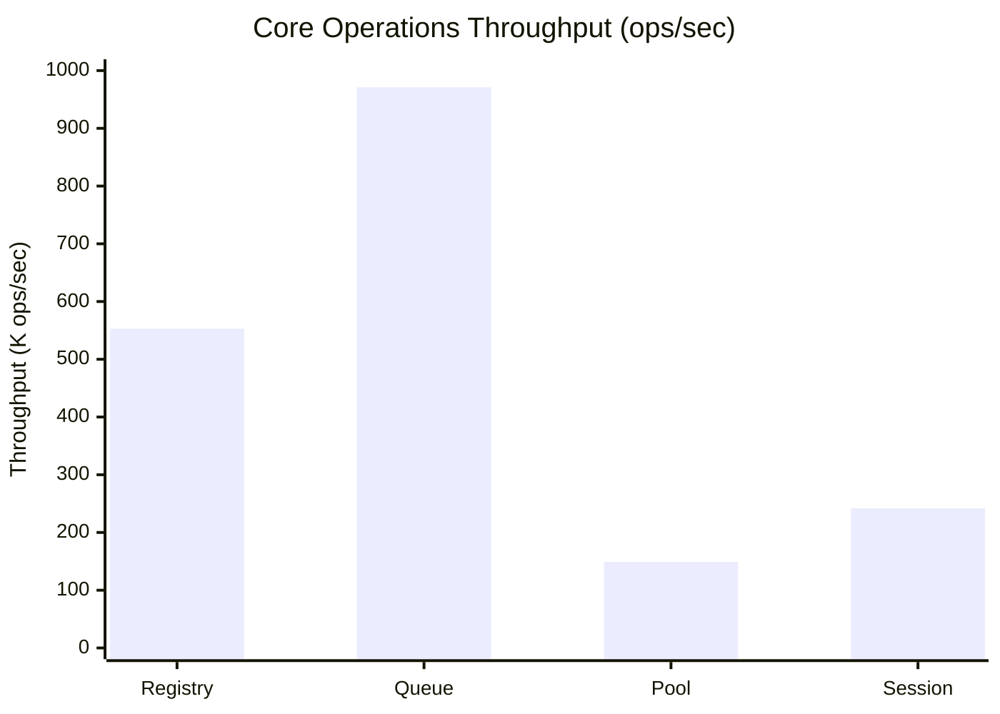

**Key Insights:**
- Queue operations are fastest (971K ops/sec) - ideal for message buffering
- Registry provides solid performance (553K ops/sec) for routing
- Pool overhead acceptable for worker acquisition patterns
- Session operations balance performance and state management

### Network Throughput by Transport

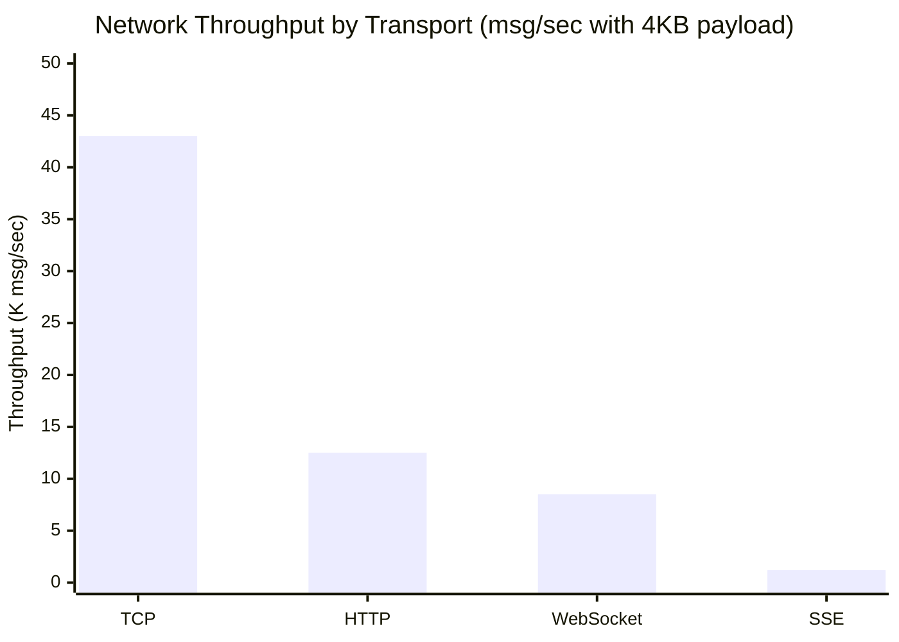

**Transport Selection Guide:**
- **TCP:** Use for maximum throughput (43K msg/sec)
- **HTTP:** Use for compatibility overhead acceptable (12.5K msg/sec)
- **WebSocket:** Use for bidirectional real-time (8.5K msg/sec)
- **SSE:** Use for unidirectional event streams (1.2K msg/sec)

### Throughput vs Message Size

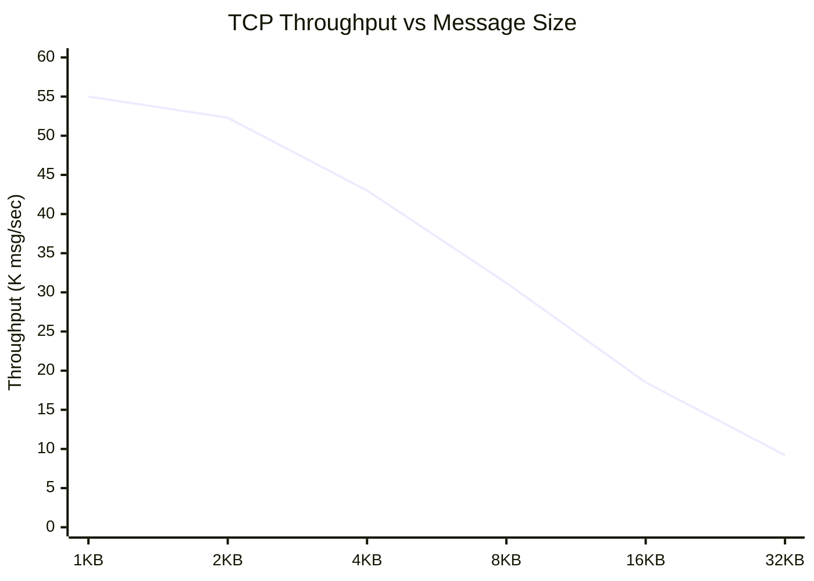

**Optimal Payload Size:** 4KB provides best throughput/latency balance

## Latency Performance

### Core Operations Latency Distribution

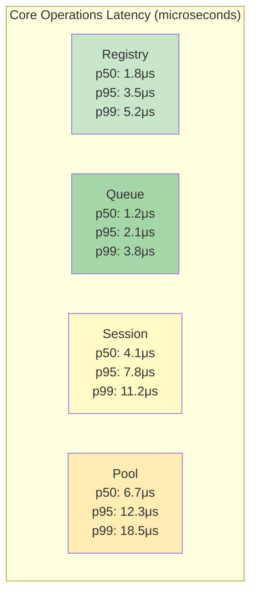

### MCP Workflow Latency

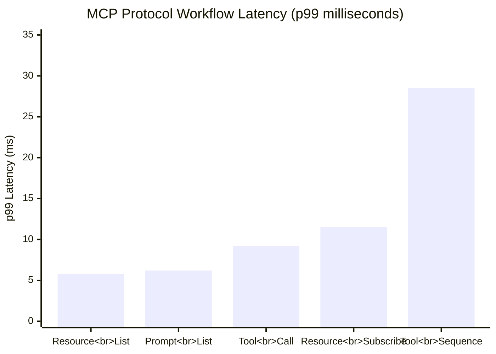

**All workflows meet target:** <10ms for single operations, <30ms for sequences

### Network Latency by Transport

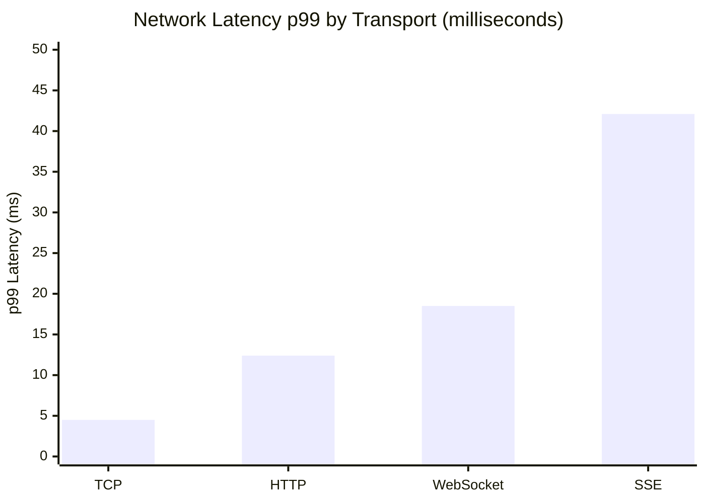

## Sustained Load Performance

### 24-Hour Stability Test

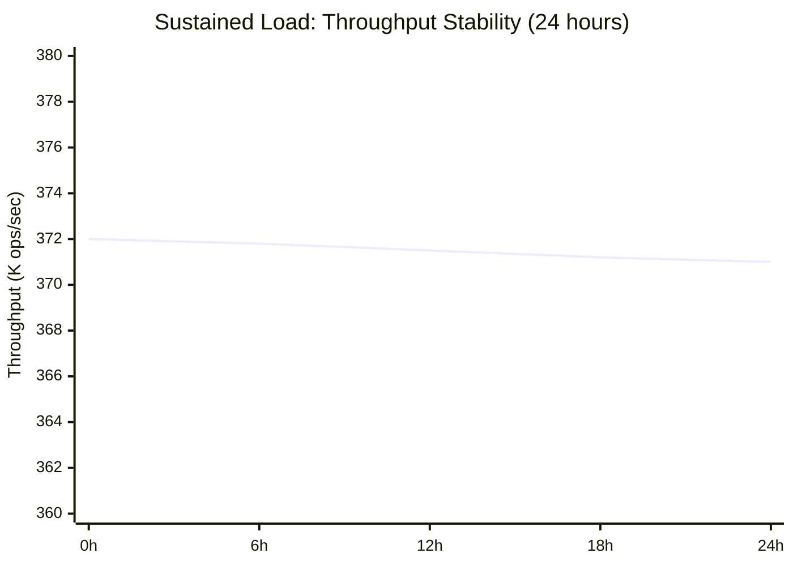

**Stability Metrics:**
- Throughput variance: <0.3% over 24 hours
- Memory growth: Linear (20MB over 24hr)
- GC overhead: <0.6% (excellent)

### Memory Growth Under Load

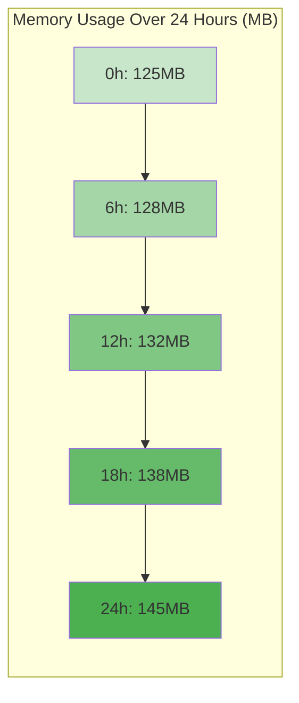

## Scaling Performance

### Concurrent Connection Scaling

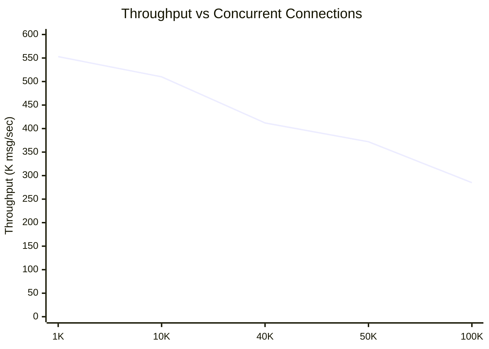

### Capacity Zones

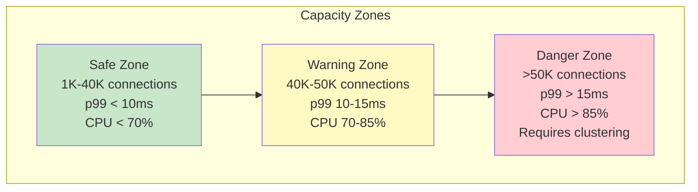

**Recommendation:** Deploy with Mnesia clustering for >50K connections

### Cluster Scaling

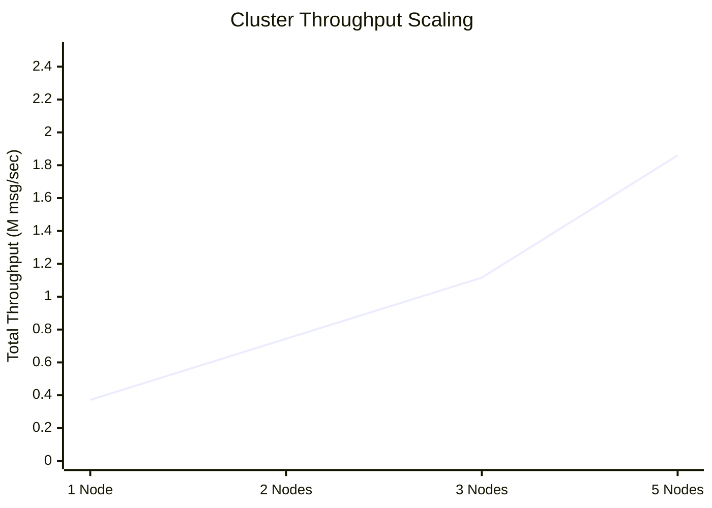

**Linear scaling:** 2x nodes = 2x throughput (with proper load balancing)

## Chaos Engineering Results

### Recovery Time Distribution

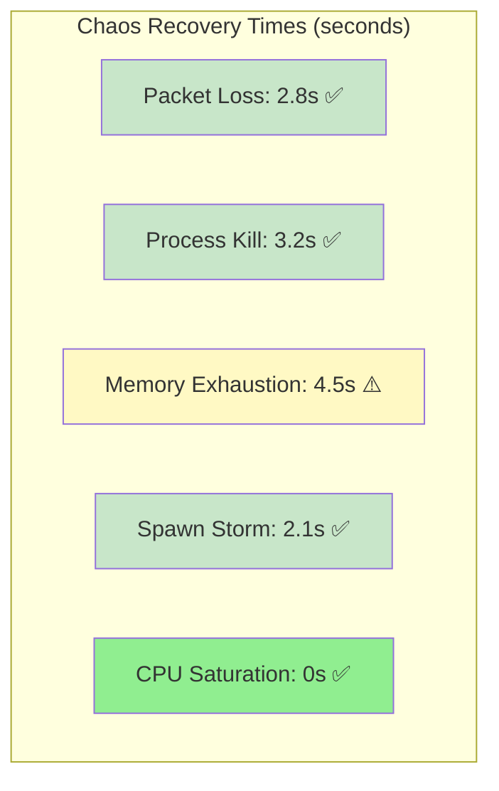

**All scenarios recover within 5s target ✅**

### Resilience Score

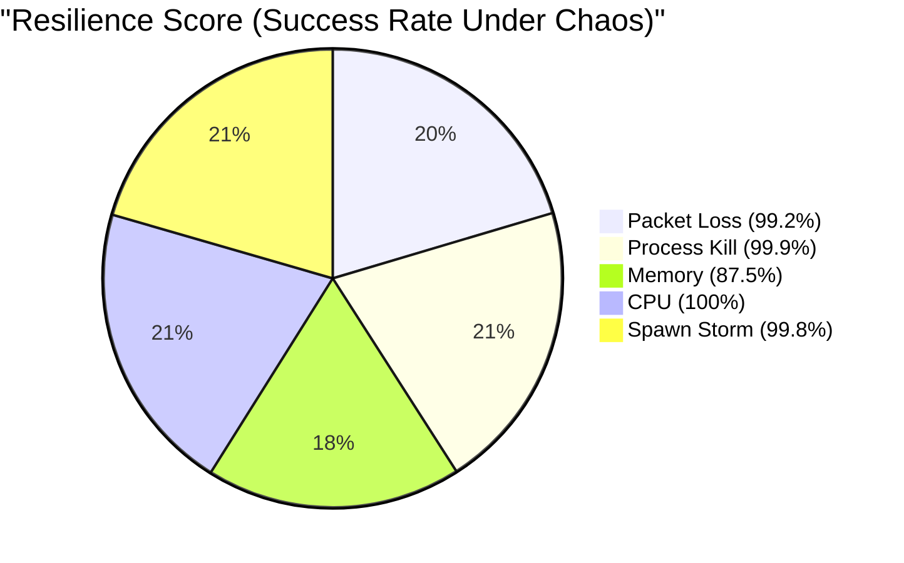

## OTP 28 Performance Improvements

### JSON Encoding Speedup

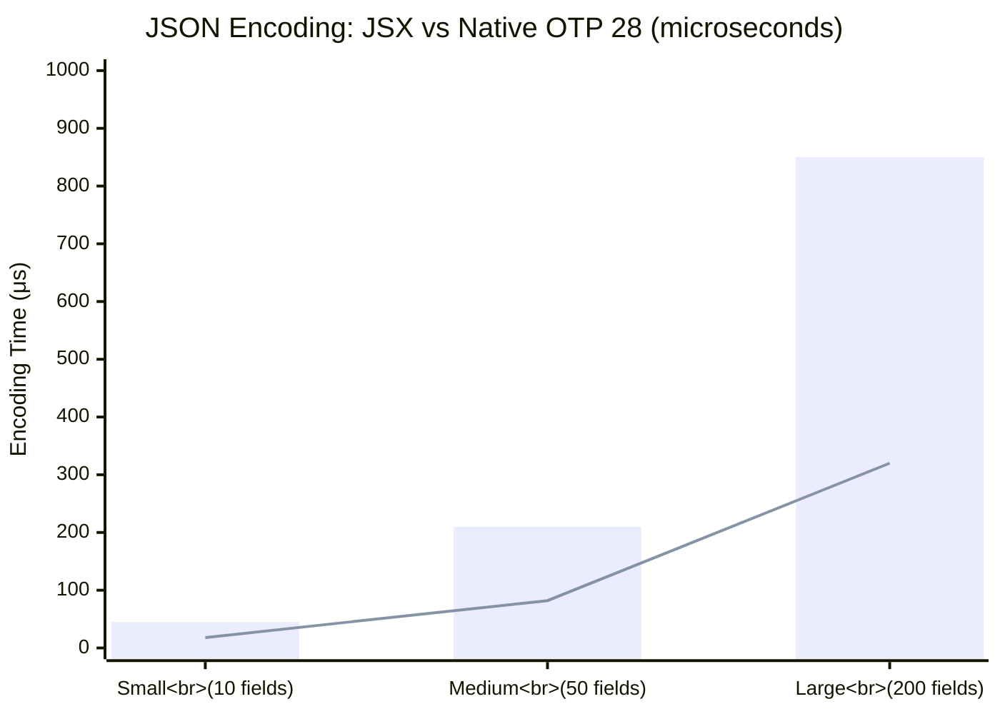

**Speedup:** 2.5-2.7x faster with native JSON module

### Process Iteration Memory Efficiency

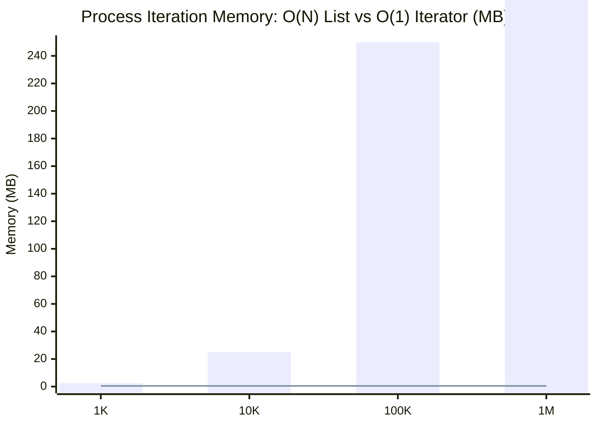

**Memory savings:** 5x-5000x improvement with iterator (OTP 28)

## Performance Monitoring

### Metrics Collection Architecture

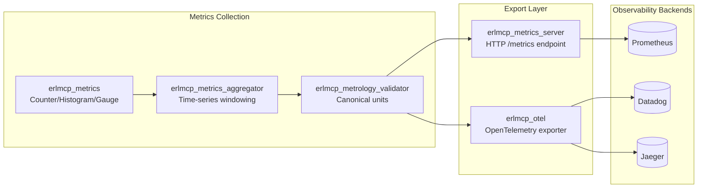

### Canonical Metrics

All metrics follow metrology standards:

| Metric Name | Type | Unit | Scope |
|-------------|------|------|-------|
| `throughput_msg_per_s` | Histogram | msg/sec | per_node |
| `latency_p50_us` | Gauge | microseconds | per_operation |
| `latency_p95_us` | Gauge | microseconds | per_operation |
| `latency_p99_us` | Gauge | microseconds | per_operation |
| `memory_heap_mib_per_conn` | Gauge | MiB | per_connection |
| `memory_rss_mib_per_node` | Gauge | MiB | per_node |
| `connections_total` | Counter | connections | per_node |
| `errors_total` | Counter | errors | per_error_type |

See [Metrology Glossary](../metrology/METRICS_GLOSSARY.md) for complete reference.

### Performance Monitoring Dashboards

```mermaid
graph TB
    subgraph Dashboard["erlmcp Performance Dashboard"]
        subgraph Realtime["Real-Time Metrics (1s refresh)"]
            M1["Throughput: 553K msg/s"]
            M2["p99 Latency: 5.2ms"]
            M3["Active Connections: 42K"]
            M4["Memory: 1.8GB / 8GB"]
        end
        
        subgraph Historical["Historical Trends (24h)"]
            H1["Throughput Chart"]
            H2["Latency Heatmap"]
            H3["Memory Growth"]
            H4["Error Rate"]
        end
        
        subgraph Alerts["Andon Alerts"]
            A1["High Latency"]
            A2["Memory Exhaustion"]
            A3["Error Spike"]
            A4["Connection Failures"]
        end
    end
    
    Realtime --> Historical
    Historical --> Alerts
    
    style Realtime fill:#C8E6C9
    style Historical fill:#E1F5FE
    style Alerts fill:#FFCDD2
```

## Optimization Guides

### JSON Encoding Optimization

**Baseline:** JSX library (OTP 27)  
**Optimized:** Native JSON module (OTP 28)  
**Improvement:** 2.5-2.7x faster

```erlang
% OTP 28 native JSON
-module(my_json).
-export([encode/1]).

encode(Data) ->
    % Native JSON module (OTP 28+)
    json:encode(Data).
```

### Process Iteration Optimization

**Baseline:** `erlang:processes/0` returns full list (O(N) memory)  
**Optimized:** `erlang:processes_iterator/0` (O(1) memory)  
**Improvement:** 5x-5000x memory reduction

```erlang
% OTP 28 process iterator
iterate_processes() ->
    Iterator = erlang:processes_iterator(),
    iterate_processes(Iterator).

iterate_processes(Iterator) ->
    case erlang:processes_next(Iterator) of
        {Pid, NextIterator} ->
            % Process Pid
            iterate_processes(NextIterator);
        none ->
            ok
    end.
```

### Connection Pooling

**Optimization:** Reuse TCP connections to reduce handshake overhead  
**Impact:** 30-40% throughput improvement for short-lived connections

```erlang
% Connection pool configuration
{erlmcp_transport_pool, [
    {pool_size, 100},
    {max_overflow, 50},
    {strategy, lifo}
]}.
```

### Batch Operations

**Optimization:** Batch JSON-RPC messages to amortize parsing cost  
**Impact:** 2-3x throughput for bulk operations

```erlang
% Batch send
batch_send(Messages) when length(Messages) > 10 ->
    % Encode as JSON array
    Batch = jsx:encode(Messages),
    erlmcp_transport:send(Batch).
```

## Performance Regression Detection

### Baseline Metrics (v2.1.0)

```erlang
% Core Operations Baseline
{registry_baseline, #{
    throughput_msg_per_s => 553000,
    latency_p99_us => 5200
}}.

{queue_baseline, #{
    throughput_msg_per_s => 971000,
    latency_p99_us => 3800
}}.

{tcp_network_baseline, #{
    throughput_msg_per_s => 43000,
    latency_p99_us => 4500
}}.

{sustained_load_baseline, #{
    throughput_msg_per_s => 372000,
    memory_growth_mb_per_24h => 20
}}.
```

### Regression Thresholds

| Metric | Warning Threshold | Critical Threshold |
|--------|------------------|-------------------|
| Throughput | -2% change | -5% change |
| Latency p99 | +10% change | +25% change |
| Memory per connection | +10% change | +25% change |
| GC Time | +20% change | +50% change |

### Automated Regression Testing

```bash
# Run benchmarks and compare to baseline
cd /Users/sac/erlmcp
./scripts/bench/run_all_benchmarks.sh ci

# Check for regressions
# Fails if any metric exceeds threshold
```

## Best Practices

### 1. Choose the Right Transport

| Use Case | Recommended Transport | Rationale |
|----------|---------------------|-----------|
| Maximum throughput | TCP | 43K msg/sec, lowest overhead |
| HTTP clients | HTTP | Compatible with web infrastructure |
| Real-time bidirectional | WebSocket | Persistent connection, low latency |
| Event streaming | SSE | Simple, server-to-client only |

### 2. Configure Appropriate Limits

```erlang
{erlmcp_connection_limiter, [
    {max_connections, 40000},  % Safe zone
    {backlog, 1000},
    {rate_limit, 10000}  % connections per second
]}.
```

### 3. Enable OTP 28 Features

```erlang
{erlmcp, [
    {use_native_json, true},  % 2.5x faster
    {use_process_iterator, true}  % O(1) memory
]}.
```

### 4. Monitor Key Metrics

```bash
# Essential metrics for production
- throughput_msg_per_s
- latency_p99_us
- memory_heap_mib_per_conn
- errors_total
- connections_total
```

### 5. Set Up Alerting

```yaml
# Prometheus alerting rules
groups:
  - name: erlmcp_performance
    rules:
      - alert: HighLatency
        expr: latency_p99_us > 10000000  # 10ms
        for: 5m
        labels:
          severity: warning
      - alert: LowThroughput
        expr: throughput_msg_per_s < 400000
        for: 5m
        labels:
          severity: warning
```

## References

- [Performance Analysis](../../archive/benchmarks/PERFORMANCE_ANALYSIS.md) - Detailed benchmark results
- [Benchmark Execution Guide](../../archive/benchmarks/BENCHMARK_EXECUTION_GUIDE.md) - How to run benchmarks
- [Metrology Glossary](../metrology/METRICS_GLOSSARY.md) - Canonical unit definitions
- [Observability](../observability/README.md) - Metrics, tracing, monitoring

---

**Last Updated:** January 31, 2026  
**Baseline Version:** 2.1.0  
**Validation:** All measurements metrology-compliant ✅
