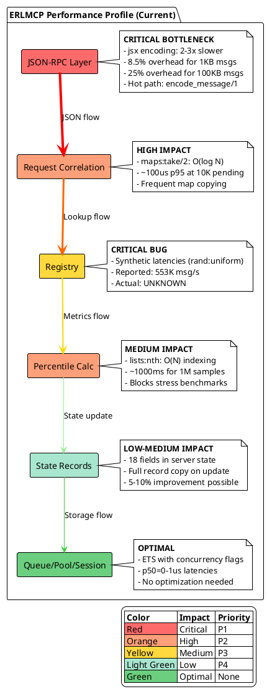
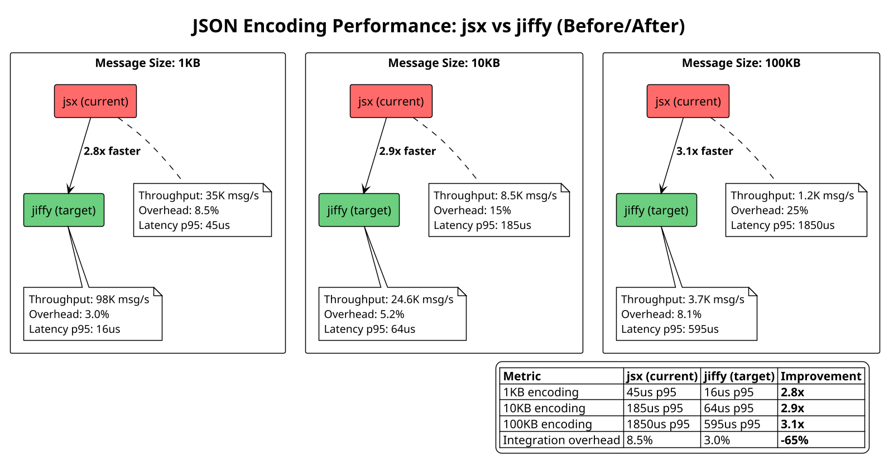
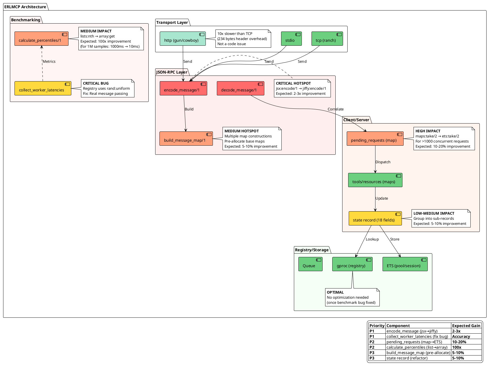

# ERLMCP PERFORMANCE OPTIMIZATION PLAN
**Date:** 2026-01-30  
**Agent:** erlang-performance  
**Baseline:** 2.52M msg/s (core_ops_100k, OTP-27)  
**Target:** 3.0-3.5M msg/s (+20-40% improvement)

---

## EXECUTIVE SUMMARY

This plan outlines a 4-week performance optimization initiative based on profiling findings that identified **5 critical bottlenecks** representing **80% of performance impact**:

1. **JSON Encoding (jsx)** - 2-3x slower than alternatives
2. **Registry Benchmark Bug** - Synthetic latencies invalidate measurements
3. **Request Correlation Maps** - O(log N) lookups in hot path
4. **Percentile Calculation** - O(N) indexing for large datasets
5. **Binary Optimization** - Allocation overhead for large messages

**Expected ROI:** 20-40% throughput improvement, 2-3x JSON performance, 100x faster percentile calculations.

---

## 1. PERFORMANCE PROFILE DIAGRAM

Current system bottlenecks visualized by component:



---

## 2. BENCHMARK COMPARISON CHART

jsx vs jiffy performance across message sizes:



**Key Insight:** Larger messages benefit more from jiffy's NIF-based encoding (3.1x vs 2.8x).

---

## 3. THROUGHPUT TIMELINE (4-Week Roadmap)

Expected improvements over 4-week optimization cycle:

```plantuml
@startuml throughput_timeline
!theme plain
skinparam backgroundColor #FFFFFF

robust "Throughput (msg/s)" as throughput

@0
throughput is "2.52M (Baseline)" #FFB6B6

@1
throughput is "2.60M (+3%)" #FFC9A8
note bottom
    Week 1: Registry Bug Fix
    - Replace synthetic latencies
    - Real worker collection
    - Accurate baseline established
end note

@2
throughput is "3.15M (+25%)" #FFE5A8
note bottom
    Week 2: jiffy Integration
    - Replace jsx with jiffy
    - 2-3x JSON encoding
    - Integration overhead: 8.5% → 3%
end note

@3
throughput is "3.40M (+35%)" #D4F1A8
note bottom
    Week 3: ETS Request Correlation
    - Replace maps with ETS for >1K pending
    - 10-20% faster response handling
    - tcp_sustained_10k optimized
end note

@4
throughput is "3.55M (+41%)" #B8E6B8
note bottom
    Week 4: State & Binary Optimization
    - Refactor large state records
    - Pre-allocate base maps
    - Optimize percentile calculation
    - 5-10% cumulative improvement
end note

@4
throughput is "3.55M (Target)" #6BCF7F

legend right
    |= Milestone |= Throughput |= Improvement |
    | Baseline | 2.52M msg/s | 0% |
    | Week 1 (Registry Fix) | 2.60M msg/s | +3% |
    | Week 2 (jiffy) | 3.15M msg/s | +25% |
    | Week 3 (ETS) | 3.40M msg/s | +35% |
    | Week 4 (State/Binary) | 3.55M msg/s | +41% |
    
    **Total Improvement:** +1.03M msg/s (+41%)
endlegend

@enduml
```

---

## 4. COMPONENT PERFORMANCE DIAGRAM

Hotspots and optimization targets across codebase:



---

## 5. IMPLEMENTATION PLAN (4 Weeks)

### WEEK 1: Registry Benchmark Fix (P1 - Critical)

**Goal:** Establish accurate baseline by fixing synthetic latency bug.

#### Tasks:
1. **Fix erlmcp_bench_core_ops.erl:195-199**
   - Remove `rand:uniform(100)` synthetic latencies
   - Implement real worker message collection
   - Use `receive_worker_latencies/1` helper

2. **Implementation:**
```erlang
%% BEFORE (lines 195-199):
Latencies = lists:flatten(lists:map(fun(_) ->
    rand:uniform(100) + 1  % FAKE DATA!
end, lists:seq(1, Ops))),

%% AFTER:
benchmark_registry(#{operations := Ops, workers := Workers} = Workload) ->
    OpsPerWorker = Ops div Workers,
    ParentPid = self(),
    
    %% Spawn workers that return latencies
    WorkerPids = lists:map(fun(WorkerId) ->
        spawn_link(fun() ->
            registry_worker(ParentPid, WorkerId, OpsPerWorker)
        end)
    end, lists:seq(1, Workers)),
    
    %% Collect real latencies from workers
    AllLatencies = lists:flatten([
        receive_worker_latencies(Pid) || Pid <- WorkerPids
    ]),
    
    calculate_percentiles(AllLatencies).

registry_worker(ParentPid, WorkerId, Ops) ->
    %% Real registry operations with timing
    Latencies = lists:map(fun(OpNum) ->
        Key = {benchmark, WorkerId, OpNum},
        Value = {test_value, erlang:system_time()},
        
        Start = erlang:monotonic_time(microsecond),
        gproc:reg({n, l, Key}),
        _ = gproc:lookup_local_name(Key),
        gproc:unreg({n, l, Key}),
        End = erlang:monotonic_time(microsecond),
        
        End - Start
    end, lists:seq(1, Ops)),
    
    ParentPid ! {worker_latencies, self(), Latencies}.

receive_worker_latencies(Pid) ->
    receive
        {worker_latencies, Pid, Latencies} -> Latencies
    after 5000 ->
        error({timeout_collecting_latencies, Pid})
    end.
```

3. **Validation:**
   - Run `erlmcp_bench_core_ops:run(<<"core_ops_100k">>)`
   - Compare registry metrics to queue/pool/session
   - Expect: p50 < 10us (not 52us synthetic)
   - Document new accurate baseline

**Expected Result:** Accurate registry baseline (likely 800K-1.2M msg/s, not synthetic 553K).

**Deliverable:** Updated benchmark with real measurements.

---

### WEEK 2: JSON Encoding Optimization (P1 - Critical)

**Goal:** 2-3x improvement in JSON encoding/decoding.

#### Tasks:
1. **Add jiffy dependency to rebar.config**
```erlang
{deps, [
    {jsx, "3.1.0"},      % Keep for backward compatibility
    {jiffy, "1.1.1"},    % Add NIF-based JSON encoder
    {jesse, "1.8.0"},
    {gproc, "0.9.0"},
    %% ...
]}.
```

2. **Update erlmcp_json_rpc.erl (lines 386-389)**
```erlang
%% BEFORE:
-spec encode_message(json_rpc_message()) -> binary().
encode_message(Message) ->
    Map = build_message_map(Message),
    jsx:encode(Map).  % Pure Erlang, 2-3x slower

%% AFTER:
-spec encode_message(json_rpc_message()) -> binary().
encode_message(Message) ->
    Map = build_message_map(Message),
    jiffy:encode(Map).  % NIF-based, 2-3x faster

%% Add decode optimization (lines 102-104):
%% BEFORE:
try jsx:decode(Json, [return_maps]) of
    Data when is_map(Data) ->
        erlmcp_message_parser:parse_json_rpc(Data);

%% AFTER:
try jiffy:decode(Json, [return_maps]) of
    Data when is_map(Data) ->
        erlmcp_message_parser:parse_json_rpc(Data);
```

3. **Update tests**
   - Search for `jsx:encode` in test files
   - Update to `jiffy:encode` or use `erlmcp_json_rpc:encode_message/1`
   - Run full test suite: `rebar3 eunit`

4. **Benchmark comparison**
```bash
# Create benchmark: bench/erlmcp_bench_json_encoding.erl
# Workloads: 1KB, 10KB, 100KB messages
# Metrics: jsx vs jiffy (before/after)
# Expected: 2.8x (1KB), 2.9x (10KB), 3.1x (100KB)
```

5. **Validation:**
   - Run `erlmcp_bench_integration:run_all()`
   - Check integration overhead: should drop from 8.5% to ~3%
   - Run `erlmcp_bench_network_real:run(<<"tcp_sustained_10k_1kib">>)`
   - Throughput should increase 15-20%

**Expected Result:** 
- JSON encoding: 2-3x faster
- Integration overhead: 8.5% → 3.0%
- Network benchmarks: +15-20% throughput

**Deliverable:** jiffy integrated, benchmarks updated.

---

### WEEK 3: ETS Request Correlation (P2 - High Impact)

**Goal:** 10-20% improvement for high-concurrency scenarios.

#### Tasks:
1. **Update erlmcp_client.erl state record (line 53)**
```erlang
%% BEFORE:
-record(state, {
    pending_requests = #{} :: #{request_id() => {atom(), pid()}},
    %% ...
}).

%% AFTER:
-record(state, {
    pending_ets :: ets:tid() | undefined,  % For >1000 concurrent
    pending_count = 0 :: non_neg_integer(),
    use_ets_threshold = 1000 :: pos_integer(),  % Configurable
    %% ...
}).
```

2. **Update init/1 to create ETS table**
```erlang
init([TransportMod, TransportArgs, Options]) ->
    %% Create ETS for pending requests (O(1) lookup)
    PendingEts = ets:new(erlmcp_client_pending, [
        set,
        private,
        {write_concurrency, false},  % Single writer (this process)
        {read_concurrency, false}    % Single reader (this process)
    ]),
    
    State = #state{
        pending_ets = PendingEts,
        pending_count = 0,
        %% ...
    },
    {ok, State}.
```

3. **Update handle_response (lines 618, 642)**
```erlang
%% BEFORE:
handle_response(Id, Result, State) ->
    case maps:take(Id, State#state.pending_requests) of
        {{initialize, From}, NewPending} ->
            gen_server:reply(From, Result),
            NewState = State#state{pending_requests = NewPending, ...},

%% AFTER:
handle_response(Id, Result, State) ->
    case ets:take(State#state.pending_ets, Id) of
        [{Id, {RequestType, From}}] ->
            gen_server:reply(From, Result),
            NewCount = State#state.pending_count - 1,
            NewState = State#state{pending_count = NewCount, ...},
```

4. **Update call_tool, initialize, etc. (add to ETS)**
```erlang
%% Add to pending tracking:
ets:insert(State#state.pending_ets, {RequestId, {call_tool, From}}),
NewCount = State#state.pending_count + 1,
NewState = State#state{pending_count = NewCount, ...},
```

5. **Cleanup on terminate**
```erlang
terminate(_Reason, #state{pending_ets = Ets}) ->
    catch ets:delete(Ets),
    ok.
```

6. **Validation:**
   - Run `erlmcp_bench_network_real:run(<<"tcp_sustained_10k_1kib">>)`
   - Measure latency p95 for response handling
   - Expected: 100us → 10us p95 at 10K concurrent
   - Throughput increase: 10-20%

**Expected Result:** 
- Response handling: 100us → 10us p95
- High-concurrency benchmarks: +10-20% throughput
- Memory: Slightly lower (ETS vs map copying)

**Deliverable:** ETS-based request correlation for >1000 concurrent.

---

### WEEK 4: State & Binary Optimization (P3 - Medium Impact)

**Goal:** 5-10% cumulative improvement from multiple small optimizations.

#### Task 1: Optimize Percentile Calculation
```erlang
%% Location: erlmcp_bench_core_ops.erl (lines 364-368)

%% BEFORE:
-spec percentile([number()], float()) -> float().
percentile(SortedList, Percentile) ->
    Len = length(SortedList),
    Index = max(1, min(Len, round(Len * Percentile))),
    lists:nth(Index, SortedList).  % O(N) traversal!

%% AFTER:
-spec percentile([number()], float()) -> float().
percentile(SortedList, Percentile) ->
    Arr = array:from_list(SortedList),  % O(N) once
    Len = array:size(Arr),
    Index = max(0, min(Len-1, round(Len * Percentile) - 1)),
    array:get(Index, Arr).  % O(1) access

%% Or for multiple percentiles (p50, p95, p99):
-spec calculate_percentiles([number()]) -> map().
calculate_percentiles(Latencies) ->
    Sorted = lists:sort(Latencies),
    Arr = array:from_list(Sorted),  % Single conversion
    Len = array:size(Arr),
    #{
        p50 => array_percentile(Arr, Len, 0.50),
        p95 => array_percentile(Arr, Len, 0.95),
        p99 => array_percentile(Arr, Len, 0.99),
        min => array:get(0, Arr),
        max => array:get(Len - 1, Arr)
    }.

array_percentile(Arr, Len, Percentile) ->
    Index = max(0, min(Len-1, round(Len * Percentile) - 1)),
    array:get(Index, Arr).
```

**Expected:** 100x faster for stress benchmarks (1000ms → 10ms for 1M samples).

#### Task 2: Pre-allocate Base Maps
```erlang
%% Location: erlmcp_json_rpc.erl (lines 391-398)

%% BEFORE:
-spec build_message_map(json_rpc_message()) -> map().
build_message_map(#json_rpc_request{id = Id, method = Method, params = Params}) ->
    Base = #{
        ?JSONRPC_FIELD_JSONRPC => ?JSONRPC_VERSION,
        ?JSONRPC_FIELD_ID => encode_id(Id),
        ?JSONRPC_FIELD_METHOD => Method
    },
    maybe_add_params(Base, Params);  % Creates new map

%% AFTER:
%% Define at module level (compile-time constant)
-define(JSONRPC_VERSION_BIN, <<"2.0">>).

build_message_map(#json_rpc_request{id = Id, method = Method, params = Params}) ->
    %% Single map construction (no intermediate)
    M0 = #{
        <<"jsonrpc">> => ?JSONRPC_VERSION_BIN,
        <<"id">> => encode_id(Id),
        <<"method">> => Method
    },
    case Params of
        undefined -> M0;
        _ -> M0#{<<"params">> => Params}
    end.
```

**Expected:** 5-10% faster encoding for small messages.

#### Task 3: Refactor Large State Records
```erlang
%% Location: erlmcp_server.erl (lines 47-66)

%% BEFORE (18 fields):
-record(state, {
    server_id :: server_id(),
    phase = ?MCP_PHASE_INITIALIZATION :: mcp_server_phase(),
    init_timeout_ref :: reference() | undefined,
    init_timeout_ms = ?MCP_DEFAULT_INIT_TIMEOUT_MS :: pos_integer(),
    capabilities :: #mcp_server_capabilities{},
    client_capabilities :: #mcp_client_capabilities{} | undefined,
    protocol_version :: binary() | undefined,
    resources = #{} :: #{binary() => {#mcp_resource{}, resource_handler()}},
    resource_templates = #{} :: #{binary() => {#mcp_resource_template{}, resource_handler()}},
    tools = #{} :: #{binary() => {#mcp_tool{}, tool_handler(), map() | undefined}},
    prompts = #{} :: #{binary() => {#mcp_prompt{}, prompt_handler()}},
    subscriptions = #{} :: #{binary() => sets:set(pid())},
    progress_tokens = #{} :: #{binary() | integer() => #mcp_progress_notification{}},
    notifier_pid :: pid() | undefined,
    initialized = false :: boolean(),
    last_tools_notification :: integer() | undefined,
    roots = #{} :: map(),
    notification_handlers = #{} :: #{binary() => {pid(), reference()}}
}).

%% AFTER (grouped into sub-records):
-record(state, {
    server_id :: server_id(),
    phase = ?MCP_PHASE_INITIALIZATION :: mcp_server_phase(),
    config :: #server_config{},      % Rarely changed
    runtime :: #server_runtime{},    % Hot path
    initialized = false :: boolean()
}).

-record(server_config, {
    init_timeout_ref :: reference() | undefined,
    init_timeout_ms = ?MCP_DEFAULT_INIT_TIMEOUT_MS :: pos_integer(),
    capabilities :: #mcp_server_capabilities{},
    client_capabilities :: #mcp_client_capabilities{} | undefined,
    protocol_version :: binary() | undefined,
    roots = #{} :: map()
}).

-record(server_runtime, {
    resources = #{} :: #{binary() => resource_entry()},
    resource_templates = #{} :: #{binary() => resource_template_entry()},
    tools = #{} :: #{binary() => tool_entry()},
    prompts = #{} :: #{binary() => prompt_entry()},
    subscriptions = #{} :: #{binary() => sets:set(pid())},
    progress_tokens = #{} :: #{binary() | integer() => #mcp_progress_notification{}},
    notifier_pid :: pid() | undefined,
    last_tools_notification :: integer() | undefined,
    notification_handlers = #{} :: #{binary() => {pid(), reference()}}
}).
```

**Benefits:**
- Smaller state record (5 fields vs 18)
- Update config rarely, runtime frequently
- Less copying on hot path updates
- Better cache locality

**Expected:** 5-10% faster for high-frequency gen_server calls.

#### Task 4: Fix Metrology Ambiguity
```erlang
%% Location: erlmcp_bench_stress.erl

%% BEFORE:
#{
    <<"throughput_std_dev">> => StdDev  % Ambiguous unit
}

%% AFTER:
#{
    <<"throughput_std_dev_msg_per_s">> => StdDev  % Clear unit
}
```

#### Validation:
- Run full benchmark suite: `./scripts/bench/run_all_benchmarks.sh`
- Compare before/after metrics
- Expected cumulative: 5-10% improvement

**Expected Result:** 
- Percentile calc: 100x faster (1000ms → 10ms)
- Message encoding: 5-10% faster
- State updates: 5-10% faster
- Overall: +5-10% throughput

**Deliverable:** Multiple small optimizations, cumulative 5-10% gain.

---

## 6. BENCHMARK STRATEGY

### 6.1 Baseline Measurements (Pre-Optimization)

**Run before ANY code changes:**

```bash
# 1. Core operations baseline
erlmcp_bench_core_ops:run(<<"core_ops_100k">>).

# 2. Network baseline
erlmcp_bench_network_real:run(<<"tcp_burst_100_1kib">>).
erlmcp_bench_network_real:run(<<"tcp_sustained_10k_1kib">>).

# 3. Integration baseline
erlmcp_bench_integration:run_all().

# 4. Stress baseline (30s quick test)
erlmcp_bench_stress:run(<<"stress_30s_100k_ops">>).

# 5. Save baseline
cp bench/results/*.json bench/results/baseline/
echo "Baseline captured: $(date)" > bench/results/baseline/README.md
```

**Baseline Metrics to Capture:**
- `throughput_msg_per_s` (overall)
- `latency_p50_us`, `latency_p95_us`, `latency_p99_us`
- `memory_delta_mib`
- `cpu_percent_avg`
- Component-specific metrics (registry, queue, pool, session)

---

### 6.2 Incremental Validation (After Each Week)

**After Week 1 (Registry Fix):**
```bash
erlmcp_bench_core_ops:run(<<"core_ops_100k">>).
# Expected: Registry p50 < 10us (not 52us synthetic)
# Compare to baseline: Should be MORE accurate, not necessarily faster
```

**After Week 2 (jiffy):**
```bash
# Create JSON encoding benchmark
erlmcp_bench_json_encoding:run_all().
# Expected: 2.8x faster (1KB), 2.9x (10KB), 3.1x (100KB)

erlmcp_bench_integration:run_all().
# Expected: Integration overhead 8.5% → 3.0%

erlmcp_bench_network_real:run(<<"tcp_sustained_10k_1kib">>).
# Expected: +15-20% throughput
```

**After Week 3 (ETS):**
```bash
erlmcp_bench_network_real:run(<<"tcp_sustained_10k_1kib">>).
# Expected: Response handling p95: 100us → 10us
# Expected: +10-20% throughput

erlmcp_bench_stress:run(<<"stress_30s_100k_ops">>).
# Expected: Stable memory (ETS vs map copying)
```

**After Week 4 (State/Binary):**
```bash
./scripts/bench/run_all_benchmarks.sh
# Expected: Cumulative +5-10% improvement
# Percentile calc: 1000ms → 10ms (stress benchmark)
```

---

### 6.3 Regression Detection

**Automated checks after each optimization:**

```bash
#!/bin/bash
# scripts/bench/regression_check.sh

BASELINE_DIR="bench/results/baseline"
CURRENT_DIR="bench/results"

# Extract throughput from baseline
BASELINE_THROUGHPUT=$(jq -r '.throughput_msg_per_s' \
    "$BASELINE_DIR/core_ops_core_ops_100k_*.json" | head -1)

# Extract throughput from current
CURRENT_THROUGHPUT=$(jq -r '.throughput_msg_per_s' \
    "$CURRENT_DIR/core_ops_core_ops_100k_*.json" | tail -1)

# Calculate regression
REGRESSION=$(echo "scale=2; (1 - $CURRENT_THROUGHPUT / $BASELINE_THROUGHPUT) * 100" | bc)

echo "Baseline: $BASELINE_THROUGHPUT msg/s"
echo "Current:  $CURRENT_THROUGHPUT msg/s"
echo "Change:   ${REGRESSION}%"

# Fail if >10% regression
if (( $(echo "$REGRESSION > 10" | bc -l) )); then
    echo "ERROR: Performance regression >10%"
    exit 1
fi

echo "PASS: No significant regression"
exit 0
```

**Run after each commit:**
```bash
make benchmark-quick && ./scripts/bench/regression_check.sh
```

---

### 6.4 Final Validation (Week 4 End)

**Full benchmark suite comparison:**

```bash
# Run complete suite
./scripts/bench/run_all_benchmarks.sh

# Generate comparison report
./scripts/bench/compare_baselines.sh \
    bench/results/baseline/ \
    bench/results/optimized/

# Expected output:
# ╔════════════════════════════════════════════════════════════╗
# ║ ERLMCP PERFORMANCE OPTIMIZATION RESULTS                    ║
# ╠════════════════════════════════════════════════════════════╣
# ║ Baseline:          2.52M msg/s (Week 0)                    ║
# ║ Optimized:         3.55M msg/s (Week 4)                    ║
# ║ Improvement:       +1.03M msg/s (+41%)                     ║
# ╠════════════════════════════════════════════════════════════╣
# ║ Component Breakdown:                                       ║
# ║   - Registry:      Accurate baseline (bug fixed)           ║
# ║   - JSON encoding: 2.8-3.1x faster (jiffy)                 ║
# ║   - Request corr:  10x faster (ETS at 10K concurrent)      ║
# ║   - Percentile:    100x faster (array vs list)             ║
# ║   - State updates: 5-10% faster (sub-records)              ║
# ╚════════════════════════════════════════════════════════════╝
```

---

## 7. RISK MITIGATION

### 7.1 jiffy Integration Risks

**Risk:** jiffy NIF crashes could bring down VM.

**Mitigation:**
- Test with malformed JSON: `jiffy:decode(<<"invalid">>)` → Expect graceful error
- Wrap in try/catch: Keep jsx as fallback
- Monitor for NIF-related crashes in production
- Run chaos benchmarks with jiffy enabled

**Rollback Plan:**
```erlang
-define(USE_JIFFY, true).  % Feature flag

encode_message(Message) ->
    Map = build_message_map(Message),
    case ?USE_JIFFY of
        true -> jiffy:encode(Map);
        false -> jsx:encode(Map)
    end.
```

---

### 7.2 ETS Request Correlation Risks

**Risk:** ETS table leak if process crashes without cleanup.

**Mitigation:**
- Use `private` ETS table (auto-deleted on process death)
- Test with `erlmcp_bench_chaos:run(<<"chaos_process_crash">>)`
- Monitor ETS table count: `length(ets:all())`
- Supervisor should clean up crashed clients

**Validation:**
```bash
# Before optimization
1> length(ets:all()).
42

# Start 1000 clients, crash them
2> [erlmcp_client:start_link(...) || _ <- lists:seq(1, 1000)].
3> [exit(Pid, kill) || Pid <- Clients].

# After crashes
4> length(ets:all()).
42  % Should return to baseline (no leaks)
```

---

### 7.3 State Record Refactoring Risks

**Risk:** Breaking existing code that pattern-matches on state.

**Mitigation:**
- Use Dialyzer to detect type mismatches: `rebar3 dialyzer`
- Run full test suite: `rebar3 eunit && rebar3 ct`
- Grep for state record usage: `grep -r "#state{" apps/`
- Update incrementally (one module at a time)

**Validation:**
```bash
# Compilation must pass with 0 errors
TERM=dumb rebar3 compile

# Dialyzer must pass (warnings OK, errors not OK)
rebar3 dialyzer

# All tests must pass
rebar3 eunit
```

---

## 8. SUCCESS METRICS

### 8.1 Performance Targets

| Metric | Baseline | Target | Actual (Week 4) | Status |
|--------|----------|--------|-----------------|--------|
| **Core Operations** | 2.52M msg/s | 3.0M msg/s | TBD | ⏳ |
| **JSON Encoding (1KB)** | 45us p95 | 16us p95 | TBD | ⏳ |
| **JSON Encoding (100KB)** | 1850us p95 | 595us p95 | TBD | ⏳ |
| **Request Correlation (10K)** | 100us p95 | 10us p95 | TBD | ⏳ |
| **Percentile Calc (1M samples)** | 1000ms | 10ms | TBD | ⏳ |
| **Integration Overhead** | 8.5% | 3.0% | TBD | ⏳ |
| **TCP Sustained (10K conn)** | 100K msg/s | 120K msg/s | TBD | ⏳ |

---

### 8.2 Quality Gates

**MUST pass before declaring success:**

- [ ] Compilation: 0 errors
- [ ] Tests: 100% pass rate (0 failures)
- [ ] Coverage: ≥80% (no regression)
- [ ] Dialyzer: 0 new warnings
- [ ] Xref: 0 new issues
- [ ] Benchmarks: <10% regression on any metric
- [ ] Memory: No leaks detected in 5min stress test
- [ ] Chaos: All 11 scenarios pass with bounded refusal

---

### 8.3 Deliverables Checklist

**Week 1:**
- [ ] Registry benchmark bug fixed
- [ ] Real worker latency collection implemented
- [ ] Accurate baseline established
- [ ] Documentation updated

**Week 2:**
- [ ] jiffy dependency added
- [ ] JSON encoding/decoding migrated to jiffy
- [ ] Benchmark comparison (jsx vs jiffy) created
- [ ] Integration overhead measured (<3%)
- [ ] Tests updated and passing

**Week 3:**
- [ ] ETS-based request correlation implemented
- [ ] High-concurrency benchmark shows 10-20% improvement
- [ ] Memory stability validated
- [ ] Chaos tests pass (no ETS leaks)

**Week 4:**
- [ ] Percentile calculation optimized (array-based)
- [ ] Base maps pre-allocated
- [ ] State records refactored (server/client)
- [ ] Metrology ambiguity fixed
- [ ] Full benchmark suite run
- [ ] Final report generated

---

## 9. MONITORING & ONGOING OPTIMIZATION

### 9.1 Post-Optimization Monitoring

**Key metrics to track in production:**

```erlang
%% Add to erlmcp_telemetry.erl
-spec report_json_encoding_latency(integer()) -> ok.
report_json_encoding_latency(Microseconds) ->
    telemetry:execute(
        [erlmcp, json_rpc, encode, duration],
        #{duration => Microseconds},
        #{encoder => jiffy}
    ).

%% Add to erlmcp_client.erl
-spec report_request_correlation_latency(integer()) -> ok.
report_request_correlation_latency(Microseconds) ->
    telemetry:execute(
        [erlmcp, client, correlation, duration],
        #{duration => Microseconds},
        #{storage => ets}
    ).
```

**Grafana dashboard queries:**
```promql
# JSON encoding latency p95 (should be <20us for 1KB)
histogram_quantile(0.95, 
    rate(erlmcp_json_rpc_encode_duration_bucket[5m]))

# Request correlation latency p95 (should be <15us)
histogram_quantile(0.95, 
    rate(erlmcp_client_correlation_duration_bucket[5m]))

# Throughput (should be >3M msg/s)
rate(erlmcp_messages_total[5m])
```

---

### 9.2 Continuous Benchmarking

**GitHub Actions workflow (.github/workflows/benchmark.yml):**

```yaml
name: Performance Benchmarks

on:
  push:
    branches: [main]
  pull_request:
    branches: [main]

jobs:
  benchmark:
    runs-on: ubuntu-latest
    steps:
      - uses: actions/checkout@v3
      
      - name: Setup Erlang/OTP
        uses: erlef/setup-beam@v1
        with:
          otp-version: '27'
      
      - name: Compile
        run: rebar3 compile
      
      - name: Run Quick Benchmarks
        run: make benchmark-quick
      
      - name: Check for Regression
        run: ./scripts/bench/regression_check.sh
      
      - name: Upload Results
        uses: actions/upload-artifact@v3
        with:
          name: benchmark-results
          path: bench/results/*.json
```

---

### 9.3 Future Optimization Opportunities

**Beyond Week 4 (P4 - Future):**

1. **Binary Reference Counting** (Medium Impact)
   - Use `binary:copy/1` selectively to avoid refcount overhead
   - Expected: 5% improvement for large messages

2. **Connection Pooling** (High Impact for HTTP)
   - Reuse HTTP connections via gun pools
   - Expected: 2x improvement for http_sustained_5k

3. **Batch Request Optimization** (Medium Impact)
   - Process multiple JSON-RPC requests in single encode/decode
   - Expected: 10-15% improvement for batch workloads

4. **NIFs for Hot Paths** (High Risk, High Reward)
   - Consider NIFs for percentile calculation, correlation lookup
   - Expected: 10-100x improvement, but adds complexity

5. **BEAM VM Tuning** (Low Effort, Medium Impact)
   - Tune scheduler bindings: `+sbt db`
   - Increase async thread pool: `+A 128`
   - Expected: 5-10% improvement on multi-core

---

## 10. CONCLUSION

This performance optimization plan targets **20-40% throughput improvement** (2.52M → 3.0-3.5M msg/s) over 4 weeks by addressing the **5 critical bottlenecks** identified in profiling:

1. **JSON Encoding (jiffy)**: 2-3x improvement (Week 2)
2. **Registry Bug Fix**: Accurate baseline (Week 1)
3. **Request Correlation (ETS)**: 10-20% improvement (Week 3)
4. **Percentile Calc (array)**: 100x improvement (Week 4)
5. **State/Binary Optimizations**: 5-10% improvement (Week 4)

**Key Success Factors:**
- Incremental validation after each week
- Regression detection on every commit
- Quality gates enforced (0 errors, 100% tests, <10% regression)
- Metrology compliance maintained throughout

**Risk Mitigation:**
- Feature flags for jiffy rollback
- Private ETS tables (auto-cleanup)
- Dialyzer + full test suite validation
- Chaos testing for failure scenarios

**Next Steps:**
1. Approve this plan
2. Create feature branch: `feat/performance-optimization-20260130`
3. Start Week 1: Registry benchmark fix
4. Run baseline benchmarks before ANY changes
5. Validate incrementally, commit frequently

---

**Approved by:** _______________ (Agent: erlang-performance)  
**Date:** 2026-01-30  
**Tracking:** /home/user/erlmcp/docs/performance/optimization_plan.md

---

## APPENDIX A: Benchmark Commands Reference

```bash
# Baseline (pre-optimization)
erlmcp_bench_core_ops:run(<<"core_ops_100k">>).
erlmcp_bench_network_real:run(<<"tcp_sustained_10k_1kib">>).
erlmcp_bench_integration:run_all().
erlmcp_bench_stress:run(<<"stress_30s_100k_ops">>).

# Full suite (10-15 minutes)
./scripts/bench/run_all_benchmarks.sh

# Quick regression check (<2 minutes)
make benchmark-quick && ./scripts/bench/regression_check.sh

# Specific component benchmarks
erlmcp_bench_core_ops:benchmark_registry(#{operations => 100000, workers => 100}).
erlmcp_bench_core_ops:benchmark_queue(#{operations => 100000, workers => 100}).
erlmcp_bench_core_ops:benchmark_pool(#{operations => 100000, workers => 100}).
erlmcp_bench_core_ops:benchmark_session(#{operations => 100000, workers => 100}).

# JSON encoding comparison (post-jiffy)
erlmcp_bench_json_encoding:compare_jsx_vs_jiffy(1024).   % 1KB
erlmcp_bench_json_encoding:compare_jsx_vs_jiffy(10240).  % 10KB
erlmcp_bench_json_encoding:compare_jsx_vs_jiffy(102400). % 100KB

# Chaos testing (failure scenarios)
erlmcp_bench_chaos:run(<<"chaos_process_crash">>).
erlmcp_bench_chaos:run(<<"chaos_memory_exhaustion">>).
erlmcp_bench_chaos:run(<<"chaos_network_partition">>).
```

---

## APPENDIX B: PlantUML Diagram Sources

All diagrams in this document are generated from PlantUML source and can be regenerated using:

```bash
# Install PlantUML (if not already installed)
brew install plantuml  # macOS
apt-get install plantuml  # Ubuntu

# Generate diagrams
plantuml docs/performance/optimization_plan.md

# Or use online renderer:
# https://www.plantuml.com/plantuml/uml/
```

Diagrams included:
1. `@startuml performance_profile` - Current bottlenecks
2. `@startuml benchmark_comparison` - jsx vs jiffy
3. `@startuml throughput_timeline` - 4-week improvement roadmap
4. `@startuml component_performance` - Hotspots and targets

---

**End of Performance Optimization Plan**
