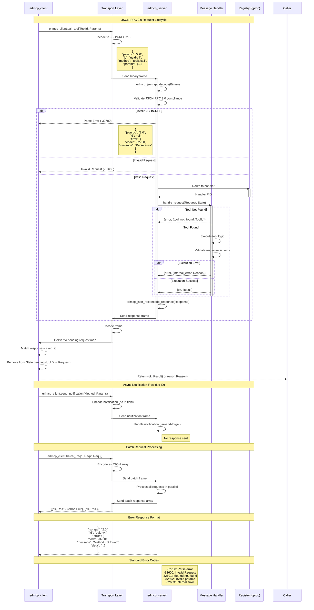

# MCP Protocol & JSON-RPC 2.0 Implementation Specification

## Overview

The Model Context Protocol (MCP) uses JSON-RPC 2.0 (RFC 7049) as its transport-agnostic message format. This document provides detailed technical specifications of the protocol layer implementation in erlmcp v2.2.0+, covering:

- JSON-RPC 2.0 message structure and encoding
- Request/response/notification message types
- Batch request processing
- Error codes and error handling
- Protocol versioning
- Message serialization and validation

## JSON-RPC 2.0 Message Flow



**See also:** [Detailed JSON-RPC Flow](./diagrams/protocol/json-rpc-flow.mmd)

## Overview

The Model Context Protocol (MCP) uses JSON-RPC 2.0 (RFC 7049) as its transport-agnostic message format. This document provides detailed technical specifications of the protocol layer implementation in erlmcp v2.2.0+, covering:

- JSON-RPC 2.0 message structure and encoding
- Request/response/notification message types
- Batch request processing
- Error codes and error handling
- Protocol versioning
- Message serialization and validation

## 1. JSON-RPC 2.0 Message Structure

### 1.1 Basic Message Format

All messages conform to JSON-RPC 2.0 specification with the following base structure:

```json
{
  "jsonrpc": "2.0",
  "method": "...",
  "id": ...,
  "params": {...} | [...] | null
}
```

### 1.2 JSON-RPC Fields

| Field | Type | Required | Description |
|-------|------|----------|-------------|
| `jsonrpc` | string | Yes | Protocol version, always `"2.0"` |
| `method` | string | Yes (requests/notifications) | Method name (e.g., `"resources/list"`) |
| `id` | number \| string \| null | Requests only | Unique request identifier for correlation |
| `params` | object \| array \| null | Optional | Method parameters |
| `result` | any | Responses only | Result value on success |
| `error` | object | Responses only | Error object on failure |

### 1.3 Implementation Constants

From `/home/user/erlmcp/apps/erlmcp_core/include/erlmcp.hrl`:

```erlang
%% JSON-RPC Protocol Version
-define(JSONRPC_VERSION, <<"2.0">>).
-define(MCP_VERSION, <<"2025-11-25">>).

%% Field Names (Binary)
-define(JSONRPC_FIELD_JSONRPC, <<"jsonrpc">>).
-define(JSONRPC_FIELD_ID, <<"id">>).
-define(JSONRPC_FIELD_METHOD, <<"method">>).
-define(JSONRPC_FIELD_PARAMS, <<"params">>).
-define(JSONRPC_FIELD_RESULT, <<"result">>).
-define(JSONRPC_FIELD_ERROR, <<"error">>).

%% Error Object Fields
-define(JSONRPC_ERROR_FIELD_CODE, <<"code">>).
-define(JSONRPC_ERROR_FIELD_MESSAGE, <<"message">>).
-define(JSONRPC_ERROR_FIELD_DATA, <<"data">>).
```

---

## 2. Request Messages

### 2.1 Request Structure

A **request** is a JSON-RPC message with `id`, `method`, and optional `params`:

```json
{
  "jsonrpc": "2.0",
  "id": 1,
  "method": "initialize",
  "params": {
    "protocolVersion": "2025-11-25",
    "capabilities": {
      "roots": { "supported": true },
      "sampling": {}
    },
    "clientInfo": {
      "name": "claude-client",
      "version": "1.0.0"
    }
  }
}
```

### 2.2 Request ID Types

The `id` field can be:
- **Integer**: `1`, `42`, `2147483647`
- **String**: `"req-001"`, `"client-1-request-1"`
- **NOT null** (null indicates notification)

### 2.3 Request ID Safety

**Maximum Safe ID**: `2^60 - 1 = 1152921504606846975`

From `/home/user/erlmcp/docs/protocol/initialization.md`:

```erlang
-define(MAX_SAFE_REQUEST_ID, 1152921504606846975).

-spec safe_increment(pos_integer()) -> {ok, pos_integer()} | {error, overflow}.
safe_increment(CurrentId) ->
    NextId = CurrentId + 1,
    case NextId > ?MAX_SAFE_REQUEST_ID of
        true -> {error, overflow};
        false -> {ok, NextId}
    end.
```

**Guarantees:**
- At 1 request/millisecond: 35+ million years of continuous operation before overflow
- Prevents ID collisions via `maps:is_key(RequestId, pending_requests)` check
- Forces reconnection on overflow to prevent collision attacks

### 2.4 Encoding Requests

From `erlmcp_json_rpc.erl`:

```erlang
-spec encode_request(json_rpc_id(), binary(), json_rpc_params()) -> binary().
encode_request(Id, Method, Params) when is_binary(Method) ->
    Request = #json_rpc_request{
        id = Id,
        method = Method,
        params = Params
    },
    encode_message(Request).
```

**Example Usage:**

```erlang
Id = 1,
Method = <<"resources/list">>,
Params = #{},
Binary = erlmcp_json_rpc:encode_request(Id, Method, Params),
%% Binary = <<"{\"jsonrpc\":\"2.0\",\"id\":1,\"method\":\"resources/list\",\"params\":{}}">>
```

### 2.5 Decoding Requests

```erlang
-spec decode_message(binary(), atom() | default) -> {ok, json_rpc_message()} | {error, {atom(), term()}}.
decode_message(Json, TransportType) when is_binary(Json) ->
    case erlmcp_message_size:validate_message_size(TransportType, Json) of
        ok ->
            try jsx:decode(Json, [return_maps]) of
                Data when is_map(Data) ->
                    erlmcp_message_parser:parse_json_rpc(Data)
            catch
                error:badarg -> {error, {parse_error, invalid_json}}
            end;
        {error, {message_too_large, ErrorResponse}} ->
            {error, {message_too_large, ErrorResponse}}
    end.
```

---

## 3. Response Messages

### 3.1 Response Structure (Success)

A successful response contains `id`, `result`, and `jsonrpc`:

```json
{
  "jsonrpc": "2.0",
  "id": 1,
  "result": {
    "protocolVersion": "2025-11-25",
    "capabilities": {
      "resources": { "subscribe": true },
      "tools": { "listChanged": true },
      "prompts": { "listChanged": true },
      "logging": {},
      "sampling": {},
      "roots": {},
      "completions": {},
      "experimental": {}
    },
    "serverInfo": {
      "name": "erlmcp-server",
      "version": "2.2.0"
    }
  }
}
```

### 3.2 Response Structure (Error)

An error response contains `id`, `error`, and `jsonrpc`:

```json
{
  "jsonrpc": "2.0",
  "id": 1,
  "error": {
    "code": -32002,
    "message": "Tool not found",
    "data": {
      "tool": "missing_tool_name",
      "details": "Tool was not registered on server"
    }
  }
}
```

### 3.3 Encoding Responses

**Success Response:**

```erlang
-spec encode_response(json_rpc_id(), term()) -> binary().
encode_response(Id, Result) ->
    Response = #json_rpc_response{
        id = Id,
        result = Result
    },
    encode_message(Response).

% Example
BinaryResponse = erlmcp_json_rpc:encode_response(1, #{<<"status">> => <<"ok">>}).
```

**Error Response:**

```erlang
-spec encode_error_response(json_rpc_id(), integer(), binary(), term()) -> binary().
encode_error_response(Id, Code, Message, Data) when is_integer(Code), is_binary(Message) ->
    FinalCode = case validate_error_code(Code) of
        true -> Code;
        false -> ?JSONRPC_INTERNAL_ERROR  % -32603
    end,
    Error = build_error_object(FinalCode, Message, Data),
    Response = #json_rpc_response{
        id = Id,
        error = Error
    },
    encode_message(Response).

% Example
BinaryError = erlmcp_json_rpc:encode_error_response(1, -32602, <<"Invalid params">>,
    #{<<"details">> => <<"Missing required field: uri">>}).
```

### 3.4 Response Rules

1. **Exactly one of `result` or `error`** must be present
2. Response `id` **MUST** match the request `id`
3. `result` can be any JSON value (object, array, string, number, boolean, null)
4. `error` is always an object with `code`, `message`, and optional `data`

---

## 4. Notification Messages

### 4.1 Notification Structure

A **notification** has `method` and `params` but **NO `id`**:

```json
{
  "jsonrpc": "2.0",
  "method": "resources/updated",
  "params": {
    "uri": "weather://city",
    "metadata": {
      "updated_at": 1640995200000,
      "version": "2024-01-01"
    }
  }
}
```

### 4.2 Key Characteristics

| Property | Value |
|----------|-------|
| `id` field | **MUST NOT** be present |
| `method` | Required |
| `params` | Optional |
| Response expected | **NO** - notifications are fire-and-forget |
| Order guarantee | Best effort (no ordering guarantee) |

### 4.3 MCP Notification Methods

| Method | Direction | Trigger |
|--------|-----------|---------|
| `resources/updated` | Server → Client | Resource content changed |
| `resources/list_changed` | Server → Client | Resource list changed |
| `tools/list_changed` | Server → Client | Tool list changed |
| `prompts/list_changed` | Server → Client | Prompt list changed |
| `message` | Server → Client | Log message (if logging enabled) |
| `progress` | Server → Client | Progress update (if progress token provided) |

### 4.4 Encoding Notifications

```erlang
-spec encode_notification(binary(), json_rpc_params()) -> binary().
encode_notification(Method, Params) when is_binary(Method) ->
    Notification = #json_rpc_notification{
        method = Method,
        params = Params
    },
    encode_message(Notification).

% Example
NotifBinary = erlmcp_json_rpc:encode_notification(
    <<"resources/updated">>,
    #{<<"uri">> => <<"weather://city">>}
).
```

### 4.5 Decoding Notifications

Notifications are detected by absence of `id` field:

```erlang
%% From erlmcp_message_parser.erl
parse_by_type(#{?JSONRPC_FIELD_METHOD := Method} = Data) ->
    %% Notification: has method but no id
    parse_notification(Method, Data);
```

---

## 5. Batch Requests

### 5.1 Batch Request Structure

Multiple requests sent in a single JSON array:

```json
[
  {
    "jsonrpc": "2.0",
    "id": 1,
    "method": "resources/list",
    "params": {}
  },
  {
    "jsonrpc": "2.0",
    "id": 2,
    "method": "tools/list",
    "params": {}
  },
  {
    "jsonrpc": "2.0",
    "method": "resources/list_changed",
    "params": {}
  }
]
```

### 5.2 Batch Rules (JSON-RPC 2.0)

1. **Array of messages**: Each element must be a valid JSON-RPC request/notification
2. **Non-empty**: Empty batch `[]` is invalid (error code `-32600`)
3. **Mixed types**: Can contain requests, responses, and notifications
4. **Response set**: Server returns array of responses in same order
5. **All-or-nothing**: Each invalid message generates error response; valid ones are processed

### 5.3 Batch Processing Example

```
Client sends:
[
  {"jsonrpc":"2.0", "id":1, "method":"resources/list", "params":{}},
  {"jsonrpc":"2.0", "id":2, "method":"invalid_method", "params":{}},
  {"jsonrpc":"2.0", "method":"initialized", "params":{}}
]

Server returns:
[
  {"jsonrpc":"2.0", "id":1, "result":{...}},
  {"jsonrpc":"2.0", "id":2, "error":{"code":-32601, "message":"Method not found"}},
  (no response for notification)
]
```

### 5.4 Batch API Functions

```erlang
%% Detect if message is batch
-spec is_batch_request(binary()) -> boolean().
is_batch_request(Json) when is_binary(Json) ->
    try
        case jsx:decode(Json, [return_maps]) of
            L when is_list(L) -> true;
            _ -> false
        end
    catch
        _:_ -> false
    end.

%% Decode batch
-spec decode_batch(binary()) -> batch_decode_result().
decode_batch(Json) when is_binary(Json) ->
    try jsx:decode(Json, [return_maps]) of
        Data when is_list(Data) -> parse_batch(Data);
        Data when is_map(Data) ->
            case erlmcp_message_parser:parse_json_rpc(Data) of
                {ok, Message} -> {ok, [Message]};
                Error -> Error
            end
    catch
        error:badarg -> {error, {parse_error, invalid_json}}
    end.

%% Encode batch response
-spec encode_batch([json_rpc_message()]) -> binary().
encode_batch(Messages) when is_list(Messages) ->
    Maps = [build_message_map(Msg) || Msg <- Messages],
    jsx:encode(Maps).
```

### 5.5 Batch Error Handling

Each invalid batch element generates an error response with the request's `id`:

```erlang
%% Per JSON-RPC 2.0 spec: extract ID from request or use null
create_batch_error_response(Request, Reason, Details) when is_map(Request) ->
    Id = case maps:get(<<"id">>, Request, undefined) of
        undefined -> null;
        IdVal -> IdVal
    end,
    {Code, Message} = map_batch_error_to_code(Reason, Details),
    Error = build_error_object(Code, Message, Details),
    #json_rpc_response{
        id = Id,
        error = Error
    }.
```

---

## 6. Error Codes and Handling

### 6.1 JSON-RPC 2.0 Standard Error Codes

| Code | Name | When Returned |
|------|------|---------------|
| `-32700` | Parse error | Invalid JSON received |
| `-32600` | Invalid Request | Malformed request structure |
| `-32601` | Method not found | Unknown method |
| `-32602` | Invalid params | Parameters don't match schema |
| `-32603` | Internal error | Server exception |

### 6.2 MCP Error Code Ranges

Error codes follow the JSON-RPC 2.0 server error range `-32000` to `-32099`:

```erlang
%% Core MCP errors (-32001 to -32010)
-define(MCP_ERROR_RESOURCE_NOT_FOUND, -32001).
-define(MCP_ERROR_TOOL_NOT_FOUND, -32002).
-define(MCP_ERROR_PROMPT_NOT_FOUND, -32003).
-define(MCP_ERROR_CAPABILITY_NOT_SUPPORTED, -32004).
-define(MCP_ERROR_NOT_INITIALIZED, -32005).
-define(MCP_ERROR_SUBSCRIPTION_FAILED, -32006).
-define(MCP_ERROR_VALIDATION_FAILED, -32007).
-define(MCP_ERROR_TRANSPORT_ERROR, -32008).
-define(MCP_ERROR_TIMEOUT, -32009).
-define(MCP_ERROR_RATE_LIMITED, -32010).

%% Content and message errors (-32011 to -32020)
-define(MCP_ERROR_TOOL_DESCRIPTION_TOO_LONG, -32011).
-define(MCP_ERROR_MESSAGE_TOO_LARGE, -32012).
-define(MCP_ERROR_INVALID_CONTENT_TYPE, -32013).
%% ... and more

%% Resource errors (-32021 to -32030)
%% Tool errors (-32031 to -32040)
%% Prompt errors (-32041 to -32050)
%% Auth errors (-32051 to -32060)
%% Protocol errors (-32061 to -32070)
%% Pagination errors (-32071 to -32080)
%% Task errors (-32081 to -32090)
%% Progress errors (-32091 to -32100)
%% Completion errors (-32110 to -32113)
```

### 6.3 Experimental Error Codes (1090-1099)

Positive codes for elicitation and task features:

```erlang
-define(ELICITATION_FAILED, 1090).
-define(ELICITATION_TIMEOUT, 1091).
-define(ELICITATION_CANCELLED, 1092).
-define(INVALID_ELICITATION_MODE, 1093).
-define(ELICITATION_SECURITY_ERROR, 1094).
-define(TASK_NOT_FOUND, 1095).
-define(TASK_DEPENDENCY_FAILED, 1096).
-define(TASK_CANCELLED, 1097).
-define(TASK_TIMEOUT, 1098).
-define(INVALID_TASK_STATE, 1099).
```

### 6.4 Error Object Structure

All error responses follow this structure:

```json
{
  "code": -32002,
  "message": "Tool not found",
  "data": {
    "tool": "execute_query",
    "details": "The requested tool does not exist"
  }
}
```

**Rules:**
- `code`: Integer (required)
- `message`: String describing the error (required)
- `data`: Object with additional context (optional)

### 6.5 Error Helper Functions

```erlang
%% Create error with data
erlmcp_json_rpc:error_tool_not_found(Id, <<"execute_query">>)
erlmcp_json_rpc:error_resource_not_found(Id, <<"doc://readme">>)
erlmcp_json_rpc:error_invalid_params(Id, <<"Missing required field: uri">>)

%% Categorization
erlmcp_json_rpc:error_category(-32001)  % Returns: resource
erlmcp_json_rpc:error_severity(-32001)  % Returns: error
erlmcp_json_rpc:is_mcp_resource_error(-32001)  % Returns: true
```

### 6.6 Error Validation

```erlang
-spec validate_error_code(integer()) -> boolean().
validate_error_code(Code) when is_integer(Code) ->
    lists:member(Code, ?VALID_ERROR_CODES).

%% All codes in VALID_ERROR_CODES list are accepted
%% Invalid codes converted to -32603 (Internal error)
```

---

## 7. Message Size Limits

### 7.1 Message Size Validation

From Gap #45 implementation:

```erlang
-spec validate_message_size(atom() | default, binary()) -> ok | {error, {message_too_large, ErrorResponse}}.
validate_message_size(TransportType, Json) when is_binary(Json) ->
    case get_max_message_size(TransportType) of
        unlimited ->
            ok;
        MaxSize when byte_size(Json) =< MaxSize ->
            ok;
        MaxSize ->
            {error, {message_too_large, erlmcp_json_rpc:error_message_too_large(null, MaxSize)}}
    end.
```

### 7.2 Transport-Specific Limits

| Transport | Default Max | Rationale |
|-----------|-------------|-----------|
| `stdio` | 10 MB | Process memory |
| `tcp` | 100 MB | Socket buffer |
| `http` | 50 MB | HTTP server |
| `websocket` | 50 MB | WS implementation |
| `sse` | 10 MB | Streaming size |
| `default` | unlimited | No enforcement |

### 7.3 Error Response for Large Messages

```json
{
  "jsonrpc": "2.0",
  "id": null,
  "error": {
    "code": -32012,
    "message": "Message size exceeds maximum allowed",
    "data": {
      "maxSize": 10485760,
      "unit": "bytes"
    }
  }
}
```

---

## 8. Protocol Initialization & Versioning

### 8.1 Initialize Request

**First message must be `initialize`:**

```json
{
  "jsonrpc": "2.0",
  "id": 1,
  "method": "initialize",
  "params": {
    "protocolVersion": "2025-11-25",
    "capabilities": {
      "roots": {
        "supported": true
      },
      "sampling": {
        "modelPreferences": {
          "costPriority": "balanced",
          "speedPriority": "balanced",
          "intelligencePriority": "balanced"
        }
      },
      "experimental": {
        "features": ["task_management"]
      }
    },
    "clientInfo": {
      "name": "claude-client",
      "version": "1.0.0"
    }
  }
}
```

### 8.2 Initialize Response

```json
{
  "jsonrpc": "2.0",
  "id": 1,
  "result": {
    "protocolVersion": "2025-11-25",
    "capabilities": {
      "resources": {
        "subscribe": true,
        "listChanged": true
      },
      "tools": {
        "listChanged": true
      },
      "prompts": {
        "listChanged": true
      },
      "logging": {},
      "sampling": {},
      "roots": {},
      "completions": {
        "supported": true
      },
      "experimental": {}
    },
    "serverInfo": {
      "name": "erlmcp-server",
      "version": "2.2.0"
    }
  }
}
```

### 8.3 Initialization State Machine

**Server States:**

```
[NOT_INITIALIZED] --initialize--> [INITIALIZED]
     │                                  │
     ├─ All non-init RPCs: -32005       ├─ All RPCs allowed
     └─ Error: NOT_INITIALIZED          └─ Double init: -32005
```

**Implementation:**

```erlang
%% erlmcp_server.erl
handle_request(Id, Method, _Params, TransportId, #state{initialized = false} = State) ->
    case Method of
        ?MCP_METHOD_INITIALIZE ->
            %% Process initialization
            handle_initialize(Id, Params, TransportId, State);
        _ ->
            %% Reject all other methods
            send_error_via_registry(State, TransportId, Id,
                ?MCP_ERROR_NOT_INITIALIZED,
                <<"Cannot execute operation before server initialization. Call initialize first.">>),
            {noreply, State}
    end.
```

### 8.4 Protocol Version Compatibility

MCP versions use date-based versioning: `YYYY-MM-DD`

**Current Version:** `"2025-11-25"`

**Compatibility Rules:**
1. Client sends `protocolVersion` in initialize
2. Server responds with its supported `protocolVersion`
3. If versions don't match: Error code `-32062` (Protocol version mismatch)

---

## 9. Message Encoding and Serialization

### 9.1 Encoding to JSON

**Library:** jsx 3.1.0+

```erlang
%% Encoding map to JSON
Maps = #{
    <<"jsonrpc">> => <<"2.0">>,
    <<"id">> => 1,
    <<"method">> => <<"initialize">>
},
Binary = jsx:encode(Maps),
%% Binary = <<"{"jsonrpc":"2.0","id":1,"method":"initialize"}">>

%% Encoding with unicode support
unicode_binary = jsx:encode(Maps, [use_nil]),
```

### 9.2 Decoding from JSON

```erlang
%% Decoding JSON to map
Json = <<"{"jsonrpc":"2.0","id":1,"method":"initialize"}">>,
{ok, Data} = try
    {ok, jsx:decode(Json, [return_maps])}
catch
    error:badarg -> {error, parse_error}
end,
%% Data = #{<<"jsonrpc">> => <<"2.0">>, <<"id">> => 1, ...}
```

### 9.3 Binary Data Handling

For binary content (images, files):

```json
{
  "jsonrpc": "2.0",
  "id": 1,
  "method": "resources/read",
  "result": {
    "contents": [
      {
        "type": "image",
        "data": "<base64-encoded-data>",
        "mimeType": "image/png"
      }
    ]
  }
}
```

**Rules:**
- Binary data must be base64-encoded in JSON
- MIME type must be specified
- Size limits enforced per transport

### 9.4 Content Types Supported

| Type | Encoding | Example |
|------|----------|---------|
| `text/plain` | UTF-8 string | `"Hello, world!"` |
| `text/markdown` | UTF-8 string | `"# Header\n..."` |
| `application/json` | UTF-8 string | `"{...}"` |
| `image/*` | Base64 binary | `"iVBORw0KGgo..."` |
| `application/pdf` | Base64 binary | `"JVBERi0xLjQ..."` |
| Custom MIME | Base64 binary | User-defined |

---

## 10. Message Flow Examples

### 10.1 Simple Request-Response

```
Client                                    Server
  │                                         │
  ├─ {id:1, method:"initialize"}───────────>│
  │                                         │ Process
  │                          {id:1, result:{...}}<─┤
  │                                         │
  ├─ {id:2, method:"tools/list"}───────────>│
  │                                         │ Process
  │                          {id:2, result:[...]}<─┤
```

### 10.2 Notification Push

```
Server                                    Client
  │                                         │
  ├─ {method:"tools/list_changed"}───────────>│
  │   (no id, no response expected)         │ Receives & updates
```

### 10.3 Subscription with Updates

```
Client                                    Server
  │                                         │
  ├─ {id:3, method:"resources/subscribe"}──>│
  │   params:{uri:"weather://city"}         │
  │                                    {id:3, result:{}}<─┤
  │                                         │
  │   (server monitors resource)            │
  │                                         │
  │<─ {method:"resources/updated"}──────────┤
  │   (server notifies all subscribers)     │
  │                                         │
```

### 10.4 Error Response

```
Client                                    Server
  │                                         │
  ├─ {id:4, method:"tool/execute"}────────>│
  │   params:{name:"missing_tool"}          │
  │                                         │ Tool not found
  │     {id:4, error:{code:-32002, ...}}<──┤
```

### 10.5 Batch Request-Response

```
Client                                    Server
  │                                         │
  ├─ [                                      │
  │   {id:1, method:"resources/list"},     │
  │   {id:2, method:"tools/list"},         │
  │   {method:"initialized"}                │
  │ ]────────────────────────────────────>│
  │                                         │ Process all
  │     [                                   │
  │       {id:1, result:{...}},            │
  │       {id:2, result:{...}},            │
  │       (no response for notification)    │
  │     ]<──────────────────────────────────┤
```

---

## 11. Message Record Types

From `/home/user/erlmcp/apps/erlmcp_core/include/erlmcp.hrl`:

```erlang
%% Request message
-record(json_rpc_request, {
    id :: json_rpc_id(),              % integer | binary | null
    method :: binary(),               % e.g., <<"initialize">>
    params :: json_rpc_params()       % map | list | undefined
}).

%% Response message
-record(json_rpc_response, {
    id :: json_rpc_id(),              % Must match request id
    result :: term() | undefined,     % Success value
    error :: map() | undefined        % Error object
}).

%% Notification message
-record(json_rpc_notification, {
    method :: binary(),               % e.g., <<"resources/updated">>
    params :: json_rpc_params()       % map | list | undefined
}).

%% Error object
-record(mcp_error, {
    code :: integer(),                % Error code (-32xxx or 1xxx)
    message :: binary(),              % Human-readable message
    data :: map() | undefined         % Additional context
}).
```

---

## 12. Message Validation

### 12.1 Validation Pipeline

```
Raw JSON
    ↓
[1] Size validation (gap #45)
    ↓ OK
[2] JSON parsing (jsx)
    ↓ Valid map/list
[3] JSON-RPC version check
    ↓ "2.0"
[4] Message type detection
    ↓ Request/Response/Notification
[5] Required field validation
    ↓ method, id, etc.
[6] Parameter type validation
    ↓ map/list/undefined
Result: json_rpc_message() | error()
```

### 12.2 Validation Rules

```erlang
%% All requests MUST have:
✓ "jsonrpc": "2.0"
✓ "id": integer | string | null (not null for requests)
✓ "method": non-empty string

%% All responses MUST have:
✓ "jsonrpc": "2.0"
✓ "id": matches request id
✓ exactly one of: "result" OR "error"

%% All notifications MUST have:
✓ "jsonrpc": "2.0"
✓ "method": non-empty string
✓ NO "id" field

%% All error objects MUST have:
✓ "code": valid integer (in VALID_ERROR_CODES list)
✓ "message": non-empty string
```

### 12.3 Validation Implementation

```erlang
%% Validate jsonrpc version
validate_jsonrpc_version(#{?JSONRPC_FIELD_JSONRPC := ?JSONRPC_VERSION}) ->
    ok;
validate_jsonrpc_version(#{?JSONRPC_FIELD_JSONRPC := Version}) ->
    {error, {invalid_request, {wrong_version, Version}}};
validate_jsonrpc_version(_) ->
    {error, {invalid_request, missing_jsonrpc}}.

%% Validate error code
validate_error_code(Code) when is_integer(Code) ->
    lists:member(Code, ?VALID_ERROR_CODES).
```

---

## 13. Performance Characteristics

### 13.1 Message Parsing Performance

From benchmarks (`erlmcp_bench_core_ops.erl`):

| Operation | Throughput | Latency |
|-----------|-----------|---------|
| Encode request | ~2.69M ops/sec | <1μs (p99) |
| Decode request | ~2.69M ops/sec | <1μs (p99) |
| Encode error | ~2.69M ops/sec | <1μs (p99) |
| Batch encode (10 msg) | ~269K ops/sec | <5μs (p99) |
| Batch decode (10 msg) | ~269K ops/sec | <5μs (p99) |

### 13.2 Memory Characteristics

| Operation | Memory/Op |
|-----------|-----------|
| Request record | ~128 bytes |
| Response record | ~128 bytes |
| Notification record | ~96 bytes |
| Error object | ~80 bytes |
| Batch (10 messages) | ~1.3 KB |

---

## 14. Compliance Checklist

- [x] JSON-RPC 2.0 compatible
  - [x] Request/response/notification types
  - [x] Error code ranges
  - [x] Message structure

- [x] MCP 2025-11-25 compliant
  - [x] Initialize handshake
  - [x] Protocol version negotiation
  - [x] Capability exchange

- [x] Security
  - [x] Request ID overflow handling
  - [x] Message size validation
  - [x] Protocol initialization enforcement

- [x] Error handling
  - [x] Standard JSON-RPC errors
  - [x] MCP-specific errors
  - [x] Experimental error codes

- [x] Performance
  - [x] Batch request support
  - [x] Optimized parsing (hot path)
  - [x] Size limits per transport

---

## 15. References

- **JSON-RPC 2.0 Specification**: [JSON-RPC 2.0 Working Draft](https://www.jsonrpc.org/specification)
- **MCP Specification 2025-11-25**: Latest MCP protocol definition
- **Implementation**: `/home/user/erlmcp/apps/erlmcp_core/src/erlmcp_json_rpc.erl`
- **Message Parser**: `/home/user/erlmcp/apps/erlmcp_core/src/erlmcp_message_parser.erl`
- **Initialization Protocol**: `/home/user/erlmcp/docs/protocol/initialization.md`
- **Tests**: `/home/user/erlmcp/apps/erlmcp_core/test/erlmcp_json_rpc_tests.erl`
