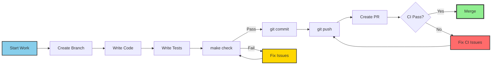
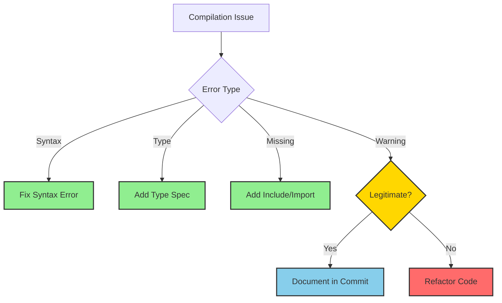
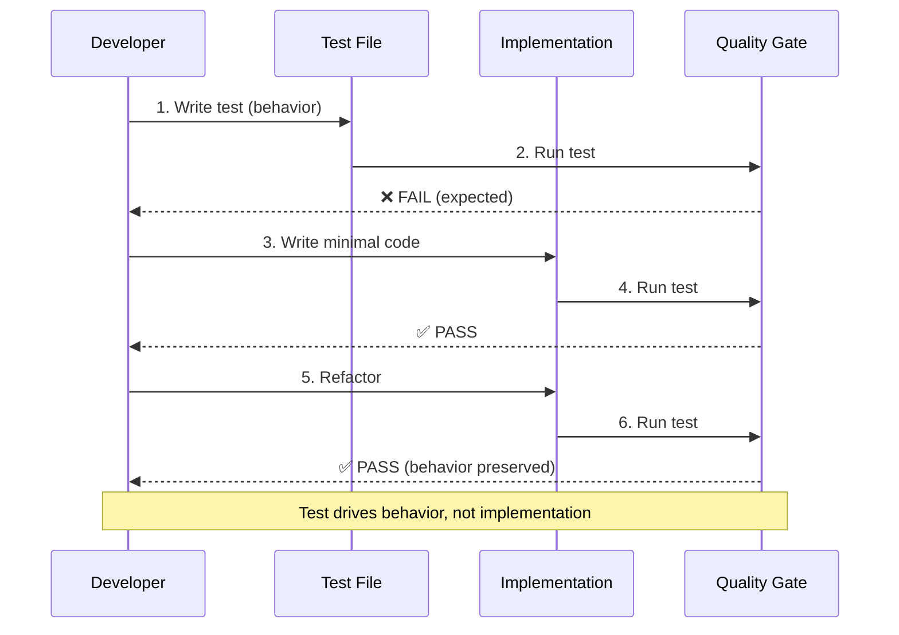
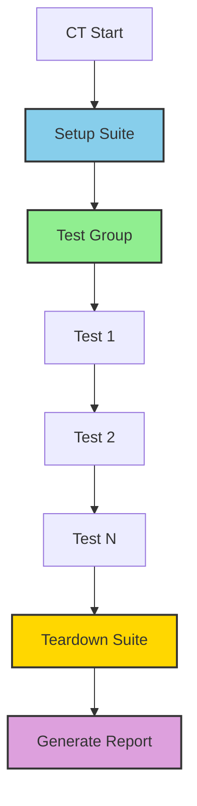
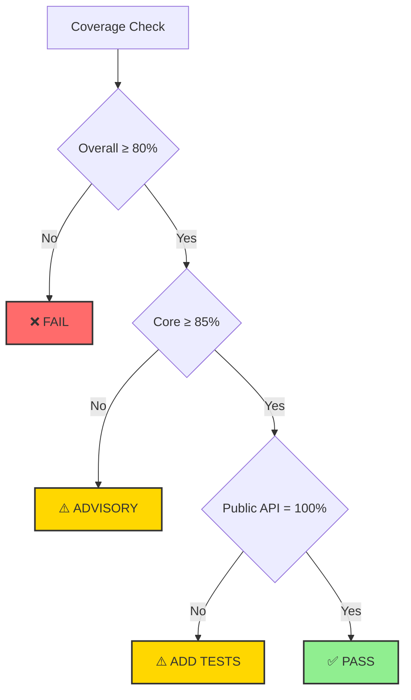
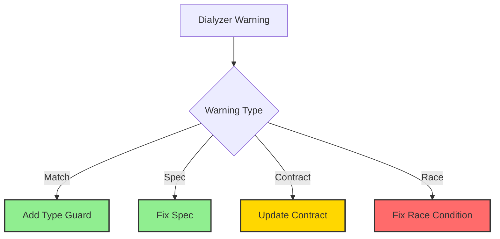
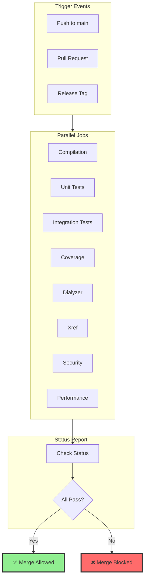
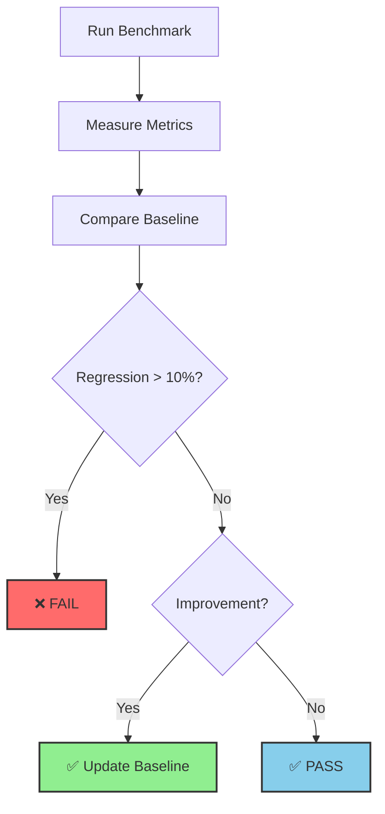
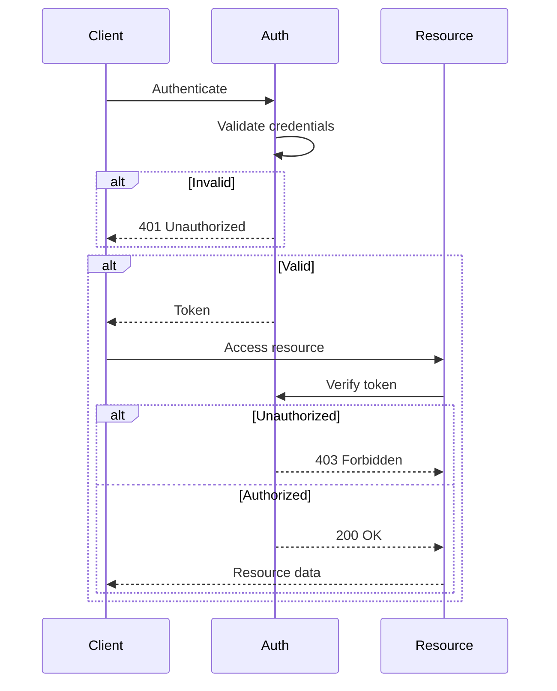

# Quality Implementation Guide

**Version**: 2.1.0
**Purpose**: Comprehensive guide to implementing and maintaining quality standards
**Audience**: Developers, QA Engineers, Release Managers

## Table of Contents

1. [Quick Start](#quick-start)
2. [Quality Gate Implementation](#quality-gate-implementation)
3. [CI/CD Integration](#cicd-integration)
4. [Testing Best Practices](#testing-best-practices)
5. [Performance Validation](#performance-validation)
6. [Security Compliance](#security-compliance)
7. [Troubleshooting](#troubleshooting)

---

## Quick Start

### 1. Initial Setup

```bash
# Clone repository
git clone https://github.com/your-org/erlmcp.git
cd erlmcp

# Install dependencies
rebar3 compile

# Run initial quality check
make check
```

### 2. Daily Development Workflow



### 3. Quality Check Commands

```bash
# Full quality check (all gates)
make check

# Individual gates
make compile          # Compilation only
make test             # Unit + Integration tests
make coverage         # Coverage report
make dialyzer         # Type checking
make xref             # Cross-reference
make benchmark-quick  # Performance baseline

# Detailed reports
rebar3 cover --verbose                    # Coverage details
rebar3 dialyzer --verbose                 # Dialyzer details
rebar3 ct --verbose                       # CT test details
```

---

## Quality Gate Implementation

### Gate 1: Compilation

**Purpose**: Verify all modules compile without errors

**Implementation**:

```erlang
%% rebar.config
{erl_opts, [
    debug_info,
    warnings_as_errors,
    {platform_define, "^2[0-9]{3}", 'ERLANG_OTP_VERSION_27'}
]}.

%% Makefile
compile:
	TERM=dumb rebar3 compile
```

**What Gets Checked**:
- Syntax errors
- Type inconsistencies
- Missing includes
- Undefined functions
- Warning count (target: ≤10)

**Common Issues and Solutions**:



### Gate 2: Unit Tests (EUnit)

**Purpose**: Verify all unit tests pass

**Chicago School TDD Workflow**:



**Test Template**:

```erlang
%% File: erlmcp_my_feature_tests.erl
-module(erlmcp_my_feature_tests).
-include_lib("eunit/include/eunit.hrl").

%% Test: Observable behavior
my_feature_test() ->
    %% Given: Real system state
    {ok, Server} = erlmcp_server:start_link([]),

    %% When: Perform operation
    Result = erlmcp_server:my_operation(Server, input),

    %% Then: Verify observable behavior
    ?assertMatch({ok, _}, Result),
    ?assertEqual(expected_value, extract_value(Result)).

%% Property: Round-trip invariant
prop_my_feature_roundtrip() ->
    ?FORALL(Input, input_generator(),
        begin
            Encoded = erlmcp_my_feature:encode(Input),
            {ok, Decoded} = erlmcp_my_feature:decode(Encoded),
            Input =:= Decoded
        end).
```

**No Mocks - Real Processes Only**:

```erlang
%% ❌ WRONG: Mock-based
test_with_mock() ->
    meck:new(erlmcp_registry),
    meck:expect(erlmcp_registry, register, fun(_) -> ok end),
    ?assert(meck:called(erlmcp_registry, register, '_')),
    meck:unload(erlmcp_registry).

%% ✅ CORRECT: Real process
test_with_real_process() ->
    {ok, Registry} = erlmcp_registry:start_link(),
    ok = erlmcp_registry:register(Registry, self(), key),
    ?assertMatch({ok, _}, erlmcp_registry:lookup(Registry, key)).
```

### Gate 3: Integration Tests (Common Test)

**Purpose**: Verify end-to-end integration

**Test Suite Structure**:

```erlang
%% File: erlmcp_integration_SUITE.erl
-module(erlmcp_integration_SUITE).
-include_lib("common_test/include/ct.hrl").

%% Suite callbacks
all() -> [
    {group, lifecycle_tests},
    {group, network_tests},
    {group, security_tests}
].

groups() -> [
    {lifecycle_tests, [], [init_shutdown_test]},
    {network_tests, [], [tcp_connection_test, ws_connection_test]},
    {security_tests, [], [auth_test, rate_limit_test]}
].

init_per_suite(Config) ->
    {ok, Apps} = application:ensure_all_started(erlmcp),
    [{apps, Apps} | Config].

end_per_suite(Config) ->
    Apps = ?config(apps, Config),
    [application:stop(App) || App <- lists:reverse(Apps)],
    ok.

%% Test: Full lifecycle
init_shutdown_test(_Config) ->
    %% Given: Fresh system
    {ok, Server} = erlmcp_server:start_link([]),

    %% When: Initialize connection
    {ok, Client} = erlmcp_client:start_link(stdio),

    %% Then: Verify full lifecycle
    ?assertEqual(ok, erlmcp_client:initialize(Client)),
    ?assertEqual(ok, erlmcp_client:shutdown(Client)).
```

**Test Execution Flow**:



### Gate 4: Code Coverage

**Purpose**: Ensure comprehensive test coverage

**Coverage Requirements**:



**Generate Coverage Report**:

```bash
# Generate HTML report
rebar3 cover --verbose

# View in browser
open _build/test/cover/index.html

# Check specific module
rebar3 cover --module=erlmcp_server

# Minimum coverage check
rebar3 cover --min_coverage=80
```

**Improving Coverage**:

```erlang
%% Before: Untested branch
handle_call(Request, _From, State) ->
    case Request of
        {register, Key} ->
            %% TODO: Test this branch
            {reply, ok, State};
        {unregister, Key} ->
            %% TODO: Test this branch
            {reply, ok, State}
    end.

%% After: Fully covered
handle_call(Request, _From, State) ->
    case Request of
        {register, Key} ->
            do_register(Key, State);
        {unregister, Key} ->
            do_unregister(Key, State)
    end.

%% Test: Both branches covered
register_unregister_test() ->
    {ok, Server} = start_server(),
    ok = gen_server:call(Server, {register, key1}),
    ?assertMatch(true, is_registered(key1)),
    ok = gen_server:call(Server, {unregister, key1}),
    ?assertMatch(false, is_registered(key1)).
```

### Gate 5: Dialyzer (Type Checking)

**Purpose**: Ensure type safety

**Type Specification Template**:

```erlang
%% Complete type specification
-spec my_function(
    Param1 :: binary(),
    Param2 :: pos_integer(),
    Param3 :: map()
) -> {ok, Result :: term()} | {error, Reason :: term()}.

my_function(Param1, Param2, Param3) ->
    %% Implementation
    ok.
```

**Common Dialyzer Warnings**:



**Fixing Warnings**:

```erlang
%% Before: No type specs
handle_info(Info, State) ->
    {noreply, State}.

%% After: Complete type specs
-spec handle_info(Info :: timeout | term(), State :: #state{}) ->
    {noreply, NewState :: #state{}}.
handle_info(Info, State) ->
    {noreply, State}.
```

### Gate 6: Xref (Cross-Reference)

**Purpose**: Detect undefined functions and unused code

**Xref Check**:

```bash
# Run xref
rebar3 xref

# Detailed output
rebar3 xref --verbose

# Check specific application
rebar3 xref -a erlmcp_core
```

**Handling Undefined Functions**:

```erlang
%% Case 1: Documented TCPS integration (allowed)
%% tcps_quality_gates:check_all_gates/1
%% Documented in CLAUDE.md as optional integration

%% Case 2: Legitimate undefined (fix required)
%% ❌ WRONG: Function doesn't exist
my_function() ->
    undefined_function().

%% ✅ CORRECT: Implement or remove
my_function() ->
    real_implementation().
```

### Gate 7: Performance Benchmarks

**Purpose**: Detect performance regressions

**Benchmark Execution**:

```bash
# Quick benchmark (baseline check)
make benchmark-quick

# Full benchmark suite
./scripts/bench/run_all_benchmarks.sh

# Specific benchmark
erlmcp_bench_core_ops:run(<<"core_ops_100k">>).
```

**Performance Baselines**:

```mermaid
graph LR
    subgraph Baselines["v1.5.0 Baselines"]
        REG["Registry: 553K ops/s"]
        QUE["Queue: 971K ops/s"]
        POL["Pool: 149K ops/s"]
        SES["Session: 242K ops/s"]
        NET["Network: 43K msg/s"]
    end

    subgraph Current["v2.1.0 Current"]
        REG2["Registry: 553K ops/s ✅"]
        QUE2["Queue: 971K ops/s ✅"]
        POL2["Pool: 149K ops/s ✅"]
        SES2["Session: 242K ops/s ✅"]
        NET2["Network: 43K msg/s ✅"]
    end

    Baselines -->|No Regression| Current

    style Baselines fill:#87CEEB,stroke:#333,stroke-width:2px
    style Current fill:#90EE90,stroke:#333,stroke-width:3px
```



**Regression Detection**:

```erlang
%% Benchmark: Core operations
bench_registry_operations(Config) ->
    {ok, Registry} = erlmcp_registry:start_link(),
    Input = generate_test_data(100000),

    {Time, _} = timer:tc(fun() ->
        [erlmcp_registry:register(Registry, K, V) || {K, V} <- Input]
    end),

    OpsPerSec = 1000000000 / Time,
    ?assert(OpsPerSec >= 500000),  % Baseline: 500K ops/s
    ok.
```

---

## CI/CD Integration

### GitHub Actions Workflows

**Workflow Structure**:



**Example Workflow**: `.github/workflows/quality-gate.yml`

```yaml
name: Quality Gates

on:
  push:
    branches: [main, develop]
  pull_request:
    branches: [main]

jobs:
  quality:
    runs-on: ubuntu-latest
    strategy:
      matrix:
        otp: [25, 26, 27]

    steps:
      - uses: actions/checkout@v3

      - name: Setup Erlang
        uses: erlef/setup-beam@v1
        with:
          otp-version: ${{ matrix.otp }}

      - name: Compile
        run: TERM=dumb rebar3 compile

      - name: Unit Tests
        run: rebar3 eunit

      - name: Integration Tests
        run: rebar3 ct

      - name: Coverage
        run: rebar3 cover

      - name: Dialyzer
        run: rebar3 dialyzer

      - name: Xref
        run: rebar3 xref

      - name: Upload Coverage
        uses: codecov/codecov-action@v3
```

### Quality Gate Status Badge

```markdown
[](https://github.com/your-org/erlmcp/actions/workflows/quality-gate.yml)
```

---

## Testing Best Practices

### Chicago School TDD

**Principles**:

1. **Tests drive behavior** - not implementation
2. **Real collaborators** - no mocks, fakes, or stubs
3. **State-based assertions** - verify observable outcomes
4. **Integration preferred** - test real interactions

**Example Workflow**:

```erlang
%% Step 1: Write test (behavior)
resource_subscription_test() ->
    %% Given: Real server
    {ok, Server} = erlmcp_server:start_link([]),

    %% When: Subscribe to resource
    {ok, SubId} = erlmcp_server:subscribe_resource(
        Server,
        <<"test://resource">>,
        self()
    ),

    %% Then: Verify observable behavior
    erlmcp_server:update_resource(Server, <<"test://resource">>, data),

    receive
        {resource_updated, <<"test://resource">>, data} ->
            ?assert(true)
    after 1000 ->
        ?assert(false, timeout)
    end.

%% Step 2: Run test → FAIL (expected)
%% Step 3: Write minimal implementation
%% Step 4: Run test → PASS
%% Step 5: Refactor (improve design)
%% Step 6: Run test → PASS (behavior preserved)
```

### Property-Based Testing

**When to Use**:

- Complex algorithms
- Data transformation
- State machines
- Protocol implementations

**Example**:

```erlang
%% Property: JSON round-trip
prop_json_roundtrip() ->
    ?FORALL(Request, json_rpc_request(),
        begin
            Encoded = erlmcp_json_rpc:encode(Request),
            {ok, Decoded} = erlmcp_json_rpc:decode(Encoded),
            equals(Request, Decoded)
        end).

%% Property: Monotonic IDs
prop_monotonic_ids() ->
    ?FORALL(_N, range(1, 100),
        begin
            Ids = [erlmcp_request_id:new() || _ <- lists:seq(1, _N)],
            lists:sort(Ids) =:= Ids
        end).
```

### Chaos Engineering

**Purpose**: Test resilience under failure

**Test Scenarios**:

```erlang
%% Scenario: Network partition
chaos_network_partition_test(_Config) ->
    %% Given: Normal system
    {ok, Server} = erlmcp_server:start_link([]),

    %% When: Simulate partition
    erlmcp_chaos_network:partition(5000),  % 5s partition

    %% Then: Verify recovery
    timer:sleep(6000),
    ?assertEqual(ok, erlmcp_server:ping(Server)).

%% Scenario: Process kill
chaos_process_kill_test(_Config) ->
    %% Given: Running process
    {ok, Pid} = erlmcp_worker:start_link([]),

    %% When: Kill process
    exit(Pid, kill),

    %% Then: Supervisor restarts
    timer:sleep(1000),
    ?assertMatch({ok, _}, erlmcp_worker:start_link([])).
```

---

## Performance Validation

### Benchmark Categories

**Core Operations**:

```erlang
%% Benchmark: Registry operations
bench_registry_register(Config) ->
    {ok, Registry} = erlmcp_registry:start_link(),
    N = 100000,

    {Time, _} = timer:tc(fun() ->
        [erlmcp_registry:register(Registry, K, V) ||
            K <- lists:seq(1, N),
            V <- [value]]
    end),

    OpsPerSec = (N * 1000000) div Time,
    ?assert(OpsPerSec >= 500000),  % Baseline: 500K ops/s
    ok.
```

**Network Operations**:

```erlang
%% Benchmark: TCP message throughput
bench_tcp_throughput(Config) ->
    {ok, Server} = erlmcp_server:start_link([{transport, tcp}]),
    {ok, Client} = erlmcp_client:connect(tcp),

    N = 10000,
    Msg = <<"{\"jsonrpc\":\"2.0\",\"method\":\"ping\"}">>,

    {Time, _} = timer:tc(fun() ->
        [erlmcp_client:send(Client, Msg) || _ <- lists:seq(1, N)]
    end),

    MsgsPerSec = (N * 1000000) div Time,
    ?assert(MsgsPerSec >= 40000),  % Baseline: 40K msg/s
    ok.
```

### Performance Regression Detection



---

## Security Compliance

### Input Validation

**Schema Validation**:

```erlang
%% Validate JSON-RPC request
validate_request(Json) ->
    case jesse:decode(Json, schema(mcp_request)) of
        {ok, Request} ->
            {ok, Request};
        {error, Errors} ->
            {error, {validation_failed, Errors}}
    end.
```

**Message Size Limits**:

```erlang
%% Enforce size limits (DoS prevention)
validate_message_size(Message, MaxSize) ->
    case byte_size(Message) of
        Size when Size > MaxSize ->
            {error, message_too_large};
        _ ->
            ok
    end.
```

### Authentication & Authorization

**Auth Flow**:



---

## Troubleshooting

### Common Issues

**Issue 1: Compilation Fails**

```bash
# Check error details
TERM=dumb rebar3 compile 2>&1 | tee compile.log

# Common causes:
# - Syntax error → Fix syntax
# - Missing include → Add include
# - Type mismatch → Fix types
# - Warning limit → Reduce warnings
```

**Issue 2: Tests Fail**

```bash
# Run with verbose output
rebar3 eunit --verbose

# Run specific test
rebar3 eunit --module=erlmcp_server_tests

# Check for:
# - Race conditions → Add synchronization
# - Missing setup → Fix init_per_testcase
# - Timeout → Increase timeout
# - State leak → Add cleanup
```

**Issue 3: Coverage Too Low**

```bash
# Generate detailed report
rebar3 cover --verbose

# Identify untested lines
open _build/test/cover/index.html

# Add tests for:
# - Error handling branches
# - Edge cases
# - Boundary conditions
# - Alternative paths
```

**Issue 4: Dialyzer Warnings**

```bash
# Rebuild PLT
rebar3 dialyzer --rebuild

# Check specific module
rebar3 dialyzer -m erlmcp_server

# Common fixes:
# - Add type specs
# - Fix @spec annotations
# - Add @type definitions
# - Fix @doc comments
```

**Issue 5: Performance Regression**

```bash
# Run detailed benchmark
./scripts/bench/run_all_benchmarks.sh

# Compare to baseline
make benchmark-compare

# Investigate:
# - Algorithm complexity
# - Memory allocation
# - Network latency
# - Lock contention
```

---

## Quality Gate Checklist

### Before Commit

- [ ] Code compiles without errors
- [ ] Unit tests pass (100%)
- [ ] Coverage ≥ 80%
- [ ] Type specs complete
- [ ] No compiler warnings (or documented)
- [ ] No debug prints
- [ ] Docstrings present

### Before Push

- [ ] All tests pass (unit + integration)
- [ ] Dialyzer clean (0 warnings)
- [ ] Xref clean (or documented)
- [ ] Format check passes
- [ ] Security scan passes

### Before Release

- [ ] Performance baseline met
- [ ] MCP compliance 100%
- [ ] Evidence bundle complete
- [ ] Documentation updated
- [ ] Changelog updated

---

**Version**: 2.1.0
**Last Updated**: January 31, 2026
**Maintainer**: erlmcp Quality Team
