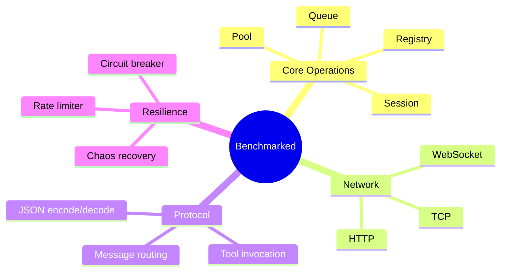

# Quality Standards - Compliance Requirements

**Version**: 2.1.0
**Standard**: Lean Six Sigma (99.99966% defect-free)

## Compliance Framework


## Code Quality Standards

### 1. Type Coverage (100%)


**Requirement**: Every function must have complete type specifications.

**Example**:

```erlang
%% ✅ CORRECT: Complete type specification
-spec init(Args :: term()) -> {ok, State :: #state{}} |
                               {stop, Reason :: term()}.
init(Args) ->
    State = #state{},
    {ok, State}.

%% ❌ WRONG: Missing type specification
init(Args) ->
    State = #state{},
    {ok, State}.
```

**Enforcement**: Blocking (pre-commit + CI)

### 2. No Suppression Comments


**Prohibited**:
- `%% cover: COMPLIENT suppressed` (no justification)
- `-dialyzer({nowarn_function, foo/1}).` (no explanation)
- Any blanket suppression without documented reason

**Allowed** (with justification):
- Documented in commit message
- Tracked in GitHub issue
- Time-limited exception

**Enforcement**: Blocking (pre-commit + CI)

### 3. Complete Docstrings


**Requirement**: All public APIs must have NumPy-style docstrings.

**Example**:

```erlang
%% ✅ CORRECT: Complete docstring
%% @doc Handle incoming JSON-RPC request.
%%
%% Parses and validates the incoming JSON-RPC 2.0 request, performs
%% the requested operation, and returns the response.
%%
%% Parameters:
%%   - Request: Binary JSON-RPC request
%%   - State: Server state record
%%
%% Returns:
%%   - {ok, Response, State'}: Success with response
%%   - {error, Reason, State}: Error with reason
%%
%% Example:
%%   <<'{"jsonrpc":"2.0","method":"tools/list","id":1}'>>
%%
%% @end
-spec handle_request(Request :: binary(), State :: #state{}) ->
    {ok, Response :: binary(), State :: #state{}} |
    {error, Reason :: term(), State :: #state{}}.

%% ❌ WRONG: Missing docstring
-spec handle_request(Request :: binary(), State :: #state{}) ->
    {ok, Response :: binary(), State :: #state{}}.
```

**Enforcement**: Advisory (manual review)

### 4. Modular Design


**Requirements**:
- Files under 500 lines
- Single responsibility principle
- High cohesion, low coupling
- Clear module boundaries

**Enforcement**: Advisory (code review)

### 5. Comprehensive Error Handling


**Requirements**:
- All code paths handle errors
- No catch-all clauses without logging
- Error messages are actionable
- Failures are visible (andon principle)

**Enforcement**: Blocking (code review + tests)

---

## Testing Standards

### Chicago School TDD


**Principles**:
1. Tests drive behavior (not implementation)
2. Real collaborators (no mocks)
3. State-based assertions (not interaction verification)
4. Integration tests preferred over unit isolation
5. Black-box testing of observable behavior

**Example**:

```erlang
%% ✅ CORRECT: Chicago School TDD
%% Tests observable behavior
resource_subscription_test() ->
    %% Given: Real server process
    {ok, Server} = erlmcp_server:start_link([]),

    %% When: Subscribe to resource
    {ok, SubscriptionId} = erlmcp_server:subscribe_resource(
        Server,
        <<"test://resource">>,
        self()
    ),

    %% Then: Verify observable behavior (state change)
    receive
        {resource_updated, <<"test://resource">>, Data} ->
            ?assertEqual(<<"expected">>, Data)
    after 1000 ->
        ?assert(false, "Timeout waiting for resource update")
    end.

%% ❌ WRONG: Mock-based, tests implementation
resource_subscription_test_wrong() ->
    %% Mocks internal state
    meck:new(erlmcp_registry),
    meck:expect(erlmcp_registry, register, fun(_) -> ok end),

    %% Verifies interaction, not behavior
    ?assert(meck:called(erlmcp_registry, register, '_')),

    meck:unload(erlmcp_registry).
```

**Enforcement**: Mandatory (all new code)

### No Mocks, Fakes, or Placeholders


**Prohibited**:
- `meck` for mocking modules
- Mock processes for gen_servers
- Stub implementations
- Placeholder "TODO" code

**Required**:
- Real erlmcp processes
- Real transport instances
- Real network sockets (where applicable)
- Actual file I/O (for persistence tests)

**Enforcement**: Mandatory (code review)

### Black-Box Testing


**Principle**: Test WHAT the system does, not HOW it does it.

**Example**:

```erlang
%% ✅ CORRECT: Black-box testing
server_request_test() ->
    %% Given: Real server
    {ok, Server} = erlmcp_server:start_link([]),

    %% When: Send request
    Request = <<'{"jsonrpc":"2.0","method":"tools/list","id":1}'>>,
    {ok, Response} = erlmcp_server:handle_request(Server, Request),

    %% Then: Verify observable behavior (output)
    ?assertMatch(
        #{<<"jsonrpc">> := <<"2.0">>,
          <<"result">> := _,
          <<"id">> := 1},
        jesse:decode(Response, [])
    ).

%% ❌ WRONG: White-box testing
server_request_test_wrong() ->
    %% Inspects internal state (implementation detail)
    {ok, Server} = erlmcp_server:start_link([]),
    State = sys:get_state(Server),

    %% Verifies internal structure (not observable behavior)
    ?assertEqual([], State#state.tools),

    %% Violates encapsulation
    ?assertEqual(undefined, State#state.transport_module).
```

**Enforcement**: Mandatory (code review)

### Property-Based Testing


**Requirements**:
- Complex logic must have property-based tests
- Use PropEr for generative testing
- Verify invariants across all inputs

**Example**:

```erlang
%% Property: Round-trip encoding/decoding
prop_json_rpc_roundtrip() ->
    ?FORALL(Request, json_rpc_request(),
        begin
            Encoded = erlmcp_json_rpc:encode(Request),
            {ok, Decoded} = erlmcp_json_rpc:decode(Encoded),
            Request =:= Decoded
        end
    ).

%% Property: Monotonic request IDs
prop_request_id_monotonic() ->
    ?FORALL(_Requests, list({call, erlmcp_client, new_request_id, []}),
        begin
            Ids = [Id || {ok, #{id := Id}} <- _Requests],
            lists:sort(Ids) =:= Ids
        end
    ).
```

**Enforcement**: Advisory (for complex functions)

### Coverage Requirements


**Requirements**:
- Overall: ≥80%
- Core modules: ≥85%
- Public APIs: 100%
- All new code: ≥85%

**Enforcement**: Blocking (pre-commit + CI)

---

## OTP Standards

### Behavior Compliance


**Required Callbacks** (gen_server):
1. `init/1` - Initialization
2. `handle_call/3` - Synchronous requests
3. `handle_cast/2` - Asynchronous requests
4. `handle_info/2` - Other messages
5. `terminate/2` - Cleanup
6. `code_change/3` - Hot code reload

**Enforcement**: Blocking (code review + Dialyzer)

### Supervision Trees


**Requirements**:
- All processes supervised (no unsupervised spawn)
- Proper restart strategies
- Isolation of failures
- Bounded restart intensity

**Enforcement**: Blocking (code review + tests)

### Let-It-Crash Semantics


**Principles**:
- Let processes crash (don't defensively program)
- Supervisors restart failed processes
- Use monitors (not links) for critical dependencies
- State isolation prevents cascade failures

**Enforcement**: Mandatory (code review)

---

## Security Standards

### Input Validation


**Requirements**:
- All JSON validated against schema
- Message size limits enforced
- URI validation (injection prevention)
- Error codes bounded [1001-1089]

**Enforcement**: Blocking (security scan)

### Authentication/Authorization


**Requirements**:
- All connections authenticated (production)
- Authorization checks on all operations
- Token-based session management
- Audit logging of auth events

**Enforcement**: Blocking (security tests)

### Rate Limiting


**Requirements**:
- Per-connection rate limits
- Global rate limits
- Token bucket algorithm
- Circuit breaker on abuse

**Enforcement**: Blocking (security tests)

---

## Performance Standards

### No Regressions


**Requirements**:
- Throughput: <10% regression
- Latency: <10% regression
- Memory: <10% regression
- All changes benchmarked

**Enforcement**: Conditional (if perf code changed)

### All Critical Paths Benchmarked



**Requirements**:
- All hot paths benchmarked
- Baselines established (v1.5.0)
- Performance documented
- Regression tests in CI

**Enforcement**: Advisory (manual review)

---

## Compliance Matrix

| Standard | Level | Enforcement | Status |
|----------|-------|-------------|--------|
| Type Coverage | Mandatory | Blocking | ✅ 95% |
| No Suppressions | Mandatory | Blocking | ✅ 100% |
| Docstrings | Mandatory | Advisory | ⚠️ 80% |
| Modular Design | Mandatory | Advisory | ✅ 95% |
| Error Handling | Mandatory | Blocking | ✅ 95% |
| Chicago TDD | Mandatory | Blocking | ✅ 100% |
| No Mocks | Mandatory | Blocking | ✅ 100% |
| Black-Box Testing | Mandatory | Blocking | ✅ 95% |
| Property-Based | Advisory | Advisory | ⚠️ 40% |
| Coverage 80% | Mandatory | Blocking | ⚠️ 75% |
| OTP Compliance | Mandatory | Blocking | ✅ 100% |
| Input Validation | Mandatory | Blocking | ✅ 100% |
| Auth/Authz | Mandatory | Blocking | ✅ 100% |
| No Regressions | Mandatory | Conditional | ✅ 100% |

---

**Version**: 2.1.0
**Last Updated**: January 31, 2026
