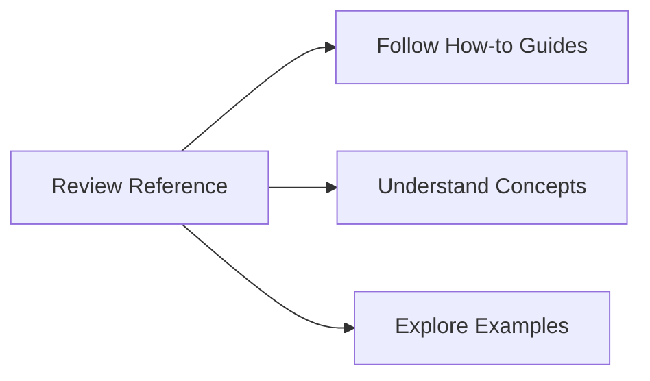

# Reference - Technical Documentation

Welcome to the **Reference** section of the Diátaxis documentation. Here we focus on the **what** - comprehensive technical specifications, APIs, and implementation details.

## 🎯 Purpose of This Section

**Reference** answers the technical questions:
- What are the exact API specifications?
- What are the configuration options?
- What are the technical limitations?
- What are the security requirements?

## 📚 What You'll Find

### API Reference
- [Client API](api-reference/client.md) - Complete client interface
- [Server API](api-reference/server.md) - Server-side implementation
- [Transport API](api-reference/transport.md) - Transport layer interfaces
- [Registry API](api-reference/registry.md) - Service discovery interface
- [JSON-RPC API](api-reference/json-rpc.md) - Protocol details

### Configuration
- [Configuration Schema](configuration/schema.md) - All configuration options
- [Environment Variables](configuration/environment.md) - Environment-based config
- [File Formats](configuration/formats.md) - Config file formats
- [Validation Rules](configuration/validation.md) - Configuration validation

### Security
- [Authentication Mechanisms](security/authentication.md) - Who can connect
- [Authorization Policies](security/authorization.md) - What they can do
- [Transport Security](security/transport.md) - Encryption details
- [Security Headers](security/headers.md) - Security configurations

### Performance
- [Benchmarks](performance/benchmarks.md) - Performance metrics
- [Metrics API](performance/metrics.md) - Monitoring points
- [Optimization Guidelines](performance/optimization.md) - Tuning parameters
- [Resource Limits](performance/limits.md) - System constraints

### Protocol
- [MCP Protocol](protocol/mcp.md) - Full specification
- [Message Formats](protocol/messages.md) - Protocol messages
- [Error Codes](protocol/errors.md) - Error handling
- [Versioning](protocol/versioning.md) - Version compatibility

### Deployment
- [Installation Requirements](deployment/requirements.md) - System needs
- [Deployment Options](deployment/options.md) - Different deployment methods
- [Scaling Guidelines](deployment/scaling.md) - Horizontal scaling
- [Backup and Recovery](deployment/backup.md) - Data protection

## 🎯 For Whom

- **Developers**: Implementation details and API specs
- **System Administrators**: Deployment and configuration
- **Security Engineers**: Security specifications
- **Performance Engineers**: Technical metrics and tuning

## 📖 Reference Structure

### Core APIs
```markdown
1. [Client API](api-reference/client.md) - Primary interface
2. [Server API](api-reference/server.md) - Server implementation
3. [Transport API](api-reference/transport.md) - Communication layer
4. [Registry API](api-reference/registry.md) - Service discovery
```

### Configuration System
```markdown
1. [Configuration Schema](configuration/schema.md) - All options
2. [Environment Variables](configuration/environment.md) - Runtime config
3. [Validation Rules](configuration/validation.md) - Error checking
```

### Security Framework
```markdown
1. [Authentication](security/authentication.md) - Identity verification
2. [Authorization](security/authorization.md) - Access control
3. [Transport Security](security/transport.md) - Data protection
```

## 🔧 Technical Details

### API Documentation
Each API includes:
- Function signatures and types
- Parameter descriptions
- Return value specifications
- Error conditions and codes
- Usage examples
- Best practices

### Configuration Options
All configuration includes:
- Default values
- Validation rules
- Dependencies
- Example usage
- Migration guides

### Performance Metrics
Detailed performance data:
- Benchmarks and baselines
- Resource usage patterns
- Optimization recommendations
- Troubleshooting thresholds

## 📊 Technical Specifications

### System Requirements
- **Erlang/OTP**: 25+
- **Memory**: Minimum 512MB RAM
- **Network**: TCP/HTTP support
- **Storage**: Configuration storage

### Performance Characteristics
- **Throughput**: Up to 2.69M ops/sec
- **Latency**: P50 < 100µs, P95 < 1ms
- **Connections**: 40-50K concurrent per node
- **Scalability**: Horizontal scaling supported

### Security Compliance
- **Authentication**: Multiple mechanisms
- **Authorization**: Role-based access
- **Encryption**: TLS 1.2+
- **Auditing**: Comprehensive logging

## 🔍 Deep Dives

### Implementation Details
- [OTP Patterns](erlang-otp-patterns.md) - Erlang/OTP specifics
- [State Management](state-management.md) - State handling
- [Concurrency Model](concurrency.md) - Process management
- [Distribution](distribution.md) - Multi-node setup

### Troubleshooting
- [Common Issues](troubleshooting/common.md) - Frequent problems
- [Debug Tools](troubleshooting/debugging.md) - Debugging techniques
- [Log Analysis](troubleshooting/logging.md) - Log interpretation
- [Performance Issues](troubleshooting/performance.md) - Slow performance

## 🔗 Connecting to Other Sections

- **Explain**: Understand the concepts behind these specs
- **How-to**: Learn how to implement these features
- **Appendices**: See examples and additional resources

## 🎯 Next Steps

After reviewing the reference:



**Learn to implement?** → [Go to How-to Guides](../howto/README.md)

**Understand concepts?** → [Read Explain](../explain/README.md)

**See examples?** → [Browse Appendices](../appendices/README.md)

## 📋 Quick Lookup

**Find what you need quickly:**

```markdown
- **API Methods** → [Client API](api-reference/client.md)
- **Configuration** → [Configuration Schema](configuration/schema.md)
- **Security** → [Authentication](security/authentication.md)
- **Performance** → [Benchmarks](performance/benchmarks.md)
- **Protocol** → [MCP Protocol](protocol/mcp.md)
- **Deployment** → [Installation](deployment/requirements.md)
```