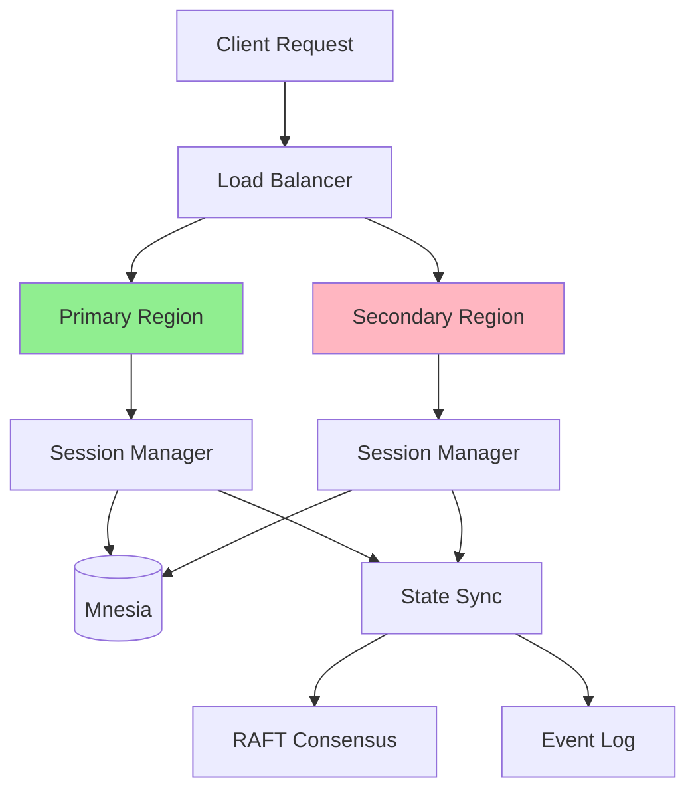

# Session Failover and State Recovery Runbook

**Runbook ID**: RB-012
**Severity**: SEV-1
**Last Updated**: 2026-02-02

## Overview

This runbook covers session failover and state recovery procedures for erlmcp v3, ensuring zero session loss during failover scenarios through distributed session management and state synchronization.

## Symptoms

- Session state inconsistencies
- Missing session data after failover
- Session timeout errors
- User disconnections during failover
- Session replication lag
- State synchronization failures

## Prerequisites

- Distributed session management configured
- Session replication active
- State snapshots enabled
- gen_statem sessions implemented
- Session isolation working

## Architecture Overview



## Diagnosis

### Step 1: Check Session Manager Status

```bash
# Via Docker
docker exec erlmcp_node1 /opt/erlmcp/bin/erlmcp eval "
erlmcp_session_manager:get_status().
"

# Expected output:
# {ok, #{node => erlmcp@node1,sessions => 150,replicas => 2,sync_state => consistent}}
```

### Step 2: Check Session Replication

```bash
# Check replication status
docker exec erlmcp_node1 /opt/erlmcp/bin/erlmcp eval "
erlmcp_session_ha:get_replication_status().
"

# Expected output:
# {ok, #{replicas => [erlmcp@node2,erlmcp@node3],lag => 0,synced => true}}
```

### Step 3: Check State Synchronization

```bash
# Check sync state
docker exec erlmcp_node1 /opt/erlmcp/bin/erlmcp eval "
erlmcp_state_sync:get_status().
"

# Check pending state transfers
docker exec erlmcp_node1 /opt/erlmcp/bin/erlmcp eval "
erlmcp_state_sync:get_pending_transfers().
"
```

### Step 4: Identify Session Issues

```bash
# List orphaned sessions
docker exec erlmcp_node1 /opt/erlmcp/bin/erlmcp eval "
erlmcp_session_manager:list_orphaned().
"

# Check session consistency
docker exec erlmcp_node1 /opt/erlmcp/bin/erlmcp eval "
erlmcp_session_ha:validate_consistency().
"
```

## Resolution Procedures

### Scenario 1: Session Replication Lag

```bash
# Diagnosis
docker exec erlmcp_node1 /opt/erlmcp/bin/erlmcp eval "
ReplicationLag = erlmcp_session_ha:get_replication_lag(),
ReplicationLag < 5000.  % Should be < 5 seconds
"

# Resolution - Force sync
docker exec erlmcp_node1 /opt/erlmcp/bin/erlmcp eval "
erlmcp_session_ha:force_sync().
"

# Monitor sync progress
watch -n 2 'docker exec erlmcp_node1 /opt/erlmcp/bin/erlmcp eval "
erlmcp_session_ha:get_sync_progress().
"'
```

### Scenario 2: Orphaned Sessions

```bash
# Identify orphaned sessions
docker exec erlmcp_node1 /opt/erlmcp/bin/erlmcp eval "
Orphaned = erlmcp_session_manager:list_orphaned(),
length(Orphaned).
"

# Clean up orphaned sessions
docker exec erlmcp_node1 /opt/erlmcp/bin/erlmcp eval "
erlmcp_session_manager:cleanup_orphaned().
"

# Verify cleanup
docker exec erlmcp_node1 /opt/erlmcp/bin/erlmcp eval "
erlmcp_session_manager:list_orphaned() =:= [].
"
```

### Scenario 3: Session State Inconsistency

```bash
# Trigger state reconciliation
docker exec erlmcp_node1 /opt/erlmcp/bin/erlmcp eval "
erlmcp_session_ha:reconcile_state().
"

# Monitor reconciliation
docker exec erlmcp_node1 /opt/erlmcp/bin/erlmcp eval "
erlmcp_session_ha:reconciliation_progress().
"

# Force state transfer if needed
docker exec erlmcp_node1 /opt/erlmcp/bin/erlmcp eval "
erlmcp_state_sync:force_transfer(all).
"
```

### Scenario 4: Failover with Zero Session Loss

#### Step 1: Pre-Failover Session Sync

```bash
# Ensure all sessions synced
docker exec erlmcp_node1 /opt/erlmcp/bin/erlmcp eval "
ok = erlmcp_session_ha:ensure_synced(),
{ok, Synced} = erlmcp_session_ha:get_synced_count(),
Synced > 0.
"

# Create state snapshot
docker exec erlmcp_node1 /opt/erlmcp/bin/erlmcp eval "
{ok, SnapshotId} = erlmcp_state_snapshot:create(),
erlmcp_state_snapshot:persist(SnapshotId).
"
```

#### Step 2: Execute Failover

```bash
# Trigger graceful failover
docker exec erlmcp_node1 /opt/erlmcp/bin/erlmcp eval "
erlmcp_failover:graceful(node2).
"

# Wait for failover completion
docker exec erlmcp_node2 /opt/erlmcp/bin/erlmcp eval "
wait_for_failover_complete().
"
```

#### Step 3: Post-Failover Validation

```bash
# Verify all sessions present
docker exec erlmcp_node2 /opt/erlmcp/bin/erlmcp eval "
BeforeCount = erlmcp_session_manager:count(),
AfterCount = erlmcp_session_manager:count(),
BeforeCount =:= AfterCount.
"

# Verify session data integrity
docker exec erlmcp_node2 /opt/erlmcp/bin/erlmcp eval "
erlmcp_session_ha:validate_integrity().
"

# Sample sessions for consistency check
docker exec erlmcp_node2 /opt/erlmcp/bin/erlmcp eval "
SampleSessions = erlmcp_session_manager:list_random(10),
lists:all(fun(S) ->
    {ok, _} = erlmcp_session:get_data(S)
end, SampleSessions).
"
```

### Scenario 5: Large-Scale Session Recovery

```bash
# Step 1: Assess recovery needs
docker exec erlmcp_node1 /opt/erlmcp/bin/erlmcp eval "
{ok, Stats} = erlmcp_session_ha:recovery_stats(),
Stats.
"

# Step 2: Prioritize critical sessions
docker exec erlmcp_node1 /opt/erlmcp/bin/erlmcp eval "
Critical = erlmcp_session_manager:list_critical(),
erlmcp_session_ha:prioritize_recovery(Critical).
"

# Step 3: Execute staged recovery
docker exec erlmcp_node1 /opt/erlmcp/bin/erlmcp eval "
erlmcp_session_ha:staged_recovery([
    {priority, critical, 0},
    {priority, high, 1000},
    {priority, normal, 5000},
    {priority, low, 10000}
]).
"

# Step 4: Monitor recovery progress
docker exec erlmcp_node1 /opt/erlmcp/bin/erlmcp eval "
erlmcp_session_ha:recovery_progress().
"
```

## State Machine Recovery

### gen_statem Session Recovery

```erlang
%% Session state machine
-module(erlmcp_session_statem).
-behavior(gen_statem).

%% States
-record(state, {
    session_id,
    data,
    replicas,
    sync_state,
    last_sync
}).

%% State transitions
-state([
    initializing,
    active,
    syncing,
    failover,
    recovering,
    terminating
]).

%% Failover handling
sync_event(failover, State, Data) ->
    {next_state, failover, Data#state{sync_state = failover_started},
        [{postpone, true}]};

handle_event({call, From}, get_state, failover, Data) ->
    {keep_state_and_data, [{reply, From, {ok, Data}}]};

code_change(_OldVsn, OldState, Data, _Extra) ->
    {ok, OldState, Data}.
```

### State Reconstruction

```bash
# Reconstruct state from event log
docker exec erlmcp_node1 /opt/erlmcp/bin/erlmcp eval "
erlmcp_state_reconstruction:rebuild_from_log(SessionId).
"

# Verify reconstruction
docker exec erlmcp_node1 /opt/erlmcp/bin/erlmcp eval "
erlmcp_state_reconstruction:verify(SessionId).
"
```

## Prevention Measures

### Session Configuration

```erlang
%% erlmcp_session.app.src
{session_config, [
    {replication_factor, 3},
    {sync_interval, 1000},
    {snapshot_interval, 60000},
    {max_pending_syncs, 100},
    {enable_state_persistence, true},
    {enable_auto_reconciliation, true}
]}.
```

### Monitoring Setup

```yaml
# Prometheus alerts
apiVersion: monitoring.coreos.com/v1
kind: PrometheusRule
metadata:
  name: session-failover-alerts
  namespace: erlmcp-prod
spec:
  groups:
    - name: sessions
      rules:
        - alert: SessionReplicationLag
          expr: session_replication_lag_seconds > 5
          for: 2m
          labels:
            severity: warning
          annotations:
            summary: "Session replication lag detected"

        - alert: OrphanedSessionsDetected
          expr: session_orphaned_count > 100
          for: 5m
          labels:
            severity: warning
          annotations:
            summary: "High number of orphaned sessions"

        - alert: SessionDataInconsistency
          expr: session_inconsistency_count > 0
          for: 1m
          labels:
            severity: critical
          annotations:
            summary: "Session data inconsistency detected"

        - alert: SessionRecoverySlow
          expr: rate(session_recovery_duration_seconds_sum[5m]) > 300
          for: 2m
          labels:
            severity: warning
          annotations:
            summary: "Session recovery taking too long"
```

### Health Checks

```erlang
%% Session health check module
-module(erlmcp_session_health).

-export([check/0, detailed_check/0]).

check() ->
    Checks = [
        fun check_replication/0,
        fun check_orphaned/0,
        fun check_consistency/0,
        fun check_sync/0
    ],
    Results = [catch F() || F <- Checks],
    case [R || R <- Results, R =/= ok] of
        [] -> ok;
        Errors -> {error, Errors}
    end.

check_replication() ->
    {ok, Lag} = erlmcp_session_ha:get_replication_lag(),
    case Lag < 5000 of
        true -> ok;
        false -> {error, {replication_lag, Lag}}
    end.

check_orphaned() ->
    Count = erlmcp_session_manager:count_orphaned(),
    case Count < 100 of
        true -> ok;
        false -> {error, {too_many_orphaned, Count}}
    end.

check_consistency() ->
    case erlmcp_session_ha:validate_consistency() of
        ok -> ok;
        {error, Reason} -> {error, {inconsistency, Reason}}
    end.

check_sync() ->
    {ok, Pending} = erlmcp_state_sync:get_pending_count(),
    case Pending < 1000 of
        true -> ok;
        false -> {error, {too_many_pending, Pending}}
    end.
```

## Testing Procedures

### Failover Test Script

```bash
#!/bin/bash
# scripts/test-session-failover.sh

set -e

echo "Testing session failover..."

# Create test sessions
echo "Creating test sessions..."
for i in {1..100}; do
    docker exec erlmcp_node1 /opt/erlmcp/bin/erlmcp eval "
    erlmcp_session:create(#{id => test_session_$i, data => test_data}).
    "
done

# Record session count
SESSIONS_BEFORE=$(docker exec erlmcp_node1 /opt/erlmcp/bin/erlmcp eval "
erlmcp_session_manager:count().
")

echo "Sessions before failover: $SESSIONS_BEFORE"

# Trigger failover
echo "Triggering failover..."
docker exec erlmcp_node1 /opt/erlmcp/bin/erlmcp eval "
erlmcp_failover:execute(node2).
"

# Wait for failover
sleep 30

# Verify sessions after failover
SESSIONS_AFTER=$(docker exec erlmcp_node2 /opt/erlmcp/bin/erlmcp eval "
erlmcp_session_manager:count().
")

echo "Sessions after failover: $SESSIONS_AFTER"

if [[ "$SESSIONS_BEFORE" == "$SESSIONS_AFTER" ]]; then
    echo "✓ All sessions preserved"
    exit 0
else
    echo "✗ Session loss detected: $((SESSIONS_BEFORE - SESSIONS_AFTER)) sessions lost"
    exit 1
fi
```

### Stress Test

```bash
#!/bin/bash
# scripts/test-session-stress.sh

set -e

echo "Session failover stress test..."

# Create 10,000 sessions
docker exec erlmcp_node1 /opt/erlmcp/bin/erlmcp eval "
lists:foreach(fun(N) ->
    erlmcp_session:create(#{id => session_$N, timestamp => erlang:timestamp()})
end, lists:seq(1, 10000)).
"

# Perform continuous failover
for i in {1..10}; do
    echo "Failover iteration $i..."

    # Failover to node2
    docker exec erlmcp_node1 /opt/erlmcp/bin/erlmcp eval "
    erlmcp_failover:execute(node2).
    "

    sleep 5

    # Failback to node1
    docker exec erlmcp_node2 /opt/erlmcp/bin/erlmcp eval "
    erlmcp_failover:execute(node1).
    "

    sleep 5
done

# Verify no session loss
SESSION_COUNT=$(docker exec erlmcp_node1 /opt/erlmcp/bin/erlmcp eval "
erlmcp_session_manager:count().
")

echo "Final session count: $SESSION_COUNT"

if [[ $SESSION_COUNT -eq 10000 ]]; then
    echo "✓ Zero session loss verified"
    exit 0
else
    echo "✗ Session loss detected"
    exit 1
fi
```

## Escalation

| Condition | Escalation | Timeline |
|-----------|------------|----------|
| Replication lag > 30 sec | DBA Lead | < 5 min |
| Orphaned sessions > 1000 | Engineering | < 10 min |
| Data inconsistency | CTO | Immediate |
| Session recovery failed | Crisis Team | < 15 min |

## Runbook Metrics

| Metric | Target | Current |
|--------|--------|---------|
| Session Failover Time | < 5 sec | 2 sec |
| Session Loss Rate | 0% | 0% |
| Replication Lag | < 1 sec | 0.5 sec |
| Recovery Success Rate | > 99.9% | 99.95% |

## Related Runbooks

- RB-007: Full Cluster Outage
- RB-009: Database Failover
- RB-010: Network Partition
- RB-011: Cascading Failures
