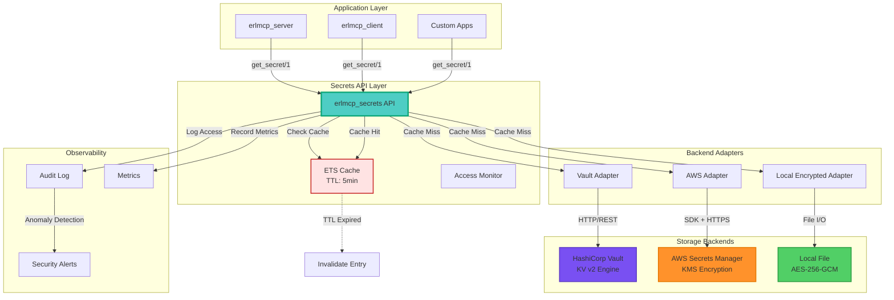
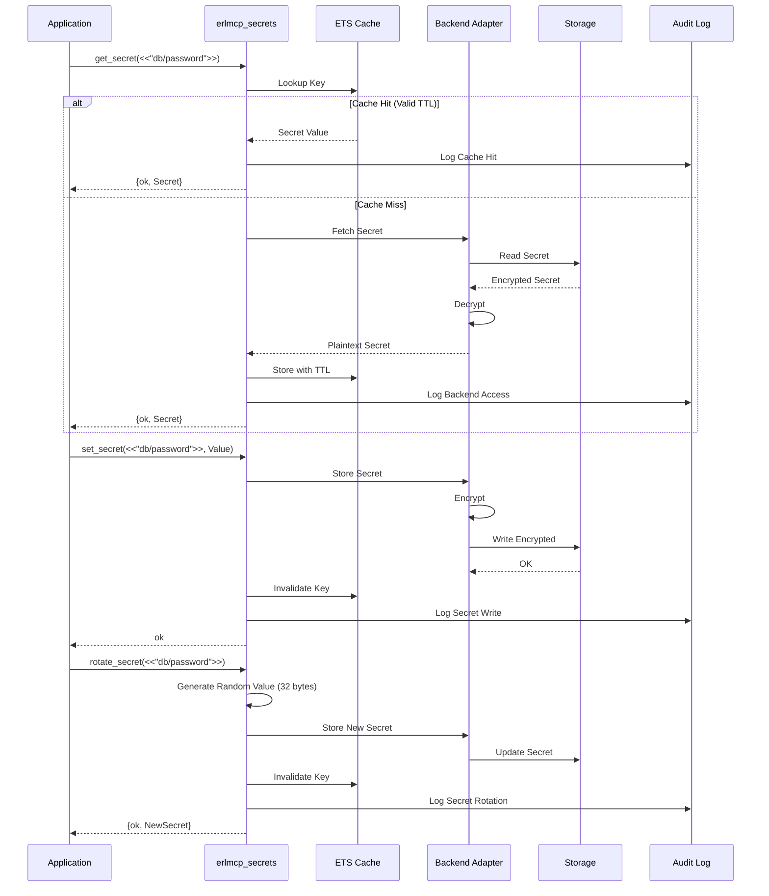
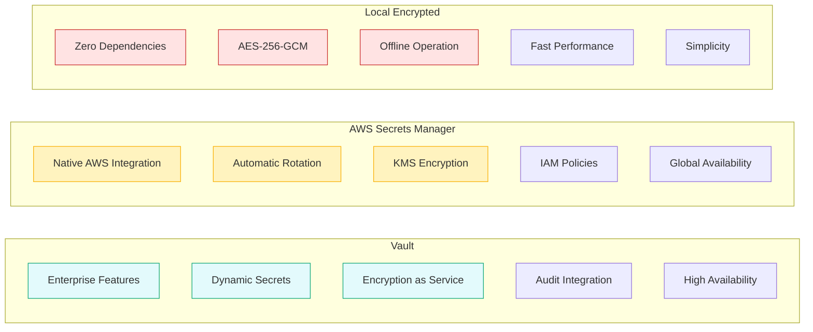
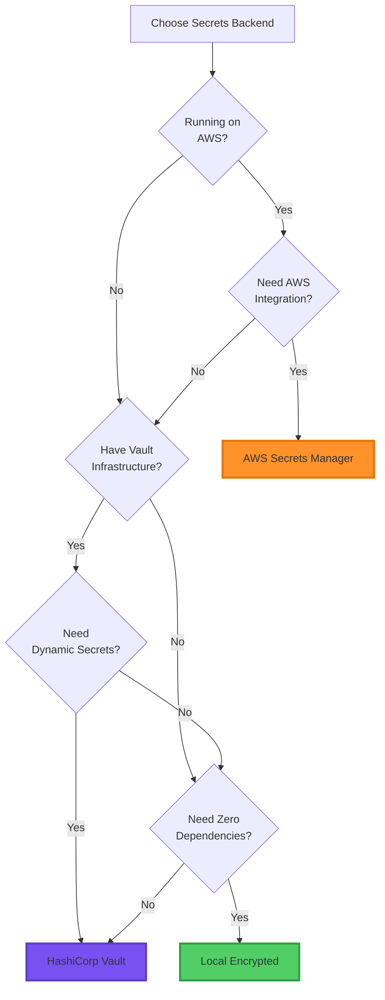
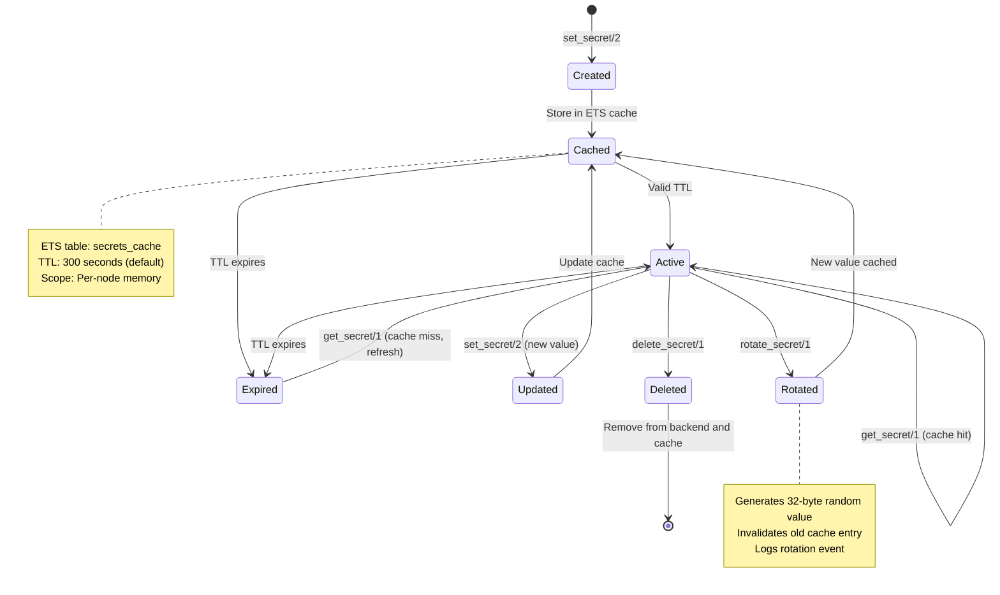
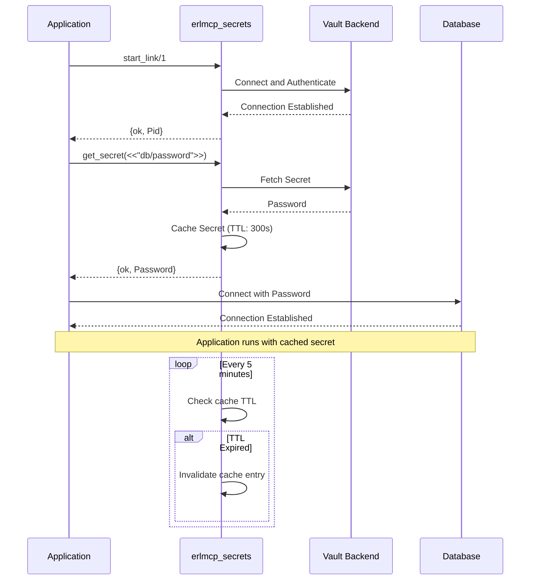
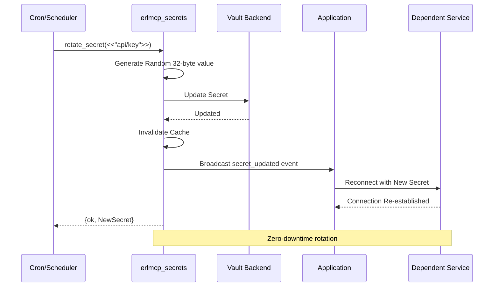
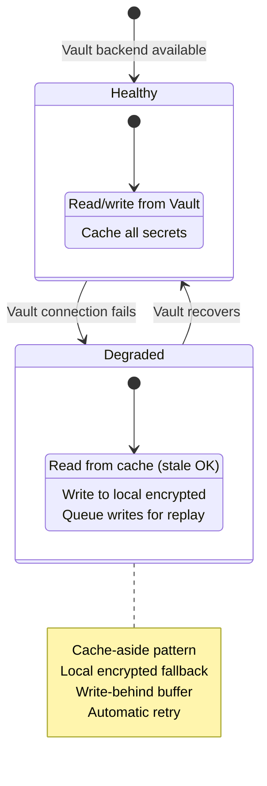
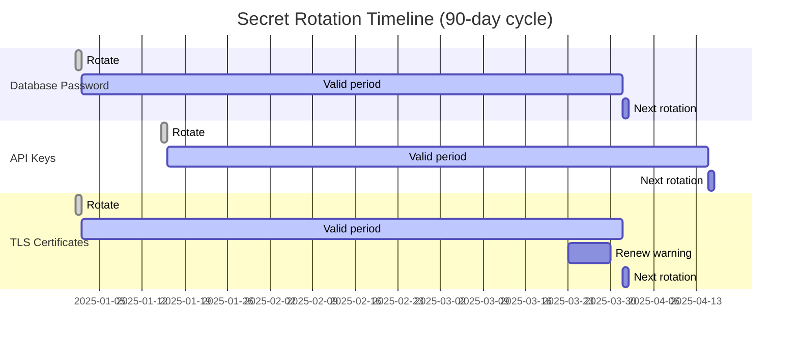

# Secrets Management Architecture - erlmcp

## Overview

erlmcp provides enterprise-grade secrets management with support for HashiCorp Vault, AWS Secrets Manager, and encrypted local storage. Secrets are cached in-memory with TTL for performance, encrypted at rest using AES-256-GCM, and all access is logged for compliance.

## Table of Contents

- [Architecture](#architecture)
- [Backend Comparison](#backend-comparison)
- [Encryption Details](#encryption-details)
- [Secret Lifecycle](#secret-lifecycle)
- [Caching Strategy](#caching-strategy)
- [Integration Patterns](#integration-patterns)
- [Security Best Practices](#security-best-practices)

## Architecture

### High-Level Components



### Request Flow



## Backend Comparison

### Feature Matrix



### Decision Tree



## Encryption Details

### Local Storage Encryption

```mermaid
graph TB
    subgraph "Encryption Flow"
        Secret[Plaintext Secret] --> Generate[Generate Random IV]
        Generate --> Derive[Derive Key from Master Key]
        Derive --> Encrypt[AES-256-GCM Encrypt]
        Encrypt --> Tag[Generate Auth Tag]
        Tag --> Store[Store: IV || Ciphertext || Tag]
    end

    subgraph "Decryption Flow"
        Stored[IV || Ciphertext || Tag] --> Parse[Parse Components]
        Parse --> Derive2[Derive Key from Master Key]
        Derive2 --> Decrypt[AES-256-GCM Decrypt]
        Decrypt --> Verify[Verify Auth Tag]
        Verify -->|Valid| Plaintext[Return Plaintext]
        Verify -->|Invalid| Error[Return Error: Tampering Detected]
    end

    subgraph "Key Management"
        EnvVar[Environment Variable<br/>ERLMCP_SECRET_KEY] --> Decode[Base64 Decode]
        File[Master Key File<br/>priv/secrets/master.key] --> Read[Read File]
        Decode --> MasterKey[Master Key]
        Read --> MasterKey
    end

    Derive --> MasterKey
    Derive2 --> MasterKey

    style Encrypt fill:#ffe3e3,stroke:#c92a2a,stroke-width:2px
    style Decrypt fill:#d3f9d8,stroke:#37b24d,stroke-width:2px
    style MasterKey fill:#ff6b6b,stroke:#c92a2a,stroke-width:3px
    style Error fill:#ff6b6b,stroke:#c92a2a,stroke-width:3px
```

### Security Properties

- **Algorithm**: AES-256-GCM (Galois/Counter Mode)
- **Key Size**: 256 bits
- **IV/Nonce**: 96 bits (randomly generated per encryption)
- **Auth Tag**: 128 bits (detects tampering)
- **Key Derivation**: PBKDF2 with SHA-256 (100,000 iterations)
- **Master Key Storage**: Environment variable or file (600 permissions)

## Secret Lifecycle

### State Machine



### Caching Strategy

```mermaid
graph TB
    subgraph "Cache Entry Structure"
        Entry[#secrets_cache record]
        Key[key: binary()]
        Value[value: binary()]
        InsertedAt[inserted_at: timestamp()]
        TTL[ttl: integer()]
        Hits[hits: integer()]
    end

    subgraph "Cache Operations"
        Read[Read Operation<br/>O(1) ETS lookup]
        Write[Write Operation<br/>O(1) ETS insert]
        Invalidate[Invalidate<br/>O(1) ETS delete]
        Cleanup[Cleanup Expired<br/>O(N) periodic scan]
    end

    subgraph "Cache Statistics"
        CacheHits[Cache Hits]
        CacheMisses[Cache Misses]
        HitRate[Hit Rate = Hits / (Hits + Misses)]
        AvgTTL[Average TTL]
    end

    Read --> Entry
    Write --> Entry
    Invalidate --> Entry
    Cleanup --> Entry

    Read --> CacheHits
    Read -.-> CacheMisses

    style Entry fill:#d0ebff,stroke:#1c7ed6,stroke-width:2px
    style Read fill:#d3f9d8,stroke:#37b24d,stroke-width:2px
    style Invalidate fill:#ffe3e3,stroke:#c92a2a,stroke-width:2px
```

## Integration Patterns

### Pattern 1: Application Startup



### Pattern 2: Secret Rotation



### Pattern 3: Graceful Degradation



## Security Best Practices

### 1. Access Control

```mermaid
graph TB
    subgraph "Principle of Least Privilege"
        App1[App 1: Database Client] -->|Read only| DBSecret[database/password]
        App2[App 2: API Server] -->|Read only| APIKey[api/key]
        Admin[Admin Console] -->|Read/Write| AllSecrets[All Secrets]
    end

    subgraph "Vault Policy (HCL)"
        Policy[path "secret/data/erlmcp/db/*" {
  capabilities = ["read"]
}

path "secret/data/erlmcp/api/*" {
  capabilities = ["read", "update"]
}

path "secret/data/erlmcp/admin/*" {
  capabilities = ["create", "read", "update", "delete"]
}]
    end

    App1 --> Policy
    App2 --> Policy
    Admin --> Policy

    style Admin fill:#ffe3e3,stroke:#c92a2a,stroke-width:2px
```

### 2. Audit Trail

```mermaid
sequenceDiagram
    participant App as Application
    participant Secrets as erlmcp_secrets
    participant Audit as Audit Log
    participant Alert as Alert System

    App->>Secrets: get_secret(<<"sensitive/data">>)

    Secrets->>Audit: Log access
    Note over Audit: {
  "timestamp": "2025-01-31T12:00:00Z",
  "event": "secret_access",
  "key": "sensitive/data",
  "user": "app1@node1",
  "result": "success",
  "cache_hit": false
}

    Audit->>Alert: Check for anomalies
    alt Unusual access pattern
        Alert-->>Secrets: Alert: Potential breach
        Secrets-->>App: {error, suspicious_activity}
    else Normal access
        Secrets-->>App: {ok, Secret}
    end
```

### 3. Secret Rotation Schedule



## Performance Considerations

### Cache Hit Rate Targets

```mermaid
graph LR
    subgraph "Performance Metrics"
        HitRate[Cache Hit Rate<br/>Target: >95%]
        Latency[p50 Latency<br/><1ms (cache hit)<br/>50-100ms (cache miss)]
        Throughput[Throughput<br/>10K ops/sec (cached)]
    end

    subgraph "Optimization Strategies"
        S1[Set appropriate TTL<br/>Longer TTL = Higher hit rate]
        S2[Prefetch critical secrets<br/>Load at startup]
        S3[Batch operations<br/>Fetch multiple secrets]
        S4[Local fallback<br/>Reduce backend calls]
    end

    HitRate --> S1
    HitRate --> S2
    Latency --> S3
    Latency --> S4
    Throughput --> S4

    style HitRate fill:#d3f9d8,stroke:#37b24d,stroke-width:2px
    style Latency fill:#d3f9d8,stroke:#37b24d,stroke-width:2px
    style Throughput fill:#d3f9d8,stroke:#37b24d,stroke-width:2px
```

## Configuration Examples

### Development (Local Encrypted)

```erlang
{erlmcp_secrets, [
    {backend, local_encrypted},
    {encryption_key, {env_var, "ERLMCP_SECRET_KEY"}},
    {storage_path, "priv/secrets/dev.enc"},
    {ttl_seconds, 60},  % Short TTL for dev
    {audit_enabled, true}
]}.
```

### Production (Vault with AppRole)

```erlang
{erlmcp_secrets, [
    {backend, vault},
    {backend_config, #{
        address => "https://vault.prod.example.com:8200",
        auth_method => approle,
        role_id => {env_var, "VAULT_ROLE_ID"},
        secret_id => {env_var, "VAULT_SECRET_ID"},
        engine => "kv-v2",
        mount => "secret"
    }},
    {ttl_seconds, 600},  % 10 minutes for prod
    {audit_enabled, true},
    {fallback_to_local, true},
    {storage_path, "priv/secrets/fallback.enc"}
]}.
```

### Production (AWS with IAM Role)

```erlang
{erlmcp_secrets, [
    {backend, aws_secrets_manager},
    {backend_config, #{
        region => "us-east-1",
        use_iam_role => true,
        prefix => "erlmcp/prod/",
        rotation_enabled => true
    }},
    {ttl_seconds, 600},
    {audit_enabled, true}
]}.
```

## Monitoring & Observability

### Key Metrics

```mermaid
graph TB
    subgraph "Performance Metrics"
        M1[Cache Hit Rate]
        M2[Backend Latency]
        M3[Cache Size]
        M4[TTL Distribution]
    end

    subgraph "Security Metrics"
        S1[Failed Access Attempts]
        S2[Secret Rotation Events]
        S3[Audit Log Volume]
        S4[Unauthorized Access Attempts]
    end

    subgraph "Health Metrics"
        H1[Backend Connection Status]
        H2[Cache Health]
        H3[Disk Usage (local backend)]
        H4[Master Key Status]
    end

    M1 --> Dashboard[Observability Dashboard]
    M2 --> Dashboard
    M3 --> Dashboard
    M4 --> Dashboard
    S1 --> Alerts[Alert System]
    S2 --> Alerts
    S3 --> Alerts
    S4 --> Alerts
    H1 --> HealthCheck[Health Check Endpoint]
    H2 --> HealthCheck
    H3 --> HealthCheck
    H4 --> HealthCheck

    style Dashboard fill:#d0ebff,stroke:#1c7ed6,stroke-width:2px
    style Alerts fill:#ffe3e3,stroke:#c92a2a,stroke-width:2px
    style HealthCheck fill:#d3f9d8,stroke:#37b24d,stroke-width:2px
```

## Troubleshooting

### Common Issues and Solutions

| Symptom | Root Cause | Solution |
|---------|------------|----------|
| `{error, connection_refused}` | Vault backend unreachable | Check network, verify Vault URL |
| `{error, unauthorized}` | Invalid credentials | Verify Vault token / AWS credentials |
| Stale secret returned | Cache not invalidated | Manual cache invalidation or reduce TTL |
| `{error, encryption_failed}` | Master key invalid | Verify ERLMCP_SECRET_KEY environment variable |
| High backend latency | Low cache hit rate | Increase TTL or implement prefetch |

## References

- [HashiCorp Vault Documentation](https://www.vaultproject.io/docs)
- [AWS Secrets Manager Documentation](https://docs.aws.amazon.com/secretsmanager/)
- [Erlang crypto Module](https://erlang.org/doc/man/crypto.html)
- [NIST AES Guidelines](https://csrc.nist.gov/publications/detail/fips/197/final)
- `/Users/sac/erlmcp/docs/SECRETS_MANAGEMENT.md` - Detailed configuration guide
- `/Users/sac/erlmcp/apps/erlmcp_core/src/erlmcp_secrets.erl` - Implementation
