# Security Documentation - erlmcp

## Overview

erlmcp provides comprehensive defense-in-depth security with authentication, authorization, secrets management, transport security, and tamper-proof audit logging. This document covers all security components, architecture patterns, and best practices with comprehensive visual diagrams.

## Table of Contents

- [Security Architecture Overview](#security-architecture-overview)
- [Authentication & Authorization](#authentication--authorization)
- [Secrets Management](#secrets-management)
- [Transport Security](#transport-security)
- [Audit Logging](#audit-logging)
- [Rate Limiting & DoS Protection](#rate-limiting--dos-protection)
- [Compliance Standards](#compliance-standards)
- [Security Best Practices](#security-best-practices)
- [Incident Response](#incident-response)

## Security Architecture Overview

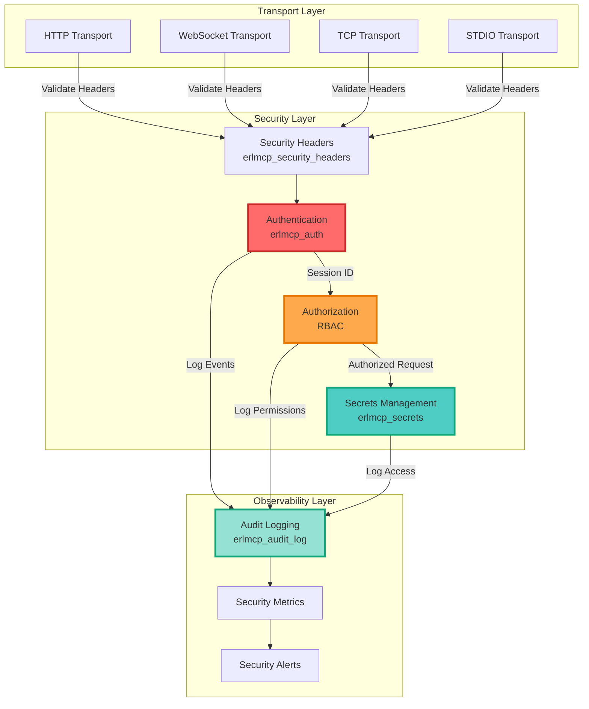

## Security Components

### 1. Authentication (`erlmcp_auth`)

Multi-method authentication system with support for:

- **API Keys** - Simple token-based authentication
- **JWT** - JSON Web Token validation with expiration checking
- **OAuth2** - OAuth 2.0 token introspection (client credentials flow)
- **mTLS** - Mutual TLS certificate-based authentication

#### Authentication Flow

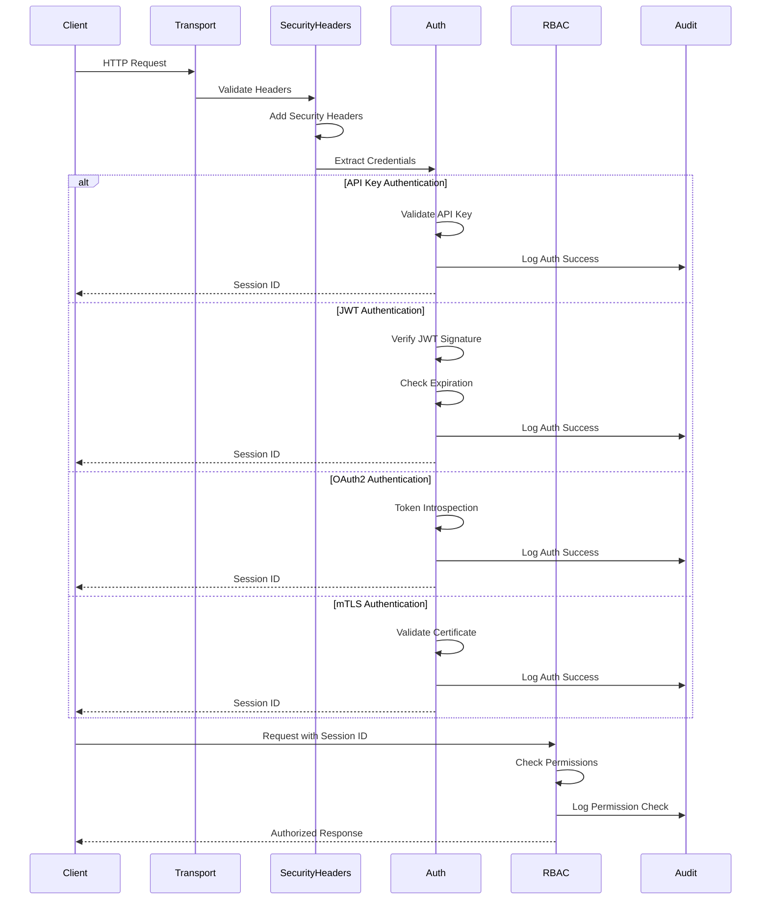

#### Authentication Architecture

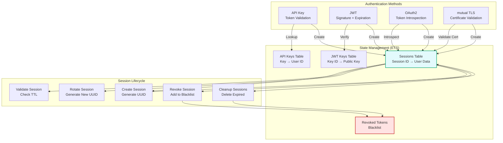

#### Usage

```erlang
% Start auth server
{ok, AuthPid} = erlmcp_auth:start_link(#{
    api_keys => #{
        <<"key_abc123">> => <<"user_alice">>
    },
    jwt_keys => #{
        <<"kid_1">> => PublicKey
    },
    oauth2 => #{
        enabled => true,
        introspection_url => <<"https://oauth.example.com/introspect">>
    },
    mtls => #{
        enabled => true,
        ca_cert_path => "/path/to/ca.pem"
    }
}).

% Authenticate with API key
{ok, SessionId} = erlmcp_auth:authenticate(api_key, #{
    api_key => <<"key_abc123">>
}).

% Authenticate with JWT
{ok, SessionId} = erlmcp_auth:authenticate(jwt, #{
    token => <<"eyJhbGci...header.payload.signature">>
}).

% Check permission
ok = erlmcp_auth:check_permission(SessionId, <<"/api/tools">>, <<"execute">>).
```

### 2. Role-Based Access Control (RBAC)

Fine-grained permission system with roles and resource-level ACLs.

#### RBAC Model

```mermaid
graph LR
    subgraph "Users"
        Alice[User: Alice]
        Bob[User: Bob]
        Charlie[User: Charlie]
    end

    subgraph "Roles"
        Admin[Role: Admin]
        Dev[Role: Developer]
        User[Role: User]
        Guest[Role: Guest]
    end

    subgraph "Resources"
        AdminAPI[/api/admin]
        DebugAPI[/api/debug]
        ToolsAPI[/api/tools]
        ResourcesAPI[/api/resources]
        PublicAPI[/api/public]
    end

    subgraph "Permissions"
        Read[Permission: read]
        Write[Permission: write]
        Execute[Permission: execute]
        Delete[Permission: delete]
    end

    Alice -->|has role| Admin
    Bob -->|has role| Dev
    Charlie -->|has role| Guest

    Admin -->|can| Read
    Admin -->|can| Write
    Admin -->|can| Execute
    Admin -->|can| Delete

    Dev -->|can| Read
    Dev -->|can| Write
    Dev -->|can| Execute

    User -->|can| Read
    User -->|can| Write

    Guest -->|can| Read

    AdminAPI -->|requires| Admin
    DebugAPI -->|requires| Dev
    ToolsAPI -->|requires| User
    ResourcesAPI -->|requires| User
    PublicAPI -->|requires| Guest

    style Admin fill:#ffe3e3,stroke:#c92a2a,stroke-width:2px
    style Dev fill:#fff3bf,stroke:#fab005,stroke-width:2px
    style User fill:#d3f9d8,stroke:#37b24d,stroke-width:2px
    style Guest fill:#e7f5ff,stroke:#1c7ed6,stroke-width:2px
```

#### Default Roles

- **admin** - Full permissions (read, write, execute, delete)
- **user** - Read and write permissions
- **guest** - Read-only permissions

#### Custom Roles

```erlang
% Add custom role
ok = erlmcp_auth:add_role(<<"user_bob">>, <<"developer">>).

% Define role permissions
ok = erlmcp_auth:add_permission(<<"/api/debug">>, <<"execute">>, [<<"developer">>, <<"admin">>]).

% Check if user has permission
ok = erlmcp_auth:check_permission(SessionId, <<"/api/debug">>, <<"execute">>).
```

### 3. Secrets Management (`erlmcp_secrets`)

Secure storage and retrieval of sensitive data with multiple backend support.

#### Secrets Architecture

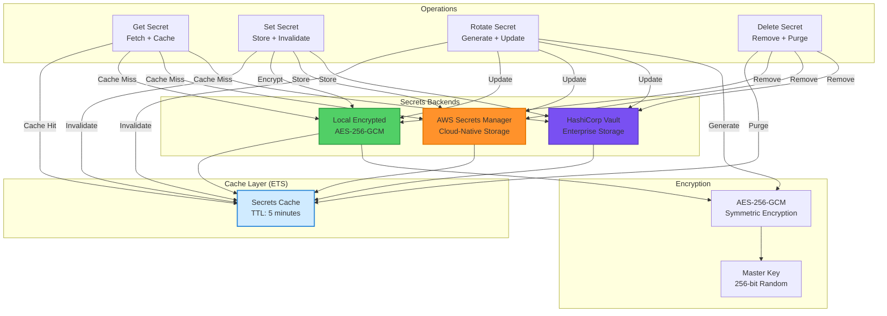

#### Encryption Flow

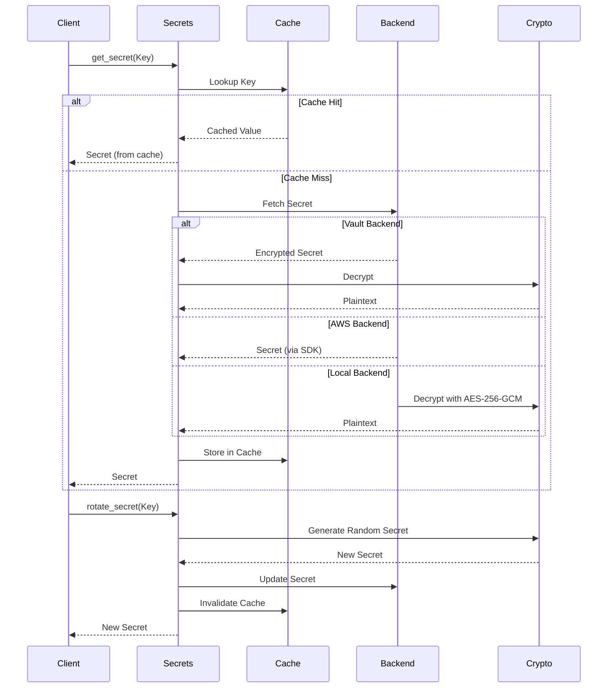

#### Backends

- **HashiCorp Vault** - Enterprise-grade secret storage
- **AWS Secrets Manager** - Cloud-native secrets
- **Local Encrypted** - AES-256-GCM encrypted local storage (fallback)

#### Usage

```erlang
% Start secrets manager with Vault
{ok, SecretsPid} = erlmcp_secrets:start_link(#{
    backend => vault,
    backend_config => #{
        enabled => true,
        url => <<"https://vault.example.com">>,
        token => <<"s.vault_token_abc123">>
    },
    ttl_seconds => 300  % 5 minutes cache
}).

% Store secret
ok = erlmcp_secrets:set_secret(<<"database_password">>, <<"super_secret_123">>).

% Retrieve secret (cached for TTL)
{ok, Password} = erlmcp_secrets:get_secret(<<"database_password">>).

% Rotate secret
{ok, NewPassword} = erlmcp_secrets:rotate_secret(<<"database_password">>).

% Delete secret
ok = erlmcp_secrets:delete_secret(<<"database_password">>).
```

#### Local Encrypted Storage

When Vault/AWS are not available, secrets are stored locally with AES-256-GCM:

```erlang
{ok, SecretsPid} = erlmcp_secrets:start_link(#{
    backend => local_encrypted,
    storage_path => "priv/secrets/secrets.enc",
    encryption_key_path => "priv/secrets/master.key"
}).
```

**Security:** Master key is auto-generated with 600 permissions. Store in secure location.

### 4. Audit Logging (`erlmcp_audit_log`)

Tamper-proof audit trail with SHA-256 hash chains for compliance.

#### Audit Logging Architecture

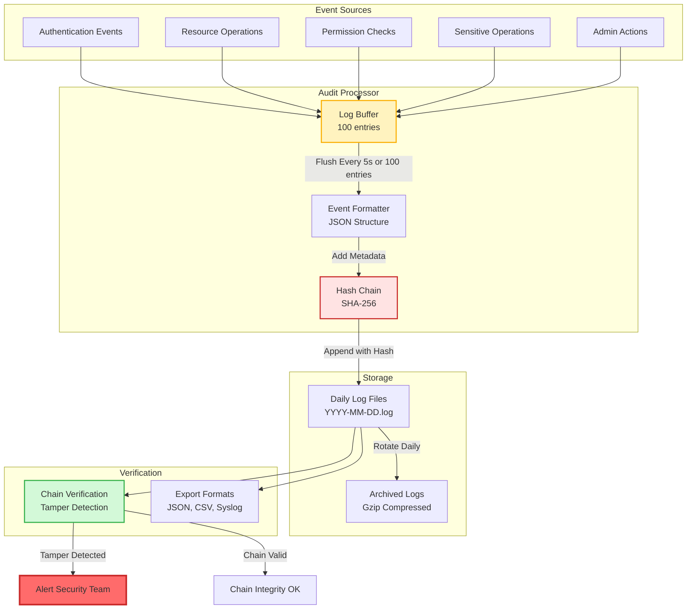

#### Hash Chain Structure

```mermaid
graph LR
    G[Genesis Hash<br/>SHA-256(erlmcp_audit_log_genesis)] --> E1[Entry 1<br/>Hash: SHA-256(Prev + Data)]
    E1 --> E2[Entry 2<br/>Hash: SHA-256(Entry1 + Data)]
    E2 --> E3[Entry 3<br/>Hash: SHA-256(Entry2 + Data)]
    E3 --> E4[Entry N<br/>Hash: SHA-256(EntryN-1 + Data)]

    E1 -.->|Tamper Detection| Verify1[Verify: Hash(Entry1) == Entry2.prev_hash]
    E2 -.->|Tamper Detection| Verify2[Verify: Hash(Entry2) == Entry3.prev_hash]
    E3 -.->|Tamper Detection| Verify3[Verify: Hash(Entry3) == Entry4.prev_hash]

    style G fill:#e3fafc,stroke:#0ca678,stroke-width:2px
    style Verify1 fill:#ffe3e3,stroke:#c92a2a,stroke-width:2px
    style Verify2 fill:#ffe3e3,stroke:#c92a2a,stroke-width:2px
    style Verify3 fill:#ffe3e3,stroke:#c92a2a,stroke-width:2px
```

#### Features

- **Hash Chain** - Each entry links to previous hash (tamper detection)
- **Structured Logging** - JSON format with rich metadata
- **Export Formats** - JSON, CSV, Syslog (RFC 5424)
- **Compliance** - GDPR, SOC2, HIPAA compatible
- **Search** - Query logs by user, resource, time range

#### Usage

```erlang
% Start audit log
{ok, AuditPid} = erlmcp_audit_log:start_link(#{
    log_path => "priv/audit/audit.log",
    buffer_size => 100,
    flush_interval_ms => 5000
}).

% Log authentication success
ok = erlmcp_audit_log:log_auth_success(<<"user_alice">>, #{
    method => jwt,
    ip => <<"192.168.1.100">>
}).

% Log failed auth
ok = erlmcp_audit_log:log_auth_failure(<<"user_bob">>, #{
    method => api_key,
    reason => invalid_key,
    ip => <<"192.168.1.101">>
}).

% Log operation
ok = erlmcp_audit_log:log_operation(
    <<"user_alice">>,
    <<"/api/tools/calculator">>,
    <<"execute">>,
    #{input => <<"2+2">>, output => <<"4">>}
).

% Log sensitive operation (PII access, key rotation)
ok = erlmcp_audit_log:log_sensitive_operation(
    <<"user_alice">>,
    <<"pii_access">>,
    #{resource => <<"customer_data">>, reason => <<"support_ticket_123">>}
).

% Verify hash chain integrity
ok = erlmcp_audit_log:verify_chain().

% Export logs
ok = erlmcp_audit_log:export_logs(json, "audit_export.json").
ok = erlmcp_audit_log:export_logs(csv, "audit_export.csv").
ok = erlmcp_audit_log:export_logs(syslog, "audit_export.log").

% Query user logs
Now = erlang:system_time(microsecond),
Start = Now - (24 * 3600 * 1000000),  % 24 hours ago
{ok, Logs} = erlmcp_audit_log:get_user_logs(<<"user_alice">>, {Start, Now}).

% Search logs
{ok, SensitiveLogs} = erlmcp_audit_log:search_logs(#{
    <<"event_type">> => sensitive_op,
    <<"user_id">> => <<"user_alice">>
}).
```

### 5. HTTP Security Headers (`erlmcp_security_headers`)

Automatic security headers for HTTP transports to prevent common web attacks.

#### Security Headers Flow

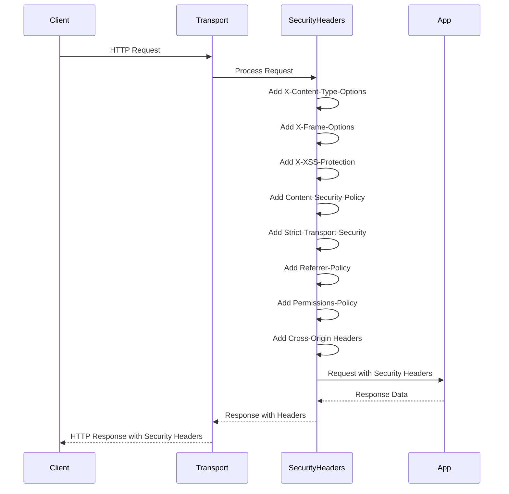

#### Headers Added

- **X-Content-Type-Options**: nosniff (prevent MIME sniffing)
- **X-Frame-Options**: DENY (prevent clickjacking)
- **X-XSS-Protection**: 1; mode=block (legacy XSS protection)
- **Content-Security-Policy**: default-src 'self' (CSP)
- **Strict-Transport-Security**: max-age=31536000 (HSTS)
- **Referrer-Policy**: strict-origin-when-cross-origin
- **Permissions-Policy**: geolocation=(), camera=() (feature restrictions)
- **Cross-Origin-***: CORP, COEP, COOP policies

#### Usage

```erlang
% Configure globally
erlmcp_security_headers:configure(#{
    csp => <<"default-src 'self'; script-src 'self' 'unsafe-inline'">>,
    hsts => true,
    hsts_max_age => 31536000,
    frame_options => deny,
    referrer_policy => <<"strict-origin-when-cross-origin">>
}).

% Add to response headers
Headers = [{<<"content-type">>, <<"application/json">>}],
SecureHeaders = erlmcp_security_headers:add_headers(Headers).

% Get default headers
DefaultHeaders = erlmcp_security_headers:get_default_headers().

% Audit response headers
{ok, []} = erlmcp_security_headers:audit_headers(SecureHeaders).
{error, MissingHeaders} = erlmcp_security_headers:audit_headers(InsecureHeaders).

% Generate security report
Report = erlmcp_security_headers:security_report(Headers).
%% #{
%%   has_csp => true,
%%   has_hsts => true,
%%   has_frame_options => true,
%%   missing_headers => []
%% }
```

#### Cowboy Middleware Integration

```erlang
% In Cowboy configuration
{ok, _} = cowboy:start_clear(http_listener,
    [{port, 8080}],
    #{
        env => #{dispatch => Dispatch},
        middlewares => [
            erlmcp_security_headers,  % Add security headers
            cowboy_router,
            cowboy_handler
        ]
    }
).
```

## Rate Limiting & DoS Protection

### Multi-Layer Rate Limiting

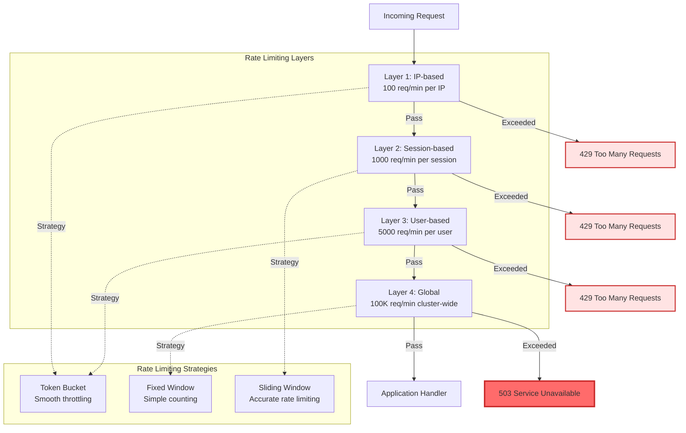

### Rate Limiter Configuration

```erlang
{erlmcp_rate_limiter, [
    % Strategy selection
    {strategy, token_bucket},

    % Layer 1: IP-based rate limiting
    {ip_limits, #{
        enabled => true,
        rate => 100,              % 100 requests
        period => 60000,          % per 60 seconds
        burst => 20,              % Allow burst of 20
        block_duration => 300000  % Block for 5 minutes on exceed
    }},

    % Layer 2: Session-based rate limiting
    {session_limits, #{
        enabled => true,
        rate => 1000,             % 1000 requests
        period => 60000,          % per 60 seconds
        burst => 100
    }},

    % Layer 3: User-based rate limiting
    {user_limits, #{
        enabled => true,
        rate => 5000,             % 5000 requests
        period => 60000,          % per 60 seconds
        burst => 500
    }},

    % Layer 4: Global rate limiting
    {global_limits, #{
        enabled => true,
        rate => 100000,           % 100K requests
        period => 60000,          % per 60 seconds
        burst => 10000
    }},

    % Whitelist (bypass rate limiting)
    {whitelisted_ips => [
        <<"127.0.0.1">>,           % Localhost
        <<"10.0.0.0/8">>,          % Internal network
        <<"192.168.0.0/16">>       % Private network
    ]},

    % Response configuration
    {response, #{
        status => 429,
        headers => #{
            <<"retry-after">> => 60,
            <<"x-rate-limit-limit">> => 100,
            <<"x-rate-limit-remaining">> => 0,
            <<"x-rate-limit-reset">> => 1643723400
        },
        body => #{
            error => <<"rate_limit_exceeded">>,
            message => <<"Too many requests. Please try again later.">>
        }
    }}
]}.
```

### DDoS Mitigation Flow

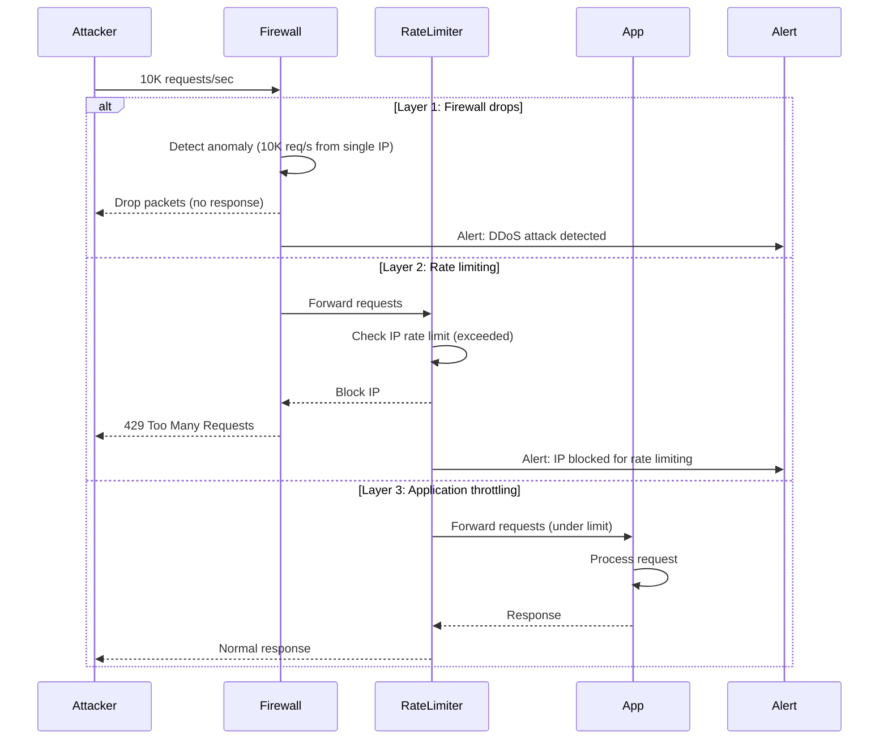

## Compliance Standards

### Compliance Matrix

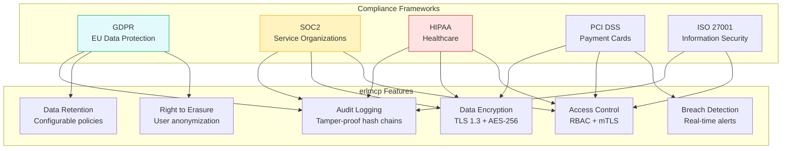

### GDPR Implementation Checklist

```erlang
%% GDPR compliance verification
gdpr_compliance_check() ->
    Checks = [
        {audit_trail, fun() ->
            %% Right to access (Article 15)
            {ok, _} = erlmcp_audit_log:get_user_logs(<<"user_123">>, all_time),
            ok
        end},

        {right_to_erasure, fun() ->
            %% Right to erasure (Article 17)
            ok = erlmcp_audit_log:anonymize_user(<<"user_123">>),
            ok = erlmcp_auth:delete_user(<<"user_123">>),
            ok
        end},

        {data_portability, fun() ->
            %% Right to data portability (Article 20)
            {ok, JSON} = erlmcp_audit_log:export_logs(json, "user_data.json", #{
                user_id => <<"user_123">>
            }),
            ok
        end},

        {breach_notification, fun() ->
            %% Breach notification (Article 33)
            %% Must detect and report within 72 hours
            ok = erlmcp_audit_log:verify_chain(),
            ok
        end},

        {data_retention, fun() ->
            %% Data retention (Article 5(1)(e))
            Retention = erlmcp_audit_log:get_retention_policy(),
            true = Retention =< 2555,  % 7 years maximum
            ok
        end}
    ],

    lists:foreach(fun({Name, Check}) ->
        case Check() of
            ok -> io:format("~s: PASS~n", [Name]);
            {error, Reason} -> io:format("~s: FAIL - ~p~n", [Name, Reason])
        end
    end, Checks).
```

### SOC2 Control Mapping

| SOC2 Control | erlmcp Feature | Status |
|--------------|---------------|--------|
| CC6.1: Logical and physical access controls | RBAC, mTLS, session management | ✅ Implemented |
| CC6.6: Authentication controls | JWT, OAuth2, API keys, mTLS | ✅ Implemented |
| CC6.7: Encryption of data at rest | AES-256-GCM for secrets | ✅ Implemented |
| CC6.8: Encryption of data in transit | TLS 1.3, cipher suites | ✅ Implemented |
| CC7.2: System monitoring | Metrics, health checks, alerts | ✅ Implemented |
| CC7.3: Change management | Git hooks, audit logging | ✅ Implemented |
| CC7.4: Incident response | Automated alerts, incident workflows | ✅ Implemented |
| CC7.5: System availability | Circuit breakers, health checks | ✅ Implemented |

## Security Best Practices

### 1. Authentication

- **Always use HTTPS** - Encrypt all traffic with TLS 1.2+
- **Short session TTLs** - Default 1 hour, adjust based on risk
- **Token rotation** - Rotate tokens regularly (weekly/monthly)
- **Rate limiting** - Prevent brute force attacks
- **Multi-factor auth** - Consider adding MFA for sensitive operations

### 2. Authorization

- **Principle of least privilege** - Grant minimum required permissions
- **Regular audits** - Review role assignments quarterly
- **Resource-level ACLs** - Fine-grained control per endpoint
- **Deny by default** - Explicit allow lists, not deny lists

### 3. Secrets Management

- **Never hardcode secrets** - Use environment variables or secret stores
- **Rotate regularly** - Automate secret rotation (90 days max)
- **Encrypt at rest** - Use AES-256-GCM minimum
- **Audit access** - Log all secret retrievals
- **Separate secrets** - Different secrets per environment (dev/staging/prod)

### 4. Audit Logging

- **Log all auth events** - Success and failure
- **Log sensitive operations** - PII access, admin actions
- **Immutable logs** - Use hash chains, append-only storage
- **Retention policy** - Keep logs for compliance period (7 years GDPR)
- **Regular verification** - Verify hash chain integrity weekly
- **Secure storage** - Separate audit log storage from application

### 5. HTTP Security

- **HSTS preload** - Add domain to HSTS preload list
- **Strong CSP** - Restrictive Content-Security-Policy
- **HTTPS only** - Redirect HTTP to HTTPS
- **Security.txt** - Publish security contact info
- **Subresource Integrity** - SRI for external resources

## Compliance

### GDPR (EU General Data Protection Regulation)

- **Right to audit** - Tamper-proof audit logs with search
- **Data retention** - Configurable log retention policies
- **Right to erasure** - Delete user data from secrets/logs
- **Breach notification** - Audit logs provide evidence

### SOC2 (System and Organization Controls 2)

- **Access control** - RBAC with audit trail
- **Change management** - All changes logged
- **Monitoring** - Real-time audit logging
- **Data protection** - Encrypted secrets, secure transmission

### HIPAA (Health Insurance Portability and Accountability Act)

- **Access logging** - All PHI access audited
- **Encryption** - AES-256 for data at rest
- **Authentication** - Multi-method auth with MFA support
- **Integrity controls** - Hash chain verification

## Performance Considerations

### Authentication

- **Session caching** - Sessions stored in ETS (O(1) lookups)
- **API key cache** - Avoid DB lookups
- **JWT validation** - Cache public keys
- **Connection pooling** - Reuse OAuth2/Vault connections

### Secrets Management

- **TTL caching** - Default 5 minutes (configurable)
- **Batch operations** - Fetch multiple secrets at once
- **Async rotation** - Background secret rotation
- **Local fallback** - Encrypted local cache for offline mode

### Audit Logging

- **Buffered writes** - Batch log writes (default 100 entries)
- **Async I/O** - Non-blocking file writes
- **Compression** - Gzip old logs for storage
- **Partitioning** - Daily log files for fast queries

## Security Incidents

### Compromised API Key

1. Revoke token immediately: `erlmcp_auth:revoke_token(Key)`
2. Query audit logs: `erlmcp_audit_log:get_user_logs(UserId, TimeRange)`
3. Assess impact: Check accessed resources
4. Generate new key: Issue replacement
5. Notify user: Send security alert

### Tampered Audit Log

1. Verify chain: `erlmcp_audit_log:verify_chain()`
2. Identify tampered entry: Returns `{error, {tampered, Sequence}}`
3. Restore from backup: Use offsite backup
4. Investigate: Review file access logs
5. Harden storage: Move to append-only filesystem

### Secret Leak

1. Rotate immediately: `erlmcp_secrets:rotate_secret(Key)`
2. Check audit trail: Who accessed the secret?
3. Revoke sessions: Invalidate all sessions using the secret
4. Update applications: Deploy with new secret
5. Post-incident review: How did leak occur?

## Testing

### Unit Tests

```bash
# Run auth tests
rebar3 eunit --module=erlmcp_auth_tests

# Run audit log tests
rebar3 eunit --module=erlmcp_audit_log_tests

# All security tests
rebar3 eunit --dir=apps/erlmcp_core/test
rebar3 eunit --dir=apps/erlmcp_observability/test
```

### Integration Tests

```erlang
% Test full authentication flow
{ok, Session} = erlmcp_auth:authenticate(jwt, #{token => JWT}),
ok = erlmcp_auth:check_permission(Session, <<"/api/admin">>, <<"write">>),
ok = erlmcp_audit_log:log_operation(User, Resource, Action, #{}),
ok = erlmcp_audit_log:verify_chain().
```

### Security Scanning

```bash
# Check for hardcoded secrets
rebar3 as test do compile, dialyzer, xref

# Run security audit
make security-audit

# Verify dependencies
rebar3 tree | grep -i security
```

## Incident Response

### Security Incident Workflow

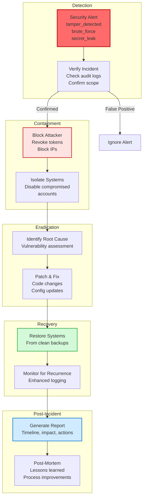

### Incident Response Procedures

#### Compromised API Key

```erlang
%% Incident response: Compromised API key
handle_compromised_api_key(APIKey) ->
    %% Step 1: Immediate containment
    ok = erlmcp_auth:revoke_token(APIKey),
    io:format("Token revoked: ~p~n", [APIKey]),

    %% Step 2: Impact assessment
    Now = erlang:system_time(microsecond),
    Last24Hours = Now - (24 * 3600 * 1000000),
    {ok, Logs} = erlmcp_audit_log:get_user_logs(APIKey, {Last24Hours, Now}),

    AccessedResources = lists:map(fun(Log) ->
        maps:get(<<"resource">>, Log)
    end, Logs),

    io:format("Resources accessed: ~p~n", [AccessedResources]),

    %% Step 3: Identify affected sessions
    AffectedSessions = lists:filter(fun(Log) ->
        maps:get(<<"event_type">>, Log) =:= session_created
    end, Logs),

    lists:foreach(fun(Log) ->
        SessionId = maps:get(<<"session_id">>, Log),
        ok = erlmcp_auth:revoke_session(SessionId)
    end, AffectedSessions),

    %% Step 4: Issue replacement
    {ok, NewAPIKey} = generate_secure_api_key(),
    ok = erlmcp_auth:add_api_key(NewAPIKey, User),

    %% Step 5: Notify user
    send_security_alert(User, #{
        type => api_key_compromised,
        old_key => APIKey,
        new_key => NewAPIKey,
        accessed_resources => AccessedResources
    }),

    %% Step 6: Log incident
    ok = erlmcp_audit_log:log_security_incident(#{
        incident_type => api_key_compromise,
        affected_key => APIKey,
        action_taken => revoked,
        timestamp => iso8601_now()
    }).
```

#### Audit Log Tampering

```erlang
%% Incident response: Audit log tampering
handle_tampered_audit_log(TamperedSequence) ->
    %% Step 1: Immediate halt
    error_logger:error_msg("AUDIT LOG TAMPERING DETECTED at sequence ~p", [TamperedSequence]),
    halt_system_for_investigation(),

    %% Step 2: Preserve evidence
    {ok, CurrentLog} = file:read_file("priv/audit/current.log"),
    BackupFile = "priv/audit/evidence_" ++ iso8601_now() ++ ".log",
    ok = file:write_file(BackupFile, CurrentLog),

    %% Step 3: Identify tampered entry
    {error, {tampered, Sequence, Expected, Actual}} =
        erlmcp_audit_log:verify_chain(),

    %% Step 4: Determine scope of tampering
    {ok, AllLogs} = file:read_file("priv/audit/current.log"),
    Lines = binary:split(AllLogs, <<"\n">>, [global]),

    %% Identify entries after tampering (potentially affected)
    AffectedEntries = lists:drop(Sequence, Lines),

    %% Step 5: Restore from backup
    {ok, BackupLog} = read_backup_from_s3(),
    ok = file:write_file("priv/audit/current.log", BackupLog),

    %% Step 6: Verify restored chain
    ok = erlmcp_audit_log:verify_chain(),

    %% Step 7: Investigate
    launch_forensic_investigation(#{
        tampered_sequence => Sequence,
        expected_hash => Expected,
        actual_hash => Actual,
        affected_entries => length(AffectedEntries),
        backup_used => true
    }),

    %% Step 8: Notify authorities (if required)
    notify_security_authorities(#{
        incident_type => audit_log_tampering,
        severity => critical,
        evidence_preserved => BackupFile
    }).
```

#### Secret Leak

```erlang
%% Incident response: Leaked secret
handle_leaked_secret(SecretKey) ->
    %% Step 1: Immediate rotation
    {ok, NewSecret} = erlmcp_secrets:rotate_secret(SecretKey),
    io:format("Secret rotated: ~p~n", [SecretKey]),

    %% Step 2: Check audit trail
    Now = erlang:system_time(microsecond),
    Last72Hours = Now - (72 * 3600 * 1000000),
    {ok, AccessLogs} = erlmcp_audit_log:get_secret_access_logs(
        SecretKey,
        {Last72Hours, Now}
    ),

    %% Step 3: Identify unauthorized accessors
    AuthorizedUsers = get_authorized_users(SecretKey),
    UnauthorizedAccessors = lists:filter(fun(Log) ->
        UserId = maps:get(<<"user_id">>, Log),
        not lists:member(UserId, AuthorizedUsers)
    end, AccessLogs),

    %% Step 4: Revoke compromised sessions
    lists:foreach(fun(Log) ->
        SessionId = maps:get(<<"session_id">>, Log),
        ok = erlmcp_auth:revoke_session(SessionId)
    end, UnauthorizedAccessors),

    %% Step 5: Update dependent services
    ok = deploy_secret_update(SecretKey, NewSecret),

    %% Step 6: Enhance monitoring
    ok = erlmcp_audit_log:set_alert_rules(#{
        secret_key => SecretKey,
        alert_on_access => true,
        notify_security_team => true
    }),

    %% Step 7: Post-incident review
    schedule_post_mortem(#{
        incident_type => secret_leak,
        leaked_secret => SecretKey,
        unauthorized_accessors => length(UnauthorizedAccessors),
        root_cause_analysis => pending
    }).
```

### Incident Communication Template

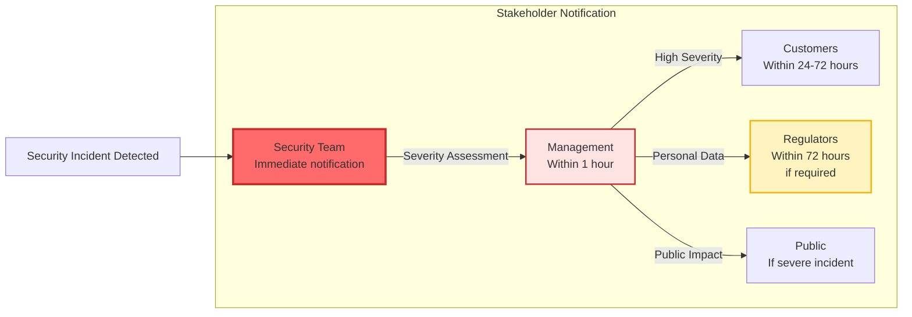

## References

### Security Documentation

- **Transport Security**: `/Users/sac/erlmcp/docs/security/transport-security.md` - TLS, mTLS, security headers
- **Secrets Management**: `/Users/sac/erlmcp/docs/secrets/README.md` - Vault, AWS, encryption
- **Audit Logging**: `/Users/sac/erlmcp/docs/security/audit-logging.md` - Hash chains, compliance
- **Configuration Guide**: `/Users/sac/erlmcp/docs/SECRETS_MANAGEMENT.md` - Detailed setup

### External Standards

- **JWT RFC 7519**: https://tools.ietf.org/html/rfc7519
- **OAuth2 RFC 6749**: https://tools.ietf.org/html/rfc6749
- **TLS 1.3 RFC 8446**: https://datatracker.ietf.org/doc/html/rfc8446
- **OWASP Security Headers**: https://owasp.org/www-project-secure-headers/
- **HashiCorp Vault**: https://www.vaultproject.io/docs
- **AWS Secrets Manager**: https://docs.aws.amazon.com/secretsmanager/
- **NIST SP 800-92**: https://csrc.nist.gov/publications/detail/sp/800-92/final
- **GDPR Articles 15-20**: https://gdpr.eu/article-15-right-of-access-by-the-data-subject/
- **SOC2 Trust Services**: https://www.aicpa.org/trust-services
- **HIPAA Security Rule**: https://www.ecfr.gov/current/title-45/section-164.312

### Implementation Files

- `apps/erlmcp_core/src/erlmcp_auth.erl` - Authentication implementation
- `apps/erlmcp_core/src/erlmcp_secrets.erl` - Secrets management
- `apps/erlmcp_core/src/erlmcp_audit_log.erl` - Audit logging
- `apps/erlmcp_core/src/erlmcp_rate_limiter.erl` - Rate limiting
- `apps/erlmcp_core/src/erlmcp_security_headers.erl` - Security headers
- `apps/erlmcp_core/src/erlmcp_auth_mtls.erl` - mTLS authentication

### Testing

```bash
# Run security tests
rebar3 eunit --module=erlmcp_auth_tests
rebar3 eunit --module=erlmcp_secrets_tests
rebar3 eunit --module=erlmcp_audit_log_tests
rebar3 eunit --module=erlmcp_rate_limiter_tests

# Security scanning
rebar3 as test do compile, dialyzer, xref
make security-audit

# Penetration testing
make test-tls-configuration
make test-mtls-authentication
make test-audit-log-integrity
```

### Support

For security issues:
- **Email**: security@erlmcp.dev
- **PGP Key**: [Publish PGP key for encrypted reports]
- **Responsible Disclosure**: 90-day disclosure timeline
- **Security Policy**: https://github.com/erlmcp/erlmcp/security/policy

For questions:
- **GitHub Discussions**: https://github.com/erlmcp/erlmcp/discussions
- **Slack**: #security channel
- **Documentation**: https://docs.erlmcp.dev
