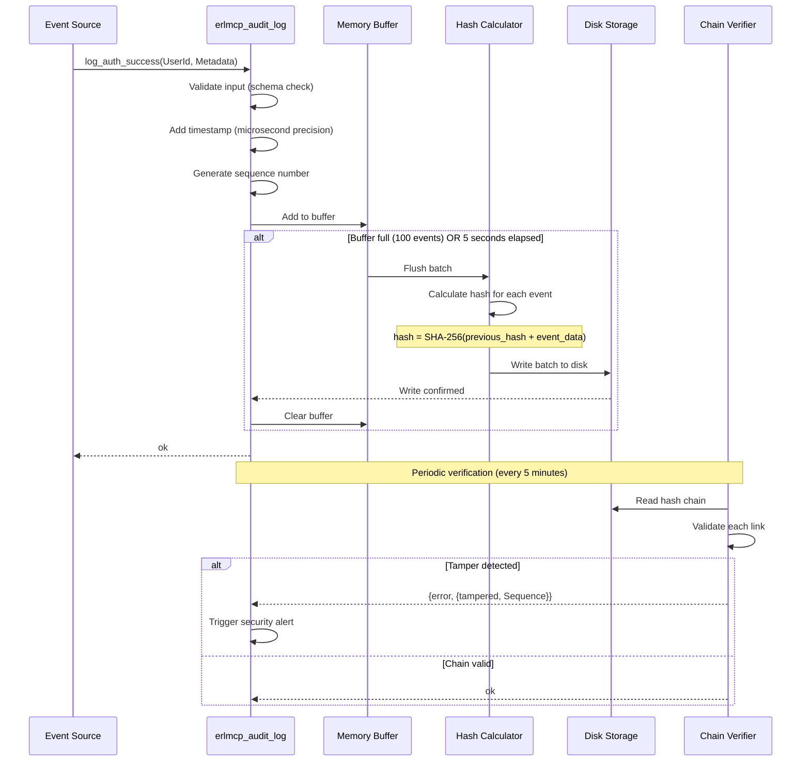
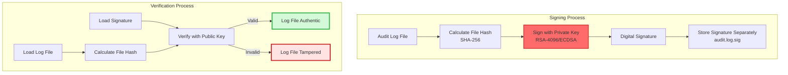
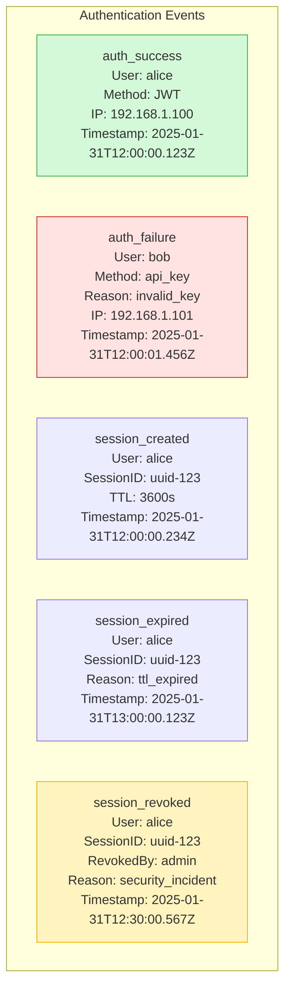
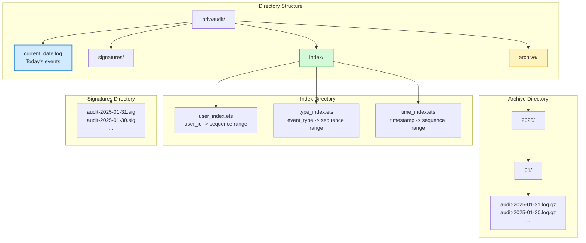
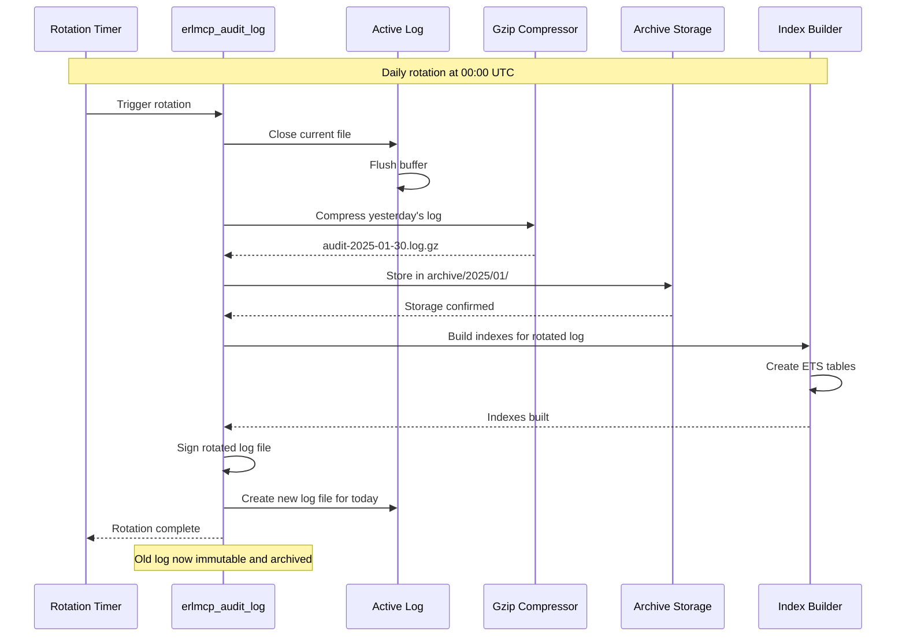
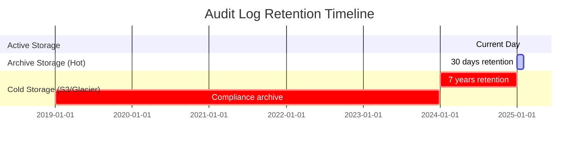
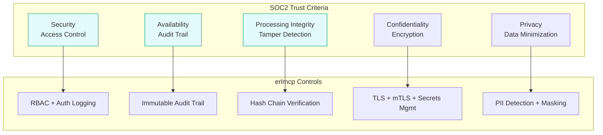
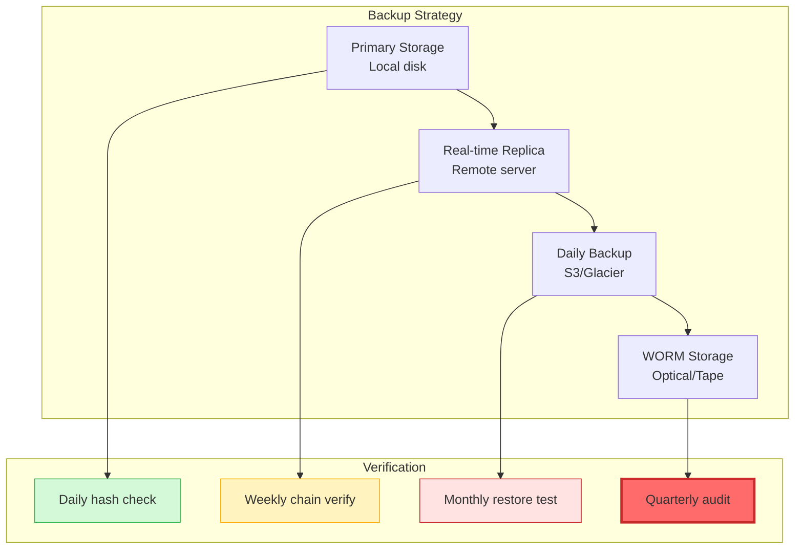

# Audit Logging - erlmcp

## Overview

erlmcp provides tamper-proof audit logging with cryptographic hash chains, ensuring the integrity and immutability of all security-relevant events. This document covers the audit logging architecture, hash chain verification, compliance features, and best practices.

## Table of Contents

- [Architecture](#architecture)
- [Hash Chain Integrity](#hash-chain-integrity)
- [Event Types](#event-types)
- [Storage Strategy](#storage-strategy)
- [Query & Export](#query--export)
- [Compliance](#compliance)
- [Monitoring & Alerting](#monitoring--alerting)

## Architecture

### Audit Logging Pipeline

```mermaid
graph TB
    subgraph "Event Sources"
        Auth[erlmcp_auth<br/>Authentication Events]
        Server[erlmcp_server<br/>Resource Operations]
        Secrets[erlmcp_secrets<br/>Secret Access]
        Admin[Admin Operations<br/>Configuration Changes]
        Transport[Transport Layer<br/>Connection Events]
    end

    subgraph "Audit Processor (erlmcp_audit_log)"
        Buffer[Event Buffer<br/>100 entries]
        Formatter[JSON Formatter<br/>Structured Metadata]
        Hasher[Hash Calculator<br/>SHA-256]
        Validator[Event Validator<br/>Schema Check]
    end

    subgraph "Storage Layer"
        Active[Active Log File<br/>current_date.log]
        Archive[Archive<br/>Gzip Compressed]
        Cold[Cold Storage<br/>S3/Glacier/Azure]
    end

    subgraph "Integrity Verification"
        Chain[Hash Chain<br/>Cryptographic Links]
        Verify[Chain Verifier<br/>Tamper Detection]
        Sign[Digital Signature<br/>HMAC/RSA]
    end

    Auth --> Buffer
    Server --> Buffer
    Secrets --> Buffer
    Admin --> Buffer
    Transport --> Buffer

    Buffer -->|Batch flush (5s or 100 events)| Formatter
    Formatter --> Validator
    Validator --> Hasher
    Hasher --> Chain
    Chain --> Active

    Active -->|Daily rotation| Archive
    Archive -->|Age > 30 days| Cold

    Active --> Verify
    Archive --> Verify

    Verify -->|Tamper detected| Alert[Security Alert]
    Verify -->|Chain valid| OK[Log Integrity OK]

    style Hasher fill:#ff6b6b,stroke:#c92a2a,stroke-width:3px
    style Verify fill:#d3f9d8,stroke:#37b24d,stroke-width:2px
    style Alert fill:#ffe3e3,stroke:#c92a2a,stroke-width:3px
```

### Event Flow Sequence



## Hash Chain Integrity

### Cryptographic Structure

```mermaid
graph LR
    subgraph "Hash Chain (Tamper-Evident)"
        G[Genesis Hash<br/>SHA-256("erlmcp_audit_genesis")] --> E1[Event 1<br/>hash₁ = SHA-256(G + data₁)]
        E1 --> E2[Event 2<br/>hash₂ = SHA-256(hash₁ + data₂)]
        E2 --> E3[Event 3<br/>hash₃ = SHA-256(hash₂ + data₃)]
        E3 --> E4[Event N<br/>hashₙ = SHA-256(hashₙ₋₁ + dataₙ)]
    end

    subgraph "Verification Process"
        V1[Verify event 1:<br/>hash₁ == SHA-256(G + data₁)]
        V2[Verify event 2:<br/>hash₂ == SHA-256(hash₁ + data₂)]
        V3[Verify event 3:<br/>hash₃ == SHA-256(hash₂ + data₃)]
    end

    E1 -.->|Tamper detection| V1
    E2 -.->|Tamper detection| V2
    E3 -.->|Tamper detection| V3

    style G fill:#e3fafc,stroke:#0ca678,stroke-width:2px
    style V1 fill:#ffe3e3,stroke:#c92a2a,stroke-width:2px
    style V2 fill:#ffe3e3,stroke:#c92a2a,stroke-width:2px
    style V3 fill:#ffe3e3,stroke:#c92a2a,stroke-width:2px
```

### Hash Chain Algorithm

```erlang
%% Calculate hash for new event
calculate_hash(PreviousHash, EventData) ->
    %% PreviousHash: SHA-256 hash of previous event
    %% EventData: JSON-encoded event data
    crypto:hash(sha256, <<PreviousHash/binary, EventData/binary>>).

%% Verify hash chain integrity
verify_chain(LogFile) ->
    {ok, Events} = file:read_file(LogFile),
    Lines = binary:split(Events, <<"\n">>, [global]),

    Genesis = crypto:hash(sha256, <<"erlmcp_audit_genesis">>),
    verify_lines(Lines, Genesis, 1).

verify_lines([], _CurrentHash, _Seq) ->
    ok;
verify_lines([Line | Rest], CurrentHash, Seq) ->
    Event = jsx:decode(Line),
    ExpectedHash = maps:get(<<"hash">>, Event),
    EventData = maps:remove(<<"hash">>, Event),
    CalculatedHash = calculate_hash(CurrentHash, jsx:encode(EventData)),

    case ExpectedHash of
        CalculatedHash ->
            NextHash = maps:get(<<"hash">>, Event),
            verify_lines(Rest, NextHash, Seq + 1);
        _ ->
            {error, {tampered, Seq, ExpectedHash, CalculatedHash}}
    end.
```

### Digital Signatures



**Configuration:**
```erlang
{erlmcp_audit_log, [
    {log_path, "priv/audit/audit.log"},
    {hash_chain, true},
    {digital_signature, #{
        enabled => true,
        algorithm => ecdsa,  % or rsa
        private_key_path => "/etc/erlmcp/keys/audit_private.pem",
        public_key_path => "/etc/erlmcp/keys/audit_public.pem",
        sign_interval => 60000  % Sign every minute
    }}
]}.
```

## Event Types

### Authentication Events



**Event Schema:**
```erlang
#{<<"event_type">> => auth_success,
  <<"timestamp">> => <<"2025-01-31T12:00:00.123456Z">>,
  <<"sequence">> => 12345,
  <<"hash">> => <<123, 45, ...>>,  % SHA-256 hash
  <<"user_id">> => <<"alice">>,
  <<"method">> => <<"jwt">>,
  <<"ip_address">> => <<"192.168.1.100">>,
  <<"user_agent">> => <<"erlmcp-client/2.1.0">>,
  <<"session_id">> => <<"uuid-123">>,
  <<"metadata">> => #{
      <<"jwt_id">> => <<"jwt-456">>,
      <<"issuer">> => <<"https://auth.example.com">>,
      <<"expires_at">> => <<"2025-01-31T13:00:00Z">>
  }}
}.
```

### Authorization Events

```erlang
#{<<"event_type">> => permission_check,
  <<"timestamp">> => <<"2025-01-31T12:00:05.123456Z">>,
  <<"sequence">> => 12346,
  <<"hash">> => <<...>>,
  <<"user_id">> => <<"alice">>,
  <<"session_id">> => <<"uuid-123">>,
  <<"resource">> => <<"/api/admin/users">>,
  <<"action">> => <<"delete">>,
  <<"result">> => <<"denied">>,
  <<"reason">> => <<"insufficient_permissions">>,
  <<"role">> => <<"user">>,
  <<"required_role">> => <<"admin">>}.
```

### Resource Operations

```erlang
#{<<"event_type">> => resource_operation,
  <<"timestamp">> => <<"2025-01-31T12:00:10.123456Z">>,
  <<"sequence">> => 12347,
  <<"hash">> => <<...>>,
  <<"user_id">> => <<"alice">>,
  <<"session_id">> => <<"uuid-123">>,
  <<"operation">> => <<"tool_call">>,
  <<"resource">> => <<"/tools/calculator">>,
  <<"input">> => #{<<"expression">> => <<"2+2">>},
  <<"output">> => #{<<"result">> => 4},
  <<"duration_ms">> => 15}.
```

### Secret Access Events

```erlang
#{<<"event_type">> => secret_access,
  <<"timestamp">> => <<"2025-01-31T12:00:15.123456Z">>,
  <<"sequence">> => 12348,
  <<"hash">> => <<...>>,
  <<"user_id">> => <<"system">>,
  <<"session_id">> => null,
  <<"secret_key">> => <<"database/password">>,
  <<"backend">> => <<"vault">>,
  <<"cache_hit">> => false,
  <<"operation">> => <<"get_secret">>}.
```

### Sensitive Operations

```erlang
#{<<"event_type">> => sensitive_operation,
  <<"timestamp">> => <<"2025-01-31T12:00:20.123456Z">>,
  <<"sequence">> => 12349,
  <<"hash">> => <<...>>,
  <<"user_id">> => <<"alice">>,
  <<"session_id">> => <<"uuid-123">>,
  <<"operation_type">> => <<"pii_access">>,
  <<"resource">> => <<"customer_records">>,
  <<"records_accessed">> => 150,
  <<"justification">> => <<"support_ticket_12345">>,
  <<"approval_id">> => <<"approval_678">>}.
```

## Storage Strategy

### File Organization



### Log Rotation



### Retention Policy



## Query & Export

### Query Interface

```erlang
%% Query by user ID
-spec get_user_logs(UserId :: binary(), TimeRange :: {integer(), integer()}) ->
    {ok, [map()]} | {error, term()}.
get_user_logs(<<"alice">>, {StartMicro, EndMicro}) ->
    %% 1. Check user index for sequence ranges
    %% 2. Load relevant log files
    %% 3. Filter by user_id and time range
    %% 4. Return events

%% Query by event type
-spec get_events_by_type(Type :: binary(), TimeRange :: {integer(), integer()}) ->
    {ok, [map()]} | {error, term()}.
get_events_by_type(<<"auth_success">>, {StartMicro, EndMicro}) ->
    %% Similar to user query, but use type index

%% Full-text search
-spec search_logs(Query :: map()) -> {ok, [map()]} | {error, term()}.
search_logs(#{
    <<"user_id">> => <<"alice">>,
    <<"event_type">> => auth_success,
    <<"start_time">> => <<"2025-01-31T00:00:00Z">>,
    <<"end_time">> => <<"2025-01-31T23:59:59Z">>
}) ->
    %% Complex query combining multiple filters

%% Filter by IP address
-spec get_logs_by_ip(IPAddress :: binary(), TimeRange :: {integer(), integer()}) ->
    {ok, [map()]} | {error, term()}.
get_logs_by_ip(<<"192.168.1.100">>, {StartMicro, EndMicro}) ->
    %% Scan logs, filter by ip_address field
```

### Export Formats

#### JSON Export

```mermaid
graph LR
    subgraph "JSON Export"
        Logs[Audit Logs] --> Parse[Parse & Filter]
        Parse --> Format[Format as JSON Array]
        Format --> Output[output.json<br/>[event1, event2, ...]]
    end

    style Output fill:#d0ebff,stroke:#1c7ed6,stroke-width:2px
```

```erlang
%% Export to JSON
ok = erlmcp_audit_log:export_logs(json, "audit_export.json", #{
    start_time => <<"2025-01-01T00:00:00Z">>,
    end_time => <<"2025-01-31T23:59:59Z">>,
    event_types => [auth_success, secret_access]
}).
```

#### CSV Export

```erlang
%% Export to CSV (with headers)
ok = erlmcp_audit_log:export_logs(csv, "audit_export.csv", #{
    columns => [
        timestamp, sequence, event_type, user_id,
        resource, action, result, ip_address
    ]
}).
```

#### Syslog Export (RFC 5424)

```erlang
%% Export to Syslog format
ok = erlmcp_audit_log:export_logs(syslog, "audit_export.log", #{
    facility => local0,
    severity => info,
    app_name => <<"erlmcp">>,
    msgid => <<"audit_event">>
}).
```

**Syslog Format:**
```
<34>1 2025-01-31T12:00:00.123456Z erlmcp.example.com erlmcp 1234 ID47 [exampleSDID@32473 iut="3" eventSource="Application"] auth_success user=alice method=jwt ip=192.168.1.100
```

## Compliance

### GDPR Compliance

```mermaid
graph TB
    subgraph "GDPR Requirements"
        R1[Right to Access<br/>Article 15]
        R2[Right to Erasure<br/>Article 17]
        R3[Right to Data Portability<br/>Article 20]
        R4[Breach Notification<br/>Article 33]
        R5[Data Retention<br/>Article 5(1)(e)]
    end

    subgraph "erlmcp Audit Features"
        F1[User Query API<br/>get_user_logs/2]
        F2[Anonymization<br/>anonymize_user/1]
        F3[Export Formats<br/>JSON/CSV/Portability]
        F4[Tamper Evidence<br/>Hash Chain Verification]
        F5[Configurable Retention<br/>7-year default]
    end

    R1 --> F1
    R2 --> F2
    R3 --> F3
    R4 --> F4
    R5 --> F5

    style R1 fill:#d3f9d8,stroke:#37b24d
    style R2 fill:#d3f9d8,stroke:#37b24d
    style R3 fill:#d3f9d8,stroke:#37b24d
    style R4 fill:#d3f9d8,stroke:#37b24d
    style R5 fill:#d3f9d8,stroke:#37b24d
```

**GDPR Implementation:**

```erlang
%% Right to access (Article 15)
-spec get_user_data_report(UserId :: binary()) -> {ok, binary()} | {error, term()}.
get_user_data_report(UserId) ->
    {ok, Logs} = get_user_logs(UserId, all_time),
    Report = #{
        user_id => UserId,
        total_events => length(Logs),
        event_types => group_by_type(Logs),
        first_seen => get_first_event(Logs),
        last_seen => get_last_event(Logs),
        resources_accessed => get_resources(Logs),
        export_timestamp => iso8601_now()
    },
    {ok, jsx:encode(Report)}.

%% Right to erasure (Article 17)
-spec anonymize_user(UserId :: binary()) -> ok | {error, term()}.
anonymize_user(UserId) ->
    {ok, Logs} = get_user_logs(UserId, all_time),
    lists:foreach(fun(Log) ->
        %% Replace user_id with anonymized_id
        AnonymizedId = crypto:hash(sha256, UserId),
        %% Update log entry
        update_log(Log#{user_id => AnonymizedId})
    end, Logs),
    %% Note: Hash chain must be recalculated
    %% This is a destructive operation
    ok.
```

### SOC2 Compliance



### HIPAA Compliance

```mermaid
graph TB
    subgraph "HIPAA Security Rule"
        HR1[Access Control<br/>§164.312(a)(1)]
        HR2[Audit Controls<br/>§164.312(b)]
        HR3[Integrity<br/>§164.312(c)(1)]
        HR4[Transmission Security<br/>§164.312(e)(1)]
    end

    subgraph "erlmcp HIPAA Features"
        H1[Unique User Identification<br/>user_id tracking]
        H2[Emergency Access Procedure<br/>break_glass/0]
        H3[Audit Log Verification<br/>hash chain]
        H4[Encryption in Transit<br/>TLS 1.3]
    end

    HR1 --> H1
    HR2 --> H2
    HR3 --> H3
    HR4 --> H4

    style HR1 fill:#ffe3e3,stroke:#c92a2a
    style HR2 fill:#ffe3e3,stroke:#c92a2a
    style HR3 fill:#ffe3e3,stroke:#c92a2a
```

## Monitoring & Alerting

### Security Metrics Dashboard

```mermaid
graph TB
    subgraph "Audit Metrics"
        M1[Failed Login Attempts<br/>Alert on >10/min]
        M2[Unauthorized Access Attempts<br/>Alert on >5/min]
        M3[Secret Access Volume<br/>Alert on spike]
        M4[PII Access Events<br/>Always alert]
        M5[Admin Actions<br/>Always alert]
    end

    subgraph "Integrity Metrics"
        I1[Hash Chain Status<br/>Alert on tamper]
        I2[Signature Verification<br/>Alert on failure]
        I3[Log File Health<br/>Alert on corruption]
        I4[Storage Capacity<br/>Alert on >90%]
    end

    subgraph "Operational Metrics"
        O1[Events Per Second<br/>Baseline monitoring]
        O2[Buffer Flush Rate<br/>Performance tracking]
        O3[Index Size<br/>Query optimization]
        O4[Archive Size<br/>Retention compliance]
    end

    M1 --> Dashboard[Security Dashboard]
    M2 --> Dashboard
    M3 --> Dashboard
    M4 --> Alerts[PagerDuty/Slack]
    M5 --> Alerts

    I1 --> Alerts
    I2 --> Alerts
    I3 --> Alerts

    O1 --> Grafana[Grafana Metrics]
    O2 --> Grafana
    O3 --> Grafana
    O4 --> Grafana

    style Alerts fill:#ffe3e3,stroke:#c92a2a,stroke-width:3px
    style Dashboard fill:#d0ebff,stroke:#1c7ed6,stroke-width:2px
```



### Real-Time Alert Rules

```erlang
%% Alert rule configuration
{erlmcp_audit_alerts, [
    {rules, [
        #{
            name => brute_force_detection,
            condition => #{
                event_type => auth_failure,
                group_by => [ip_address],
                window => 60000,  % 1 minute
                threshold => 10   % 10 failures
            },
            action => #{
                type => block_ip,
                duration => 300000  % 5 minutes
            },
            notification => #{
                channels => [slack, pagerduty],
                severity => high,
                message => "Potential brute force attack from IP: {ip_address}"
            }
        },
        #{
            name => secret_access_anomaly,
            condition => #{
                event_type => secret_access,
                group_by => [user_id],
                window => 60000,  % 1 minute
                threshold => 100   % 100 secrets accessed
            },
            action => #{
                type => alert,
                notify_security_team => true
            },
            notification => #{
                channels => [slack, email],
                severity => critical,
                message => "Unusual secret access pattern from user: {user_id}"
            }
        },
        #{
            name => chain_tamper_detected,
            condition => #{
                event_type => chain_verification,
                result => tampered
            },
            action => #{
                type => emergency_shutdown,
                preserve_logs => true
            },
            notification => #{
                channels => [pagerduty, phone, slack],
                severity => emergency,
                message => "AUDIT LOG TAMPERING DETECTED - Sequence: {sequence}"
            }
        }
    ]}
]}.
```

## Best Practices

### 1. Log Everything

```erlang
%% Comprehensive event logging
log_all_events() ->
    %% Authentication events
    ok = erlmcp_audit_log:log_auth_success(UserId, Metadata),
    ok = erlmcp_audit_log:log_auth_failure(UserId, Reason),

    %% Authorization events
    ok = erlmcp_audit_log:log_permission_check(UserId, Resource, Action, Result),

    %% Resource operations
    ok = erlmcp_audit_log:log_operation(UserId, Resource, Action, Details),

    %% Secret access
    ok = erlmcp_audit_log:log_secret_access(UserId, SecretKey, Operation),

    %% Sensitive operations (PII, admin actions)
    ok = erlmcp_audit_log:log_sensitive_operation(UserId, OpType, Details),

    %% Configuration changes
    ok = erlmcp_audit_log:log_config_change(UserId, ConfigKey, OldValue, NewValue).
```

### 2. Preserve Immutability

```erlang
%% NEVER modify existing log entries
%% WRONG: This breaks the hash chain
modify_log_entry(Sequence, NewData) ->
    error(immutable_violation).

%% CORRECT: Create correction event
correction_event(OriginalSequence, Reason, CorrectedData) ->
    ok = erlmcp_audit_log:log_correction(OriginalSequence, Reason, CorrectedData).
```

### 3. Regular Verification

```erlang
%% Automated chain verification (every 5 minutes)
verify_chain_loop() ->
    timer:sleep(300000),  % 5 minutes
    case erlmcp_audit_log:verify_chain() of
        ok ->
            verify_chain_loop();
        {error, {tampered, Sequence}} ->
            security_alert:trigger(tamper_detected, #{sequence => Sequence}),
            halt_system_for_investigation()
    end.
```

### 4. Secure Storage

```bash
# Append-only filesystem (Linux)
mount -o remount,ro,noatime /var/audit
chattr +i /var/audit/*.log  # Immutable files
chattr +a /var/audit/        # Append-only directory

# Separate disk partition
/dev/sdb1    /var/audit    ext4    defaults,noatime,ro    0 2

# Remote replication to immutable storage (WORM)
rsync -avz /var/audit/ backup-server:/immutable-audit/
```

### 5. Backup Verification



## References

- [NIST SP 800-92: Guide to Computer Security Log Management](https://csrc.nist.gov/publications/detail/sp/800-92/final)
- [RFC 5424: The Syslog Protocol](https://datatracker.ietf.org/doc/html/rfc5424)
- [GDPR Articles 15-20: Data Subject Rights](https://gdpr.eu/article-15-right-of-access-by-the-data-subject/)
- [HIPAA Security Rule 45 CFR §164.312](https://www.ecfr.gov/current/title-45/section-164.312)
- [AICPA Trust Services Criteria (SOC2)](https://www.aicpa.org/trust-services)
- `/Users/sac/erlmcp/apps/erlmcp_observability/src/erlmcp_audit_log.erl` - Implementation
