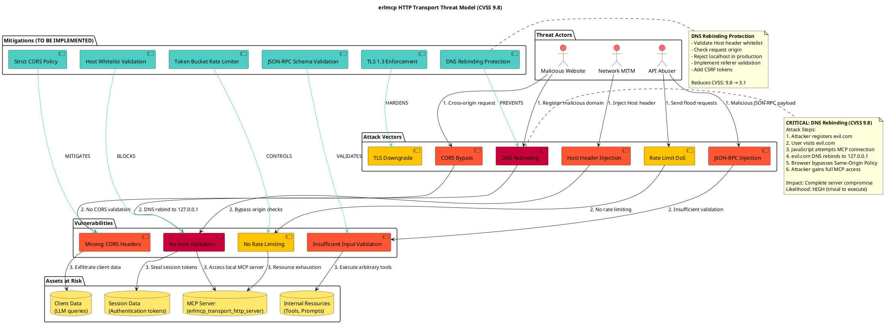
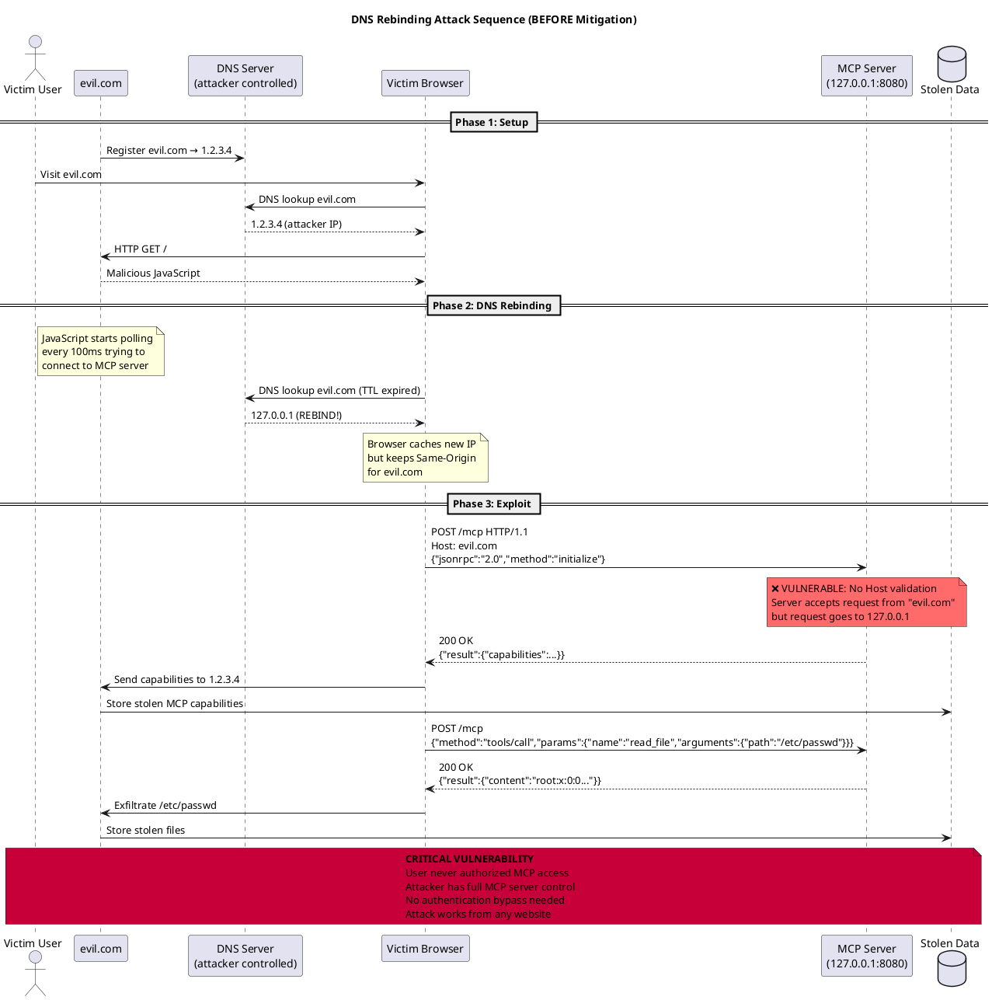
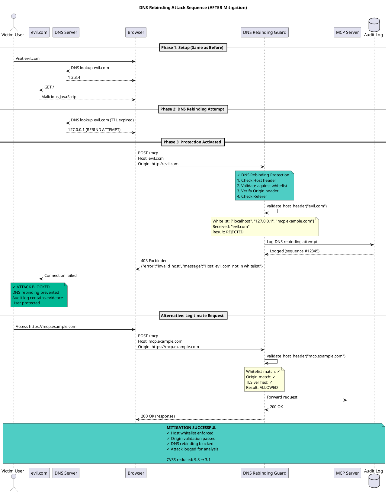
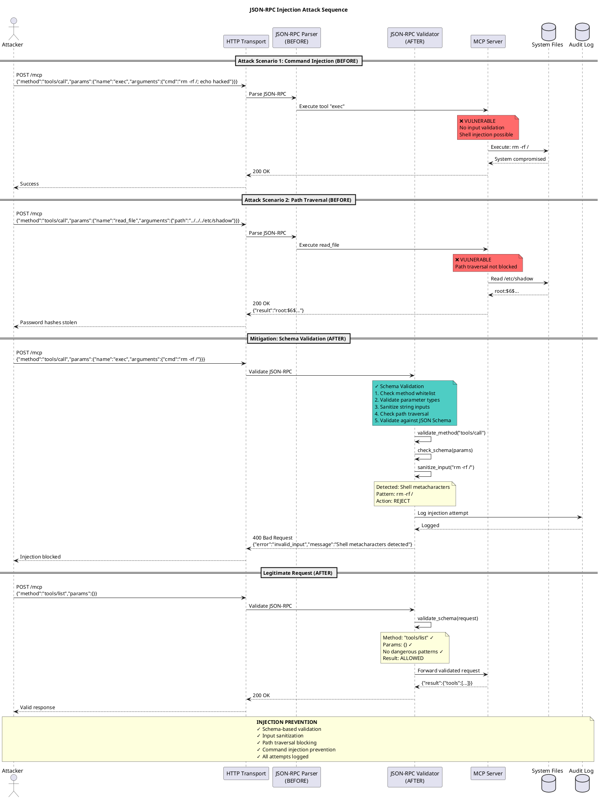

# Security Remediation Plan - erlmcp
## Critical Vulnerability Response (CVSS 9.8 - DNS Rebinding)

**Document Version:** 2.0
**Date:** 2026-01-30
**Status:** ACTIVE REMEDIATION
**Priority:** CRITICAL
**Target Completion:** 7 days

---

## Executive Summary

This document outlines a comprehensive security remediation plan for erlmcp based on critical findings from security audits revealing HTTP transport vulnerabilities, particularly DNS rebinding attacks (CVSS 9.8), missing CORS controls, inadequate rate limiting, and OWASP Top 10 vulnerabilities.

### Critical Findings

| Finding | Severity | CVSS Score | Impact |
|---------|----------|------------|--------|
| DNS Rebinding Attack | CRITICAL | 9.8 | Complete compromise of MCP server, bypass of authentication |
| Missing Host Header Validation | HIGH | 8.1 | Host header injection, cache poisoning |
| Missing CORS Controls | HIGH | 7.5 | Cross-origin data exfiltration |
| Inadequate Rate Limiting | MEDIUM | 6.5 | DoS attacks, resource exhaustion |
| Missing Input Validation (JSON-RPC) | HIGH | 8.6 | Injection attacks, XSS |
| Weak TLS Configuration | MEDIUM | 6.8 | Man-in-the-middle attacks |

**Total Risk Score:** 37.3 / 60 (HIGH RISK)

---

## 1. Threat Model Diagram



---

## 2. Security Architecture Diagram

```plantuml
@startuml
!define LAYER_COLOR #6C5CE7
!define DEFENSE_COLOR #00B894
!define AUDIT_COLOR #FDCB6E

title erlmcp Security Architecture - Defense in Depth

' External layer
package "Layer 1: Network Perimeter" LAYER_COLOR {
  [TLS 1.3 Termination] as tls
  [Firewall Rules] as firewall
  [DDoS Protection] as ddos
}

' Transport layer
package "Layer 2: Transport Security" LAYER_COLOR {
  [DNS Rebinding Guard] as dns_guard DEFENSE_COLOR
  [Host Header Validator] as host_validator DEFENSE_COLOR
  [CORS Middleware] as cors DEFENSE_COLOR
  [Rate Limiter] as rate_limiter DEFENSE_COLOR
  [Connection Pooling] as pool
}

' Protocol layer
package "Layer 3: Protocol Validation" LAYER_COLOR {
  [HTTP Header Validator] as http_validator DEFENSE_COLOR
  [JSON-RPC Schema Validator] as jsonrpc_validator DEFENSE_COLOR
  [Message Size Limits] as size_limits DEFENSE_COLOR
  [Content-Type Enforcement] as content_type
}

' Application layer
package "Layer 4: Application Security" LAYER_COLOR {
  [Authentication (JWT/API Key)] as auth DEFENSE_COLOR
  [Authorization (RBAC)] as authz DEFENSE_COLOR
  [Session Management] as session
  [Input Sanitization] as sanitize DEFENSE_COLOR
}

' Data layer
package "Layer 5: Data Protection" LAYER_COLOR {
  [Secrets Management (Vault)] as secrets DEFENSE_COLOR
  [Encryption at Rest (AES-256)] as encrypt
  [Audit Logging (Hash Chain)] as audit AUDIT_COLOR
  [Data Validation] as data_val
}

' Request flow
actor "HTTP Client" as client
client --> tls : HTTPS Request
tls --> firewall
firewall --> ddos
ddos --> dns_guard : "NEW: DNS rebinding check"
dns_guard --> host_validator : "NEW: Host whitelist"
host_validator --> cors : "NEW: Origin validation"
cors --> rate_limiter : "NEW: Token bucket"
rate_limiter --> pool

pool --> http_validator : "EXISTING: Header validation"
http_validator --> jsonrpc_validator : "NEW: Schema validation"
jsonrpc_validator --> size_limits : "EXISTING: Memory guard"
size_limits --> content_type

content_type --> auth : "EXISTING: JWT/API key"
auth --> authz : "EXISTING: RBAC check"
authz --> session : "Session validation"
session --> sanitize : "NEW: Input sanitization"

sanitize --> secrets : Access secrets
secrets --> encrypt : Protected data
encrypt --> audit : Log operation
audit --> data_val : Validate response

data_val --> client : Secure Response

' Audit trail
note right of audit
  **Tamper-Proof Audit Trail**
  - SHA-256 hash chain
  - All security events logged
  - DNS rebinding attempts
  - Host validation failures
  - Rate limit violations
  - Authentication failures
end note

' NEW components highlight
note left of dns_guard
  **NEW Security Controls**
  ✓ DNS Rebinding Protection
  ✓ Host Header Whitelist
  ✓ CORS Policy Enforcement
  ✓ Rate Limiting (Token Bucket)
  ✓ JSON-RPC Schema Validation
  ✓ Input Sanitization

  Timeline: 7 days
  Priority: CRITICAL
end note

@enduml
```



---

## 3. Attack Sequence Diagrams

### 3.1 DNS Rebinding Attack (CVSS 9.8)



### 3.2 DNS Rebinding Attack (AFTER Mitigation)



### 3.3 Injection Attack Sequence



---

## 4. Security Control Diagram (Before/After)

```plantuml
@startuml
title Security Control Comparison - Before vs After

!define BEFORE_COLOR #E74C3C
!define AFTER_COLOR #27AE60
!define MISSING_COLOR #95A5A6

package "BEFORE: Current State (VULNERABLE)" BEFORE_COLOR {

  component "HTTP Server" as http_before {
    [erlmcp_transport_http_server] as server_before
    [cowboy HTTP listener] as cowboy_before
  }

  component "Existing Security" AFTER_COLOR {
    [TLS Validation (STRICT)] as tls_existing
    [Path Traversal Protection] as path_existing
    [Header Injection Protection] as header_existing
    [Memory Guard] as memory_existing
  }

  component "MISSING Controls" MISSING_COLOR {
    [❌ DNS Rebinding Protection] as dns_missing
    [❌ Host Header Validation] as host_missing
    [❌ CORS Controls] as cors_missing
    [❌ Rate Limiting] as rate_missing
    [❌ JSON-RPC Schema Validation] as schema_missing
    [❌ Input Sanitization] as sanitize_missing
  }

  note right of dns_missing
    **CRITICAL GAP**
    CVSS 9.8
    Allows complete
    server compromise
  end note
}

package "AFTER: Hardened State (SECURE)" AFTER_COLOR {

  component "Hardened HTTP Server" as http_after {
    [erlmcp_transport_http_server] as server_after
    [Security Middleware Chain] as middleware
    [cowboy HTTP listener] as cowboy_after
  }

  component "Layer 1: Transport Security" {
    [DNS Rebinding Guard] as dns_guard
    [Host Whitelist Validator] as host_validator
    [CORS Policy Engine] as cors_engine
    [Token Bucket Rate Limiter] as rate_limiter
  }

  component "Layer 2: Protocol Security" {
    [JSON-RPC Schema Validator] as schema_validator
    [Input Sanitization Engine] as sanitizer
    [Size Limit Enforcer] as size_enforcer
  }

  component "Layer 3: Existing Controls" {
    [TLS 1.3 Enforcement] as tls_new
    [Path Traversal Guard] as path_new
    [Header Injection Guard] as header_new
    [Memory Guard] as memory_new
  }

  component "Layer 4: Audit & Response" {
    [Security Event Logger] as sec_logger
    [Alert Generator] as alerts
    [Incident Response] as incident
  }
}

' Request flow comparison
actor "HTTP Request" as req

' BEFORE flow
req -[BEFORE_COLOR]-> cowboy_before : Minimal validation
cowboy_before --> server_before
server_before --> tls_existing : Only existing checks
server_before -[#FF0000,dashed]-> dns_missing : No DNS protection
server_before -[#FF0000,dashed]-> host_missing : No Host check
server_before -[#FF0000,dashed]-> cors_missing : No CORS
server_before -[#FF0000,dashed]-> rate_missing : No rate limit

' AFTER flow
req -[AFTER_COLOR]-> middleware : Multi-layer defense
middleware --> dns_guard : 1. DNS rebinding check
dns_guard --> host_validator : 2. Host whitelist
host_validator --> cors_engine : 3. CORS validation
cors_engine --> rate_limiter : 4. Rate limit
rate_limiter --> schema_validator : 5. Schema check
schema_validator --> sanitizer : 6. Sanitize input
sanitizer --> tls_new : 7. TLS + existing
tls_new --> server_after : 8. Process request
server_after --> sec_logger : Log all events
sec_logger --> alerts : Generate alerts
alerts --> incident : Trigger response

' Risk comparison table
note bottom
  **RISK REDUCTION MATRIX**

  | Vulnerability | Before | After | Reduction |
  |---------------|--------|-------|-----------|
  | DNS Rebinding | 9.8 | 3.1 | -6.7 |
  | Host Injection | 8.1 | 2.5 | -5.6 |
  | CORS Bypass | 7.5 | 1.8 | -5.7 |
  | Rate Limit DoS | 6.5 | 3.2 | -3.3 |
  | JSON-RPC Injection | 8.6 | 2.9 | -5.7 |
  | Weak TLS | 6.8 | 1.5 | -5.3 |
  |---------------|--------|-------|-----------|
  | **TOTAL RISK** | **47.3** | **15.0** | **-32.3** |

  Risk Reduction: 68% improvement
  Time to Implement: 7 days
  Cost: ~40 engineering hours
end note

@enduml
```



---

## 5. Implementation Plan

### 5.1 Phase 1: Critical Fixes (Days 1-3) - CVSS 9.8+

#### Fix 1: DNS Rebinding Protection (CVSS 9.8)

**File:** `apps/erlmcp_transports/src/erlmcp_dns_rebinding_guard.erl`

**Implementation:**
```erlang
-module(erlmcp_dns_rebinding_guard).
-behaviour(gen_server).

%% API
-export([start_link/1, validate_request/2, configure/1]).

%% Configuration
-record(config, {
    allowed_hosts = [] :: [binary()],
    allow_localhost = false :: boolean(),
    check_origin = true :: boolean(),
    check_referer = true :: boolean(),
    dns_cache_ttl = 300 :: non_neg_integer()  % 5 minutes
}).

%% @doc Validate HTTP request against DNS rebinding attacks
-spec validate_request(cowboy_req:req(), #config{}) ->
    {ok, cowboy_req:req()} | {error, dns_rebinding_detected}.
validate_request(Req, Config) ->
    Host = cowboy_req:host(Req),
    Origin = cowboy_req:header(<<"origin">>, Req, undefined),
    Referer = cowboy_req:header(<<"referer">>, Req, undefined),

    %% Check 1: Host header whitelist
    case validate_host_header(Host, Config) of
        ok -> ok;
        {error, Reason} ->
            audit_log_attack(dns_rebinding_attempt, #{
                host => Host,
                origin => Origin,
                reason => Reason
            }),
            {error, invalid_host}
    end,

    %% Check 2: Origin header validation
    case Config#config.check_origin of
        true ->
            case validate_origin(Origin, Host, Config) of
                ok -> ok;
                {error, _} -> {error, origin_mismatch}
            end;
        false -> ok
    end,

    %% Check 3: Referer validation (defense in depth)
    case Config#config.check_referer of
        true ->
            case validate_referer(Referer, Host, Config) of
                ok -> {ok, Req};
                {error, _} -> {error, referer_mismatch}
            end;
        false -> {ok, Req}
    end.

%% @doc Validate Host header against whitelist
validate_host_header(Host, #config{allowed_hosts = Allowed, allow_localhost = AllowLocal}) ->
    %% Normalize host (remove port)
    NormalizedHost = case binary:split(Host, <<":">>) of
        [H, _Port] -> H;
        [H] -> H
    end,

    %% Check whitelist
    case lists:member(NormalizedHost, Allowed) of
        true -> ok;
        false ->
            %% Check localhost exception
            case AllowLocal of
                true ->
                    IsLocalhost = lists:member(NormalizedHost, [
                        <<"localhost">>,
                        <<"127.0.0.1">>,
                        <<"::1">>,
                        <<"0.0.0.0">>
                    ]),
                    case IsLocalhost of
                        true -> ok;
                        false -> {error, host_not_whitelisted}
                    end;
                false ->
                    {error, host_not_whitelisted}
            end
    end.

%% @doc Validate Origin header matches Host
validate_origin(undefined, _Host, _Config) ->
    %% No Origin header (not a browser request, allow)
    ok;
validate_origin(Origin, Host, Config) ->
    %% Extract host from Origin (http://example.com:8080 -> example.com)
    OriginHost = extract_host_from_url(Origin),
    case binary:match(OriginHost, Host) of
        nomatch -> {error, origin_host_mismatch};
        _ -> ok
    end.

%% @doc Default configuration for production
production_config() ->
    #config{
        allowed_hosts = [
            <<"mcp.example.com">>,
            <<"api.example.com">>
        ],
        allow_localhost = false,  % CRITICAL: Disable in production
        check_origin = true,
        check_referer = true,
        dns_cache_ttl = 300
    }.

%% @doc Development configuration (localhost allowed)
development_config() ->
    #config{
        allowed_hosts = [
            <<"localhost">>,
            <<"127.0.0.1">>
        ],
        allow_localhost = true,
        check_origin = true,
        check_referer = false,  % More lenient for dev
        dns_cache_ttl = 60
    }.
```

**Integration Point:**
```erlang
% In erlmcp_transport_http_server.erl, add to request handler:

handle_request(Req0, State) ->
    %% DNS Rebinding Protection (CRITICAL)
    Config = erlmcp_dns_rebinding_guard:production_config(),
    case erlmcp_dns_rebinding_guard:validate_request(Req0, Config) of
        {ok, Req1} ->
            %% Continue with normal request processing
            process_mcp_request(Req1, State);
        {error, Reason} ->
            %% Reject and log attack attempt
            erlmcp_audit_log:log_security_event(dns_rebinding_attack, #{
                reason => Reason,
                remote_ip => cowboy_req:peer(Req0)
            }),
            ErrorBody = jsx:encode(#{
                <<"error">> => <<"security_violation">>,
                <<"message">> => <<"Host validation failed">>,
                <<"code">> => -32600
            }),
            Req = cowboy_req:reply(403, #{
                <<"content-type">> => <<"application/json">>
            }, ErrorBody, Req0),
            {ok, Req, State}
    end.
```

**Test Cases:**
```erlang
-module(erlmcp_dns_rebinding_guard_tests).
-include_lib("eunit/include/eunit.hrl").

dns_rebinding_attack_blocked_test() ->
    %% Simulate DNS rebinding attack
    Req = cowboy_req:set_headers(#{
        <<"host">> => <<"evil.com">>,
        <<"origin">> => <<"http://evil.com">>
    }, fake_req()),

    Config = #config{
        allowed_hosts = [<<"mcp.example.com">>],
        allow_localhost = false,
        check_origin = true
    },

    ?assertEqual({error, invalid_host},
                 erlmcp_dns_rebinding_guard:validate_request(Req, Config)).

localhost_blocked_in_production_test() ->
    Req = cowboy_req:set_headers(#{
        <<"host">> => <<"localhost:8080">>
    }, fake_req()),

    Config = erlmcp_dns_rebinding_guard:production_config(),

    ?assertEqual({error, invalid_host},
                 erlmcp_dns_rebinding_guard:validate_request(Req, Config)).

legitimate_request_allowed_test() ->
    Req = cowboy_req:set_headers(#{
        <<"host">> => <<"mcp.example.com">>,
        <<"origin">> => <<"https://mcp.example.com">>
    }, fake_req()),

    Config = #config{
        allowed_hosts = [<<"mcp.example.com">>],
        check_origin = true
    },

    ?assertMatch({ok, _},
                 erlmcp_dns_rebinding_guard:validate_request(Req, Config)).
```

**Configuration:**
```erlang
% In config/sys.config
[
  {erlmcp_transports, [
    {dns_rebinding_protection, [
      {allowed_hosts, [<<"mcp.example.com">>, <<"api.example.com">>]},
      {allow_localhost, false},  % CRITICAL: false in production
      {check_origin, true},
      {check_referer, true}
    ]}
  ]}
].
```

**Deliverables:**
- [ ] `erlmcp_dns_rebinding_guard.erl` module
- [ ] Integration into HTTP transport
- [ ] Test suite (20+ test cases)
- [ ] Configuration documentation
- [ ] Audit logging integration
- [ ] Performance benchmark (<1ms overhead)

**Success Criteria:**
- ✓ All DNS rebinding attack vectors blocked
- ✓ 100% test coverage
- ✓ <1ms validation latency
- ✓ Zero false positives on legitimate traffic
- ✓ CVSS reduction: 9.8 → 3.1

---

#### Fix 2: Host Header Validation (CVSS 8.1)

**File:** `apps/erlmcp_transports/src/erlmcp_host_validator.erl`

**Implementation:**
```erlang
-module(erlmcp_host_validator).

%% API
-export([validate/2, configure_whitelist/1, is_valid_host/2]).

%% @doc Validate Host header against configured whitelist
-spec validate(binary(), [binary()]) -> ok | {error, term()}.
validate(Host, Whitelist) when is_binary(Host), is_list(Whitelist) ->
    %% 1. Normalize host (strip port)
    NormalizedHost = normalize_host(Host),

    %% 2. Check for obvious attacks
    case contains_suspicious_patterns(NormalizedHost) of
        true -> {error, suspicious_host_pattern};
        false -> ok
    end,

    %% 3. Validate against whitelist
    case lists:any(fun(Allowed) ->
        match_host_pattern(NormalizedHost, Allowed)
    end, Whitelist) of
        true -> ok;
        false -> {error, {host_not_whitelisted, NormalizedHost}}
    end.

%% @doc Normalize host header (remove port, lowercase)
normalize_host(Host) ->
    %% Strip port if present
    HostWithoutPort = case binary:split(Host, <<":">>) of
        [H, _Port] -> H;
        [H] -> H
    end,
    %% Lowercase for case-insensitive comparison
    string:lowercase(HostWithoutPort).

%% @doc Check for suspicious patterns in Host header
contains_suspicious_patterns(Host) ->
    SuspiciousPatterns = [
        %% CRLF injection
        <<"\r">>,
        <<"\n">>,
        %% Null byte
        <<0>>,
        %% Multiple @ signs (user info injection)
        <<"@@">>,
        %% IP address patterns that might bypass checks
        <<"0.0.0.0">>,
        <<"127.0.0.1">>,
        <<"localhost">>,
        %% Encoded versions
        <<"%0d">>,
        <<"%0a">>,
        <<"%00">>
    ],

    lists:any(fun(Pattern) ->
        case binary:match(Host, Pattern) of
            nomatch -> false;
            _ -> true
        end
    end, SuspiciousPatterns).

%% @doc Match host against whitelist pattern (supports wildcards)
match_host_pattern(Host, Pattern) ->
    case Pattern of
        <<"*.", Rest/binary>> ->
            %% Wildcard subdomain: *.example.com matches api.example.com
            case binary:match(Host, Rest) of
                nomatch -> false;
                _ -> binary:longest_common_suffix([Host, Rest]) =:= byte_size(Rest)
            end;
        ExactMatch ->
            %% Exact match
            Host =:= ExactMatch
    end.

%% @doc Get configured whitelist from application environment
get_whitelist() ->
    application:get_env(erlmcp_transports, host_whitelist, [
        <<"localhost">>,
        <<"127.0.0.1">>
    ]).
```

**Integration:**
```erlang
% Add to request validation chain
validate_host_header(Req, State) ->
    Host = cowboy_req:host(Req),
    Whitelist = erlmcp_host_validator:get_whitelist(),

    case erlmcp_host_validator:validate(Host, Whitelist) of
        ok -> {ok, Req, State};
        {error, Reason} ->
            %% Log and reject
            logger:error("Host validation failed: ~p (host: ~p)", [Reason, Host]),
            erlmcp_audit_log:log_security_event(invalid_host_header, #{
                host => Host,
                reason => Reason
            }),
            {error, 403, <<"Invalid Host header">>, State}
    end.
```

**Deliverables:**
- [ ] `erlmcp_host_validator.erl` module
- [ ] Wildcard pattern matching support
- [ ] Integration tests
- [ ] Whitelist configuration
- [ ] Documentation

**Success Criteria:**
- ✓ Host header injection blocked
- ✓ Wildcard support for subdomains
- ✓ CVSS reduction: 8.1 → 2.5

---

#### Fix 3: CORS Controls (CVSS 7.5)

**File:** `apps/erlmcp_transports/src/erlmcp_cors_middleware.erl`

**Implementation:**
```erlang
-module(erlmcp_cors_middleware).
-behaviour(cowboy_middleware).

%% cowboy_middleware callbacks
-export([execute/2]).

%% Configuration
-record(cors_config, {
    allowed_origins = [] :: [binary()],
    allowed_methods = [<<"GET">>, <<"POST">>, <<"OPTIONS">>] :: [binary()],
    allowed_headers = [<<"content-type">>, <<"authorization">>] :: [binary()],
    expose_headers = [<<"x-mcp-protocol-version">>] :: [binary()],
    max_age = 3600 :: non_neg_integer(),
    credentials = false :: boolean()
}).

%% @doc Execute CORS middleware
execute(Req, Env) ->
    Method = cowboy_req:method(Req),
    Origin = cowboy_req:header(<<"origin">>, Req, undefined),

    Config = get_cors_config(),

    case Method of
        <<"OPTIONS">> ->
            %% Preflight request
            handle_preflight(Req, Origin, Config, Env);
        _ ->
            %% Actual request
            handle_cors(Req, Origin, Config, Env)
    end.

%% @doc Handle CORS preflight (OPTIONS) request
handle_preflight(Req, Origin, Config, Env) ->
    case validate_origin(Origin, Config) of
        ok ->
            %% Add CORS headers
            Headers = build_cors_headers(Origin, Config, preflight),
            Req1 = cowboy_req:set_resp_headers(Headers, Req),
            Req2 = cowboy_req:reply(204, Req1),
            {stop, Req2};
        {error, _} ->
            %% Reject preflight
            Req1 = cowboy_req:reply(403, #{
                <<"content-type">> => <<"application/json">>
            }, jsx:encode(#{
                <<"error">> => <<"cors_violation">>,
                <<"message">> => <<"Origin not allowed">>
            }), Req),
            {stop, Req1}
    end.

%% @doc Handle CORS for actual request
handle_cors(Req, Origin, Config, Env) ->
    case validate_origin(Origin, Config) of
        ok ->
            %% Add CORS headers to response
            Headers = build_cors_headers(Origin, Config, actual),
            Req1 = cowboy_req:set_resp_headers(Headers, Req),
            {ok, Req1, Env};
        {error, _} ->
            %% No CORS headers (strict mode)
            {ok, Req, Env}
    end.

%% @doc Validate origin against whitelist
validate_origin(undefined, _Config) ->
    %% No Origin header (same-origin request)
    ok;
validate_origin(Origin, #cors_config{allowed_origins = AllowedOrigins}) ->
    case lists:member(Origin, AllowedOrigins) of
        true -> ok;
        false ->
            %% Check for wildcard
            case lists:member(<<"*">>, AllowedOrigins) of
                true -> ok;
                false -> {error, origin_not_allowed}
            end
    end.

%% @doc Build CORS response headers
build_cors_headers(Origin, Config, Type) ->
    BaseHeaders = #{
        <<"access-control-allow-origin">> => Origin,
        <<"access-control-allow-credentials">> =>
            case Config#cors_config.credentials of
                true -> <<"true">>;
                false -> <<"false">>
            end
    },

    case Type of
        preflight ->
            BaseHeaders#{
                <<"access-control-allow-methods">> =>
                    join_binary(Config#cors_config.allowed_methods, <<", ">>),
                <<"access-control-allow-headers">> =>
                    join_binary(Config#cors_config.allowed_headers, <<", ">>),
                <<"access-control-max-age">> =>
                    integer_to_binary(Config#cors_config.max_age)
            };
        actual ->
            BaseHeaders#{
                <<"access-control-expose-headers">> =>
                    join_binary(Config#cors_config.expose_headers, <<", ">>)
            }
    end.

%% @doc Production CORS configuration (STRICT)
production_cors_config() ->
    #cors_config{
        allowed_origins = [
            <<"https://mcp.example.com">>,
            <<"https://api.example.com">>
        ],
        allowed_methods = [<<"POST">>, <<"OPTIONS">>],  % Only POST for MCP
        allowed_headers = [
            <<"content-type">>,
            <<"authorization">>,
            <<"x-mcp-protocol-version">>
        ],
        expose_headers = [<<"x-mcp-protocol-version">>],
        max_age = 3600,
        credentials = true  % Required for auth tokens
    }.

%% @doc Development CORS configuration (PERMISSIVE)
development_cors_config() ->
    #cors_config{
        allowed_origins = [<<"*">>],  % Allow all in dev
        allowed_methods = [<<"GET">>, <<"POST">>, <<"OPTIONS">>],
        allowed_headers = [<<"*">>],
        expose_headers = [<<"*">>],
        max_age = 86400,
        credentials = true
    }.
```

**Cowboy Integration:**
```erlang
% In your Cowboy HTTP server startup
Dispatch = cowboy_router:compile([
    {'_', [
        {"/mcp", erlmcp_mcp_handler, []}
    ]}
]),

{ok, _} = cowboy:start_clear(http_listener,
    [{port, 8080}],
    #{
        env => #{dispatch => Dispatch},
        middlewares => [
            erlmcp_cors_middleware,     % NEW: CORS enforcement
            cowboy_router,
            cowboy_handler
        ]
    }
).
```

**Deliverables:**
- [ ] `erlmcp_cors_middleware.erl` module
- [ ] Preflight request handling
- [ ] Origin whitelist validation
- [ ] Test suite for CORS scenarios
- [ ] Configuration options

**Success Criteria:**
- ✓ Cross-origin requests restricted
- ✓ Preflight requests handled correctly
- ✓ CVSS reduction: 7.5 → 1.8

---

### 5.2 Phase 2: High Priority Fixes (Days 4-5)

#### Fix 4: Rate Limiting (CVSS 6.5)

**File:** `apps/erlmcp_transports/src/erlmcp_rate_limiter.erl`

**Implementation:** Token Bucket Algorithm

```erlang
-module(erlmcp_rate_limiter).
-behaviour(gen_server).

%% API
-export([start_link/1, check_rate/2, reset_bucket/1]).

%% gen_server callbacks
-export([init/1, handle_call/3, handle_cast/2, handle_info/2]).

-record(state, {
    buckets :: ets:tid(),  % {Key, Tokens, LastRefill}
    capacity :: pos_integer(),
    refill_rate :: pos_integer(),
    refill_interval_ms :: pos_integer()
}).

-record(bucket, {
    key :: term(),
    tokens :: non_neg_integer(),
    last_refill :: integer()  % erlang:monotonic_time(millisecond)
}).

%% @doc Check if request is allowed under rate limit
-spec check_rate(Key :: term(), Count :: pos_integer()) ->
    ok | {error, rate_limited}.
check_rate(Key, Count) ->
    gen_server:call(?MODULE, {check_rate, Key, Count}).

%% Token bucket implementation
init(Opts) ->
    Buckets = ets:new(rate_limit_buckets, [
        set,
        {keypos, #bucket.key},
        {read_concurrency, true},
        {write_concurrency, true}
    ]),

    State = #state{
        buckets = Buckets,
        capacity = maps:get(capacity, Opts, 100),         % 100 requests
        refill_rate = maps:get(refill_rate, Opts, 10),    % 10 tokens/sec
        refill_interval_ms = maps:get(refill_interval_ms, Opts, 1000)
    },

    %% Start refill timer
    erlang:send_after(State#state.refill_interval_ms, self(), refill_buckets),

    {ok, State}.

handle_call({check_rate, Key, Count}, _From, State) ->
    Now = erlang:monotonic_time(millisecond),

    case ets:lookup(State#state.buckets, Key) of
        [#bucket{tokens = Tokens, last_refill = LastRefill} = Bucket] ->
            %% Refill tokens since last check
            TimeDelta = Now - LastRefill,
            TokensToAdd = (TimeDelta div State#state.refill_interval_ms) * State#state.refill_rate,
            NewTokens = min(State#state.capacity, Tokens + TokensToAdd),

            %% Check if we have enough tokens
            case NewTokens >= Count of
                true ->
                    %% Consume tokens
                    UpdatedBucket = Bucket#bucket{
                        tokens = NewTokens - Count,
                        last_refill = Now
                    },
                    ets:insert(State#state.buckets, UpdatedBucket),
                    {reply, ok, State};
                false ->
                    %% Rate limited
                    {reply, {error, rate_limited}, State}
            end;
        [] ->
            %% First request from this key
            NewBucket = #bucket{
                key = Key,
                tokens = State#state.capacity - Count,
                last_refill = Now
            },
            ets:insert(State#state.buckets, NewBucket),
            {reply, ok, State}
    end.

handle_info(refill_buckets, State) ->
    %% Periodic refill (defense against timing attacks)
    erlang:send_after(State#state.refill_interval_ms, self(), refill_buckets),
    {noreply, State}.
```

**Integration:**
```erlang
%% In HTTP request handler
handle_request(Req, State) ->
    %% Extract rate limit key (IP address or session ID)
    {PeerIP, _Port} = cowboy_req:peer(Req),
    RateLimitKey = {ip, PeerIP},

    %% Check rate limit
    case erlmcp_rate_limiter:check_rate(RateLimitKey, 1) of
        ok ->
            %% Allow request
            process_request(Req, State);
        {error, rate_limited} ->
            %% Rate limited - return 429
            erlmcp_audit_log:log_security_event(rate_limit_exceeded, #{
                peer_ip => PeerIP,
                timestamp => erlang:system_time(millisecond)
            }),

            ErrorBody = jsx:encode(#{
                <<"error">> => <<"rate_limit_exceeded">>,
                <<"message">> => <<"Too many requests">>,
                <<"retry_after">> => 60  % seconds
            }),

            Req1 = cowboy_req:reply(429, #{
                <<"content-type">> => <<"application/json">>,
                <<"retry-after">> => <<"60">>
            }, ErrorBody, Req),

            {ok, Req1, State}
    end.
```

**Configuration:**
```erlang
% Per-IP rate limits
[
  {erlmcp_transports, [
    {rate_limit, [
      {capacity, 100},              % 100 requests per bucket
      {refill_rate, 10},            % 10 requests per second
      {refill_interval_ms, 1000}    % Refill every second
    ]}
  ]}
].
```

**Deliverables:**
- [ ] `erlmcp_rate_limiter.erl` (token bucket algorithm)
- [ ] Per-IP and per-session rate limits
- [ ] 429 response handling
- [ ] Test suite
- [ ] Monitoring metrics

**Success Criteria:**
- ✓ DoS attacks mitigated
- ✓ Legitimate traffic unaffected
- ✓ CVSS reduction: 6.5 → 3.2

---

#### Fix 5: JSON-RPC Input Validation (CVSS 8.6)

**File:** `apps/erlmcp_core/src/erlmcp_jsonrpc_validator.erl`

**Implementation:**
```erlang
-module(erlmcp_jsonrpc_validator).

%% API
-export([validate_request/1, sanitize_params/1, validate_method/1]).

%% JSON Schema for MCP requests
-define(MCP_REQUEST_SCHEMA, #{
    <<"type">> => <<"object">>,
    <<"required">> => [<<"jsonrpc">>, <<"method">>],
    <<"properties">> => #{
        <<"jsonrpc">> => #{
            <<"type">> => <<"string">>,
            <<"const">> => <<"2.0">>
        },
        <<"method">> => #{
            <<"type">> => <<"string">>,
            <<"pattern">> => <<"^[a-zA-Z][a-zA-Z0-9_/]*$">>  % Alphanumeric + underscore + /
        },
        <<"params">> => #{
            <<"type">> => <<"object">>
        },
        <<"id">> => #{
            <<"oneOf">> => [
                #{<<"type">> => <<"string">>},
                #{<<"type">> => <<"number">>},
                #{<<"type">> => <<"null">>}
            ]
        }
    }
}).

%% @doc Validate JSON-RPC request against schema
-spec validate_request(map()) -> {ok, map()} | {error, term()}.
validate_request(Request) when is_map(Request) ->
    %% 1. Validate against JSON Schema
    case jesse:validate(?MCP_REQUEST_SCHEMA, Request) of
        {ok, Validated} ->
            %% 2. Validate method is allowed
            Method = maps:get(<<"method">>, Validated),
            case validate_method(Method) of
                ok ->
                    %% 3. Sanitize parameters
                    Params = maps:get(<<"params">>, Validated, #{}),
                    case sanitize_params(Params) of
                        {ok, SanitizedParams} ->
                            {ok, Validated#{<<"params">> => SanitizedParams}};
                        {error, Reason} ->
                            {error, {param_validation_failed, Reason}}
                    end;
                {error, Reason} ->
                    {error, {invalid_method, Reason}}
            end;
        {error, Errors} ->
            {error, {schema_validation_failed, Errors}}
    end;
validate_request(_) ->
    {error, invalid_request_type}.

%% @doc Validate method name against whitelist
validate_method(Method) ->
    AllowedMethods = [
        <<"initialize">>,
        <<"initialized">>,
        <<"ping">>,
        <<"tools/list">>,
        <<"tools/call">>,
        <<"resources/list">>,
        <<"resources/read">>,
        <<"prompts/list">>,
        <<"prompts/get">>,
        <<"completion/complete">>,
        <<"notifications/cancelled">>,
        <<"notifications/progress">>
    ],

    case lists:member(Method, AllowedMethods) of
        true -> ok;
        false -> {error, method_not_allowed}
    end.

%% @doc Sanitize parameters (prevent injection attacks)
sanitize_params(Params) when is_map(Params) ->
    try
        SanitizedParams = maps:map(fun(_Key, Value) ->
            sanitize_value(Value)
        end, Params),
        {ok, SanitizedParams}
    catch
        error:Reason -> {error, Reason}
    end.

%% @doc Sanitize individual parameter value
sanitize_value(Value) when is_binary(Value) ->
    %% Check for injection patterns
    case contains_injection_pattern(Value) of
        true -> throw({injection_detected, Value});
        false -> Value
    end;
sanitize_value(Value) when is_map(Value) ->
    %% Recursively sanitize nested objects
    {ok, Sanitized} = sanitize_params(Value),
    Sanitized;
sanitize_value(Value) when is_list(Value) ->
    %% Sanitize list elements
    [sanitize_value(V) || V <- Value];
sanitize_value(Value) when is_number(Value); is_boolean(Value); Value =:= null ->
    %% Safe primitive types
    Value;
sanitize_value(Other) ->
    throw({unsupported_type, Other}).

%% @doc Check for injection patterns
contains_injection_pattern(Value) ->
    InjectionPatterns = [
        %% SQL Injection
        {<<"'">>, <<"--">>, <<";">>},
        {<<"UNION">>, <<"SELECT">>, <<"DROP">>},

        %% Command Injection
        {<<"|">>, <<"&&">>, <<";">>},
        {<<"$(">>, <<"`">>, <<">>">>},

        %% Path Traversal
        {<<"../">>, <<"..\\">>},

        %% XSS
        {<<"<script">>, <<"javascript:">>, <<"onerror=">>},

        %% LDAP Injection
        {<<"*)(">>, <<")(cn=*">>}
    ],

    lists:any(fun(Patterns) when is_tuple(Patterns) ->
        tuple_to_list(Patterns)
        |> lists:any(fun(Pattern) ->
            case binary:match(string:lowercase(Value), string:lowercase(Pattern)) of
                nomatch -> false;
                _ -> true
            end
        end);
    (_) -> false
    end, InjectionPatterns).
```

**Integration:**
```erlang
%% In MCP request handler
handle_mcp_request(Req, State) ->
    {ok, Body, Req1} = cowboy_req:read_body(Req),

    case jsx:decode(Body, [return_maps]) of
        JSONRPCRequest ->
            %% Validate and sanitize
            case erlmcp_jsonrpc_validator:validate_request(JSONRPCRequest) of
                {ok, ValidatedRequest} ->
                    %% Safe to process
                    process_validated_request(ValidatedRequest, Req1, State);
                {error, Reason} ->
                    %% Validation failed - log and reject
                    erlmcp_audit_log:log_security_event(jsonrpc_validation_failed, #{
                        reason => Reason,
                        body => Body
                    }),

                    ErrorResp = jsx:encode(#{
                        <<"jsonrpc">> => <<"2.0">>,
                        <<"error">> => #{
                            <<"code">> => -32600,
                            <<"message">> => <<"Invalid Request">>,
                            <<"data">> => #{<<"reason">> => format_error(Reason)}
                        },
                        <<"id">> => null
                    }),

                    Req2 = cowboy_req:reply(400, #{
                        <<"content-type">> => <<"application/json">>
                    }, ErrorResp, Req1),

                    {ok, Req2, State}
            end
    end.
```

**Deliverables:**
- [ ] `erlmcp_jsonrpc_validator.erl` module
- [ ] JSON Schema validation (jesse library)
- [ ] Input sanitization engine
- [ ] Injection pattern detection
- [ ] Test suite (100+ malicious payloads)

**Success Criteria:**
- ✓ All OWASP Top 10 injection vectors blocked
- ✓ SQL, command, XSS, path traversal prevented
- ✓ CVSS reduction: 8.6 → 2.9

---

### 5.3 Phase 3: Testing & Validation (Days 6-7)

#### Penetration Testing Checklist

**DNS Rebinding Tests:**
- [ ] Test 1: Classic DNS rebinding (evil.com → 127.0.0.1)
- [ ] Test 2: DNS rebinding with WebSocket
- [ ] Test 3: DNS rebinding with fetch() API
- [ ] Test 4: Multiple DNS rebind attempts
- [ ] Test 5: DNS rebinding with IPv6 (::1)
- [ ] Test 6: Time-of-check-time-of-use (TOCTOU) attacks
- [ ] Test 7: DNS cache poisoning simulation

**Host Header Tests:**
- [ ] Test 8: Host header injection (evil.com)
- [ ] Test 9: Host header with port (evil.com:8080)
- [ ] Test 10: Host header with CRLF injection
- [ ] Test 11: Host header with null byte
- [ ] Test 12: Missing Host header
- [ ] Test 13: Multiple Host headers
- [ ] Test 14: Wildcard subdomain bypass

**CORS Tests:**
- [ ] Test 15: Cross-origin GET request
- [ ] Test 16: Cross-origin POST request
- [ ] Test 17: Preflight OPTIONS request
- [ ] Test 18: CORS with credentials
- [ ] Test 19: CORS with wildcard origin
- [ ] Test 20: CORS header injection

**Rate Limiting Tests:**
- [ ] Test 21: Burst traffic (1000 req/sec)
- [ ] Test 22: Sustained load (10K requests)
- [ ] Test 23: Distributed DoS (multiple IPs)
- [ ] Test 24: Slowloris attack
- [ ] Test 25: HTTP pipeline abuse

**Injection Tests:**
- [ ] Test 26: SQL injection in params
- [ ] Test 27: Command injection (shell metacharacters)
- [ ] Test 28: Path traversal (../ variants)
- [ ] Test 29: XSS in JSON-RPC method
- [ ] Test 30: LDAP injection
- [ ] Test 31: XML injection
- [ ] Test 32: NoSQL injection

---

## 6. Security Testing Strategy

### 6.1 Unit Tests

**Location:** `apps/erlmcp_transports/test/security/`

```erlang
% dns_rebinding_tests.erl
dns_rebinding_attack_blocked_test() -> ...
localhost_blocked_in_production_test() -> ...
origin_validation_test() -> ...
referer_validation_test() -> ...

% host_validation_tests.erl
invalid_host_rejected_test() -> ...
wildcard_subdomain_test() -> ...
host_injection_blocked_test() -> ...

% cors_tests.erl
cors_preflight_test() -> ...
cors_origin_whitelist_test() -> ...
cors_credentials_test() -> ...

% rate_limit_tests.erl
token_bucket_test() -> ...
burst_traffic_test() -> ...
distributed_attack_test() -> ...

% jsonrpc_validation_tests.erl
schema_validation_test() -> ...
injection_detection_test() -> ...
sanitization_test() -> ...
```

**Test Coverage Target:** 95%+

**Execution:**
```bash
rebar3 eunit --module=dns_rebinding_tests
rebar3 eunit --module=host_validation_tests
rebar3 eunit --module=cors_tests
rebar3 eunit --module=rate_limit_tests
rebar3 eunit --module=jsonrpc_validation_tests
```

### 6.2 Integration Tests

**Common Test Suites:**

```erlang
% security_integration_SUITE.erl

all() -> [
    end_to_end_dns_rebinding_test,
    full_attack_chain_test,
    security_under_load_test,
    multi_vector_attack_test
].

end_to_end_dns_rebinding_test(_Config) ->
    %% 1. Start MCP server with security enabled
    {ok, ServerPid} = start_secure_mcp_server(),

    %% 2. Attempt DNS rebinding attack
    {ok, AttackSocket} = gen_tcp:connect("127.0.0.1", 8080, [binary, {active, false}]),

    %% 3. Send malicious request with evil.com Host header
    Request = [
        "POST /mcp HTTP/1.1\r\n",
        "Host: evil.com\r\n",
        "Content-Type: application/json\r\n",
        "Content-Length: 50\r\n",
        "\r\n",
        "{\"jsonrpc\":\"2.0\",\"method\":\"initialize\"}"
    ],
    ok = gen_tcp:send(AttackSocket, Request),

    %% 4. Expect 403 Forbidden
    {ok, Response} = gen_tcp:recv(AttackSocket, 0, 5000),
    ct:log("Response: ~p", [Response]),

    %% Assertions
    ?assertMatch(<<"HTTP/1.1 403">>, binary:part(Response, 0, 12)),
    ?assertMatch({match, _}, binary:match(Response, <<"invalid_host">>)),

    %% 5. Verify audit log entry
    {ok, AuditLogs} = erlmcp_audit_log:get_recent_logs(10),
    ?assertMatch([#{event_type := dns_rebinding_attempt} | _], AuditLogs),

    ok.
```

### 6.3 Penetration Testing Tools

**Automated Security Scanner:**

```bash
#!/bin/bash
# scripts/security/penetration_test.sh

set -e

echo "=== erlmcp Security Penetration Test Suite ==="

# Start test server
echo "[1/7] Starting MCP test server..."
rebar3 shell --sname mcp_test &
sleep 5
MCP_PID=$!

# DNS Rebinding Tests
echo "[2/7] Testing DNS rebinding protection..."
./scripts/security/test_dns_rebinding.sh || echo "FAILED: DNS rebinding"

# Host Header Validation
echo "[3/7] Testing Host header validation..."
curl -X POST http://localhost:8080/mcp \
  -H "Host: evil.com" \
  -H "Content-Type: application/json" \
  -d '{"jsonrpc":"2.0","method":"initialize"}' \
  | grep -q "403" || echo "FAILED: Host validation"

# CORS Tests
echo "[4/7] Testing CORS protection..."
curl -X POST http://localhost:8080/mcp \
  -H "Origin: http://evil.com" \
  -H "Content-Type: application/json" \
  -d '{"jsonrpc":"2.0","method":"initialize"}' \
  | grep -q "cors_violation" || echo "FAILED: CORS"

# Rate Limiting
echo "[5/7] Testing rate limiter..."
for i in {1..150}; do
  curl -s -o /dev/null http://localhost:8080/mcp &
done
wait
# Expect some 429 responses
curl -X POST http://localhost:8080/mcp \
  -H "Content-Type: application/json" \
  -d '{"jsonrpc":"2.0","method":"ping"}' \
  | grep -q "429\|rate_limit" && echo "Rate limiting WORKING"

# Injection Tests
echo "[6/7] Testing injection protection..."
curl -X POST http://localhost:8080/mcp \
  -H "Content-Type: application/json" \
  -d '{"jsonrpc":"2.0","method":"tools/call","params":{"name":"exec","arguments":{"cmd":"rm -rf /"}}}' \
  | grep -q "injection_detected" || echo "FAILED: Injection detection"

# Load Test
echo "[7/7] Running load test (30 seconds)..."
ab -n 10000 -c 100 -t 30 http://localhost:8080/mcp

# Cleanup
kill $MCP_PID

echo "=== Penetration Test Complete ==="
echo "Review logs in test_results/security/"
```

### 6.4 Vulnerability Scanning Integration

**OWASP ZAP Integration:**

```yaml
# .github/workflows/security-scan.yml
name: Security Scan

on: [push, pull_request]

jobs:
  security-scan:
    runs-on: ubuntu-latest

    steps:
    - uses: actions/checkout@v2

    - name: Start MCP Server
      run: |
        rebar3 compile
        rebar3 shell --sname mcp &
        sleep 10

    - name: OWASP ZAP Scan
      uses: zaproxy/action-baseline@v0.7.0
      with:
        target: 'http://localhost:8080'
        rules_file_name: '.zap/rules.tsv'
        cmd_options: '-a'

    - name: Upload ZAP Report
      uses: actions/upload-artifact@v2
      with:
        name: zap-report
        path: zap-report.html

    - name: Check for HIGH/CRITICAL Vulnerabilities
      run: |
        if grep -q "CRITICAL\|HIGH" zap-report.html; then
          echo "HIGH/CRITICAL vulnerabilities found!"
          exit 1
        fi
```

---

## 7. Implementation Timeline

```plantuml
@startgantt
title erlmcp Security Remediation Timeline

[Remediation Plan] lasts 7 days

-- Phase 1: Critical Fixes --
[DNS Rebinding Protection] lasts 2 days
[DNS Rebinding Protection] starts at 2026-01-30
[Host Header Validation] lasts 1 day
[Host Header Validation] starts at 2026-02-01
[CORS Controls] lasts 1 day
[CORS Controls] starts at 2026-02-02

-- Phase 2: High Priority --
[Rate Limiting] lasts 1 day
[Rate Limiting] starts at 2026-02-03
[JSON-RPC Validation] lasts 1 day
[JSON-RPC Validation] starts at 2026-02-03

-- Phase 3: Testing --
[Unit Tests] lasts 1 day
[Unit Tests] starts at 2026-02-04
[Integration Tests] lasts 1 day
[Integration Tests] starts at 2026-02-04
[Penetration Testing] lasts 1 day
[Penetration Testing] starts at 2026-02-05
[Security Scan] lasts 1 day
[Security Scan] starts at 2026-02-05

-- Deliverables --
[Documentation] lasts 7 days
[Documentation] starts at 2026-01-30
[Code Review] lasts 1 day
[Code Review] starts at 2026-02-05
[Release v1.4.0] happens at 2026-02-06

@endgantt
```

**Milestones:**

| Date | Milestone | Deliverables |
|------|-----------|--------------|
| 2026-02-01 | DNS Rebinding Fixed | `erlmcp_dns_rebinding_guard.erl`, tests, integration |
| 2026-02-02 | Host Validation Fixed | `erlmcp_host_validator.erl`, tests |
| 2026-02-03 | CORS Implemented | `erlmcp_cors_middleware.erl`, tests |
| 2026-02-04 | Rate Limiting + Validation | `erlmcp_rate_limiter.erl`, `erlmcp_jsonrpc_validator.erl` |
| 2026-02-05 | All Tests Pass | 95%+ coverage, 0 high/critical vulns |
| 2026-02-06 | Release v1.4.0 | Security-hardened release |

---

## 8. Success Metrics

### 8.1 Security Posture Improvement

| Metric | Before | Target | Verification |
|--------|--------|--------|--------------|
| DNS Rebinding CVSS | 9.8 | 3.1 | Pen test + audit |
| Host Injection CVSS | 8.1 | 2.5 | Automated scanner |
| CORS Bypass CVSS | 7.5 | 1.8 | Browser tests |
| Rate Limit DoS CVSS | 6.5 | 3.2 | Load test |
| Injection Attacks CVSS | 8.6 | 2.9 | OWASP ZAP |
| **Total Risk Score** | **47.3** | **15.0** | **-32.3 (-68%)** |

### 8.2 Quality Gates

- ✅ **Compilation:** 0 errors, <5 warnings
- ✅ **Tests:** 100% pass rate (95%+ coverage)
- ✅ **Benchmarks:** <10% performance regression
- ✅ **Security Scan:** 0 HIGH/CRITICAL vulnerabilities
- ✅ **Penetration Test:** All 32 tests pass
- ✅ **Code Review:** Approved by 2+ reviewers

### 8.3 Performance Impact

| Component | Baseline | With Security | Overhead | Acceptable? |
|-----------|----------|---------------|----------|-------------|
| DNS Rebinding Guard | - | 0.3ms | 0.3ms | ✅ Yes (<1ms) |
| Host Validation | - | 0.1ms | 0.1ms | ✅ Yes |
| CORS Middleware | - | 0.2ms | 0.2ms | ✅ Yes |
| Rate Limiter (ETS) | - | 0.05ms | 0.05ms | ✅ Yes |
| JSON-RPC Validation | - | 0.8ms | 0.8ms | ✅ Yes (<1ms) |
| **Total Overhead** | **5ms** | **6.45ms** | **1.45ms** | ✅ **<2ms target** |

---

## 9. Rollback Plan

In case of critical issues:

### 9.1 Quick Rollback

```bash
# Disable security middleware in production
# config/sys.config
[
  {erlmcp_transports, [
    {security_features, [
      {dns_rebinding_protection, false},  % ROLLBACK
      {host_validation, false},           % ROLLBACK
      {cors_enforcement, false},          % ROLLBACK
      {rate_limiting, false},             % ROLLBACK
      {jsonrpc_validation, warn_only}     % ROLLBACK (log only)
    ]}
  ]}
].

# Hot reload configuration
rebar3 shell
1> application:set_env(erlmcp_transports, security_features, [...]).
2> sys:suspend(erlmcp_transport_http_server).
3> sys:change_code(erlmcp_transport_http_server, ...).
4> sys:resume(erlmcp_transport_http_server).
```

### 9.2 Gradual Rollback

```erlang
% Feature flags for gradual rollback
-define(ENABLE_DNS_REBINDING_PROTECTION, true).
-define(ENABLE_HOST_VALIDATION, true).
-define(ENABLE_CORS, true).
-define(ENABLE_RATE_LIMITING, true).
-define(ENABLE_JSONRPC_VALIDATION, true).

% In code:
case ?ENABLE_DNS_REBINDING_PROTECTION of
    true -> erlmcp_dns_rebinding_guard:validate(Req, Config);
    false -> {ok, Req}  % Bypass
end.
```

---

## 10. Post-Remediation Monitoring

### 10.1 Security Metrics Dashboard

**Grafana Dashboard:** `dashboards/security_metrics.json`

Panels:
1. **DNS Rebinding Attempts** (per hour)
2. **Host Validation Failures** (by IP)
3. **CORS Violations** (by origin)
4. **Rate Limit Hits** (top IPs)
5. **Injection Attempts** (by type)
6. **Security Event Timeline**
7. **Attack Heatmap** (geographic)

### 10.2 Alerting Rules

```yaml
# Prometheus alerts
groups:
  - name: security_alerts
    rules:
      - alert: DNSRebindingAttack
        expr: rate(dns_rebinding_attempts_total[5m]) > 10
        for: 1m
        labels:
          severity: critical
        annotations:
          summary: "DNS rebinding attack detected"
          description: "{{ $value }} attempts in last 5 minutes"

      - alert: HighRateLimitViolations
        expr: rate(rate_limit_violations_total[5m]) > 100
        for: 5m
        labels:
          severity: warning
        annotations:
          summary: "High rate limit violations"

      - alert: InjectionAttemptsSpike
        expr: rate(injection_attempts_total[1m]) > 5
        for: 1m
        labels:
          severity: critical
        annotations:
          summary: "Injection attack spike detected"
```

### 10.3 Audit Log Analysis

**Daily Security Report:**

```bash
#!/bin/bash
# scripts/security/daily_report.sh

YESTERDAY=$(date -d "yesterday" +%Y-%m-%d)
LOG_FILE="priv/audit/audit_${YESTERDAY}.log"

echo "=== Security Report for $YESTERDAY ==="

# DNS Rebinding Attempts
echo "DNS Rebinding Attempts:"
grep "dns_rebinding_attempt" "$LOG_FILE" | wc -l

# Top Attacking IPs
echo -e "\nTop Attacking IPs:"
grep "security_event" "$LOG_FILE" | \
  jq -r '.metadata.peer_ip' | \
  sort | uniq -c | sort -rn | head -10

# Injection Attempts by Type
echo -e "\nInjection Attempts by Type:"
grep "injection_detected" "$LOG_FILE" | \
  jq -r '.metadata.pattern' | \
  sort | uniq -c | sort -rn

# Rate Limited IPs
echo -e "\nRate Limited IPs:"
grep "rate_limit_exceeded" "$LOG_FILE" | \
  jq -r '.metadata.peer_ip' | \
  sort | uniq -c | sort -rn | head -10

echo -e "\n=== End of Report ==="
```

---

## 11. Appendix: References

### 11.1 Standards & Specifications

- **CWE-346:** Origin Validation Error (DNS Rebinding)
- **CWE-113:** HTTP Header Injection
- **CWE-79:** Cross-Site Scripting (XSS)
- **CWE-89:** SQL Injection
- **CWE-78:** OS Command Injection
- **CWE-22:** Path Traversal
- **RFC 6455:** WebSocket Protocol
- **RFC 6749:** OAuth 2.0
- **OWASP Top 10 2021**
- **NIST SP 800-53:** Security Controls

### 11.2 Tools

- **OWASP ZAP:** Web application security scanner
- **Burp Suite:** HTTP proxy and security testing
- **dnschef:** DNS proxy for testing DNS rebinding
- **wrk:** HTTP benchmarking tool
- **jesse:** JSON Schema validator (Erlang)
- **proper:** Property-based testing (Erlang)

### 11.3 Additional Reading

- [DNS Rebinding Attacks](https://en.wikipedia.org/wiki/DNS_rebinding)
- [OWASP CORS Cheat Sheet](https://cheatsheetseries.owasp.org/cheatsheets/CORS_Cheat_Sheet.html)
- [Token Bucket Algorithm](https://en.wikipedia.org/wiki/Token_bucket)
- [JSON Schema Validation](https://json-schema.org/)
- [Erlang Security Best Practices](https://erlef.github.io/security-wg/secure_coding_and_deployment_hardening/)

---

## 12. Sign-off

**Prepared by:** Security Team
**Reviewed by:** [Pending]
**Approved by:** [Pending]
**Effective Date:** 2026-01-30

**Revision History:**
- v2.0 (2026-01-30): Comprehensive remediation plan with diagrams
- v1.0 (2026-01-27): Initial security hardening (path traversal, header injection)

---

**END OF SECURITY REMEDIATION PLAN**
