# Transport Security - erlmcp

## Overview

erlmcp provides comprehensive transport layer security across all supported transports (STDIO, TCP, HTTP, WebSocket, SSE). This document covers TLS configuration, authentication, authorization, and security best practices for network communications.

## Table of Contents

- [Security Layers](#security-layers)
- [TLS Configuration](#tls-configuration)
- [Transport-Specific Security](#transport-specific-security)
- [mTLS Authentication](#mtls-authentication)
- [Security Headers](#security-headers)
- [Network Security](#network-security)

## Security Layers

### Defense in Depth

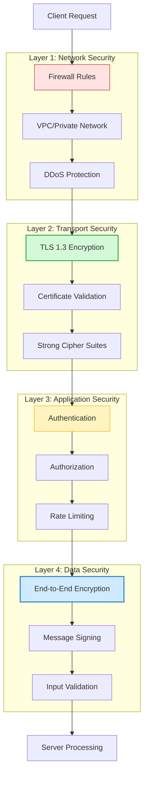

### Transport Security Comparison

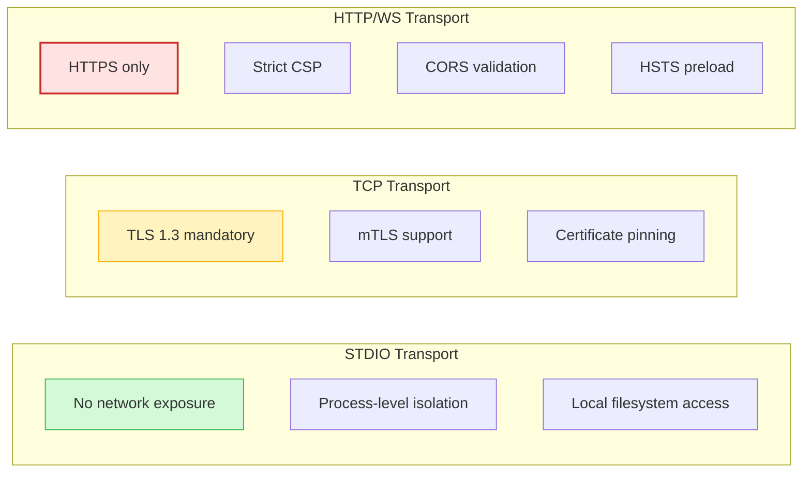

## TLS Configuration

### TLS 1.3 Setup

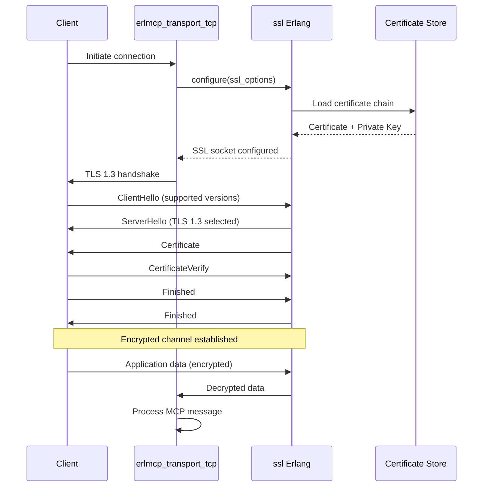

### SSL/TLS Configuration

```erlang
%% Production TLS configuration
ssl_options() -> #{
    % Protocol versions
    versions => ['tlsv1.3', 'tlsv1.2'],

    % Cipher suites (TLS 1.3)
    ciphers => [
        % TLS 1.3 cipher suites (prioritized)
        "TLS_AES_256_GCM_SHA384",
        "TLS_CHACHA20_POLY1305_SHA256",
        "TLS_AES_128_GCM_SHA256"
    ],

    % Certificates
    certfile => "/path/to/server.crt",
    keyfile => "/path/to/server.key",
    cacertfile => "/path/to/ca.crt",

    % Certificate verification
    verify => verify_peer,
    verify_fun => {fun ssl_verify_hostname/2, [{check_hostname, "erlmcp.example.com"}]},

    % Security options
    secure_renegotiate => true,
    reuse_sessions => true,
    hsts => true,

    % Protocol hardening
    honor_cipher_order => true,
    client_renegotiation => false,

    % OCSP stapling
    stapling => true,

    % Forward secrecy
    dhfile => "/path/to/dhparams.pem",
    ecdhe => true
}.
```

### Certificate Chain Validation

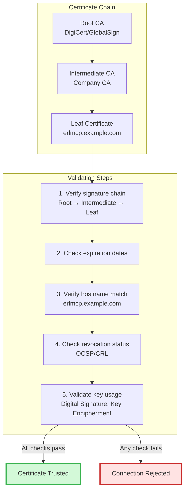

## Transport-Specific Security

### STDIO Transport

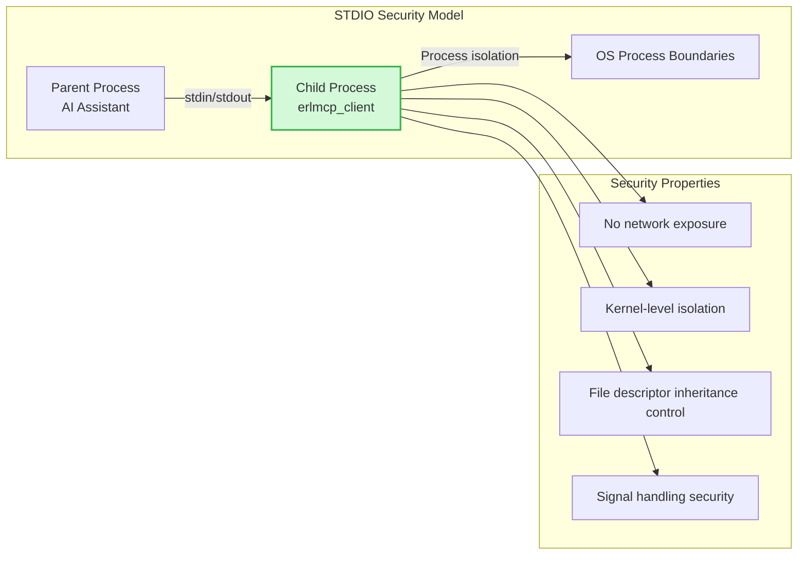

**Configuration:**
```erlang
{erlmcp_transport_stdio, [
    {input_fd, 0},  % stdin
    {output_fd, 1}, % stdout
    {error_fd, 2},  % stderr
    {buffer_size, 65536},
    {max_message_size, 10485760}  % 10MB limit
]}.
```

### TCP Transport

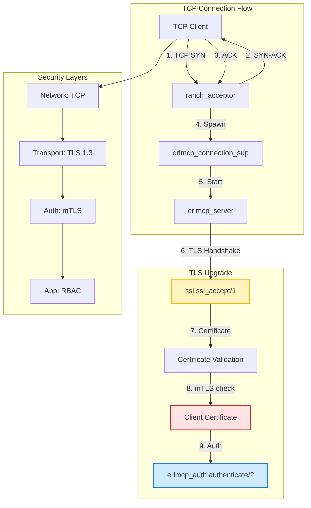

**Configuration:**
```erlang
{erlmcp_transport_tcp, [
    % Ranch configuration
    {ranch, #{
        num_acceptors => 100,
        max_connections => 10000,
        socket_opts => [
            {ip, {0, 0, 0, 0}},
            {port, 9000},
            {keepalive, true},
            {nodelay, true},
            {send_timeout, 30000},
            {send_timeout_close, true}
        ]
    }},

    % TLS configuration
    {tls, #{
        enabled => true,
        certfile => "/etc/erlmcp/tls/server.crt",
        keyfile => "/etc/erlmcp/tls/server.key",
        cacertfile => "/etc/erlmcp/tls/ca.crt",
        verify => verify_peer,
        fail_if_no_peer_cert => true,
        hsts => true
    }},

    % Security limits
    {max_frame_size, 10485760},  % 10MB
    {max_connections_per_ip, 10},
    {rate_limit, #{
        enabled => true,
        max_requests => 1000,
        window_ms => 60000  % 1000 req/min
    }}
]}.
```

### HTTP/WebSocket Transport

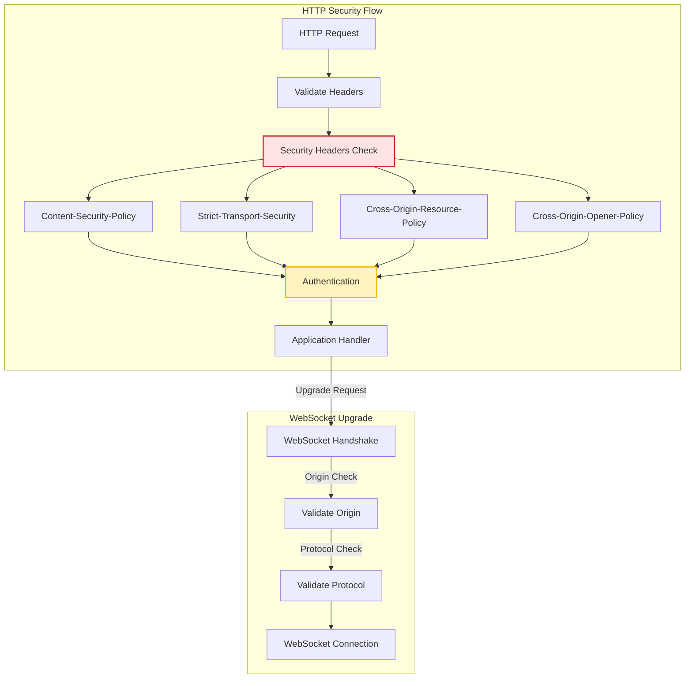

**Configuration:**
```erlang
{erlmcp_transport_http, [
    % Cowboy configuration
    {cowboy, #{
        num_acceptors => 100,
        max_connections => 10000,
        inet6 => true,  % IPv6 support
        socket_opts => [
            {port, 8080},
            {keepalive, true},
            {nodelay, true}
        ]
    }},

    % TLS (HTTPS)
    {tls, #{
        enabled => true,
        certfile => "/etc/erlmcp/tls/server.crt",
        keyfile => "/etc/erlmcp/tls/server.key",
        cacertfile => "/etc/erlmcp/tls/ca.crt",
        hsts => true,
        hsts_max_age => 31536000,  % 1 year
        hsts_include_subdomains => true,
        hsts_preload => true
    }},

    % Security headers
    {security_headers, #{
        content_security_policy =>
            "default-src 'self'; "
            "script-src 'self' 'unsafe-inline'; "
            "connect-src 'self' wss://erlmcp.example.com; "
            "object-src 'none'; "
            "base-uri 'self'",

        strict_transport_security =>
            "max-age=31536000; includeSubDomains; preload",

        x_content_type_options => "nosniff",
        x_frame_options => "DENY",
        x_xss_protection => "1; mode=block",

        cross_origin_resource_policy => "same-origin",
        cross_origin_opener_policy => "same-origin",
        cross_origin_embedder_policy => "require-corp",

        referrer_policy => "strict-origin-when-cross-origin",

        permissions_policy =>
            "geolocation=(), "
            "microphone=(), "
            "camera=(), "
            "payment=(), "
            "usb=()"
    }},

    % CORS (if needed)
    {cors, #{
        enabled => true,
        allowed_origins => ["https://trusted.example.com"],
        allowed_methods => ["GET", "POST", "OPTIONS"],
        allowed_headers => ["Content-Type", "Authorization"],
        max_age => 86400
    }},

    % Rate limiting
    {rate_limit, #{
        enabled => true,
        max_requests => 1000,
        window_ms => 60000,
        burst => 100
    }}
]}.
```

### Server-Sent Events (SSE)

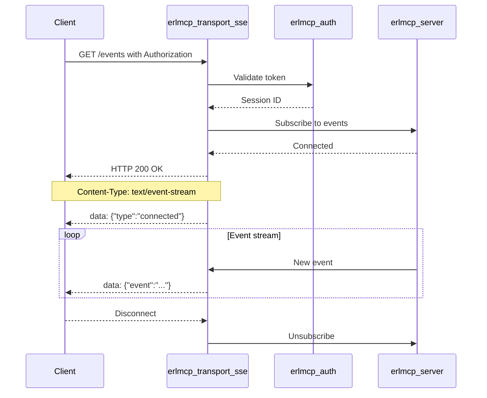

**Configuration:**
```erlang
{erlmcp_transport_sse, [
    % HTTP/HTTPS base config (same as HTTP transport)
    {http_config, #{
        port => 8080,
        tls => true,
        certfile => "/etc/erlmcp/tls/server.crt",
        keyfile => "/etc/erlmcp/tls/server.key"
    }},

    % SSE-specific
    {sse, #{
        heartbeat_interval => 30000,  % 30 seconds
        retry_timeout => 5000,        % 5 seconds
        max_connections => 1000,
        event_buffer_size => 100
    }},

    % Authentication required
    {authentication, #{
        required => true,
        methods => [jwt, api_key, mtls]
    }}
]}.
```

## mTLS Authentication

### Mutual TLS Flow

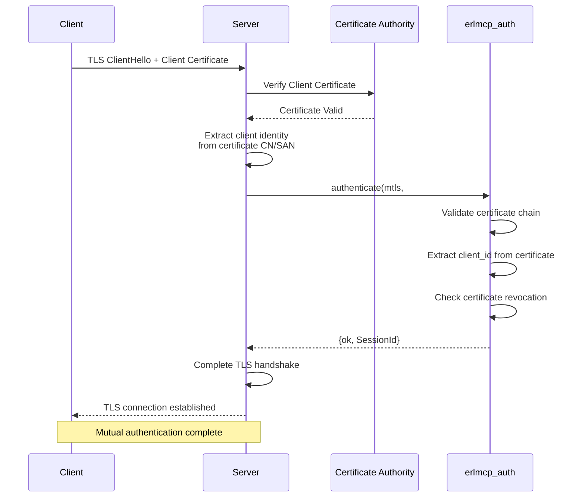

### mTLS Configuration

```erlang
%% Server configuration (requires client certificates)
{erlmcp_transport_tcp, [
    {tls, #{
        certfile => "/etc/erlmcp/tls/server.crt",
        keyfile => "/etc/erlmcp/tls/server.key",
        cacertfile => "/etc/erlmcp/tls/ca.crt",

        % mTLS configuration
        verify => verify_peer,
        fail_if_no_peer_cert => true,
        verify_fun => {fun ssl_verify_client_cert/2, []},

        % Certificate revocation
        crl_check => true,
        crl_cache => #{
            ssl_crl_cache => {
                ssl_crl_hash_dir,
                {internal, [{file, "/etc/erlmcp/tls/crl"}]}
            }
        }
    }}
]}.

%% Client configuration (presents certificate)
{erlmcp_client, [
    {transport, tcp},
    {transport_opts, #{
        host => "erlmcp.example.com",
        port => 9000,
        tls => true,
        certfile => "/etc/erlmcp/client/tls/client.crt",
        keyfile => "/etc/erlmcp/client/tls/client.key",
        cacertfile => "/etc/erlmcp/client/tls/ca.crt",
        verify => verify_peer,
        server_name_indication => "erlmcp.example.com"
    }}
]}.
```

### Certificate Identity Extraction

```erlang
%% Extract client identity from certificate
ssl_verify_client_cert(Cert, State) ->
    Subject = ssl:peer_certificate(Cert),

    % Extract Common Name (CN)
    {'OTPCertificate', _, _, _, _, _, _, _, _, _, _, _, _} = Subject,
    {rdnSequence, SubjectDN} = element(9, Subject),

    % Find CN in Subject DN
    CN = extract_cn(SubjectDN),

    % Extract Subject Alternative Names (SAN)
    SANs = extract_sans(Subject),

    % Validate certificate
    case validate_cert(Cert, CN, SANs) of
        ok ->
            {valid, State#{client_id => CN, sans => SANs}};
        {error, Reason} ->
            {fail, Reason}
    end.

validate_cert(Cert, CN, SANs) ->
    Checks = [
        check_expiration(Cert),
        check_revocation(Cert),
        check_chain(Cert),
        check_allowed_cn(CN),
        check_allowed_sans(SANs)
    ],
    lists:foldl(
        fun({ok, _}, _) -> ok;
           ({error, Reason}, _) -> {error, Reason}
        end,
        ok,
        Checks
    ).
```

## Security Headers

### Header Processing Flow

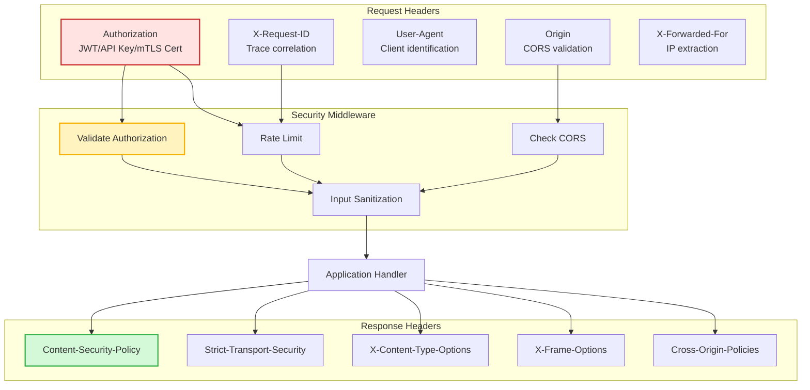

### Complete Header Set

```erlang
%% Security headers middleware
security_headers() -> #{
    %% Prevents MIME type sniffing
    <<"x-content-type-options">> => <<"nosniff">>,

    %% Prevents clickjacking
    <<"x-frame-options">> => <<"DENY">>,

    %% Legacy XSS protection (modern browsers use CSP)
    <<"x-xss-protection">> => <<"1; mode=block">>,

    %% Content Security Policy
    <<"content-security-policy">> =>
        <<"default-src 'self'; "
          "script-src 'self' 'unsafe-inline' 'unsafe-eval'; "
          "style-src 'self' 'unsafe-inline'; "
          "img-src 'self' data: https:; "
          "font-src 'self' data:; "
          "connect-src 'self' wss: ws:; "
          "media-src 'self'; "
          "object-src 'none'; "
          "frame-ancestors 'none'; "
          "form-action 'self'; "
          "base-uri 'self'; "
          "require-trusted-types-for 'script'; "
          "upgrade-insecure-requests">>,

    %% HTTP Strict Transport Security
    <<"strict-transport-security">> =>
        <<"max-age=31536000; includeSubDomains; preload">>,

    %% Referrer Policy
    <<"referrer-policy">> => <<"strict-origin-when-cross-origin">>,

    %% Permissions Policy (formerly Feature-Policy)
    <<"permissions-policy">> =>
        <<"geolocation=(self), "
          "microphone=(), "
          "camera=(), "
          "payment=(), "
          "usb=(), "
          "magnetometer=(), "
          "gyroscope=(), "
          "accelerometer=()">>,

    %% Cross-Origin policies
    <<"cross-origin-resource-policy">> => <<"same-origin">>,
    <<"cross-origin-opener-policy">> => <<"same-origin">>,
    <<"cross-origin-embedder-policy">> => <<"require-corp">>,

    %% Cache control for sensitive data
    <<"cache-control">> => <<"no-store, no-cache, must-revalidate">>,
    <<"pragma">> => <<"no-cache">>,

    %% X.509 client certificate header (mTLS)
    <<"x-client-cert-dn">> => get_client_cert_dn(),
    <<"x-client-cert-verified">> => get_client_cert_status()
}.
```

## Network Security

### Firewall and Network ACLs

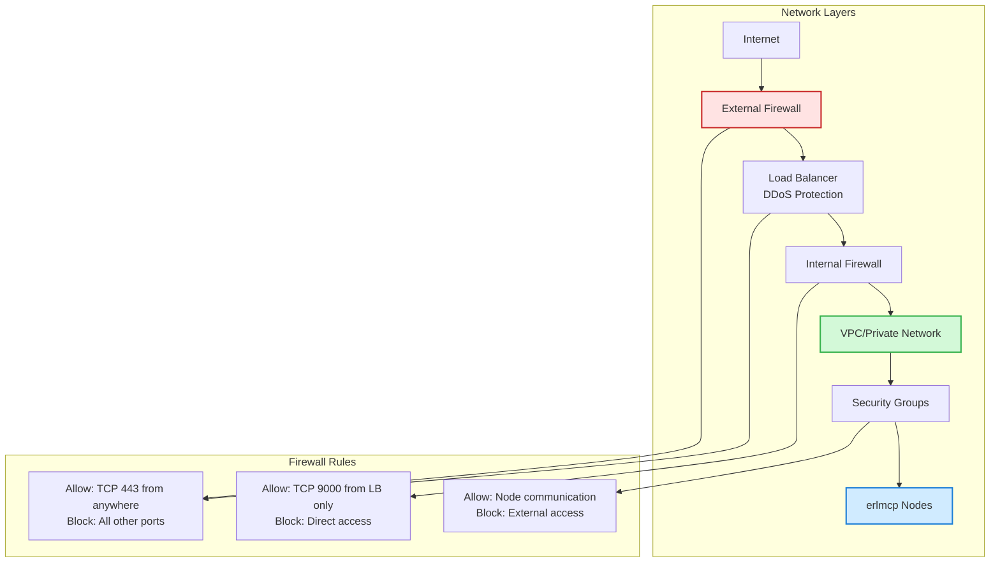

### Security Group Configuration (AWS)

```json
{
  "SecurityGroupIngress": [
    {
      "IpProtocol": "tcp",
      "FromPort": 443,
      "ToPort": 443,
      "IpRanges": [{"CidrIp": "0.0.0.0/0"}],
      "Description": "HTTPS from anywhere"
    },
    {
      "IpProtocol": "tcp",
      "FromPort": 9000,
      "ToPort": 9000,
      "UserIdGroupPairs": [{"GroupId": "sg-loadbalancer"}],
      "Description": "MCP over TCP from load balancer only"
    },
    {
      "IpProtocol": "tcp",
      "FromPort": 9100,
      "ToPort": 9100,
      "UserIdGroupPairs": [{"GroupId": "sg-erlmcp-nodes"}],
      "Description": "Inter-node communication"
    }
  ],
  "SecurityGroupEgress": [
    {
      "IpProtocol": "-1",
      "IpRanges": [{"CidrIp": "0.0.0.0/0"}],
      "Description": "All outbound traffic"
    }
  ]
}
```

### DDoS Protection

```erlang
%% Rate limiter configuration
{erlmcp_rate_limiter, [
    {strategy, token_bucket},
    {rules, [
        #{
            key => {ip, {0, 0, 0, 0}},  % Per IP
            rate => 100,                   % 100 requests
            period => 60000,               % per 60 seconds
            burst => 20                    % Allow burst of 20
        },
        #{
            key => {session, all},         % Per session
            rate => 1000,                  % 1000 requests
            period => 60000,               % per 60 seconds
            burst => 100
        },
        #{
            key => {global, all},          % Global limit
            rate => 100000,                % 100K requests
            period => 60000,               % per 60 seconds
            burst => 1000
        }
    ]},

    % Response on rate limit exceeded
    {response, #{
        status => 429,
        body => #{error => <<"rate_limit_exceeded">>},
        headers => #{
            <<"retry-after">> => 60,
            <<"x-rate-limit-limit">> => 100,
            <<"x-rate-limit-remaining">> => 0,
            <<"x-rate-limit-reset">> => 1643723400
        }
    }}
]}.
```

## Security Monitoring

### Connection Metrics

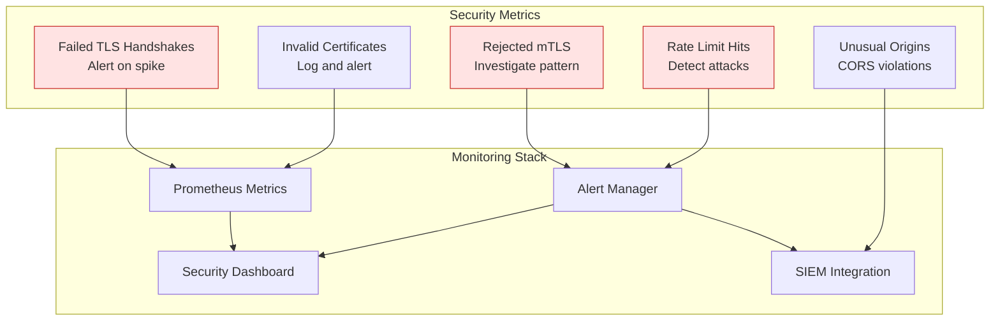

## Best Practices Summary

### TLS Configuration

- **Always use TLS 1.3** (fallback to TLS 1.2 only if necessary)
- **Strong cipher suites only** (AES-256-GCM, ChaCha20-Poly1305)
- **Perfect Forward Secrecy** (ECDHE key exchange)
- **Certificate pinning** in production clients
- **Regular certificate rotation** (90-day maximum)
- **OCSP stapling** for revocation checking

### mTLS Authentication

- **Verify client certificates** in production
- **Short-lived certificates** (24-72 hours)
- **Certificate revocation checking** (CRL or OCSP)
- **Extract identity from CN or SAN**
- **Separate CA for internal services**

### HTTP/WebSocket Security

- **HTTPS only** (redirect HTTP to HTTPS)
- **Strict CSP** (whitelist only trusted sources)
- **HSTS preload** (prevent downgrade attacks)
- **CORS restrictions** (whitelist allowed origins)
- **Security headers** (all headers enabled)
- **WebSocket Origin validation**

### Network Security

- **Defense in depth** (firewall + VPC + security groups)
- **Principle of least privilege** (minimal open ports)
- **DDoS protection** (rate limiting + auto-blocking)
- **Private network** (nodes in VPC/private subnet)
- **Bastion hosts** (for SSH/admin access)

## References

- [OWASP Transport Protection](https://owasp.org/www-community/attacks/Transport_Layer_Protection)
- [Mozilla SSL Configuration Generator](https://ssl-config.mozilla.org/)
- [RFC 8446 - TLS 1.3](https://datatracker.ietf.org/doc/html/rfc8446)
- [RFC 7469 - Public Key Pinning](https://datatracker.ietf.org/doc/html/rfc7469)
- [Erlang ssl Module](https://erlang.org/doc/man/ssl.html)
