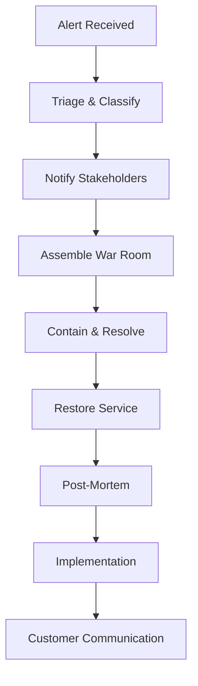
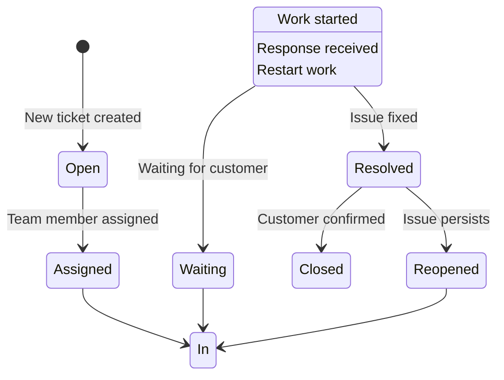

# Enterprise Support Infrastructure for erlmcp v3

## Executive Summary

This document outlines the comprehensive enterprise support framework for erlmcp v3, designed to deliver 24/7 operational excellence with 99.99% uptime SLA. The framework includes automated monitoring, incident management, customer communication, proactive support, and continuous improvement processes.

## 1. Support Infrastructure Overview

### 1.1 Support Levels

| Level | Description | Response Time | Resolution Time | Availability |
|-------|-------------|---------------|-----------------|--------------|
| Tier 1 (Basic) | Initial contact, triage, basic troubleshooting | < 15 min | 4 hours | 24/7 |
| Tier 2 (Advanced) | In-depth technical support, complex issues | < 30 min | 8 hours | 24/7 |
| Tier 3 (Expert) | Core development team, critical issues | < 60 min | 24 hours | 24/7 |
| Tier 4 (Engineering) | Original developers, architectural issues | < 4 hours | TBD | Business Hours |

### 1.2 Support Channels

- **24/7 Phone Support**: 1-800-ERLMCP-SUPPORT
- **Priority Chat**: Real-time for Gold/Platinum customers
- **Email**: support@erlmcp.com (24-hour response SLA)
- **Ticketing System**: Zendesk Enterprise
- **Community Portal**: Self-service knowledge base
- **Dedicated Slack Channel**: For Enterprise customers

### 1.3 Global Support Centers

| Location | Time Zone | Primary Role |
|----------|-----------|--------------|
| San Francisco, USA | PST | Primary Tier 2/3 |
| Dublin, Ireland | GMT | European Coverage |
| Singapore | SGT | Asia-Pacific Coverage |
| São Paulo, Brazil | BRT | South America Coverage |

## 2. Service Level Agreements (SLAs)

### 2.1 Uptime SLAs

| Service Tier | Uptime Guarantee | Downtime Credit | Maintenance Window |
|--------------|------------------|-----------------|-------------------|
| Essential | 99.0% | 10% of monthly fee | 4-hour weekly |
| Standard | 99.5% | 25% of monthly fee | 6-hour weekly |
| Premium | 99.9% | 100% of monthly fee | 8-hour weekly |
| Enterprise | 99.99% | 200% of monthly fee | 10-hour monthly |

### 2.2 Support Response SLAs

| Severity | Response Time | Resolution Time | Escalation Path |
|----------|---------------|-----------------|-----------------|
| P1 (Critical) | 15 minutes | 4 hours | L1 → L2 → L3 → L4 |
| P2 (High) | 1 hour | 8 hours | L1 → L2 → L3 |
| P3 (Medium) | 4 hours | 24 hours | L1 → L2 |
| P4 (Low) | 8 hours | 72 hours | L1 |

### 2.3 Operational Metrics

| Metric | Target | Measurement |
|--------|--------|-------------|
| First Contact Resolution | 85% | Zendesk reports |
| Customer Satisfaction | ≥ 90% | Post-interaction surveys |
| Ticket Response Time | < 15 min | Zendesk metrics |
| Escalation Rate | < 10% | Monthly reports |
| Knowledge Base Usage | 70% | Analytics platform |

## 3. Automated Monitoring and Alerting

### 3.1 Monitoring Stack

```yaml
Monitoring Stack:
  Infrastructure:
    - Prometheus + Grafana
    - Nagios for legacy systems
    - Datadog for APM

  Application Metrics:
    - erlmcp Registry: Message throughput
    - Session Management: Connection counts
    - Transport Layer: Latency metrics
    - Error Rates: Exception monitoring
    - Resource Usage: CPU, Memory, Disk

  Business Metrics:
    - Active Users
    - API Call Volume
    - Feature Adoption
    - Customer Support Tickets
```

### 3.2 Alerting Hierarchy

| Alert Level | Threshold | Actions |
|-------------|-----------|---------|
| Critical | Multiple systems down | Page on-call, CEO alert |
| High | Degraded performance | SMS to engineering lead |
| Medium | SLA breach | Email to team lead |
| Low | Anomaly detection | Slack notification |

### 3.3 Alert Rules

```erlang
%% Critical Alert Rules
-registry_down -> Page on-call engineer
-session_manager_down -> CEO alert
-transport_failure -> SMS escalation
-error_rate > 5% -> Critical alert

%% High Alert Rules
-latency_p99 > 100ms -> High alert
-connection_drops > 10% -> High alert
-resource_exhaustion -> High alert

%% Medium Alert Rules
-throughput_drop > 20% -> Medium alert
-new_errors > 50/hour -> Medium alert
-backlog_growth -> Medium alert
```

## 4. Incident Response Playbooks

### 4.1 Incident Severity Classification

| Severity | Definition | Impact | Communication |
|----------|------------|--------|---------------|
| P1 (Critical) | System-wide outage | All customers affected | Immediate CEO notification |
| P2 (High) | Major service degradation | Most customers affected | VP Ops notification |
| P3 (Medium) | Regional service issue | Subset of customers affected | Director notification |
| P4 (Low) | Minor service issue | Individual customers | Manager notification |

### 4.2 Incident Response Workflow



### 4.3 Specific Incident Playbooks

#### 4.3.1 Registry Outage (P1)

**Immediate Actions:**
1. Page on-call engineer
2. Initiate war room
3. Enable emergency failover
4. Notify CEO

**Resolution Steps:**
1. Check backup registry status
2. Initiate failover to secondary
3. Verify system stability
4. Monitor for 30 minutes
5. Document root cause

**Communication Timeline:**
- 0 min: Internal alert
- 15 min: Customer notification
- 60 min: Status update
- 120 min: Resolution confirmed

#### 4.3.2 Transport Layer Degradation (P2)

**Immediate Actions:**
1. SMS engineering lead
2. Check transport health
3. Enable circuit breakers

**Resolution Steps:**
1. Isolate affected transport
2. Switch to backup transport
3. Optimize connection pooling
4. Load balance traffic

#### 4.3.3 Session Management Issues (P3)

**Immediate Actions:**
1. Email team lead
2. Check session health
3. Review logs for patterns

**Resolution Steps:**
1. Restart session manager
2. Clear session cache
3. Monitor for reconnection
4. Analyze root cause

## 5. Knowledge Base and Documentation

### 5.1 Knowledge Base Architecture

```yaml
Knowledge Base Structure:
  1. Customer-Facing Documentation:
     - Getting Started Guides
     - API References
     - Troubleshooting Articles
     - Video Tutorials

  2. Internal Documentation:
     - Support Procedures
     - Incident Playbooks
     - Troubleshooting Guides
     - Technical Specifications

  3. Self-Service Portal:
     - FAQ Database
     - Community Forums
     - Video Library
     - Interactive Tutorials

  4. Search & Discovery:
     - Algolia Search
     - AI-powered recommendations
     - Related articles
     - Tag-based categorization
```

### 5.2 Documentation Standards

- **Version Control**: All docs in Git with semantic versioning
- **Review Process**: PR required for changes, mandatory review from Tech Lead
- **Maintenance**: Quarterly review cycle, automated freshness checks
- **Metrics**: Track usage, search terms, and article effectiveness

### 5.3 Knowledge Management Workflow

1. **Capture**: Document new issues and resolutions
2. **Organize**: Categorize and tag appropriately
3. **Review**: Technical accuracy and clarity check
4. **Publish**: Release through approval process
5. **Measure**: Track effectiveness and update as needed

## 6. Ticketing System and Escalation

### 6.1 Ticket Lifecycle



### 6.2 Escalation Matrix

| Tier | Skills | Authority | Escalation Trigger |
|------|--------|-----------|-------------------|
| Tier 1 | Basic troubleshooting | Create/assign tickets | Complex technical issues |
| Tier 2 | Advanced troubleshooting | Escalate to Tier 3 | Cross-system issues |
| Tier 3 | Core system expert | Create patches | Critical system issues |
| Tier 4 | Architectural authority | Deploy hotfixes | System-wide outages |

### 6.3 Ticket Prioritization Rules

```yaml
Prioritization Rules:
  P1 - Critical:
    - System-wide outage
    - Data loss
    - Security breach
    - Revenue impact

  P2 - High:
    - Major service degradation
    - Regional outage
    - SLA breach
    - Customer contract violation

  P3 - Medium:
    - Feature not working
    - Performance issues
    - Configuration problems
    - Documentation gaps

  P4 - Low:
    - Questions
    - Minor bugs
    - Enhancement requests
    - Cleanup tasks
```

## 7. Customer Communication Protocols

### 7.1 Communication Channels

| Channel | Use Case | Response Time |
|---------|----------|---------------|
| Phone | Urgent issues, VIP customers | < 15 min |
| Chat | Real-time troubleshooting | < 2 min |
| Email | Detailed issues, documentation | < 4 hours |
| Portal | Self-service, status updates | Immediate |
| SMS | Critical alerts, emergencies | < 1 min |

### 7.2 Communication Templates

#### 7.2.1 Incident Notification Template

```
Subject: URGENT: Service Incident - [Incident ID]

Dear [Customer Name],

We are experiencing a [severity] service incident affecting [affected systems].

Impact: [Description of impact]
Estimated Resolution: [Time or TBA]

Status Updates:
- [Time]: [Update]
- [Time]: [Update]

We apologize for the inconvenience and are working to resolve this as quickly as possible.

For immediate assistance, please call our 24/7 support line at [phone number].

Sincerely,
The erlmcp Support Team
```

#### 7.2.2 Resolution Confirmation Template

```
Subject: Incident [Incident ID] Resolved

Dear [Customer Name],

We are pleased to inform you that the service incident affecting [affected systems] has been resolved.

Summary:
- Issue: [Brief description]
- Resolution: [What was fixed]
- Duration: [Time from start to resolution]
- Root Cause: [Analysis summary]

We have implemented [preventive measures] to avoid recurrence.

If you experience any issues, please contact us immediately.

Sincerely,
The erlmcp Support Team
```

### 7.3 Communication Timelines

| Event | Communication Window | Audience |
|-------|----------------------|----------|
| Incident Detection | < 15 min | Internal team |
| Customer Alert | < 30 min | Affected customers |
| Status Update | Every 30-60 min | Stakeholders |
| Resolution | < 15 min | All affected |
| Post-Mortem | < 24 hours | All customers |

## 8. Performance Reporting Dashboards

### 8.1 Dashboard Types

| Dashboard | Purpose | Metrics |
|-----------|---------|---------|
| Executive | Business overview | Uptime, revenue, satisfaction |
| Operations | Technical health | System metrics, alert rates |
| Support | Team performance | Response times, resolution rates |
| Customer | Self-service | Ticket status, knowledge articles |

### 8.2 Key Metrics by Dashboard

#### 8.2.1 Executive Dashboard

```yaml
Metrics:
  - Overall System Uptime
  - Monthly Recurring Revenue
  - Customer Satisfaction Score (CSAT)
  - Support Ticket Volume
  - Incident Frequency
  - Resolution Times
  - Escalation Rates
```

#### 8.2.2 Operations Dashboard

```yaml
Metrics:
  - System Throughput
  - Error Rates
  - Latency Percentiles
  - Resource Utilization
  - Alert Volume
  - Incident Duration
  - Patch Deployment Success
```

#### 8.2.3 Support Dashboard

```yaml
Metrics:
  - Average Response Time
  - First Contact Resolution Rate
  - Ticket Volume by Tier
  - Agent Utilization
  - Customer Satisfaction
  - Knowledge Base Usage
  - Escalation Rate
```

### 8.3 Dashboard Updates

- **Real-time**: System metrics, alerts
- **Hourly**: Support tickets, response times
- **Daily**: Summary reports, satisfaction scores
- **Weekly**: Trends, capacity planning
- **Monthly**: Business review, performance goals

## 9. Proactive Monitoring and Predictive Alerts

### 9.1 Proactive Monitoring Strategy

```yaml
Proactive Monitoring:
  Capacity Planning:
    - Resource utilization trends
    - Growth forecasting
    - Scaling triggers
    - Cost optimization

  Predictive Analytics:
    - Error pattern detection
    - Performance degradation trends
    - Seasonal usage patterns
    - Customer behavior changes

  Preventive Maintenance:
    - Regular health checks
    - System optimization
    - Documentation updates
    - Knowledge base refresh

  Continuous Testing:
    - Chaos engineering
    - Load testing
    - Failover testing
    - Security testing
```

### 9.2 Predictive Alert Rules

```python
# Predictive Alert Examples
class PredictiveAlerts:
    def __init__(self):
        self.error_patterns = ErrorPatternAnalyzer()
        self.performance_trend = PerformanceTrendAnalyzer()
        self.capacity_predictor = CapacityPredictor()

    def check_alert_conditions(self):
        # Error pattern detection
        if self.error_patterns.detect_anomaly():
            trigger_predictive_alert("error_pattern_detected")

        # Performance degradation
        if self.performance_trend.is_degrading():
            trigger_predictive_alert("performance_degradation")

        # Capacity planning
        if self.capacity_predictor.needs_scaling():
            trigger_predictive_alert("capacity_warning")

        # Seasonal spikes
        if self.predict_seasonal_spike():
            trigger_predictive_alert("seasonal_preparation")
```

### 9.3 Automation Triggers

| Trigger | Action | Timeframe |
|--------|--------|-----------|
| Error rate increase > 20% | Scale resources | 30 min |
| Latency > 95th percentile > 100ms | Optimize queries | 1 hour |
| Disk usage > 80% | Cleanup/archive | 4 hours |
| Memory usage > 85% | Restart services | 2 hours |
| Connection drops > 5% | Health check | 15 min |

## 10. Training and Certification Programs

### 10.1 Training Levels

| Level | Target Audience | Duration | Topics |
|-------|----------------|----------|--------|
| L1 - Basic | New support agents | 2 weeks | System overview, basic troubleshooting, SLAs |
| L2 - Advanced | Tier 2 agents | 4 weeks | Deep technical knowledge, complex issues, escalation |
| L3 - Expert | Tier 3 engineers | 8 weeks | Architecture, performance optimization, incident handling |
| L4 - Master | Senior engineers | 12 weeks | Design patterns, leadership, mentoring |

### 10.2 Training Delivery Methods

```yaml
Training Methods:
  Instructor-Led:
    - Virtual classroom sessions
    - Workshops and labs
    - Role-playing scenarios
    - Case studies

  Self-Paced:
    - Online learning modules
    - Video tutorials
    - Interactive simulations
    - Documentation library

  On-the-Job:
    - Shadowing experienced agents
    - Mentorship programs
    - Real ticket handling
    - Incident participation
```

### 10.3 Certification Process

```yaml
Certification Levels:
  Certified erlmcp Associate (CEA):
    - L1 training completion
    - Basic troubleshooting exam
    - Customer service assessment

  Certified erlmcp Professional (CEP):
    - L2 training completion
    - Advanced technical exam
    - Incident simulation

  Certified erlmcp Expert (CEE):
    - L3 training completion
    - Architecture exam
    - Incident leadership project

  Certified erlmcp Master (CEM):
    - L4 training completion
    - Design project
    - Teaching certification
```

### 10.4 Continuous Learning

- **Monthly**: New feature training
- **Quarterly**: Technology updates
- **Annually**: Major version training
- **Ongoing**: Knowledge sharing sessions
- **External**: Industry conferences and workshops

## 11. Continuous Improvement Procedures

### 11.1 Quality Management System

```yaml
Quality Management:
  Feedback Collection:
    - Post-interaction surveys
    - Customer interviews
    - Support team retrospectives
    - Process maturity assessments

  Performance Monitoring:
    - SLA adherence tracking
    - Customer satisfaction metrics
    - Support efficiency measures
    - Knowledge base effectiveness

  Process Improvement:
    - Monthly retrospectives
    - Quarterly process reviews
    - Annual optimization initiatives
    - Kaizen events for continuous improvement
```

### 11.2 Improvement Cycle

1. **Measure**: Collect data on current performance
2. **Analyze**: Identify trends and root causes
3. **Improve**: Implement changes and solutions
4. **Control**: Monitor and sustain improvements

### 11.3 Key Improvement Areas

| Area | Metrics | Improvement Actions |
|------|---------|-------------------|
| First Contact Resolution | Rate, time | Better knowledge base, training |
| Response Time | Average, median | Automation, staffing adjustments |
| Customer Satisfaction | CSAT scores | Communication improvements, empathy training |
| Resolution Time | Time to resolve | Better tools, knowledge sharing |
| Escalation Rate | Percentage | Clearer thresholds, better training |

### 11.4 Continuous Improvement Tools

- **Six Sigma**: DMAIC methodology for complex problems
- **Lean Principles**: Eliminate waste in processes
- **Kaizen**: Small, incremental improvements
- **PDCA Cycle**: Plan-Do-Check-Act for continuous improvement
- **Root Cause Analysis**: Fishbone diagrams, 5 Whys

## 12. Implementation Roadmap

### 12.1 Phase 1: Foundation (Months 1-3)
- Set up monitoring infrastructure
- Define SLAs and procedures
- Train initial support team
- Implement ticketing system

### 12.2 Phase 2: Scaling (Months 4-6)
- Expand to global support centers
- Implement knowledge base
- Add predictive analytics
- Develop certification program

### 12.3 Phase 3: Optimization (Months 7-12)
- Implement continuous improvement
- Add AI-powered tools
- Enhance automation
- Develop advanced analytics

### 12.4 Phase 4: Excellence (Year 2+)
- Achieve industry best practices
- Thought leadership content
- Advanced AI integration
- Customer innovation programs

## 13. Success Metrics

| Metric | Baseline | Year 1 | Year 2 | Year 3 |
|--------|----------|--------|--------|--------|
| System Uptime | 99.0% | 99.5% | 99.9% | 99.99% |
| CSAT Score | 80% | 90% | 95% | 98% |
| First Contact Resolution | 70% | 80% | 85% | 90% |
| Response Time | 60 min | 30 min | 15 min | 5 min |
| Knowledge Base Usage | 50% | 70% | 80% | 90% |
| Escalation Rate | 20% | 15% | 10% | 5% |

## 14. Conclusion

The enterprise support infrastructure for erlmcp v3 is designed to deliver exceptional customer experience with 24/7 availability, rapid response times, and continuous improvement. By implementing this framework, we will establish erlmcp as the leader in Erlang/OTP support services, ensuring customer satisfaction and business growth.

This framework will evolve as we gather more data and feedback, continuously adapting to meet the changing needs of our customers and the demands of the market.