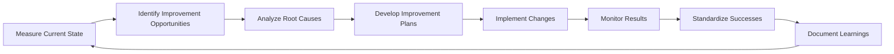
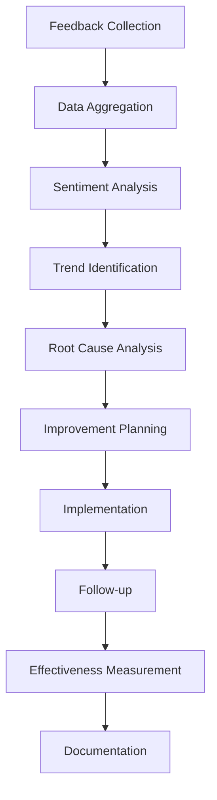

# Continuous Improvement Procedures for erlmcp v3

## Table of Contents
1. [Continuous Improvement Overview](#1-continuous-improvement-overview)
2. [Quality Management System](#2-quality-management-system)
3. [Feedback Collection Methods](#3-feedback-collection-methods)
4. [Performance Monitoring](#4-performance-monitoring)
5. [Root Cause Analysis](#5-root-cause-analysis)
6. [Improvement Process](#6-improvement-process)
7. [Change Management](#7-change-management)
8. [Knowledge Management](#8-knowledge-management)
9. [Metrics and Reporting](#9-metrics-and-reporting)
10. [Training and Development](#10-training-and-development)

## 1. Continuous Improvement Overview

### 1.1 Philosophy and Principles

**Core Principles**:
- **Customer-Centric**: Every improvement should enhance customer experience
- **Data-Driven**: Decisions based on metrics and evidence
- **Iterative Approach**: Small, continuous improvements rather than big changes
- **Collaborative**: All team members contribute to improvement ideas
- **Systematic**: Structured processes for consistent results

**Key Concepts**:
- **PDCA Cycle**: Plan-Do-Check-Act for continuous improvement
- **Kaizen**: Small, incremental improvements
- **Six Sigma**: Process variation reduction
- **Lean Principles**: Eliminate waste and optimize value flow
- **Agile**: Iterative development and adaptation

### 1.2 Continuous Improvement Framework



### 1.3 Benefits of Continuous Improvement

1. **Operational Excellence**:
   - Improved processes and procedures
   - Reduced waste and inefficiency
   - Higher quality outputs

2. **Customer Satisfaction**:
   - Better service quality
   - Faster response times
   - Enhanced customer experience

3. **Employee Engagement**:
   - Empowered team members
   - Clear goals and expectations
   - Recognition for contributions

4. **Business Growth**:
   - Competitive advantage
   - Market adaptability
   - Innovation culture

## 2. Quality Management System

### 2.1 Quality Policy

*erlmcp is committed to delivering exceptional service quality through continuous improvement, innovation, and customer focus. We measure, analyze, and enhance all processes to exceed customer expectations and maintain industry leadership.*

### 2.2 Quality Objectives

| Objective | Metric | Target | Timeline |
|-----------|--------|--------|----------|
| **Customer Satisfaction** | CSAT score | ≥ 90% | Quarterly |
| **Issue Resolution** | First contact resolution | ≥ 85% | Monthly |
| **Process Efficiency** | Resolution time reduction | -20% | 6 months |
| **Quality Compliance** | Process adherence | ≥ 95% | Monthly |
| **Innovation Rate** | Improvement implementations | ≥ 10/month | Ongoing |

### 2.3 Quality Management Structure

```
Quality Council (Executive)
├── Quality Assurance Team
│   ├── Process Owner
│   ├── Metrics Analyst
│   └── Quality Auditor
├── Improvement Teams
│   ├── Support Process Team
│   ├── Technical Quality Team
│   ├── Customer Experience Team
│   └── Operational Efficiency Team
└── Quality Champions
    └── Department Representatives
```

### 2.4 Quality Assurance Procedures

1. **Process Documentation**:
   - Document all key processes
   - Create standard operating procedures
   - Maintain process flowcharts

2. **Quality Checks**:
   - Pre-deployment testing
   - Post-implementation reviews
   - Regular audits

3. **Compliance Verification**:
   - SLA adherence checks
   - Security compliance
   - Regulatory requirements

## 3. Feedback Collection Methods

### 3.1 Feedback Channels

| Channel | Purpose | Frequency | Format |
|---------|---------|-----------|--------|
| **Post-Interaction Surveys** | Immediate feedback | After each interaction | 1-5 scale + comments |
| **Customer Interviews** | In-depth insights | Quarterly | Structured interviews |
| **Focus Groups** | Group feedback | Semi-annual | Group discussions |
| **Usage Analytics** | Behavioral insights | Continuous | Raw data analysis |
| **Social Listening** | Public sentiment | Continuous | Social media monitoring |
| **Internal Feedback** | Team insights | Monthly | Team meetings |

### 3.2 Survey Design Framework

```python
class FeedbackSurvey:
    def __init__(self, survey_type):
        self.survey_type = survey_type
        self.questions = self.generate_questions()
        self.analytics = AnalyticsEngine()

    def generate_questions(self):
        question_templates = {
            'csat': [
                {
                    'type': 'rating',
                    'question': 'How satisfied are you with our service?',
                    'scale': 1,
                    'weight': 0.4
                },
                {
                    'type': 'multiple_choice',
                    'question': 'What could we improve?',
                    'options': ['Response time', 'Technical expertise', 'Communication'],
                    'weight': 0.3
                }
            ],
            'nps': [
                {
                    'type': 'rating',
                    'question': 'How likely are you to recommend erlmcp?',
                    'scale': 10,
                    'weight': 1.0
                }
            ]
        }
        return question_templates[self.survey_type]

    def analyze_responses(self, responses):
        # Calculate scores
        scores = self.analytics.calculate_scores(responses, self.questions)

        # Identify trends
        trends = self.analytics.identify_trends(scores)

        # Generate insights
        insights = self.analytics.generate_insights(trends)

        return {
            'scores': scores,
            'trends': trends,
            'insights': insights
        }
```

### 3.3 Feedback Processing Workflow



## 4. Performance Monitoring

### 4.1 Key Performance Indicators (KPIs)

| Category | Metric | Calculation | Target | Frequency |
|----------|--------|-------------|--------|-----------|
| **Customer Experience** | CSAT | (Positive responses / Total) × 100 | ≥ 90% | Monthly |
| | First Contact Resolution | (Resolved on first contact / Total) × 100 | ≥ 85% | Weekly |
| | Customer Effort Score | (Low effort responses / Total) × 100 | ≥ 80% | Monthly |
| **Operational** | Response Time | Average time to first response | < 15 min | Daily |
| | Resolution Time | Average time to resolution | < 24 hours | Daily |
| | SLA Compliance | (SLAs met / Total SLAs) × 100 | ≥ 95% | Weekly |
| **Quality** | Error Rate | (Errors / Total interactions) × 100 | < 1% | Daily |
| | Rework Rate | (Rework cases / Total cases) × 100 | < 5% | Monthly |
| | Process Adherence | (Steps followed correctly / Total) × 100 | ≥ 95% | Weekly |

### 4.2 Real-time Monitoring Dashboard

```json
{
  "performance_dashboard": {
    "title": "erlmcp Performance Monitor",
    "refresh_interval": "5m",
    "sections": [
      {
        "name": "Customer Experience",
        "metrics": [
          {
            "id": "csat",
            "title": "Customer Satisfaction",
            "current": 92.5,
            "target": 90,
            "trend": "up",
            "change": "+2.3%",
            "data_points": [
              {"date": "2024-01", "value": 88.2},
              {"date": "2024-02", "value": 89.5},
              {"date": "2024-03", "value": 91.8},
              {"date": "2024-04", "value": 92.5}
            ]
          },
          {
            "id": "fcr",
            "title": "First Contact Resolution",
            "current": 87,
            "target": 85,
            "trend": "up",
            "change": "+3%",
            "data_points": [
              {"date": "2024-01", "value": 84},
              {"date": "2024-02", "value": 85},
              {"date": "2024-03", "value": 86},
              {"date": "2024-04", "value": 87}
            ]
          }
        ]
      },
      {
        "name": "Operational Metrics",
        "metrics": [
          {
            "id": "response_time",
            "title": "Avg Response Time",
            "current": 12.3,
            "target": 15,
            "trend": "down",
            "unit": "minutes",
            "change": "-1.2"
          },
          {
            "id": "resolution_time",
            "title": "Avg Resolution Time",
            "current": 18.7,
            "target": 24,
            "trend": "down",
            "unit": "hours",
            "change": "-2.3"
          }
        ]
      }
    ]
  }
}
```

### 4.3 Performance Analytics Engine

```python
class PerformanceAnalyzer:
    def __init__(self):
        self.baseline_data = self.load_baseline()
        self.trend_detector = TrendDetector()
        self.anomaly_detector = AnomalyDetector()

    def analyze_performance(self, current_data):
        """Analyze current performance against baselines and targets"""
        analysis = {
            'baseline_comparison': self.compare_to_baseline(current_data),
            'trend_analysis': self.trend_detector.detect(current_data),
            'anomalies': self.anomaly_detector.detect(current_data),
            'predictive_insights': self.generate_predictions(current_data)
        }

        # Identify improvement opportunities
        opportunities = self.identify_opportunities(analysis)

        # Generate improvement recommendations
        recommendations = self.generate_recommendations(opportunities)

        return {
            'analysis': analysis,
            'opportunities': opportunities,
            'recommendations': recommendations
        }

    def identify_opportunities(self, analysis):
        """Identify areas for improvement"""
        opportunities = []

        # Check metrics against targets
        for metric, value in analysis['baseline_comparison'].items():
            if value['current'] < value['target']:
                opportunities.append({
                    'metric': metric,
                    'gap': value['target'] - value['current'],
                    'priority': self.calculate_priority(metric, value['gap']),
                    'potential_impact': self.estimate_impact(metric)
                })

        return sorted(opportunities, key=lambda x: x['priority'], reverse=True)
```

## 5. Root Cause Analysis

### 5.1 Root Cause Analysis Methods

| Method | When to Use | Key Steps |
|--------|-------------|-----------|
| **5 Whys** | Simple problems, surface-level issues | Ask "why" 5 times |
| **Fishbone Diagram** | Complex issues, multiple potential causes | Identify categories, brainstorm causes |
| **Failure Mode Analysis** | System failures, process issues | Analyze failure modes, prioritize |
| **Pareto Analysis** | Many issues, limited resources | Identify vital few, prioritize |
| **Statistical Analysis** | Data-rich problems, performance issues | Analyze patterns, correlation |

### 5.2 5 Whys Implementation

```python
class FiveWhysAnalyzer:
    def analyze(self, problem):
        """Perform 5 Whys analysis"""
        root_causes = []
        current_problem = problem

        for iteration in range(5):
            # Ask "why"
            answer = self.ask_why(current_problem)

            # Record the answer
            root_causes.append({
                'iteration': iteration + 1,
                'problem': current_problem,
                'answer': answer
            })

            # Check if we've reached root cause
            if self.is_root_cause(answer):
                break

            # Update problem for next iteration
            current_problem = answer

        return {
            'initial_problem': problem,
            'root_causes': root_causes,
            'final_root_cause': root_causes[-1]['answer'] if root_causes else None,
            'recommended_actions': self.generate_actions(root_causes)
        }

    def ask_why(self, problem):
        """Simulate asking "why" about a problem"""
        # In practice, this would involve human input
        # Here we'll use a simple lookup for demonstration
        why_responses = {
            'system_down': 'hardware_failure',
            'hardware_failure': 'overheating',
            'overheating': 'cooling_system_failure',
            'cooling_system_failure': 'scheduled_maintenance_missed',
            'scheduled_maintenance_missed': 'automation_bug'
        }
        return why_responses.get(problem, 'unknown_cause')
```

### 5.3 Fishbone Diagram Template

```markdown
# Fishbone Diagram: Customer Complaints

## Problem: High Customer Complaint Rate (Current: 15%)

## Categories:
### 1. People
- Undertrained agents
- High turnover
- Lack of motivation
- Communication gaps

### 2. Process
- Inefficient workflows
- Unclear procedures
- Lack of documentation
- Handoff issues

### 3. Technology
- Outdated systems
- Poor integration
- Slow response times
- User interface issues

### 4. Environment
- High work volume
- Time constraints
- System complexity
- External factors

## Root Cause Analysis:
- **Primary**: Inefficient workflows
- **Contributing**: Undertrained agents, System complexity
- **Action**: Streamline processes, Implement training program
```

## 6. Improvement Process

### 6.1 PDCA (Plan-Do-Check-Act) Cycle Implementation

```python
class PDCAImprovementCycle:
    def __init__(self):
        self.improvement_repository = ImprovementRepository()
        self.metrics_tracker = MetricsTracker()

    def run_improvement_cycle(self, improvement_area):
        """Execute a full PDCA cycle"""
        # Phase 1: Plan
        plan = self.plan_improvement(improvement_area)

        # Phase 2: Do
        results = self.implement_improvement(plan)

        # Phase 3: Check
        evaluation = self.check_results(results, plan)

        # Phase 4: Act
        action_items = self.act_on_results(evaluation)

        # Store in repository
        self.improvement_repository.store_cycle({
            'area': improvement_area,
            'plan': plan,
            'results': results,
            'evaluation': evaluation,
            'actions': action_items
        })

        return {
            'plan': plan,
            'results': results,
            'evaluation': evaluation,
            'actions': action_items
        }

    def plan_improvement(self, area):
        """Plan the improvement initiative"""
        # Analyze current state
        current_state = self.metrics_tracker.get_current_metrics(area)

        # Define desired state
        desired_state = self.define_desired_state(area)

        # Identify gap
        gap = self.calculate_gap(current_state, desired_state)

        # Generate improvement options
        options = self.generate_improvement_options(gap)

        # Select best option
        selected_option = self.select_best_option(options)

        # Create implementation plan
        implementation_plan = self.create_implementation_plan(selected_option)

        return {
            'current_state': current_state,
            'desired_state': desired_state,
            'gap': gap,
            'selected_option': selected_option,
            'implementation_plan': implementation_plan
        }
```

### 6.2 Improvement Prioritization Framework

```yaml
Improvement Prioritization Framework:
  Scoring Criteria:
    - Impact (Weight: 40%): How much will this improve the situation?
    - Urgency (Weight: 30%): How quickly does this need to be addressed?
    - Effort (Weight: 20%): How much effort/resources required?
    - Strategic Alignment (Weight: 10%): How well does this align with goals?

  Scoring Scale:
    1 = Low, 3 = Medium, 5 = High

  Decision Matrix:
    | Priority | Impact | Urgency | Effort | Alignment | Total |
    |----------|--------|---------|--------|------------|-------|
    | Critical | 5      | 5       | 3      | 5         | 4.6   |
    | High     | 5      | 3       | 3      | 3         | 3.8   |
    | Medium   | 3      | 3       | 3      | 3         | 3.0   |
    | Low      | 3      | 1       | 5      | 1         | 2.5   |
```

### 6.3 Implementation Roadmap Template

```markdown
# Improvement Implementation Roadmap

## Initiative: [Initiative Name]

### Background
[Brief description of the problem and opportunity]

### Goals and Objectives
- [Specific, measurable goals]
- [Key outcomes expected]

### Current State Assessment
- [Metrics as they are now]
- [Processes as they are now]
- [Customer experience as it is now]

### Desired Future State
- [Metrics after improvement]
- [Processes after improvement]
- [Customer experience after improvement]

### Implementation Plan
#### Phase 1: Preparation (Weeks 1-2)
- [ ] Task 1: [Details]
- [ ] Task 2: [Details]
- [ ] Deliverable: [What will be produced]

#### Phase 2: Development (Weeks 3-6)
- [ ] Task 1: [Details]
- [ ] Task 2: [Details]
- [ ] Deliverable: [What will be produced]

#### Phase 3: Testing (Weeks 7-8)
- [ ] Task 1: [Details]
- [ ] Task 2: [Details]
- [ ] Deliverable: [What will be produced]

#### Phase 4: Deployment (Week 9)
- [ ] Task 1: [Details]
- [ ] Task 2: [Details]
- [ ] Deliverable: [What will be produced]

### Metrics and Measurement
- Success metrics: [Specific metrics to measure]
- Measurement method: [How to measure]
- Timeline: [When to measure]

### Risk Management
- Risk 1: [Description, likelihood, impact, mitigation]
- Risk 2: [Description, likelihood, impact, mitigation]

### Resource Requirements
- Personnel: [Roles and responsibilities]
- Budget: [Cost estimates]
- Technology: [Tools needed]

### Timeline
- Start date: [Date]
- End date: [Date]
- Key milestones: [Dates]

### Stakeholder Communication
- [Who needs to be informed]
- [Communication plan]
```

## 7. Change Management

### 7.1 Change Management Framework

```python
class ChangeManager:
    def __init__(self):
        self.stakeholders = StakeholderRegistry()
        self.communication = CommunicationManager()
        self.training = TrainingManager()
        self.monitoring = ChangeMonitoring()

    def implement_change(self, change_initiative):
        """Implement a change initiative following ADKAR model"""
        # Awareness: Create awareness of need for change
        self.create_awareness(change_initiative)

        # Desire: Build desire to participate and support
        self.build_desire(change_initiative)

        # Knowledge: Provide knowledge about how to change
        self.provide_knowledge(change_initiative)

        # Ability: Build ability to implement new skills and behaviors
        self.build_ability(change_initiative)

        # Reinforcement: Reinforce change to sustain it
        self.reinforce_change(change_initiative)

        return {
            'status': 'implemented',
            'adkar_scores': self.measure_adkar(change_initiative),
            'next_steps': self.plan_next_steps(change_initiative)
        }

    def create_awareness(self, initiative):
        """Create awareness of the need for change"""
        # Identify stakeholders
        stakeholders = self.stakeholders.get_affected_stakeholders(initiative)

        # Craft change message
        message = self.craft_change_message(initiative)

        # Communicate change
        self.communication.communicate_to_stakeholders(stakeholders, message)

        # Address concerns
        self.address_initial_concerns(stakeholders)

    def craft_change_message(self, initiative):
        """Craft effective change communication"""
        return {
            'what': initiative['description'],
            'why': initiative['rationale'],
            'benefits': initiative['benefits'],
            'timeline': initiative['timeline'],
            'impact': initiative['impact'],
            'support_available': initiative['support']
        }
```

### 7.2 Change Impact Assessment

| Impact Area | Assessment Criteria | Mitigation Strategy |
|-------------|-------------------|-------------------|
| **Technical** | System compatibility, performance, security | Phased rollout, testing, backups |
| **Process** | Workflow changes, efficiency gains, new procedures | Training, documentation, support |
| **People** | Skills requirements, resistance, adoption | Communication, training, incentives |
| **Business** | ROI, timeline, competitive advantage | Clear metrics, stakeholder alignment |
| **Customer** | Experience changes, service levels, communication | Clear communication, minimal disruption |

### 7.3 Resistance Management

```yaml
Resistance Management Strategies:
  Common Resistance Types:
    - Fear of the unknown
    - Loss of control
    - Extra effort required
    - Past negative experiences
    - Misunderstanding the change

  Mitigation Approaches:
    - Education: Explain the "why" and benefits
    - Involvement: Include employees in planning
    - Support: Provide resources and training
    - Communication: Regular, transparent updates
    - Incentives: Rewards for adoption

  Resistance Management Process:
    1. Identify potential resistors
    2. Understand their concerns
    3. Address concerns proactively
    4. Monitor resistance levels
    5. Adjust approach as needed
```

## 8. Knowledge Management

### 8.1 Knowledge Management System

```python
class KnowledgeManager:
    def __init__(self):
        self.knowledge_base = KnowledgeBase()
        self.expert_network = ExpertNetwork()
        self.learning_paths = LearningPathManager()

    def capture_improvement_knowledge(self, improvement_cycle):
        """Capture knowledge from improvement cycles"""
        # Extract lessons learned
        lessons = self.extract_lessons(improvement_cycle)

        # Create knowledge artifacts
        artifacts = self.create_knowledge_artifacts(lessons)

        # Store in knowledge base
        self.knowledge_base.store_artifacts(artifacts)

        # Update expert network
        self.expert_network.update_expertise(lessons)

        # Update learning paths
        self.learning_paths.update_paths(lessons)

        return {
            'captured_lessons': lessons,
            'created_artifacts': artifacts,
            'impact': self.estimate_knowledge_impact(artifacts)
        }

    def create_knowledge_artifacts(self, lessons):
        """Create various knowledge artifacts"""
        artifacts = []

        # Create best practice guides
        if lessons['best_practices']:
            artifacts.append({
                'type': 'best_practice',
                'content': lessons['best_practices'],
                'target_audience': 'all_team_members'
            })

        # Create troubleshooting guides
        if lessons['troubleshooting']:
            artifacts.append({
                'type': 'troubleshooting_guide',
                'content': lessons['troubleshooting'],
                'target_audience': 'technical_team'
            })

        # Create process documentation
        if lessons['process_improvements']:
            artifacts.append({
                'type': 'process_documentation',
                'content': lessons['process_improvements'],
                'target_audience': 'process_owners'
            })

        # Create training materials
        if lessons['training_needs']:
            artifacts.append({
                'type': 'training_material',
                'content': lessons['training_needs'],
                'target_audience': 'training_team'
            })

        return artifacts
```

### 8.2 Lessons Learned Template

```markdown
# Lessons Learned Report

## Initiative: [Initiative Name]
## Date: [Date]
## Facilitator: [Name]

### Background
[Brief description of the initiative and context]

### What Went Well
- [Specific positive outcomes]
- [Success factors]
- [Unexpected successes]

### Challenges and Issues
- [Specific challenges faced]
- [Root causes of challenges]
- [Impact of challenges]

### Key Insights and Learnings
1. **Learning 1**: [Specific insight with context]
2. **Learning 2**: [Specific insight with context]
3. **Learning 3**: [Specific insight with context]

### Recommendations for Future Initiatives
- [Specific recommendation 1]
- [Specific recommendation 2]
- [Specific recommendation 3]

### Action Items
| ID | Description | Owner | Due Date | Status |
|----|-------------|-------|----------|--------|
| 1 | [Action item] | [Name] | [Date] | [Status] |

### Verification
[How we'll verify the lessons are applied]
```

### 8.3 Knowledge Sharing Strategies

| Strategy | Description | Implementation |
|----------|-------------|----------------|
| **Lessons Learned Sessions** | Regular meetings to share insights | Monthly team meetings |
| **Best Practice Repository** | Centralized knowledge base | Wiki with search functionality |
| **Mentoring Program** | Pairing experts with learners | Structured mentoring pairs |
| **Communities of Practice** | Interest-based knowledge sharing | Regular meetups, online forums |
| **Documentation Standards** | Consistent documentation practices | Template system, review process |
| **Knowledge Transfer Protocol** | Standardized handoff procedures | Checklists, verification steps |

## 9. Metrics and Reporting

### 9.1 Metrics Dashboard Design

```json
{
  "improvement_dashboard": {
    "title": "Continuous Improvement Metrics",
    "sections": [
      {
        "name": "Initiative Tracking",
        "metrics": [
          {
            "id": "active_initiatives",
            "title": "Active Improvement Initiatives",
            "current": 15,
            "target": 20,
            "trend": "on_track",
            "change": "+3 this month"
          },
          {
            "id": "completion_rate",
            "title": "Initiative Completion Rate",
            "current": 85,
            "target": 90,
            "trend": "improving",
            "change": "+5%"
          }
        ]
      },
      {
        "name": "Performance Impact",
        "metrics": [
          {
            "id": "csat_improvement",
            "title": "CSAT Improvement",
            "current": +8.5,
            "target": +10,
            "trend": "positive",
            "baseline_q1": 82.3,
            "current_q4": 90.8
          },
          {
            "id": "efficiency_gain",
            "title": "Process Efficiency Gain",
            "current": 23,
            "target": 25,
            "trend": "positive",
            "unit": "percent"
          }
        ]
      },
      {
        "name": "Quality Metrics",
        "metrics": [
          {
            "id": "rework_rate",
            "title": "Rework Rate",
            "current": 3.2,
            "target": < 5,
            "trend": "improving",
            "change": "-1.8%"
          },
          {
            "id": "compliance_rate",
            "title": "Process Compliance",
            "current": 96.5,
            "target": 95,
            "trend": "exceeding",
            "change": "+2.3%"
          }
        ]
      }
    ]
  }
}
```

### 9.2 Reporting Schedule

| Report Type | Frequency | Purpose | Audience |
|-------------|-----------|---------|----------|
| **Executive Summary** | Monthly | High-level overview | Executive team |
| **Department Performance** | Weekly | Department-specific metrics | Department heads |
| **Initiative Progress** | Bi-weekly | Project status updates | Project managers |
| **Quality Metrics** | Daily | Quality performance tracking | Quality team |
| **Customer Feedback** | Weekly | Customer insights | Support team |
| **Learning Summary** | Monthly | Knowledge sharing | All employees |

### 9.3 Continuous Improvement Metrics

| Category | Metric | Target | Frequency | Reporting |
|----------|--------|--------|-----------|-----------|
| **Initiative Management** | Active initiatives | 10-15 | Monthly | Initiative tracker |
| | Completion rate | > 80% | Monthly | Completion report |
| | On-time delivery | > 90% | Weekly | Timeline report |
| **Performance Impact** | Customer satisfaction | > 90% | Monthly | CSAT report |
| | Resolution time | < 24h | Daily | Performance dashboard |
| | Error rate | < 1% | Daily | Quality metrics |
| **Quality and Compliance** | Process adherence | > 95% | Weekly | Audit report |
| | Quality score | > 90% | Monthly | Quality index |
| | Compliance rate | 100% | Monthly | Compliance report |
| **Learning and Innovation** | Knowledge sharing rate | > 70% | Monthly | Learning metrics |
| | Innovation ideas | > 10/month | Monthly | Innovation pipeline |
| | Training completion | > 90% | Quarterly | Training report |

## 10. Training and Development

### 10.1 Continuous Learning Program

```python
class ContinuousLearningProgram:
    def __init__(self):
        self.learning_catalog = LearningCatalog()
        self.skill_assessment = SkillAssessment()
        self.learning_path_generator = LearningPathGenerator()
        self.training_tracker = TrainingTracker()

    def create_personalized_learning_path(self, employee):
        """Create personalized learning path based on role and skill gaps"""
        # Assess current skills
        current_skills = self.skill_assessment.assess_skills(employee)

        # Identify skill gaps
        skill_gaps = self.skill_assessment.identify_gaps(
            current_skills,
            employee['role_requirements']
        )

        # Generate learning path
        learning_path = self.learning_path_generator.generate(
            employee['id'],
            skill_gaps,
            employee['learning_preferences']
        )

        # Track enrollment
        self.training_tracker.enroll_in_learning_path(
            employee['id'],
            learning_path
        )

        return {
            'current_skills': current_skills,
            'skill_gaps': skill_gaps,
            'learning_path': learning_path,
            'estimated_completion': self.estimate_completion_time(learning_path)
        }

    def generate_improvement_learning_materials(self, improvement_area):
        """Generate learning materials for improvement initiatives"""
        # Analyze improvement content
        content_analysis = self.analyze_improvement_content(improvement_area)

        # Identify learning needs
        learning_needs = self.identify_learning_needs(content_analysis)

        # Create learning modules
        modules = self.create_learning_modules(learning_needs)

        # Create assessment materials
        assessments = self.create_assessments(learning_needs)

        return {
            'modules': modules,
            'assessments': assessments,
            'estimated_duration': self.estimate_total_duration(modules),
            'target_audience': self.identify_target_audience(improvement_area)
        }
```

### 10.2 Skill Development Framework

| Skill Category | Current Level | Target Level | Development Activities |
|----------------|--------------|--------------|------------------------|
| **Technical Skills** | | | |
| System Administration | Advanced | Expert | Advanced certification, mentorship |
| Troubleshooting | Professional | Expert | Complex scenarios, real-world practice |
| Security | Intermediate | Advanced | Security certification, ethical hacking |
| **Process Skills** | | | |
| Problem Solving | Professional | Expert | Root cause analysis training, case studies |
| Process Improvement | Intermediate | Advanced | Lean Six Sigma, change management |
| Project Management | Basic | Professional | PMP certification, practical experience |
| **Soft Skills** | | | |
| Communication | Advanced | Expert | Advanced training, public speaking |
| Leadership | Intermediate | Advanced | Leadership development program |
| Customer Focus | Advanced | Expert | Customer experience training |

### 10.3 Knowledge Transfer Process

1. **Identify Knowledge Gaps**:
   - Assess team capabilities
   - Identify missing skills
   - Determine priority areas

2. **Capture Knowledge**:
   - Document best practices
   - Record lessons learned
   - Create standard procedures

3. **Transfer Knowledge**:
   - Training sessions
   - Mentoring programs
   - Documentation distribution
   - Workshops and simulations

4. **Verify Transfer**:
   - Knowledge assessments
   - Practical demonstrations
   - Performance evaluation
   - Feedback collection

5. **Sustain Knowledge**:
   - Regular refreshers
   - Update materials
   - Share new insights
   - Continuous improvement

## 11. Conclusion

Continuous improvement is not just a process—it's a mindset and culture that drives excellence in everything we do. By implementing these procedures, erlmcp v3 will establish a systematic approach to identifying improvement opportunities, implementing changes, and measuring results.

The key to success lies in:
- **Data-driven decision making**
- **Active participation from all team members**
- **Regular measurement and feedback**
- **Celebrating successes and learning from failures**
- **Aligning improvement efforts with strategic goals**

With these procedures in place, erlmcp v3 will continuously enhance its services, improve customer satisfaction, and maintain its position as a leader in the industry.